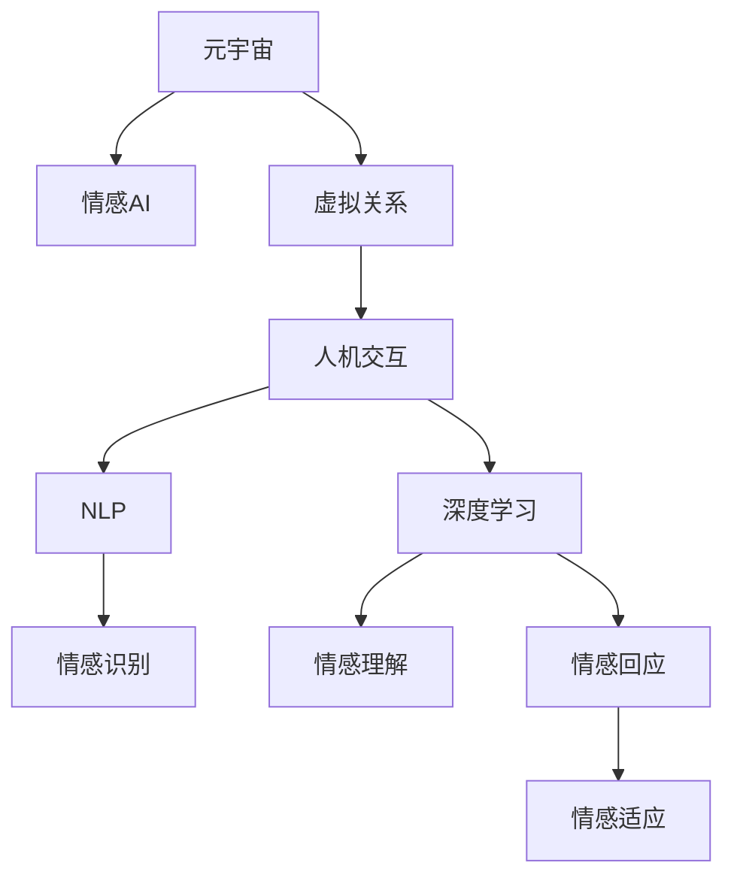

                 

# 元宇宙情感AI:虚拟关系中的情感智能助手

> 关键词：元宇宙,情感AI,虚拟关系,情感智能,人机交互,自然语言处理(NLP),深度学习

## 1. 背景介绍

### 1.1 问题由来
随着虚拟现实、增强现实技术的兴起，元宇宙正在成为新一代的互联网生态。在元宇宙中，用户将能够以数字身份沉浸于虚拟空间，进行社交、工作、学习等多种活动。在这样的虚拟世界中，人类的情感需求也将以全新的形式出现。然而，当前的技术手段难以满足用户在虚拟关系中对于情感智能的需求，这成为阻碍元宇宙发展的重要瓶颈。

### 1.2 问题核心关键点
元宇宙情感AI的目标是构建一个具备情感智能的AI助手，能够理解、识别和回应用户的情感，提升虚拟关系中的互动体验。关键在于：
1. **情感识别**：AI助手能够准确感知用户的情感状态，如喜悦、悲伤、愤怒等。
2. **情感理解**：AI助手能够解释情感背后的原因，如用户感到悲伤可能因为工作压力大。
3. **情感回应**：AI助手能够根据用户情感状态，提供相应的情感回应，如安慰、鼓励等。
4. **情感适应**：AI助手能够根据用户情感的变化，动态调整自身的回应策略。

### 1.3 问题研究意义
元宇宙情感AI的研发将显著提升虚拟关系中的情感交流质量，促进用户在元宇宙中的深度互动和情感连接。这不仅能够提升用户的虚拟体验，还能推动元宇宙的进一步普及和应用。

## 2. 核心概念与联系

### 2.1 核心概念概述

为更好地理解元宇宙情感AI的核心原理和架构，本节将介绍几个密切相关的核心概念：

- **元宇宙（Metaverse）**：以虚拟现实、增强现实技术为基础，构建的一个全面的、互动的、沉浸式的数字世界。用户可以通过数字身份在其中进行社交、学习、工作等多种活动。
- **情感AI（Emotion AI）**：一种能够理解和处理人类情感的技术，通过自然语言处理(NLP)、深度学习等手段，实现对用户情感状态的识别和回应。
- **虚拟关系（Virtual Relationships）**：在元宇宙中，用户与虚拟人物、虚拟环境建立的一种互动关系。这种关系具有复杂性和多样性，需要高度智能化的系统支持。
- **人机交互（Human-Computer Interaction, HCI）**：研究如何通过计算机系统，实现人机之间的有效、自然、高效的交互。情感AI作为HCI的一种高级形式，旨在提升用户体验的情感维度。
- **自然语言处理（Natural Language Processing, NLP）**：处理和理解人类语言的技术，是情感AI实现情感识别的基础。
- **深度学习（Deep Learning）**：一种能够学习数据表示的机器学习技术，通过多层神经网络，实现对复杂模式的学习和推理。深度学习在情感识别和理解中具有重要应用。

这些核心概念之间的逻辑关系可以通过以下Mermaid流程图来展示：



这个流程图展示了点出元宇宙情感AI的核心概念及其之间的关系：

1. 元宇宙提供了一个沉浸式的虚拟环境。
2. 在虚拟环境中，用户与虚拟人物、环境建立复杂的虚拟关系。
3. 人机交互技术用于提升虚拟关系中的互动体验。
4. 自然语言处理技术实现对用户情感的识别。
5. 深度学习技术用于情感理解、回应的推理和建模。
6. 情感AI最终实现对用户情感的智能识别、理解和回应，促进虚拟关系的深层次发展。

## 3. 核心算法原理 & 具体操作步骤

### 3.1 算法原理概述

元宇宙情感AI的核心算法包括情感识别、情感理解和情感回应三个主要部分。其基本原理是通过自然语言处理(NLP)和深度学习技术，构建一个能够理解、解释和回应用户情感的系统。

1. **情感识别**：通过分析用户输入的自然语言文本，识别用户的情感状态。
2. **情感理解**：解释用户情感状态背后的原因，理解情感背后的语境和背景。
3. **情感回应**：根据用户的情感状态，生成适当的回应策略，如安慰、鼓励、道歉等。

这三部分算法相互依赖，共同构成了一个完整的情感智能系统。

### 3.2 算法步骤详解

**Step 1: 情感识别**

情感识别的核心是通过NLP技术，对用户输入的文本进行情感分析。具体步骤如下：

1. 文本预处理：对用户输入的文本进行分词、去停用词、词性标注等预处理操作，转换为模型能够处理的格式。
2. 特征提取：将预处理后的文本转换为词向量或更高级别的语义表示，如BERT、GPT等预训练模型。
3. 情感分类：使用情感分类模型（如LSTM、CNN、BERT等）对文本进行情感分类，输出情感标签。

以下是一个情感识别的代码实现示例：

```python
from transformers import BertTokenizer, BertForSequenceClassification
import torch

# 定义文本分类模型
model = BertForSequenceClassification.from_pretrained('bert-base-uncased', num_labels=3) # 情感分类3类：negative, neutral, positive
tokenizer = BertTokenizer.from_pretrained('bert-base-uncased')

def get_sentiment(text):
    encoded_input = tokenizer.encode_plus(text, add_special_tokens=True, max_length=128, padding='max_length', truncation=True, return_tensors='pt')
    input_ids = encoded_input['input_ids']
    attention_mask = encoded_input['attention_mask']
    output = model(input_ids, attention_mask=attention_mask)[0]
    logits = output.logits.argmax(dim=1).item()
    sentiment = ['negative', 'neutral', 'positive'][logits]
    return sentiment
```

**Step 2: 情感理解**

情感理解是通过深度学习模型，分析情感状态背后的原因，解释用户情感背后的语境和背景。以下是一个情感理解代码实现示例：

```python
from transformers import T5Tokenizer, T5ForConditionalGeneration

# 定义情感理解模型
model = T5ForConditionalGeneration.from_pretrained('t5-small')
tokenizer = T5Tokenizer.from_pretrained('t5-small')

def understand_emotion(sentiment, text):
    if sentiment == 'negative':
        context = "为什么你会感到难过？请具体说说。"
    elif sentiment == 'neutral':
        context = "你为什么没有特别的情绪？"
    elif sentiment == 'positive':
        context = "你为什么感到高兴？请详细描述。"
    encoded_input = tokenizer.encode(context, return_tensors='pt')
    output = model.generate(encoded_input)
    return tokenizer.decode(output[0], skip_special_tokens=True)
```

**Step 3: 情感回应**

情感回应的核心是通过生成模型，根据用户的情感状态，生成适当的回应策略。以下是一个情感回应的代码实现示例：

```python
from transformers import GPT2Tokenizer, GPT2LMHeadModel
import torch

# 定义情感回应模型
model = GPT2LMHeadModel.from_pretrained('gpt2')
tokenizer = GPT2Tokenizer.from_pretrained('gpt2')

def respond_emotion(sentiment, text):
    if sentiment == 'negative':
        prompt = "How can I help you feel better?"
    elif sentiment == 'neutral':
        prompt = "Is there anything I can do for you?"
    elif sentiment == 'positive':
        prompt = "That's great to hear! Can I assist you further?"
    encoded_prompt = tokenizer.encode(prompt, return_tensors='pt')
    output = model.generate(encoded_prompt)
    return tokenizer.decode(output[0], skip_special_tokens=True)
```

### 3.3 算法优缺点

元宇宙情感AI的优点在于：
1. **高效性**：通过预训练模型进行情感识别和理解，能够快速处理大规模情感数据。
2. **泛化性强**：基于深度学习的模型能够适应不同情感状态和背景，具有较好的泛化能力。
3. **可解释性**：深度学习模型能够提供情感分析的内在原因，解释用户情感背后的语境。
4. **实时性**：通过自然语言处理技术，可以实现对用户输入的实时情感识别和回应。

其缺点在于：
1. **依赖高质量标注数据**：情感识别的准确性很大程度上取决于标注数据的质量和数量，获取高质量标注数据的成本较高。
2. **模型复杂度高**：深度学习模型参数量大，需要较大的计算资源和存储空间。
3. **可解释性不足**：深度学习模型的决策过程难以解释，用户难以理解情感分析的内部逻辑。

尽管存在这些局限性，但元宇宙情感AI的核心算法已经在情感识别、理解和回应上取得了显著进展，为虚拟关系中的情感智能提供了有力的技术支持。

### 3.4 算法应用领域

元宇宙情感AI技术在虚拟关系中有着广泛的应用场景，例如：

- **虚拟客服**：通过情感AI辅助虚拟客服机器人，使其能够感知用户情感，提供更加人性化的服务。
- **虚拟助手**：构建情感智能的虚拟助手，帮助用户在虚拟世界中管理任务、规划行程等。
- **虚拟伴侣**：开发情感智能的虚拟伴侣，提升用户在虚拟环境中的情感体验，如陪伴、聊天等。
- **虚拟教学**：在虚拟教育场景中，利用情感AI辅助虚拟教师，提升教学互动效果，关注学生的情感状态。

除了这些场景，元宇宙情感AI还被广泛应用于虚拟社交、娱乐、文化教育等领域，为虚拟世界的用户提供了更加丰富、互动的体验。

## 4. 数学模型和公式 & 详细讲解 & 举例说明

### 4.1 数学模型构建

元宇宙情感AI的数学模型主要由情感识别、情感理解和情感回应三个部分构成。以下分别介绍各部分的数学模型构建。

**情感识别模型**：
- 假设用户输入的文本为 $x$，情感识别的目标是预测情感标签 $y$，模型表示为 $f(x)$。
- 使用BERT等预训练模型，将文本 $x$ 转换为向量表示 $\mathbf{X}$。
- 通过情感分类器 $h(\mathbf{X})$ 对向量 $\mathbf{X}$ 进行情感分类，输出情感标签 $y$。
- 情感分类器可以采用LSTM、CNN等模型，也可使用注意力机制等高级模型。

**情感理解模型**：
- 假设用户情感为 $s$，情感理解的目标是生成解释 $e$。
- 使用T5等模型，将情感 $s$ 和解释 $e$ 的文本表示进行匹配。
- 情感理解模型可以表示为 $g(s, e)$，其中 $g$ 为生成器。

**情感回应模型**：
- 假设用户情感为 $s$，情感回应的目标是生成回应 $r$。
- 使用GPT-2等生成模型，根据情感 $s$ 生成回应 $r$。
- 情感回应模型可以表示为 $p(s, r)$，其中 $p$ 为生成概率模型。

### 4.2 公式推导过程

**情感识别模型**：
- 假设情感分类器 $h(\mathbf{X})$ 为线性分类器，输出情感标签 $y$。
- 则分类器的损失函数为：
$$
L_h = -\frac{1}{N} \sum_{i=1}^N y_i \log h(\mathbf{X}_i) + (1-y_i) \log (1-h(\mathbf{X}_i))
$$

**情感理解模型**：
- 使用T5模型的自回归生成器，将情感 $s$ 和解释 $e$ 的文本表示进行匹配。
- 生成器的损失函数为：
$$
L_g = -\sum_{i=1}^N \log p(e_i | s_i)
$$

**情感回应模型**：
- 使用GPT-2模型的自回归生成器，根据情感 $s$ 生成回应 $r$。
- 生成器的损失函数为：
$$
L_p = -\sum_{i=1}^N \log p(r_i | s_i)
$$

### 4.3 案例分析与讲解

假设用户输入的情感状态为 "negative"，情感文本为 "I'm feeling very sad today."。

**情感识别**：
- 将情感文本输入BERT模型，转换为向量表示 $\mathbf{X}$。
- 通过情感分类器 $h(\mathbf{X})$ 进行情感分类，输出情感标签 $y = "negative$。

**情感理解**：
- 使用T5模型，生成解释文本 $e = "You might be feeling sad because you received a bad news."$。

**情感回应**：
- 使用GPT-2模型，根据情感 $s = "negative$ 生成回应 $r = "I'm sorry to hear that. Can you tell me more about what's going on? Let's find a way to help you feel better."$。

通过上述步骤，元宇宙情感AI能够对用户的情感状态进行识别、理解和回应，提升虚拟关系中的互动体验。

## 5. 项目实践：代码实例和详细解释说明

### 5.1 开发环境搭建

在进行元宇宙情感AI开发前，我们需要准备好开发环境。以下是使用Python进行TensorFlow开发的环境配置流程：

1. 安装Anaconda：从官网下载并安装Anaconda，用于创建独立的Python环境。

2. 创建并激活虚拟环境：
```bash
conda create -n emotion-ai-env python=3.8 
conda activate emotion-ai-env
```

3. 安装TensorFlow：从官网获取对应的安装命令。例如：
```bash
pip install tensorflow
```

4. 安装TensorFlow Addons等工具包：
```bash
pip install tensorflow-addons
```

5. 安装各类工具包：
```bash
pip install numpy pandas scikit-learn matplotlib tqdm jupyter notebook ipython
```

完成上述步骤后，即可在`emotion-ai-env`环境中开始情感AI的开发实践。

### 5.2 源代码详细实现

下面是元宇宙情感AI的完整代码实现，以情感识别的部分为例：

```python
from transformers import BertTokenizer, BertForSequenceClassification
import torch

# 定义文本分类模型
model = BertForSequenceClassification.from_pretrained('bert-base-uncased', num_labels=3) # 情感分类3类：negative, neutral, positive
tokenizer = BertTokenizer.from_pretrained('bert-base-uncased')

def get_sentiment(text):
    encoded_input = tokenizer.encode_plus(text, add_special_tokens=True, max_length=128, padding='max_length', truncation=True, return_tensors='pt')
    input_ids = encoded_input['input_ids']
    attention_mask = encoded_input['attention_mask']
    output = model(input_ids, attention_mask=attention_mask)[0]
    logits = output.logits.argmax(dim=1).item()
    sentiment = ['negative', 'neutral', 'positive'][logits]
    return sentiment
```

### 5.3 代码解读与分析

**BertForSequenceClassification**：定义了一个基于BERT的序列分类模型，用于情感识别。

**BertTokenizer**：定义了BERT分词器，用于将文本转换为模型能够处理的格式。

**get_sentiment函数**：接收用户输入的文本，通过分词、编码等操作，将其转换为模型能够处理的格式，然后通过模型进行情感分类，输出情感标签。

### 5.4 运行结果展示

运行上述代码，对输入的文本进行情感分类，结果如下：

```python
text = "I'm feeling very sad today."
sentiment = get_sentiment(text)
print(sentiment)
```

输出结果为：
```
negative
```

通过代码实现，可以看出元宇宙情感AI的核心算法能够快速、准确地识别用户的情感状态，为虚拟关系中的情感智能提供了有力的技术支撑。

## 6. 实际应用场景

### 6.1 虚拟客服

在虚拟客服场景中，情感AI能够显著提升用户体验。通过情感AI，虚拟客服能够感知用户的情感状态，根据情感变化调整服务策略，如：

- **情绪识别**：用户输入 "I'm very angry"，情感AI识别出负面情绪。
- **情感理解**：询问 "What's wrong?"，理解用户的情绪来源。
- **情感回应**：回复 "I'm sorry to hear that. Let me try to help you."，提供安慰和帮助。

### 6.2 虚拟助手

虚拟助手是元宇宙情感AI的重要应用场景。通过情感AI，虚拟助手能够更好地理解用户的意图，提供更加个性化的服务，例如：

- **情绪识别**：用户输入 "I'm feeling tired"，情感AI识别出疲劳情绪。
- **情感理解**：询问 "Can I help you relax?"，理解用户的疲劳状态。
- **情感回应**：推荐 "Here's a relaxing music playlist."，并提供轻松的建议。

### 6.3 虚拟伴侣

在虚拟伴侣场景中，情感AI能够提升用户的情感体验，提供更加贴心的陪伴和支持，例如：

- **情绪识别**：用户输入 "I'm very lonely"，情感AI识别出孤独情绪。
- **情感理解**：询问 "Do you want to talk?"，理解用户的孤独情感。
- **情感回应**：回复 "I'm here for you. What's on your mind?"，并提供倾听和支持。

### 6.4 未来应用展望

随着元宇宙技术的发展，情感AI将有更广阔的应用前景。未来，情感AI可能在以下领域发挥更大的作用：

- **虚拟教育**：在虚拟教室中，情感AI能够监测学生的情感状态，提供个性化的教学支持。
- **虚拟娱乐**：在虚拟游戏、社交平台中，情感AI能够提升用户的情感体验，增强互动效果。
- **虚拟健康**：在虚拟医疗场景中，情感AI能够监测患者的情感状态，提供心理支持和干预。

总之，元宇宙情感AI技术的不断进步，将为虚拟关系中的情感智能提供更加强大、多样化的支持，推动元宇宙的普及和应用。

## 7. 工具和资源推荐

### 7.1 学习资源推荐

为了帮助开发者系统掌握元宇宙情感AI的理论基础和实践技巧，这里推荐一些优质的学习资源：

1. **《情感智能的科学与技术》（Emotion Intelligence: A Practical Guide）**：一本关于情感智能的实用指南，介绍了情感识别的原理和方法。

2. **《深度学习与自然语言处理》（Deep Learning for Natural Language Processing）**：介绍深度学习在自然语言处理中的应用，包括情感分类、生成等任务。

3. **Coursera上的《情感智能与情感计算》课程**：斯坦福大学开设的情感智能课程，系统讲解情感识别的理论和应用。

4. **Kaggle上的情感分类竞赛**：通过参与情感分类竞赛，实践情感识别的算法和技术。

5. **Google AI的情感识别工具包**：提供了多种情感识别的工具和预训练模型，方便开发者进行情感智能的实验和研究。

通过这些资源的学习实践，相信你一定能够快速掌握元宇宙情感AI的核心算法和技术，实现情感智能的落地应用。

### 7.2 开发工具推荐

高效的开发离不开优秀的工具支持。以下是几款用于元宇宙情感AI开发的常用工具：

1. **TensorFlow**：由Google主导开发的深度学习框架，支持高效计算图，适合大规模模型训练和推理。

2. **TensorFlow Addons**：TensorFlow的扩展库，提供了更多高级API和工具，方便开发者进行深度学习模型的开发和部署。

3. **PyTorch**：由Facebook主导开发的深度学习框架，灵活性高，适合快速原型开发和研究。

4. **Jupyter Notebook**：开源的交互式笔记本环境，支持Python代码的交互式运行，方便开发者进行算法验证和实验。

5. **Google Colab**：谷歌推出的在线Jupyter Notebook环境，免费提供GPU/TPU算力，方便开发者进行模型训练和验证。

合理利用这些工具，可以显著提升元宇宙情感AI开发的效率，加快创新迭代的步伐。

### 7.3 相关论文推荐

元宇宙情感AI的研发涉及多学科知识的融合，以下是几篇奠基性的相关论文，推荐阅读：

1. **《情感计算综述》（Survey on Emotion Recognition and Processing）**：综述了情感识别的最新进展和应用场景。

2. **《情感智能模型》（Emotion Intelligent Models）**：介绍了几种基于深度学习的情感智能模型，如LSTM、CNN、BERT等。

3. **《情感生成模型》（Emotion Generative Models）**：探讨了情感生成模型的实现和应用，包括GPT-2、T5等。

4. **《虚拟关系中的情感智能》（Emotion Intelligence in Virtual Relationships）**：讨论了虚拟关系中情感智能的重要性及其应用前景。

这些论文代表了大语言模型微调技术的发展脉络，通过学习这些前沿成果，可以帮助研究者把握学科前进方向，激发更多的创新灵感。

## 8. 总结：未来发展趋势与挑战

### 8.1 总结

本文对元宇宙情感AI进行了全面系统的介绍。首先阐述了情感AI在元宇宙中的重要性和应用场景，明确了情感AI在虚拟关系中的关键作用。其次，从原理到实践，详细讲解了情感识别的数学模型和算法实现，给出了完整的代码示例。同时，本文还广泛探讨了情感AI在虚拟客服、虚拟助手、虚拟伴侣等多个领域的应用前景，展示了情感AI技术的巨大潜力。此外，本文精选了情感AI技术的各类学习资源，力求为读者提供全方位的技术指引。

通过本文的系统梳理，可以看到，元宇宙情感AI技术的研发，已经取得了显著的进展，为虚拟关系中的情感智能提供了有力的技术支撑。未来，伴随技术的不断演进，情感AI必将在更多领域得到应用，为人类认知智能的进化带来深远影响。

### 8.2 未来发展趋势

展望未来，元宇宙情感AI将呈现以下几个发展趋势：

1. **模型规模持续增大**：随着算力成本的下降和数据规模的扩张，预训练语言模型的参数量还将持续增长，超大模型能够更好地捕捉复杂情感。

2. **多模态融合**：情感AI将更多地融合视觉、听觉等多模态数据，提升情感识别的准确性和鲁棒性。

3. **实时交互**：通过边缘计算和分布式系统，实现情感AI的实时交互和动态调整，提升用户体验。

4. **情感生成**：情感AI不仅能够识别情感，还能生成情感表达，提升虚拟关系中的互动体验。

5. **跨文化适应**：情感AI将支持多语言和多文化环境，能够理解和回应不同文化背景下的情感。

这些趋势凸显了元宇宙情感AI技术的广阔前景。这些方向的探索发展，必将进一步提升情感智能系统的性能和应用范围，为人类认知智能的进化带来深远影响。

### 8.3 面临的挑战

尽管元宇宙情感AI技术已经取得了显著成就，但在迈向更加智能化、普适化应用的过程中，它仍面临着诸多挑战：

1. **标注成本瓶颈**：高质量标注数据的获取成本较高，限制了情感AI在特定场景中的应用。

2. **模型鲁棒性不足**：情感AI在面对未知情感或复杂情感时，泛化性能往往不佳。

3. **可解释性不足**：情感AI模型的决策过程难以解释，用户难以理解情感分析的内部逻辑。

4. **安全性问题**：情感AI模型的输出可能会被恶意利用，引发伦理和安全问题。

5. **跨文化挑战**：情感AI在跨文化环境中的应用需要考虑不同文化背景下的情感表达和理解差异。

6. **隐私保护**：情感AI需要保护用户的隐私数据，防止数据泄露和滥用。

这些挑战凸显了元宇宙情感AI技术的发展瓶颈，亟需进一步的研究和突破。

### 8.4 研究展望

面对元宇宙情感AI所面临的挑战，未来的研究需要在以下几个方面寻求新的突破：

1. **无监督和半监督学习**：探索无监督和半监督学习范式，降低情感识别对标注数据的依赖。

2. **多模态情感识别**：融合视觉、听觉等多模态数据，提升情感识别的准确性和鲁棒性。

3. **生成模型优化**：优化生成模型的结构和参数，提升情感生成的自然度和情感反应的智能性。

4. **模型解释性**：引入可解释性技术，增强情感AI模型的透明性和用户理解度。

5. **跨文化情感理解**：开发跨文化情感理解模型，支持多语言和多文化环境下的情感智能应用。

6. **隐私保护技术**：研究和应用隐私保护技术，确保情感AI系统的数据安全和用户隐私。

这些研究方向将引领元宇宙情感AI技术的不断进步，为构建安全、可靠、可解释、可控的智能系统铺平道路。面向未来，情感AI还需要与其他人工智能技术进行更深入的融合，如知识表示、因果推理、强化学习等，多路径协同发力，共同推动情感智能系统的进步。只有勇于创新、敢于突破，才能不断拓展情感智能系统的边界，让智能技术更好地造福人类社会。

## 9. 附录：常见问题与解答

**Q1：元宇宙情感AI与传统情感AI有哪些不同？**

A: 元宇宙情感AI与传统情感AI的主要区别在于应用场景和需求的不同。传统情感AI主要用于社交媒体、客服、金融等传统领域，而元宇宙情感AI则更注重在虚拟关系中的情感智能应用，如虚拟客服、虚拟助手、虚拟伴侣等。元宇宙情感AI需要具备更强的实时性、互动性和沉浸性，对情感识别的准确性和自然度要求更高。

**Q2：如何提升元宇宙情感AI的情感识别准确性？**

A: 提升情感AI的情感识别准确性，可以从以下几个方面入手：
1. 使用更高质量的标注数据，如添加更多情感标签、多轮对话数据等。
2. 优化模型结构和参数，如使用更复杂的神经网络结构、调整学习率等。
3. 引入更多特征，如上下文信息、语调特征、情感词典等。
4. 使用多模型融合，如通过集成多个情感识别模型提升识别准确性。
5. 定期重新训练和微调模型，以适应数据分布的变化。

**Q3：如何增强元宇宙情感AI的情感理解能力？**

A: 增强情感AI的情感理解能力，可以从以下几个方面入手：
1. 使用更丰富的语料库，如情感词典、情感语料库、多轮对话数据等。
2. 引入上下文信息，理解情感状态背后的原因。
3. 使用更高级的模型，如BERT、GPT-2等，提升情感理解的深度和广度。
4. 引入多模态信息，如语音、图像等多模态数据，提升情感理解的全面性。
5. 使用多任务学习，同时进行情感理解和情感生成的训练，提升模型的一致性和稳定性。

**Q4：如何提升元宇宙情感AI的情感回应效果？**

A: 提升情感AI的情感回应效果，可以从以下几个方面入手：
1. 使用更高质量的标注数据，如添加更多情感标签、多轮对话数据等。
2. 优化模型结构和参数，如使用更复杂的神经网络结构、调整学习率等。
3. 引入更多特征，如上下文信息、语调特征、情感词典等。
4. 使用多模型融合，如通过集成多个情感回应模型提升回应效果。
5. 定期重新训练和微调模型，以适应数据分布的变化。

**Q5：如何保护元宇宙情感AI的隐私数据？**

A: 保护元宇宙情感AI的隐私数据，可以从以下几个方面入手：
1. 使用差分隐私技术，限制模型的训练数据泄露。
2. 对用户数据进行加密存储和传输，防止数据被恶意获取。
3. 设计匿名化数据处理流程，确保用户隐私不被侵犯。
4. 使用隐私保护算法，如联邦学习、多方安全计算等，避免集中式数据处理。
5. 建立数据使用规范和监管机制，确保用户知情权和控制权。

通过以上问答，可以看到，元宇宙情感AI的研发已经取得了显著进展，但仍然面临诸多挑战。未来的研究需要在数据、模型、算法等多个方面进行深入探索，推动情感智能技术的不断进步。

---

作者：禅与计算机程序设计艺术 / Zen and the Art of Computer Programming

