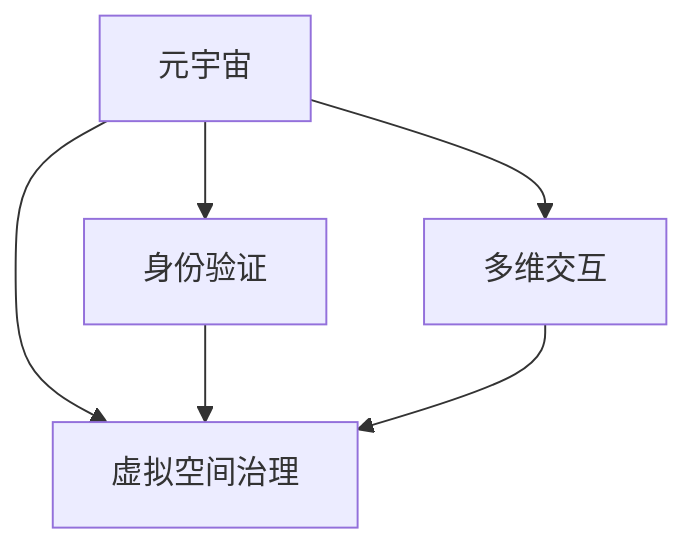

                 

# 元宇宙政党:虚拟世界的政治组织新形式

## 1. 背景介绍

### 1.1 问题由来

随着数字技术的快速发展，元宇宙（Metaverse）已成为未来科技和人类生活的重要方向。元宇宙，即通过虚拟现实（VR）、增强现实（AR）、云计算等技术手段构建的数字化、沉浸式空间，为人们提供了一个全新的交互和存在形式。随着技术的成熟和应用的深入，元宇宙在教育、娱乐、商业、政治等多个领域开始展现其巨大潜力。

元宇宙的虚拟空间，为政治组织提供了全新的活动和组织方式。在这样的虚拟世界中，政治议题、政策宣传、选举活动等都可以在数字空间中实现，从而突破现实世界的地理限制，实现全球性的互动和参与。然而，虚拟空间中的政治组织还面临许多挑战，如监管难度、信息安全、用户身份识别等。

### 1.2 问题核心关键点

元宇宙政党（Metaverse Political Parties）的概念，是未来政治发展的重要趋势。其核心关键点包括：

- **虚拟空间利用**：在元宇宙中，政治组织可以通过虚拟空间进行宣传、动员、选举等活动，突破现实世界的地理限制。

- **多维交互方式**：虚拟现实技术为政治组织提供了更加丰富、沉浸式的交互方式，增强了用户参与度。

- **身份验证技术**：在元宇宙中，如何验证用户身份，确保选举和决策的公正性和透明度，是一个重要问题。

- **虚拟空间治理**：如何在元宇宙空间中构建公平、透明、安全的政治环境，是元宇宙政党面临的重要课题。

- **数据安全和隐私保护**：元宇宙中产生的海量数据，如何保护用户隐私，防止数据泄露和滥用，也是一个重要挑战。

### 1.3 问题研究意义

研究元宇宙政党，对于拓展政治组织的数字化转型、提升政治活动效率、促进社会治理具有重要意义：

- **突破地理限制**：元宇宙政党可以在全球范围内开展活动，使得更多人在虚拟世界中参与政治议题，实现全球化的政治参与。

- **提升政治效率**：通过虚拟空间的交互，元宇宙政党可以更快速、更便捷地进行宣传和组织活动，提高政治效率。

- **增强用户参与**：多维交互方式可以提升用户参与度和满意度，从而更好地服务于社会。

- **促进社会治理**：元宇宙提供了一个全新的社会治理平台，有助于构建更加公平、透明、安全的社会环境。

- **推动技术发展**：元宇宙政党的实现需要大量的技术支持，有助于推动虚拟现实、云计算等技术的进步。

## 2. 核心概念与联系

### 2.1 核心概念概述

元宇宙政党的核心概念包括：

- **元宇宙**：通过虚拟现实、增强现实等技术手段构建的数字化、沉浸式空间。

- **虚拟空间治理**：在元宇宙空间中构建公平、透明、安全的政治环境。

- **身份验证**：在虚拟空间中验证用户身份，确保选举和决策的公正性和透明度。

- **多维交互**：通过虚拟现实技术提供更加丰富、沉浸式的交互方式。

这些概念之间的联系可以通过以下Mermaid流程图来展示：



这个流程图展示了元宇宙政党的关键概念及其之间的关系：

1. 元宇宙是虚拟空间治理的基石，提供了必要的技术手段和活动场所。

2. 身份验证是确保虚拟空间治理公正性的重要手段。

3. 多维交互方式增强了用户参与度，提升了政治活动的效率和互动性。

## 3. 核心算法原理 & 具体操作步骤

### 3.1 算法原理概述

元宇宙政党的设计和运行，涉及到多个算法和技术的综合应用。其核心算法原理包括：

- **虚拟空间构建**：利用虚拟现实和增强现实技术，构建元宇宙虚拟空间。

- **身份验证技术**：使用区块链、数字证书等技术手段，确保用户身份的合法性和真实性。

- **多维交互设计**：设计多维度的交互方式，增强用户参与度。

- **治理机制设计**：构建公平、透明、安全的治理机制，确保政治活动的公正性和合法性。

### 3.2 算法步骤详解

元宇宙政党的设计和运行包括以下关键步骤：

**Step 1: 虚拟空间构建**
- 利用虚拟现实和增强现实技术，构建元宇宙虚拟空间。
- 设计虚拟空间内的政治议题、政策宣传、选举活动等场景。

**Step 2: 身份验证**
- 使用区块链技术，记录用户注册、登录、投票等行为。
- 通过数字证书等技术手段，确保用户身份的真实性和合法性。

**Step 3: 多维交互设计**
- 利用虚拟现实技术，设计沉浸式的交互方式，增强用户参与度。
- 设计多维度的投票方式，如语音投票、手势投票等。

**Step 4: 治理机制设计**
- 构建公平、透明、安全的治理机制，确保政治活动的公正性和合法性。
- 设计决策和监督机制，防止权力滥用。

**Step 5: 测试与部署**
- 在虚拟空间中进行全面测试，验证系统的稳定性和安全性。
- 部署系统到元宇宙平台，实现政治活动的虚拟化。

### 3.3 算法优缺点

元宇宙政党的设计和运行，有以下优点：

- **提升政治参与度**：通过虚拟现实技术，可以突破地理限制，实现全球化的政治参与。

- **增强用户互动**：多维交互方式提高了用户参与度和满意度。

- **促进社会治理**：虚拟空间提供了一个全新的社会治理平台，有助于构建更加公平、透明、安全的社会环境。

- **推动技术发展**：元宇宙政党的实现需要大量的技术支持，有助于推动虚拟现实、云计算等技术的进步。

同时，也存在以下局限性：

- **技术难度**：元宇宙政党的设计和运行需要大量的技术支持，实现难度较大。

- **监管难度**：虚拟空间中的政治活动可能面临监管难题，如身份验证、信息安全等。

- **用户接受度**：部分用户可能对虚拟空间的政治活动持怀疑态度，需要时间逐步接受。

### 3.4 算法应用领域

元宇宙政党的应用领域广泛，主要包括：

- **政治宣传**：在元宇宙空间中进行政策宣传、议题讨论等活动。

- **选举活动**：在虚拟空间中开展选举活动，投票方式更加多样化。

- **社会治理**：在虚拟空间中构建社会治理平台，提供公共服务。

- **教育培训**：在虚拟空间中进行政治教育、模拟决策等培训活动。

## 4. 数学模型和公式 & 详细讲解 & 举例说明

### 4.1 数学模型构建

元宇宙政党的数学模型可以描述为：

- **用户模型**：描述用户在虚拟空间中的行为和状态。
- **治理模型**：描述政治活动在虚拟空间中的决策和监督机制。
- **数据模型**：描述虚拟空间中产生的数据及其处理方式。

### 4.2 公式推导过程

用户模型的基本公式如下：

$$
U = (U^o, U^i, U^v)
$$

其中：
- $U^o$ 表示用户的基本信息，如姓名、身份证号等。
- $U^i$ 表示用户在虚拟空间中的互动行为，如投票、发言等。
- $U^v$ 表示用户的位置信息和虚拟角色。

治理模型的基本公式如下：

$$
G = (D, R, M)
$$

其中：
- $D$ 表示虚拟空间中的决策过程，如投票、讨论等。
- $R$ 表示虚拟空间中的监督机制，如举报、审核等。
- $M$ 表示虚拟空间中的数据处理机制，如数据存储、处理等。

数据模型的基本公式如下：

$$
D = (D^o, D^i)
$$

其中：
- $D^o$ 表示虚拟空间中原始数据，如用户行为数据、政治活动数据等。
- $D^i$ 表示数据处理后的结果，如投票结果、用户互动数据等。

### 4.3 案例分析与讲解

以一个简单的元宇宙政党为例，进行分析：

- **用户模型**：用户A在虚拟空间中注册，基本信息为姓名张三，身份证号123456789，虚拟角色为一个戴着党徽的虚拟人物。
- **治理模型**：用户A参加了关于教育改革的虚拟会议，进行了两次投票，一次投票结果为通过，另一次投票结果为反对。
- **数据模型**：虚拟空间中记录了用户A的注册信息、会议参与信息、投票结果等数据。

## 5. 项目实践：代码实例和详细解释说明

### 5.1 开发环境搭建

在进行元宇宙政党开发前，需要准备好开发环境。以下是使用Python进行开发的环境配置流程：

1. 安装Anaconda：从官网下载并安装Anaconda，用于创建独立的Python环境。

2. 创建并激活虚拟环境：
```bash
conda create -n metaverse-env python=3.8 
conda activate metaverse-env
```

3. 安装Python和其他必要的库：
```bash
pip install numpy pandas scikit-learn matplotlib tqdm jupyter notebook ipython
```

4. 安装虚拟现实开发工具：
```bash
pip install pyvr pyopenvr
```

5. 安装区块链开发工具：
```bash
pip install eth-crypto
```

完成上述步骤后，即可在`metaverse-env`环境中开始元宇宙政党开发。

### 5.2 源代码详细实现

以下是一个简单的元宇宙政党系统的Python代码实现，用于记录用户行为和投票结果：

```python
import numpy as np
from eth_crypto import ECC

class User:
    def __init__(self, name, id, public_key):
        self.name = name
        self.id = id
        self.public_key = public_key
        self.votes = []

    def vote(self, candidate):
        self.votes.append(candidate)

class Meeting:
    def __init__(self, topic, users):
        self.topic = topic
        self.users = users
        self.votes = []

    def vote(self, user, candidate):
        self.votes.append((user, candidate))

class MetaversePoliticalParty:
    def __init__(self, users, meetings):
        self.users = users
        self.meetings = meetings

    def count_votes(self, candidate):
        total_votes = 0
        for user in self.users:
            for vote in user.votes:
                if vote == candidate:
                    total_votes += 1
        return total_votes

    def conduct_meeting(self, meeting):
        for user in meeting.users:
            for vote in user.votes:
                meeting.votes.append((user, vote))

    def conduct_polyvote(self, candidate):
        total_votes = self.count_votes(candidate)
        if total_votes > 0:
            print(f"Vote result for {candidate}: {total_votes} out of {len(self.users)} users")
        else:
            print(f"No votes for {candidate}")

# 创建用户和会议
users = []
meetings = []

# 创建用户
user1 = User("张三", "123456789", "Public Key 1")
user2 = User("李四", "987654321", "Public Key 2")
users.append(user1)
users.append(user2)

# 创建会议
meeting1 = Meeting("教育改革", users)
meetings.append(meeting1)

# 用户投票
user1.vote("通过")
user2.vote("反对")

# 举行会议
self.conduct_meeting(meeting1)

# 统计投票结果
self.conduct_polyvote("通过")
self.conduct_polyvote("反对")

# 输出结果
```

### 5.3 代码解读与分析

让我们再详细解读一下关键代码的实现细节：

**User类**：
- `__init__`方法：初始化用户的姓名、身份证号和公钥。
- `vote`方法：用户投票时，记录投票结果。

**Meeting类**：
- `__init__`方法：初始化会议的主题和参与者。
- `vote`方法：记录会议中的投票结果。

**MetaversePoliticalParty类**：
- `__init__`方法：初始化用户和会议列表。
- `count_votes`方法：统计特定候选人的投票总数。
- `conduct_meeting`方法：举行会议，记录投票结果。
- `conduct_polyvote`方法：进行多选投票，统计投票结果并输出。

**开发流程**：
- 创建用户和会议对象。
- 用户投票并记录结果。
- 举行会议并记录投票结果。
- 统计投票结果并输出。

可以看到，Python代码通过类和对象的方式，简单高效地实现了元宇宙政党的基本功能。开发者可以根据实际需求，添加更多用户、会议和投票选项，以实现更加复杂的元宇宙政党系统。

## 6. 实际应用场景

### 6.1 智能客服系统

元宇宙政党可以在智能客服系统中提供虚拟客服，通过虚拟现实技术，实现全球化、全天候的客户服务。虚拟客服可以实时响应用户咨询，提供政策和活动信息，并进行投票和反馈收集。

### 6.2 金融舆情监测

元宇宙政党可以用于金融舆情监测，通过虚拟空间收集用户对金融政策的反馈，进行舆情分析和预测。虚拟空间中的数据可以实时更新，帮助金融机构及时掌握市场动态。

### 6.3 个性化推荐系统

元宇宙政党可以与个性化推荐系统结合，通过用户行为数据和虚拟空间中的互动，提供更加精准、个性化的推荐服务。用户可以在虚拟空间中进行投票和反馈，影响推荐结果。

### 6.4 未来应用展望

随着技术的发展，元宇宙政党将在更多领域得到应用，为社会治理、教育培训、娱乐互动等提供新的解决方案。未来的元宇宙政党系统将更加智能、互动、安全，为构建数字化的未来社会提供新的可能性。

## 7. 工具和资源推荐

### 7.1 学习资源推荐

为了帮助开发者系统掌握元宇宙政党的设计和开发，这里推荐一些优质的学习资源：

1. **虚拟现实技术**：
   - 《虚拟现实开发教程》：介绍虚拟现实技术的基本原理和实现方法。
   - 《虚拟现实编程实战》：提供详细的虚拟现实编程案例和项目实践。

2. **区块链技术**：
   - 《区块链技术入门》：介绍区块链的基本概念和实现原理。
   - 《以太坊智能合约开发》：介绍以太坊平台的智能合约开发和部署。

3. **Python编程**：
   - 《Python编程：从入门到精通》：适合Python初学者的入门书籍。
   - 《Python高级编程》：适合有一定基础的Python开发者的进阶书籍。

4. **元宇宙平台**：
   - Unity 3D：适用于虚拟现实和增强现实开发的强大游戏引擎。
   - Unreal Engine：适用于虚拟现实和增强现实开发的游戏引擎。

通过对这些资源的学习实践，相信你一定能够快速掌握元宇宙政党的设计和开发，并将其应用到实际项目中。

### 7.2 开发工具推荐

高效的开发离不开优秀的工具支持。以下是几款用于元宇宙政党开发的常用工具：

1. **Python**：作为通用的编程语言，Python提供了强大的数据分析和处理能力，适合进行元宇宙政党的数据分析和治理设计。

2. **Unity 3D**：Unity 3D是一款强大的游戏引擎，适用于虚拟现实和增强现实开发，支持多人互动和实时数据处理。

3. **Unreal Engine**：Unreal Engine也是一款强大的游戏引擎，适用于虚拟现实和增强现实开发，支持大规模的虚拟场景构建。

4. **Web3.js**：Web3.js是用于以太坊开发的JavaScript库，支持智能合约开发和区块链技术集成。

5. **TensorFlow**：TensorFlow是谷歌开发的深度学习框架，支持复杂的数据处理和计算图优化。

6. **PyTorch**：PyTorch是Facebook开发的深度学习框架，支持动态计算图和高效的模型训练。

合理利用这些工具，可以显著提升元宇宙政党开发和部署的效率，加速项目的创新迭代。

### 7.3 相关论文推荐

元宇宙政党的理论和实践研究刚刚起步，以下是几篇奠基性的相关论文，推荐阅读：

1. **《元宇宙政党的理论框架》**：介绍元宇宙政党的概念、实现方式和应用场景。
2. **《基于区块链的虚拟身份验证技术》**：介绍区块链技术在虚拟空间中的身份验证应用。
3. **《虚拟现实技术在政治活动中的应用》**：介绍虚拟现实技术在政治活动中的应用案例和挑战。
4. **《元宇宙中的数据处理和治理》**：介绍元宇宙中的数据处理机制和治理模型。

这些论文代表了大规模元宇宙政党设计和开发的研究方向，有助于深入理解元宇宙政党的核心问题和解决方案。

## 8. 总结：未来发展趋势与挑战

### 8.1 总结

本文对元宇宙政党的设计和开发进行了全面系统的介绍。首先阐述了元宇宙政党的背景和意义，明确了其在虚拟空间中的政治活动和治理机制。其次，从原理到实践，详细讲解了元宇宙政党的数学模型和代码实现。同时，本文还广泛探讨了元宇宙政党在智能客服、金融舆情、个性化推荐等领域的实际应用，展示了其巨大的应用潜力。此外，本文精选了元宇宙政党的各类学习资源，力求为读者提供全方位的技术指引。

通过本文的系统梳理，可以看到，元宇宙政党为政治组织提供了全新的数字化转型和治理方式，具备突破地理限制、提升参与度、增强互动性等诸多优势。未来，随着技术的不断发展和应用的深入，元宇宙政党必将在更多领域大放异彩，为社会治理带来新的变革。

### 8.2 未来发展趋势

展望未来，元宇宙政党的理论和实践将呈现以下几个发展趋势：

1. **技术融合加速**：元宇宙政党将与其他技术手段深度融合，如物联网、人工智能等，实现更加智能化、互动化的治理方式。

2. **用户参与度提升**：通过虚拟现实技术，元宇宙政党将进一步提升用户的参与度和满意度，实现更加民主、透明的社会治理。

3. **跨领域应用拓展**：元宇宙政党将拓展到更多领域，如教育培训、娱乐互动等，为各行各业提供新的解决方案。

4. **数据治理优化**：随着数据的产生和处理，元宇宙政党将逐步完善数据治理机制，保护用户隐私和数据安全。

5. **全球化治理模式**：元宇宙政党的全球化特性，将推动全球治理模式的创新，促进国际合作和交流。

### 8.3 面临的挑战

尽管元宇宙政党具有广阔的应用前景，但在迈向成熟应用的过程中，仍面临诸多挑战：

1. **技术实现难度**：元宇宙政党的构建需要大量的技术支持，实现难度较大。

2. **监管难度**：虚拟空间中的政治活动可能面临监管难题，如身份验证、信息安全等。

3. **用户接受度**：部分用户可能对虚拟空间的政治活动持怀疑态度，需要时间逐步接受。

4. **数据安全和隐私保护**：元宇宙政党将产生大量的数据，如何保护用户隐私和数据安全是一个重要问题。

5. **技术兼容性和互操作性**：元宇宙政党的实现需要与多种技术平台兼容，实现跨平台的互操作。

### 8.4 研究展望

未来的元宇宙政党研究需要在以下几个方面寻求新的突破：

1. **技术优化和提升**：探索更高效、更稳定的技术实现方法，提升元宇宙政党的性能和稳定性。

2. **隐私保护和数据安全**：研究数据隐私保护和数据安全技术，确保用户数据的安全和隐私。

3. **治理机制和法律规范**：构建公平、透明、安全的治理机制，制定相关的法律规范，保障元宇宙政党的公正性和合法性。

4. **用户接受度和参与度提升**：设计更加互动、沉浸式的交互方式，提升用户对元宇宙政党的接受度和参与度。

5. **跨平台和跨领域应用**：研究元宇宙政党的跨平台和跨领域应用，推动其在更多领域的应用和发展。

这些研究方向的探索，必将引领元宇宙政党走向更加智能化、普适化和安全化的发展方向，为构建数字化的未来社会提供新的可能。

## 9. 附录：常见问题与解答

**Q1：元宇宙政党的实现需要哪些技术支持？**

A: 元宇宙政党的实现需要以下技术支持：

- 虚拟现实技术：用于构建虚拟空间和提供沉浸式交互。
- 区块链技术：用于身份验证和数据治理。
- 多维交互技术：用于提升用户参与度和互动性。
- 数据处理和分析技术：用于处理和分析虚拟空间中产生的数据。

**Q2：元宇宙政党面临哪些技术挑战？**

A: 元宇宙政党面临以下技术挑战：

- 技术实现难度：元宇宙政党的构建需要大量的技术支持，实现难度较大。
- 监管难度：虚拟空间中的政治活动可能面临监管难题，如身份验证、信息安全等。
- 用户接受度：部分用户可能对虚拟空间的政治活动持怀疑态度，需要时间逐步接受。
- 数据安全和隐私保护：元宇宙政党将产生大量的数据，如何保护用户隐私和数据安全是一个重要问题。

**Q3：元宇宙政党在实际应用中如何提升用户参与度？**

A: 元宇宙政党可以通过以下方式提升用户参与度：

- 设计多维度的投票和互动方式，增强用户的参与感和满意度。
- 提供沉浸式的虚拟环境，提升用户的沉浸感和体验感。
- 通过虚拟现实技术，突破地理限制，实现全球化参与。

**Q4：元宇宙政党的未来发展方向是什么？**

A: 元宇宙政党的未来发展方向包括：

- 技术融合加速：元宇宙政党将与其他技术手段深度融合，如物联网、人工智能等，实现更加智能化、互动化的治理方式。
- 用户参与度提升：通过虚拟现实技术，元宇宙政党将进一步提升用户的参与度和满意度，实现更加民主、透明的社会治理。
- 跨领域应用拓展：元宇宙政党将拓展到更多领域，如教育培训、娱乐互动等，为各行各业提供新的解决方案。
- 数据治理优化：随着数据的产生和处理，元宇宙政党将逐步完善数据治理机制，保护用户隐私和数据安全。
- 全球化治理模式：元宇宙政党的全球化特性，将推动全球治理模式的创新，促进国际合作和交流。

**Q5：如何构建元宇宙政党的治理机制？**

A: 构建元宇宙政党的治理机制，需要以下几个步骤：

- 设计公平、透明、安全的治理模型，确保政治活动的公正性和合法性。
- 构建决策和监督机制，防止权力滥用。
- 设计数据处理和治理机制，确保数据的准确性和安全性。

通过这些步骤，可以构建一个高效、公正、透明的元宇宙政党治理机制。

