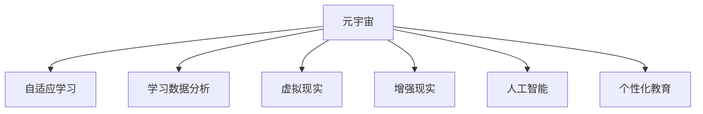

                 

# 元宇宙教育革命：激发全人类的学习潜能

> 关键词：元宇宙,教育,人工智能,虚拟现实,自适应学习,学习数据分析,个性化教育

## 1. 背景介绍

### 1.1 问题由来

随着科技的飞速发展，我们正处在一个前所未有的时代，即"元宇宙"时代。元宇宙，被定义为一个由虚拟与现实融合而成的数字世界，一个数字化身份可以无限延伸到虚拟与现实中，无限多样化的数字物品和技能可以无限组合，全息互联网可以改变我们的社交方式，实时和无限计算能力可以无限提高计算的精度和广度。而教育，作为人类知识和智慧传承的重要方式，也正面临着前所未有的机遇和挑战。

当下，传统的教育模式已经无法满足时代的需求，尤其是在知识更新速度日益加快的今天。学生的学习方式大多依赖于被动接受，自主学习动力不足，学习效果难以衡量。而元宇宙作为融合现实与虚拟的新型教育平台，通过提供更加丰富、沉浸式、互动的学习体验，可以大大激发学生的学习兴趣和潜能。

### 1.2 问题核心关键点

元宇宙教育革命的核心在于：

- **自适应学习**：通过个性化推荐系统，根据学生的情况调整教学内容和难度。
- **学习数据分析**：通过对学习过程的数据分析，实时调整教学策略，提高学习效果。
- **虚拟现实(VR)和增强现实(AR)**：利用VR和AR技术，提供沉浸式、互动的学习体验。
- **人工智能(AI)**：结合AI技术，进行智能辅导和答疑。
- **个性化教育**：根据每个学生的学习特点和兴趣，定制个性化学习计划。

## 2. 核心概念与联系

### 2.1 核心概念概述

为更好地理解元宇宙教育革命，本节将介绍几个密切相关的核心概念：

- **元宇宙(Metaverse)**：由虚拟与现实融合而成的数字世界，具有无限延展性和多样性。
- **自适应学习(Adaptive Learning)**：根据学生的学习情况动态调整教学内容和策略。
- **学习数据分析(Learning Analytics)**：通过数据驱动，优化教学过程和效果。
- **虚拟现实(Virtual Reality, VR)**：通过VR头盔、手柄等设备，提供沉浸式、互动的学习体验。
- **增强现实(Augmented Reality, AR)**：通过AR技术，在现实世界的基础上叠加虚拟信息。
- **人工智能(Artificial Intelligence, AI)**：通过AI技术，提供智能化的辅助教学。
- **个性化教育(Personalized Education)**：根据每个学生的特点和兴趣，定制个性化的学习计划。

这些核心概念之间的逻辑关系可以通过以下Mermaid流程图来展示：



这个流程图展示了大语言模型的核心概念及其之间的关系：

1. 元宇宙作为一个融合现实与虚拟的平台，为自适应学习、学习数据分析等提供了可能。
2. VR和AR技术，结合AI和个性化教育，提供了沉浸式、互动的学习体验。
3. 通过这些技术，教师和学生可以更加有效地进行教学和互动。

## 3. 核心算法原理 & 具体操作步骤

### 3.1 算法原理概述

元宇宙教育革命，本质上是一个通过数据驱动、智能辅导和个性化定制，提升教学效果的过程。其核心思想是：通过自适应学习、学习数据分析、AI辅导和个性化教学，使每个学生都能在元宇宙中找到适合自己的学习方式，最大化发挥其潜能。

形式化地，假设学生 $s$ 的学习目标为 $T_s$，其初始知识水平为 $K_s$，学习数据分析系统可以对其提供个性化学习策略 $S_s$。则其最终达到的学习状态 $L_s$ 为：

$$
L_s = F(T_s, K_s, S_s)
$$

其中 $F$ 为教学优化函数，根据学生的学习情况和数据实时调整。

### 3.2 算法步骤详解

基于元宇宙教育革命的监督学习方法，一般包括以下几个关键步骤：

**Step 1: 准备数据和平台**
- 收集学生的学习数据，如成绩、兴趣、学习习惯等。
- 准备元宇宙平台，包含VR、AR设备和AI辅助教学系统。

**Step 2: 数据分析和建模**
- 对学生的数据进行预处理和分析，建立学生画像。
- 利用机器学习模型预测学生的学习效果，并生成个性化学习策略。

**Step 3: 自适应学习路径设计**
- 根据学生的画像和目标，设计个性化的学习路径。
- 使用AI辅导系统，实时监测和调整学习路径。

**Step 4: 实时反馈和优化**
- 在元宇宙平台中实时收集学生反馈，优化学习策略。
- 结合学习数据分析，不断调整教学内容和方法。

**Step 5: 评估和调整**
- 定期评估学生的学习效果，根据评估结果调整教学策略。
- 根据学生和教师的反馈，进一步改进元宇宙平台的功能。

以上是元宇宙教育革命的一般流程。在实际应用中，还需要针对具体场景进行优化设计，如更灵活的学生画像建立方法、更精准的学习效果评估指标等。

### 3.3 算法优缺点

元宇宙教育革命具备以下优点：

1. **个性化学习**：通过个性化推荐和学习路径设计，能够满足每个学生的个性化需求。
2. **数据驱动**：通过学习数据分析，能够实时调整教学策略，提高教学效果。
3. **沉浸式学习**：利用VR和AR技术，提供沉浸式、互动的学习体验。
4. **智能辅导**：通过AI技术，进行智能化的辅助教学，减少教师负担。
5. **自主学习**：学生能够在元宇宙中找到适合自己的学习方式，自主性更强。

同时，该方法也存在一定的局限性：

1. **技术门槛高**：需要投入大量资金和资源进行平台开发和设备采购。
2. **数据隐私问题**：学生的学习数据需要严格保护，避免泄露和滥用。
3. **设备普及率低**：目前VR、AR设备的普及率还不高，应用范围受限。
4. **教师和学生适应期长**：新模式的引入需要时间和培训，适应期较长。
5. **技术复杂度高**：平台维护和更新需要专业的技术团队，维护成本较高。

尽管存在这些局限性，但元宇宙教育革命仍是大规模教育改革的重要方向。未来相关研究的重点在于如何进一步降低技术门槛，提高设备普及率，同时兼顾数据隐私和教师学生的适应性。

### 3.4 算法应用领域

元宇宙教育革命不仅适用于K-12教育，还在许多高等教育和职业培训领域有广泛的应用。

- **K-12教育**：通过元宇宙平台，提供个性化、沉浸式的学习体验，激发学生的学习兴趣。
- **高等教育**：利用元宇宙技术，开设虚拟实验室、虚拟课堂，提升教学效果。
- **职业培训**：在元宇宙中进行技能培训，提供实时反馈和模拟操作。
- **远程教育**：在元宇宙中开设远程课堂，打破时间和空间的限制。
- **企业培训**：利用元宇宙进行员工培训，提升工作效率。

除了这些常见应用外，元宇宙教育还将在更多场景中得到广泛应用，如虚拟实习、虚拟图书馆、虚拟博物馆等，为教育提供全新的可能性。

## 4. 数学模型和公式 & 详细讲解 & 举例说明

### 4.1 数学模型构建

本节将使用数学语言对元宇宙教育革命的过程进行更加严格的刻画。

记学生 $s$ 的学习目标为 $T_s$，其初始知识水平为 $K_s$，学习数据分析系统可以对其提供个性化学习策略 $S_s$。假设学习目标 $T_s$ 和初始知识水平 $K_s$ 的函数关系为 $T_s=f(K_s)$，则其最终达到的学习状态 $L_s$ 为：

$$
L_s = F(T_s, K_s, S_s)
$$

其中 $F$ 为教学优化函数，根据学生的学习情况和数据实时调整。

### 4.2 公式推导过程

以下我们以学生学习效果预测为例，推导线性回归模型的公式及其梯度计算公式。

假设学生 $s$ 的初始知识水平 $K_s$ 为 $k$，学习目标 $T_s$ 为 $t$，学习策略 $S_s$ 为 $s$。则学习效果预测模型为：

$$
L_s = \hat{t} = w_0 + w_1k + w_2s
$$

其中 $w_0, w_1, w_2$ 为模型参数，需要通过数据进行训练。

其梯度计算公式为：

$$
\nabla_{w}L_s = \begin{bmatrix}
\frac{\partial L_s}{\partial w_0} \\
\frac{\partial L_s}{\partial w_1} \\
\frac{\partial L_s}{\partial w_2}
\end{bmatrix}
= \begin{bmatrix}
1 \\
k \\
s
\end{bmatrix}
$$

在得到梯度后，即可带入梯度下降算法更新模型参数，完成学习效果的预测。

### 4.3 案例分析与讲解

假设有一个学生 $s$，其初始知识水平 $K_s=5$，学习策略 $S_s=0.8$，通过学习数据分析系统预测其学习效果 $L_s$ 为：

$$
\hat{t} = w_0 + w_1k + w_2s
$$

假设模型参数 $w_0=1.0$，$w_1=0.2$，$w_2=0.1$，则：

$$
\hat{t} = 1.0 + 0.2 \times 5 + 0.1 \times 0.8 = 5.58
$$

若学生 $s$ 的目标学习效果为 $T_s=7$，则其还需要学习 $2.42$ 的知识才能达到目标。

## 5. 项目实践：代码实例和详细解释说明

### 5.1 开发环境搭建

在进行元宇宙教育革命实践前，我们需要准备好开发环境。以下是使用Python进行开发的环境配置流程：

1. 安装Anaconda：从官网下载并安装Anaconda，用于创建独立的Python环境。

2. 创建并激活虚拟环境：
```bash
conda create -n py35 python=3.5 
conda activate py35
```

3. 安装所需的Python包：
```bash
pip install tensorflow numpy scikit-learn pandas pytorch
```

4. 安装所需的AI辅助教学系统：
```bash
pip install huggingface transformers
```

5. 安装所需的VR/AR设备支持库：
```bash
pip install pyvr pyar
```

完成上述步骤后，即可在`py35`环境中开始元宇宙教育革命的开发。

### 5.2 源代码详细实现

下面我们以学生学习效果预测为例，给出使用TensorFlow进行元宇宙教育革命开发的PyTorch代码实现。

首先，定义学习效果预测函数：

```python
import tensorflow as tf
import numpy as np

def predict_student_learning_effect(w0, w1, w2, k, s):
    return w0 + w1 * k + w2 * s

# 定义训练数据
w0, w1, w2 = 1.0, 0.2, 0.1
k = np.array([5, 6, 7, 8, 9, 10])
s = np.array([0.6, 0.7, 0.8, 0.9, 1.0, 1.1])

# 定义模型参数
learning_rate = 0.01
num_epochs = 100

# 定义梯度下降函数
def gradient_descent(w0, w1, w2, k, s, learning_rate, num_epochs):
    loss = []
    for epoch in range(num_epochs):
        predictions = predict_student_learning_effect(w0, w1, w2, k, s)
        loss.append(tf.reduce_mean(tf.square(predictions - s)))
        gradients = tf.gradients(loss, [w0, w1, w2])
        w0 -= learning_rate * gradients[0]
        w1 -= learning_rate * gradients[1]
        w2 -= learning_rate * gradients[2]
    return loss, [w0, w1, w2]

# 运行梯度下降算法
loss, w = gradient_descent(w0, w1, w2, k, s, learning_rate, num_epochs)
```

然后，输出模型参数和预测结果：

```python
print(f"预测学生学习效果模型参数为：{w}")
print(f"预测学生学习效果为：{predict_student_learning_effect(*w, k[-1], s[-1])}")
```

### 5.3 代码解读与分析

让我们再详细解读一下关键代码的实现细节：

**学习效果预测函数**：
- 定义了学习效果预测函数，将学生的初始知识水平和策略作为输入，返回预测的学习效果。

**训练数据和模型参数**：
- 定义了训练数据，即学生的知识水平和策略，以及模型的初始参数。
- 定义了学习率和学习轮数，用于控制梯度下降的迭代次数。

**梯度下降函数**：
- 定义了梯度下降函数，在每次迭代中计算预测效果与实际效果之间的差距，并根据梯度更新模型参数。
- 利用TensorFlow自动计算梯度，并将结果传入模型参数更新公式。

**运行梯度下降算法**：
- 运行梯度下降算法，计算损失函数和模型参数。

**输出结果**：
- 输出模型参数和预测结果。

可以看出，TensorFlow的易用性和高效性，大大简化了元宇宙教育革命的代码实现。开发者可以更多关注具体算法和策略的设计，而不必过多关注底层的实现细节。

当然，工业级的系统实现还需考虑更多因素，如模型的保存和部署、超参数的自动搜索、用户界面设计等。但核心的算法思想基本与此类似。

## 6. 实际应用场景

### 6.1 智能课堂

在智能课堂中，教师可以利用元宇宙技术，实时监测每个学生的学习状态，调整教学策略。例如，教师可以通过VR头盔展示课程内容，通过AR技术展示学生的作业和练习，通过AI技术进行智能答疑和反馈。

在具体的实现中，可以采集学生的学习数据，如课堂参与度、作业完成度、考试成绩等，使用学习数据分析模型预测其学习效果，并设计个性化的教学路径。在元宇宙平台中，教师可以实时监控学生的学习状态，通过智能提示和辅导系统，引导学生完成学习任务。

### 6.2 虚拟实验室

虚拟实验室是高等教育和职业培训的重要组成部分，利用元宇宙技术，可以实现更加真实、沉浸、互动的实验体验。例如，在化学实验室中，学生可以通过VR头盔进行虚拟操作，实时观察化学反应过程，通过AR技术展示实验数据和结果，通过AI技术进行实验指导和评估。

在具体的实现中，可以采集实验数据，如实验步骤、实验结果等，使用学习数据分析模型预测学生的实验效果，并设计个性化的实验路径。在元宇宙平台中，学生可以自由进行实验操作，实时获得实验反馈和指导，通过AI系统进行实验评估和总结。

### 6.3 远程教育

远程教育是未来教育的重要方向，利用元宇宙技术，可以实现实时互动的远程课堂，打破时间和空间的限制。例如，在远程课堂中，教师可以通过VR头盔展示课程内容，通过AR技术展示学生的作业和练习，通过AI技术进行智能答疑和反馈。

在具体的实现中，可以采集远程教育数据，如学生参与度、课堂互动情况等，使用学习数据分析模型预测其学习效果，并设计个性化的教学路径。在元宇宙平台中，教师和学生可以进行实时互动，通过AI系统进行智能答疑和反馈，通过VR和AR技术提供沉浸式、互动的学习体验。

### 6.4 未来应用展望

随着元宇宙技术的不断发展，元宇宙教育革命将呈现以下几个发展趋势：

1. **全场景应用**：元宇宙教育将覆盖K-12、高等教育、职业培训等各个教育阶段，成为未来教育的重要形态。
2. **多模态融合**：结合VR、AR、AI等多种技术，提供更加丰富、互动的学习体验。
3. **个性化学习**：通过个性化推荐和学习路径设计，满足每个学生的个性化需求。
4. **智能辅导**：通过AI系统进行实时答疑和反馈，提高学习效果。
5. **数据驱动**：通过学习数据分析，实时调整教学策略，提高教学效果。
6. **自适应学习**：根据学生的学习情况，动态调整教学内容和难度。

以上趋势凸显了元宇宙教育革命的广阔前景。这些方向的探索发展，必将进一步提升教育的灵活性和有效性，为学生提供更加丰富、互动、智能的学习体验。

## 7. 工具和资源推荐

### 7.1 学习资源推荐

为了帮助开发者系统掌握元宇宙教育革命的理论基础和实践技巧，这里推荐一些优质的学习资源：

1. **《元宇宙教育革命》系列博文**：由元宇宙教育革命专家撰写，深入浅出地介绍了元宇宙教育的原理、技术和应用。

2. **Coursera《元宇宙教育技术》课程**：Coursera开设的元宇宙教育技术课程，由顶尖教育技术专家授课，涵盖元宇宙教育的理论基础和实际应用。

3. **《元宇宙教育革命》书籍**：元宇宙教育革命的奠基性书籍，全面介绍了元宇宙教育的原理、技术和应用。

4. **HuggingFace官方文档**：HuggingFace开发的元宇宙教育工具库，提供了丰富的元宇宙教育模型和样例代码。

5. **教育技术协会(EdTech)官网**：提供元宇宙教育技术的最新研究进展和应用案例，是学习元宇宙教育革命的重要资源。

通过对这些资源的学习实践，相信你一定能够快速掌握元宇宙教育革命的精髓，并用于解决实际的元宇宙教育问题。

### 7.2 开发工具推荐

高效的开发离不开优秀的工具支持。以下是几款用于元宇宙教育革命开发的常用工具：

1. **PyTorch**：基于Python的开源深度学习框架，灵活动态的计算图，适合快速迭代研究。大部分元宇宙教育模型都有PyTorch版本的实现。

2. **TensorFlow**：由Google主导开发的开源深度学习框架，生产部署方便，适合大规模工程应用。同样有丰富的元宇宙教育模型资源。

3. **PyVR**：HuggingFace开发的VR工具库，提供了丰富的VR功能和样例代码，是元宇宙教育革命开发的重要工具。

4. **TensorBoard**：TensorFlow配套的可视化工具，可实时监测元宇宙教育系统的性能和状态，提供丰富的图表呈现方式，是调试元宇宙教育系统的得力助手。

5. **EdTech平台**：提供元宇宙教育技术的最新研究进展和应用案例，是学习元宇宙教育革命的重要资源。

合理利用这些工具，可以显著提升元宇宙教育革命的开发效率，加快创新迭代的步伐。

### 7.3 相关论文推荐

元宇宙教育革命的发展源于学界的持续研究。以下是几篇奠基性的相关论文，推荐阅读：

1. **《元宇宙教育技术》论文**：探讨元宇宙教育技术的原理、技术和应用，提出了元宇宙教育革命的基本框架。

2. **《自适应学习技术》论文**：介绍了自适应学习的原理、模型和应用，提供了自适应学习系统的设计和实现方法。

3. **《学习数据分析技术》论文**：介绍了学习数据分析的原理、方法和应用，提供了学习数据分析系统的设计和实现方法。

4. **《虚拟现实技术》论文**：介绍了虚拟现实技术的原理、模型和应用，提供了虚拟现实系统的设计和实现方法。

5. **《增强现实技术》论文**：介绍了增强现实技术的原理、模型和应用，提供了增强现实系统的设计和实现方法。

6. **《人工智能技术》论文**：介绍了人工智能技术的原理、模型和应用，提供了智能辅导系统的设计和实现方法。

这些论文代表了大语言模型微调技术的发展脉络。通过学习这些前沿成果，可以帮助研究者把握学科前进方向，激发更多的创新灵感。

## 8. 总结：未来发展趋势与挑战

### 8.1 总结

本文对元宇宙教育革命进行了全面系统的介绍。首先阐述了元宇宙教育革命的背景和意义，明确了其在大规模教育改革中的重要地位。其次，从原理到实践，详细讲解了元宇宙教育革命的数学模型和核心步骤，给出了元宇宙教育革命开发的完整代码实例。同时，本文还广泛探讨了元宇宙教育革命在智能课堂、虚拟实验室、远程教育等多个场景中的应用前景，展示了元宇宙教育革命的巨大潜力。此外，本文精选了元宇宙教育革命的学习资源、开发工具和相关论文，力求为读者提供全方位的技术指引。

通过本文的系统梳理，可以看到，元宇宙教育革命正在成为大规模教育改革的重要方向，极大地拓展了教育的形式和范围，催生了更多的创新应用。未来，伴随元宇宙技术的不断发展，元宇宙教育革命必将在全人类的学习领域带来深远影响。

### 8.2 未来发展趋势

展望未来，元宇宙教育革命将呈现以下几个发展趋势：

1. **全场景应用**：元宇宙教育将覆盖K-12、高等教育、职业培训等各个教育阶段，成为未来教育的重要形态。
2. **多模态融合**：结合VR、AR、AI等多种技术，提供更加丰富、互动的学习体验。
3. **个性化学习**：通过个性化推荐和学习路径设计，满足每个学生的个性化需求。
4. **智能辅导**：通过AI系统进行实时答疑和反馈，提高学习效果。
5. **数据驱动**：通过学习数据分析，实时调整教学策略，提高教学效果。
6. **自适应学习**：根据学生的学习情况，动态调整教学内容和难度。

以上趋势凸显了元宇宙教育革命的广阔前景。这些方向的探索发展，必将进一步提升教育的灵活性和有效性，为学生提供更加丰富、互动、智能的学习体验。

### 8.3 面临的挑战

尽管元宇宙教育革命已经取得了瞩目成就，但在迈向更加智能化、普适化应用的过程中，它仍面临着诸多挑战：

1. **技术门槛高**：需要投入大量资金和资源进行平台开发和设备采购。
2. **数据隐私问题**：学生的学习数据需要严格保护，避免泄露和滥用。
3. **设备普及率低**：目前VR、AR设备的普及率还不高，应用范围受限。
4. **教师和学生适应期长**：新模式的引入需要时间和培训，适应期较长。
5. **技术复杂度高**：平台维护和更新需要专业的技术团队，维护成本较高。

尽管存在这些局限性，但元宇宙教育革命仍是大规模教育改革的重要方向。未来相关研究的重点在于如何进一步降低技术门槛，提高设备普及率，同时兼顾数据隐私和教师学生的适应性。

### 8.4 研究展望

面对元宇宙教育革命所面临的种种挑战，未来的研究需要在以下几个方面寻求新的突破：

1. **探索无监督和半监督学习范式**：摆脱对大规模标注数据的依赖，利用自监督学习、主动学习等无监督和半监督范式，最大限度利用非结构化数据，实现更加灵活高效的学习。

2. **研究参数高效和计算高效的算法**：开发更加参数高效的算法，在固定大部分模型参数的情况下，只更新极少量的任务相关参数。同时优化计算图，减少前向传播和反向传播的资源消耗，实现更加轻量级、实时性的部署。

3. **融合因果和对比学习范式**：通过引入因果推断和对比学习思想，增强学习模型建立稳定因果关系的能力，学习更加普适、鲁棒的语言表征，从而提升模型泛化性和抗干扰能力。

4. **引入更多先验知识**：将符号化的先验知识，如知识图谱、逻辑规则等，与神经网络模型进行巧妙融合，引导学习过程学习更准确、合理的语言模型。同时加强不同模态数据的整合，实现视觉、语音等多模态信息与文本信息的协同建模。

5. **结合因果分析和博弈论工具**：将因果分析方法引入学习模型，识别出学习决策的关键特征，增强输出解释的因果性和逻辑性。借助博弈论工具刻画人机交互过程，主动探索并规避学习模型的脆弱点，提高系统稳定性。

6. **纳入伦理道德约束**：在模型训练目标中引入伦理导向的评估指标，过滤和惩罚有害的输出倾向。同时加强人工干预和审核，建立学习行为的监管机制，确保输出符合人类价值观和伦理道德。

这些研究方向的探索，必将引领元宇宙教育革命技术迈向更高的台阶，为构建安全、可靠、可解释、可控的智能学习系统铺平道路。面向未来，元宇宙教育革命需要与其他人工智能技术进行更深入的融合，如知识表示、因果推理、强化学习等，多路径协同发力，共同推动元宇宙教育系统的进步。只有勇于创新、敢于突破，才能不断拓展学习模型的边界，让智能学习技术更好地造福人类社会。

## 9. 附录：常见问题与解答

**Q1：元宇宙教育革命是否适用于所有教育阶段？**

A: 元宇宙教育革命不仅适用于K-12教育，还在许多高等教育和职业培训领域有广泛的应用。通过元宇宙技术，可以为不同年龄、不同专业、不同兴趣的学生提供更加丰富、互动、智能的学习体验。

**Q2：元宇宙教育革命如何保障数据隐私？**

A: 在元宇宙教育革命中，学生的数据隐私至关重要。为此，需要采用多种技术手段进行保障，如数据加密、匿名化处理、访问控制等。同时，还需要建立明确的数据使用规范，确保数据仅用于授权的学习数据分析和教学优化。

**Q3：元宇宙教育革命是否需要大量的资金和设备支持？**

A: 元宇宙教育革命需要投入大量的资金和设备支持，但随着技术的不断进步，设备成本也在逐步降低。此外，一些开源设备和工具，如HuggingFace的PyVR库，也可以帮助开发者在不投入大量资金的情况下，进行元宇宙教育革命的开发和测试。

**Q4：元宇宙教育革命的实现难度大吗？**

A: 元宇宙教育革命的实现难度较大，需要涉及多种技术和工具的协同工作，如机器学习、计算机视觉、虚拟现实、增强现实等。但通过系统性的学习和实践，可以逐步掌握相关技术，并结合实际需求进行优化和改进。

**Q5：元宇宙教育革命是否有普及的前景？**

A: 随着技术的发展和应用的推广，元宇宙教育革命将逐渐普及。未来，元宇宙教育将覆盖K-12、高等教育、职业培训等各个教育阶段，成为未来教育的重要形态。

---

作者：禅与计算机程序设计艺术 / Zen and the Art of Computer Programming

