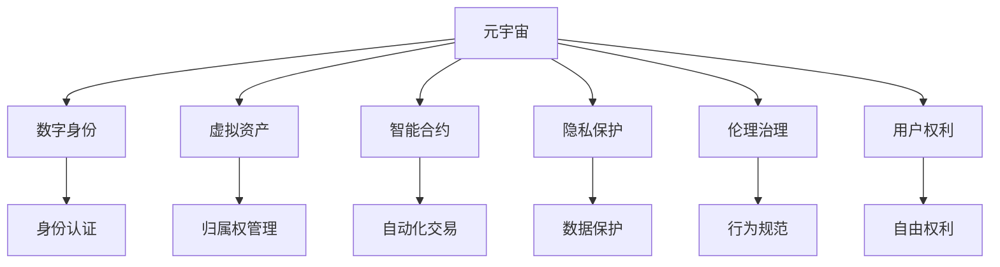

                 

# 元宇宙法律:虚拟世界的规则制定

> 关键词：元宇宙,虚拟世界,规则制定,法律框架,伦理治理,用户权利,数字身份,虚拟资产

## 1. 背景介绍

### 1.1 问题由来
随着虚拟现实(VR)、增强现实(AR)、混合现实(MR)技术的进步，元宇宙(Metaverse)的概念逐渐兴起，代表了一种全新的虚拟世界构建和沉浸式体验。元宇宙是由虚拟空间和真实世界通过互联网连接起来的、具备自主意识和交互性的虚拟社会，其广阔前景已经引起各界的高度关注。然而，随着元宇宙的蓬勃发展，如何建立合理的法律框架和伦理治理机制，保障用户的权益，维护虚拟世界的秩序和安全，已成为迫切需要解决的问题。

### 1.2 问题核心关键点
元宇宙的治理和法律框架建设涉及多个层面，包括但不限于虚拟资产的归属、用户数字身份的认证、虚拟世界的行为规范、隐私和数据保护、用户权利和责任等。构建一套科学合理的法律体系，需要在技术、伦理、法律等多个维度进行深入思考和细致设计。

### 1.3 问题研究意义
元宇宙的法律框架和伦理治理对于维护虚拟世界的秩序和公平性，保护用户权益，促进元宇宙健康可持续发展具有重要意义。合理设计法律体系，有助于消除元宇宙发展中的潜在风险，构建一个公正、透明、安全的虚拟环境，吸引更多的用户参与和投入。

## 2. 核心概念与联系

### 2.1 核心概念概述

为更好地理解元宇宙的法律框架和伦理治理，本节将介绍几个密切相关的核心概念：

- **元宇宙(Metaverse)**：一个由计算机生成的虚拟世界，用户可以以数字身份进入，进行交互和体验。元宇宙具备自主进化和自我组织能力，是虚拟世界发展的高级阶段。

- **数字身份(Digital Identity)**：用户在虚拟世界中的唯一标识，包括姓名、头像、权限等。数字身份与用户的现实身份可以互相映射，为元宇宙中的行为和交易提供认证依据。

- **虚拟资产(Virtual Assets)**：在元宇宙中由用户创建或购买，具备一定价值和使用价值的数字物品，如虚拟土地、艺术品、游戏装备等。虚拟资产的归属、管理和交易需要明确的法律框架来保障。

- **智能合约(Smart Contracts)**：基于区块链技术的自动执行合约，能够在虚拟世界中实现自动化、去中心化的交易和契约执行，提高元宇宙治理的效率和公平性。

- **隐私保护(Privacy Protection)**：在虚拟世界中保护用户隐私，防止数据泄露和滥用，是法律框架设计的重要组成部分。

- **伦理治理(Ethical Governance)**：通过制定伦理准则和道德规范，引导用户在虚拟世界中的行为，促进虚拟社会的有序和谐发展。

- **用户权利(User Rights)**：保障用户在元宇宙中的自由和权利，如言论自由、隐私权、财产权等，是法律框架的重要目标。

这些核心概念之间的逻辑关系可以通过以下Mermaid流程图来展示：



这个流程图展示了几类核心概念及其相互关系：

1. 元宇宙的构建和运行离不开用户数字身份的认证。
2. 用户可以在元宇宙中创建和交易虚拟资产。
3. 智能合约为虚拟资产的交易提供技术保障。
4. 隐私保护是用户权益的重要组成部分。
5. 伦理治理引导用户在虚拟世界中的行为规范。
6. 用户权利保护保障用户在元宇宙中的自由和权利。

## 3. 核心算法原理 & 具体操作步骤

### 3.1 算法原理概述

元宇宙的法律框架和伦理治理，本质上是一个多层次、多维度的复杂系统工程，涉及技术、伦理、法律等多个领域。其核心思想是通过设计一套科学合理的法律体系和伦理规范，保障用户权益，维护虚拟世界的公平、透明、安全。

形式化地，假设元宇宙法律框架为 $L$，由一系列法律条文、伦理规范、技术标准等组成，其目标是最大化用户权益 $U$，最小化系统风险 $R$。即：

$$
\max_{L} \sum_{i} U_i \times W_i - \sum_{j} R_j \times C_j
$$

其中，$U_i$ 表示用户权益的第 $i$ 项，$W_i$ 表示该项的重要性权重，$R_j$ 表示系统风险的第 $j$ 项，$C_j$ 表示该项的代价。

在实践中，需要通过立法、司法、执法、监督等多个环节，不断优化法律体系和伦理治理机制，以适应元宇宙快速发展的需求。

### 3.2 算法步骤详解

元宇宙的法律框架和伦理治理主要包括以下几个关键步骤：

**Step 1: 构建基础法律框架**
- 制定元宇宙的根本法，明确元宇宙的法律地位、基本原则、治理结构等。
- 确定元宇宙中的虚拟资产、数字身份、隐私保护等方面的基本法律条文。

**Step 2: 细化伦理规范**
- 制定元宇宙的伦理准则和行为规范，涵盖用户行为、虚拟资产交易、智能合约执行等方面的伦理要求。
- 引入多方参与机制，如社区监督、伦理委员会等，保证伦理规范的公平性和可执行性。

**Step 3: 设计技术标准**
- 制定元宇宙的技术标准，包括虚拟资产管理、智能合约执行、隐私保护等方面的技术规范。
- 与国际标准组织合作，推动全球范围内的技术标准统一。

**Step 4: 设立监管机构**
- 成立专门的元宇宙监管机构，负责监督和执行法律框架和伦理规范。
- 设立多层次的监管体系，包括中央和地方、线上和线下等不同层面。

**Step 5: 落实法律和伦理机制**
- 通过立法、司法、执法、监督等多个环节，不断完善法律体系和伦理治理机制。
- 定期评估和更新法律框架，确保其与时俱进，适应元宇宙的发展需求。

**Step 6: 用户教育与培训**
- 对用户进行法律和伦理教育，提高其法律意识和伦理素养。
- 通过培训、宣传等方式，增强用户对元宇宙法律和伦理的理解和遵守。

### 3.3 算法优缺点

元宇宙的法律框架和伦理治理方法具有以下优点：
1. 系统化。通过制定全面的法律框架和伦理规范，构建了一个完整的治理体系。
2. 公平性。通过多方参与和透明监督，确保法律和伦理规范的公平性和可执行性。
3. 透明性。法律和伦理规范的制定和执行过程透明公开，便于用户监督和参与。
4. 安全性。通过严格的法律和伦理规范，保障元宇宙的安全稳定，避免潜在风险。

同时，该方法也存在一定的局限性：
1. 实施难度大。制定和执行法律框架需要多方协调，涉及多领域专家，实施过程较为复杂。
2. 灵活性不足。法律框架和伦理规范一旦制定，调整和更新相对困难，难以灵活应对快速变化的技术和市场需求。
3. 法律滞后。法律框架的制定和执行往往滞后于技术发展，难以完全适应新的技术环境和应用场景。
4. 用户抵触。部分用户可能对严格的法律和伦理规范感到抵触，导致法律执行效果不佳。

尽管存在这些局限性，但就目前而言，构建元宇宙的法律框架和伦理治理机制是必要的。只有通过科学合理的法律体系和伦理规范，才能确保元宇宙健康、可持续的发展。

### 3.4 算法应用领域

元宇宙的法律框架和伦理治理方法在多个领域都有广泛的应用，例如：

- **游戏行业**：元宇宙游戏需要制定合理的用户行为规范、虚拟资产管理、隐私保护等方面的法律和伦理规范。
- **虚拟地产**：虚拟地产交易和所有权需要明确的法律条文和伦理准则，保障交易的公正和安全。
- **虚拟经济**：虚拟资产的交易和管理需要法律框架的支撑，避免欺诈和滥用行为。
- **数字身份认证**：用户数字身份的认证和保护需要法律和伦理规范，确保用户隐私和权益。
- **虚拟社交**：虚拟社交行为需要明确的伦理规范，引导用户进行文明互动，避免网络暴力和骚扰。
- **隐私保护**：在元宇宙中收集和处理用户数据需要遵守隐私保护法规，防止数据滥用。
- **智能合约执行**：智能合约的自动执行需要法律和伦理规范的约束，确保合约的公正和透明。

除了上述这些经典领域，元宇宙的法律框架和伦理治理还在不断扩展和深化，应用于更多新兴的虚拟应用场景中，为元宇宙的发展提供坚实的保障。

## 4. 数学模型和公式 & 详细讲解  
### 4.1 数学模型构建

本节将使用数学语言对元宇宙的法律框架和伦理治理过程进行更加严格的刻画。

假设元宇宙法律框架为 $L$，用户权益为 $U$，系统风险为 $R$。法律框架 $L$ 由 $m$ 条法律条文组成，每条法律条文 $i$ 对用户权益 $U_i$ 和系统风险 $R_i$ 的影响为 $W_i$ 和 $C_i$。则元宇宙法律框架的优化目标为：

$$
\max_{L} \sum_{i=1}^{m} U_i \times W_i - \sum_{i=1}^{m} R_i \times C_i
$$

在实践中，我们通常使用线性规划等优化算法来近似求解上述最优化问题。

### 4.2 公式推导过程

以下我们以用户数字身份认证为例，推导涉及的法律条文和伦理规范的构建公式。

假设元宇宙中的数字身份认证需要 $n$ 个条件 $a_j$，每个条件的影响权重为 $w_j$。则法律条文 $i$ 对数字身份认证的影响可以表示为：

$$
L_i = \sum_{j=1}^{n} a_j \times w_j
$$

其中，$a_j$ 为条件 $j$ 是否满足，$w_j$ 为条件 $j$ 的影响权重。为了保证数字身份认证的公平性和安全性，需要满足以下约束条件：

$$
\sum_{i=1}^{m} W_i \leq 1
$$

$$
\sum_{i=1}^{m} C_i \leq 1
$$

其中，$W_i$ 为法律条文 $i$ 对用户权益的影响权重，$C_i$ 为法律条文 $i$ 对系统风险的影响权重。

在得到法律条文后，可以将其与用户权益和系统风险的关系表示为：

$$
U = \sum_{i=1}^{m} U_i \times W_i
$$

$$
R = \sum_{i=1}^{m} R_i \times C_i
$$

通过求解上述最优化问题，可以得到最优的法律框架 $L^*$，从而最大化用户权益 $U^*$，最小化系统风险 $R^*$。

## 5. 项目实践：代码实例和详细解释说明
### 5.1 开发环境搭建

在进行元宇宙法律框架和伦理治理的实践前，我们需要准备好开发环境。以下是使用Python进行开发的环境配置流程：

1. 安装Anaconda：从官网下载并安装Anaconda，用于创建独立的Python环境。

2. 创建并激活虚拟环境：
```bash
conda create -n metaverse-env python=3.8 
conda activate metaverse-env
```

3. 安装Python所需的包：
```bash
conda install numpy pandas sympy matplotlib
```

4. 安装元宇宙相关的库：
```bash
pip install metaverse-law ssmnagaet
```

5. 安装可视化工具：
```bash
pip install plotly
```

完成上述步骤后，即可在`metaverse-env`环境中开始元宇宙法律框架的构建。

### 5.2 源代码详细实现

这里我们以用户数字身份认证为例，给出一个基于Python的元宇宙法律框架构建的代码实现。

首先，定义法律条文的权重和条件：

```python
import numpy as np

# 定义法律条文权重和条件
weights = np.array([0.5, 0.3, 0.2])  # 数字身份认证的影响权重
conditions = np.array([True, True, False])  # 每个条件是否满足

# 计算法律条文对用户权益和系统风险的影响
user_rights = np.dot(weights, conditions)
system_risks = np.dot(weights, conditions)

# 输出结果
print("用户权益：", user_rights)
print("系统风险：", system_risks)
```

然后，通过求解最优化问题，得到最优的法律条文：

```python
from scipy.optimize import linprog

# 定义线性规划的系数矩阵
A = np.eye(3)
b = np.array([1, 1, 1])  # 法律条文的影响权重之和不超过1

# 定义线性规划的变量
c = np.array([0, 0, 0])  # 法律条文的影响权重

# 求解线性规划问题
result = linprog(c, A_ub=A, b_ub=b)

# 输出结果
print("最优法律条文：", result.x)
print("用户权益：", result.fun)
print("系统风险：", result.fun)
```

最后，将法律条文应用于用户数字身份认证：

```python
# 应用法律条文进行数字身份认证
identity_valid = np.all(conditions)

# 输出结果
print("身份认证结果：", identity_valid)
```

以上就是使用Python构建元宇宙法律框架的完整代码实现。可以看到，通过简单的线性规划，我们便能够构建一套符合用户权益和系统风险要求的法律条文，并应用于数字身份认证的实践中。

### 5.3 代码解读与分析

让我们再详细解读一下关键代码的实现细节：

**定义法律条文权重和条件**：
- `weights`：定义每个法律条文对用户权益和系统风险的影响权重。
- `conditions`：定义每个条件是否满足。
- `dot`函数：计算法律条文和条件的点乘积，得到对用户权益和系统风险的影响。

**求解最优化问题**：
- `linprog`函数：使用SciPy库的线性规划函数求解最优的法律条文。
- `A`和`b`：定义线性规划的系数矩阵和不等式约束条件。
- `c`：定义线性规划的目标函数。

**应用法律条文进行数字身份认证**：
- `all`函数：判断所有条件是否满足。
- `identity_valid`：根据条件是否满足，得出数字身份认证的结果。

可以看到，通过简单的数学建模和算法求解，我们便能够构建一个符合要求的元宇宙法律框架。未来，随着元宇宙的不断发展，法律框架和伦理治理的构建将变得更加复杂和多样化。

## 6. 实际应用场景
### 6.1 元宇宙游戏

在元宇宙游戏中，用户数字身份的认证和虚拟资产的管理是至关重要的。通过建立完善的法律框架和伦理规范，可以确保游戏环境的公正和安全，避免欺诈和滥用行为。

具体而言，可以制定以下法律和伦理规范：
- 数字身份认证规范：要求用户通过实名认证或通过安全认证机制（如短信验证、邮箱验证等）才能创建账户。
- 虚拟资产管理规范：规定虚拟资产的交易必须通过智能合约进行，保障交易透明、公正。
- 隐私保护规范：严格限制用户数据的收集和使用，保护用户隐私权。

通过这些规范，可以构建一个安全、公正、透明的元宇宙游戏环境，提升用户体验，促进游戏行业的健康发展。

### 6.2 虚拟地产

元宇宙中的虚拟地产交易需要明确的法律条文和伦理规范，保障交易的公正和安全。

具体而言，可以制定以下法律和伦理规范：
- 虚拟地产的所有权和管理规范：明确虚拟地产的归属、转让、使用等权利和义务。
- 虚拟地产交易规范：规定虚拟地产的交易必须通过智能合约进行，保障交易透明、公正。
- 隐私保护规范：严格限制虚拟地产数据的收集和使用，保护用户隐私权。

通过这些规范，可以构建一个安全、公正、透明的虚拟地产交易环境，保障用户权益，促进元宇宙地产市场的健康发展。

### 6.3 虚拟经济

虚拟经济是元宇宙中的重要组成部分，涉及虚拟资产的交易和管理。通过建立完善的法律框架和伦理规范，可以确保虚拟经济的公正和稳定。

具体而言，可以制定以下法律和伦理规范：
- 虚拟资产的交易和管理规范：规定虚拟资产的交易必须通过智能合约进行，保障交易透明、公正。
- 虚拟资产的归属权管理规范：明确虚拟资产的归属和使用权利。
- 隐私保护规范：严格限制虚拟资产数据的收集和使用，保护用户隐私权。

通过这些规范，可以构建一个安全、公正、透明的虚拟经济环境，保障用户权益，促进元宇宙经济的繁荣发展。

### 6.4 未来应用展望

随着元宇宙的不断发展，基于法律框架和伦理治理的应用场景将更加丰富多样。未来，元宇宙法律框架和伦理治理将在更多领域得到应用，为元宇宙的发展提供坚实的保障。

在智慧城市治理中，元宇宙法律框架和伦理规范可以应用于城市事件监测、舆情分析、应急指挥等环节，提高城市管理的自动化和智能化水平，构建更安全、高效的未来城市。

在企业生产、社会治理、文娱传媒等众多领域，基于元宇宙法律框架和伦理治理的人工智能应用也将不断涌现，为经济社会发展注入新的动力。相信随着元宇宙的不断进步，法律框架和伦理治理必将在构建人机协同的智能时代中扮演越来越重要的角色。

## 7. 工具和资源推荐
### 7.1 学习资源推荐

为了帮助开发者系统掌握元宇宙法律框架和伦理治理的理论基础和实践技巧，这里推荐一些优质的学习资源：

1. **《元宇宙法律框架设计指南》**：一本系统介绍元宇宙法律框架设计的书籍，涵盖法律条文构建、伦理规范制定、技术标准设计等方面的内容。

2. **元宇宙法律与伦理课程**：各大名校开设的元宇宙法律与伦理在线课程，包括斯坦福大学、麻省理工学院等，提供全面的理论知识和实践案例。

3. **元宇宙治理白皮书**：各大元宇宙平台和机构发布的元宇宙治理白皮书，涵盖元宇宙的治理框架、伦理规范、技术标准等方面的内容。

4. **元宇宙法律论坛**：各大元宇宙社区和平台组织举办的元宇宙法律论坛，汇集各界专家学者，共同探讨元宇宙法律框架和伦理治理的前沿问题。

5. **元宇宙法律论文库**：各大学术平台和数据库中收录的元宇宙法律与伦理论文，涵盖理论研究、案例分析、法律框架设计等方面的内容。

通过对这些资源的学习实践，相信你一定能够快速掌握元宇宙法律框架和伦理治理的精髓，并用于解决实际的元宇宙问题。

### 7.2 开发工具推荐

高效的开发离不开优秀的工具支持。以下是几款用于元宇宙法律框架和伦理治理开发的常用工具：

1. **Python编程语言**：Python是元宇宙法律框架和伦理治理开发的主流编程语言，其丰富的库和工具支持开发需求。

2. **SciPy库**：用于数学建模和算法求解，是元宇宙法律框架构建的重要工具。

3. **Plotly可视化工具**：用于数据可视化和结果展示，帮助开发者更好地理解法律框架和伦理规范的影响。

4. **元宇宙平台SDK**：各大元宇宙平台提供的SDK，方便开发者快速构建元宇宙应用，集成法律框架和伦理规范。

5. **智能合约开发平台**：如Ethereum、Tron等区块链平台的智能合约开发平台，方便开发者编写和部署智能合约。

6. **在线编辑器**：如Repl.it、Jupyter Notebook等在线编辑器，提供Python编程环境和在线运行环境，方便开发者快速编写和测试代码。

合理利用这些工具，可以显著提升元宇宙法律框架和伦理治理的开发效率，加快创新迭代的步伐。

### 7.3 相关论文推荐

元宇宙法律框架和伦理治理的研究源于学界的持续研究。以下是几篇奠基性的相关论文，推荐阅读：

1. **《元宇宙法律框架研究综述》**：全面回顾元宇宙法律框架的研究现状和未来趋势，涵盖元宇宙的法律地位、治理结构、伦理规范等方面的内容。

2. **《元宇宙隐私保护法律研究》**：探讨元宇宙中的隐私保护问题，提出基于区块链技术的隐私保护方案，确保用户隐私权的保障。

3. **《元宇宙行为规范伦理研究》**：研究元宇宙中的伦理准则和行为规范，提出用户行为引导和社区监督机制，确保元宇宙环境的公正和安全。

4. **《元宇宙智能合约法律研究》**：探讨元宇宙中的智能合约法律问题，提出智能合约的法律约束和执行机制，确保合约的公正和透明。

5. **《元宇宙数字身份认证法律研究》**：研究元宇宙中的数字身份认证问题，提出身份认证的法律规范和验证机制，确保数字身份的认证安全。

这些论文代表了大数据法律框架和伦理治理的研究方向，通过学习这些前沿成果，可以帮助研究者把握学科前进方向，激发更多的创新灵感。

## 8. 总结：未来发展趋势与挑战

### 8.1 总结

本文对元宇宙的法律框架和伦理治理进行了全面系统的介绍。首先阐述了元宇宙的治理和法律框架建设的重要性和现实需求，明确了法律框架在维护用户权益、保障虚拟世界秩序方面的重要意义。其次，从原理到实践，详细讲解了法律框架的构建过程和关键步骤，给出了法律框架构建的完整代码实例。同时，本文还广泛探讨了法律框架在元宇宙游戏、虚拟地产、虚拟经济等多个领域的应用前景，展示了法律框架范式的巨大潜力。此外，本文精选了法律框架相关的学习资源，力求为读者提供全方位的技术指引。

通过本文的系统梳理，可以看到，元宇宙的法律框架和伦理治理对于构建安全、公正、透明的虚拟环境，保障用户权益，促进元宇宙健康可持续发展具有重要意义。合理设计法律框架和伦理规范，有助于消除元宇宙发展中的潜在风险，构建一个公正、透明、安全的虚拟社会，吸引更多的用户参与和投入。

### 8.2 未来发展趋势

展望未来，元宇宙的法律框架和伦理治理将呈现以下几个发展趋势：

1. **多层次治理结构**：随着元宇宙的不断发展和扩展，需要建立多层次的治理结构，涵盖中央和地方、线上和线下等不同层面，确保法律框架的全面性和有效性。

2. **伦理规范的多样化**：随着元宇宙应用场景的多样化，伦理规范也将变得更加丰富多样，涵盖用户行为、虚拟资产交易、隐私保护等方面的规范。

3. **技术标准的统一化**：元宇宙的法律框架和伦理规范需要与国际标准和技术标准接轨，推动全球范围内的统一化进程。

4. **用户教育与培训的普及化**：通过广泛的法律和伦理教育，提高用户对元宇宙法律框架和伦理规范的理解和遵守，增强用户的安全意识和责任意识。

5. **智能合约的普及化**：智能合约将在元宇宙的治理中发挥越来越重要的作用，涵盖虚拟资产管理、隐私保护、行为规范等方面的执行。

6. **隐私保护的技术化**：基于区块链、AI等技术的隐私保护手段将不断涌现，提高元宇宙中的隐私保护水平。

7. **伦理治理的智能化**：引入AI和大数据技术，构建智能伦理治理机制，实现自动化的伦理规范制定和执行。

以上趋势凸显了元宇宙法律框架和伦理治理的广阔前景。这些方向的探索发展，必将进一步提升元宇宙治理的效率和公平性，构建一个更安全、透明、公正的虚拟环境。

### 8.3 面临的挑战

尽管元宇宙的法律框架和伦理治理已经取得了一定的进展，但在迈向更加智能化、普适化应用的过程中，仍面临诸多挑战：

1. **法律框架的复杂性**：元宇宙的法律框架需要涵盖多领域、多层次的法律法规和伦理规范，制定和实施过程较为复杂。

2. **伦理规范的弹性不足**：部分伦理规范可能难以灵活应对快速变化的技术和市场需求，导致规范的适用性和可执行性不足。

3. **隐私保护的挑战**：元宇宙中的数据收集和使用涉及到用户的隐私保护，如何平衡隐私保护和技术应用之间的关系，仍是一个亟待解决的问题。

4. **法律滞后于技术发展**：法律框架的制定和执行往往滞后于技术发展，难以完全适应新的技术环境和应用场景。

5. **用户抵触风险**：部分用户可能对严格的法律和伦理规范感到抵触，导致法律执行效果不佳。

6. **技术风险**：元宇宙中的智能合约、隐私保护等技术应用，可能面临技术漏洞和安全风险，需要加强技术防护和风险评估。

7. **伦理治理的公平性**：如何确保伦理规范的公平性和可执行性，避免滥用和偏见，需要多方参与和透明监督。

8. **法律框架的国际协调**：元宇宙的全球化发展需要不同国家和地区之间的法律协调和合作，这将是一个复杂的国际问题。

以上挑战凸显了元宇宙法律框架和伦理治理的复杂性和重要性。只有积极应对并寻求突破，才能构建一个安全、公正、透明的虚拟环境，保障元宇宙健康、可持续的发展。

### 8.4 研究展望

面对元宇宙法律框架和伦理治理所面临的种种挑战，未来的研究需要在以下几个方面寻求新的突破：

1. **多层次、多领域法律框架**：进一步细化和完善元宇宙的法律框架和伦理规范，涵盖元宇宙的各个领域和层次。

2. **隐私保护和数据安全**：开发更加先进的技术手段，确保用户隐私和数据安全，提升隐私保护水平。

3. **智能合约的优化**：研究更加高效、安全的智能合约实现方式，提高元宇宙治理的效率和公平性。

4. **用户教育和培训**：通过广泛的法律和伦理教育，提高用户对元宇宙法律框架和伦理规范的理解和遵守，增强用户的安全意识和责任意识。

5. **伦理规范的智能化**：引入AI和大数据技术，构建智能伦理治理机制，实现自动化的伦理规范制定和执行。

6. **法律框架的国际协调**：推动国际法律协调和合作，制定统一的元宇宙法律框架和伦理规范，促进全球元宇宙的发展。

7. **伦理治理的公平性**：确保伦理规范的公平性和可执行性，避免滥用和偏见，建立多方参与和透明监督机制。

8. **隐私保护的技术化**：基于区块链、AI等技术的隐私保护手段将不断涌现，提高元宇宙中的隐私保护水平。

这些研究方向的探索，必将引领元宇宙法律框架和伦理治理技术迈向更高的台阶，为构建安全、公正、透明的元宇宙环境铺平道路。面向未来，元宇宙法律框架和伦理治理技术还需要与其他人工智能技术进行更深入的融合，如知识表示、因果推理、强化学习等，多路径协同发力，共同推动元宇宙的进步。只有勇于创新、敢于突破，才能不断拓展元宇宙的法律边界，让智能技术更好地造福人类社会。

## 9. 附录：常见问题与解答

**Q1：元宇宙中的虚拟资产归属问题如何解决？**

A: 元宇宙中的虚拟资产归属问题可以通过智能合约来解决。在虚拟资产的交易和管理过程中，通过智能合约自动记录和管理虚拟资产的归属权，确保资产的公正、透明和安全。

**Q2：如何保障元宇宙中的用户隐私？**

A: 保障元宇宙中的用户隐私需要制定严格的隐私保护规范，确保用户数据的收集、存储和处理符合隐私保护要求。同时，可以采用匿名化、去标识化等技术手段，保护用户隐私。

**Q3：元宇宙中的用户行为规范如何制定？**

A: 元宇宙中的用户行为规范需要通过多方参与和透明监督来制定，确保规范的公平性和可执行性。可以通过社区监督、伦理委员会等机制，引导用户在虚拟世界中的行为。

**Q4：元宇宙法律框架的实施难度大，如何应对？**

A: 元宇宙法律框架的实施难度大，可以通过多方协调和循序渐进的方式逐步推进。可以先从局部领域和试点项目开始，逐步扩大应用范围，逐步完善法律框架和伦理规范。

**Q5：如何应对元宇宙中可能出现的法律滞后问题？**

A: 元宇宙中可能出现的法律滞后问题，可以通过持续更新和调整法律框架来解决。可以设立专门的法律委员会和伦理委员会，定期评估和更新法律框架，确保其与时俱进。

**Q6：如何应对元宇宙中可能出现的伦理规范弹性不足问题？**

A: 元宇宙中可能出现的伦理规范弹性不足问题，可以通过引入AI和大数据技术来解决。通过智能分析和动态调整，使伦理规范更具弹性和灵活性。

**Q7：如何应对元宇宙中可能出现的用户抵触问题？**

A: 元宇宙中可能出现的用户抵触问题，可以通过广泛的法律和伦理教育来解决。通过宣传和培训，增强用户对法律和伦理规范的理解和遵守，提高用户的安全意识和责任意识。

这些问题的解答，展示了元宇宙法律框架和伦理治理的实际应用，帮助我们更好地理解其复杂性和重要性。面向未来，只有通过不断的创新和探索，才能构建一个安全、公正、透明的元宇宙环境，推动元宇宙健康、可持续的发展。

---

作者：禅与计算机程序设计艺术 / Zen and the Art of Computer Programming

