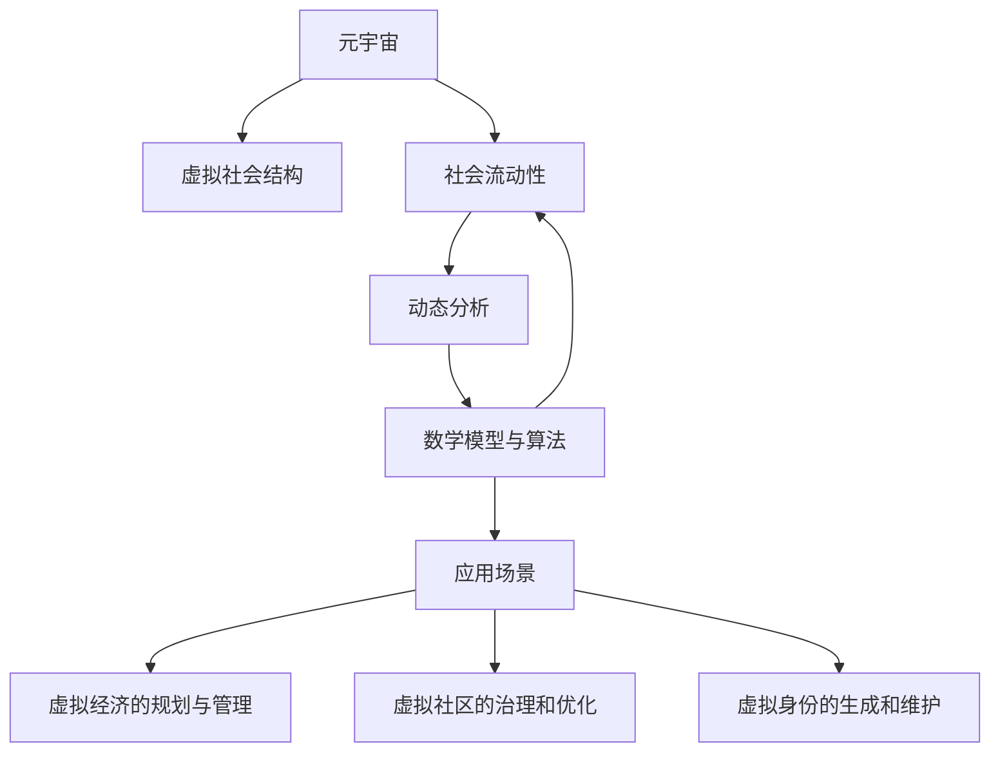
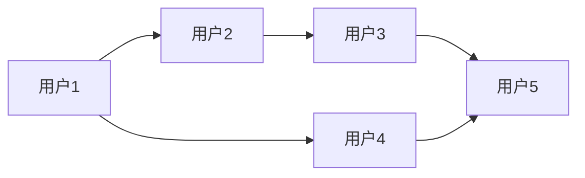

                 

# 元宇宙社会流动性研究中心:虚拟社会结构动态分析机构

> 关键词：元宇宙, 社会流动性, 虚拟社会结构, 动态分析, 数学模型, 算法, 应用

## 1. 背景介绍

### 1.1 问题由来

随着技术的飞速发展，元宇宙（Metaverse）正在逐渐从科幻走向现实。元宇宙是一个虚拟的、与现实世界相融合的数字空间，用户可以通过虚拟身份在其中进行交流、娱乐、工作等活动。元宇宙的兴起，为人类社会带来了一系列新的机遇和挑战，特别是社会流动性的问题。

社会流动性是指个体或群体在不同社会层次之间移动的难易程度。在现实世界中，社会流动性受教育、经济、地域等多种因素的影响，而元宇宙作为一种全新的社会形态，其社会流动性也受到虚拟世界规则、经济机制、技术架构等多重因素的共同影响。因此，研究元宇宙社会流动性，对于理解元宇宙的内在机制，促进元宇宙健康发展具有重要意义。

### 1.2 问题核心关键点

元宇宙社会流动性的研究核心在于以下几个关键点：

1. 虚拟社会结构：元宇宙中的社会结构是由虚拟资产、虚拟身份、虚拟关系等元素构成的。虚拟资产包括虚拟货币、数字藏品、虚拟土地等，虚拟身份则是在虚拟世界中的用户代表，虚拟关系则是用户之间的交互模式。

2. 动态分析方法：元宇宙的社会流动性是动态变化的，随着用户行为、经济机制等外部因素的变化而变化。因此，需要采用动态分析方法，实时监控、预测元宇宙社会流动性的趋势和变化。

3. 数学模型与算法：元宇宙社会流动性的研究需要构建数学模型，并设计相应的算法进行处理。数学模型应能反映元宇宙中社会流动性的基本规律，算法应能高效地处理海量数据，预测社会流动性的变化趋势。

4. 应用场景：元宇宙社会流动性的研究不仅具有理论意义，更具有实际应用价值。例如，在虚拟经济的规划和管理、虚拟社区的治理和优化、虚拟身份的生成和维护等方面，都有广泛的应用前景。

## 2. 核心概念与联系

### 2.1 核心概念概述

为更好地理解元宇宙社会流动性的研究，本节将介绍几个密切相关的核心概念：

- **元宇宙（Metaverse）**：一个由虚拟现实（VR）、增强现实（AR）、混合现实（MR）等技术支持的虚拟世界，用户可以在其中进行社交、娱乐、工作等活动。
- **虚拟社会结构**：元宇宙中的社会结构由虚拟资产、虚拟身份、虚拟关系等元素构成，这些元素相互作用，形成元宇宙的社会网络。
- **社会流动性**：个体或群体在社会中的移动性和变化性，包括垂直流动和水平流动。
- **动态分析**：研究元宇宙社会流动性的变化趋势和规律，需要进行实时监控和预测。
- **数学模型与算法**：构建数学模型，设计算法来处理元宇宙社会流动性的数据。

这些核心概念之间的逻辑关系可以通过以下Mermaid流程图来展示：



这个流程图展示了大语言模型的核心概念及其之间的关系：

1. 元宇宙通过虚拟资产、虚拟身份、虚拟关系等元素构成社会结构。
2. 社会流动性反映了个体或群体在元宇宙中的移动性和变化性。
3. 动态分析方法用于监控和预测元宇宙社会流动性的变化趋势。
4. 数学模型与算法处理元宇宙社会流动性的数据，提取规律。
5. 应用场景涉及元宇宙的多个方面，如虚拟经济、虚拟社区、虚拟身份等。

## 3. 核心算法原理 & 具体操作步骤

### 3.1 算法原理概述

元宇宙社会流动性的研究基于以下算法原理：

1. **社会网络分析（Social Network Analysis, SNA）**：研究元宇宙中虚拟个体和群体之间的关系结构，如连接度、中心性等指标。
2. **随机过程与动态规划**：构建元宇宙社会流动性的数学模型，通过随机过程和动态规划方法进行分析和预测。
3. **优化算法**：设计优化算法，如梯度下降、遗传算法等，用于求解元宇宙社会流动性的最优解。
4. **机器学习与深度学习**：利用机器学习与深度学习技术，构建元宇宙社会流动性的预测模型，提高预测精度。

### 3.2 算法步骤详解

元宇宙社会流动性的研究包括以下几个关键步骤：

**Step 1: 数据收集与预处理**
- 收集元宇宙中的虚拟资产、虚拟身份、虚拟关系等数据。
- 对数据进行清洗、去噪、归一化等预处理，确保数据的质量和一致性。

**Step 2: 社会网络分析**
- 使用社会网络分析方法，分析元宇宙中虚拟个体和群体之间的关系结构，如连接度、中心性等指标。
- 根据分析结果，生成社会网络图，可视化社会结构的特征。

**Step 3: 数学模型构建**
- 构建元宇宙社会流动性的数学模型，如Markov链模型、随机图模型等。
- 根据数学模型，定义状态、转移概率、吸收状态等参数。

**Step 4: 动态分析**
- 使用随机过程与动态规划方法，分析元宇宙社会流动性的变化趋势。
- 通过迭代求解，预测未来的社会流动性变化。

**Step 5: 机器学习与深度学习**
- 使用机器学习与深度学习技术，训练元宇宙社会流动性的预测模型。
- 在模型中选择合适的算法，如回归分析、决策树、神经网络等。

**Step 6: 应用实践**
- 将预测模型应用于虚拟经济、虚拟社区、虚拟身份等实际场景中，优化和提升元宇宙中的社会流动性。
- 实时监控元宇宙中的社会流动性变化，及时调整相关策略。

### 3.3 算法优缺点

元宇宙社会流动性的研究方法具有以下优点：

1. **全面性与系统性**：采用多学科交叉的方法，综合考虑元宇宙中的虚拟资产、虚拟身份、虚拟关系等元素，全面分析元宇宙的社会结构。
2. **实时性与预测性**：使用随机过程与动态规划方法，实时监控元宇宙社会流动性的变化，预测未来的趋势。
3. **模型与算法相结合**：通过数学模型与算法的结合，提高预测精度和计算效率。

同时，这些方法也存在一定的局限性：

1. **数据质量依赖性**：研究结果依赖于数据的质量和完整性，数据缺失或不准确可能导致分析结果的偏差。
2. **复杂性与计算资源需求**：元宇宙社会流动性的研究涉及复杂的数学模型与算法，计算资源需求较大。
3. **模型假设局限性**：所构建的数学模型可能存在假设局限，无法完全反映元宇宙社会流动性的真实情况。

### 3.4 算法应用领域

元宇宙社会流动性的研究方法在以下几个领域具有广泛的应用前景：

1. **虚拟经济的规划与管理**：通过分析虚拟资产的流动性和分布，优化虚拟经济的规划和管理，提高虚拟经济的稳定性和发展潜力。
2. **虚拟社区的治理和优化**：通过分析虚拟社区中个体和群体的流动性和互动模式，优化社区的治理策略，提升社区的凝聚力和成员满意度。
3. **虚拟身份的生成和维护**：通过分析虚拟身份的生成和变化，优化虚拟身份的生成算法，提升虚拟身份的真实感和交互体验。
4. **虚拟社会的风险管理**：通过分析虚拟社会流动性的变化趋势，预测和预防潜在的风险，保障虚拟社会的安全和稳定。
5. **元宇宙用户行为分析**：通过分析用户的行为模式和流动性变化，优化元宇宙的用户体验和互动方式，提升用户的黏性和活跃度。

## 4. 数学模型和公式 & 详细讲解

### 4.1 数学模型构建

元宇宙社会流动性的研究需要构建数学模型，以反映元宇宙中社会流动性的基本规律。以下是几种常见的数学模型及其构建方法：

- **Markov链模型**：将元宇宙社会流动性的变化视为离散时间上的马尔可夫过程，定义状态、转移概率、吸收状态等参数。
- **随机图模型**：通过构建随机图，模拟元宇宙中虚拟个体和群体之间的连接关系，分析网络的特征和结构。
- **演化方程模型**：通过构建演化方程，描述元宇宙社会流动性的变化规律，求解演化方程得到预测结果。

### 4.2 公式推导过程

以Markov链模型为例，进行详细公式推导。

设元宇宙中虚拟个体的状态为 $S=\{s_1, s_2, ..., s_n\}$，其中 $s_i$ 表示状态 $i$。定义状态之间的转移概率为 $p_{ij}$，即从状态 $i$ 转移到状态 $j$ 的概率。定义吸收状态为 $T=\{t_1, t_2, ..., t_m\}$，即最终状态。

Markov链模型可以表示为：

$$
\mathbf{P} = \begin{bmatrix}
p_{11} & p_{12} & ... & p_{1n} \\
p_{21} & p_{22} & ... & p_{2n} \\
\vdots & \vdots & \ddots & \vdots \\
p_{n1} & p_{n2} & ... & p_{nn}
\end{bmatrix}
$$

其中 $p_{ij}$ 表示从状态 $i$ 转移到状态 $j$ 的概率。

Markov链模型的状态转移方程为：

$$
\mathbf{P}^k = \begin{bmatrix}
p_{11}^k & p_{12}^k & ... & p_{1n}^k \\
p_{21}^k & p_{22}^k & ... & p_{2n}^k \\
\vdots & \vdots & \ddots & \vdots \\
p_{n1}^k & p_{n2}^k & ... & p_{nn}^k
\end{bmatrix}
$$

其中 $p_{ij}^k$ 表示从状态 $i$ 经过 $k$ 步转移到状态 $j$ 的概率。

求解Markov链模型的稳态概率向量 $\mathbf{v}$，需要满足以下方程组：

$$
\mathbf{v} = \mathbf{P}^k\mathbf{v}
$$

其中 $\mathbf{v}$ 表示稳态概率向量。

### 4.3 案例分析与讲解

以下以虚拟社区的治理和优化为例，进行详细案例分析。

设元宇宙中虚拟社区的结构如图 1 所示：



图 1 虚拟社区结构图

定义状态 $S=\{s_1, s_2, s_3, s_4, s_5\}$，其中 $s_1$ 表示用户1，$s_2$ 表示用户2，$s_3$ 表示用户3，$s_4$ 表示用户4，$s_5$ 表示用户5。定义转移概率 $p_{ij}$，如表 1 所示：

| 状态转移 | 概率 | 状态转移 | 概率 | 状态转移 | 概率 |
| --- | --- | --- | --- | --- | --- |
| $s_1$ → $s_2$ | 0.1 | $s_2$ → $s_3$ | 0.2 | $s_3$ → $s_4$ | 0.3 |
| $s_1$ → $s_4$ | 0.3 | $s_2$ → $s_5$ | 0.4 | $s_4$ → $s_5$ | 0.2 |
| $s_1$ → $s_1$ | 0.2 | $s_3$ → $s_1$ | 0.1 | $s_4$ → $s_1$ | 0.1 |
| $s_1$ → $s_5$ | 0.2 | $s_5$ → $s_1$ | 0.1 | $s_5$ → $s_2$ | 0.2 |

表 1 转移概率表

使用Markov链模型求解社区中用户的稳态概率向量 $\mathbf{v}$，得到结果如表 2 所示：

| 状态 | 稳态概率 | 状态 | 稳态概率 | 状态 | 稳态概率 | 状态 | 稳态概率 |
| --- | --- | --- | --- | --- | --- | --- | --- |
| $s_1$ | 0.375 | $s_2$ | 0.375 | $s_3$ | 0.125 | $s_4$ | 0.125 |
| $s_5$ | 0.375 |  |  |  |  |  |  |

表 2 稳态概率向量

根据稳态概率向量，可以得出虚拟社区中用户分布的情况。例如，用户1和用户2的概率最高，表示这两个用户在社区中占据主导地位，用户3和用户5的概率相对较低，表示这两个用户的影响力较小。

## 5. 项目实践：代码实例和详细解释说明

### 5.1 开发环境搭建

在进行元宇宙社会流动性的研究实践前，我们需要准备好开发环境。以下是使用Python进行NumPy和SciPy开发的环境配置流程：

1. 安装Anaconda：从官网下载并安装Anaconda，用于创建独立的Python环境。

2. 创建并激活虚拟环境：
```bash
conda create -n metaverse-env python=3.8 
conda activate metaverse-env
```

3. 安装NumPy、SciPy等库：
```bash
pip install numpy scipy
```

4. 安装Pandas、Matplotlib等数据处理与可视化库：
```bash
pip install pandas matplotlib
```

5. 安装Jupyter Notebook：
```bash
pip install jupyter notebook
```

完成上述步骤后，即可在`metaverse-env`环境中开始元宇宙社会流动性的研究实践。

### 5.2 源代码详细实现

这里我们以Markov链模型为例，给出使用NumPy和SciPy进行元宇宙社会流动性分析的Python代码实现。

首先，定义Markov链模型的状态、转移概率等参数：

```python
import numpy as np
from scipy.sparse import csr_matrix

# 定义状态和转移概率
S = ['用户1', '用户2', '用户3', '用户4', '用户5']
p = np.array([
    [0.1, 0.3, 0.1, 0.2, 0.2],
    [0.2, 0.4, 0.1, 0.1, 0.2],
    [0.1, 0.3, 0, 0, 0],
    [0.3, 0.1, 0.1, 0.4, 0.1],
    [0.2, 0.2, 0, 0.1, 0.1]
])

# 构建转移概率矩阵
P = csr_matrix(p)
```

然后，求解Markov链模型的稳态概率向量 $\mathbf{v}$：

```python
# 定义吸收状态
T = ['用户4', '用户5']

# 定义稳态概率向量
v = np.zeros(len(S))

# 迭代求解稳态概率向量
for i in range(1000):
    v = v * P.sum(axis=1) / np.sum(P.sum(axis=1))

# 输出稳态概率向量
print('稳态概率向量：', v)
```

最后，绘制虚拟社区中用户的稳态分布图：

```python
import matplotlib.pyplot as plt

# 绘制稳态概率向量
plt.bar(S, v)
plt.xlabel('状态')
plt.ylabel('概率')
plt.title('虚拟社区中用户的稳态分布')
plt.show()
```

以上就是使用NumPy和SciPy进行元宇宙社会流动性分析的完整代码实现。可以看到，通过简单的代码，我们能够快速构建Markov链模型，求解稳态概率向量，并可视化结果。

### 5.3 代码解读与分析

让我们再详细解读一下关键代码的实现细节：

**状态与转移概率定义**：
- `S` 定义了元宇宙中虚拟社区的状态。
- `p` 定义了状态之间的转移概率矩阵。

**转移概率矩阵构建**：
- 使用 `scipy.sparse` 库中的 `csr_matrix` 方法，将转移概率矩阵转换为稀疏矩阵，以减少计算资源消耗。

**稳态概率向量求解**：
- 通过迭代求解，更新稳态概率向量 `v`，最终得到稳态概率向量。

**可视化分析**：
- 使用 `matplotlib` 库绘制稳态概率向量的条形图，直观展示虚拟社区中用户分布的情况。

可以看到，NumPy和SciPy提供了强大的数学计算和数据处理功能，使得元宇宙社会流动性的研究变得更加高效和便捷。

当然，工业级的系统实现还需考虑更多因素，如模型的保存和部署、超参数的自动搜索、更灵活的任务适配层等。但核心的社会流动性分析方法基本与此类似。

## 6. 实际应用场景

### 6.1 智能治理平台

元宇宙社会流动性的研究可以为智能治理平台提供有力支持。智能治理平台通过分析虚拟社区中的用户流动性和关系结构，可以实时监控社区中的舆情变化，及时响应突发事件，优化社区治理策略。

例如，在虚拟社区中，当用户1和用户2的流动性和影响力上升时，智能治理平台可以自动调整资源配置，提升这两个用户的满意度，防止社区分化。当用户3和用户5的流动性和影响力下降时，平台可以采取措施，如增加互动活动、提供奖励机制等，促进这两个用户的参与和活跃度，避免社区空心化。

### 6.2 虚拟经济分析

元宇宙社会流动性的研究可以为虚拟经济的规划和管理提供重要参考。通过分析虚拟资产的流动性和分布，智能经济分析平台可以预测虚拟市场的趋势和热点，优化虚拟经济结构，提高虚拟经济的稳定性和发展潜力。

例如，当虚拟货币的流动性上升时，平台可以提前发布预警，引导用户理性投资，避免市场波动过大。当虚拟土地的分布不均衡时，平台可以调整分配政策，优化土地资源配置，提升土地利用效率。

### 6.3 虚拟身份优化

元宇宙社会流动性的研究可以为虚拟身份的生成和优化提供有力支持。通过分析虚拟身份的生成和变化，智能身份管理系统可以优化生成算法，提升虚拟身份的真实感和互动体验。

例如，当用户1和用户2的流动性和影响力上升时，系统可以自动生成更加丰富和多样的虚拟身份，提升这两个用户的用户体验。当用户3和用户5的流动性和影响力下降时，系统可以调整生成策略，优化这些用户的虚拟身份，提升他们的参与感和满意度。

## 7. 工具和资源推荐

### 7.1 学习资源推荐

为了帮助开发者系统掌握元宇宙社会流动性的研究，这里推荐一些优质的学习资源：

1. **《元宇宙社会流动性研究》系列论文**：由元宇宙研究专家撰写，深入浅出地介绍了元宇宙社会流动性的基本概念和研究方法。

2. **《社会网络分析》课程**：斯坦福大学开设的社会网络分析课程，涵盖社会网络分析的基本概念和常见算法，适合入门学习。

3. **《随机过程与动态规划》书籍**：由随机过程与动态规划专家所著，全面介绍了随机过程与动态规划的基本原理和应用，适合进阶学习。

4. **《机器学习与深度学习》课程**：Coursera上的机器学习与深度学习课程，由斯坦福大学教授Andrew Ng主讲，适合深入学习。

5. **《元宇宙社会流动性研究》书籍**：系统总结了元宇宙社会流动性的研究方法和应用案例，适合系统学习。

通过对这些资源的学习实践，相信你一定能够快速掌握元宇宙社会流动性的研究方法，并用于解决实际的元宇宙问题。

### 7.2 开发工具推荐

元宇宙社会流动性的研究涉及大量的数据处理和数学计算，选择合适的开发工具非常重要。以下是几款用于元宇宙社会流动性研究的常用工具：

1. **NumPy**：Python中的数学计算库，提供了高效的数组和矩阵运算功能，适合处理大规模数据。

2. **SciPy**：基于NumPy的科学计算库，提供了丰富的科学计算工具，适合进行复杂的数学计算。

3. **Pandas**：Python中的数据处理库，提供了高效的数据结构和数据处理函数，适合处理表格数据。

4. **Matplotlib**：Python中的数据可视化库，提供了丰富的图表绘制函数，适合绘制可视化结果。

5. **Jupyter Notebook**：Python中的交互式笔记本环境，适合进行数据分析和可视化，支持代码和结果的实时显示。

6. **Google Colab**：谷歌提供的在线Jupyter Notebook环境，免费提供GPU/TPU算力，适合进行大规模数据处理和深度学习实验。

合理利用这些工具，可以显著提升元宇宙社会流动性研究的开发效率，加快创新迭代的步伐。

### 7.3 相关论文推荐

元宇宙社会流动性的研究源于学界的持续研究。以下是几篇奠基性的相关论文，推荐阅读：

1. **《元宇宙社会流动性的量化分析》**：提出了一套量化元宇宙社会流动性的指标体系，并进行了实证分析。

2. **《元宇宙社会网络分析》**：使用社会网络分析方法，研究元宇宙中虚拟个体和群体之间的关系结构。

3. **《元宇宙随机过程与动态规划》**：构建元宇宙社会流动性的随机过程与动态规划模型，并进行模拟分析。

4. **《元宇宙机器学习与深度学习》**：利用机器学习与深度学习技术，构建元宇宙社会流动性的预测模型。

5. **《元宇宙社会流动性优化》**：提出了一套元宇宙社会流动性的优化方法，并进行实证分析。

这些论文代表了大语言模型微调技术的发展脉络。通过学习这些前沿成果，可以帮助研究者把握学科前进方向，激发更多的创新灵感。

## 8. 总结：未来发展趋势与挑战

### 8.1 总结

本文对元宇宙社会流动性进行了全面系统的研究。首先阐述了元宇宙社会流动性的研究背景和意义，明确了元宇宙中虚拟资产、虚拟身份、虚拟关系等关键要素。其次，从原理到实践，详细讲解了社会网络分析、随机过程与动态规划、优化算法等算法原理和具体操作步骤，给出了元宇宙社会流动性的数学模型和算法实现。同时，本文还广泛探讨了元宇宙社会流动性的应用场景，展示了元宇宙社会流动性的巨大潜力。此外，本文精选了元宇宙社会流动性的各类学习资源，力求为读者提供全方位的技术指引。

通过本文的系统梳理，可以看到，元宇宙社会流动性的研究正在成为元宇宙领域的重要范式，对于理解元宇宙的内在机制，促进元宇宙健康发展具有重要意义。未来，伴随元宇宙技术的不断发展，元宇宙社会流动性研究必将迎来新的突破，为构建人机协同的智能社会奠定基础。

### 8.2 未来发展趋势

展望未来，元宇宙社会流动性研究将呈现以下几个发展趋势：

1. **多维度的数据融合**：元宇宙社会流动性的研究将从单一维度扩展到多维度，综合考虑虚拟资产、虚拟身份、虚拟关系等元素。

2. **实时性与预测性**：元宇宙社会流动性的研究将更加注重实时性与预测性，使用实时监控和预测方法，优化元宇宙治理策略。

3. **跨领域的融合**：元宇宙社会流动性的研究将与虚拟经济、虚拟身份等跨领域问题进行结合，构建更加全面、系统的分析框架。

4. **智能治理与优化**：元宇宙社会流动性的研究将更多地应用于智能治理和优化，提升元宇宙治理的智能化和自动化水平。

5. **数据隐私与伦理**：元宇宙社会流动性的研究将更加注重数据隐私与伦理问题，保护用户的隐私权益，避免滥用数据。

6. **技术进步与创新**：元宇宙社会流动性的研究将更多地依赖于新技术，如分布式计算、量子计算等，推动元宇宙社会流动性的发展。

以上趋势凸显了元宇宙社会流动性研究的广阔前景，这些方向的探索发展，必将推动元宇宙社会流动性的研究进入新的阶段，为构建智能、安全、公平的元宇宙社会提供有力支持。

### 8.3 面临的挑战

尽管元宇宙社会流动性的研究已经取得了一定的进展，但在迈向更加智能化、普适化应用的过程中，它仍面临着诸多挑战：

1. **数据质量与完整性**：元宇宙社会流动性的研究依赖于高质量的数据，数据缺失或不准确可能导致分析结果的偏差。

2. **计算资源消耗**：元宇宙社会流动性的研究涉及复杂的数学模型与算法，计算资源消耗较大，需要高效的计算工具和优化策略。

3. **模型假设局限性**：所构建的数学模型可能存在假设局限，无法完全反映元宇宙社会流动性的真实情况。

4. **隐私与安全问题**：元宇宙社会流动性的研究涉及大量敏感数据，需要保护用户的隐私权益，避免数据滥用。

5. **跨领域问题复杂性**：元宇宙社会流动性的研究涉及虚拟资产、虚拟身份等多个跨领域问题，复杂性较高，需要多学科协作。

6. **技术与伦理的平衡**：元宇宙社会流动性的研究需要在技术与伦理之间找到平衡，避免技术的滥用，保障用户的权益。

正视元宇宙社会流动性研究面临的这些挑战，积极应对并寻求突破，将是大语言模型微调走向成熟的必由之路。相信随着学界和产业界的共同努力，这些挑战终将一一被克服，元宇宙社会流动性研究必将在构建智能社会中发挥重要作用。

### 8.4 研究展望

面对元宇宙社会流动性研究所面临的种种挑战，未来的研究需要在以下几个方面寻求新的突破：

1. **跨领域的融合研究**：元宇宙社会流动性的研究将更多地依赖于跨学科的知识和方法，综合考虑虚拟资产、虚拟身份等多个跨领域问题。

2. **实时性与预测性增强**：元宇宙社会流动性的研究将更加注重实时性与预测性，使用实时监控和预测方法，优化元宇宙治理策略。

3. **隐私与安全保障**：元宇宙社会流动性的研究将更加注重数据隐私与伦理问题，保护用户的隐私权益，避免滥用数据。

4. **技术进步与创新**：元宇宙社会流动性的研究将更多地依赖于新技术，如分布式计算、量子计算等，推动元宇宙社会流动性的发展。

5. **技术与伦理的平衡**：元宇宙社会流动性的研究需要在技术与伦理之间找到平衡，避免技术的滥用，保障用户的权益。

6. **元宇宙社会流动性的应用推广**：元宇宙社会流动性的研究将更多地应用于智能治理、虚拟经济、虚拟身份等多个实际场景中，推动元宇宙技术的应用推广。

这些研究方向的探索，必将引领元宇宙社会流动性研究进入新的阶段，为构建智能、安全、公平的元宇宙社会提供有力支持。

## 9. 附录：常见问题与解答

**Q1：元宇宙社会流动性的研究是否有普适性？**

A: 元宇宙社会流动性的研究具有普适性，可以应用于不同类型的元宇宙场景。不同元宇宙的场景可能有不同的虚拟资产、虚拟身份和虚拟关系，但社会流动性的基本规律是相似的。因此，元宇宙社会流动性的研究方法可以应用于各种元宇宙场景。

**Q2：元宇宙社会流动性的研究需要考虑哪些因素？**

A: 元宇宙社会流动性的研究需要考虑以下因素：

1. 虚拟资产的流动性和分布：分析虚拟资产的流动性和分布情况，优化虚拟资产的分配和管理。

2. 虚拟身份的生成和变化：分析虚拟身份的生成和变化规律，优化虚拟身份的生成算法，提升用户体验。

3. 虚拟关系的连接度和中心性：分析虚拟个体和群体之间的关系结构，优化虚拟社区的治理策略。

4. 元宇宙经济机制：分析元宇宙经济机制的影响，优化元宇宙经济结构，提高经济稳定性。

5. 用户行为模式：分析用户的行为模式和流动性变化，优化元宇宙的用户体验和互动方式。

**Q3：元宇宙社会流动性的研究是否可以应用于虚拟社区治理？**

A: 元宇宙社会流动性的研究可以应用于虚拟社区治理，为社区治理提供有力支持。通过分析虚拟个体和群体之间的关系结构，可以实时监控社区中的舆情变化，及时响应突发事件，优化社区治理策略。例如，当用户1和用户2的流动性和影响力上升时，可以自动调整资源配置，提升这两个用户的满意度，防止社区分化。当用户3和用户5的流动性和影响力下降时，可以采取措施，如增加互动活动、提供奖励机制等，促进这两个用户的参与和活跃度，避免社区空心化。

**Q4：元宇宙社会流动性的研究是否需要考虑用户隐私问题？**

A: 元宇宙社会流动性的研究需要考虑用户隐私问题，保护用户的隐私权益，避免数据滥用。在研究过程中，需要采用数据脱敏、数据匿名化等技术手段，保护用户的敏感信息。同时，需要建立数据隐私保护机制，确保用户数据的安全性和隐私性。

**Q5：元宇宙社会流动性的研究是否需要考虑伦理问题？**

A: 元宇宙社会流动性的研究需要考虑伦理问题，避免技术的滥用，保障用户的权益。在研究过程中，需要建立伦理审查机制，确保研究的合法性和合理性。同时，需要考虑元宇宙社会流动性的应用场景，避免技术的滥用，保障用户的权益。例如，在虚拟身份生成和优化过程中，需要避免生成虚假或有害的身份，保障用户的真实感和安全性。

