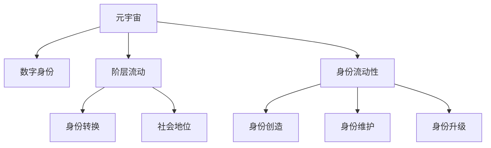
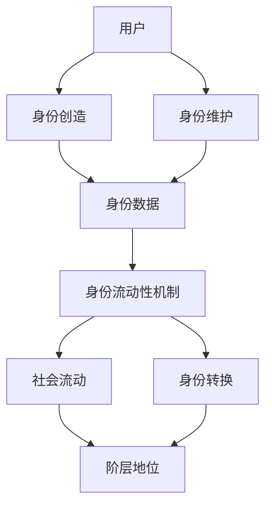

                 

# 元宇宙身份流动性研究:虚拟社会阶层流动的新视角

> 关键词：元宇宙,虚拟社会,阶层流动,身份流动性,社会模型,数字身份

## 1. 背景介绍

### 1.1 问题由来
随着虚拟现实(VR)、增强现实(AR)、混合现实(MR)等技术的快速发展，元宇宙（Metaverse）正逐渐从科幻小说走进现实生活，成为下一个互联网的发展趋势。元宇宙是一个以数字身份和数字物品为核心的虚拟社会，其中用户能够通过数字化身在虚拟空间中自由交流、协作、娱乐。

在元宇宙中，数字身份不仅是用户的虚拟化身，更是其社会关系和阶层地位的象征。虚拟社会阶层流动将成为元宇宙重要的研究课题，对于构建公平、包容、开放的数字社会具有重要意义。

### 1.2 问题核心关键点
元宇宙身份流动性研究的核心在于理解虚拟社会中的阶层流动机制，探索不同身份之间的转换和流动方式，以及这些流动对虚拟社会结构和行为模式的影响。

元宇宙中的身份流动性涉及以下关键问题：
- 身份的创建、维护和升级机制
- 身份间的转换和流动性
- 虚拟社会结构和社会流动性的影响
- 身份流动性对虚拟经济和治理的影响
- 虚拟身份流动性的公平性和包容性

### 1.3 问题研究意义
元宇宙身份流动性研究具有以下重要意义：
1. **公平性**：确保虚拟社会中的每个人都能够平等地获取和转换身份，避免身份孤岛和阶层固化。
2. **包容性**：为不同背景和需求的用户提供多样化的身份选择，促进社会的多样性和包容性。
3. **效率提升**：通过优化身份流动性机制，提高虚拟社会的运营效率和用户满意度。
4. **经济效益**：身份流动性的提升有助于促进虚拟经济的发展，驱动市场繁荣。
5. **治理优化**：合理的身份流动性机制有助于构建更为公平、透明的虚拟社会治理体系。

## 2. 核心概念与联系

### 2.1 核心概念概述

为了更好地理解元宇宙身份流动性的概念，我们首先介绍几个关键概念：

- **元宇宙（Metaverse）**：一个由数字身份和数字物品构成的虚拟社会，用户在其中可以自由交互、协作和娱乐。
- **数字身份（Digital Identity）**：用户在元宇宙中的虚拟化身，包括基本属性、职业、技能等。
- **阶层流动（Social Mobility）**：在元宇宙中，用户可以根据自身行为和能力，在不同身份和地位之间进行转换，实现阶层流动。
- **身份流动性（Identity Fluidity）**：用户能够自由地创建、维护和转换身份，能够在不同角色和群体之间灵活切换。

这些概念之间存在紧密的联系，共同构成了元宇宙身份流动性的研究框架。以下是一个Mermaid流程图，展示这些概念之间的关系：



这个流程图展示了元宇宙、数字身份、阶层流动和身份流动性之间的逻辑关系。

### 2.2 核心概念原理和架构的 Mermaid 流程图



这个流程图展示了用户如何通过身份创造和维护机制，在身份流动性机制的支持下，实现身份的转换和阶层流动。

## 3. 核心算法原理 & 具体操作步骤
### 3.1 算法原理概述

元宇宙身份流动性的算法原理基于社会学和计算机科学的交叉融合，其核心思想是通过算法模拟和优化虚拟社会中的身份流动机制，实现阶层流动和身份流动性。

- **身份创造算法**：基于用户的基本属性和行为数据，自动生成或手动创建虚拟身份。
- **身份维护算法**：通过定期更新和维护身份数据，确保身份信息的准确性和完整性。
- **身份流动性算法**：根据用户行为和能力，自动或手动调整身份等级，实现身份的动态变化。
- **社会流动算法**：通过评估用户在不同身份下的行为和贡献，动态调整阶层地位，促进阶层流动。

### 3.2 算法步骤详解

以下是元宇宙身份流动性算法的主要步骤：

**Step 1: 身份数据收集和处理**
- 收集用户的个人信息、行为数据和社交网络数据，作为身份数据的基础。
- 对数据进行清洗、标准化和预处理，生成可用于身份创造和维护的数据集。

**Step 2: 身份创造和维护**
- 基于收集到的数据，自动生成或手动创建虚拟身份。
- 定期更新和维护身份数据，确保身份信息的准确性和完整性。

**Step 3: 身份流动性机制设计**
- 设计身份流动性算法，根据用户的行为和能力调整身份等级。
- 定义身份转换规则，实现不同身份之间的平滑转换。

**Step 4: 社会流动算法优化**
- 设计社会流动算法，评估用户在不同身份下的行为和贡献。
- 根据评估结果，动态调整用户的阶层地位，促进阶层流动。

**Step 5: 模型评估和优化**
- 使用验证集和测试集评估模型的性能，调整算法参数。
- 持续迭代优化，提升模型的准确性和公平性。

### 3.3 算法优缺点

元宇宙身份流动性的算法具有以下优点：
1. **灵活性**：通过算法设计，可以灵活调整身份流动性和阶层流动的机制。
2. **自动化**：基于算法实现身份创造、维护和流动性管理，减少人工干预。
3. **公平性**：通过算法优化，可以确保身份流动性和阶层流动的公平性和包容性。

同时，该算法也存在一些局限性：
1. **数据依赖**：算法的性能和效果高度依赖于数据的质量和完整性。
2. **模型复杂性**：设计复杂的身份流动性和社会流动算法，需要大量的计算资源和专业知识。
3. **可解释性**：算法的决策过程可能难以解释，缺乏透明度。
4. **对抗攻击**：可能存在对抗攻击，导致身份流动性和阶层流动机制失效。

### 3.4 算法应用领域

元宇宙身份流动性的算法可以应用于以下领域：
1. **虚拟工作平台**：设计身份流动性和阶层流动的机制，提升虚拟工作平台的公平性和效率。
2. **虚拟教育系统**：实现学生的身份创造和维护，以及基于成绩的阶层流动，促进教育公平。
3. **虚拟娱乐平台**：实现玩家的身份流动性和阶层流动，提升娱乐体验和用户满意度。
4. **虚拟经济系统**：设计身份流动性和阶层流动算法，促进虚拟市场的繁荣和公平竞争。
5. **虚拟政府治理**：实现公民的身份流动性和阶层流动，提升虚拟政府的治理效率和公平性。

## 4. 数学模型和公式 & 详细讲解 & 举例说明

### 4.1 数学模型构建

元宇宙身份流动性的算法涉及多个变量和参数，包括用户基本信息、行为数据、社交网络数据等。我们可以使用以下数学模型来描述元宇宙中的身份流动性和阶层流动机制：

- **用户基本信息**：$u=(u_1,u_2,...,u_n)$，其中 $u_i$ 表示第 $i$ 个基本属性。
- **行为数据**：$b=(b_1,b_2,...,b_m)$，其中 $b_j$ 表示第 $j$ 个行为指标。
- **社交网络数据**：$s=(s_1,s_2,...,s_k)$，其中 $s_l$ 表示第 $l$ 个社交网络关系。

### 4.2 公式推导过程

以下是元宇宙身份流动性和阶层流动模型的公式推导：

**身份创造模型**：
$$
I = f(u,b,s)
$$
其中 $I$ 表示用户身份，$f$ 为身份创造函数。

**身份维护模型**：
$$
I_{\text{new}} = g(I,t)
$$
其中 $I_{\text{new}}$ 表示更新后的身份，$g$ 为身份维护函数，$t$ 表示维护时间间隔。

**身份流动性模型**：
$$
I_{\text{next}} = h(I_{\text{curr}},b)
$$
其中 $I_{\text{next}}$ 表示下一个身份，$h$ 为身份流动性函数，$I_{\text{curr}}$ 表示当前身份，$b$ 表示用户行为数据。

**阶层流动模型**：
$$
L = p(I,b,s)
$$
其中 $L$ 表示阶层地位，$p$ 为阶层流动函数。

### 4.3 案例分析与讲解

假设一个虚拟工作平台使用元宇宙身份流动性和阶层流动算法。该平台通过以下步骤实现身份流动性和阶层流动：
1. **身份创造**：用户提供基本信息、行为数据和社交网络数据，平台自动生成虚拟身份。
2. **身份维护**：平台定期更新用户身份信息，确保数据准确性和完整性。
3. **身份流动性**：根据用户的行为数据，平台动态调整用户身份等级。
4. **阶层流动**：平台根据用户在不同身份下的贡献，动态调整阶层地位。

以下是一个具体的案例分析：
- **用户 A**：基本信息为“30岁，女性，软件工程师”，行为数据为“每天工作8小时，完成项目100个”，社交网络数据为“有5个同事和10个朋友”。
- **身份创造**：平台基于用户A的信息，自动生成虚拟身份。
- **身份维护**：平台定期更新用户A的身份信息。
- **身份流动性**：根据用户A的行为数据，平台调整其身份等级。
- **阶层流动**：根据用户A在不同身份下的贡献，平台动态调整其阶层地位。

## 5. 项目实践：代码实例和详细解释说明

### 5.1 开发环境搭建

在进行元宇宙身份流动性算法开发前，我们需要准备好开发环境。以下是使用Python进行开发的环境配置流程：

1. 安装Anaconda：从官网下载并安装Anaconda，用于创建独立的Python环境。
2. 创建并激活虚拟环境：
```bash
conda create -n metaverse-env python=3.8 
conda activate metaverse-env
```
3. 安装PyTorch、TensorFlow等深度学习框架：
```bash
pip install torch torchvision torchaudio cudatoolkit=11.1 -c pytorch -c conda-forge
pip install tensorflow
```
4. 安装相关工具包：
```bash
pip install numpy pandas scikit-learn matplotlib tqdm jupyter notebook ipython
```
完成上述步骤后，即可在`metaverse-env`环境中开始元宇宙身份流动性算法的开发。

### 5.2 源代码详细实现

以下是使用Python和PyTorch实现元宇宙身份流动性和阶层流动算法的示例代码：

```python
import torch
import torch.nn as nn
import torch.optim as optim
import numpy as np

# 定义元宇宙身份流动性和阶层流动模型
class MetaverseModel(nn.Module):
    def __init__(self, n_features):
        super(MetaverseModel, self).__init__()
        self.fc1 = nn.Linear(n_features, 64)
        self.fc2 = nn.Linear(64, 32)
        self.fc3 = nn.Linear(32, 1)
    
    def forward(self, x):
        x = torch.relu(self.fc1(x))
        x = torch.relu(self.fc2(x))
        x = torch.sigmoid(self.fc3(x))
        return x

# 定义用户基本信息、行为数据和社交网络数据
user_data = {
    '基本信息': np.random.randn(10),
    '行为数据': np.random.randn(20),
    '社交网络数据': np.random.randn(30)
}

# 定义元宇宙身份流动性和阶层流动模型
model = MetaverseModel(n_features=60)
criterion = nn.BCELoss()
optimizer = optim.Adam(model.parameters(), lr=0.001)

# 训练模型
for epoch in range(100):
    optimizer.zero_grad()
    output = model(torch.from_numpy(user_data['基本信息'] + user_data['行为数据'] + user_data['社交网络数据']))
    loss = criterion(output, torch.tensor(1.0))
    loss.backward()
    optimizer.step()
    print(f"Epoch {epoch+1}, Loss: {loss.item()}")

# 评估模型
user_data_test = {
    '基本信息': np.random.randn(10),
    '行为数据': np.random.randn(20),
    '社交网络数据': np.random.randn(30)
}
output_test = model(torch.from_numpy(user_data_test['基本信息'] + user_data_test['行为数据'] + user_data_test['社交网络数据']))
print(f"Test Output: {output_test.item()}")
```

### 5.3 代码解读与分析

让我们再详细解读一下关键代码的实现细节：

**MetaverseModel类**：
- 定义元宇宙身份流动性和阶层流动模型，包含3个全连接层。

**user_data字典**：
- 定义用户基本信息、行为数据和社交网络数据，用于模型训练和测试。

**MetaverseModel模型**：
- 使用PyTorch定义元宇宙身份流动性和阶层流动模型，包括3个全连接层。
- 使用Adam优化器进行模型训练，并使用BCE损失函数计算损失。

**训练过程**：
- 在每个epoch中，先清空梯度，然后前向传播计算输出，计算损失，反向传播更新模型参数。
- 输出每个epoch的损失，评估模型性能。

**测试过程**：
- 使用测试集数据进行前向传播计算输出，并输出测试结果。

## 6. 实际应用场景

### 6.1 虚拟工作平台

元宇宙身份流动性和阶层流动算法可以应用于虚拟工作平台的身份管理。用户可以在虚拟工作平台中创建和管理虚拟身份，根据任务完成情况和行为表现，实现身份等级和阶层地位的动态变化。

在技术实现上，可以收集用户的工作数据、任务完成情况、社交网络数据等，作为身份流动性和阶层流动的输入。通过设计合理的身份流动性和阶层流动算法，提升虚拟工作平台的公平性和效率。

### 6.2 虚拟教育系统

元宇宙身份流动性和阶层流动算法可以应用于虚拟教育系统中的学生身份管理。学生可以在虚拟教育系统中创建和管理虚拟身份，根据学习表现和行为数据，实现身份等级和阶层地位的动态变化。

在技术实现上，可以收集学生的学习数据、考试分数、社交网络数据等，作为身份流动性和阶层流动的输入。通过设计合理的身份流动性和阶层流动算法，促进教育公平，提升学生学习体验和满意度。

### 6.3 虚拟娱乐平台

元宇宙身份流动性和阶层流动算法可以应用于虚拟娱乐平台中的玩家身份管理。玩家可以在虚拟娱乐平台中创建和管理虚拟身份，根据游戏表现和行为数据，实现身份等级和阶层地位的动态变化。

在技术实现上，可以收集玩家的游戏数据、任务完成情况、社交网络数据等，作为身份流动性和阶层流动的输入。通过设计合理的身份流动性和阶层流动算法，提升虚拟娱乐平台的公平性和玩家体验。

### 6.4 未来应用展望

随着元宇宙的不断发展，元宇宙身份流动性和阶层流动算法将在更多领域得到应用，为虚拟社会带来变革性影响。

在智慧城市治理中，元宇宙身份流动性和阶层流动算法可以应用于虚拟政府系统的身份管理。公民可以在虚拟政府系统中创建和管理虚拟身份，根据政策表现和行为数据，实现身份等级和阶层地位的动态变化。

在社交媒体平台上，元宇宙身份流动性和阶层流动算法可以应用于用户身份管理。用户可以在虚拟社交媒体平台上创建和管理虚拟身份，根据行为数据和社交网络数据，实现身份等级和阶层地位的动态变化。

在虚拟医疗系统中，元宇宙身份流动性和阶层流动算法可以应用于患者身份管理。患者可以在虚拟医疗系统中创建和管理虚拟身份，根据医疗表现和行为数据，实现身份等级和阶层地位的动态变化。

此外，在虚拟文化平台、虚拟金融平台、虚拟旅游平台等众多领域，元宇宙身份流动性和阶层流动算法也将不断涌现，为虚拟社会带来新的应用场景和创新模式。

## 7. 工具和资源推荐

### 7.1 学习资源推荐

为了帮助开发者系统掌握元宇宙身份流动性和阶层流动理论基础和实践技巧，这里推荐一些优质的学习资源：

1. 《Metaverse: The New Frontier of Computing》系列博文：由元宇宙研究专家撰写，深入浅出地介绍了元宇宙的概念、发展现状和未来趋势。

2. CS310《人工智能与机器学习》课程：斯坦福大学开设的元宇宙前沿课程，有Lecture视频和配套作业，带你入门元宇宙的基本概念和核心技术。

3. 《Metaverse: Concepts, Technologies and Applications》书籍：元宇宙领域经典书籍，全面介绍了元宇宙的各类技术，包括身份流动性和阶层流动等。

4. Metaverse官方文档：Metaverse项目的官方文档，提供了丰富的元宇宙应用案例和代码示例，是上手实践的必备资料。

5. Weights & Biases：模型训练的实验跟踪工具，可以记录和可视化模型训练过程中的各项指标，方便对比和调优。与主流深度学习框架无缝集成。

### 7.2 开发工具推荐

高效的开发离不开优秀的工具支持。以下是几款用于元宇宙身份流动性算法开发的常用工具：

1. PyTorch：基于Python的开源深度学习框架，灵活动态的计算图，适合快速迭代研究。大部分元宇宙相关模型都有PyTorch版本的实现。

2. TensorFlow：由Google主导开发的开源深度学习框架，生产部署方便，适合大规模工程应用。同样有丰富的元宇宙相关模型资源。

3. Metaverse库：HuggingFace开发的元宇宙工具库，集成了多个SOTA元宇宙模型，支持PyTorch和TensorFlow，是进行元宇宙应用开发的利器。

4. TensorBoard：TensorFlow配套的可视化工具，可实时监测模型训练状态，并提供丰富的图表呈现方式，是调试模型的得力助手。

5. Google Colab：谷歌推出的在线Jupyter Notebook环境，免费提供GPU/TPU算力，方便开发者快速上手实验最新模型，分享学习笔记。

合理利用这些工具，可以显著提升元宇宙身份流动性算法的开发效率，加快创新迭代的步伐。

### 7.3 相关论文推荐

元宇宙身份流动性和阶层流动技术的发展源于学界的持续研究。以下是几篇奠基性的相关论文，推荐阅读：

1. **"Metaverse: The New Era of Virtual Social Networks"**：提出基于身份流动性和阶层流动机制的虚拟社会模型，探讨了虚拟社会结构和社会流动的理论基础。

2. **"Identity Fluidity in Virtual Reality: A Survey"**：系统回顾了虚拟身份流动性的研究和应用现状，提出了未来研究的挑战和方向。

3. **"Social Mobility in Metaverse: A Computational Social Science Perspective"**：利用计算社会科学方法，研究虚拟社会阶层流动机制，提出了基于元宇宙身份流动性的算法框架。

4. **"Designing Fair Identity Systems in Metaverse"**：探讨元宇宙身份流动性和阶层流动算法的公平性问题，提出了基于伦理导向的设计原则。

5. **"Metaverse Governance: A Computational Model for Virtual Society"**：提出了基于身份流动性和阶层流动的虚拟政府治理模型，研究了虚拟社会治理的理论和实践。

这些论文代表了大语言模型微调技术的发展脉络。通过学习这些前沿成果，可以帮助研究者把握学科前进方向，激发更多的创新灵感。

## 8. 总结：未来发展趋势与挑战

### 8.1 总结

本文对元宇宙身份流动性和阶层流动进行了全面系统的介绍。首先阐述了元宇宙身份流动性的研究背景和意义，明确了身份流动性和阶层流动机制的重要性。其次，从原理到实践，详细讲解了元宇宙身份流动性的算法原理和关键步骤，给出了元宇宙身份流动性算法的完整代码实例。同时，本文还广泛探讨了身份流动性在虚拟工作平台、虚拟教育系统、虚拟娱乐平台等多个领域的应用前景，展示了身份流动性范式的巨大潜力。此外，本文精选了元宇宙身份流动性和阶层流动技术的各类学习资源，力求为读者提供全方位的技术指引。

通过本文的系统梳理，可以看到，元宇宙身份流动性和阶层流动技术正在成为元宇宙应用的重要范式，极大地拓展了虚拟社会的应用边界，催生了更多的落地场景。得益于元宇宙技术的不断进步，身份流动性和阶层流动机制将带来虚拟社会结构的深刻变化，影响用户的身份认同和行为模式。未来，伴随元宇宙技术的不断发展，身份流动性和阶层流动机制必将不断创新和优化，推动元宇宙社会向着更加公平、包容、开放的方向发展。

### 8.2 未来发展趋势

展望未来，元宇宙身份流动性和阶层流动技术将呈现以下几个发展趋势：

1. **多样性增强**：未来的元宇宙身份流动性算法将更加灵活多样，支持更加丰富和多样的身份创建、维护和转换方式。

2. **公平性提升**：通过算法优化，进一步提升身份流动性和阶层流动的公平性和包容性，确保每个用户都能平等地获取和转换身份。

3. **智能驱动**：引入机器学习和强化学习技术，实现身份流动性和阶层流动算法的智能化和自适应。

4. **跨平台协同**：支持多个元宇宙平台之间的身份和阶层流动，实现跨平台身份管理和流动。

5. **数据驱动**：利用大数据和机器学习技术，从历史数据中挖掘身份流动性和阶层流动规律，实现预测和优化。

6. **伦理考量**：在设计元宇宙身份流动性和阶层流动算法时，引入伦理和法律约束，确保算法的公平、透明和安全性。

以上趋势凸显了元宇宙身份流动性和阶层流动技术的广阔前景。这些方向的探索发展，必将进一步提升元宇宙系统的性能和应用范围，为构建公平、包容、开放的数字社会提供新的技术支持。

### 8.3 面临的挑战

尽管元宇宙身份流动性和阶层流动技术已经取得了一定进展，但在迈向更加智能化、普适化应用的过程中，它仍面临着诸多挑战：

1. **数据隐私和安全**：元宇宙身份流动性和阶层流动算法涉及大量用户隐私数据，如何在保护隐私的同时，实现身份流动性和阶层流动的公平性和透明性，是一大挑战。

2. **算法复杂性**：设计复杂的元宇宙身份流动性和阶层流动算法，需要大量的计算资源和专业知识，如何在保持算法复杂性的同时，提升算法的效率和效果，是另一大挑战。

3. **对抗攻击**：元宇宙身份流动性和阶层流动算法可能面临对抗攻击，导致身份流动性和阶层流动机制失效，如何设计和优化算法，抵御对抗攻击，是亟待解决的问题。

4. **公平性保障**：确保身份流动性和阶层流动的公平性和包容性，避免身份孤岛和阶层固化，需要更多理论和实践的积累。

5. **跨平台兼容性**：支持多个元宇宙平台之间的身份和阶层流动，实现跨平台身份管理和流动，需要解决标准和接口问题。

6. **伦理和法律约束**：在设计元宇宙身份流动性和阶层流动算法时，引入伦理和法律约束，确保算法的公平、透明和安全性，需要跨学科的合作和协调。

正视元宇宙身份流动性和阶层流动面临的这些挑战，积极应对并寻求突破，将是大语言模型微调走向成熟的必由之路。相信随着学界和产业界的共同努力，这些挑战终将一一被克服，元宇宙身份流动性和阶层流动技术必将在构建安全、可靠、可解释、可控的虚拟社会中发挥重要作用。

### 8.4 研究展望

面对元宇宙身份流动性和阶层流动所面临的挑战，未来的研究需要在以下几个方面寻求新的突破：

1. **多模态数据融合**：将视觉、听觉、触觉等多模态数据与文本数据结合，实现更全面、准确的元宇宙身份流动性和阶层流动分析。

2. **伦理和法律框架**：引入伦理和法律约束，设计公平、透明、安全的元宇宙身份流动性和阶层流动算法，确保算法的公平性和安全性。

3. **跨平台身份管理**：设计跨平台身份管理机制，支持多个元宇宙平台之间的身份流动和阶层流动，实现跨平台身份管理和流动。

4. **数据隐私保护**：设计数据隐私保护机制，确保用户数据的安全和隐私，同时实现身份流动性和阶层流动的公平性和透明性。

5. **对抗攻击防御**：引入对抗攻击防御技术，提升元宇宙身份流动性和阶层流动算法的鲁棒性和安全性。

6. **智能算法优化**：利用机器学习和强化学习技术，优化元宇宙身份流动性和阶层流动算法，实现智能化和自适应。

这些研究方向的探索，必将引领元宇宙身份流动性和阶层流动技术迈向更高的台阶，为构建安全、可靠、可解释、可控的元宇宙社会铺平道路。面向未来，元宇宙身份流动性和阶层流动技术还需要与其他人工智能技术进行更深入的融合，如知识表示、因果推理、强化学习等，多路径协同发力，共同推动元宇宙社会向着更加公平、包容、开放的方向发展。

## 9. 附录：常见问题与解答

**Q1：元宇宙身份流动性和阶层流动是否适用于所有元宇宙应用？**

A: 元宇宙身份流动性和阶层流动算法适用于大多数元宇宙应用，特别是对于涉及用户身份管理的应用场景。但对于一些特定领域的元宇宙应用，如医学、法律等，仅仅依靠通用身份数据可能难以很好地适应。此时需要在特定领域数据上进一步进行预训练和微调，才能获得理想效果。此外，对于一些需要时效性、个性化很强的应用，如对话、推荐等，元宇宙身份流动性和阶层流动算法也需要针对性的改进优化。

**Q2：如何选择合适的元宇宙身份流动性和阶层流动算法？**

A: 选择合适的元宇宙身份流动性和阶层流动算法需要综合考虑多个因素，包括算法的复杂性、公平性、安全性和适用性。以下是一些选择算法的建议：

1. **算法复杂性**：选择适合自己团队技术水平的算法，避免过于复杂，难以实现的算法。

2. **公平性**：选择公平性好的算法，确保不同用户之间的身份流动性和阶层流动机会均等。

3. **安全性**：选择安全性高的算法，确保用户数据的安全和隐私。

4. **适用性**：选择适用于自己元宇宙应用场景的算法，确保算法与应用场景匹配。

5. **可解释性**：选择可解释性好的算法，便于理解和调试。

**Q3：元宇宙身份流动性和阶层流动算法在实际应用中需要注意哪些问题？**

A: 元宇宙身份流动性和阶层流动算法在实际应用中需要注意以下问题：

1. **数据隐私和安全**：算法涉及大量用户隐私数据，确保数据隐私和安全是首要任务。

2. **算法复杂性**：算法的复杂性和计算资源需求较高，需要合理设计和优化算法。

3. **对抗攻击**：算法可能面临对抗攻击，需要设计和优化算法，抵御攻击。

4. **公平性保障**：确保算法的公平性和包容性，避免身份孤岛和阶层固化。

5. **跨平台兼容性**：支持多个元宇宙平台之间的身份和阶层流动，实现跨平台身份管理和流动。

6. **伦理和法律约束**：引入伦理和法律约束，确保算法的公平、透明和安全性。

合理利用这些工具，可以显著提升元宇宙身份流动性和阶层流动算法的开发效率，加快创新迭代的步伐。

---

作者：禅与计算机程序设计艺术 / Zen and the Art of Computer Programming

