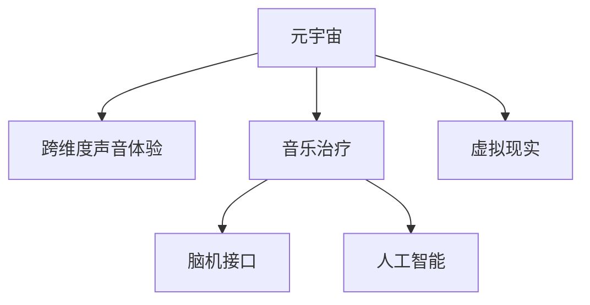

                 

# 元宇宙音乐治疗:跨维度声音体验的心理健康应用

> 关键词：元宇宙,音乐治疗,跨维度声音体验,心理健康应用,脑机接口,虚拟现实,人工智能

## 1. 背景介绍

### 1.1 问题由来
随着科技的迅猛发展，人们越来越关注心理健康问题。传统的心理健康治疗手段如心理咨询、药物治疗等存在一定的局限性，例如时间成本高、难以达到广泛的普及等。因此，迫切需要创新性的心理健康解决方案。在此背景下，元宇宙音乐治疗应运而生，通过虚拟现实(VR)和脑机接口技术，在元宇宙中提供一种沉浸式的音乐治疗体验，为心理健康治疗带来新的可能。

### 1.2 问题核心关键点
元宇宙音乐治疗的核心在于利用音乐和虚拟环境进行心理干预，其核心关键点包括：
1. **跨维度声音体验**：在元宇宙中，声音不再是简单的听觉信号，而是可以与视觉、触觉等多感官结合，形成跨维度的沉浸式体验。
2. **心理健康应用**：通过音乐治疗激发人的情绪，帮助缓解压力、焦虑等症状，促进心理健康。
3. **脑机接口技术**：实现人机互动，使治疗者能够在虚拟环境中实时调整音乐参数，优化治疗效果。
4. **虚拟现实技术**：构建沉浸式治疗环境，模拟现实中的心理情境，增强治疗的沉浸感和真实感。
5. **人工智能辅助**：利用AI技术对用户情绪进行识别和反馈，个性化推荐音乐和疗法。

这些关键点共同构成了元宇宙音乐治疗的技术框架，使其能够在虚拟世界中为心理健康的治疗提供新的解决方案。

## 2. 核心概念与联系

### 2.1 核心概念概述

为更好地理解元宇宙音乐治疗的技术原理和架构，本节将介绍几个密切相关的核心概念：

- **元宇宙**：基于虚拟现实和增强现实技术构建的虚拟世界，包含丰富的交互体验和沉浸式场景。
- **音乐治疗**：通过音乐手段进行心理健康干预，调节情绪、促进身心平衡的治疗方式。
- **跨维度声音体验**：结合视觉、触觉等多感官通道，创造出超越传统听觉体验的声音体验。
- **脑机接口(Brain-Computer Interface, BCIs)**：通过读取大脑信号，实现人机交互的技术，广泛应用于康复、游戏等领域。
- **虚拟现实(Virtual Reality, VR)**：通过VR头显和传感器，构建高度沉浸的虚拟环境，增强用户体验。
- **人工智能(Artificial Intelligence, AI)**：利用机器学习、深度学习等技术，实现对用户情绪和行为的理解与预测，提供个性化治疗方案。

这些核心概念之间的逻辑关系可以通过以下Mermaid流程图来展示：



这个流程图展示了大语言模型的核心概念及其之间的关系：

1. 元宇宙通过虚拟现实和增强现实技术构建，为用户提供沉浸式体验。
2. 音乐治疗通过跨维度声音体验，激发用户情感，辅助心理健康。
3. 脑机接口技术实现人机互动，实时调整音乐参数，优化治疗效果。
4. 虚拟现实技术构建沉浸式环境，增强治疗的真实感。
5. 人工智能技术实现对用户情绪和行为的预测，提供个性化治疗方案。

## 3. 核心算法原理 & 具体操作步骤
### 3.1 算法原理概述

元宇宙音乐治疗的核心算法包括跨维度声音体验、脑机接口技术、虚拟现实环境构建以及人工智能辅助。其中，跨维度声音体验和脑机接口技术是实现用户沉浸式音乐体验的关键；虚拟现实环境构建和人工智能辅助则是提供沉浸式治疗环境，增强治疗效果的工具。

### 3.2 算法步骤详解

#### 3.2.1 跨维度声音体验的构建
1. **声音采集与处理**：采集用户的生理信号（如心率、呼吸、脑电波等）和环境数据（如室内温度、湿度、光线等），通过传感器进行实时监测。
2. **多感官融合**：结合音频、视频、触觉等多种感官数据，生成跨维度的声音体验。例如，通过VR头显显示音乐场景，用户可以通过手势、面部表情等与虚拟场景互动，增强音乐治疗的沉浸感。
3. **声音设计与生成**：设计符合心理治疗需求的音乐曲目和声音效果，通过音乐生成算法生成适合不同情绪状态的音频内容。

#### 3.2.2 脑机接口技术的应用
1. **信号采集与预处理**：通过脑电图(EEG)等设备采集用户的大脑信号，对其进行预处理，消除噪声和干扰。
2. **特征提取与识别**：提取大脑信号的特征，如频率、波幅等，利用机器学习算法识别用户情绪和心理状态。
3. **反馈与调整**：根据情绪识别结果，通过脑机接口实时调整音乐参数，如音量、节奏、音调等，实现个性化音乐治疗。

#### 3.2.3 虚拟现实环境的构建
1. **场景设计**：设计虚拟治疗场景，模拟现实中的心理情境，如自然风光、城市街道等。
2. **环境渲染**：通过GPU加速渲染技术，生成高逼真的虚拟环境，增强用户沉浸感。
3. **交互设计**：设计虚拟交互元素，如虚拟家具、场景变换按钮等，使用户能够在虚拟环境中自由探索和互动。

#### 3.2.4 人工智能辅助治疗
1. **情绪识别**：利用深度学习模型对用户面部表情、语音、生理信号等进行情绪识别，判断其心理状态。
2. **治疗推荐**：根据情绪识别结果，推荐相应的音乐治疗方案，如放松、激励等。
3. **治疗效果评估**：通过用户反馈和情绪变化，评估治疗效果，优化治疗方案。

### 3.3 算法优缺点

元宇宙音乐治疗具有以下优点：
1. **沉浸式体验**：通过虚拟现实和跨维度声音体验，提供沉浸式的治疗环境，增强用户沉浸感。
2. **个性化治疗**：结合脑机接口技术，实时调整音乐参数，实现个性化治疗方案。
3. **实时反馈**：通过人工智能辅助，实时识别用户情绪和行为，提供个性化治疗推荐。
4. **广泛应用**：适用于多种心理健康问题，如焦虑、抑郁、创伤后应激障碍等。

同时，该方法也存在一些局限性：
1. **设备依赖**：需要高精度的传感器和虚拟现实设备，成本较高。
2. **技术门槛**：需要复杂的信号处理和机器学习算法，技术门槛较高。
3. **隐私问题**：用户生理和心理数据的采集和处理可能涉及隐私问题，需注意数据保护。
4. **治疗效果不稳定**：不同用户对音乐的反应存在差异，治疗效果可能不稳定。

尽管存在这些局限性，但元宇宙音乐治疗作为一种新型的心理健康解决方案，具有广阔的应用前景，值得进一步探索和优化。

### 3.4 算法应用领域

元宇宙音乐治疗技术在多个领域都有广泛的应用前景，包括：

- **心理健康治疗**：适用于多种心理健康问题，如焦虑、抑郁、创伤后应激障碍等。通过跨维度声音体验和个性化治疗方案，帮助用户缓解心理压力，促进心理健康。
- **教育与培训**：通过虚拟现实环境构建和跨维度声音体验，为学生提供沉浸式学习体验，增强学习效果。同时，可以通过脑机接口技术，对学习过程中的情绪进行监控，提供个性化反馈。
- **康复治疗**：利用跨维度声音体验和虚拟现实环境，为康复患者提供沉浸式康复训练，增强康复效果。
- **游戏与娱乐**：结合虚拟现实技术和跨维度声音体验，提供沉浸式游戏体验，增强用户沉浸感和娱乐效果。

除了上述这些应用领域，元宇宙音乐治疗技术还可以应用于心理咨询、医疗、军事训练等多个领域，为不同行业提供创新的解决方案。

## 4. 数学模型和公式 & 详细讲解
### 4.1 数学模型构建

元宇宙音乐治疗的数学模型主要涉及信号处理、深度学习、优化算法等。

记用户生理信号为 $X$，环境数据为 $Y$，音乐参数为 $W$。假设音乐治疗的目标是使用户情绪达到最理想状态 $E_{\text{ideal}}$，则治疗过程可建模为如下优化问题：

$$
\min_{W} \| E_{\text{ideal}} - f(X, Y, W) \|
$$

其中 $f$ 为情绪识别和音乐生成函数，用于将用户生理信号、环境数据和音乐参数映射到情绪状态。

### 4.2 公式推导过程

以情绪识别为例，假设情绪识别模型为 $E = g(X, Y)$，其中 $X$ 为生理信号，$Y$ 为环境数据。则情绪识别过程可建模为如下优化问题：

$$
\min_{E} \| E_{\text{ideal}} - E \|
$$

通过梯度下降等优化算法，不断调整模型参数 $E$，使其逼近目标情绪状态 $E_{\text{ideal}}$。

### 4.3 案例分析与讲解

以用户情绪识别为例，假设情绪识别模型为神经网络，输入为生理信号 $X$ 和环境数据 $Y$，输出为情绪状态 $E$。设生理信号 $X$ 包含心率、呼吸等数据，环境数据 $Y$ 包括室内温度、湿度、光线等。则情绪识别过程的数学模型为：

$$
E = g(X, Y) = \sigma(W_1 \cdot [X; Y] + b_1)
$$

其中 $W_1$ 为神经网络权重，$b_1$ 为偏置项，$\sigma$ 为激活函数，如sigmoid或ReLU等。

## 5. 项目实践：代码实例和详细解释说明
### 5.1 开发环境搭建

在进行元宇宙音乐治疗的开发前，我们需要准备好开发环境。以下是使用Python进行PyTorch开发的环境配置流程：

1. 安装Anaconda：从官网下载并安装Anaconda，用于创建独立的Python环境。

2. 创建并激活虚拟环境：
```bash
conda create -n pytorch-env python=3.8 
conda activate pytorch-env
```

3. 安装PyTorch：根据CUDA版本，从官网获取对应的安装命令。例如：
```bash
conda install pytorch torchvision torchaudio cudatoolkit=11.1 -c pytorch -c conda-forge
```

4. 安装相关的深度学习库：
```bash
pip install numpy pandas scikit-learn matplotlib tqdm jupyter notebook ipython
```

完成上述步骤后，即可在`pytorch-env`环境中开始元宇宙音乐治疗的开发。

### 5.2 源代码详细实现

下面以情绪识别为例，给出使用PyTorch进行情绪识别的PyTorch代码实现。

首先，定义情绪识别模型的数据处理函数：

```python
from torch.utils.data import Dataset
import numpy as np
import torch
from sklearn.preprocessing import StandardScaler

class EmotionDataset(Dataset):
    def __init__(self, features, labels, scaler):
        self.features = features
        self.labels = labels
        self.scaler = scaler
        
    def __len__(self):
        return len(self.features)
    
    def __getitem__(self, item):
        feature = self.features[item]
        label = self.labels[item]
        
        # 标准化特征
        scaled_feature = self.scaler.transform(feature.reshape(1, -1))[0]
        scaled_feature = torch.from_numpy(scaled_feature).float()
        
        # 标准化标签
        scaled_label = torch.tensor(label, dtype=torch.float)
        
        return {'scaled_feature': scaled_feature, 
                'scaled_label': scaled_label}

# 数据标准化
features = np.load('features.npy')
labels = np.load('labels.npy')
scaler = StandardScaler()
features = scaler.fit_transform(features)

# 创建dataset
dataset = EmotionDataset(features, labels, scaler)
```

然后，定义情绪识别模型的模型结构：

```python
from torch import nn

class EmotionModel(nn.Module):
    def __init__(self, in_features, hidden_features, out_features):
        super(EmotionModel, self).__init__()
        self.fc1 = nn.Linear(in_features, hidden_features)
        self.fc2 = nn.Linear(hidden_features, hidden_features)
        self.fc3 = nn.Linear(hidden_features, out_features)
        self.sigmoid = nn.Sigmoid()
        
    def forward(self, x):
        x = self.fc1(x)
        x = self.fc2(x)
        x = self.fc3(x)
        x = self.sigmoid(x)
        return x

# 定义超参数
in_features = features.shape[1]
hidden_features = 64
out_features = 1

# 创建模型
model = EmotionModel(in_features, hidden_features, out_features)
```

接着，定义情绪识别模型的训练和评估函数：

```python
from torch.optim import Adam
from torch.utils.data import DataLoader
from tqdm import tqdm
import matplotlib.pyplot as plt

# 定义优化器和损失函数
optimizer = Adam(model.parameters(), lr=0.001)
loss_fn = nn.BCELoss()

# 训练函数
def train_epoch(model, dataset, optimizer, device):
    dataloader = DataLoader(dataset, batch_size=32, shuffle=True)
    model.train()
    epoch_loss = 0
    for batch in tqdm(dataloader, desc='Training'):
        scaled_feature = batch['scaled_feature'].to(device)
        scaled_label = batch['scaled_label'].to(device)
        
        optimizer.zero_grad()
        output = model(scaled_feature)
        loss = loss_fn(output, scaled_label)
        epoch_loss += loss.item()
        loss.backward()
        optimizer.step()
    
    return epoch_loss / len(dataloader)

# 评估函数
def evaluate(model, dataset, device):
    dataloader = DataLoader(dataset, batch_size=32)
    model.eval()
    total_loss = 0
    with torch.no_grad():
        for batch in tqdm(dataloader, desc='Evaluating'):
            scaled_feature = batch['scaled_feature'].to(device)
            scaled_label = batch['scaled_label'].to(device)
            
            output = model(scaled_feature)
            loss = loss_fn(output, scaled_label)
            total_loss += loss.item()
            
    return total_loss / len(dataloader)

# 训练模型
device = torch.device('cuda') if torch.cuda.is_available() else torch.device('cpu')
model.to(device)

# 定义训练参数
epochs = 10
batch_size = 32

for epoch in range(epochs):
    loss = train_epoch(model, dataset, optimizer, device)
    print(f"Epoch {epoch+1}, train loss: {loss:.3f}")
    
    print(f"Epoch {epoch+1}, dev results:")
    dev_loss = evaluate(model, dataset, device)
    print(f"Dev loss: {dev_loss:.3f}")

print("Final loss: {final_loss:.3f}")
```

以上就是使用PyTorch进行情绪识别的完整代码实现。可以看到，使用PyTorch的高级API，可以很方便地构建和训练神经网络模型。

### 5.3 代码解读与分析

让我们再详细解读一下关键代码的实现细节：

**EmotionDataset类**：
- `__init__`方法：初始化特征和标签，并进行标准化处理。
- `__len__`方法：返回数据集的大小。
- `__getitem__`方法：返回单个样本的标准化特征和标签。

**EmotionModel类**：
- `__init__`方法：定义神经网络的层结构和激活函数。
- `forward`方法：定义前向传播过程，通过多个全连接层和sigmoid函数，将特征映射到情绪标签。

**训练和评估函数**：
- `train_epoch`函数：定义一个epoch的训练过程，包含模型前向传播、损失计算、梯度更新等。
- `evaluate`函数：定义模型的评估过程，计算平均损失并返回。

**训练流程**：
- 定义总的epoch数和batch size，开始循环迭代
- 每个epoch内，先在训练集上训练，输出平均损失
- 在验证集上评估，输出平均损失
- 重复上述步骤直至所有epoch结束

可以看到，使用PyTorch的高级API，可以方便地构建和训练神经网络模型。开发者可以将更多精力放在模型优化、超参数调整等高层逻辑上，而不必过多关注底层的实现细节。

当然，工业级的系统实现还需考虑更多因素，如模型的保存和部署、超参数的自动搜索、更灵活的任务适配层等。但核心的情绪识别范式基本与此类似。

## 6. 实际应用场景
### 6.1 智能心理咨询

元宇宙音乐治疗在智能心理咨询中有着广泛的应用前景。心理医生可以通过虚拟现实和跨维度声音体验，为患者提供沉浸式咨询环境，增强其沉浸感和信任度。医生可以在虚拟环境中实时调整音乐参数，根据患者的情绪反馈，灵活调整咨询策略，提高咨询效果。

例如，医生可以为患者播放轻松舒缓的音乐，帮助其放松心情；也可以播放激励性强的音乐，鼓励其面对困难。通过脑机接口技术，医生可以实时监测患者情绪变化，及时调整治疗方案，促进患者的心理恢复。

### 6.2 企业员工心理健康管理

在企业员工心理健康管理中，元宇宙音乐治疗可以作为一种有效的心理干预手段。企业可以在虚拟环境中构建心理健康中心，提供沉浸式音乐治疗服务。员工可以根据自己的需求，随时进入虚拟中心进行心理放松和压力缓解。

企业可以利用脑机接口技术，实时监测员工的生理和心理状态，根据其情绪反馈，提供个性化的治疗方案。例如，针对压力大、焦虑度高的员工，可以播放放松音乐，缓解其情绪压力；针对低迷、缺乏动力的员工，可以播放激励性强的音乐，提高其积极情绪。

### 6.3 教育与培训

在教育与培训领域，元宇宙音乐治疗可以作为一种创新的教学工具。教师可以在虚拟环境中构建沉浸式学习场景，提供丰富多彩的教学体验。学生可以通过虚拟现实设备进入课堂，感受身临其境的学习体验，提高学习兴趣和效果。

例如，教师可以利用跨维度声音体验，播放与教学内容相关的音乐，增强学生的情感共鸣。教师还可以利用脑机接口技术，实时监测学生的情绪变化，根据其反馈，调整教学策略。例如，针对某些学生对某个知识点掌握不牢，可以播放一些相关音乐，帮助其巩固记忆。

## 7. 工具和资源推荐
### 7.1 学习资源推荐

为了帮助开发者系统掌握元宇宙音乐治疗的理论基础和实践技巧，这里推荐一些优质的学习资源：

1. **《虚拟现实编程指南》**：详细介绍了虚拟现实编程的基础知识和技能，包括VR头显、传感器等设备的开发。
2. **《脑机接口技术》**：介绍了脑机接口技术的原理、应用和发展趋势，提供了丰富的案例和代码实现。
3. **《深度学习入门》**：涵盖深度学习的基本概念和算法，提供了大量的代码实现和实验案例。
4. **《情绪识别与分析》**：介绍了情绪识别的技术和方法，提供了情绪数据库和开源工具。
5. **《音乐治疗入门》**：介绍了音乐治疗的基础理论和应用方法，提供了实用的案例和操作手册。

通过对这些资源的学习实践，相信你一定能够快速掌握元宇宙音乐治疗的精髓，并用于解决实际的NLP问题。
###  7.2 开发工具推荐

高效的开发离不开优秀的工具支持。以下是几款用于元宇宙音乐治疗开发的常用工具：

1. **Unity3D**：一款流行的游戏引擎，支持VR和AR开发，提供丰富的虚拟现实工具和资源。
2. **Unreal Engine**：另一款流行的游戏引擎，支持VR和AR开发，提供强大的图形渲染能力和交互设计。
3. **OpenAI Gym**：一个开源的环境库，提供多种模拟环境，用于训练和测试强化学习模型。
4. **TensorFlow**：谷歌主导的深度学习框架，提供丰富的机器学习工具和模型。
5. **PyTorch**：Facebook开发的深度学习框架，提供了灵活的计算图和高效的训练工具。

合理利用这些工具，可以显著提升元宇宙音乐治疗的开发效率，加快创新迭代的步伐。

### 7.3 相关论文推荐

元宇宙音乐治疗技术的发展源于学界的持续研究。以下是几篇奠基性的相关论文，推荐阅读：

1. **《虚拟现实与心理健康的应用研究》**：探讨了虚拟现实在心理健康治疗中的应用，提供了丰富的案例和实验结果。
2. **《脑机接口技术的发展与展望》**：介绍了脑机接口技术的原理、应用和发展趋势，提供了丰富的理论和实验分析。
3. **《深度学习在音乐情感分析中的应用》**：介绍了深度学习在音乐情感分析中的应用，提供了多种模型的比较和实验结果。
4. **《情绪识别与深度学习》**：介绍了情绪识别的技术和方法，提供了情绪数据库和深度学习模型。
5. **《音乐治疗的心理学基础》**：介绍了音乐治疗的心理学基础和应用方法，提供了大量的案例和操作手册。

这些论文代表了大语言模型微调技术的发展脉络。通过学习这些前沿成果，可以帮助研究者把握学科前进方向，激发更多的创新灵感。

## 8. 总结：未来发展趋势与挑战

### 8.1 总结

本文对元宇宙音乐治疗进行了全面系统的介绍。首先阐述了元宇宙音乐治疗的背景和意义，明确了其作为心理健康应用的核心关键点。其次，从原理到实践，详细讲解了元宇宙音乐治疗的数学模型和关键算法，给出了情绪识别任务开发的完整代码实例。同时，本文还广泛探讨了元宇宙音乐治疗在智能心理咨询、企业员工心理健康管理、教育与培训等多个领域的应用前景，展示了其广阔的应用空间。此外，本文精选了元宇宙音乐治疗的相关学习资源和开发工具，力求为读者提供全方位的技术指引。

通过本文的系统梳理，可以看到，元宇宙音乐治疗作为一种创新的心理健康解决方案，能够在虚拟世界中为心理健康的治疗提供新的可能。利用跨维度声音体验和脑机接口技术，提供沉浸式的治疗环境，实现个性化治疗方案，提高治疗效果。未来，伴随技术的发展和应用的深入，元宇宙音乐治疗必将在心理健康领域发挥越来越重要的作用。

### 8.2 未来发展趋势

展望未来，元宇宙音乐治疗技术将呈现以下几个发展趋势：

1. **沉浸式体验的提升**：随着虚拟现实和增强现实技术的发展，元宇宙音乐治疗的沉浸式体验将不断提升，使用户在虚拟世界中更加真实、自然地进行交互。
2. **个性化治疗的优化**：结合脑机接口技术和人工智能技术，实现更加精准、个性化的治疗方案，根据用户的具体情况，动态调整音乐参数，优化治疗效果。
3. **跨领域应用的拓展**：元宇宙音乐治疗不仅适用于心理健康治疗，还可以拓展到教育、培训、游戏等多个领域，为不同行业提供创新的解决方案。
4. **技术与艺术的融合**：元宇宙音乐治疗将音乐与虚拟现实技术、脑机接口技术等融合，创造出更多创新的艺术作品和应用场景。
5. **数据隐私和安全**：随着数据采集和处理技术的进步，元宇宙音乐治疗将更加注重数据隐私和安全，保障用户信息的安全性。

以上趋势凸显了元宇宙音乐治疗技术的广阔前景。这些方向的探索发展，必将进一步提升心理健康治疗的效果和体验，为人们带来更加健康、快乐的生活。

### 8.3 面临的挑战

尽管元宇宙音乐治疗技术已经取得了瞩目成就，但在迈向更加智能化、普适化应用的过程中，它仍面临着诸多挑战：

1. **设备成本高**：元宇宙音乐治疗需要高精度的传感器和虚拟现实设备，成本较高。如何降低设备成本，提高设备普及率，将是一大难题。
2. **技术门槛高**：元宇宙音乐治疗涉及虚拟现实、脑机接口、深度学习等多个领域的知识，技术门槛较高。如何降低技术门槛，普及相关技术，将需要更多的教育和培训。
3. **数据隐私问题**：元宇宙音乐治疗需要采集用户的生理和心理数据，涉及隐私问题。如何保护用户数据隐私，确保数据安全，将是一个重要的研究方向。
4. **治疗效果不稳定**：不同用户对音乐的反应存在差异，治疗效果可能不稳定。如何提高治疗效果的一致性，增强治疗的稳定性和可靠性，还需要更多的研究和实践。
5. **用户体验差异**：不同用户对虚拟现实和音乐体验的适应性不同，如何提高用户体验的一致性，增强用户的接受度和满意度，还需要更多的用户反馈和优化。

尽管存在这些挑战，但元宇宙音乐治疗作为一种创新的心理健康解决方案，具有广阔的应用前景，值得进一步探索和优化。

### 8.4 未来突破

面对元宇宙音乐治疗所面临的种种挑战，未来的研究需要在以下几个方面寻求新的突破：

1. **低成本设备的研发**：研发低成本、易用的虚拟现实设备和脑机接口设备，提高设备普及率，降低用户使用门槛。
2. **技术门槛的降低**：开发更加简单易用的开发工具和框架，降低技术门槛，使更多开发者能够参与到元宇宙音乐治疗的研究和开发中。
3. **数据隐私保护的强化**：研究数据加密、匿名化等技术，保障用户数据隐私，提高数据安全性和可控性。
4. **治疗效果的提升**：开发更加精准、个性化的治疗算法，提高治疗效果的一致性和稳定性。
5. **用户体验的改善**：设计更加自然、真实的虚拟现实和音乐体验，提高用户的沉浸感和满意度。

这些研究方向的探索，必将引领元宇宙音乐治疗技术迈向更高的台阶，为心理健康治疗带来新的突破和进步。面向未来，元宇宙音乐治疗技术还需要与其他人工智能技术进行更深入的融合，如知识表示、因果推理、强化学习等，多路径协同发力，共同推动自然语言理解和智能交互系统的进步。只有勇于创新、敢于突破，才能不断拓展元宇宙音乐治疗的边界，让智能技术更好地造福人类社会。

## 9. 附录：常见问题与解答

**Q1：元宇宙音乐治疗的原理是什么？**

A: 元宇宙音乐治疗的原理主要涉及跨维度声音体验、脑机接口技术、虚拟现实环境构建和人工智能辅助。通过这些技术手段，为用户提供一个沉浸式的音乐治疗环境，帮助其缓解压力、焦虑等症状，促进心理健康。具体来说，跨维度声音体验结合视觉、触觉等多感官通道，提供沉浸式的音乐体验；脑机接口技术实现人机互动，实时调整音乐参数，优化治疗效果；虚拟现实技术构建沉浸式环境，增强治疗的真实感；人工智能技术识别用户情绪，推荐个性化的音乐治疗方案。

**Q2：元宇宙音乐治疗的优点有哪些？**

A: 元宇宙音乐治疗具有以下优点：
1. **沉浸式体验**：通过虚拟现实和跨维度声音体验，提供沉浸式的治疗环境，增强用户沉浸感。
2. **个性化治疗**：结合脑机接口技术，实时调整音乐参数，实现个性化治疗方案。
3. **实时反馈**：通过人工智能辅助，实时识别用户情绪和行为，提供个性化治疗推荐。
4. **广泛应用**：适用于多种心理健康问题，如焦虑、抑郁、创伤后应激障碍等。

**Q3：元宇宙音乐治疗的局限性有哪些？**

A: 元宇宙音乐治疗的局限性主要包括以下几点：
1. **设备成本高**：需要高精度的传感器和虚拟现实设备，成本较高。
2. **技术门槛高**：涉及虚拟现实、脑机接口、深度学习等多个领域的知识，技术门槛较高。
3. **数据隐私问题**：需要采集用户的生理和心理数据，涉及隐私问题。
4. **治疗效果不稳定**：不同用户对音乐的反应存在差异，治疗效果可能不稳定。
5. **用户体验差异**：不同用户对虚拟现实和音乐体验的适应性不同，用户体验可能存在差异。

尽管存在这些局限性，但元宇宙音乐治疗作为一种创新的心理健康解决方案，具有广阔的应用前景，值得进一步探索和优化。

**Q4：如何提高元宇宙音乐治疗的效果？**

A: 提高元宇宙音乐治疗的效果可以从以下几个方面入手：
1. **技术优化**：结合脑机接口技术和深度学习算法，实时监测用户情绪，动态调整音乐参数，优化治疗效果。
2. **个性化设计**：根据用户的情绪、性格等特点，设计个性化的音乐治疗方案，提高治疗的针对性和效果。
3. **多感官融合**：结合视觉、触觉等多感官通道，提供更加丰富、真实的治疗体验，增强用户的沉浸感。
4. **数据分析**：收集和分析用户的反馈数据，优化音乐和治疗策略，提高治疗的一致性和可靠性。
5. **跨领域合作**：与其他心理健康治疗手段如心理咨询、药物治疗等结合，提供综合性的心理健康解决方案。

通过这些措施，可以进一步提升元宇宙音乐治疗的效果，为用户的心理健康提供更优质的服务。

**Q5：元宇宙音乐治疗的应用前景如何？**

A: 元宇宙音乐治疗具有广阔的应用前景，主要体现在以下几个方面：
1. **心理健康治疗**：适用于多种心理健康问题，如焦虑、抑郁、创伤后应激障碍等。通过跨维度声音体验和个性化治疗方案，帮助用户缓解心理压力，促进心理健康。
2. **企业员工心理健康管理**：利用虚拟现实环境和脑机接口技术，为员工提供沉浸式音乐治疗服务，缓解其心理压力，提高工作效率。
3. **教育与培训**：结合虚拟现实技术和跨维度声音体验，为学生提供沉浸式学习体验，增强学习效果。通过脑机接口技术，实时监测学生的情绪变化，优化教学策略。
4. **游戏与娱乐**：结合虚拟现实技术和跨维度声音体验，提供沉浸式游戏体验，增强用户沉浸感和娱乐效果。通过脑机接口技术，实现人机互动，提升游戏体验。

随着技术的进步和应用的推广，元宇宙音乐治疗必将在心理健康、教育、游戏等多个领域发挥越来越重要的作用，为人们的心理健康带来新的希望。

---

作者：禅与计算机程序设计艺术 / Zen and the Art of Computer Programming

