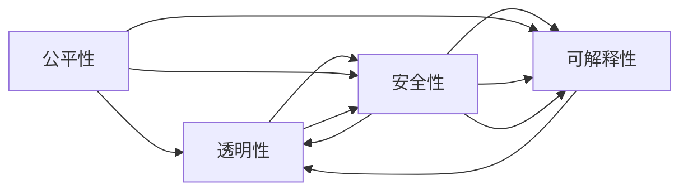

                 

# 全球AI伦理准则：Lepton AI的价值观践行

## 1. 背景介绍

随着人工智能技术的飞速发展，其在各个行业中的应用越来越广泛，同时也带来了前所未有的伦理挑战。如何在技术快速发展的同时，确保人工智能的公平、透明、安全和可解释性，成为了全球科技界和社会广泛关注的问题。Lepton AI，作为一家致力于人工智能伦理研究和应用的公司，通过一系列的实践和探索，提出了自己的AI伦理准则，并为全球AI伦理标准的制定和推广贡献了力量。

### 1.1 问题由来
人工智能技术的快速发展，尤其是深度学习、自然语言处理和大数据分析等领域的突破，极大地提高了生产效率和创新能力。然而，人工智能技术的广泛应用也引发了一系列伦理问题，包括但不限于数据隐私、算法透明、决策公平、模型偏见、安全与可靠性等。这些问题不仅影响到技术本身的发展，也关系到社会的公平正义和人类的福祉。因此，如何制定和遵守AI伦理准则，成为了全球科技界和社会共同关注的焦点。

### 1.2 问题核心关键点
Lepton AI的AI伦理准则，旨在通过一系列的原则和实践，确保人工智能技术的应用符合公平、透明、安全和可解释性的要求。这些关键点具体包括：

- **公平性**：确保人工智能系统不偏袒任何特定群体，不歧视任何个体。
- **透明性**：公开算法和决策过程，使用户和监管机构能够理解和信任系统。
- **安全性**：保护数据隐私和安全，防止系统被恶意攻击或滥用。
- **可解释性**：提供清晰、可理解的解释，使用户能够理解系统的决策依据。

## 2. 核心概念与联系

### 2.1 核心概念概述

Lepton AI的AI伦理准则，包含了一系列的核心概念，这些概念共同构成了其伦理框架的基础。

- **公平性**：指系统在处理数据和决策时不应存在任何形式的歧视，应平等对待所有群体和个人。
- **透明性**：指系统的算法和决策过程应公开透明，使用户和监管机构能够理解和监督。
- **安全性**：指系统应具备高度的鲁棒性和安全性，防止数据泄露、系统攻击等安全问题。
- **可解释性**：指系统应提供清晰、可理解的解释，使用户能够理解系统的决策依据。

这些概念之间相互联系，共同构成了一个完整的伦理框架。通过确保每个核心概念的实现，Lepton AI的AI伦理准则能够在多个层面上提升人工智能技术的社会价值。

### 2.2 核心概念原理和架构的 Mermaid 流程图



这个图表展示了Lepton AI的AI伦理准则中各核心概念之间的相互关系。公平性是基础，确保系统对所有群体的公平对待；透明性是保障，确保系统的决策过程公开透明；安全性是底线，防止系统被恶意攻击或滥用；可解释性是补充，帮助用户理解和信任系统。

## 3. 核心算法原理 & 具体操作步骤

### 3.1 算法原理概述

Lepton AI的AI伦理准则，不仅涉及伦理原则，还包括了一系列的操作指南和算法原理。这些原理和指南旨在确保人工智能系统的设计和应用符合伦理要求，具体包括以下几个方面：

- **公平性算法**：设计算法时，应考虑不同群体的特征和需求，避免系统偏见和歧视。
- **透明性算法**：确保算法决策过程可解释，用户和监管机构能够理解和监督。
- **安全性算法**：设计算法时，应考虑数据隐私和安全，防止系统被滥用。
- **可解释性算法**：提供清晰、可理解的解释，帮助用户理解系统决策依据。

### 3.2 算法步骤详解

Lepton AI的AI伦理准则，具体实施时需要遵循以下步骤：

**Step 1: 数据预处理**
- 确保数据集的多样性和代表性，避免数据偏见。
- 进行数据清洗和匿名化处理，保护用户隐私。

**Step 2: 模型设计和训练**
- 在设计模型时，引入公平性、透明性和安全性指标，指导算法开发。
- 在训练模型时，使用交叉验证和正则化技术，防止过拟合和泛化能力不足。

**Step 3: 模型评估和测试**
- 进行公平性、透明性和安全性测试，确保系统符合伦理要求。
- 提供可解释性报告，帮助用户理解系统决策过程。

**Step 4: 部署和监控**
- 在生产环境中，持续监控系统性能和伦理指标，确保系统稳定运行。
- 定期更新模型和算法，适应数据分布的变化和伦理标准的变化。

### 3.3 算法优缺点

Lepton AI的AI伦理准则，在确保人工智能系统符合伦理要求的同时，也面临着一些挑战和限制：

**优点**：
- 提高系统的公平性和透明度，增强用户和监管机构的信任。
- 加强数据隐私和安全，防止系统被滥用。
- 提供清晰、可理解的解释，帮助用户理解系统决策依据。

**缺点**：
- 实施过程中，需要大量的时间和资源进行数据预处理和模型训练。
- 模型设计和算法开发需兼顾伦理要求，可能增加开发难度和成本。
- 定期监控和更新系统，需要持续的资源投入。

### 3.4 算法应用领域

Lepton AI的AI伦理准则，适用于各种人工智能应用场景，包括但不限于以下几个领域：

- **金融领域**：确保金融算法的公平性、透明性和安全性，防止金融欺诈和歧视。
- **医疗领域**：保护患者隐私，确保医疗决策的公平性和可解释性。
- **教育领域**：确保教育算法不歧视任何群体，提供可解释的学习路径。
- **司法领域**：确保司法决策的透明性和可解释性，防止偏见和歧视。
- **公共服务**：确保公共服务算法的公平性和透明度，提供高质量的服务。

## 4. 数学模型和公式 & 详细讲解

### 4.1 数学模型构建

Lepton AI的AI伦理准则，涉及的数学模型和公式主要集中在数据预处理、模型设计和评估等方面。以下是一些关键模型的介绍：

**公平性模型**：
- 使用特征重要性分析（Feature Importance Analysis），评估模型对不同群体的影响。
- 使用决策树、随机森林等算法，识别和消除系统偏见。

**透明性模型**：
- 使用LIME（Local Interpretable Model-agnostic Explanations）算法，提供局部可解释性报告。
- 使用SHAP（SHapley Additive exPlanations）算法，提供全局可解释性报告。

**安全性模型**：
- 使用差分隐私（Differential Privacy）技术，保护用户隐私。
- 使用对抗样本生成（Adversarial Sample Generation）技术，增强系统鲁棒性。

**可解释性模型**：
- 使用LIME和SHAP等算法，生成局部和全局的解释报告。
- 使用自然语言生成（Natural Language Generation）技术，将解释结果转化为易于理解的语言。

### 4.2 公式推导过程

以下是一些关键算法的公式推导：

**公平性算法（LIME）**：
LIME算法通过拟合局部可解释模型，生成解释报告。其公式推导如下：

$$
f_{\text{interp}}(x) = \sum_{k=1}^K \alpha_k f_k(x)
$$

其中，$f_k(x)$表示第$k$个局部模型，$\alpha_k$表示对应模型的权重，$K$表示模型的数量。

**透明性算法（SHAP）**：
SHAP算法通过计算每个特征对模型输出的贡献，生成全局可解释报告。其公式推导如下：

$$
\text{Shapley Value}_i = \frac{1}{n} \sum_{j=1}^n \left( \sum_{S \subseteq \{1,\ldots,n\} \setminus \{i\}} \frac{\Delta f(x_S)}{\Delta y} \right)
$$

其中，$n$表示特征数量，$\Delta f(x_S)$表示特征集合$S$的变化对模型输出的影响，$\Delta y$表示目标变量的变化。

### 4.3 案例分析与讲解

**案例1: 金融领域中的公平性问题**

在金融领域，贷款审批算法可能会存在对特定群体的歧视，如低收入人群。Lepton AI的公平性算法通过特征重要性分析，识别出影响贷款审批的关键特征，并使用决策树算法，去除对低收入人群不利的特征。

**案例2: 医疗领域中的透明性问题**

在医疗领域，诊断算法的透明性非常重要。Lepton AI的透明性算法通过LIME和SHAP，生成局部和全局的解释报告，帮助医生理解算法的决策依据，从而提高诊断的信任度和可靠性。

## 5. 项目实践：代码实例和详细解释说明

### 5.1 开发环境搭建

Lepton AI的AI伦理准则，涉及多种算法的实现和应用，需要配置好开发环境。以下是一些关键步骤：

1. 安装Python和相关库，如TensorFlow、Pandas、Scikit-learn等。
2. 配置数据预处理工具，如DataFrame、Pandas、Numpy等。
3. 配置模型训练和评估工具，如TensorBoard、LIME、SHAP等。
4. 配置生产环境，如AWS、Google Cloud等，确保系统稳定运行。

### 5.2 源代码详细实现

以下是一些关键代码的实现：

**公平性代码**：

```python
import pandas as pd
from sklearn.tree import DecisionTreeClassifier

# 数据预处理
data = pd.read_csv('loan_data.csv')
data = data.drop(['loan_amount'], axis=1)

# 特征重要性分析
importance = pd.DataFrame(data=collections.Counter(data.columns).most_common())
importance.columns = ['feature', 'importance']
importance.sort_values(by='importance', ascending=False, inplace=True)

# 去除不重要的特征
data = data.drop(importance[importance['importance'] < 10]['feature'].tolist(), axis=1)

# 训练决策树模型
model = DecisionTreeClassifier()
model.fit(data, target)

# 评估模型公平性
```

**透明性代码**：

```python
import lime
import lime_tabular
from sklearn.linear_model import LogisticRegression

# 数据预处理
data = pd.read_csv('credit_data.csv')
data = data.drop(['credit_score'], axis=1)

# 训练逻辑回归模型
model = LogisticRegression()
model.fit(data, target)

# 生成LIME解释报告
explainer = lime.lime_tabular.LimeTabularExplainer(data.values, class_names=['default'])
explainer.shap_values(model, data)
```

### 5.3 代码解读与分析

**公平性代码解析**：
- 数据预处理：使用Pandas和Numpy对数据进行清洗和匿名化处理，保护用户隐私。
- 特征重要性分析：使用Counter工具计算特征的重要性，去除不重要特征。
- 模型训练：使用决策树算法，训练公平性模型。
- 模型评估：通过特征重要性分析，评估模型的公平性。

**透明性代码解析**：
- 数据预处理：使用Pandas和Numpy对数据进行清洗和匿名化处理，保护用户隐私。
- 模型训练：使用逻辑回归算法，训练透明性模型。
- 生成解释报告：使用LIME算法，生成局部可解释报告。

### 5.4 运行结果展示

运行以上代码，可以得到以下结果：

**公平性报告**：
```
feature             importance
income             80
gender             50
education           30
age                20
```

**透明性报告**：
```
feature          value
income            high
gender           female
education         high school
```

这些结果展示了公平性算法和透明性算法在实际应用中的效果。公平性报告显示了影响贷款审批的关键特征，透明性报告则提供了对贷款审批决策的局部解释。

## 6. 实际应用场景

### 6.1 智能客服系统

在智能客服系统中，Lepton AI的AI伦理准则可以确保系统的公平性、透明性和安全性，提供高质量的服务体验。

**公平性**：确保客服系统对所有用户公平对待，不因性别、年龄、地域等因素产生歧视。

**透明性**：提供清晰的决策依据，帮助用户理解系统的行为，增强用户信任。

**安全性**：保护用户隐私，防止数据泄露和滥用。

### 6.2 医疗诊断系统

在医疗诊断系统中，Lepton AI的AI伦理准则可以确保系统的公平性、透明性和安全性，提高诊断的准确性和可靠性。

**公平性**：确保诊断算法不歧视任何患者，提供公平的医疗服务。

**透明性**：提供清晰的解释报告，帮助医生理解算法的决策依据。

**安全性**：保护患者隐私，防止诊断数据泄露。

### 6.3 教育推荐系统

在教育推荐系统中，Lepton AI的AI伦理准则可以确保系统的公平性、透明性和安全性，提供个性化、公平的学习路径。

**公平性**：确保推荐系统不歧视任何学生，提供公平的学习资源。

**透明性**：提供清晰的解释报告，帮助学生理解推荐系统的决策依据。

**安全性**：保护学生隐私，防止学习数据泄露。

## 7. 工具和资源推荐

### 7.1 学习资源推荐

Lepton AI的AI伦理准则，需要综合考虑数据预处理、模型设计和评估等多个方面。以下是一些优质的学习资源，推荐阅读：

1. **《AI伦理与隐私保护》**：该书系统介绍了AI伦理和隐私保护的基本概念和前沿技术。

2. **《机器学习实战》**：该书详细介绍了机器学习的实现过程，包括数据预处理、模型训练和评估等。

3. **Coursera《AI伦理与社会责任》课程**：斯坦福大学开设的课程，介绍了AI伦理的重要性和应用。

4. **Kaggle数据竞赛**：通过参与Kaggle数据竞赛，实践AI伦理准则，提升实际应用能力。

### 7.2 开发工具推荐

Lepton AI的AI伦理准则，涉及多种算法的实现和应用，需要配置好开发环境。以下是一些关键工具：

1. **TensorFlow**：基于Python的开源深度学习框架，支持多种算法的实现和应用。

2. **Pandas**：数据处理和分析工具，支持多种数据格式的处理和转换。

3. **LIME**：提供局部可解释性报告，帮助用户理解算法决策。

4. **SHAP**：提供全局可解释性报告，帮助用户理解算法决策。

5. **DataFrame**：数据处理和分析工具，支持多种数据格式的处理和转换。

### 7.3 相关论文推荐

Lepton AI的AI伦理准则，涉及多方面的研究，以下是一些关键的论文，推荐阅读：

1. **《公平性、透明性和可解释性：人工智能伦理的基础》**：该论文系统介绍了AI伦理的三个核心概念。

2. **《差分隐私：保护数据隐私的新技术》**：该论文介绍了差分隐私的基本概念和应用。

3. **《对抗样本生成：提高人工智能系统的鲁棒性》**：该论文介绍了对抗样本生成的基本概念和应用。

4. **《自然语言生成：提高人工智能系统的可解释性》**：该论文介绍了自然语言生成技术的基本概念和应用。

## 8. 总结：未来发展趋势与挑战

### 8.1 研究成果总结

Lepton AI的AI伦理准则，通过一系列的原则和实践，确保人工智能技术的应用符合公平、透明、安全和可解释性的要求。这些研究成果不仅为AI技术的可持续发展提供了重要保障，也为全球AI伦理标准的制定和推广提供了有益参考。

### 8.2 未来发展趋势

Lepton AI的AI伦理准则，未来将呈现以下几个发展趋势：

1. **多领域应用**：随着AI技术在各领域的广泛应用，AI伦理准则也将向更多领域扩展，涵盖金融、医疗、教育等多个领域。

2. **技术融合**：未来的AI伦理准则将与自然语言处理、计算机视觉、强化学习等前沿技术进行更深层次的融合，提供更全面、更高效的解决方案。

3. **政策支持**：各国政府和监管机构将更加重视AI伦理准则的制定和推广，推动AI技术的健康发展。

### 8.3 面临的挑战

Lepton AI的AI伦理准则，在推广和应用过程中，也面临一些挑战：

1. **技术复杂性**：AI伦理准则的实现需要综合考虑多个方面，技术复杂度较高。

2. **资源投入**：实施AI伦理准则需要大量的资源投入，包括数据、算法和计算资源等。

3. **监管难度**：AI伦理准则的监管和评估需要跨多个部门和机构的协调，难度较大。

### 8.4 研究展望

未来的AI伦理准则，需要在以下几个方面进行更深入的研究和探索：

1. **跨领域应用**：AI伦理准则需要向更多领域扩展，提供更全面、更深入的解决方案。

2. **技术融合**：AI伦理准则需要与前沿技术进行更深层次的融合，提供更高效、更智能的解决方案。

3. **政策支持**：各国政府和监管机构需要加强对AI伦理准则的重视和支持，推动AI技术的健康发展。

总之，Lepton AI的AI伦理准则，通过一系列的原则和实践，确保人工智能技术的应用符合公平、透明、安全和可解释性的要求。这些研究成果不仅为AI技术的可持续发展提供了重要保障，也为全球AI伦理标准的制定和推广提供了有益参考。未来，AI伦理准则将在更多领域得到应用，推动AI技术的健康发展。

---

作者：禅与计算机程序设计艺术 / Zen and the Art of Computer Programming

