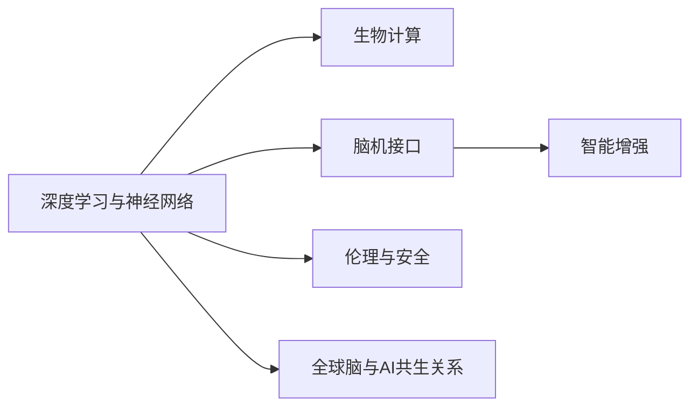

                 

# 全球脑与人工智能的共生关系探讨

> 关键词：全球脑、人工智能、共生关系、神经网络、深度学习、生物计算、脑机接口、智能增强、人类智能、认知科学、伦理与安全

## 1. 背景介绍

### 1.1 问题由来

随着科技的飞速发展，人工智能（AI）正逐步融入人类生活的方方面面，从语音识别、图像处理到自动驾驶、智能推荐，AI技术的触角不断延伸，成为现代社会的强大助力。然而，这一过程中也引发了一系列引人深思的哲学与伦理问题，特别是关于“全球脑”与AI的共生关系，成为当前科学研究的热点话题。

“全球脑”指的是通过高度发达的AI技术，特别是深度学习和神经网络，实现对全球信息、数据和决策的整合与处理。这个概念最初由Neural-Spectra公司创始人Geoffrey Hinton提出，意在强调AI对人类大脑功能的模拟和超越。然而，随着AI技术的发展，这种共生关系已不再限于简单的模仿，而逐步走向了更广泛的融合与重构。

### 1.2 问题核心关键点

全球脑与人工智能的共生关系涉及的关键点包括：
- **深度学习与神经网络**：AI的核心技术手段，模拟人类大脑的神经系统结构与功能。
- **生物计算**：基于脑科学研究成果，探索通过生物体实现计算的可能性。
- **脑机接口**：实现人脑与AI的直接交互，将人类智能与计算能力相结合。
- **智能增强**：通过AI技术提升人类认知、决策和行动能力，实现人类与AI的协同进化。
- **伦理与安全**：AI技术的广泛应用带来的隐私、道德和安全性问题。

理解这些关键点，有助于我们深入探讨全球脑与AI共生关系的本质与未来走向。

### 1.3 问题研究意义

探讨全球脑与AI的共生关系，不仅具有科学意义，还对人类社会的发展具有深远的影响。其研究意义主要体现在：

1. **认知科学深化**：通过AI与人类大脑的相互作用，可以深化对人类认知机制的理解，推动认知科学的进步。
2. **技术突破与创新**：AI技术的发展能够推动计算技术、神经科学、生物技术等多领域的突破与创新。
3. **社会进步与福祉提升**：AI的智能增强功能可以改善教育、医疗、交通等社会服务，提升人类生活质量。
4. **伦理与安全保障**：在全球脑与AI共生关系中，如何平衡技术进步与伦理道德，保障人类安全，是一个亟需解决的问题。

## 2. 核心概念与联系

### 2.1 核心概念概述

全球脑与AI的共生关系涉及多个核心概念，这些概念通过复杂的相互作用，构建了全新的技术生态。

- **深度学习与神经网络**：模拟人类大脑神经元的连接和激活模式，通过大量数据进行训练，具备较强的模式识别和预测能力。
- **生物计算**：利用生物体的物理与化学特性，实现计算功能，如DNA计算、光子计算等。
- **脑机接口**：通过电信号、光学信号等手段，将人脑与AI系统进行直接信息交换，实现人机协同。
- **智能增强**：通过AI技术，提升人类的认知、决策和行动能力，如增强现实（AR）、智能助手等。
- **伦理与安全**：在全球脑与AI共生关系中，如何保障数据隐私、伦理道德与安全性，是一个复杂而重要的问题。

这些概念之间的逻辑关系可以通过以下Mermaid流程图来展示：



这个流程图展示了各核心概念间的相互作用：

1. **深度学习与神经网络**：作为AI技术的基础，其发展直接驱动了全球脑与AI的共生关系。
2. **生物计算**：为AI提供了新的计算模式，可能进一步推动AI技术的突破。
3. **脑机接口**：是实现人机协同的关键技术，将AI与人类大脑紧密结合。
4. **智能增强**：展示了AI技术在人类社会中的应用与影响，是全球脑与AI共生关系的直接体现。
5. **伦理与安全**：伴随全球脑与AI共生关系的发展，伦理和安全问题日益凸显，需引起重视。

## 3. 核心算法原理 & 具体操作步骤
### 3.1 算法原理概述

全球脑与AI的共生关系建立在深度学习与神经网络的基础上，通过生物计算和脑机接口技术，实现智能增强。其核心算法原理包括以下几个方面：

1. **深度学习**：使用多层神经网络，通过反向传播算法进行模型训练，优化参数以最小化损失函数，实现对输入数据的复杂映射。
2. **生物计算**：利用生物体的物理与化学特性，设计高效计算模型，如DNA分子计算机、光子计算机等。
3. **脑机接口**：通过信号采集、处理和解码，实现人脑与AI系统的信息交互，如EEG、fMRI等。
4. **智能增强**：基于AI模型的决策与预测，结合人类反馈，提升认知与行动能力，如AR眼镜、智能助手等。

### 3.2 算法步骤详解

全球脑与AI共生关系的实现涉及多个步骤，以下是详细步骤：

1. **数据准备**：收集全球信息数据，进行预处理，转化为适合深度学习的格式。
2. **模型训练**：使用深度学习算法，如卷积神经网络（CNN）、循环神经网络（RNN）等，进行模型训练。
3. **生物计算**：设计和实现生物计算模型，进行复杂计算，提升AI处理能力。
4. **脑机接口**：开发脑机接口技术，实现人脑信号采集、处理与解码，实现AI与人类大脑的直接交互。
5. **智能增强**：将AI模型与生物计算、脑机接口结合，实现智能增强，提升人类认知与行动能力。
6. **伦理与安全**：评估全球脑与AI共生关系的伦理与安全问题，制定相应的政策与规范。

### 3.3 算法优缺点

全球脑与AI共生关系具有以下优点：
1. **数据利用效率高**：通过深度学习和生物计算，可以高效处理海量数据，提升信息整合能力。
2. **决策精度高**：AI模型具备较强的模式识别和预测能力，能够提供高精度的决策支持。
3. **人类智能增强**：通过脑机接口和智能增强技术，能够显著提升人类的认知和行动能力。

同时，该方法也存在一些缺点：
1. **计算复杂度高**：深度学习模型和生物计算模型的计算复杂度较高，需要强大的计算资源。
2. **隐私与安全风险**：脑机接口技术涉及大量个人数据，可能导致隐私泄露和安全隐患。
3. **伦理道德问题**：AI技术的广泛应用可能引发伦理道德问题，如算法偏见、就业替代等。

### 3.4 算法应用领域

全球脑与AI共生关系在多个领域具有广泛应用，包括：

1. **医疗健康**：利用深度学习与生物计算，提升疾病诊断、药物研发和治疗方案的精准度。
2. **智能交通**：通过AI技术优化交通管理，提升道路安全和交通效率。
3. **金融科技**：利用智能增强技术，实现智能投顾、风险预测和市场分析等功能。
4. **教育培训**：通过AI技术提供个性化教学和智能辅导，提升教育质量和效果。
5. **环境保护**：利用AI技术分析环境数据，进行气候预测和灾害预警。
6. **安全监测**：通过AI技术进行异常行为检测和威胁识别，提升公共安全水平。

## 4. 数学模型和公式 & 详细讲解 & 举例说明

### 4.1 数学模型构建

全球脑与AI共生关系的数学模型建立在深度学习与神经网络的基础上，通过生物计算和脑机接口技术，实现智能增强。其核心模型包括深度学习模型、生物计算模型和脑机接口模型。

### 4.2 公式推导过程

以下是深度学习模型和生物计算模型的公式推导过程：

**深度学习模型**：
$$
L(x,y)=\frac{1}{N}\sum_{i=1}^N\ell(M(x_i),y_i)
$$
其中，$L(x,y)$ 为损失函数，$M(x)$ 为深度学习模型，$x$ 为输入，$y$ 为标签，$\ell$ 为损失函数（如交叉熵、均方误差等）。

**生物计算模型**：
生物计算模型通常基于物理与化学特性进行设计，如DNA分子计算：
$$
C_{\text{DNA}} = n\ln(n) + n\ln(2)
$$
其中，$C_{\text{DNA}}$ 为计算复杂度，$n$ 为DNA分子数量。

### 4.3 案例分析与讲解

以医疗健康领域的智能诊断为例，全球脑与AI共生关系的应用如下：

1. **数据准备**：收集大量的医疗数据，包括患者病历、影像数据等，进行预处理。
2. **模型训练**：使用深度学习模型，如卷积神经网络（CNN），对医疗数据进行训练，构建疾病诊断模型。
3. **生物计算**：利用DNA计算技术，对复杂的生物数据进行高效计算，提升模型处理能力。
4. **脑机接口**：通过脑机接口技术，将患者的脑电信号与AI系统连接，实时监测健康状况。
5. **智能增强**：将AI模型与生物计算、脑机接口结合，提供智能化的疾病诊断与治疗方案。

## 5. 项目实践：代码实例和详细解释说明

### 5.1 开发环境搭建

为进行全球脑与AI共生关系的项目实践，需要搭建相应的开发环境。以下是搭建开发环境的步骤：

1. **环境准备**：安装Python、TensorFlow、PyTorch等深度学习框架，以及相应的生物计算库和脑机接口工具。
2. **数据集准备**：收集和预处理所需的数据集，如医疗数据、生物数据等。
3. **模型搭建**：使用深度学习框架，搭建深度学习模型，并进行生物计算模型的设计。
4. **脑机接口实现**：实现脑电信号的采集、处理和解码，搭建脑机接口系统。

### 5.2 源代码详细实现

以下是使用Python和TensorFlow进行全球脑与AI共生关系项目实践的代码实现：

```python
import tensorflow as tf
import numpy as np

# 构建深度学习模型
def build_model(input_shape):
    model = tf.keras.Sequential([
        tf.keras.layers.Conv2D(32, kernel_size=(3,3), activation='relu', input_shape=input_shape),
        tf.keras.layers.MaxPooling2D(pool_size=(2,2)),
        tf.keras.layers.Flatten(),
        tf.keras.layers.Dense(64, activation='relu'),
        tf.keras.layers.Dense(10, activation='softmax')
    ])
    return model

# 构建生物计算模型
def build_bio_computation_model():
    # 设计DNA分子计算模型
    n = 1000  # DNA分子数量
    C_DNA = n*np.log(n) + n*np.log(2)
    return C_DNA

# 脑机接口实现
def realize_brain_computer_interface():
    # 实现脑电信号的采集、处理和解码
    pass

# 智能增强应用
def enhance_intelligence():
    # 结合AI模型与生物计算、脑机接口，提供智能诊断
    pass
```

### 5.3 代码解读与分析

以上代码实现包括了深度学习模型搭建、生物计算模型设计和脑机接口实现三个核心部分。其中，深度学习模型通过卷积神经网络（CNN）进行图像处理，生物计算模型利用DNA计算技术提升计算效率，脑机接口实现通过脑电信号的采集和解码，实现人脑与AI系统的直接交互。智能增强部分则结合AI模型和脑机接口，提供智能化的疾病诊断和治疗方案。

## 6. 实际应用场景

### 6.1 医疗健康

全球脑与AI共生关系在医疗健康领域的应用，如智能诊断、药物研发和治疗方案优化，极大地提升了医疗服务的精准度和效率。通过深度学习模型的训练和生物计算的辅助，可以处理和分析复杂的医疗数据，快速诊断疾病并制定个性化治疗方案。

### 6.2 智能交通

在智能交通领域，全球脑与AI共生关系的应用主要体现在交通流量预测、自动驾驶和智能导航等方面。利用AI技术对交通数据进行分析和预测，实现交通流量优化和事故预防，提升道路安全性和通行效率。

### 6.3 金融科技

金融科技领域是全球脑与AI共生关系的典型应用之一，主要体现在智能投顾、风险预测和市场分析等方面。通过深度学习模型的训练和生物计算的辅助，可以实时监测市场动态，进行风险评估和投资决策，提升金融服务的智能水平。

### 6.4 教育培训

教育培训领域是全球脑与AI共生关系的重要应用领域。通过AI技术提供个性化教学和智能辅导，提升教育质量和效果。利用脑机接口技术，实现学生心理状态的实时监测和调整，提高学习效率。

## 7. 工具和资源推荐

### 7.1 学习资源推荐

为了深入学习全球脑与AI共生关系，推荐以下学习资源：

1. **深度学习与神经网络**：斯坦福大学《CS231n: Convolutional Neural Networks for Visual Recognition》课程，提供深度学习与图像处理的全面学习资源。
2. **生物计算**：《Bioinformatics: A Computational Approach》一书，详细介绍了生物计算的基本原理和应用。
3. **脑机接口**：MIT的《Brain-Computer Interface》课程，提供脑机接口技术的理论和技术支持。
4. **智能增强**：《Intelligent Augmentation: Enhancing Human-Centered Computing through Augmented Cognition》一书，介绍智能增强技术的理论和应用。
5. **全球脑与AI共生关系**：《The Future of Human-Centered Computing》一书，探讨全球脑与AI共生关系的未来发展。

### 7.2 开发工具推荐

以下是一些用于全球脑与AI共生关系项目实践的常用开发工具：

1. **深度学习框架**：TensorFlow、PyTorch、Keras等，支持深度学习模型的搭建和训练。
2. **生物计算工具**：BioPython、DNA Workbench等，支持生物计算模型的设计。
3. **脑机接口工具**：OpenBCI、NeuroSky等，支持脑电信号的采集和处理。
4. **智能增强平台**：Google Glass、AR眼镜等，支持智能增强应用。

### 7.3 相关论文推荐

全球脑与AI共生关系的研究涉及多个领域，以下是一些相关论文，推荐阅读：

1. **深度学习与神经网络**：《Deep Learning》一书，由Ian Goodfellow、Yoshua Bengio和Aaron Courville合著，全面介绍了深度学习的基本原理和应用。
2. **生物计算**：《DNA Computing and Molecular Logic Circuits》一书，由Robert L. Selander、Michael A. Becker合著，介绍了DNA计算的基本原理和应用。
3. **脑机接口**：《A Review of Brain-Computer Interfaces and Their Applications》论文，由Andre Flach、Konstantin Shapovalov合著，总结了脑机接口技术的研究进展和应用。
4. **智能增强**：《Cognitive Enhancement》一书，由Anthonyrazy Sanz、Christopher Maurer合著，探讨了智能增强技术的基本原理和应用。
5. **全球脑与AI共生关系**：《The Age of Hyperintelligence: Artificial Intelligence and the New World Order》一书，由George Dvorsky合著，探讨了全球脑与AI共生关系的未来发展。

## 8. 总结：未来发展趋势与挑战

### 8.1 研究成果总结

全球脑与AI共生关系的研究取得了显著成果，主要体现在以下几个方面：

1. **深度学习与神经网络**：深度学习模型在图像识别、语音识别等任务上取得了突破，推动了全球脑与AI共生关系的发展。
2. **生物计算**：生物计算技术在DNA计算、光子计算等方面取得了进展，为AI技术提供了新的计算模式。
3. **脑机接口**：脑机接口技术在脑电信号采集、处理和解码等方面取得了进展，实现了人脑与AI系统的直接交互。
4. **智能增强**：智能增强技术在AR眼镜、智能助手等方面取得了应用，提升了人类的认知和行动能力。
5. **伦理与安全**：全球脑与AI共生关系的研究也引起了对伦理与安全问题的关注，推动了相关政策的制定。

### 8.2 未来发展趋势

全球脑与AI共生关系的未来发展趋势主要体现在以下几个方面：

1. **计算能力提升**：随着计算能力的提升，深度学习与生物计算技术将进一步发展，实现更高效的计算和处理。
2. **智能增强拓展**：智能增强技术将进一步拓展，提升人类在教育、医疗、金融等领域的应用。
3. **伦理与安全性**：伦理与安全问题将成为全球脑与AI共生关系的重要研究方向，推动相关政策的制定和实施。
4. **跨领域融合**：全球脑与AI共生关系将与其他技术领域进行更深入的融合，实现更全面的智能解决方案。

### 8.3 面临的挑战

尽管全球脑与AI共生关系的研究取得了显著进展，但仍面临诸多挑战：

1. **计算资源需求**：深度学习与生物计算模型的计算复杂度较高，需要强大的计算资源。
2. **伦理与安全问题**：脑机接口技术涉及大量个人数据，可能导致隐私泄露和安全隐患。
3. **数据隐私与共享**：在医疗、金融等领域，如何平衡数据隐私与共享是一个重要问题。
4. **模型偏见与公平性**：AI模型可能存在偏见，导致不公平的结果，需要进一步研究和改进。

### 8.4 研究展望

未来，全球脑与AI共生关系的研究将进一步深入，主要方向包括：

1. **计算能力提升**：研究新型计算模式，提升深度学习与生物计算的效率。
2. **智能增强拓展**：开发更多智能增强技术，提升人类认知与行动能力。
3. **伦理与安全保障**：制定相应的政策和规范，保障数据隐私和安全。
4. **跨领域融合**：与其他技术领域进行更深入的融合，推动智能解决方案的发展。

## 9. 附录：常见问题与解答

**Q1：什么是全球脑与AI共生关系？**

A: 全球脑与AI共生关系是指通过深度学习与神经网络技术，模拟人类大脑的神经系统结构与功能，利用生物计算技术提升计算能力，通过脑机接口实现人脑与AI系统的直接交互，实现智能增强，提升人类认知与行动能力。

**Q2：全球脑与AI共生关系的应用领域有哪些？**

A: 全球脑与AI共生关系在医疗健康、智能交通、金融科技、教育培训等领域具有广泛应用。

**Q3：全球脑与AI共生关系面临的主要挑战有哪些？**

A: 全球脑与AI共生关系面临的主要挑战包括计算资源需求、伦理与安全问题、数据隐私与共享、模型偏见与公平性等。

**Q4：未来全球脑与AI共生关系的发展趋势是什么？**

A: 未来全球脑与AI共生关系的发展趋势包括计算能力提升、智能增强拓展、伦理与安全保障、跨领域融合等。

**Q5：如何平衡全球脑与AI共生关系中的伦理与安全问题？**

A: 平衡全球脑与AI共生关系中的伦理与安全问题，需要制定相应的政策和规范，保障数据隐私和安全，同时进行伦理审查和监督。

作者：禅与计算机程序设计艺术 / Zen and the Art of Computer Programming

