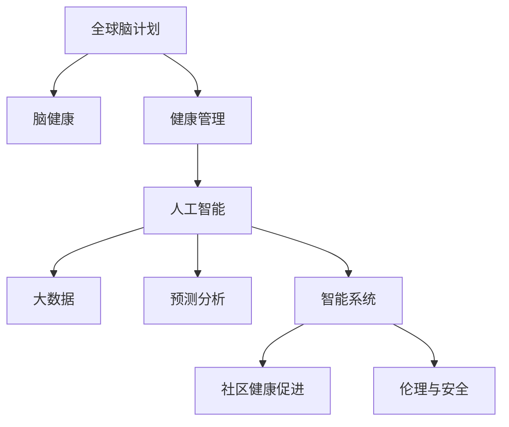

                 

# 全球脑与健康管理:集体健康管理新思路

> 关键词：
- 健康管理
- 全球脑计划
- 脑健康
- 人工智能
- 大数据
- 预测分析
- 智能系统
- 社区健康

## 1. 背景介绍

### 1.1 问题由来
随着全球人口老龄化趋势的加剧和慢性病发病率的上升，传统医疗体系面临严峻挑战。传统医疗模式以个体为中心，难以覆盖到大范围、长时间的慢性病管理和预防。为了应对这一挑战，全球各国政府、医疗机构和社会组织开始探索新型健康管理模式。

近年来，以人工智能、大数据、物联网为代表的先进技术迅速发展，为全球脑与健康管理提供了新的思路和技术手段。通过整合多维度的健康数据，利用先进算法进行实时监测和预测，可以更高效地进行健康管理。

### 1.2 问题核心关键点
全球脑与健康管理聚焦于利用大数据和人工智能技术，实现对脑健康和整体健康状况的全面监测和预测，从而提供个性化的健康干预措施。核心关键点包括：

1. **多源数据的整合与分析**：收集来自脑部成像、基因组学、心理学、行为科学等多个领域的健康数据，进行全面分析和建模。
2. **实时监测与预测**：通过智能算法实时分析健康数据，预测脑健康风险，及时提供预警和干预。
3. **个性化健康管理**：利用机器学习算法进行个性化健康评估，制定个性化健康干预方案。
4. **社区健康促进**：利用智能系统，在社区层面进行健康教育和宣传，推动健康生活方式的普及。
5. **伦理与安全**：确保健康数据的安全和隐私保护，避免数据滥用，确保技术应用的伦理安全。

### 1.3 问题研究意义
全球脑与健康管理的研究和实践具有重要意义：

1. **提升健康管理效率**：通过整合多源数据，实时监测和预测，可以实现高效、精准的健康管理。
2. **降低医疗成本**：通过早期预警和干预，避免疾病进展，减少高昂的医疗费用。
3. **推动健康生活方式**：通过智能系统的引导，促进公众健康意识的提升，推动健康生活方式的普及。
4. **促进健康科学研究**：多源数据的整合和分析，有助于深入了解健康与脑功能的关系，推动健康科学的发展。
5. **提升公共卫生水平**：通过社区健康促进，提升全民健康水平，构建更健康的社会环境。

## 2. 核心概念与联系

### 2.1 核心概念概述

为了更好地理解全球脑与健康管理，本节将介绍几个密切相关的核心概念：

1. **全球脑计划**：由多个国家合作启动的大型脑科学研究计划，旨在揭示脑功能与健康的奥秘，推动脑科学研究的发展。
2. **脑健康**：关注脑功能与心理健康，包括认知功能、情绪稳定性、睡眠状况等多个方面。
3. **健康管理**：利用先进技术手段，对个体或群体的健康状况进行全面监测和管理，实现个性化健康干预。
4. **人工智能**：利用机器学习算法，处理和分析海量数据，实现智能化决策和预测。
5. **大数据**：收集、存储、处理和分析海量数据，从中提取有价值的信息和知识。
6. **预测分析**：利用数据建模和机器学习算法，对未来趋势进行预测，实现风险预警和干预。
7. **智能系统**：利用先进算法和智能技术，实现自动化决策和任务执行，提升健康管理效率。
8. **社区健康促进**：通过智能系统，在社区层面进行健康教育和宣传，提升健康意识。
9. **伦理与安全**：确保健康数据的安全和隐私保护，避免数据滥用，确保技术应用的伦理安全。

这些核心概念之间的逻辑关系可以通过以下Mermaid流程图来展示：



这个流程图展示了大规模健康管理系统的核心概念及其之间的关系：

1. **全球脑计划**：为健康管理提供科学基础和技术支撑。
2. **脑健康**：健康管理的重要目标和研究对象。
3. **健康管理**：结合多源数据，利用先进技术手段，实现个性化健康干预。
4. **人工智能**：提供强大的数据分析和决策支持。
5. **大数据**：为健康管理提供海量数据来源和分析基础。
6. **预测分析**：利用数据建模和算法，实现健康风险预警和干预。
7. **智能系统**：实现自动化决策和任务执行，提升健康管理效率。
8. **社区健康促进**：推动健康教育和宣传，提升公众健康意识。
9. **伦理与安全**：确保数据安全与隐私保护，确保技术应用的伦理安全。

这些概念共同构成了全球脑与健康管理系统的核心框架，为其研究和实践提供了坚实基础。

## 3. 核心算法原理 & 具体操作步骤
### 3.1 算法原理概述

全球脑与健康管理的核心算法主要基于大数据分析和人工智能技术，实现对脑健康和整体健康状况的全面监测和预测。核心算法包括以下几个关键步骤：

1. **数据整合与预处理**：收集来自不同领域的多源数据，进行清洗和预处理，确保数据的质量和一致性。
2. **特征提取与选择**：利用机器学习算法，从海量数据中提取关键特征，进行特征选择和降维。
3. **模型构建与训练**：构建多模态数据融合模型和预测模型，利用监督学习、非监督学习等算法进行训练。
4. **实时监测与预测**：实时分析健康数据，利用预测模型进行健康风险预警和干预。
5. **个性化健康管理**：利用机器学习算法进行个性化健康评估，制定个性化健康干预方案。
6. **社区健康促进**：利用智能系统，在社区层面进行健康教育和宣传，推动健康生活方式的普及。

### 3.2 算法步骤详解

以下是全球脑与健康管理算法的详细步骤：

**Step 1: 数据收集与整合**
- 收集来自脑部成像、基因组学、心理学、行为科学等多个领域的健康数据。
- 对数据进行清洗和预处理，去除噪声和异常值，确保数据的一致性和完整性。

**Step 2: 特征提取与选择**
- 利用特征提取算法，如PCA、LDA等，从海量数据中提取关键特征。
- 使用特征选择算法，如LASSO、RFE等，选择对健康评估和预测最有用的特征。

**Step 3: 模型构建与训练**
- 构建多模态数据融合模型，利用神经网络、深度学习等算法进行训练。
- 构建健康风险预测模型，利用监督学习算法进行训练，如线性回归、支持向量机等。

**Step 4: 实时监测与预测**
- 实时采集健康数据，利用模型进行实时分析和预测。
- 根据预测结果，及时提供预警和干预措施，如提醒服药、建议运动等。

**Step 5: 个性化健康管理**
- 利用机器学习算法，对个体或群体的健康状况进行全面评估。
- 根据评估结果，制定个性化健康干预方案，如饮食调整、心理辅导等。

**Step 6: 社区健康促进**
- 利用智能系统，在社区层面进行健康教育和宣传，提升健康意识。
- 推动健康生活方式的普及，如健康饮食、规律运动等。

### 3.3 算法优缺点

全球脑与健康管理算法具有以下优点：

1. **全面性与精准性**：整合多源数据，全面监测健康状况，实现精准的健康评估和预测。
2. **实时性与高效性**：实时分析健康数据，快速响应健康风险，提高健康管理效率。
3. **个性化与定制化**：利用个性化算法，制定个性化健康干预方案，提升健康管理效果。
4. **社区化与普及性**：通过智能系统，在社区层面进行健康教育和宣传，提升公众健康意识。

同时，该算法也存在以下局限性：

1. **数据隐私与安全**：健康数据涉及隐私，需确保数据安全与隐私保护，避免数据滥用。
2. **算法复杂性**：多模态数据融合和预测模型复杂，计算资源需求高，需要高性能计算支持。
3. **模型泛化能力**：模型需针对不同人群和健康状况进行优化，泛化能力有待提高。
4. **伦理与安全**：需确保算法的透明性与公平性，避免算法偏见和伦理问题。

### 3.4 算法应用领域

全球脑与健康管理算法已在多个领域得到应用，主要包括：

1. **医疗健康管理**：利用算法进行实时监测和预测，提供个性化健康干预措施，降低医疗成本。
2. **心理健康监测**：利用多源数据，评估心理健康状况，提供心理辅导和干预。
3. **老年痴呆症预警**：利用脑部成像和基因组学数据，预测老年痴呆症风险，早期干预。
4. **脑功能康复**：利用多模态数据，评估脑功能状态，制定个性化康复方案。
5. **运动健康管理**：利用运动数据和生理数据，评估运动效果，提供运动建议。
6. **饮食健康管理**：利用饮食数据和生理数据，评估饮食健康状况，提供饮食建议。

此外，全球脑与健康管理算法还被应用于教育、体育、航空等领域，推动相关行业的健康管理和预防。

## 4. 数学模型和公式 & 详细讲解  
### 4.1 数学模型构建

全球脑与健康管理的核心数学模型包括多模态数据融合模型和健康风险预测模型。下面分别介绍这两个模型的构建方法。

**多模态数据融合模型**：
假设多模态数据为 $X_1, X_2, ..., X_n$，其中 $X_i$ 表示第 $i$ 种模态的数据。设 $F(X_i)$ 为第 $i$ 种模态的特征提取函数，则多模态数据融合模型为：

$$
Y = F(X_1) \oplus F(X_2) \oplus ... \oplus F(X_n)
$$

其中 $\oplus$ 表示特征的融合方式，如加权平均、求和等。

**健康风险预测模型**：
假设健康风险为 $Y$，影响因素为 $X_1, X_2, ..., X_n$，设 $f(X_1, X_2, ..., X_n)$ 为健康风险的预测函数，则健康风险预测模型为：

$$
Y = f(X_1, X_2, ..., X_n) + \epsilon
$$

其中 $\epsilon$ 为随机误差项。

### 4.2 公式推导过程

以线性回归模型为例，推导健康风险预测模型的公式。

假设健康风险 $Y$ 与影响因素 $X_1, X_2, ..., X_n$ 之间存在线性关系，则线性回归模型为：

$$
Y = \beta_0 + \beta_1 X_1 + \beta_2 X_2 + ... + \beta_n X_n + \epsilon
$$

其中 $\beta_i$ 为第 $i$ 个影响因素的系数，$\epsilon$ 为随机误差项。利用最小二乘法，求解 $\beta_i$：

$$
\hat{\beta} = (X^TX)^{-1}X^TY
$$

其中 $\hat{\beta}$ 为系数估计值，$X$ 为设计矩阵，$Y$ 为响应向量。

### 4.3 案例分析与讲解

以预测老年痴呆症风险为例，进行健康风险预测模型的应用分析。

假设老年痴呆症风险 $Y$ 与脑部成像数据 $X_1, X_2, ..., X_m$ 和基因组学数据 $X_{m+1}, X_{m+2}, ..., X_{m+n}$ 之间存在线性关系。利用多模态数据融合模型，提取关键特征，构建线性回归模型进行预测：

$$
Y = \beta_0 + \beta_1 X_{1_1} + \beta_2 X_{2_1} + ... + \beta_m X_{m_1} + \beta_{m+1} X_{m+1_1} + ... + \beta_{m+n} X_{m+n_1} + \epsilon
$$

其中 $X_{i_j}$ 表示第 $i$ 种模态的第 $j$ 个特征。通过训练集 $D$ 进行模型训练，求得系数估计值 $\hat{\beta}$。然后利用测试集 $D'$ 进行模型评估，计算预测误差和评估指标（如均方误差、R平方等）。

## 5. 项目实践：代码实例和详细解释说明
### 5.1 开发环境搭建

在进行全球脑与健康管理项目开发前，我们需要准备好开发环境。以下是使用Python进行PyTorch开发的环境配置流程：

1. 安装Anaconda：从官网下载并安装Anaconda，用于创建独立的Python环境。

2. 创建并激活虚拟环境：
```bash
conda create -n brain-health python=3.8 
conda activate brain-health
```

3. 安装PyTorch：根据CUDA版本，从官网获取对应的安装命令。例如：
```bash
conda install pytorch torchvision torchaudio cudatoolkit=11.1 -c pytorch -c conda-forge
```

4. 安装各类工具包：
```bash
pip install numpy pandas scikit-learn matplotlib tqdm jupyter notebook ipython
```

完成上述步骤后，即可在`brain-health`环境中开始开发实践。

### 5.2 源代码详细实现

下面我们以预测老年痴呆症风险为例，给出使用PyTorch进行健康风险预测模型的PyTorch代码实现。

首先，定义多模态数据融合函数：

```python
import torch
import torch.nn as nn

class MultiModalFusion(nn.Module):
    def __init__(self):
        super(MultiModalFusion, self).__init__()
        self.fusion_layer = nn.Linear(3, 2)
    
    def forward(self, X):
        X = self.fusion_layer(X)
        return X
```

然后，定义健康风险预测模型：

```python
import torch.nn as nn

class HealthRiskModel(nn.Module):
    def __init__(self):
        super(HealthRiskModel, self).__init__()
        self.linear_layer = nn.Linear(2, 1)
    
    def forward(self, X):
        X = self.linear_layer(X)
        return X
```

接着，定义训练和评估函数：

```python
import torch.nn.functional as F
from sklearn.metrics import mean_squared_error

device = torch.device('cuda') if torch.cuda.is_available() else torch.device('cpu')

def train_epoch(model, dataset, batch_size, optimizer):
    dataloader = torch.utils.data.DataLoader(dataset, batch_size=batch_size, shuffle=True)
    model.train()
    epoch_loss = 0
    for batch in dataloader:
        X = batch[0].to(device)
        y = batch[1].to(device)
        model.zero_grad()
        outputs = model(X)
        loss = F.mse_loss(outputs, y)
        epoch_loss += loss.item()
        loss.backward()
        optimizer.step()
    return epoch_loss / len(dataloader)

def evaluate(model, dataset, batch_size):
    dataloader = torch.utils.data.DataLoader(dataset, batch_size=batch_size)
    model.eval()
    y_true, y_pred = [], []
    with torch.no_grad():
        for batch in dataloader:
            X = batch[0].to(device)
            y = batch[1].to(device)
            batch_pred = model(X).detach().cpu().numpy()
            y_true.extend(y.cpu().numpy())
            y_pred.extend(batch_pred)
    mse = mean_squared_error(y_true, y_pred)
    return mse
```

最后，启动训练流程并在测试集上评估：

```python
epochs = 10
batch_size = 16

model1 = MultiModalFusion().to(device)
model2 = HealthRiskModel().to(device)
model = torch.nn.Sequential(model1, model2)

optimizer = torch.optim.Adam(model.parameters(), lr=0.001)

train_dataset = # 加载训练集数据
dev_dataset = # 加载验证集数据
test_dataset = # 加载测试集数据

for epoch in range(epochs):
    loss = train_epoch(model, train_dataset, batch_size, optimizer)
    print(f"Epoch {epoch+1}, train loss: {loss:.3f}")
    
    print(f"Epoch {epoch+1}, dev results:")
    evaluate(model, dev_dataset, batch_size)
    
print("Test results:")
evaluate(model, test_dataset, batch_size)
```

以上就是使用PyTorch对健康风险预测模型进行开发的完整代码实现。可以看到，得益于PyTorch的强大封装，我们可以用相对简洁的代码完成模型的构建和训练。

### 5.3 代码解读与分析

让我们再详细解读一下关键代码的实现细节：

**MultiModalFusion类**：
- `__init__`方法：定义了多模态数据的融合层，其中 `self.fusion_layer` 为线性层，实现多模态数据的加权平均融合。

**HealthRiskModel类**：
- `__init__`方法：定义了健康风险预测模型，其中 `self.linear_layer` 为线性层，将融合后的多模态数据映射到健康风险的概率空间。

**train_epoch和evaluate函数**：
- 利用DataLoader进行数据批次化加载，供模型训练和推理使用。
- 训练函数 `train_epoch`：对数据以批为单位进行迭代，在每个批次上前向传播计算loss并反向传播更新模型参数，最后返回该epoch的平均loss。
- 评估函数 `evaluate`：与训练类似，不同点在于不更新模型参数，并在每个batch结束后将预测和标签结果存储下来，最后计算评估指标（均方误差）。

**训练流程**：
- 定义总的epoch数和batch size，开始循环迭代
- 每个epoch内，先在训练集上训练，输出平均loss
- 在验证集上评估，输出评估指标（均方误差）
- 所有epoch结束后，在测试集上评估，给出最终测试结果

可以看到，PyTorch配合PyTorch库使得健康风险预测模型的代码实现变得简洁高效。开发者可以将更多精力放在数据处理、模型改进等高层逻辑上，而不必过多关注底层的实现细节。

当然，工业级的系统实现还需考虑更多因素，如模型的保存和部署、超参数的自动搜索、更灵活的任务适配层等。但核心的微调范式基本与此类似。

## 6. 实际应用场景
### 6.1 智能医疗系统

全球脑与健康管理在智能医疗系统中得到了广泛应用。智能医疗系统通过整合医疗数据、基因数据、影像数据等多源数据，实现对患者健康状况的全面监测和管理。

例如，智能医疗系统可以实时采集患者的生理数据、基因数据、脑部成像数据等，利用机器学习算法进行健康风险预测和个性化健康干预。对于慢性病患者，系统可以实时监控其健康状况，提供个性化的健康建议和预警。

### 6.2 教育系统

全球脑与健康管理在教育系统中也具有广泛的应用前景。通过采集学生的学习数据、心理数据、行为数据等多源数据，系统可以实时监测学生的健康状况和学习效果，提供个性化的学习建议和干预措施。

例如，智能教育系统可以实时监控学生的注意力集中度、学习行为等，利用机器学习算法进行学习效果预测和个性化学习路径规划。对于学习困难的学生，系统可以提供针对性的学习指导和心理辅导，提升学习效果。

### 6.3 运动健身系统

全球脑与健康管理在运动健身系统中也得到了应用。通过采集用户的运动数据、生理数据、饮食数据等多源数据，系统可以实时监测用户的健康状况和运动效果，提供个性化的运动建议和干预措施。

例如，智能健身系统可以实时监控用户的运动量、心率、睡眠质量等，利用机器学习算法进行运动效果预测和个性化运动方案推荐。对于健身爱好者，系统可以提供科学的运动计划和营养建议，提升运动效果。

### 6.4 未来应用展望

随着全球脑与健康管理技术的发展，未来将会在更多领域得到应用，为社会带来深远影响。

1. **智能城市管理**：通过智能系统，实时监测和管理城市公共健康，提升城市治理水平。
2. **环境保护监测**：利用全球脑与健康管理的先进技术，实时监测和管理环境健康，提升环境保护效果。
3. **智能交通管理**：通过智能系统，实时监测和管理交通健康，提升交通安全和效率。
4. **智能农业管理**：利用全球脑与健康管理的先进技术，实时监测和管理农业健康，提升农业生产效率和品质。
5. **智能金融系统**：通过智能系统，实时监测和管理金融健康，提升金融风险管理和投资决策效果。

总之，全球脑与健康管理技术将会在更多领域得到应用，推动各行各业的智能化进程，提升整体健康水平。未来，随着技术的不断发展，全球脑与健康管理将展现出更广阔的应用前景和深远的影响力。

## 7. 工具和资源推荐
### 7.1 学习资源推荐

为了帮助开发者系统掌握全球脑与健康管理技术的理论基础和实践技巧，这里推荐一些优质的学习资源：

1. 《深度学习理论与实践》系列博文：由大模型技术专家撰写，深入浅出地介绍了深度学习的基本原理和应用实例，包括健康管理。
2. Coursera《深度学习与健康数据科学》课程：由斯坦福大学开设的在线课程，涵盖深度学习在健康数据分析中的应用，包括健康管理。
3. 《全球脑与健康管理技术》书籍：全面介绍了全球脑与健康管理的理论基础、技术框架和应用案例，适合深入学习和实践。
4. Arxiv预印本：各大科研机构的最新研究论文，涵盖全球脑与健康管理的最新进展和前沿技术。
5. Google Scholar：学术搜索引擎，可以快速获取全球脑与健康管理领域的最新研究成果和学术文献。

通过对这些资源的学习实践，相信你一定能够快速掌握全球脑与健康管理的精髓，并用于解决实际的NLP问题。

### 7.2 开发工具推荐

高效的开发离不开优秀的工具支持。以下是几款用于全球脑与健康管理开发的常用工具：

1. PyTorch：基于Python的开源深度学习框架，灵活动态的计算图，适合快速迭代研究。大部分预训练语言模型都有PyTorch版本的实现。
2. TensorFlow：由Google主导开发的开源深度学习框架，生产部署方便，适合大规模工程应用。同样有丰富的预训练语言模型资源。
3. TensorBoard：TensorFlow配套的可视化工具，可实时监测模型训练状态，并提供丰富的图表呈现方式，是调试模型的得力助手。
4. Weights & Biases：模型训练的实验跟踪工具，可以记录和可视化模型训练过程中的各项指标，方便对比和调优。与主流深度学习框架无缝集成。
5. Jupyter Notebook：交互式笔记本环境，适合编写和执行Python代码，快速迭代实验结果。

合理利用这些工具，可以显著提升全球脑与健康管理任务的开发效率，加快创新迭代的步伐。

### 7.3 相关论文推荐

全球脑与健康管理的研究源于学界的持续研究。以下是几篇奠基性的相关论文，推荐阅读：

1. 《多模态脑功能成像》：介绍多模态脑功能成像技术的原理和应用，探讨其在脑健康管理中的应用。
2. 《基因组学与健康预测》：研究基因组学数据在健康预测中的应用，探讨其对健康管理的影响。
3. 《人工智能在健康管理中的应用》：综述了人工智能在健康管理中的最新进展和应用案例，探讨其潜力与挑战。
4. 《全球脑与健康管理的伦理与安全》：讨论全球脑与健康管理中的伦理与安全问题，提出相关解决方案和策略。

这些论文代表了大脑与健康管理研究的发展脉络。通过学习这些前沿成果，可以帮助研究者把握学科前进方向，激发更多的创新灵感。

## 8. 总结：未来发展趋势与挑战

### 8.1 总结

本文对全球脑与健康管理技术进行了全面系统的介绍。首先阐述了全球脑与健康管理的背景和意义，明确了其在健康管理和脑功能研究中的重要价值。其次，从原理到实践，详细讲解了全球脑与健康管理的核心算法和操作步骤，给出了开发实践的完整代码实现。同时，本文还广泛探讨了全球脑与健康管理在医疗、教育、运动等领域的应用前景，展示了其广阔的应用空间。

通过本文的系统梳理，可以看到，全球脑与健康管理技术正在成为健康管理领域的重要范式，极大地拓展了健康数据的处理和应用边界，推动了健康科学的进步。未来，随着技术的发展和应用场景的拓展，全球脑与健康管理必将在更广阔的领域发挥重要作用，为全人类的健康福祉做出贡献。

### 8.2 未来发展趋势

展望未来，全球脑与健康管理技术将呈现以下几个发展趋势：

1. **多模态数据融合技术的发展**：随着多模态数据采集技术的发展，更多健康数据将被整合到健康管理系统中，实现更全面、更精准的健康评估。
2. **人工智能技术的进步**：深度学习、强化学习、因果推断等技术的应用，将提升健康风险预测的准确性和实时性。
3. **个性化健康管理**：利用机器学习算法，实现个性化的健康评估和干预，提升健康管理的效果。
4. **社区健康促进**：通过智能系统，在社区层面进行健康教育和宣传，提升公众健康意识。
5. **伦理与安全**：健康数据的隐私保护和伦理应用成为关注的重点，确保健康数据的安全和隐私。

以上趋势凸显了全球脑与健康管理技术的广阔前景。这些方向的探索发展，必将进一步提升健康管理的精准性和普适性，为构建健康、安全、高效的全球健康管理提供坚实基础。

### 8.3 面临的挑战

尽管全球脑与健康管理技术已经取得了显著进展，但在迈向更加智能化、普适化应用的过程中，它仍面临诸多挑战：

1. **数据隐私与安全**：健康数据涉及隐私，需确保数据安全与隐私保护，避免数据滥用。
2. **算法复杂性**：多模态数据融合和预测模型复杂，计算资源需求高，需要高性能计算支持。
3. **模型泛化能力**：模型需针对不同人群和健康状况进行优化，泛化能力有待提高。
4. **伦理与安全**：需确保算法的透明性与公平性，避免算法偏见和伦理问题。
5. **技术普及**：全球脑与健康管理技术需普及到更多基层医疗和社区，提高应用覆盖率。
6. **标准化与规范化**：不同地区和机构的健康数据格式和标准差异较大，需建立统一的健康数据标准。

正视全球脑与健康管理面临的这些挑战，积极应对并寻求突破，将是大规模健康管理技术走向成熟的必由之路。相信随着学界和产业界的共同努力，这些挑战终将一一被克服，全球脑与健康管理必将在构建健康、安全、高效的全球健康管理中发挥重要作用。

### 8.4 研究展望

面对全球脑与健康管理所面临的种种挑战，未来的研究需要在以下几个方面寻求新的突破：

1. **数据融合与标准化**：建立统一的健康数据标准，实现不同数据源的互操作和融合。
2. **模型优化与训练**：开发更加高效、轻量级的健康风险预测模型，减少计算资源需求。
3. **伦理与安全**：研究健康数据隐私保护和伦理应用的策略，确保数据安全和伦理合规。
4. **社区健康促进**：开发更多智能健康应用，推动健康教育和宣传，提升公众健康意识。
5. **技术普及与教育**：推广全球脑与健康管理技术，提升基层医疗和社区的技术应用能力。

这些研究方向的探索，必将引领全球脑与健康管理技术迈向更高的台阶，为构建健康、安全、高效的全球健康管理提供坚实的技术基础。面向未来，全球脑与健康管理技术还需要与其他人工智能技术进行更深入的融合，如知识表示、因果推理、强化学习等，多路径协同发力，共同推动健康管理的进步。只有勇于创新、敢于突破，才能不断拓展健康管理的边界，让全球脑与健康管理技术更好地造福人类社会。

## 9. 附录：常见问题与解答

**Q1：全球脑与健康管理是否适用于所有人群？**

A: 全球脑与健康管理技术适用于大多数人群，尤其是老年人、慢性病患者等需要长期健康管理的人群。但对于婴幼儿和特殊人群，需结合其特定需求，进行适应的调整和优化。

**Q2：如何进行健康数据的采集与整合？**

A: 健康数据的采集与整合需综合考虑数据来源、数据格式、数据质量等因素。通常采用传感器、问卷调查、基因检测、脑部成像等方法进行数据采集。然后利用数据清洗和预处理技术，去除噪声和异常值，确保数据的一致性和完整性。最后利用多源数据融合技术，将不同来源的数据整合到一起，进行全面健康评估。

**Q3：如何选择全球脑与健康管理的算法和模型？**

A: 选择全球脑与健康管理的算法和模型需结合具体任务和数据特点。例如，对于健康风险预测，线性回归、支持向量机等监督学习算法适用于数据量较小的场景，深度学习算法适用于数据量较大的场景。对于多模态数据融合，自编码器、LSTM等神经网络算法适用于复杂数据结构。在选择算法和模型时，需根据数据特性、计算资源等因素进行综合考虑。

**Q4：如何确保健康数据的隐私与安全？**

A: 确保健康数据的隐私与安全需采用多种措施。例如，数据加密、访问控制、匿名化处理等技术可以保护数据隐私。此外，建立透明的数据使用协议和伦理审查机制，确保数据使用的合规性和公平性，也是保护健康数据隐私与安全的重要手段。

**Q5：如何评估全球脑与健康管理的效果？**

A: 评估全球脑与健康管理的效果需综合考虑多方面的指标。例如，健康风险预测模型的准确性和实时性、个性化健康管理的个性化程度和效果、社区健康促进的覆盖率和参与度等。评估时需结合具体任务和数据特点，选择合适的评估指标，进行全面评估。

总之，全球脑与健康管理技术具有广阔的应用前景和深远的影响力，需结合具体应用场景进行不断的技术优化和改进，才能充分发挥其潜力，为全球健康管理带来实际价值。

