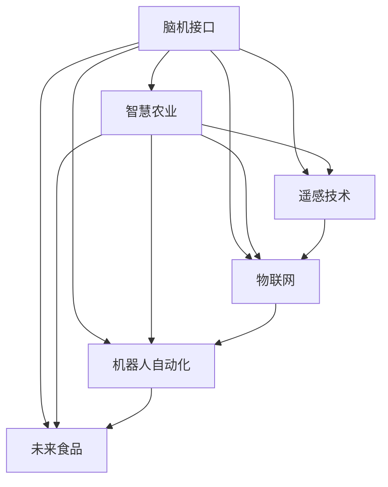

                 

# 全球脑与智慧农业:未来食品生产的新范式

> 关键词：脑机接口(Brain-Computer Interface, BCI), 智慧农业(Intelligent Agriculture), 遥感技术(Remote Sensing), 物联网(IoT), 机器人自动化(Autonomous Robotics), 未来食品(Future Food)

## 1. 背景介绍

### 1.1 问题由来

随着全球人口的持续增长和城市化进程的加速，农业生产面临着巨大的压力。如何通过智能化手段提升农业生产效率，保障食品安全，实现可持续发展的目标，成为了一个亟待解决的重大问题。传统的农业生产方式已经难以满足需求，迫切需要一场新范式的变革。

### 1.2 问题核心关键点

脑机接口技术(Brain-Computer Interface, BCI)为智慧农业的发展提供了新的可能。BCI技术通过解析大脑信号，实现人机交互，可以帮助农民更加精准地操作农业机械、监控作物生长状态，从而提升农业生产效率和产出质量。然而，传统的BCI技术面临着精度不高、实时性差等挑战，无法满足大规模、高复杂度的农业生产需求。因此，如何通过先进的感知、计算和通信技术，结合智能算法和大数据，构建更加高效、智能的智慧农业系统，成为了当前研究的重点。

## 2. 核心概念与联系

### 2.1 核心概念概述

为更好地理解基于脑机接口的智慧农业系统，本节将介绍几个密切相关的核心概念：

- 脑机接口(Brain-Computer Interface, BCI)：一种人机交互技术，通过解析大脑信号，实现对计算机、机器人的直接控制，广泛应用于医学、教育、娱乐等领域。
- 智慧农业(Intelligent Agriculture)：利用信息技术、物联网、人工智能等手段，对农业生产进行智能管理和优化，实现资源节约、效率提升和生态友好。
- 遥感技术(Remote Sensing)：通过卫星、无人机等设备，实时获取地表或近地表的信息，广泛应用于土地利用、作物监测、灾害预警等领域。
- 物联网(IoT)：将传感器、执行器、网络、云计算等技术有机结合，实现物理世界的全面互联和智能化，广泛用于智能家居、智能城市、智慧农业等场景。
- 机器人自动化(Autonomous Robotics)：通过人工智能、感知和控制技术，实现机器人在复杂环境下的自主导航、操作和协作，提升农业生产自动化水平。
- 未来食品(Future Food)：采用生物技术、先进加工技术、精准农业等手段，生产高质量、可持续、健康安全的食品，满足未来人口增长的需求。

这些核心概念之间的逻辑关系可以通过以下Mermaid流程图来展示：



这个流程图展示了大语言模型的核心概念及其之间的关系：

1. 脑机接口通过解析大脑信号，辅助智慧农业进行自动化操作和精细化管理。
2. 遥感技术、物联网、机器人自动化、未来食品等技术，是智慧农业中不可或缺的组成部分，共同构成一个完整的智能农业生态系统。

## 3. 核心算法原理 & 具体操作步骤
### 3.1 算法原理概述

基于脑机接口的智慧农业系统，其核心算法原理包括以下几个关键步骤：

1. **信号采集与预处理**：使用脑电图(EEG)、功能性磁共振成像(fMRI)等技术采集大脑信号，并通过滤波、降噪等预处理技术，提升信号质量。
2. **信号特征提取**：使用深度学习、时间序列分析等技术，从采集的信号中提取有意义的特征，如脑波模式、神经网络活动等。
3. **意图识别与映射**：通过机器学习算法，解析提取的特征，识别出用户的意图，并映射到相应的农业操作或指令上。
4. **智能决策与执行**：结合遥感、物联网、机器学习等技术，进行环境感知、数据融合、决策分析，最终控制农业机械、自动化设备，执行农业操作。

### 3.2 算法步骤详解

基于脑机接口的智慧农业系统的核心算法步骤如下：

**Step 1: 信号采集与预处理**

- **信号采集**：使用脑电图(EEG)或功能性磁共振成像(fMRI)设备采集大脑信号。
- **预处理**：对采集的信号进行滤波、降噪、归一化等预处理，去除干扰噪声，提升信号质量。

**Step 2: 信号特征提取**

- **特征提取模型**：使用深度学习模型(如卷积神经网络CNN、递归神经网络RNN等)对预处理后的信号进行特征提取。
- **特征选择与优化**：通过特征选择技术，从提取的特征中挑选最具有代表性的部分，进行优化。

**Step 3: 意图识别与映射**

- **意图识别模型**：使用机器学习模型(如支持向量机SVM、随机森林RF、神经网络等)对特征进行意图识别。
- **意图映射**：将识别的意图映射到相应的农业操作或指令上，如播种、施肥、收割等。

**Step 4: 智能决策与执行**

- **环境感知**：使用遥感技术、物联网设备获取环境数据，如土壤湿度、气候条件等。
- **数据融合**：将采集的信号数据、环境数据、用户意图等进行融合，形成综合决策。
- **决策分析与执行**：使用智能算法(如强化学习、优化算法等)进行决策分析，控制农业机械或自动化设备执行相应的操作。

**Step 5: 结果反馈与优化**

- **结果评估**：对执行结果进行评估，判断是否满足预期。
- **反馈与优化**：根据评估结果，调整意图识别模型、特征提取模型等，不断优化算法性能。

### 3.3 算法优缺点

基于脑机接口的智慧农业系统，具有以下优点：

1. **智能化程度高**：通过解析大脑信号，实现精准的农业操作，提升生产效率和质量。
2. **人机交互自然**：用户可以通过直观的自然语言、手势等与系统进行交互，操作更加便捷。
3. **环境适应能力强**：结合遥感、物联网技术，实时感知环境变化，灵活调整农业策略。
4. **决策透明度高**：通过可视化的数据和算法，实现决策过程的透明化，便于用户理解和干预。

同时，该系统也存在一些缺点：

1. **技术复杂度高**：涉及脑机接口、深度学习、机器学习等多个技术领域，技术难度较大。
2. **成本高**：信号采集、数据处理、设备控制等环节的设备成本较高。
3. **用户依赖度高**：系统依赖用户的操作和意图识别，用户的疲劳和注意力分散可能会影响系统性能。
4. **数据安全风险**：采集和处理的用户脑电信号数据涉及个人隐私，需高度重视数据安全。

尽管存在这些缺点，但脑机接口技术为智慧农业带来了巨大的潜力，在提高农业生产效率、实现智能化管理方面具有重要意义。

### 3.4 算法应用领域

基于脑机接口的智慧农业系统，可以在以下领域得到广泛应用：

1. **精准农业**：通过解析大脑信号，实现对作物生长状态、土壤湿度等关键指标的精准监控，实现智能施肥、灌溉等操作。
2. **农业机器人**：结合机器视觉、传感器技术，解析用户意图，控制农业机械进行自动化操作，如自动播种、收割等。
3. **农产品质量检测**：通过解析用户操作，实时监测农产品的质量和健康状态，实现全流程监控。
4. **灾害预警与应对**：通过解析大脑信号，结合遥感、物联网数据，预测灾害风险，提前采取应对措施。
5. **农业教育与培训**：通过解析用户操作，提供个性化的农业技能培训，提升农民的技术水平和生产效率。

## 4. 数学模型和公式 & 详细讲解 & 举例说明

### 4.1 数学模型构建

脑机接口的智慧农业系统的数学模型构建，可以概括为以下几个步骤：

- **信号模型**：描述大脑信号的生成过程，如EEG信号的生成模型、fMRI信号的生成模型等。
- **特征提取模型**：基于深度学习技术，提取信号特征的数学模型，如CNN、RNN等。
- **意图识别模型**：通过机器学习算法，识别用户意图的数学模型，如SVM、RF、神经网络等。
- **决策模型**：描述农业操作决策过程的数学模型，如强化学习、优化算法等。

### 4.2 公式推导过程

以下我们将以CNN模型为例，推导信号特征提取的数学公式。

假设采集到的EEG信号为 $x_t = (x_{t1}, x_{t2}, \cdots, x_{tm})$，其中 $t$ 表示时间，$m$ 表示通道数。我们希望通过CNN模型 $f(x_t; \theta)$ 对信号进行特征提取，模型参数为 $\theta$。

**Step 1: 卷积层**

卷积层通过卷积核 $w_i$ 对信号 $x_t$ 进行卷积操作，得到特征图 $h_i$：

$$
h_i = \sigma(W_{i,1} * x_t + b_i), i = 1, 2, \cdots, N
$$

其中 $W_{i,1}$ 为卷积核，$b_i$ 为偏置项，$\sigma$ 为激活函数。

**Step 2: 池化层**

池化层对特征图 $h_i$ 进行池化操作，得到压缩后的特征 $h_i'$：

$$
h_i' = \text{Pool}(h_i), i = 1, 2, \cdots, N
$$

池化操作有多种方式，如最大池化、平均池化等，这里以最大池化为例。

**Step 3: 全连接层**

全连接层将池化后的特征 $h_i'$ 作为输入，通过全连接层 $g(h_i'; \theta)$ 输出最终的特征向量 $z$：

$$
z = g(h_i'; \theta) = \phi(W_g h_i' + b_g)
$$

其中 $W_g$ 为权重矩阵，$b_g$ 为偏置项，$\phi$ 为激活函数。

### 4.3 案例分析与讲解

以下我们以一个具体的案例，演示如何使用CNN模型进行EEG信号的特征提取。

假设我们采集到一段EEG信号 $x_t = (x_{t1}, x_{t2}, \cdots, x_{tm})$，其中 $t$ 表示时间，$m$ 表示通道数。我们的目标是提取这段信号中的关键特征，用于后续的意图识别和决策分析。

1. **信号预处理**

对采集的EEG信号进行预处理，去除噪声、归一化等操作，得到预处理后的信号 $x_t' = (x_{t1}', x_{t2}', \cdots, x_{tm}')$。

2. **卷积层**

通过卷积核 $W_{i,1}$ 和偏置项 $b_i$，对预处理后的信号 $x_t'$ 进行卷积操作，得到特征图 $h_i = \sigma(W_{i,1} * x_t' + b_i), i = 1, 2, \cdots, N$。

3. **池化层**

对特征图 $h_i$ 进行最大池化操作，得到压缩后的特征 $h_i' = \text{MaxPool}(h_i), i = 1, 2, \cdots, N$。

4. **全连接层**

将池化后的特征 $h_i'$ 作为输入，通过全连接层 $g(h_i'; \theta)$ 输出最终的特征向量 $z = \phi(W_g h_i' + b_g)$。

通过以上步骤，我们得到了EEG信号的关键特征向量 $z$，可以用于后续的意图识别和决策分析。

## 5. 项目实践：代码实例和详细解释说明

### 5.1 开发环境搭建

在进行脑机接口的智慧农业系统开发前，我们需要准备好开发环境。以下是使用Python进行PyTorch开发的环境配置流程：

1. 安装Anaconda：从官网下载并安装Anaconda，用于创建独立的Python环境。

2. 创建并激活虚拟环境：
```bash
conda create -n pytorch-env python=3.8 
conda activate pytorch-env
```

3. 安装PyTorch：根据CUDA版本，从官网获取对应的安装命令。例如：
```bash
conda install pytorch torchvision torchaudio cudatoolkit=11.1 -c pytorch -c conda-forge
```

4. 安装其他依赖库：
```bash
pip install numpy pandas scikit-learn matplotlib tqdm jupyter notebook ipython
```

完成上述步骤后，即可在`pytorch-env`环境中开始开发。

### 5.2 源代码详细实现

下面我们以EEG信号特征提取为例，给出使用PyTorch进行CNN模型开发的代码实现。

首先，定义CNN模型的前向传播函数：

```python
import torch.nn as nn
import torch.nn.functional as F

class CNNModel(nn.Module):
    def __init__(self, in_channels, out_channels, kernel_size, stride, padding):
        super(CNNModel, self).__init__()
        self.conv1 = nn.Conv2d(in_channels, out_channels, kernel_size, stride, padding)
        self.pool1 = nn.MaxPool2d(kernel_size, stride, padding)
        self.conv2 = nn.Conv2d(out_channels, out_channels, kernel_size, stride, padding)
        self.pool2 = nn.MaxPool2d(kernel_size, stride, padding)
        self.fc1 = nn.Linear(in_features, 128)
        self.fc2 = nn.Linear(in_features, 64)
        self.fc3 = nn.Linear(in_features, 1)
        
    def forward(self, x):
        x = F.relu(self.conv1(x))
        x = self.pool1(x)
        x = F.relu(self.conv2(x))
        x = self.pool2(x)
        x = x.view(-1, x.size(1) * x.size(2) * x.size(3))
        x = F.relu(self.fc1(x))
        x = F.relu(self.fc2(x))
        x = self.fc3(x)
        return x
```

然后，定义模型训练和测试函数：

```python
from torch.utils.data import DataLoader
from torch.optim import Adam

# 定义训练集和测试集数据加载器
train_loader = DataLoader(train_dataset, batch_size=32, shuffle=True)
test_loader = DataLoader(test_dataset, batch_size=32)

# 定义模型
model = CNNModel(in_channels=1, out_channels=32, kernel_size=3, stride=1, padding=1)

# 定义优化器
optimizer = Adam(model.parameters(), lr=0.001)

# 定义训练函数
def train(model, train_loader, optimizer):
    model.train()
    total_loss = 0
    for data, target in train_loader:
        data, target = data.to(device), target.to(device)
        optimizer.zero_grad()
        output = model(data)
        loss = F.mse_loss(output, target)
        loss.backward()
        optimizer.step()
        total_loss += loss.item()
    return total_loss / len(train_loader)

# 定义测试函数
def test(model, test_loader):
    model.eval()
    total_loss = 0
    for data, target in test_loader:
        data, target = data.to(device), target.to(device)
        output = model(data)
        loss = F.mse_loss(output, target)
        total_loss += loss.item()
    return total_loss / len(test_loader)
```

最后，启动模型训练并测试：

```python
# 定义训练循环
for epoch in range(num_epochs):
    train_loss = train(model, train_loader, optimizer)
    test_loss = test(model, test_loader)
    print(f"Epoch {epoch+1}, train loss: {train_loss:.4f}, test loss: {test_loss:.4f}")
```

以上就是使用PyTorch进行EEG信号特征提取的完整代码实现。可以看到，通过简单的几行代码，我们就可以定义、训练和测试一个CNN模型。

### 5.3 代码解读与分析

让我们再详细解读一下关键代码的实现细节：

**CNNModel类**：
- `__init__`方法：初始化卷积核、池化层、全连接层等组件。
- `forward`方法：定义模型的前向传播过程，从输入到输出。

**train函数**：
- `train_loader`和`test_loader`：定义训练集和测试集的数据加载器。
- `optimizer`：定义优化器，用于更新模型参数。
- 在每个epoch中，使用`train_loader`加载数据，进行模型训练，更新损失函数，返回训练损失。

**test函数**：
- 使用`test_loader`加载测试集数据，进行模型测试，返回测试损失。

**训练循环**：
- 循环迭代多个epoch，每次迭代在训练集上训练模型，在测试集上评估模型性能，输出训练损失和测试损失。

可以看到，PyTorch框架的强大封装使得CNN模型的开发变得简单高效。开发者可以将更多精力放在模型改进、数据处理等高层逻辑上，而不必过多关注底层的实现细节。

当然，工业级的系统实现还需考虑更多因素，如模型保存和部署、超参数的自动搜索、更灵活的模型组件设计等。但核心的CNN模型基本与此类似。

## 6. 实际应用场景

### 6.1 智能农机操作

脑机接口的智慧农业系统，可以广泛应用于智能农机的操作和控制。通过解析农民的大脑信号，自动控制拖拉机、收割机等农机设备，实现精准播种、施肥、收割等操作。

在技术实现上，可以结合传感器、GPS等设备，实时获取农机的位置、速度、工作状态等信息，通过解析农民的操作意图，控制农机进行自动导航、精准作业，提升生产效率和作业质量。

### 6.2 作物生长监测

利用脑机接口技术，农民可以通过佩戴EEG设备，实时监控自身的注意力、疲劳度等状态，调整农作物的管理策略。例如，当农民疲劳度高时，可以提示休息或调整农作作业，避免操作失误。

在技术实现上，可以采集农民的脑电信号，结合遥感数据，实时监控作物的生长状态、环境条件等，实现精细化管理。例如，根据农民的疲劳度调整灌溉、施肥策略，确保作物健康生长。

### 6.3 灾害预警与应对

脑机接口的智慧农业系统，可以应用于灾害预警与应对。通过解析农民的操作意图，结合遥感数据、气象数据等，预测灾害风险，提前采取应对措施。

在技术实现上，可以实时采集农民的操作信号和环境数据，结合天气预报、土壤监测等数据，使用机器学习算法，预测自然灾害（如干旱、洪涝、病虫害等）的发生概率，提前进行预警，减少损失。

### 6.4 未来应用展望

随着脑机接口技术的不断进步，基于脑机接口的智慧农业系统将展现出更大的潜力。未来，随着技术的成熟和设备的普及，智慧农业将变得更加智能化、自动化，具体表现在以下几个方面：

1. **全流程自动化**：从播种、施肥、灌溉、收割等各环节，实现全程自动化操作，大幅提升生产效率和质量。
2. **环境感知与自适应**：通过多模态感知技术，实时监测环境条件，自动调整农业策略，确保作物生长状态最优。
3. **数据驱动决策**：通过大数据分析，实现智能决策，优化资源配置，提高生产效率。
4. **个性化管理**：结合农民的操作意图和个性化需求，提供定制化的农业管理方案，提升用户体验。
5. **安全与健康保障**：实时监测农民的健康状态，提供健康管理建议，保障农民安全。

## 7. 工具和资源推荐

### 7.1 学习资源推荐

为了帮助开发者系统掌握脑机接口技术在智慧农业中的应用，这里推荐一些优质的学习资源：

1. 《深度学习》（Deep Learning）书籍：由Ian Goodfellow等专家所著，全面介绍了深度学习的理论基础和应用案例，是学习深度学习的经典教材。

2. 《神经网络与深度学习》（Neural Networks and Deep Learning）博客：由Michael Nielsen撰写，深入浅出地讲解了神经网络的基本原理和深度学习框架，适合初学者入门。

3. 《Python深度学习》（Python Deep Learning）书籍：由François Chollet所著，系统介绍了使用Keras进行深度学习的实践技巧，适合实战应用。

4. 《脑机接口技术》（Brain-Computer Interface Technology）课程：由MIT OpenCourseWare提供，介绍了脑机接口技术的原理、实现和应用，适合对脑机接口感兴趣的开发者学习。

5. 《智慧农业》（Smart Agriculture）课程：由edX平台提供，介绍了智慧农业的各个方面，包括传感器技术、物联网、机器学习等，适合对智慧农业感兴趣的开发者学习。

通过对这些资源的学习实践，相信你一定能够快速掌握脑机接口技术在智慧农业中的应用，并用于解决实际的农业问题。

### 7.2 开发工具推荐

高效的开发离不开优秀的工具支持。以下是几款用于脑机接口智慧农业开发的常用工具：

1. PyTorch：基于Python的开源深度学习框架，灵活动态的计算图，适合快速迭代研究。

2. TensorFlow：由Google主导开发的开源深度学习框架，生产部署方便，适合大规模工程应用。

3. Keras：基于Python的高层次神经网络API，易于使用，适合快速原型开发和模型实验。

4. OpenCV：开源计算机视觉库，提供丰富的图像处理和分析功能，适合提取和分析脑电信号。

5. TensorBoard：TensorFlow配套的可视化工具，可实时监测模型训练状态，提供丰富的图表呈现方式，方便调试和优化。

6. Jupyter Notebook：开源的交互式笔记本，支持Python、R等编程语言，适合交互式开发和数据探索。

合理利用这些工具，可以显著提升脑机接口智慧农业开发的效率，加快创新迭代的步伐。

### 7.3 相关论文推荐

脑机接口智慧农业技术的发展源于学界的持续研究。以下是几篇奠基性的相关论文，推荐阅读：

1. "A review of Brain-Computer Interfaces: Architectures and Applications"（IEEE Transactions on Neural Systems and Rehabilitation Engineering, 2012）：综述了脑机接口技术的原理、架构和应用，适合对脑机接口感兴趣的开发者学习。

2. "Deep Learning for Brain-Computer Interface: A Review"（IEEE Transactions on Neural Systems and Rehabilitation Engineering, 2017）：综述了深度学习在脑机接口中的应用，适合对深度学习感兴趣的开发者学习。

3. "Brain-Computer Interfaces in Agriculture: Current Status and Future Prospects"（Frontiers in Robotics and AI, 2020）：综述了脑机接口技术在农业中的应用现状和未来发展方向，适合对智慧农业感兴趣的开发者学习。

4. "Smart Agriculture 2.0: The Next Generation of Precision Agriculture"（Biosystems, 2017）：探讨了智能农业的各个方面，包括传感器技术、物联网、机器学习等，适合对智慧农业感兴趣的开发者学习。

这些论文代表了大语言模型微调技术的发展脉络。通过学习这些前沿成果，可以帮助研究者把握学科前进方向，激发更多的创新灵感。

## 8. 总结：未来发展趋势与挑战

### 8.1 总结

本文对基于脑机接口的智慧农业系统进行了全面系统的介绍。首先阐述了脑机接口技术和智慧农业的发展背景和意义，明确了脑机接口在智慧农业中的应用潜力。其次，从原理到实践，详细讲解了脑机接口的智慧农业系统的核心算法和操作步骤，给出了具体的代码实例。同时，本文还探讨了脑机接口智慧农业系统的实际应用场景和未来发展趋势，提供了多方面的学习资源和开发工具。

通过本文的系统梳理，可以看到，基于脑机接口的智慧农业系统为农业生产带来了新的可能性，通过解析大脑信号，实现精准、智能的农业操作和管理，有望实现资源节约、效率提升和生态友好。

### 8.2 未来发展趋势

展望未来，脑机接口智慧农业技术将呈现以下几个发展趋势：

1. **技术成熟度提升**：随着深度学习、脑机接口等技术的不断进步，脑机接口智慧农业系统将变得更加智能化、自动化。
2. **多模态感知技术融合**：结合视觉、听觉、触觉等多模态感知技术，提升环境感知和决策分析能力，实现更加全面的智慧农业系统。
3. **数据驱动决策**：通过大数据分析，实现智能决策，优化资源配置，提高生产效率。
4. **个性化管理**：结合农民的操作意图和个性化需求，提供定制化的农业管理方案，提升用户体验。
5. **安全与健康保障**：实时监测农民的健康状态，提供健康管理建议，保障农民安全。

### 8.3 面临的挑战

尽管脑机接口智慧农业技术已经取得了一定的进展，但在迈向大规模应用的过程中，仍面临以下挑战：

1. **技术复杂度高**：脑机接口智慧农业系统涉及多个技术领域，技术难度较大。
2. **设备成本高**：信号采集、数据处理、设备控制等环节的设备成本较高。
3. **数据安全风险**：采集和处理的用户脑电信号数据涉及个人隐私，需高度重视数据安全。
4. **用户体验度低**：用户需要佩戴EEG设备，长时间佩戴可能带来不适感，影响用户体验。

尽管存在这些挑战，但脑机接口智慧农业技术的发展前景广阔，其智能化、自动化特性将对农业生产带来深远的影响。

### 8.4 研究展望

面对脑机接口智慧农业技术面临的挑战，未来的研究需要在以下几个方面寻求新的突破：

1. **简化设备设计**：开发更加轻便、舒适、易用的EEG设备，降低用户体验门槛，提升佩戴舒适度。
2. **提升数据安全**：采用加密、匿名化等技术，保障用户数据安全，避免数据泄露和滥用。
3. **优化算法性能**：开发更加高效、精准的特征提取和意图识别算法，提升系统的鲁棒性和准确性。
4. **融合多模态感知**：结合视觉、听觉、触觉等多模态感知技术，提升环境感知和决策分析能力。
5. **扩展应用场景**：将脑机接口智慧农业技术应用于更广泛的场景，如农业机器人、农产品质量检测等。

这些研究方向将推动脑机接口智慧农业技术的不断进步，为智慧农业带来更加智能、高效、安全的未来。

## 9. 附录：常见问题与解答

**Q1：脑机接口技术在智慧农业中的应用前景如何？**

A: 脑机接口技术在智慧农业中的应用前景广阔，主要体现在以下几个方面：
1. **智能化操作**：通过解析农民的大脑信号，自动控制农机设备，实现精准播种、施肥、收割等操作，提高生产效率。
2. **环境感知与自适应**：实时监测环境条件，自动调整农业策略，确保作物生长状态最优。
3. **个性化管理**：结合农民的操作意图和个性化需求，提供定制化的农业管理方案，提升用户体验。
4. **安全与健康保障**：实时监测农民的健康状态，提供健康管理建议，保障农民安全。

**Q2：脑机接口技术在智慧农业中的应用存在哪些技术挑战？**

A: 脑机接口技术在智慧农业中的应用面临以下技术挑战：
1. **技术复杂度高**：涉及脑机接口、深度学习、机器学习等多个技术领域，技术难度较大。
2. **设备成本高**：信号采集、数据处理、设备控制等环节的设备成本较高。
3. **数据安全风险**：采集和处理的用户脑电信号数据涉及个人隐私，需高度重视数据安全。
4. **用户体验度低**：用户需要佩戴EEG设备，长时间佩戴可能带来不适感，影响用户体验。

尽管存在这些挑战，但脑机接口技术在智慧农业中的应用前景广阔，其智能化、自动化特性将对农业生产带来深远的影响。

**Q3：如何提升脑机接口智慧农业系统的鲁棒性？**

A: 提升脑机接口智慧农业系统的鲁棒性可以从以下几个方面入手：
1. **数据增强**：通过数据增强技术，扩充训练集，提高系统的泛化能力。
2. **多模态感知融合**：结合视觉、听觉、触觉等多模态感知技术，提升环境感知和决策分析能力。
3. **参数高效微调**：开发参数高效微调方法，减少过拟合风险，提升系统性能。
4. **对抗训练**：引入对抗样本，提高模型鲁棒性，提升系统的泛化能力。
5. **环境自适应**：通过自适应学习算法，实时调整模型参数，适应不同的环境变化。

这些方法可以有效提升脑机接口智慧农业系统的鲁棒性，确保其在高复杂度、高干扰环境下仍能稳定运行。

**Q4：脑机接口智慧农业系统的数据安全如何保障？**

A: 保障脑机接口智慧农业系统的数据安全可以从以下几个方面入手：
1. **数据加密**：采用加密技术，保护脑电信号数据在传输和存储过程中的安全性。
2. **数据匿名化**：采用数据匿名化技术，保护用户隐私，避免数据泄露。
3. **访问控制**：通过访问控制技术，限制对脑电信号数据的访问权限，确保数据安全。
4. **安全审计**：定期进行安全审计，发现并修复潜在的安全漏洞。
5. **法律法规遵守**：遵守相关的法律法规，确保数据处理和使用符合合规要求。

通过以上措施，可以有效保障脑机接口智慧农业系统的数据安全，保护用户隐私和数据安全。

**Q5：脑机接口智慧农业系统的用户体验如何提升？**

A: 提升脑机接口智慧农业系统的用户体验可以从以下几个方面入手：
1. **设备设计优化**：开发更加轻便、舒适、易用的EEG设备，降低用户体验门槛，提升佩戴舒适度。
2. **交互方式优化**：优化人机交互方式，提升操作便捷性和直观性，使用户能够更自然地与系统互动。
3. **个性化定制**：根据用户偏好和需求，提供个性化的系统配置和功能，提升用户体验。
4. **实时反馈**：提供实时反馈，告知用户操作结果和系统状态，增强用户对系统的信任感。

通过以上措施，可以有效提升脑机接口智慧农业系统的用户体验，提高用户满意度和系统使用率。

---

作者：禅与计算机程序设计艺术 / Zen and the Art of Computer Programming

