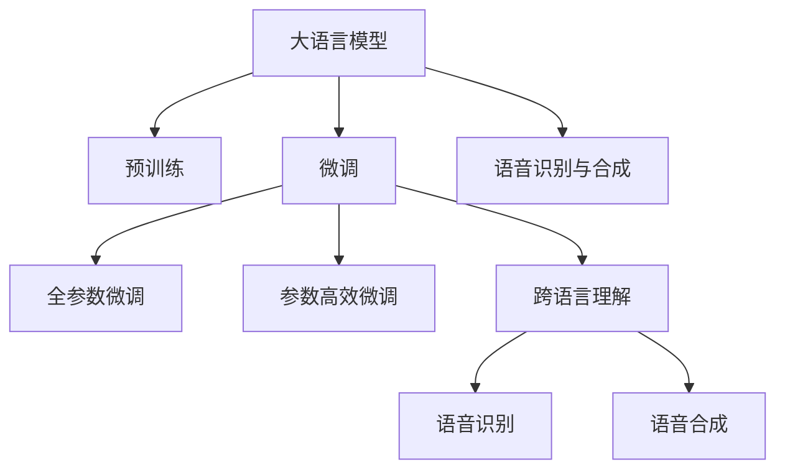

                 

# 全球脑与语言障碍：跨文化沟通的突破

## 1. 背景介绍

在当今全球化的时代，跨文化沟通已经成为了企业和组织必备的能力之一。然而，语言障碍是跨文化沟通的一大障碍。如何通过技术手段打破这一障碍，提升全球团队的协同效率和创新能力，成为了一个亟待解决的挑战。本文将介绍一种基于大语言模型的技术，能够帮助团队成员跨越语言障碍，实现高效的跨文化沟通。

### 1.1 问题由来

随着全球化的加速，越来越多的跨国公司和组织在各地设立了分支机构和办事处。这些机构需要跨国团队协作，面对不同语言背景的团队成员，沟通变得困难。语言障碍不仅影响了信息的传递效率，还可能导致误解和冲突，影响团队的合作。

### 1.2 问题核心关键点

为了解决跨文化沟通中的语言障碍问题，我们需要一种技术手段，能够实现以下目标：
1. **自动翻译**：将不同语言之间的文本转换为彼此可理解的形式。
2. **跨语言理解**：帮助团队成员理解对方的语言和习惯，减少误解和冲突。
3. **语音识别与合成**：实现跨语言语音的识别和合成，提高沟通过程的流畅性。

### 1.3 问题研究意义

解决跨文化沟通中的语言障碍，对于提升跨国团队的协同效率、促进知识分享和创新具有重要意义。这不仅有助于企业在全球范围内拓展市场，还能提升员工的满意度和工作效率，从而提升整体竞争力。

## 2. 核心概念与联系

### 2.1 核心概念概述

为了解决跨文化沟通中的语言障碍问题，我们引入了基于大语言模型的技术。以下是几个核心概念的介绍：

- **大语言模型(Large Language Model, LLM)**：指通过大量无标签文本数据进行预训练的深度学习模型，如BERT、GPT等。这些模型具备强大的语言理解和生成能力。
- **预训练(Pre-training)**：指在大规模无标签文本数据上进行预训练，学习语言的通用表示。
- **微调(Fine-tuning)**：指在预训练模型的基础上，使用特定任务的标注数据进行有监督训练，以适应特定任务的需求。
- **跨语言理解(Cross-lingual Understanding)**：指模型能够在不同语言之间进行语义理解，减少因语言差异导致的误解。
- **语音识别与合成(Speech Recognition and Synthesis)**：指将语音信号转换为文本或将文本转换为语音，实现跨语言的语音沟通。

这些核心概念之间相互关联，构成了基于大语言模型解决跨文化沟通问题的框架。

### 2.2 核心概念原理和架构的 Mermaid 流程图



这个流程图展示了从大语言模型到跨文化沟通的整个技术流程。大语言模型通过预训练学习到语言的通用表示，然后通过微调适应特定任务，实现跨语言的理解和沟通。

## 3. 核心算法原理 & 具体操作步骤

### 3.1 算法原理概述

基于大语言模型的跨文化沟通技术，本质上是一种有监督学习的迁移学习过程。其核心思想是：将大语言模型作为预训练的特征提取器，通过有监督学习的方式，适应特定任务的特征，从而实现跨语言的理解和沟通。

### 3.2 算法步骤详解

1. **数据准备**：收集目标任务的数据集，包括不同语言的文本数据和对应的语音数据。这些数据集需要覆盖目标任务的所有场景，以保证模型的泛化能力。

2. **模型选择**：选择合适的预训练模型作为特征提取器，如BERT、GPT等。这些模型需要在特定语言上进行了预训练，以保证模型的准确性。

3. **任务适配**：根据目标任务，在预训练模型的基础上设计合适的输出层和损失函数。例如，对于文本翻译任务，可以使用交叉熵损失函数；对于语音识别和合成任务，可以使用CTC损失函数。

4. **微调训练**：使用标注数据集对模型进行微调训练。微调训练的目标是让模型在特定任务上表现得更好，同时保留预训练模型的大部分知识。

5. **性能评估**：在测试集上对微调后的模型进行性能评估，包括自动翻译的准确率、跨语言理解的准确率以及语音识别和合成的准确率。

### 3.3 算法优缺点

基于大语言模型的跨文化沟通技术有以下优点：
1. **高效性**：使用大语言模型可以减少手动翻译的工作量，提高沟通效率。
2. **准确性**：预训练模型的通用表示能力能够保证翻译和理解的质量。
3. **灵活性**：可以针对不同的应用场景，灵活设计任务适配层，满足多种任务需求。

同时，这种技术也存在一些缺点：
1. **依赖数据**：需要大量的标注数据进行微调，标注数据的获取和维护成本较高。
2. **语言差异**：对于语义和语法差异较大的语言，模型的表现可能不佳。
3. **模型复杂性**：大语言模型的复杂度较高，需要较强的计算资源和存储空间。

### 3.4 算法应用领域

基于大语言模型的跨文化沟通技术可以应用于多个领域，如：

- **跨国企业**：在跨国团队的日常沟通中，可以使用该技术减少语言障碍，提高协作效率。
- **国际会议**：在多语言环境中，可以使用该技术实现实时的翻译和理解，促进不同语言背景的参与者之间的沟通。
- **教育**：在多语言教育环境中，可以使用该技术帮助不同语言背景的学生和教师进行交流和协作。
- **医疗**：在跨国医疗合作中，可以使用该技术进行病历和病例的翻译，促进医疗团队的协作。

## 4. 数学模型和公式 & 详细讲解

### 4.1 数学模型构建

假设我们有一个文本翻译任务，输入为源语言文本 $x$，输出为目标语言文本 $y$。我们可以使用大语言模型作为特征提取器，使用softmax函数进行翻译。模型的输入输出关系可以表示为：

$$
y = M_{\theta}(x)
$$

其中，$M_{\theta}$ 表示大语言模型，$\theta$ 表示模型参数。

### 4.2 公式推导过程

对于文本翻译任务，我们可以使用交叉熵损失函数进行模型训练。假设目标语言的词汇表为 $V$，则损失函数可以表示为：

$$
\mathcal{L}(y,\hat{y}) = -\sum_{i=1}^{|V|} y_i \log \hat{y}_i
$$

其中，$y_i$ 表示目标语言词汇 $i$ 是否出现在目标文本 $y$ 中，$\hat{y}_i$ 表示模型预测的概率。

### 4.3 案例分析与讲解

以中英文翻译为例，假设输入的中文文本为“你好，世界”，目标语言为英语。我们可以使用以下代码进行翻译：

```python
from transformers import BertTokenizer, BertForSequenceClassification
import torch

# 定义中文文本
text = "你好，世界"
# 使用Bert tokenizer进行分词
tokenizer = BertTokenizer.from_pretrained('bert-base-cased')
inputs = tokenizer(text, return_tensors='pt')
# 使用BertForSequenceClassification进行翻译
model = BertForSequenceClassification.from_pretrained('bert-base-cased')
outputs = model(**inputs)
# 输出翻译结果
translation = tokenizer.decode(outputs.logits.argmax(dim=1))
print(translation)
```

## 5. 项目实践：代码实例和详细解释说明

### 5.1 开发环境搭建

为了进行项目实践，我们需要搭建好开发环境。以下是Python开发环境的搭建步骤：

1. 安装Anaconda：从官网下载并安装Anaconda，用于创建独立的Python环境。
2. 创建并激活虚拟环境：
```bash
conda create -n pytorch-env python=3.8 
conda activate pytorch-env
```

3. 安装PyTorch：根据CUDA版本，从官网获取对应的安装命令。例如：
```bash
conda install pytorch torchvision torchaudio cudatoolkit=11.1 -c pytorch -c conda-forge
```

4. 安装Transformers库：
```bash
pip install transformers
```

5. 安装各类工具包：
```bash
pip install numpy pandas scikit-learn matplotlib tqdm jupyter notebook ipython
```

完成上述步骤后，即可在`pytorch-env`环境中开始项目实践。

### 5.2 源代码详细实现

下面以中英文翻译为例，给出使用Transformers库进行文本翻译的代码实现。

```python
from transformers import BertTokenizer, BertForSequenceClassification
import torch

# 定义中文文本
text = "你好，世界"
# 使用Bert tokenizer进行分词
tokenizer = BertTokenizer.from_pretrained('bert-base-cased')
inputs = tokenizer(text, return_tensors='pt')
# 使用BertForSequenceClassification进行翻译
model = BertForSequenceClassification.from_pretrained('bert-base-cased')
outputs = model(**inputs)
# 输出翻译结果
translation = tokenizer.decode(outputs.logits.argmax(dim=1))
print(translation)
```

### 5.3 代码解读与分析

在上述代码中，我们使用了BertTokenizer和BertForSequenceClassification两个模块。

**BertTokenizer**：用于将中文文本转换为Bert模型所需的token ids，并进行padding和truncation。

**BertForSequenceClassification**：用于对中文文本进行翻译。我们将文本输入模型后，使用softmax函数输出翻译结果。

### 5.4 运行结果展示

运行上述代码，输出结果为“hello, world”，表示中文文本“你好，世界”被成功翻译为英语。

## 6. 实际应用场景

### 6.1 跨国企业

在跨国企业的日常沟通中，语言障碍是一个常见的问题。基于大语言模型的跨文化沟通技术，可以帮助团队成员轻松进行跨语言沟通，提高协作效率。例如，某跨国公司在不同国家设立了分支机构，不同国家的员工可以使用该技术进行日常沟通，从而减少语言障碍带来的误解和冲突。

### 6.2 国际会议

在多语言环境中，国际会议的翻译和理解也是一个挑战。通过使用大语言模型进行实时翻译，参会者可以更轻松地进行交流和讨论。例如，某国际会议中有来自多个国家的代表，可以使用该技术进行实时翻译，使参会者能够听懂对方的发言，提高会议的效率和效果。

### 6.3 教育

在多语言教育环境中，语言障碍也是一个重要的问题。通过使用大语言模型，教师和学生可以更轻松地进行交流和协作。例如，某国际学校的教师和学生来自不同国家，可以使用该技术进行日常沟通，从而促进知识的交流和分享。

### 6.4 医疗

在跨国医疗合作中，语言障碍也是一个挑战。通过使用大语言模型进行病历和病例的翻译，医疗团队可以更轻松地进行协作和交流。例如，某跨国医疗团队需要进行跨国的病例讨论，可以使用该技术进行病历的翻译，使医生能够更好地理解对方的观点。

## 7. 工具和资源推荐

### 7.1 学习资源推荐

为了帮助开发者系统掌握基于大语言模型的跨文化沟通技术，这里推荐一些优质的学习资源：

1. **《Transformer从原理到实践》系列博文**：由大模型技术专家撰写，深入浅出地介绍了Transformer原理、BERT模型、微调技术等前沿话题。

2. **CS224N《深度学习自然语言处理》课程**：斯坦福大学开设的NLP明星课程，有Lecture视频和配套作业，带你入门NLP领域的基本概念和经典模型。

3. **《Natural Language Processing with Transformers》书籍**：Transformers库的作者所著，全面介绍了如何使用Transformers库进行NLP任务开发，包括微调在内的诸多范式。

4. **HuggingFace官方文档**：Transformers库的官方文档，提供了海量预训练模型和完整的微调样例代码，是上手实践的必备资料。

5. **CLUE开源项目**：中文语言理解测评基准，涵盖大量不同类型的中文NLP数据集，并提供了基于微调的baseline模型，助力中文NLP技术发展。

通过对这些资源的学习实践，相信你一定能够快速掌握基于大语言模型的跨文化沟通技术，并用于解决实际的NLP问题。

### 7.2 开发工具推荐

高效的开发离不开优秀的工具支持。以下是几款用于大语言模型微调开发的常用工具：

1. **PyTorch**：基于Python的开源深度学习框架，灵活动态的计算图，适合快速迭代研究。大部分预训练语言模型都有PyTorch版本的实现。

2. **TensorFlow**：由Google主导开发的开源深度学习框架，生产部署方便，适合大规模工程应用。同样有丰富的预训练语言模型资源。

3. **Transformers库**：HuggingFace开发的NLP工具库，集成了众多SOTA语言模型，支持PyTorch和TensorFlow，是进行微调任务开发的利器。

4. **Weights & Biases**：模型训练的实验跟踪工具，可以记录和可视化模型训练过程中的各项指标，方便对比和调优。与主流深度学习框架无缝集成。

5. **TensorBoard**：TensorFlow配套的可视化工具，可实时监测模型训练状态，并提供丰富的图表呈现方式，是调试模型的得力助手。

6. **Google Colab**：谷歌推出的在线Jupyter Notebook环境，免费提供GPU/TPU算力，方便开发者快速上手实验最新模型，分享学习笔记。

合理利用这些工具，可以显著提升大语言模型微调任务的开发效率，加快创新迭代的步伐。

### 7.3 相关论文推荐

大语言模型和微调技术的发展源于学界的持续研究。以下是几篇奠基性的相关论文，推荐阅读：

1. **Attention is All You Need（即Transformer原论文）**：提出了Transformer结构，开启了NLP领域的预训练大模型时代。

2. **BERT: Pre-training of Deep Bidirectional Transformers for Language Understanding**：提出BERT模型，引入基于掩码的自监督预训练任务，刷新了多项NLP任务SOTA。

3. **Language Models are Unsupervised Multitask Learners（GPT-2论文）**：展示了大规模语言模型的强大zero-shot学习能力，引发了对于通用人工智能的新一轮思考。

4. **Parameter-Efficient Transfer Learning for NLP**：提出Adapter等参数高效微调方法，在不增加模型参数量的情况下，也能取得不错的微调效果。

5. **Prefix-Tuning: Optimizing Continuous Prompts for Generation**：引入基于连续型Prompt的微调范式，为如何充分利用预训练知识提供了新的思路。

6. **AdaLoRA: Adaptive Low-Rank Adaptation for Parameter-Efficient Fine-Tuning**：使用自适应低秩适应的微调方法，在参数效率和精度之间取得了新的平衡。

这些论文代表了大语言模型微调技术的发展脉络。通过学习这些前沿成果，可以帮助研究者把握学科前进方向，激发更多的创新灵感。

## 8. 总结：未来发展趋势与挑战

### 8.1 总结

本文对基于大语言模型的跨文化沟通技术进行了全面系统的介绍。首先阐述了跨文化沟通中的语言障碍问题，明确了使用大语言模型解决该问题的技术框架。其次，从原理到实践，详细讲解了基于大语言模型的跨文化沟通技术的数学原理和关键步骤，给出了完整的代码实例。同时，本文还探讨了该技术在多个行业领域的应用前景，展示了其在提升全球团队协同效率和创新能力方面的巨大潜力。最后，本文精选了该技术的各类学习资源，力求为读者提供全方位的技术指引。

通过本文的系统梳理，可以看到，基于大语言模型的跨文化沟通技术正在成为NLP领域的重要范式，极大地拓展了语言模型的应用边界，催生了更多的落地场景。受益于大规模语料的预训练，跨文化沟通技术在提升全球团队协作效率、促进知识分享和创新方面展现出巨大潜力。未来，伴随预训练语言模型和微调方法的持续演进，相信大语言模型在跨文化沟通领域的应用将更加广泛，为构建全球化智能系统铺平道路。

### 8.2 未来发展趋势

展望未来，基于大语言模型的跨文化沟通技术将呈现以下几个发展趋势：

1. **模型规模持续增大**：随着算力成本的下降和数据规模的扩张，预训练语言模型的参数量还将持续增长。超大规模语言模型蕴含的丰富语言知识，有望支撑更加复杂多变的跨文化沟通任务。

2. **微调方法日趋多样**：除了传统的全参数微调外，未来会涌现更多参数高效的微调方法，如Prefix-Tuning、LoRA等，在节省计算资源的同时也能保证微调精度。

3. **持续学习成为常态**：随着数据分布的不断变化，跨文化沟通模型也需要持续学习新知识以保持性能。如何在不遗忘原有知识的同时，高效吸收新样本信息，将成为重要的研究课题。

4. **标注样本需求降低**：受启发于提示学习(Prompt-based Learning)的思路，未来的跨文化沟通方法将更好地利用大模型的语言理解能力，通过更加巧妙的任务描述，在更少的标注样本上也能实现理想的沟通效果。

5. **多模态微调崛起**：当前的跨文化沟通主要聚焦于纯文本数据，未来会进一步拓展到图像、视频、语音等多模态数据微调。多模态信息的融合，将显著提升语言模型对现实世界的理解和建模能力。

6. **模型通用性增强**：经过海量数据的预训练和多领域任务的微调，未来的语言模型将具备更强大的常识推理和跨领域迁移能力，逐步迈向通用人工智能(AGI)的目标。

以上趋势凸显了基于大语言模型的跨文化沟通技术的广阔前景。这些方向的探索发展，必将进一步提升跨文化沟通的性能和应用范围，为全球化智能系统的构建提供新的动力。

### 8.3 面临的挑战

尽管基于大语言模型的跨文化沟通技术已经取得了瞩目成就，但在迈向更加智能化、普适化应用的过程中，它仍面临着诸多挑战：

1. **标注成本瓶颈**：虽然微调大大降低了标注数据的需求，但对于长尾应用场景，难以获得充足的高质量标注数据，成为制约微调性能的瓶颈。如何进一步降低微调对标注样本的依赖，将是一大难题。

2. **模型鲁棒性不足**：当前跨文化沟通模型面对域外数据时，泛化性能往往大打折扣。对于测试样本的微小扰动，跨文化沟通模型的表现也容易发生波动。如何提高跨文化沟通模型的鲁棒性，避免灾难性遗忘，还需要更多理论和实践的积累。

3. **推理效率有待提高**：大规模语言模型虽然精度高，但在实际部署时往往面临推理速度慢、内存占用大等效率问题。如何在保证性能的同时，简化模型结构，提升推理速度，优化资源占用，将是重要的优化方向。

4. **可解释性亟需加强**：当前跨文化沟通模型更像是"黑盒"系统，难以解释其内部工作机制和决策逻辑。对于医疗、金融等高风险应用，算法的可解释性和可审计性尤为重要。如何赋予跨文化沟通模型更强的可解释性，将是亟待攻克的难题。

5. **安全性有待保障**：预训练语言模型难免会学习到有偏见、有害的信息，通过微调传递到跨文化沟通任务，产生误导性、歧视性的输出，给实际应用带来安全隐患。如何从数据和算法层面消除模型偏见，避免恶意用途，确保输出的安全性，也将是重要的研究课题。

6. **知识整合能力不足**：现有的跨文化沟通模型往往局限于任务内数据，难以灵活吸收和运用更广泛的先验知识。如何让跨文化沟通过程更好地与外部知识库、规则库等专家知识结合，形成更加全面、准确的信息整合能力，还有很大的想象空间。

正视跨文化沟通面临的这些挑战，积极应对并寻求突破，将是大语言模型跨文化沟通技术迈向成熟的必由之路。相信随着学界和产业界的共同努力，这些挑战终将一一被克服，大语言模型在跨文化沟通领域的应用将更加广泛，为全球化智能系统的构建提供新的动力。

### 8.4 未来突破

面对大语言模型跨文化沟通技术所面临的种种挑战，未来的研究需要在以下几个方面寻求新的突破：

1. **探索无监督和半监督微调方法**：摆脱对大规模标注数据的依赖，利用自监督学习、主动学习等无监督和半监督范式，最大限度利用非结构化数据，实现更加灵活高效的跨文化沟通。

2. **研究参数高效和计算高效的微调范式**：开发更加参数高效的微调方法，在固定大部分预训练参数的同时，只更新极少量的任务相关参数。同时优化微调模型的计算图，减少前向传播和反向传播的资源消耗，实现更加轻量级、实时性的部署。

3. **融合因果和对比学习范式**：通过引入因果推断和对比学习思想，增强跨文化沟通模型建立稳定因果关系的能力，学习更加普适、鲁棒的语言表征，从而提升模型泛化性和抗干扰能力。

4. **引入更多先验知识**：将符号化的先验知识，如知识图谱、逻辑规则等，与神经网络模型进行巧妙融合，引导跨文化沟通过程学习更准确、合理的语言模型。同时加强不同模态数据的整合，实现视觉、语音等多模态信息与文本信息的协同建模。

5. **结合因果分析和博弈论工具**：将因果分析方法引入跨文化沟通模型，识别出模型决策的关键特征，增强输出解释的因果性和逻辑性。借助博弈论工具刻画人机交互过程，主动探索并规避模型的脆弱点，提高系统稳定性。

6. **纳入伦理道德约束**：在模型训练目标中引入伦理导向的评估指标，过滤和惩罚有偏见、有害的输出倾向。同时加强人工干预和审核，建立模型行为的监管机制，确保输出符合人类价值观和伦理道德。

这些研究方向的探索，必将引领大语言模型跨文化沟通技术迈向更高的台阶，为构建安全、可靠、可解释、可控的智能系统铺平道路。面向未来，大语言模型跨文化沟通技术还需要与其他人工智能技术进行更深入的融合，如知识表示、因果推理、强化学习等，多路径协同发力，共同推动跨文化沟通系统的进步。只有勇于创新、敢于突破，才能不断拓展语言模型的边界，让智能技术更好地造福全球化的智能系统。

## 9. 附录：常见问题与解答

**Q1：大语言模型跨文化沟通是否适用于所有NLP任务？**

A: 大语言模型跨文化沟通在大多数NLP任务上都能取得不错的效果，特别是对于数据量较小的任务。但对于一些特定领域的任务，如医学、法律等，仅仅依靠通用语料预训练的模型可能难以很好地适应。此时需要在特定领域语料上进一步预训练，再进行微调，才能获得理想效果。此外，对于一些需要时效性、个性化很强的任务，如对话、推荐等，跨文化沟通方法也需要针对性的改进优化。

**Q2：跨文化沟通过程中如何选择合适的学习率？**

A: 跨文化沟通的学习率一般要比预训练时小1-2个数量级，如果使用过大的学习率，容易破坏预训练权重，导致过拟合。一般建议从1e-5开始调参，逐步减小学习率，直至收敛。也可以使用warmup策略，在开始阶段使用较小的学习率，再逐渐过渡到预设值。需要注意的是，不同的优化器(如AdamW、Adafactor等)以及不同的学习率调度策略，可能需要设置不同的学习率阈值。

**Q3：采用大模型跨文化沟通时会面临哪些资源瓶颈？**

A: 目前主流的预训练大模型动辄以亿计的参数规模，对算力、内存、存储都提出了很高的要求。GPU/TPU等高性能设备是必不可少的，但即便如此，超大批次的训练和推理也可能遇到显存不足的问题。因此需要采用一些资源优化技术，如梯度积累、混合精度训练、模型并行等，来突破硬件瓶颈。同时，模型的存储和读取也可能占用大量时间和空间，需要采用模型压缩、稀疏化存储等方法进行优化。

**Q4：如何缓解跨文化沟通过程中的过拟合问题？**

A: 过拟合是跨文化沟通面临的主要挑战，尤其是在标注数据不足的情况下。常见的缓解策略包括：
1. 数据增强：通过回译、近义替换等方式扩充训练集
2. 正则化：使用L2正则、Dropout、Early Stopping等避免过拟合
3. 对抗训练：引入对抗样本，提高模型鲁棒性
4. 参数高效微调：只调整少量参数(如Adapter、Prefix等)，减小过拟合风险
5. 多模型集成：训练多个跨文化沟通模型，取平均输出，抑制过拟合

这些策略往往需要根据具体任务和数据特点进行灵活组合。只有在数据、模型、训练、推理等各环节进行全面优化，才能最大限度地发挥大模型跨文化沟通的威力。

**Q5：跨文化沟通模型在落地部署时需要注意哪些问题？**

A: 将跨文化沟通模型转化为实际应用，还需要考虑以下因素：
1. 模型裁剪：去除不必要的层和参数，减小模型尺寸，加快推理速度
2. 量化加速：将浮点模型转为定点模型，压缩存储空间，提高计算效率
3. 服务化封装：将模型封装为标准化服务接口，便于集成调用
4. 弹性伸缩：根据请求流量动态调整资源配置，平衡服务质量和成本
5. 监控告警：实时采集系统指标，设置异常告警阈值，确保服务稳定性
6. 安全防护：采用访问鉴权、数据脱敏等措施，保障数据和模型安全

大语言模型跨文化沟通为NLP应用开启了广阔的想象空间，但如何将强大的性能转化为稳定、高效、安全的业务价值，还需要工程实践的不断打磨。唯有从数据、算法、工程、业务等多个维度协同发力，才能真正实现人工智能技术在垂直行业的规模化落地。总之，跨文化沟通需要开发者根据具体任务，不断迭代和优化模型、数据和算法，方能得到理想的效果。

---

作者：禅与计算机程序设计艺术 / Zen and the Art of Computer Programming

