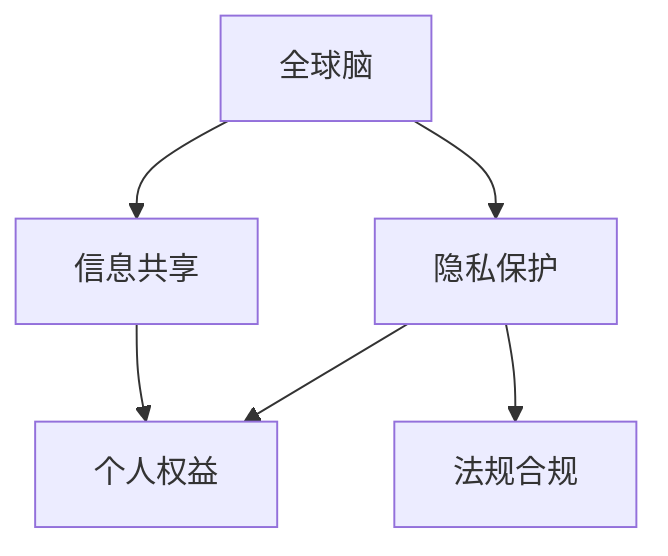

                 

# 全球脑与隐私保护:信息共享与个人权益的平衡

## 1. 背景介绍

### 1.1 问题由来

随着人工智能(AI)技术的发展，全球脑（Global Brain）的概念正在逐渐形成。全球脑通过互联网将全球大量计算资源、数据资源和人才资源连接起来，构建出无比强大的计算和处理能力。它能够在实时场景中快速处理海量数据，提升决策效率和智能化水平。

然而，全球脑在带来巨大价值的同时，也带来了严峻的隐私保护问题。数据采集、传输、存储和处理过程中，个人信息不断被泄露，甚至被滥用。如何平衡信息共享和隐私保护，成为全球脑发展的核心难题之一。

### 1.2 问题核心关键点

全球脑所面临的隐私保护问题，关键点包括：

- **数据收集与共享**：大量数据需要收集和共享，涉及如何处理个人隐私。
- **数据存储与传输**：数据存储在云端，如何防止数据泄露和非法访问。
- **数据使用与监控**：数据被应用于各种场景，如何确保数据使用的合法性和透明度。
- **法规与合规**：不同国家和地区有各自隐私保护法律，如何遵循法律法规。
- **隐私保护技术**：如加密、去标识化、差分隐私等技术手段的开发和应用。

这些关键点构成了全球脑隐私保护的复杂系统，亟需一套全面的解决方案。

### 1.3 问题研究意义

解决全球脑隐私保护问题，不仅关系到数据所有者的合法权益，还关系到全球脑的健康发展。研究如何通过技术和管理手段，实现信息共享与个人权益的平衡，具有以下重要意义：

1. **保障数据安全**：保护个人隐私，防止数据泄露和滥用。
2. **增强用户信任**：确保数据使用合法透明，提高用户对全球脑的信任度。
3. **促进技术创新**：为隐私保护技术的研发和应用提供平台，促进技术创新。
4. **推动法规完善**：推动法律法规的完善，促进全球脑健康发展。
5. **构建可持续生态**：为全球脑各方参与者创造一个可持续发展的生态系统。

## 2. 核心概念与联系

### 2.1 核心概念概述

为更好地理解全球脑隐私保护问题，本节将介绍几个密切相关的核心概念：

- **全球脑**：由互联网连接的大量计算、数据和人才资源组成的全球计算系统，具备强大的信息处理能力。
- **隐私保护**：保护个人信息不被未经授权访问、泄露或滥用的技术和管理手段。
- **信息共享**：数据在不同组织、企业和个人之间自由流动和交换的过程。
- **个人权益**：个人在数据收集、存储、使用和传输过程中应享有的各种权利。
- **法规合规**：遵循各地区法律法规，保障数据处理的合法性和透明度。

这些核心概念之间的逻辑关系可以通过以下Mermaid流程图来展示：



这个流程图展示了大规模计算系统隐私保护的复杂系统，其中涉及了多个关键概念及其相互作用。

## 3. 核心算法原理 & 具体操作步骤
### 3.1 算法原理概述

全球脑隐私保护的核心算法原理可以概括为：

- **数据最小化原则**：只收集和使用必要的个人信息，减少隐私泄露的风险。
- **匿名化与去标识化**：通过技术手段，将数据中的个人身份信息剥离或模糊化，防止直接识别。
- **差分隐私**：在数据分析过程中，加入随机噪声，确保数据查询结果不泄露任何个人隐私信息。
- **访问控制**：通过访问控制策略，限制数据访问权限，防止未经授权的数据访问。
- **加密传输**：采用加密技术，确保数据在传输过程中的安全性和完整性。

这些算法原理通过综合应用，构建起全球脑隐私保护的全面体系。

### 3.2 算法步骤详解

基于上述核心算法原理，全球脑隐私保护的具体操作步骤如下：

**Step 1: 数据最小化**

- 定义数据收集的必要性标准，明确哪些数据必须收集，哪些数据可以省略。
- 使用数据审计工具，定期审查数据收集和使用情况，确保符合数据最小化原则。

**Step 2: 匿名化和去标识化**

- 使用匿名化技术，如K匿名、L匿名、T匿名等，剥离数据中的个人身份信息。
- 应用去标识化技术，如泛化、数据合成、假名化等，进一步模糊数据中的个人信息。

**Step 3: 差分隐私**

- 对数据进行统计分析前，先加入随机噪声，确保查询结果无法直接反推到个人。
- 使用差分隐私算法，如Laplace机制、指数机制等，评估不同隐私保护水平下的数据查询效果。

**Step 4: 访问控制**

- 定义数据访问权限，区分不同用户和角色的访问权限。
- 应用访问控制策略，如基于角色的访问控制(RBAC)、属性基访问控制(ABAC)等，限制数据访问范围。

**Step 5: 加密传输**

- 使用对称加密或非对称加密技术，确保数据在传输过程中的安全性和完整性。
- 采用HTTPS、TLS等协议，防止中间人攻击和数据窃听。

**Step 6: 监控与审计**

- 部署监控系统，实时监测数据访问和操作行为。
- 定期进行数据审计，检查数据处理过程中的合规性和隐私保护情况。

通过以上详细步骤，全球脑隐私保护体系得以构建，确保数据在收集、存储、使用和传输过程中，能够有效保护个人隐私。

### 3.3 算法优缺点

全球脑隐私保护算法的主要优点包括：

- **多层次防护**：综合应用数据最小化、匿名化、差分隐私、访问控制、加密传输等技术手段，构建多层次的隐私保护体系。
- **合规性强**：严格遵循各地区法律法规，确保数据处理的合法性和透明度。
- **灵活性高**：适用于多种数据类型和应用场景，具有较高的灵活性和适应性。

然而，这些算法也存在一些局限性：

- **技术复杂**：涉及数据最小化、匿名化、差分隐私等多项技术，需要较高的技术水平和管理能力。
- **成本高**：隐私保护技术的应用，需要投入较大的时间和资金成本。
- **隐私与可用性平衡**：在隐私保护和数据可用性之间寻找平衡点，可能存在一定的挑战。

尽管存在这些局限性，但就目前而言，这些隐私保护算法仍是大规模计算系统应用的重要范式。未来相关研究的方向在于如何进一步降低技术复杂度，降低成本，提升隐私保护的效率和效果。

### 3.4 算法应用领域

全球脑隐私保护算法已经在多个领域得到广泛应用，例如：

- **医疗健康**：保护患者隐私，确保医疗数据的合法使用和安全传输。
- **金融服务**：保护用户隐私，防止金融数据泄露和滥用。
- **智慧城市**：保护公民隐私，确保城市数据的安全和合法使用。
- **智能制造**：保护员工隐私，确保工业数据的合法使用和隐私保护。
- **电子商务**：保护消费者隐私，确保购物数据的合法使用和保护。

这些领域的应用实践，展示了全球脑隐私保护算法的广泛适用性和重要价值。

## 4. 数学模型和公式 & 详细讲解 & 举例说明
### 4.1 数学模型构建

本节将使用数学语言对全球脑隐私保护方法进行更加严格的刻画。

记数据集为 $D=\{(x_i,y_i)\}_{i=1}^N, x_i \in \mathcal{X}, y_i \in \mathcal{Y}$。其中 $x_i$ 表示个人信息，$y_i$ 表示其他相关信息。假设数据处理流程为 $P$，隐私保护算法为 $E$，则隐私保护的目标可以表述为：

$$
\min_{P,E} \mathcal{L}(P,E)
$$

其中 $\mathcal{L}$ 为隐私保护损失函数，用于衡量数据处理过程中隐私保护的性能。常见的隐私保护损失函数包括：

- **隐私保护成本**：最小化隐私保护所需的时间和金钱成本。
- **隐私泄露风险**：最小化数据泄露和滥用的风险。
- **隐私保护效果**：最大化隐私保护技术的效果和性能。

### 4.2 公式推导过程

以差分隐私算法为例，Laplace机制的基本公式为：

$$
\epsilon\leftarrow 2\ln\frac{1}{\delta}+\log\frac{\Delta}{\sigma}
$$

其中 $\epsilon$ 为隐私参数，$\delta$ 为错误概率，$\Delta$ 为数据范围，$\sigma$ 为标准差。该公式用于计算加入的随机噪声大小，确保查询结果的隐私性。

### 4.3 案例分析与讲解

假设我们要对某城市的人口普查数据进行匿名化处理。原始数据集 $D=\{(x_i,y_i)\}_{i=1}^N$，其中 $x_i$ 表示居民的地理位置信息，$y_i$ 表示其他相关信息，如年龄、职业等。

为了保护隐私，我们可以使用K匿名化技术，将地理位置信息模糊化，使其无法直接识别个体。具体步骤如下：

1. 确定匿名化标准，将地理位置信息划分为若干个区间。
2. 在每个区间内，查找频率最高的几个值，将其替换为匿名标识符。
3. 将原始数据中的地理位置信息替换为匿名标识符，完成匿名化处理。

通过这样的匿名化处理，原始数据中的地理位置信息被模糊化，无法直接识别个体，从而保护了隐私。

## 5. 项目实践：代码实例和详细解释说明
### 5.1 开发环境搭建

在进行隐私保护项目实践前，我们需要准备好开发环境。以下是使用Python进行开发的Python 3.8环境配置流程：

1. 安装Anaconda：从官网下载并安装Anaconda，用于创建独立的Python环境。

2. 创建并激活虚拟环境：
```bash
conda create -n py3_8 python=3.8 
conda activate py3_8
```

3. 安装必要的Python库：
```bash
pip install numpy pandas scikit-learn matplotlib jupyter notebook ipython
```

完成上述步骤后，即可在`py3_8`环境中开始隐私保护项目实践。

### 5.2 源代码详细实现

下面我们以K匿名化处理为例，给出使用Python实现匿名化处理的代码。

```python
import numpy as np

def k_anonymization(data, k):
    n = data.shape[0]
    anonymized_data = np.zeros((n, data.shape[1]))
    
    for i in range(n):
        # 选择K个最频繁的地理位置值
        freq_count = np.bincount(data[i, 0:k])
        max_freq = freq_count.max()
        frequent_values = np.where(freq_count == max_freq)[0].tolist()
        
        # 替换为匿名标识符
        for j in range(k):
            if data[i, 0] in frequent_values:
                index = frequent_values.index(data[i, 0])
                anonymized_data[i, 0] = index
            else:
                anonymized_data[i, 0] = np.random.randint(k)
    
    return anonymized_data

# 假设原始数据集
data = np.array([[10, 20], [20, 30], [30, 40], [40, 50], [50, 60]])

# 使用K匿名化处理
k = 3
anonymized_data = k_anonymization(data, k)

# 打印匿名化处理后的数据
print(anonymized_data)
```

### 5.3 代码解读与分析

让我们再详细解读一下关键代码的实现细节：

**k_anonymization函数**：
- `__init__`方法：接收数据集和匿名化区间数量，初始化匿名化后的数据。
- `k`：定义匿名化区间的数量。
- `n`：数据集的行数。
- `anonymized_data`：定义匿名化后的数据集。
- 在每个数据点上，选择K个最频繁的地理位置值，并将其替换为匿名标识符。
- 如果数据点不在K个频繁值中，随机选择一个匿名标识符。

**数据处理过程**：
- 原始数据集 `data`：包含地理位置信息和其他相关信息。
- `k`：定义匿名化区间的数量。
- 调用匿名化函数，将地理位置信息替换为匿名标识符。
- 打印匿名化后的数据。

可以看到，Python代码通过简单的匿名化算法，实现了对数据集的匿名化处理。开发者可以根据具体需求，选择不同的匿名化技术，并针对不同的数据类型和应用场景进行优化。

当然，工业级的系统实现还需考虑更多因素，如隐私保护的高级技术、数据安全、法规合规等。但核心的隐私保护算法基本与此类似。

## 6. 实际应用场景
### 6.1 智能医疗

在智能医疗领域，隐私保护技术的应用尤为重要。医疗数据涉及患者的敏感信息，如病史、医疗记录等，必须严格保护。

具体而言，可以在医疗数据的收集、存储和传输过程中，应用匿名化、差分隐私等技术手段，保护患者隐私。例如，在医院内部网络中，对病历数据进行去标识化处理，防止数据泄露和滥用。在医疗数据共享平台中，加入差分隐私机制，确保数据查询结果不泄露任何个人隐私。

### 6.2 金融服务

金融服务领域的数据涉及用户的经济活动、支付记录等敏感信息，隐私保护同样重要。

金融机构可以在客户授权的情况下，收集和处理相关数据，应用隐私保护技术，确保数据的安全和合法使用。例如，在客户授权的情况下，收集用户的支付记录，应用去标识化和差分隐私技术，确保数据查询结果无法反推到个人。

### 6.3 智慧城市

智慧城市中的大量数据涉及公民的隐私，如交通流量、公共安全、环境保护等。隐私保护技术的应用，可以防止数据泄露和滥用，确保数据的安全和合法使用。

例如，在交通流量监控系统中，应用去标识化和差分隐私技术，确保数据查询结果无法反推到具体的车辆和行人。在公共安全系统中，应用访问控制和加密传输技术，确保数据的安全传输和访问权限。

### 6.4 未来应用展望

随着隐私保护技术的不断发展，未来在更多的领域将得到应用，为数据所有者创造更多的价值。

在教育领域，隐私保护技术可以保护学生和教职工的隐私，防止数据滥用。在环境保护领域，隐私保护技术可以保护监测数据的隐私，防止数据泄露和滥用。在社会治理领域，隐私保护技术可以保护公民的隐私，防止数据滥用。

未来，隐私保护技术将与人工智能、大数据等技术深度融合，构建起更加全面和安全的隐私保护体系，为人机协同的未来社会奠定坚实基础。

## 7. 工具和资源推荐
### 7.1 学习资源推荐

为了帮助开发者系统掌握隐私保护技术的理论基础和实践技巧，这里推荐一些优质的学习资源：

1. 《数据隐私保护技术与应用》系列书籍：全面介绍了隐私保护技术的原理、方法和应用，适合各类开发者阅读。

2. 《差分隐私理论与实践》：介绍了差分隐私的基本原理和实际应用，是差分隐私研究的经典之作。

3. 《数据科学导论》：介绍了数据科学的各个方面，包括隐私保护、数据安全等内容，适合初学者入门。

4. 《全球脑隐私保护》课程：由隐私保护专家开设的在线课程，系统讲解隐私保护技术在各个领域的实际应用。

5. 《隐私保护技术实战》：介绍了隐私保护技术的最新进展和实际案例，适合中高级开发者深入学习。

通过对这些资源的学习实践，相信你一定能够快速掌握隐私保护技术的精髓，并用于解决实际的隐私保护问题。

### 7.2 开发工具推荐

高效的开发离不开优秀的工具支持。以下是几款用于隐私保护开发的常用工具：

1. Python：免费开源的编程语言，功能强大，适合隐私保护技术的研究和开发。

2. R：用于统计分析和数据可视化，适合隐私保护研究的数学建模和数据分析。

3. SQL：用于数据管理和数据查询，适合隐私保护数据的安全存储和处理。

4. Elasticsearch：用于数据搜索和全文索引，适合隐私保护数据的快速查询和分析。

5. Apache Kafka：用于数据流处理和数据同步，适合隐私保护数据的实时传输和处理。

6. Apache Spark：用于大数据处理和分析，适合隐私保护数据的分布式处理和计算。

合理利用这些工具，可以显著提升隐私保护任务的开发效率，加快创新迭代的步伐。

### 7.3 相关论文推荐

隐私保护技术的发展源于学界的持续研究。以下是几篇奠基性的相关论文，推荐阅读：

1. "Differential Privacy: An Approach to Privacy-Friendly Data Analysis"（差分隐私论文）：差分隐私技术的奠基之作，介绍了差分隐私的基本原理和应用。

2. "On the Rewards of Focusing on Privacy"（隐私保护论文）：隐私保护技术的经典之作，介绍了隐私保护的重要性和方法。

3. "K-anonymity: A Privacy Model"（K匿名化论文）：K匿名化技术的奠基之作，介绍了K匿名化的基本原理和实现方法。

4. "Secure and Privacy-Preserving Data Sharing"（数据共享论文）：数据共享技术的经典之作，介绍了数据共享的隐私保护方法。

5. "The Growing Importance of Privacy in Data Mining"（数据挖掘中的隐私保护论文）：数据挖掘中的隐私保护技术研究综述，介绍了隐私保护在数据挖掘中的重要性和方法。

这些论文代表了大规模计算系统隐私保护技术的发展脉络。通过学习这些前沿成果，可以帮助研究者把握学科前进方向，激发更多的创新灵感。

## 8. 总结：未来发展趋势与挑战

### 8.1 总结

本文对全球脑隐私保护问题进行了全面系统的介绍。首先阐述了全球脑和隐私保护的复杂系统，明确了隐私保护在信息共享和个人权益中的关键作用。其次，从原理到实践，详细讲解了隐私保护的基本算法和操作步骤，给出了隐私保护项目开发的完整代码实例。同时，本文还探讨了隐私保护技术在多个领域的应用前景，展示了隐私保护范式的巨大潜力。此外，本文精选了隐私保护技术的各类学习资源，力求为读者提供全方位的技术指引。

通过本文的系统梳理，可以看到，全球脑隐私保护技术正在成为计算系统应用的重要范式，极大地拓展了数据处理系统的应用边界，催生了更多的落地场景。受益于大规模计算系统和大数据技术的发展，隐私保护技术必将得到更广泛的应用，为人机协同的未来社会构建更加安全、可靠、可控的数据处理体系。

### 8.2 未来发展趋势

展望未来，隐私保护技术将呈现以下几个发展趋势：

1. **隐私保护技术的多样化**：隐私保护方法将更加多样化，结合分布式计算、区块链、联邦学习等新技术，提升隐私保护的效率和效果。

2. **隐私保护技术的自动化**：隐私保护技术将更加自动化，结合人工智能、机器学习等技术，实现隐私保护过程的自动化和智能化。

3. **隐私保护技术的应用普及**：隐私保护技术将逐步应用于更多领域，保护更多数据所有者的隐私权益。

4. **隐私保护技术的法规完善**：隐私保护法规将逐步完善，为隐私保护技术的发展提供更好的法律保障。

5. **隐私保护技术的国际化**：隐私保护技术将逐步国际化，满足不同国家和地区的隐私保护需求。

以上趋势凸显了隐私保护技术的广阔前景。这些方向的探索发展，必将进一步提升数据处理系统的性能和应用范围，为人机协同的未来社会带来深远影响。

### 8.3 面临的挑战

尽管隐私保护技术已经取得了瞩目成就，但在迈向更加智能化、普适化应用的过程中，它仍面临着诸多挑战：

1. **隐私保护与数据可用性的平衡**：如何在隐私保护和数据可用性之间寻找平衡点，是一大挑战。

2. **隐私保护技术的复杂性**：隐私保护技术涉及多种技术手段，需要较高的技术水平和管理能力。

3. **隐私保护技术的成本**：隐私保护技术的应用，需要投入较大的时间和资金成本。

4. **隐私保护技术的法规合规性**：隐私保护技术需要遵循各地区法律法规，确保数据处理的合法性和透明度。

5. **隐私保护技术的普及性**：隐私保护技术需要普及到各个领域和组织，才能实现全局范围内的隐私保护。

6. **隐私保护技术的可解释性**：隐私保护技术需要具备较高的可解释性，便于用户理解和信任。

这些挑战凸显了隐私保护技术的复杂性和现实性，需要全球各方的共同努力，才能逐步克服。

### 8.4 研究展望

面对隐私保护面临的种种挑战，未来的研究需要在以下几个方面寻求新的突破：

1. **隐私保护技术的自动化和智能化**：结合人工智能、机器学习等技术，实现隐私保护过程的自动化和智能化。

2. **隐私保护技术的可解释性**：开发可解释的隐私保护技术，便于用户理解和信任。

3. **隐私保护技术的普及性**：推广隐私保护技术，普及到各个领域和组织。

4. **隐私保护技术的法规完善**：推动隐私保护法规的完善，为隐私保护技术的发展提供更好的法律保障。

5. **隐私保护技术的国际合作**：加强国际合作，推动隐私保护技术的国际化。

6. **隐私保护技术的可持续发展**：开发可持续发展的隐私保护技术，实现长期稳定发展。

这些研究方向的探索，必将引领隐私保护技术迈向更高的台阶，为构建安全、可靠、可控的智能系统铺平道路。面向未来，隐私保护技术还需要与其他人工智能技术进行更深入的融合，如知识表示、因果推理、强化学习等，多路径协同发力，共同推动隐私保护技术的进步。只有勇于创新、敢于突破，才能不断拓展隐私保护技术的边界，让人工智能技术更好地造福人类社会。

## 9. 附录：常见问题与解答

**Q1：如何确保数据处理的合法性和透明度？**

A: 数据处理的合法性和透明度需要遵循各地区法律法规，应用访问控制、审计、合规性检查等技术手段，确保数据处理的合法性和透明度。同时，建立数据处理流程和标准，确保数据处理的规范性和可追溯性。

**Q2：如何平衡隐私保护和数据可用性？**

A: 隐私保护和数据可用性之间的平衡可以通过多种技术手段实现，如数据最小化、去标识化、差分隐私、访问控制、加密传输等。同时，根据具体应用场景，灵活调整隐私保护参数，确保隐私保护和数据可用性之间的平衡。

**Q3：如何降低隐私保护技术的成本？**

A: 隐私保护技术的成本可以通过多种方式降低，如自动化隐私保护、使用开源工具和框架、优化隐私保护算法、引入分布式计算等。同时，建立隐私保护技术标准和规范，减少隐私保护过程中的时间和人力成本。

**Q4：如何确保隐私保护技术的可解释性？**

A: 隐私保护技术的可解释性可以通过多种方式实现，如开发可解释的隐私保护算法、使用可视化工具、建立隐私保护技术文档和培训等。同时，定期进行隐私保护技术评估和审计，确保隐私保护技术的可解释性和可靠性。

**Q5：如何确保隐私保护技术的可持续发展？**

A: 隐私保护技术的可持续发展需要建立完善的隐私保护技术生态系统，引入多方协作和合作机制，确保隐私保护技术的持续创新和发展。同时，建立隐私保护技术标准和规范，确保隐私保护技术的长期稳定发展。

这些问题的解答，可以帮助开发者更好地理解隐私保护技术的核心挑战和解决方案，为全球脑隐私保护技术的实践提供参考。

---

作者：禅与计算机程序设计艺术 / Zen and the Art of Computer Programming

