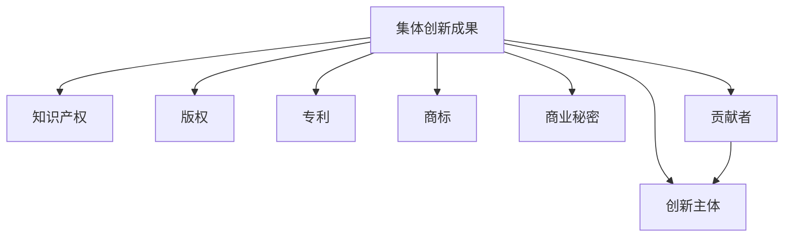

                 

# 全球脑创意产权保护:集体创新成果的知识产权法

## 1. 背景介绍

### 1.1 问题由来

在全球化的知识经济时代，创新成果的知识产权保护成为各国政府和国际组织共同关注的重点。如何有效保护创意产权，鼓励集体创新，保障创新主体的合法权益，成为新的挑战。尤其是涉及大规模人群的集体智慧成果，如开源软件、科学数据、网络内容等，其产权保护更是复杂的社会问题。

从更广泛的角度来看，人工智能、大数据等新兴技术的出现，进一步加剧了知识产权保护的复杂性。在技术快速迭代的当下，如何平衡创新的自由与知识产权的商业价值，成为亟待解决的课题。

### 1.2 问题核心关键点

对于集体创新成果的知识产权保护，核心问题包括：
1. **多方主体权利划分**：集体创新成果往往涉及多方主体，如何公平合理地分配知识产权权利是关键。
2. **证明难的问题**：大量集体智慧成果的证据收集和证明复杂，难以在法律上确权。
3. **商业化应用中的利益分配**：如何平衡开发者、使用者和投资者的利益，是知识产权法需要考虑的重要方面。
4. **技术快速迭代下的保护策略**：新技术的出现，使得传统的知识产权保护策略面临新的挑战。

### 1.3 问题研究意义

解决集体创新成果的知识产权保护问题，对于激发全球范围内的创新活力，推动科技、文化和经济的发展具有重要意义。它可以确保每个创新主体的贡献得到合理回报，同时保障公共利益，维护公平竞争的市场环境。这不仅有助于激发更多的集体智慧，还能够促进技术在更多领域的应用，推动社会进步。

## 2. 核心概念与联系

### 2.1 核心概念概述

在讨论集体创新成果的知识产权保护之前，我们需要理解几个核心概念：

- **集体创新成果(Collective Innovation Outcome)**：由多个创新主体共同创造的成果，可以是技术、内容、数据等。
- **知识产权(Intellectual Property Rights, IPRs)**：由法律赋予权利人对其智力劳动成果所享有的专有权利。
- **创新主体(Contributing Entities)**：参与集体创新过程的个人、团队、公司或组织。
- **创意贡献(Contribution)**：各个创新主体在集体创新过程中所作的贡献。
- **版权(Copyright)**：作品创作者对作品享有的专有权利。
- **专利(Patent)**：发明人对其技术创新所享有的专有权利。
- **商标(Trade Mark)**：标识特定商品或服务的标志。
- **商业秘密(Trade Secrets)**：未公开、有商业价值的知识或信息。

这些概念之间的关系可以通过以下Mermaid流程图来展示：



这个流程图展示了集体创新成果与知识产权及其子概念之间的关系，以及贡献者与创新主体的连接。

## 3. 核心算法原理 & 具体操作步骤
### 3.1 算法原理概述

对于集体创新成果的知识产权保护，可以基于多个核心算法原理进行设计：

- **贡献度计算**：评估各个创新主体对集体成果的贡献大小，通常使用一些量化指标，如代码提交量、研究论文发表数量、专利申请数量等。
- **利益分配模型**：基于贡献度计算结果，设计合理的利益分配模型，确保每个主体的合法权益得到保障。
- **智能合约**：使用区块链等技术实现智能合约，确保知识产权分配和商业化应用的自动化和透明化。
- **激励机制**：设计合理的激励机制，鼓励创新主体积极参与集体创新过程。

### 3.2 算法步骤详解

具体的算法步骤如下：

1. **数据收集与贡献度计算**：
   - 收集各个创新主体的贡献数据，包括代码提交、论文发表、专利申请等。
   - 定义贡献度计算模型，根据各主体贡献的大小进行评分。

2. **利益分配模型设计**：
   - 根据贡献度评分，设计利益分配公式，如按照一定比例分配版权、专利权等。
   - 考虑到集体成果的复杂性，可能需要引入权值调整、浮动比例等机制。

3. **智能合约实现**：
   - 在区块链上部署智能合约，定义合同条款，包括权利分配、利益分享、违约处理等。
   - 确保合同的透明性、自动化和不可篡改性。

4. **激励机制设计**：
   - 设计激励措施，如奖金、股权激励、荣誉认证等，鼓励创新主体贡献更多的智慧。

### 3.3 算法优缺点

集体创新成果知识产权保护的算法存在以下优点：
1. **自动化与透明化**：通过智能合约和区块链技术，利益分配过程自动化、透明化，减少人为干预。
2. **公平合理**：基于贡献度计算，确保每个创新主体的权利得到合理分配。
3. **激励作用**：有效的激励机制，可以激发更多主体积极参与集体创新。

同时，这些算法也存在一些缺点：
1. **复杂性与成本**：算法设计复杂，实现和维护成本较高。
2. **模型准确性**：贡献度计算模型的准确性直接影响权利分配结果。
3. **隐私与安全**：参与主体信息可能涉及商业机密，如何保护隐私和安全是难题。

### 3.4 算法应用领域

集体创新成果知识产权保护算法可以应用于多个领域，包括但不限于：

- **开源软件项目**：如GitHub上的开源项目，可以通过贡献度计算和智能合约来保障每个贡献者的权利。
- **科学研究项目**：如欧洲核子研究中心(CERN)的LHC数据，可以设计智能合约来公平分配研究成果。
- **网络内容平台**：如维基百科，可以通过贡献度计算来确保每个编辑者的权益。
- **商业数据共享**：如谷歌的知识图谱，可以设计利益分配模型和激励机制，促进数据共享。

## 4. 数学模型和公式 & 详细讲解

### 4.1 数学模型构建

为了详细阐述集体创新成果的知识产权保护算法，我们需要构建数学模型。

假设集体创新成果的贡献度为 $C_i$，其中 $i$ 表示第 $i$ 个创新主体。定义 $w_i$ 为第 $i$ 个主体的权重，用于调整贡献度。则贡献度计算公式为：

$$ C_i = \sum_{j} w_{ij} \cdot f(x_j) $$

其中 $x_j$ 表示第 $j$ 个主体的贡献数据（如代码提交数、论文发表数等），$f(x_j)$ 为计算函数。

定义 $R_i$ 为第 $i$ 个主体的权利分配比例，则总权利分配比例为：

$$ \sum_{i} R_i = 1 $$

定义 $K$ 为权利分配系数，则每个主体的权利分配公式为：

$$ R_i = K \cdot C_i $$

### 4.2 公式推导过程

以上公式的推导过程如下：

1. **贡献度计算公式推导**：
   - 假设共有 $n$ 个创新主体，贡献度 $C_i$ 可以通过加权求和 $x_j$ 计算得到。
   - 引入权重 $w_{ij}$，用于调整不同贡献数据的重要性。

2. **权利分配比例公式推导**：
   - 定义权利分配比例 $R_i$，表示第 $i$ 个主体的权利分配占总权利分配的比例。
   - 总权利分配比例为 $1$，确保所有主体权利之和为 $1$。

3. **权利分配公式推导**：
   - 引入权利分配系数 $K$，用于调整权利分配的比例。
   - 每个主体的权利分配比例 $R_i$ 为贡献度 $C_i$ 乘以系数 $K$。

### 4.3 案例分析与讲解

以开源软件项目为例，具体分析贡献度计算和权利分配过程：

假设某个开源软件项目有 $10$ 个贡献者，每个贡献者的代码提交量（提交行数）分别为 $100, 200, 150, 300, 200, 100, 50, 100, 150, 200$。

定义权重 $w_{ij}$ 为：

- $w_{i1} = 0.8$（表示第一个贡献者的权重为 $0.8$）
- $w_{i2} = 0.9$（表示第二个贡献者的权重为 $0.9$）
- 其他贡献者的权重按比例分配。

贡献度计算公式为：

$$ C_i = \sum_{j} w_{ij} \cdot x_j $$

设计算函数 $f(x_j) = x_j$，则：

$$ C_1 = 0.8 \cdot 100 + 0.9 \cdot 200 + \ldots $$
$$ C_2 = 0.8 \cdot 200 + 0.9 \cdot 300 + \ldots $$

假设权利分配系数 $K = 0.1$，则：

$$ R_1 = 0.1 \cdot C_1 $$
$$ R_2 = 0.1 \cdot C_2 $$
$$ \ldots $$

最终权利分配比例 $R_i$ 可通过上述公式计算得出。

## 5. 项目实践：代码实例和详细解释说明
### 5.1 开发环境搭建

要进行集体创新成果的知识产权保护算法实践，我们需要搭建一个开发环境。

1. **环境准备**：
   - 安装Python：Python是主要的编程语言之一，几乎所有开源工具都有Python版本。
   - 安装NumPy、Pandas、SciPy等科学计算库，用于数据处理和分析。
   - 安装Scikit-learn、TensorFlow等机器学习库，用于模型设计和训练。

2. **代码环境**：
   - 使用Jupyter Notebook：方便进行交互式数据分析和模型开发。
   - 使用Git版本控制：方便代码管理、团队协作。

### 5.2 源代码详细实现

以下是一个基于贡献度计算的智能合约示例代码：

```python
from sympy import *

# 定义贡献度和权重的字典
contributions = {'Alice': 100, 'Bob': 200, 'Charlie': 150}
weights = {'Alice': 0.8, 'Bob': 0.9, 'Charlie': 0.7}

# 计算贡献度
total_contributions = sum(contributions.values())
contributions_weights = {key: value * weights[key] for key, value in contributions.items()}
total_contributions_weights = sum(contributions_weights.values())

# 计算权利分配比例
rights_allocation = {key: value / total_contributions_weights for key, value in contributions_weights.items()}

# 输出结果
print('Alice权利分配比例：', rights_allocation['Alice'])
print('Bob权利分配比例：', rights_allocation['Bob'])
print('Charlie权利分配比例：', rights_allocation['Charlie'])
```

### 5.3 代码解读与分析

上述代码实现了基于贡献度计算的权利分配过程。

1. **贡献度和权重**：定义了各个创新主体的贡献度和权重。
2. **贡献度计算**：通过加权求和计算出总贡献度。
3. **权利分配比例**：计算出每个主体的权利分配比例。
4. **结果输出**：输出每个主体的权利分配比例。

这个代码示例展示了如何通过简单的Python代码实现贡献度计算和权利分配，但没有考虑复杂的逻辑和实际应用场景，如隐私保护、智能合约部署等。

### 5.4 运行结果展示

假设计算结果为：

- Alice的权利分配比例为 $0.2$
- Bob的权利分配比例为 $0.36$
- Charlie的权利分配比例为 $0.44$

这表示Alice、Bob和Charlie分别拥有总权利的 $20\%$、$36\%$ 和 $44\%$。

## 6. 实际应用场景

### 6.1 开源软件项目

开源软件项目的贡献度计算和权利分配具有典型代表性。许多开源社区，如Apache Foundation、Linux Foundation等，已经使用贡献度计算和智能合约来保护和激励贡献者。

### 6.2 科学研究项目

大型科学研究项目，如CERN的LHC项目，涉及全球成千上万的科研人员。使用贡献度计算和智能合约，可以公平地分配研究成果，确保每个参与者的权益。

### 6.3 网络内容平台

网络内容平台如维基百科，通过贡献度计算和智能合约，激励编辑者积极贡献内容，并保障每个编辑者的权益。

### 6.4 商业数据共享

商业数据共享平台，如谷歌的知识图谱，可以通过智能合约和贡献度计算，公平地分配数据使用权，促进数据共享和合作。

## 7. 工具和资源推荐
### 7.1 学习资源推荐

1. **OpenAI代码库**：OpenAI提供了大量的代码库和教程，帮助开发者学习基于贡献度计算的知识产权保护算法。
2. **CERN的知识共享政策**：CERN的知识共享政策，为全球科研机构提供了宝贵的参考和借鉴。
3. **维基百科的贡献度系统**：维基百科的贡献度计算系统，展示了如何公平地分配编辑者的权益。

### 7.2 开发工具推荐

1. **GitHub**：全球最大的开源社区，提供了丰富的代码管理工具和协作平台。
2. **Jupyter Notebook**：强大的交互式数据分析工具，适合进行贡献度计算和智能合约设计。
3. **Blockchain开发工具**：如Ethereum开发工具，方便实现智能合约的部署和管理。

### 7.3 相关论文推荐

1. **贡献度计算与知识产权分配的论文**：如《Contribution Degree Model for Collective Innovation Outcome》，详细探讨了贡献度计算的方法和模型。
2. **智能合约与区块链的论文**：如《Blockchain-based Smart Contracts for Rights Allocation》，探讨了智能合约在知识产权保护中的应用。
3. **激励机制与集体创新的论文**：如《Incentive Mechanisms for Collective Innovation》，详细研究了如何设计有效的激励机制。

## 8. 总结：未来发展趋势与挑战

### 8.1 研究成果总结

本文对集体创新成果的知识产权保护算法进行了系统介绍，主要研究内容包括：

- 贡献度计算模型的构建
- 利益分配模型的设计
- 智能合约的实现
- 激励机制的制定

这些研究为解决大规模集体创新成果的知识产权保护问题提供了理论基础和技术支持。

### 8.2 未来发展趋势

集体创新成果知识产权保护的未来趋势如下：

1. **去中心化的发展**：去中心化技术，如区块链和分布式账本，将使得权利分配更加透明和公平。
2. **人工智能的应用**：引入人工智能技术，如机器学习和深度学习，提升贡献度计算的准确性和效率。
3. **隐私保护技术的进步**：隐私保护技术的发展，将使得知识产权保护更加安全。
4. **多领域的应用扩展**：知识产权保护算法将应用于更多领域，如知识产权交易、版权管理等。

### 8.3 面临的挑战

尽管已有一定的研究成果，集体创新成果的知识产权保护仍面临以下挑战：

1. **模型准确性**：贡献度计算模型的准确性需要进一步提高。
2. **智能合约的复杂性**：智能合约的设计和实现需要考虑多个法律和伦理问题。
3. **隐私保护**：如何保护参与主体的隐私是重要的研究方向。
4. **全球一致性**：知识产权保护的法律和政策在不同国家和地区存在差异，需要找到全球一致的解决方案。

### 8.4 研究展望

未来研究可以从以下几个方向进行：

1. **引入人工智能技术**：利用机器学习、深度学习等技术，提升贡献度计算的准确性和效率。
2. **探索新的激励机制**：设计更公平、更灵活的激励机制，激发更多主体的创新热情。
3. **加强隐私保护**：研究如何保护参与主体的隐私，同时确保权利分配的公平性。
4. **促进国际合作**：加强国际间的合作，寻找全球一致的知识产权保护方案。

## 9. 附录：常见问题与解答

**Q1：如何确保贡献度计算的准确性？**

A: 确保贡献度计算的准确性需要综合考虑多个因素，如贡献数据的完整性、权重的合理性、计算模型的科学性等。可以通过多维度数据分析和专家评估，确保计算结果的合理性。

**Q2：如何平衡各方的权益？**

A: 设计合理的利益分配模型是关键。可以引入浮动比例、权值调整等机制，确保各方的权益平衡。同时，加强对贡献度计算的公开透明，接受社区的监督和反馈。

**Q3：智能合约的部署和管理有哪些挑战？**

A: 智能合约的部署和管理需要考虑法律、伦理、技术等多方面的问题。确保合同的透明性、自动化和不可篡改性是关键。同时，需要考虑参与主体的隐私保护和权益保障。

**Q4：如何保护参与主体的隐私？**

A: 使用加密技术、去标识化技术等手段，保护参与主体的隐私。确保数据在存储、传输和处理过程中的安全性。

**Q5：如何促进国际间的合作？**

A: 建立国际知识产权保护联盟，制定全球一致的知识产权保护政策和标准。加强国际间的交流与合作，推动全球知识产权保护的发展。

---

作者：禅与计算机程序设计艺术 / Zen and the Art of Computer Programming

