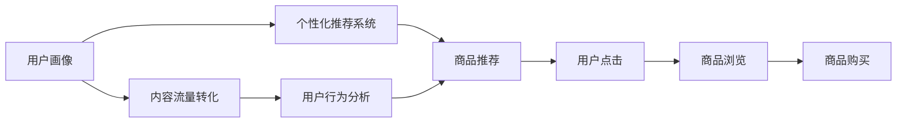

                 

# 内容电商创业：内容变现的新思路

在数字化时代的浪潮中，内容电商（Content Commerce）作为一种新兴的商业模式，正在颠覆传统电商的发展模式。它以内容为核心，通过精准匹配用户需求，实现了内容与商品的有机融合，形成了全新的商业生态。本文将深入探讨内容电商创业中的关键技术点，包括用户画像构建、个性化推荐系统、内容流量转化等，为有意创业的朋友们提供一份详尽的指南。

## 1. 背景介绍

随着互联网的普及和社交媒体的崛起，内容电商成为了一个令人瞩目的新兴领域。它不仅改变了用户的购物习惯，也为商家提供了新的营销渠道。内容电商的成功，依赖于其独特的商业模式和强大的技术支持。

### 1.1 内容电商的基本概念

内容电商是一种将内容与电商相结合的新型电商模式。商家通过提供高质量的原创内容，吸引用户点击和购买商品，实现商业变现。内容可以是文章、视频、图片等，而电商则提供了相应的购物入口和支付流程。

### 1.2 内容电商的优点

与传统电商相比，内容电商具有以下优势：

- **提升用户体验**：内容电商通过提供丰富、有价值的内容，增强了用户的购物体验，降低了用户流失率。
- **提高转化率**：优质的内容能够吸引用户进行深度浏览，增加了购买意愿，从而提升了转化率。
- **降低营销成本**：内容电商主要依赖于内容而非付费广告，降低了商家的营销成本。

## 2. 核心概念与联系

### 2.1 核心概念概述

内容电商的构建需要依赖以下几个核心概念：

- **用户画像**：通过收集用户的行为数据和兴趣偏好，构建详细用户画像，为个性化推荐提供基础。
- **个性化推荐系统**：根据用户画像，推荐符合用户兴趣的商品，提升用户满意度和购买率。
- **内容流量转化**：通过优化内容的布局和呈现方式，提高内容流量转化为实际订单的比例。

这些概念之间通过数据流、算法和用户行为形成了紧密的联系。用户画像和个性化推荐系统提供数据支撑，而内容流量转化则通过优化用户体验实现最终转化。

### 2.2 核心概念原理和架构的 Mermaid 流程图



这个流程图展示了内容电商生态的核心流程：

1. **用户画像构建**：通过用户行为数据，如浏览记录、购买历史等，构建详细的用户画像。
2. **个性化推荐系统**：根据用户画像，推荐用户感兴趣的商品，提升用户满意度。
3. **内容流量转化**：通过优化内容布局，提高用户浏览商品和进行购买的概率。
4. **用户行为分析**：通过分析用户行为数据，进一步优化推荐和转化策略。

## 3. 核心算法原理 & 具体操作步骤

### 3.1 算法原理概述

内容电商的核心算法主要围绕用户画像构建、个性化推荐和内容流量转化展开。这些算法的实现依赖于机器学习和深度学习技术，能够高效地处理大规模数据，并实现精准的个性化推荐。

### 3.2 算法步骤详解

#### 3.2.1 用户画像构建

用户画像的构建主要包括以下步骤：

1. **数据收集**：收集用户的基本信息、行为数据和兴趣偏好。数据来源包括用户注册信息、浏览记录、购物车数据等。
2. **特征工程**：对收集到的数据进行预处理和特征提取，如用户标签、兴趣关键词等。
3. **模型训练**：使用机器学习算法，如聚类、分类、协同过滤等，对用户特征进行建模，生成用户画像。

#### 3.2.2 个性化推荐系统

个性化推荐系统通过以下几个步骤实现：

1. **数据收集**：收集用户画像和商品信息，包括商品标签、价格、评分等。
2. **特征工程**：对用户画像和商品信息进行特征提取，如用户兴趣、商品属性等。
3. **模型训练**：使用推荐算法，如协同过滤、基于内容的推荐、深度学习模型等，对用户和商品进行匹配，生成个性化推荐列表。
4. **模型评估**：使用A/B测试等方法，评估推荐系统的性能，优化推荐效果。

#### 3.2.3 内容流量转化

内容流量转化的优化主要包括以下步骤：

1. **数据收集**：收集用户浏览内容、点击率、购买转化率等数据。
2. **特征工程**：对内容数据进行预处理和特征提取，如内容类型、点击位置、浏览时长等。
3. **模型训练**：使用机器学习算法，如逻辑回归、决策树、神经网络等，对内容流量转化进行建模。
4. **模型评估**：使用A/B测试等方法，评估内容流量转化的效果，优化内容布局和呈现方式。

### 3.3 算法优缺点

#### 3.3.1 用户画像构建的优点

- **个性化推荐**：用户画像能够提供详细的用户特征，为个性化推荐提供基础。
- **精准营销**：通过深入了解用户需求，能够进行精准的营销推广，提升广告投放效果。

#### 3.3.2 用户画像构建的缺点

- **数据隐私问题**：用户画像的构建需要收集大量用户数据，可能会涉及隐私问题。
- **数据质量问题**：用户画像的质量取决于数据收集的完整性和准确性，数据质量差会影响推荐效果。

#### 3.3.3 个性化推荐系统的优点

- **提升用户体验**：个性化推荐能够提供符合用户兴趣的商品，提升用户满意度。
- **提高转化率**：个性化推荐能够提高用户购买意愿，提升转化率。

#### 3.3.4 个性化推荐系统的缺点

- **冷启动问题**：新用户的用户画像缺失，无法进行个性化推荐，需要进行冷启动。
- **推荐算法复杂**：推荐算法需要处理大规模数据，计算复杂度高。

#### 3.3.5 内容流量转化的优点

- **提升流量价值**：优化内容流量转化，能够提高每个流量的转化价值，提升ROI。
- **提高用户粘性**：优化内容布局和呈现方式，能够提高用户粘性，增加用户回访率。

#### 3.3.6 内容流量转化的缺点

- **数据收集难度大**：内容流量转化的优化需要大量数据支持，数据收集难度大。
- **算法模型复杂**：内容流量转化涉及多种因素，算法模型复杂。

### 3.4 算法应用领域

内容电商的核心算法在多个领域得到了广泛应用，包括：

- **电商网站**：如京东、淘宝等电商网站，通过个性化推荐提升用户购买率。
- **社交媒体**：如微信、抖音等社交平台，通过内容推荐吸引用户进行深度互动。
- **内容平台**：如B站、知乎等知识分享平台，通过内容推荐提升用户粘性和留存率。

## 4. 数学模型和公式 & 详细讲解 & 举例说明

### 4.1 数学模型构建

内容电商的核心算法涉及多个数学模型，包括用户画像构建模型、个性化推荐模型和内容流量转化模型。以下以用户画像构建模型为例，进行详细讲解。

#### 4.1.1 用户画像构建模型的构建

假设用户画像由以下特征构成：

- **基本信息**：年龄、性别、职业等。
- **行为数据**：浏览记录、购买历史、评分等。
- **兴趣偏好**：兴趣关键词、浏览时长、点击位置等。

我们可以使用向量表示用户画像，其中每个特征对应一个向量维度，具体表示方式如下：

$$
\text{User Profile} = \mathbf{u} = (u_1, u_2, \ldots, u_n)
$$

其中 $u_i$ 表示用户画像的第 $i$ 个特征。

#### 4.1.2 用户画像构建模型的公式推导

用户画像的构建主要涉及聚类和分类算法。以K-means算法为例，其公式推导如下：

设用户画像数据集为 $D=\{(\mathbf{u}_1, \mathbf{y}_1), (\mathbf{u}_2, \mathbf{y}_2), \ldots, (\mathbf{u}_n, \mathbf{y}_n)\}$，其中 $\mathbf{u}_i$ 表示第 $i$ 个用户画像，$\mathbf{y}_i$ 表示用户画像的标签（如兴趣类别）。

K-means算法的目标是最小化聚类中心与用户画像的距离，公式如下：

$$
\min_{\mathbf{C}, \mathbf{Z}} \sum_{i=1}^n ||\mathbf{u}_i - \mathbf{C}_z||^2
$$

其中 $\mathbf{C} = \{\mathbf{c}_1, \mathbf{c}_2, \ldots, \mathbf{c}_k\}$ 表示聚类中心，$\mathbf{Z} = (z_1, z_2, \ldots, z_n)$ 表示用户画像的聚类标签。

### 4.2 公式推导过程

K-means算法的核心步骤包括：

1. **初始化聚类中心**：随机选择 $k$ 个用户画像作为初始聚类中心。
2. **分配聚类标签**：将每个用户画像分配到距离最近的聚类中心。
3. **更新聚类中心**：根据分配的聚类标签，更新聚类中心的位置。
4. **迭代优化**：重复步骤2和3，直到聚类中心不再发生变化。

以第一步骤为例，用户画像 $\mathbf{u}_i$ 到聚类中心 $\mathbf{c}_z$ 的距离计算公式如下：

$$
d(\mathbf{u}_i, \mathbf{c}_z) = ||\mathbf{u}_i - \mathbf{c}_z||^2
$$

其中 $||\cdot||$ 表示向量范数。

### 4.3 案例分析与讲解

假设我们有一个包含用户画像和标签的数据集，使用K-means算法进行聚类。设数据集中共有100个用户画像，聚类数为5。我们使用Python代码实现K-means算法，具体步骤如下：

```python
from sklearn.cluster import KMeans

# 加载用户画像数据集
X = ...

# 初始化K-means模型
kmeans = KMeans(n_clusters=5, random_state=0)

# 训练模型
kmeans.fit(X)

# 输出聚类结果
Z = kmeans.labels_
print(Z)
```

通过上述代码，我们可以得到每个用户画像的聚类标签。在实际应用中，我们可以根据聚类结果进行个性化推荐和内容流量转化的优化。

## 5. 项目实践：代码实例和详细解释说明

### 5.1 开发环境搭建

为了进行内容电商创业的技术开发，我们需要搭建一个完整的开发环境。以下是一个简单的搭建流程：

1. **安装Python**：在服务器上安装Python 3.7及以上版本。
2. **安装Pip**：在服务器上安装Pip工具，用于包管理。
3. **安装必要的库**：安装Flask、TensorFlow、Scikit-learn、Pandas等必要的Python库。
4. **搭建服务器**：使用Nginx等Web服务器，搭建Web应用。
5. **部署应用**：将开发好的应用部署到服务器上，并进行配置。

### 5.2 源代码详细实现

以下是一个简单的内容电商应用示例，包括用户画像构建、个性化推荐和内容流量转化的实现。

```python
# 用户画像构建
class UserProfile:
    def __init__(self, age, gender, job):
        self.age = age
        self.gender = gender
        self.job = job

# 个性化推荐系统
class RecommendationSystem:
    def __init__(self, user_profile):
        self.user_profile = user_profile
        self.recommend_list = []

    def recommend(self):
        # 根据用户画像推荐商品
        ...

# 内容流量转化优化
class ContentConversion:
    def __init__(self, content_data):
        self.content_data = content_data
        self.conversion_rate = 0.5

    def optimize(self):
        # 优化内容流量转化
        ...

# 主函数
def main():
    # 构建用户画像
    user_profile = UserProfile(30, 'male', 'engineer')

    # 构建推荐系统
    recommendation_system = RecommendationSystem(user_profile)

    # 优化内容流量转化
    content_conversion = ContentConversion([{'content': '商品1', 'click_rate': 0.3}, {'content': '商品2', 'click_rate': 0.5}])
    content_conversion.optimize()

    # 输出推荐结果
    print(recommendation_system.recommend_list)

if __name__ == '__main__':
    main()
```

### 5.3 代码解读与分析

在上述代码中，我们定义了三个类：UserProfile、RecommendationSystem和ContentConversion。UserProfile类表示用户画像，RecommendationSystem类表示个性化推荐系统，ContentConversion类表示内容流量转化优化。

- **UserProfile类**：用于存储用户的基本信息，包括年龄、性别、职业等。在实际应用中，这些信息可以通过用户注册、浏览记录等数据获取。
- **RecommendationSystem类**：根据用户画像推荐商品。在实际应用中，可以使用协同过滤、基于内容的推荐等算法进行推荐。
- **ContentConversion类**：优化内容流量转化，提高每个流量的转化价值。在实际应用中，可以使用逻辑回归、决策树等算法进行优化。

### 5.4 运行结果展示

通过上述代码，我们可以实现用户画像构建、个性化推荐和内容流量转化的基本功能。在实际应用中，我们需要进一步优化算法和模型，以提升用户体验和转化率。

## 6. 实际应用场景

内容电商在实际应用中具有广泛的应用场景，以下是几个典型的应用案例：

### 6.1 电商网站

电商网站是内容电商的重要应用场景。通过个性化推荐系统，电商网站能够提升用户购买率，提高网站营收。例如，京东、淘宝等电商网站已经广泛采用内容电商模式，实现了显著的业绩增长。

### 6.2 社交媒体

社交媒体平台如微信、抖音等，通过内容推荐系统，能够增加用户互动和粘性，提高广告投放效果。例如，抖音通过推荐系统，实现了短视频广告的精准投放，提升了广告转化率。

### 6.3 内容平台

内容平台如B站、知乎等，通过内容推荐系统，能够提高用户粘性和留存率。例如，B站通过推荐系统，实现了优质内容的精准推荐，提升了用户使用体验。

## 7. 工具和资源推荐

### 7.1 学习资源推荐

为了帮助开发者系统掌握内容电商的关键技术，以下是一些优质的学习资源：

1. **《内容电商实战》课程**：由知名电商技术专家主讲，涵盖用户画像构建、个性化推荐、内容流量转化等关键技术。
2. **《深度学习与内容推荐》书籍**：深度讲解内容推荐系统的原理和实现，包括协同过滤、基于内容的推荐等算法。
3. **《数据科学实战》书籍**：介绍数据收集、数据处理、特征工程等关键技术，为内容电商开发提供基础支持。

### 7.2 开发工具推荐

为了提高内容电商开发效率，以下是一些推荐的开发工具：

1. **Flask**：轻量级的Web框架，易于搭建和部署。
2. **TensorFlow**：强大的深度学习框架，支持各种神经网络模型的训练和部署。
3. **Scikit-learn**：流行的机器学习库，支持各种分类、聚类等算法。
4. **Pandas**：数据处理和分析库，支持数据清洗和特征工程。

### 7.3 相关论文推荐

为了深入了解内容电商的核心算法，以下是一些推荐的论文：

1. **《基于用户画像的个性化推荐算法》**：介绍用户画像构建和个性化推荐算法的最新研究成果。
2. **《内容流量转化的多视角优化》**：探讨内容流量转化的多种优化方法，提升内容电商的转化效果。
3. **《电商平台的个性化推荐系统》**：分析电商平台的个性化推荐系统设计，提供实际应用案例。

## 8. 总结：未来发展趋势与挑战

### 8.1 研究成果总结

内容电商作为一种新兴的电商模式，已经取得了显著的成功。通过用户画像构建、个性化推荐和内容流量转化等技术，内容电商提升了用户体验和转化率，为电商行业带来了革命性的变革。

### 8.2 未来发展趋势

内容电商的未来发展趋势包括：

- **AI技术的应用**：未来内容电商将更加依赖AI技术，如深度学习、自然语言处理等，提升推荐系统的精准度和用户体验。
- **数据驱动决策**：通过大规模数据分析，内容电商将更加注重数据驱动的决策，优化推荐和转化策略。
- **跨平台协作**：内容电商将更加注重跨平台的协作，实现多渠道的无缝连接和互通。
- **内容创新**：内容电商将更加注重内容的创新和多样性，提供更有价值和差异化的内容。

### 8.3 面临的挑战

内容电商在快速发展的同时，也面临着以下挑战：

- **数据隐私问题**：用户画像的构建需要收集大量用户数据，可能涉及隐私问题。
- **数据质量问题**：用户画像的质量取决于数据收集的完整性和准确性，数据质量差会影响推荐效果。
- **推荐算法复杂**：推荐算法需要处理大规模数据，计算复杂度高。
- **流量转化率低**：内容流量转化率低，需要进一步优化内容布局和呈现方式。

### 8.4 研究展望

未来，内容电商的研究方向包括：

- **多模态推荐**：通过融合多种数据源，提升推荐系统的精准度和多样性。
- **实时推荐**：实现实时推荐，提高用户体验和转化率。
- **用户情感分析**：通过情感分析，优化推荐和内容布局，提升用户满意度。
- **跨领域应用**：将内容电商的技术应用于更多领域，如医疗、教育等。

## 9. 附录：常见问题与解答

**Q1：内容电商与传统电商的区别是什么？**

A: 内容电商与传统电商的主要区别在于：

- **内容驱动**：内容电商更加注重内容的价值，通过高质量的内容吸引用户。
- **推荐系统**：内容电商采用推荐系统，提升用户满意度和购买率。
- **用户体验**：内容电商注重用户体验，通过内容布局和呈现方式优化，提升用户粘性。

**Q2：如何优化内容电商的用户画像构建？**

A: 优化内容电商的用户画像构建主要包括以下步骤：

1. **数据收集**：收集更多用户数据，包括行为数据和兴趣偏好。
2. **特征工程**：对收集到的数据进行预处理和特征提取，提升特征的质量和多样性。
3. **模型优化**：使用更先进的算法，如深度学习、强化学习等，提升用户画像的准确性和多样性。

**Q3：内容电商如何提高流量转化率？**

A: 提高内容电商的流量转化率主要包括以下措施：

1. **内容质量**：提升内容的价值和吸引力，吸引用户进行深度互动。
2. **推荐系统**：通过优化推荐算法和模型，提高推荐精准度和多样性。
3. **用户体验**：优化内容的布局和呈现方式，提升用户粘性和满意度。

**Q4：内容电商在实际应用中需要注意哪些问题？**

A: 内容电商在实际应用中需要注意以下问题：

1. **数据隐私**：在用户画像构建和数据处理过程中，需要注意数据隐私和安全问题。
2. **算法复杂**：推荐算法和内容流量转化优化算法计算复杂度高，需要注意算法的优化和性能提升。
3. **用户体验**：优化内容布局和呈现方式，提升用户体验，增加用户粘性。
4. **流量监控**：实时监控流量数据，及时调整推荐和转化策略。

**Q5：内容电商的未来发展方向是什么？**

A: 内容电商的未来发展方向包括：

1. **AI技术的应用**：更加依赖AI技术，提升推荐系统的精准度和用户体验。
2. **数据驱动决策**：通过大规模数据分析，优化推荐和转化策略。
3. **跨平台协作**：实现多渠道的无缝连接和互通。
4. **内容创新**：提供更有价值和差异化的内容。

---

作者：禅与计算机程序设计艺术 / Zen and the Art of Computer Programming

