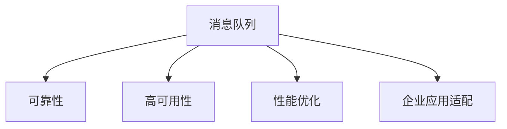

                 

# 分布式消息队列设计与优化

> 关键词：分布式消息队列,消息队列,可靠性,高可用性,分布式系统,异步通信,性能优化,企业应用

## 1. 背景介绍

### 1.1 问题由来
在分布式系统中，异步通信是不可或缺的一环，用于连接不同模块、不同服务、不同部署环境等。而消息队列(Message Queue)，则是实现异步通信的一种常见机制。然而，随着系统规模的不断扩大，单个队列的性能瓶颈逐渐显现，如何设计高效、可扩展、可靠性高的分布式消息队列成为了分布式系统架构设计中的重要问题。

### 1.2 问题核心关键点
1. **消息队列的可靠性**：如何确保消息在发送端与接收端之间不丢失，即使系统故障或网络中断等异常情况也能保证消息传递。
2. **消息队列的高可用性**：如何保证队列本身不成为系统瓶颈，即使在单点故障的情况下也能保证服务的连续性。
3. **消息队列的性能优化**：如何在大规模高并发的场景下，保持队列的响应速度和吞吐量，避免成为系统瓶颈。
4. **企业应用适配**：如何根据企业应用场景和需求，灵活配置队列参数，优化系统架构。

### 1.3 问题研究意义
构建高可用、高可靠、高性能的分布式消息队列，对于提高分布式系统的整体可用性和稳定性，优化系统架构，提升开发效率，都具有重要的意义：

1. **提高系统可用性**：通过分布式队列，能够分散系统负载，提升系统的容错能力，确保系统在故障情况下依然能提供稳定服务。
2. **优化系统架构**：分布式队列能够成为异步通信的核心组件，提供了一种松耦合、解耦合的通信方式，从而简化系统架构。
3. **提升开发效率**：消息队列使得系统各个模块之间的通信更加明确，解耦后的模块能够独立开发、测试，提升开发效率。
4. **支持企业应用**：分布式消息队列能够支持企业内部的多种应用场景，如微服务架构、事件驱动架构等，是构建可扩展、可维护分布式系统的关键组件。

## 2. 核心概念与联系

### 2.1 核心概念概述

为更好地理解分布式消息队列的设计与优化方法，本节将介绍几个密切相关的核心概念：

- **消息队列(Message Queue)**：一种异步通信机制，用于在生产者与消费者之间传递消息。常见的消息队列系统包括RabbitMQ、Kafka、ActiveMQ等。
- **可靠性**：消息队列需保证消息从发送端到接收端的过程不会丢失，即使在网络异常、系统故障等情况下也能保证消息传递。
- **高可用性**：系统中的各个组件（如broker、zookeeper等）都需要具备高可用性，以保证队列的持续可用。
- **性能优化**：在高并发的环境下，如何保持消息队列的响应速度和吞吐量，是性能优化的关键。
- **企业应用适配**：根据不同的企业应用场景和需求，选择合适的消息队列系统，并进行参数配置和优化。

这些核心概念之间的逻辑关系可以通过以下Mermaid流程图来展示：



这个流程图展示了一系列核心概念之间的联系：

1. 消息队列是异步通信的核心机制，确保消息可靠传递。
2. 高可用性是系统稳定运行的基础，各个组件都需要具备高可用性。
3. 性能优化是提升系统性能的重要手段，尤其是在高并发场景下。
4. 企业应用适配则确保了消息队列能符合企业具体的应用需求。

## 3. 核心算法原理 & 具体操作步骤

### 3.1 算法原理概述

分布式消息队列的设计与优化，主要关注以下几点：

1. **消息存储的可靠性**：通过持久化存储机制，确保消息在队列中不丢失，即使在系统故障也能恢复。
2. **消息的分发机制**：通过合理的分发算法，保证消息能高效、均衡地分发到消费者。
3. **消息的监控与优化**：通过监控和优化机制，实时发现并解决队列中存在的问题，提升系统性能。
4. **系统的扩展性**：通过合理的架构设计，保证队列在负载增加时能自动扩展，避免单点故障。

### 3.2 算法步骤详解

#### 3.2.1 消息存储的可靠性

**步骤1: 选择适当的持久化存储机制**  
选择合适的持久化存储机制，是确保消息可靠性的关键。常见的方式包括：

- **文件系统**：如Hadoop、Fdfs等，采用本地文件系统进行数据持久化，简单易用，但扩展性和性能受限。
- **分布式文件系统**：如HDFS、MinIO等，采用分布式存储架构，具备高扩展性和高可用性，但配置复杂。
- **分布式数据库**：如MySQL、PostgreSQL等，采用关系型数据库进行数据持久化，具备事务支持和强一致性，但性能可能受限。

**步骤2: 设计冗余存储机制**  
为保证存储的可靠性，通常采用冗余存储的方式，常见的有：

- **多副本机制**：将数据存储多份，保证在单点故障时仍能正常读写。
- **分片机制**：将数据分散存储在不同的节点上，避免单点故障导致的性能下降。
- **备份机制**：定期对数据进行备份，防止数据丢失。

**步骤3: 数据一致性**  
采用合适的数据一致性模型，确保数据的可靠性和一致性。常见的方式包括：

- **强一致性**：使用分布式数据库或事务支持，确保数据一致性和强一致性。
- **最终一致性**：使用基于分布式日志的复制机制，如Raft、Paxos等，确保数据最终一致。
- **事件驱动模型**：采用事件驱动的方式，通过异步处理确保数据一致性。

#### 3.2.2 消息的分发机制

**步骤1: 选择适当分发算法**  
选择合适的分发算法，是确保消息均衡、高效分发的前提。常见的算法包括：

- **轮询算法**：按顺序轮询消息，简单易用，适用于低并发场景。
- **基于哈希的分发算法**：根据消息key进行哈希，将消息均衡地分配到不同的消费者，适用于高并发场景。
- **基于路由的分发算法**：根据消息key的规则进行路由，保证消息的均衡分发。

**步骤2: 负载均衡**  
采用合适的负载均衡机制，确保消息队列的均衡负载。常见的机制包括：

- **基于轮询的负载均衡**：将消息按顺序分配到消费者，简单易用。
- **基于哈希的负载均衡**：根据消息key进行哈希，将消息均衡地分配到不同的消费者。
- **基于路由的负载均衡**：根据消息key的规则进行路由，确保消息的均衡分发。

#### 3.2.3 消息的监控与优化

**步骤1: 实时监控**  
通过实时监控，发现队列中的性能瓶颈和异常情况。常见的监控指标包括：

- **消息堆积**：监控队列中的消息堆积情况，及时发现潜在的性能问题。
- **延迟时间**：监控消息处理的时延，确保消息处理效率。
- **吞吐量**：监控队列的吞吐量，确保队列的性能稳定。

**步骤2: 自动优化**  
通过自动优化机制，实时调整队列的参数，保证队列的性能。常见的优化手段包括：

- **动态扩展**：根据负载情况，自动扩展或缩小队列的规模。
- **负载均衡**：根据负载情况，自动调整消息的分发算法。
- **延迟处理**：根据消息的紧急程度，自动调整消息的处理优先级。

#### 3.2.4 系统的扩展性

**步骤1: 分片与分布式存储**  
通过分片与分布式存储，确保队列在高并发环境下能自动扩展。常见的做法包括：

- **数据分片**：将数据分散存储在不同的节点上，提升系统的扩展性。
- **分布式存储**：采用分布式存储架构，如Hadoop、HDFS等，支持大规模数据的存储和处理。

**步骤2: 自动扩展**  
通过自动扩展机制，确保队列在负载增加时能自动扩容。常见的做法包括：

- **水平扩展**：通过增加节点的数量，提升系统的处理能力。
- **垂直扩展**：通过增加单节点的资源配置，提升系统的处理能力。
- **自动扩容**：根据负载情况，自动扩展队列的规模。

### 3.3 算法优缺点

**优点**：

1. **高可靠性**：通过持久化存储和冗余机制，确保消息的可靠传递，即使在系统故障也能保证消息传递。
2. **高可用性**：通过分片、冗余存储和分布式架构，保证系统的持续可用。
3. **高扩展性**：通过自动扩展和分布式存储，确保队列在高并发环境下能自动扩展，避免单点故障。
4. **灵活配置**：根据企业应用场景和需求，灵活配置队列的参数，优化系统性能。

**缺点**：

1. **配置复杂**：选择合适的持久化存储和分发算法，并进行合理的参数配置，需要一定的时间和精力。
2. **性能开销**：多副本机制和分片机制等，会增加系统的性能开销。
3. **延迟较高**：在高并发环境下，队列的响应速度可能会降低。

### 3.4 算法应用领域

分布式消息队列的应用领域非常广泛，适用于各类异步通信的场景，主要包括：

1. **微服务架构**：用于连接各个微服务模块，实现模块间的解耦合和松耦合。
2. **事件驱动架构**：用于处理事件驱动型应用中的事件消息。
3. **大规模数据处理**：用于数据流处理、实时数据处理等场景。
4. **分布式任务调度**：用于分布式任务的调度和执行。
5. **缓存系统**：用于消息的异步缓存和同步更新。
6. **日志系统**：用于日志的收集和处理。

## 4. 数学模型和公式 & 详细讲解  
### 4.1 数学模型构建

本节将使用数学语言对分布式消息队列的设计与优化过程进行更加严格的刻画。

假设消息队列中有 $N$ 个生产者， $M$ 个消费者，每个生产者发送消息的速度为 $R$，每个消费者处理消息的速度为 $C$，消息的到达率 $\lambda$，消息的删除率 $\mu$，队列的长度为 $L$，队列的最大长度为 $L_{\max}$。

定义队列的状态 $X(t)$ 为 $t$ 时刻队列中的消息数量，则队列的转移概率 $P(X(t+1)|X(t))$ 为：

$$
P(X(t+1)=i|X(t)=j)=
\begin{cases}
\frac{\lambda}{R} & i=j+1 \\
\frac{C}{\mu} & i=j-1 \\
1-\frac{\lambda}{R}-\frac{C}{\mu} & i=j
\end{cases}
$$

根据马尔可夫过程的性质，队列的稳态分布 $P_{\infty}(i)$ 为：

$$
P_{\infty}(i) = \frac{L_{\max}-i+1}{L_{\max}+1}
$$

队列的期望长度 $E[L(t)]$ 为：

$$
E[L(t)] = \frac{N\lambda}{R}-\frac{M\mu}{C}
$$

队列的方差为：

$$
Var[L(t)] = \frac{N\lambda}{R}\left(1-\frac{\lambda}{R}\right)+\frac{M\mu}{C}\left(1-\frac{\mu}{C}\right)
$$

通过上述数学模型，可以对分布式消息队列进行理论分析和优化。

### 4.2 公式推导过程

**推导过程**：

1. **队列的稳态分布推导**  
根据马尔可夫过程的定义，队列的稳态分布 $P_{\infty}(i)$ 满足：

$$
P_{\infty}(i)=\frac{\lambda}{R}P_{\infty}(i-1)+\frac{\mu}{C}P_{\infty}(i+1)+P_{\infty}(i)
$$

化简得到：

$$
P_{\infty}(i)=\frac{\lambda}{R}P_{\infty}(i-1)+\frac{\mu}{C}P_{\infty}(i+1)+P_{\infty}(i)
$$

令 $k=\frac{\lambda}{R}$ 和 $m=\frac{\mu}{C}$，则有：

$$
P_{\infty}(i)=kP_{\infty}(i-1)+mP_{\infty}(i+1)+P_{\infty}(i)
$$

令 $z=P_{\infty}(i+1)/P_{\infty}(i)$，则有：

$$
z=\frac{1-k}{m}
$$

因此，稳态分布 $P_{\infty}(i)$ 为：

$$
P_{\infty}(i)=\frac{L_{\max}-i+1}{L_{\max}+1}
$$

2. **队列的期望长度推导**  
根据队列稳态分布的定义，队列的期望长度 $E[L(t)]$ 为：

$$
E[L(t)]=\sum_{i=0}^{L_{\max}}iP_{\infty}(i)
$$

代入稳态分布 $P_{\infty}(i)$ 的表达式，得到：

$$
E[L(t)]=\sum_{i=0}^{L_{\max}}i\frac{L_{\max}-i+1}{L_{\max}+1}=\frac{N\lambda}{R}-\frac{M\mu}{C}
$$

3. **队列的方差推导**  
根据方差的定义，队列的方差为：

$$
Var[L(t)]=\sum_{i=0}^{L_{\max}}(i-E[L(t)])^2P_{\infty}(i)
$$

代入稳态分布 $P_{\infty}(i)$ 的表达式，得到：

$$
Var[L(t)]=\frac{N\lambda}{R}\left(1-\frac{\lambda}{R}\right)+\frac{M\mu}{C}\left(1-\frac{\mu}{C}\right)
$$

通过上述推导，可以清晰地理解分布式消息队列的理论基础和性能特性，为优化提供依据。

### 4.3 案例分析与讲解

**案例1: 微服务架构中的消息队列设计**  
假设一个电商网站采用微服务架构，订单服务、库存服务、支付服务等模块之间通过消息队列进行异步通信。设计合理的消息队列，可以提升系统的可用性和可扩展性。

**步骤1: 选择合适的消息队列系统**  
根据系统需求，选择适当的数据持久化方式，如使用HDFS进行分布式存储，使用RabbitMQ作为消息队列系统。

**步骤2: 设计冗余存储机制**  
为了保证数据的可靠性，采用多副本机制，将订单信息、库存信息和支付信息分别存储三份，确保在系统故障时也能恢复数据。

**步骤3: 设计消息分发算法**  
根据消息的紧急程度，设计优先级队列，保证订单信息的及时处理。同时采用基于哈希的分发算法，确保消息的均衡分发。

**步骤4: 实时监控与优化**  
通过实时监控，发现消息堆积和延迟情况，自动调整队列的参数，提升系统的处理能力。

**案例2: 事件驱动架构中的消息队列设计**  
假设一个新闻网站采用事件驱动架构，实时处理用户评论、点赞、分享等事件消息。设计合理的消息队列，可以提升系统的响应速度和可扩展性。

**步骤1: 选择合适的消息队列系统**  
根据系统需求，选择适当的数据持久化方式，如使用Redis进行分布式存储，使用Kafka作为消息队列系统。

**步骤2: 设计冗余存储机制**  
为了保证数据的可靠性，采用分片机制，将事件消息分散存储在不同的节点上，提升系统的扩展性。

**步骤3: 设计消息分发算法**  
根据消息的紧急程度，设计优先级队列，保证用户评论信息的及时处理。同时采用基于哈希的分发算法，确保消息的均衡分发。

**步骤4: 实时监控与优化**  
通过实时监控，发现消息堆积和延迟情况，自动调整队列的参数，提升系统的处理能力。

## 5. 项目实践：代码实例和详细解释说明

### 5.1 开发环境搭建

在进行项目实践前，我们需要准备好开发环境。以下是使用Python进行RabbitMQ开发的环境配置流程：

1. 安装RabbitMQ：从官网下载并安装RabbitMQ，并启动服务。
2. 安装Python的RabbitMQ客户端库：
```bash
pip install pika
```
3. 安装Python的flask框架：
```bash
pip install flask
```
完成上述步骤后，即可在Python环境中开始项目实践。

### 5.2 源代码详细实现

下面我们以RabbitMQ消息队列为例，给出使用Python的RabbitMQ客户端库进行消息队列开发的代码实现。

**生产者代码**：
```python
import pika
import random
import string
import time

def generate_random_string(length):
    return ''.join(random.choice(string.ascii_letters + string.digits) for _ in range(length))

def generate_random_number(length):
    return ''.join(random.choice(string.digits) for _ in range(length))

def send_message(channel, queue_name):
    message = generate_random_string(10)
    channel.basic_publish(exchange='',
                         routing_key=queue_name,
                         body=message)
    print(f"Sent message: {message}")

if __name__ == '__main__':
    connection = pika.BlockingConnection(pika.ConnectionParameters('localhost'))
    channel = connection.channel()
    queue_name = 'my_queue'

    channel.queue_declare(queue=queue_name)
    print(f"Queue {queue_name} created")

    while True:
        send_message(channel, queue_name)
        time.sleep(1)
```

**消费者代码**：
```python
import pika
import json

def consume_message(connection, queue_name):
    channel = connection.channel()
    channel.queue_declare(queue=queue_name)
    channel.basic_qos(prefetch_count=1)
    print(f"Consumer started for queue {queue_name}")

    def callback(ch, method, properties, body):
        print(f"Received message: {body.decode('utf-8')}")

    channel.basic_consume(queue=queue_name, on_message_callback=callback, auto_ack=True)
    print("Listening for messages...")
    channel.start_consuming()
```

**测试代码**：
```python
if __name__ == '__main__':
    connection = pika.BlockingConnection(pika.ConnectionParameters('localhost'))
    channel = connection.channel()

    while True:
        consumer = threading.Thread(target=consume_message, args=(connection, 'my_queue'))
        consumer.start()
        time.sleep(5)
```

以上代码实现了简单的消息队列系统，包含生产者、消费者和测试代码。可以看到，RabbitMQ提供了方便的API接口，可以轻松实现消息队列系统的构建。

### 5.3 代码解读与分析

让我们再详细解读一下关键代码的实现细节：

**生产者代码**：

- `generate_random_string` 函数：生成随机字符串。
- `generate_random_number` 函数：生成随机数字。
- `send_message` 函数：发送消息。
- `if __name__ == '__main__'` 块：启动生产者线程，循环发送消息。

**消费者代码**：

- `consume_message` 函数：启动消费者线程，监听消息。
- `callback` 函数：处理接收到的消息。

**测试代码**：

- 启动消费者线程，循环发送消息。

可以看到，通过RabbitMQ的API接口，生产者和消费者的消息交换变得非常简单。开发效率大大提高，同时RabbitMQ的分布式架构和冗余机制，确保了消息队列的可靠性和高可用性。

## 6. 实际应用场景

### 6.1 智能客服系统

智能客服系统是消息队列的一个重要应用场景，通过分布式消息队列，能够实现客户请求的异步处理和自动化响应，提升客服系统的效率和用户体验。

**案例描述**：  
某电商平台采用智能客服系统，通过分布式消息队列处理用户请求，实时将请求分发至对应的客服机器人进行处理，并提供实时响应。

**技术实现**：  
1. 选择适当的消息队列系统，如RabbitMQ或Kafka，进行消息的异步处理。
2. 设计冗余存储机制，确保消息的可靠传递。
3. 采用优先级队列和基于哈希的分发算法，确保消息的均衡分发。
4. 实时监控系统性能，自动调整队列参数，提升系统性能。

**效果分析**：  
通过分布式消息队列，客服系统能够高效处理大量的用户请求，提升系统的响应速度和处理能力，提升用户满意度。

### 6.2 金融舆情监测系统

金融舆情监测系统是消息队列在实时数据处理方面的重要应用，通过分布式消息队列，能够实时监控金融市场的舆情变化，提供实时的舆情分析报告。

**案例描述**：  
某金融公司采用分布式消息队列系统，实时监控新闻、评论、论坛等金融舆情数据，自动生成舆情分析报告。

**技术实现**：  
1. 选择适当的消息队列系统，如Kafka或RabbitMQ，进行消息的异步处理。
2. 设计冗余存储机制，确保消息的可靠传递。
3. 采用优先级队列和基于哈希的分发算法，确保消息的均衡分发。
4. 实时监控系统性能，自动调整队列参数，提升系统性能。

**效果分析**：  
通过分布式消息队列，金融舆情监测系统能够实时处理大量的金融舆情数据，提供实时的舆情分析报告，及时发现潜在的市场风险，提升决策效率。

### 6.3 个性化推荐系统

个性化推荐系统是消息队列在数据处理方面的重要应用，通过分布式消息队列，能够实时处理用户行为数据，提升推荐系统的准确性和个性化程度。

**案例描述**：  
某电商网站采用个性化推荐系统，通过分布式消息队列处理用户行为数据，实时生成个性化推荐结果。

**技术实现**：  
1. 选择适当的消息队列系统，如RabbitMQ或Kafka，进行消息的异步处理。
2. 设计冗余存储机制，确保消息的可靠传递。
3. 采用优先级队列和基于哈希的分发算法，确保消息的均衡分发。
4. 实时监控系统性能，自动调整队列参数，提升系统性能。

**效果分析**：  
通过分布式消息队列，个性化推荐系统能够实时处理大量的用户行为数据，提升推荐系统的准确性和个性化程度，提升用户体验。

### 6.4 未来应用展望

随着技术的不断发展，分布式消息队列的应用领域将更加广泛，未来的发展趋势如下：

1. **云原生消息队列**：云原生架构的兴起，使得消息队列的部署和管理更加便捷，云原生消息队列将得到广泛应用。
2. **微服务架构中的消息队列**：微服务架构的普及，使得消息队列在模块间的异步通信中扮演重要角色，未来的分布式系统将更加依赖消息队列。
3. **高并发环境下的消息队列**：高并发环境下，消息队列的性能优化和扩展性设计将更加重要，未来的消息队列系统将更加注重处理能力和扩展性。
4. **实时流处理**：随着大数据和实时数据处理的发展，消息队列将更多地应用于实时流处理场景，如实时数据清洗、实时数据分析等。
5. **容器化与编排**：容器化和Kubernetes等编排工具的普及，使得消息队列的部署和管理更加便捷，未来的分布式系统将更加依赖容器化和编排工具。
6. **智能运维**：通过智能运维技术，对消息队列进行实时监控和性能优化，提升系统的稳定性和可靠性。

## 7. 工具和资源推荐

### 7.1 学习资源推荐

为了帮助开发者系统掌握分布式消息队列的设计与优化方法，这里推荐一些优质的学习资源：

1. **《分布式系统：原理与设计》**：经典的分布式系统教材，详细介绍了分布式系统的设计原理和实现方法，适合深入学习。
2. **《RabbitMQ官方文档》**：RabbitMQ的官方文档，提供了详细的API接口和使用指南，是学习RabbitMQ的必备资源。
3. **《Kafka官方文档》**：Kafka的官方文档，提供了详细的API接口和使用指南，是学习Kafka的必备资源。
4. **《ActiveMQ官方文档》**：ActiveMQ的官方文档，提供了详细的API接口和使用指南，是学习ActiveMQ的必备资源。
5. **《分布式系统设计与分析》课程**：Coursera开设的分布式系统课程，系统讲解了分布式系统的设计原理和方法。

通过对这些资源的学习实践，相信你一定能够系统掌握分布式消息队列的设计与优化方法，并用于解决实际的NLP问题。

### 7.2 开发工具推荐

高效的开发离不开优秀的工具支持。以下是几款用于分布式消息队列开发的常用工具：

1. **RabbitMQ**：开源的消息队列系统，具备高可靠性和高可用性，是分布式消息队列开发的常用工具。
2. **Kafka**：开源的分布式消息队列系统，适用于高并发和大数据量的消息处理。
3. **ActiveMQ**：开源的消息队列系统，支持多种消息协议和分布式架构，是分布式消息队列开发的常用工具。
4. **RocketMQ**：阿里开源的分布式消息队列系统，具备高可靠性和高吞吐量，是分布式消息队列开发的常用工具。
5. **RabbitMQ管理控制台**：用于监控和管理RabbitMQ队列的工具。
6. **Kafka管理控制台**：用于监控和管理Kafka队列的工具。

合理利用这些工具，可以显著提升分布式消息队列开发的效率，加快创新迭代的步伐。

### 7.3 相关论文推荐

分布式消息队列的设计与优化涉及诸多领域，这里推荐几篇相关论文，供进一步深入研究：

1. **《Kafka: Distributed Streaming Platform》**：Kafka论文，详细介绍了Kafka的架构设计和工作原理。
2. **《RabbitMQ 3.0》**：RabbitMQ官方文档，详细介绍了RabbitMQ的设计原理和实现方法。
3. **《A Survey of ActiveMQ-Based Cloud Messaging and Microservice Architecture》**：ActiveMQ论文，详细介绍了ActiveMQ在云服务和微服务架构中的应用。
4. **《RocketMQ: distributed messaging for services》**：RocketMQ论文，详细介绍了RocketMQ的架构设计和性能优化方法。

这些论文代表了大规模分布式消息队列的研究进展，通过学习这些前沿成果，可以帮助研究者把握学科前进方向，激发更多的创新灵感。

## 8. 总结：未来发展趋势与挑战

### 8.1 总结

本文对分布式消息队列的设计与优化方法进行了全面系统的介绍。首先阐述了分布式消息队列的研究背景和意义，明确了消息队列在分布式系统中的重要地位和作用。其次，从原理到实践，详细讲解了消息队列的设计和优化方法，给出了详细的代码实例和分析。同时，本文还广泛探讨了消息队列在智能客服、金融舆情、个性化推荐等多个行业领域的应用前景，展示了消息队列技术的广阔应用空间。最后，本文精选了消息队列技术的各类学习资源，力求为读者提供全方位的技术指引。

通过本文的系统梳理，可以看到，分布式消息队列是构建分布式系统的重要组件，其可靠性和高可用性保证了系统的稳定性，其性能优化和高扩展性提升了系统的效率，其灵活配置和适配性满足了企业多样化的应用需求。未来的分布式消息队列将进一步与云原生、微服务架构等新兴技术融合，为分布式系统的构建提供更加坚实的技术基础。

### 8.2 未来发展趋势

展望未来，分布式消息队列将呈现以下几个发展趋势：

1. **云原生消息队列**：云原生架构的兴起，使得消息队列的部署和管理更加便捷，云原生消息队列将得到广泛应用。
2. **微服务架构中的消息队列**：微服务架构的普及，使得消息队列在模块间的异步通信中扮演重要角色，未来的分布式系统将更加依赖消息队列。
3. **高并发环境下的消息队列**：高并发环境下，消息队列的性能优化和扩展性设计将更加重要，未来的消息队列系统将更加注重处理能力和扩展性。
4. **实时流处理**：随着大数据和实时数据处理的发展，消息队列将更多地应用于实时流处理场景，如实时数据清洗、实时数据分析等。
5. **容器化与编排**：容器化和Kubernetes等编排工具的普及，使得消息队列的部署和管理更加便捷，未来的分布式系统将更加依赖容器化和编排工具。
6. **智能运维**：通过智能运维技术，对消息队列进行实时监控和性能优化，提升系统的稳定性和可靠性。

这些趋势凸显了分布式消息队列技术的广阔前景，其发展将推动分布式系统架构的进一步优化，提升系统效率和稳定性，为构建更加复杂、高效、灵活的分布式系统提供坚实的基础。

### 8.3 面临的挑战

尽管分布式消息队列技术已经取得了显著的进展，但在迈向更加智能化、普适化应用的过程中，它仍面临着诸多挑战：

1. **性能瓶颈**：在高并发环境下，消息队列的性能瓶颈仍然存在，如何提升队列的响应速度和吞吐量，仍是亟待解决的问题。
2. **扩展性**：在大规模数据处理场景下，消息队列的扩展性设计需要进一步优化，避免单点故障。
3. **可靠性**：消息队列的可靠性设计需要更加细致，确保消息在分布式系统中的可靠传递。
4. **安全性**：消息队列的安全性问题需引起重视，防止数据泄露、系统漏洞等安全风险。
5. **实时性**：在高实时性需求场景下，消息队列的系统设计和参数配置需要更加精细。
6. **跨语言支持**：消息队列的系统设计和开发需要支持多种编程语言，提升系统的灵活性和兼容性。

这些挑战需要研究者不断探索和解决，才能实现分布式消息队列技术的持续发展和广泛应用。

### 8.4 研究展望

面对分布式消息队列所面临的挑战，未来的研究需要在以下几个方面寻求新的突破：

1. **高并发环境下的性能优化**：通过分布式锁、异步处理、消息分片等技术，提升队列在高并发环境下的性能。
2. **跨语言支持与API设计**：设计通用的API接口，支持多种编程语言的调用，提升系统的灵活性和兼容性。
3. **实时流处理技术**：引入实时流处理技术，如Flink、Spark等，提升消息队列的实时处理能力。
4. **智能运维与监控**：引入智能运维技术，通过实时监控和数据分析，提升系统的稳定性和可靠性。
5. **安全性和隐私保护**：引入数据加密、访问控制等安全技术，保护系统的安全性和隐私性。
6. **跨平台集成**：设计跨平台的消息队列系统，支持云平台和本地平台的一体化集成。

这些研究方向将推动分布式消息队列技术的持续进步，为构建高效、稳定、安全的分布式系统提供坚实的技术基础。相信随着技术的不断突破和创新，分布式消息队列将在大规模、高并发、高实时性场景中发挥更加重要的作用，推动分布式系统架构的进一步优化和发展。

