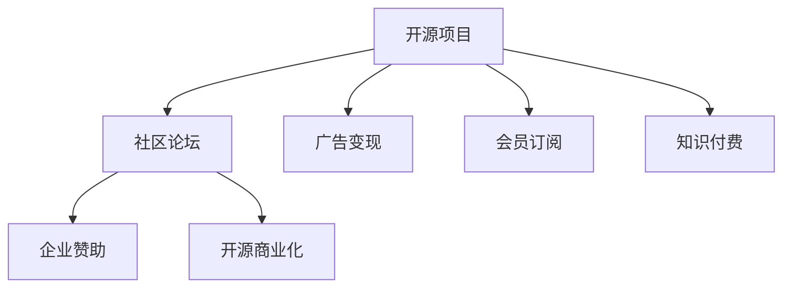

                 

# 创建开源项目的在线论坛：社区参与和盈利模式

## 1. 背景介绍

### 1.1 问题由来

随着开源技术的迅猛发展，在线论坛已成为开发者协作和交流的重要平台。开源项目的社区成员可以共享资源、讨论问题、分享代码，加速技术的迭代和创新。然而，大多数开源项目的论坛通常依赖社区志愿者的自发管理，存在诸多问题，如质量不高、更新缓慢、冷板凳等问题。如何通过商业化手段提升社区参与度和论坛活跃度，成为一个重要议题。

### 1.2 问题核心关键点

目前，社区论坛的商业化主要集中在以下几个方面：

- **广告变现**：通过展示商业广告，获取广告收入。
- **会员订阅**：为高级会员提供特定服务，如特权功能、专属讨论区等。
- **企业赞助**：与企业合作，提供定制化服务，共同构建行业社区。
- **知识付费**：提供高级课程、文档、视频等付费内容。
- **开源商业化**：通过商业化开源项目，获得更多资金支持。

这些商业化手段各有优劣，如何合理搭配，兼顾社区福利和商业利益，是构建高质量社区论坛的关键。

## 2. 核心概念与联系

### 2.1 核心概念概述

为更好地理解开源项目论坛的商业化方法，本节将介绍几个密切相关的核心概念：

- **开源项目**：指公开源代码的软件项目，通过贡献者共同协作，不断完善和优化代码。
- **社区论坛**：指基于网络的开源项目交流平台，开发者可以发布问题、讨论方案、分享代码等。
- **广告变现**：指通过展示商业广告，获取广告收入的方式。
- **会员订阅**：指为付费会员提供特定服务和特权，提升论坛吸引力。
- **企业赞助**：指企业与开源项目合作，提供资金和资源支持，构建商业级社区。
- **知识付费**：指提供专业化的课程、文档、视频等内容，通过付费机制保障内容质量。
- **开源商业化**：指通过商业化开源项目，获得更多资金和市场支持。

这些核心概念之间的逻辑关系可以通过以下Mermaid流程图来展示：



这个流程图展示开源项目、社区论坛与各种商业化手段之间的联系。

## 3. 核心算法原理 & 具体操作步骤

### 3.1 算法原理概述

开源项目论坛的商业化，本质上是将社区成员的价值变现，同时确保社区的健康发展和生态平衡。其核心算法原理主要基于以下几个方面：

- **用户行为分析**：通过数据分析了解社区成员的需求和行为，优化论坛功能和内容。
- **个性化推荐**：根据用户行为数据，推荐用户感兴趣的内容和活动，提升参与度。
- **广告投放**：通过算法模型预测用户群体，精准投放广告，提高广告转化率。
- **用户画像构建**：通过机器学习技术，建立用户画像，识别关键意见领袖，增强社区影响力。
- **会员权益管理**：使用会员管理系统，提供差异化服务，鼓励会员参与。

### 3.2 算法步骤详解

开源项目论坛的商业化流程包括以下关键步骤：

**Step 1: 用户行为分析**

- 收集用户行为数据，如发帖数、评论数、点赞数、浏览时间等。
- 使用数据分析工具对数据进行清洗和处理，提取关键特征。
- 通过机器学习模型对用户行为进行分类和预测，了解用户兴趣和行为模式。

**Step 2: 个性化推荐**

- 根据用户行为数据和兴趣标签，使用推荐算法生成个性化内容推荐列表。
- 实时更新推荐列表，动态调整推荐策略。
- 监测推荐效果，根据用户反馈调整推荐算法。

**Step 3: 广告投放**

- 使用广告投放平台，根据用户画像和行为数据，精准投放广告。
- 监测广告点击率和转化率，优化广告策略。
- 实时调整广告投放策略，避免过度打扰用户。

**Step 4: 会员权益管理**

- 设计会员体系，划分不同等级和特权。
- 使用会员管理系统，记录会员行为，发放会员权益。
- 监测会员参与度和留存率，优化会员激励策略。

**Step 5: 社区生态建设**

- 组织社区活动，如技术讨论、代码评审、黑客松等。
- 邀请行业专家和企业入驻，提升论坛权威性。
- 发布高质量内容，吸引更多用户参与。

通过上述步骤，可以有效地提升开源项目论坛的商业化和社区参与度。

### 3.3 算法优缺点

开源项目论坛的商业化方法具有以下优点：

- **多渠道变现**：广告、会员、企业赞助、知识付费等多种变现方式，最大化收益。
- **精准投放**：通过用户画像和行为分析，精准投放广告和内容，提升转化率。
- **社区粘性提升**：个性化推荐和会员权益，增强用户粘性和参与度。
- **生态优化**：社区活动和企业合作，构建健康的社区生态。

同时，这些方法也存在一些局限：

- **依赖数据质量**：需要高质量的用户行为数据，否则可能导致效果不佳。
- **技术门槛高**：需要机器学习、数据分析等技术支持，对开发团队有较高要求。
- **用户体验影响**：广告投放和推荐算法可能过度打扰用户，影响使用体验。
- **公平性问题**：会员体系可能产生会员间的隔阂，降低社区的包容性。

尽管存在这些局限，但基于用户行为分析和个性化推荐等技术的商业化手段，仍然为开源项目论坛的良性发展和商业变现提供了重要的参考。

### 3.4 算法应用领域

开源项目论坛的商业化方法，已经广泛应用于多种领域：

- **开源社区平台**：如GitHub、Apache JIRA等，通过商业化手段提升社区参与度，获得更多资源支持。
- **软件开发平台**：如Stack Overflow、Docker Hub等，通过广告和付费内容提升平台价值。
- **技术博客和论坛**：如InfoQ、Medium等，通过广告和会员订阅增加收入。
- **开源硬件社区**：如Arduino、Thingiverse等，通过企业赞助和知识付费吸引更多用户。

这些平台在商业化过程中，取得了显著的成效，成为开源社区和商业化探索的成功案例。

## 4. 数学模型和公式 & 详细讲解 & 举例说明

### 4.1 数学模型构建

本节将使用数学语言对开源项目论坛的商业化过程进行更加严格的刻画。

设社区成员数量为 $N$，用户行为数据为 $D=\{(x_i,y_i)\}_{i=1}^N$，其中 $x_i$ 表示用户行为特征，$y_i$ 表示用户行为标签（如活跃度、付费意愿等）。

定义用户行为分类模型为 $f(x)$，其训练目标为：

$$
\min_{f} \mathcal{L}(f, D) = \frac{1}{N}\sum_{i=1}^N \ell(f(x_i), y_i)
$$

其中 $\ell$ 为损失函数，$\mathcal{L}$ 为经验风险。通过最小化损失函数，训练分类模型 $f(x)$，预测用户行为标签。

### 4.2 公式推导过程

以广告投放为例，假设投放平台将广告投放给用户 $i$，产生的转化收益为 $c_i$，成本为 $k_i$。广告的净收益 $p_i$ 定义为：

$$
p_i = c_i - k_i
$$

假设投放平台有 $m$ 种广告，每种类别的广告总投放预算为 $B_j$，用户对广告 $j$ 的点击概率为 $\alpha_{i,j}$，转化率为 $\beta_{i,j}$，则广告的总净收益期望为：

$$
E[P] = \sum_{i=1}^N \sum_{j=1}^m p_{i,j} \alpha_{i,j} \beta_{i,j}
$$

其中 $p_{i,j} = c_{i,j} - k_{i,j}$。为了最大化广告总净收益，需要找到最优的广告投放策略，即最大化 $E[P]$。

通过拉格朗日乘数法，将问题转化为约束优化问题，引入拉格朗日乘子 $\lambda_j$，得到：

$$
\max_{\{\alpha_{i,j}, \beta_{i,j}\}} \sum_{i=1}^N \sum_{j=1}^m (c_{i,j} - k_{i,j}) \alpha_{i,j} \beta_{i,j} - \sum_{j=1}^m \lambda_j (B_j - \sum_{i=1}^N \alpha_{i,j})
$$

通过求解上述优化问题，可以得到最优的广告投放策略。

### 4.3 案例分析与讲解

以下以GitHub为例，分析其商业化策略和效果：

**GitHub的会员体系**

GitHub通过提供免费的公共仓库和代码托管服务，吸引了大量开发者和项目入驻。同时，GitHub还设计了多种会员计划，如：

- **Free Plan**：免费的基础服务，每月有有限的存储容量和私有仓库数量。
- **Pro Plan**：付费会员计划，提供无限存储和私有仓库数量，以及更多高级功能。
- **Team Plan**：企业版计划，提供定制化服务和管理工具。

通过会员体系，GitHub实现了多样化的商业变现，吸引了大量付费会员和企业用户。

**GitHub的广告变现**

GitHub在网页和移动应用上展示大量广告，通过精准投放和转化率优化，获取可观的广告收入。GitHub的广告系统基于用户行为数据和机器学习模型，对不同用户群体进行精准投放，最大化广告转化率和收益。

**GitHub的社区活动**

GitHub定期举办开发者大会、黑客松、技术研讨等社区活动，提升社区活跃度和影响力。GitHub通过邀请行业专家和企业参与，提升了社区的专业性和权威性，吸引了更多开发者入驻。

通过会员体系、广告变现和社区活动等综合手段，GitHub成功实现了开源项目的商业化，成为全球最大的开源社区平台。

## 5. 项目实践：代码实例和详细解释说明

### 5.1 开发环境搭建

在进行开源项目论坛的商业化开发前，我们需要准备好开发环境。以下是使用Python进行Flask开发的环境配置流程：

1. 安装Anaconda：从官网下载并安装Anaconda，用于创建独立的Python环境。

2. 创建并激活虚拟环境：
```bash
conda create -n flask-env python=3.8 
conda activate flask-env
```

3. 安装Flask：
```bash
pip install Flask
```

4. 安装各类工具包：
```bash
pip install numpy pandas scikit-learn matplotlib tqdm jupyter notebook ipython
```

完成上述步骤后，即可在`flask-env`环境中开始商业化开发实践。

### 5.2 源代码详细实现

下面以构建一个简单的开源项目论坛为例，给出使用Flask框架实现个性化推荐和广告投放的Python代码实现。

首先，定义推荐算法函数：

```python
from sklearn.ensemble import RandomForestClassifier

# 用户行为数据
X = # 用户行为特征
y = # 用户行为标签

# 训练分类模型
model = RandomForestClassifier()
model.fit(X, y)

# 预测用户行为标签
def predict_user_label(user_feature):
    return model.predict(user_feature)

# 推荐算法
def recommend_content(user_id):
    user_feature = # 获取用户行为特征
    user_label = predict_user_label(user_feature)
    # 根据用户标签推荐内容
    return content_list
```

然后，定义广告投放算法函数：

```python
from sklearn.linear_model import LogisticRegression

# 用户广告数据
X = # 用户行为特征
y = # 广告点击标签

# 训练点击预测模型
model = LogisticRegression()
model.fit(X, y)

# 预测广告点击概率
def predict_click_probability(user_feature, ad_feature):
    return model.predict_proba([(user_feature, ad_feature)])

# 广告投放算法
def choose_ad(user_id, ad_data):
    user_feature = # 获取用户行为特征
    ad_features = ad_data  # 广告特征
    click_probability = predict_click_probability(user_feature, ad_features)
    # 选择点击概率最高的广告进行投放
    return max(ads, key=click_probability[0])
```

最后，实现推荐和投放的接口：

```python
from flask import Flask, request, jsonify

app = Flask(__name__)

@app.route('/recommend', methods=['POST'])
def recommend():
    user_id = request.json.get('user_id')
    return jsonify(recommend_content(user_id))

@app.route('/choose_ad', methods=['POST'])
def choose_ad():
    user_id = request.json.get('user_id')
    ad_data = request.json.get('ads')
    return jsonify(choose_ad(user_id, ad_data))

if __name__ == '__main__':
    app.run(debug=True)
```

这就是一个简单的开源项目论坛推荐和广告投放的Flask应用实现。可以看到，利用机器学习算法和Flask框架，可以方便地实现个性化推荐和广告投放功能。

### 5.3 代码解读与分析

让我们再详细解读一下关键代码的实现细节：

**推荐算法函数**：
- 使用随机森林分类器训练用户行为分类模型，用于预测用户行为标签。
- 定义 `predict_user_label` 函数，根据用户行为特征预测标签。
- 根据标签推荐相关内容，返回推荐列表。

**广告投放算法函数**：
- 使用逻辑回归模型训练广告点击预测模型，用于预测广告点击概率。
- 定义 `predict_click_probability` 函数，根据用户行为特征和广告特征预测点击概率。
- 定义 `choose_ad` 函数，选择点击概率最高的广告进行投放。

**Flask应用**：
- 使用Flask框架定义 `/recommend` 和 `/choose_ad` 两个接口，接收用户ID和相应数据，返回推荐内容和广告投放结果。
- 调用推荐和广告投放函数，返回JSON格式的响应数据。

**运行结果展示**：
- 运行上述代码，启动Flask应用，通过 `curl` 或浏览器访问 `http://localhost:5000/recommend` 和 `http://localhost:5000/choose_ad` 接口，可以获取推荐内容和广告投放结果。

可以看到，通过Flask框架和机器学习算法，可以方便地实现开源项目论坛的推荐和广告投放功能。开发者可以根据具体需求，进一步扩展和优化这些功能，构建更加复杂和高效的开源社区平台。

## 6. 实际应用场景

### 6.1 智能客服系统

基于开源项目论坛的商业化手段，智能客服系统可以在开发者社区中应用。智能客服系统可以自动化回答开发者提出的问题，加速问题解决，提高社区参与度。

在技术实现上，可以建立开发者社区论坛，收集开发者提出的问题和解决方案。然后通过广告和会员订阅等方式获取收入，用于维护和升级智能客服系统。智能客服系统可以基于用户行为数据和机器学习模型，不断优化回答效果，提供高质量的客户服务。

### 6.2 教育培训平台

开源项目论坛的商业化方法也可以应用于教育培训平台。教育培训平台可以提供高质量的编程课程、技术文档等资源，通过广告和付费订阅获取收入。同时，可以组织开发者社区活动，提升平台活跃度。

在技术实现上，可以建立开发者社区论坛，收集开发者和学生提出的问题，组织技术讨论和培训活动。通过会员订阅和广告投放等方式获取收入，用于平台运营和资源开发。

### 6.3 医疗健康平台

开源项目论坛的商业化手段同样可以应用于医疗健康领域。医疗健康平台可以提供健康管理、在线咨询等服务，通过广告和付费订阅获取收入。同时，可以组织医疗健康社区活动，提升平台影响力。

在技术实现上，可以建立医疗健康社区论坛，收集医生和患者的医疗健康问题。通过广告和会员订阅等方式获取收入，用于平台运营和资源开发。同时，可以组织在线医疗咨询、健康知识分享等社区活动，提升平台影响力。

## 7. 工具和资源推荐

### 7.1 学习资源推荐

为了帮助开发者系统掌握开源项目论坛的商业化方法，这里推荐一些优质的学习资源：

1. **《Flask Web Development with Python》书籍**：全面介绍了如何使用Flask框架进行Web开发，包括Web应用设计、数据处理等基础内容。
2. **《Machine Learning with Python》书籍**：介绍使用Python进行机器学习建模的基础知识和常用算法。
3. **Kaggle在线课程**：提供丰富的数据科学和机器学习竞赛和实战项目，帮助开发者提升实践能力。
4. **Coursera在线课程**：提供高质量的数据科学和机器学习课程，由顶尖大学和专家授课。
5. **Hugging Face官方文档**：提供详细的Transformer和GPT等大模型应用文档，帮助开发者高效使用这些工具。

通过对这些资源的学习实践，相信你一定能够快速掌握开源项目论坛的商业化方法和技术实现。

### 7.2 开发工具推荐

高效的开发离不开优秀的工具支持。以下是几款用于开源项目论坛开发的常用工具：

1. **Flask**：基于Python的开源Web框架，灵活的路由设计和模板引擎，适合构建Web应用。
2. **MySQL**：常用的关系型数据库，提供高效的数据存储和查询功能。
3. **Redis**：高性能的内存数据库，适合缓存和实时数据处理。
4. **Docker**：容器化技术，便于应用程序的部署和扩展。
5. **TensorFlow**：谷歌开源的深度学习框架，支持复杂的机器学习模型训练。
6. **GitHub**：全球最大的开源社区平台，提供代码托管和社区活动支持。

合理利用这些工具，可以显著提升开源项目论坛的开发效率，加快创新迭代的步伐。

### 7.3 相关论文推荐

开源项目论坛的商业化技术源于学界的持续研究。以下是几篇奠基性的相关论文，推荐阅读：

1. **《Growing an Open-Source Ecosystem with Crowdsourced Governance》**：研究开源社区的治理模型，提出基于社区贡献的治理机制，提升社区活力。
2. **《Platform-as-a-Service for Software Development》**：讨论软件平台的基础设施支持，通过云服务提升开发效率。
3. **《Cloud Computing: Concepts, Technology and Architecture》**：介绍云计算技术和架构，提升平台的可扩展性和稳定性。
4. **《Data-Driven Customer Experience: Understanding and Applying Customer Analytics》**：研究数据驱动的客户体验设计，提升平台的用户体验。
5. **《Adaptive Mining of Opinion Forums》**：探索基于论坛内容的情感分析和用户行为分析，提升社区的质量和活跃度。

这些论文代表开源项目论坛商业化技术的发展脉络。通过学习这些前沿成果，可以帮助研究者把握学科前进方向，激发更多的创新灵感。

## 8. 总结：未来发展趋势与挑战

### 8.1 总结

本文对开源项目论坛的商业化方法进行了全面系统的介绍。首先阐述了开源项目和社区论坛的研究背景和商业化意义，明确了通过商业化手段提升社区参与度和论坛活跃度的重要价值。其次，从原理到实践，详细讲解了开源项目论坛的商业化数学模型和关键步骤，给出了商业化开发实践的完整代码实例。同时，本文还广泛探讨了商业化方法在智能客服、教育培训、医疗健康等多个行业领域的应用前景，展示了开源项目论坛的巨大潜力。此外，本文精选了商业化技术的各类学习资源，力求为读者提供全方位的技术指引。

通过本文的系统梳理，可以看到，开源项目论坛的商业化方法正在成为开源社区的重要变现手段，极大地提升了社区的活跃度和参与度，为开源技术的发展提供了新的方向。未来，伴随商业化手段的不断演进，开源社区的商业化将更加多样化和高效化，为开源技术的普及和应用带来更多机遇。

### 8.2 未来发展趋势

展望未来，开源项目论坛的商业化将呈现以下几个发展趋势：

1. **社区生态建设**：社区生态将成为商业化发展的重要基础，通过社区活动、技术讨论等方式，提升社区凝聚力和活力。
2. **用户画像应用**：利用用户行为数据和机器学习模型，建立用户画像，实现个性化推荐和精准营销。
3. **多渠道变现**：除了广告和会员订阅，还将探索更多的商业化手段，如企业赞助、知识付费等。
4. **数据驱动运营**：通过大数据分析和人工智能技术，实现社区运营的智能化和自动化。
5. **平台集成优化**：通过API集成和第三方服务，提供一站式开发和运营解决方案。
6. **国际化扩展**：通过本地化适配和国际化运营，拓展全球市场。

以上趋势凸显了开源项目论坛商业化技术的广阔前景。这些方向的探索发展，必将进一步提升开源社区的商业化水平，为开源技术的普及和应用带来更多机遇。

### 8.3 面临的挑战

尽管开源项目论坛的商业化技术已经取得了显著成效，但在迈向更加智能化、普适化应用的过程中，它仍面临着诸多挑战：

1. **数据隐私问题**：用户行为数据的收集和使用，需要严格遵守数据隐私法规，如GDPR等。
2. **平台安全问题**：社区论坛的安全问题，如数据泄露、钓鱼攻击等，需要持续关注和加强防护。
3. **用户体验影响**：广告和推荐算法可能过度打扰用户，影响使用体验。
4. **公平性问题**：会员体系可能产生会员间的隔阂，降低社区的包容性。
5. **技术门槛高**：需要机器学习、数据分析等技术支持，对开发团队有较高要求。

尽管存在这些挑战，但通过合理设计和管理，开源项目论坛的商业化技术仍然可以发挥其独特优势，构建健康的社区生态，实现可持续发展。

### 8.4 研究展望

面向未来，开源项目论坛的商业化技术还需要在其他方向上寻求新的突破：

1. **数据融合技术**：将社区论坛与第三方数据源进行融合，提升数据的全面性和准确性。
2. **区块链技术**：通过区块链技术，提升社区的透明度和信任度。
3. **联邦学习**：在保护用户隐私的前提下，通过联邦学习技术，提升社区数据利用效率。
4. **个性化推荐算法**：引入更多先进的推荐算法，如协同过滤、深度学习等，提升推荐效果。
5. **多模态融合**：将文本、图像、视频等多种数据源进行融合，提升社区内容的多样性和丰富度。
6. **用户行为分析**：引入更多用户行为分析方法，提升用户画像的准确性和完备性。

这些研究方向将为开源项目论坛的商业化提供新的思路和技术支持，推动开源社区的商业化进程向更深层次发展。

## 9. 附录：常见问题与解答

**Q1：如何评估开源项目论坛的商业化效果？**

A: 开源项目论坛的商业化效果可以从以下几个方面进行评估：

1. **用户参与度**：通过活跃度、发帖数、评论数等指标，评估用户参与度。
2. **广告点击率**：通过广告点击率、转化率等指标，评估广告效果。
3. **会员增长率**：通过会员数量和增长率，评估会员订阅效果。
4. **社区活动质量**：通过活动参与人数、评价等指标，评估社区活动效果。

通过综合这些指标，可以全面评估开源项目论坛的商业化效果，并进行优化和改进。

**Q2：如何提升开源项目论坛的广告效果？**

A: 提升开源项目论坛的广告效果可以从以下几个方面进行：

1. **用户画像**：利用用户行为数据和机器学习模型，建立用户画像，实现精准投放。
2. **广告创意**：设计有吸引力的广告创意，提升用户点击率。
3. **广告预算分配**：合理分配广告预算，避免过度投放。
4. **广告形式多样化**：采用视频、横幅、文字等多种广告形式，提升广告效果。
5. **用户反馈**：通过用户反馈和点击数据，及时优化广告策略。

通过这些措施，可以显著提升开源项目论坛的广告效果，增加商业化收入。

**Q3：如何设计有效的会员体系？**

A: 设计有效的会员体系可以从以下几个方面进行：

1. **会员分级**：根据会员的贡献度和付费意愿，设计不同等级的会员体系。
2. **会员特权**：为不同等级的会员提供相应的特权，如优先访问、专属频道等。
3. **会员激励**：通过积分、徽章等激励机制，鼓励会员积极参与。
4. **会员管理**：使用会员管理系统，记录会员行为，发放会员权益。
5. **会员反馈**：通过会员反馈，优化会员体系，提升会员满意度。

通过这些措施，可以设计有效的会员体系，提升会员参与度和满意度，增加商业化收入。

**Q4：如何构建健康的开源项目论坛社区生态？**

A: 构建健康的开源项目论坛社区生态可以从以下几个方面进行：

1. **社区活动**：定期举办技术讨论、代码评审、黑客松等社区活动，提升社区参与度。
2. **社区规范**：制定社区规范和行为准则，引导社区成员积极参与。
3. **专家入驻**：邀请行业专家和企业入驻，提升社区的专业性和权威性。
4. **高质量内容**：发布高质量的编程课程、技术文档等资源，提升社区价值。
5. **社区治理**：建立社区治理机制，确保社区健康发展。

通过这些措施，可以构建健康的开源项目论坛社区生态，提升社区的吸引力和活跃度。

---

作者：禅与计算机程序设计艺术 / Zen and the Art of Computer Programming

