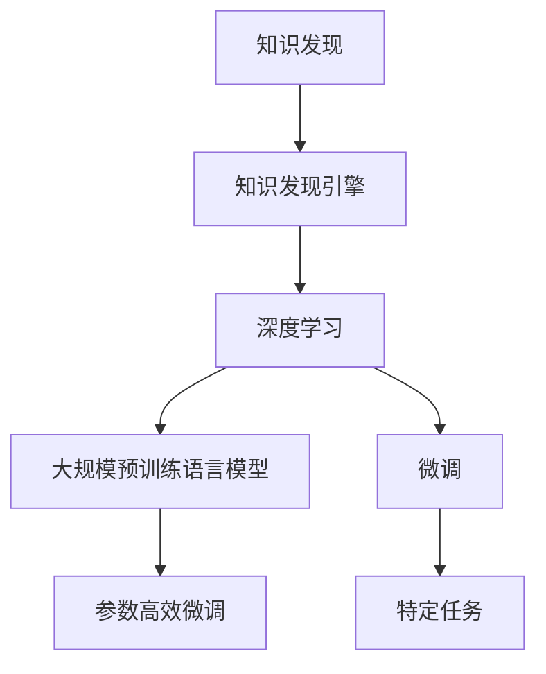

                 

# 利用AI技术提升知识发现引擎效率

> 关键词：知识发现,引擎效率,人工智能,算法优化,机器学习

## 1. 背景介绍

### 1.1 问题由来

在当今信息爆炸的时代，海量的文本数据已成为企业和研究人员获取知识的主要来源。如何从这些数据中快速高效地挖掘有价值的信息，是知识发现（Knowledge Discovery, KD）的关键挑战。传统的知识发现方法大多依赖人工提取，不仅耗时耗力，而且难以应对海量数据的处理需求。随着人工智能技术的发展，自动化知识发现引擎应运而生，通过智能算法从文本中自动提取、分类、关联和挖掘知识，极大地提升了知识发现的效率和精度。

### 1.2 问题核心关键点

知识发现引擎的核心在于通过机器学习算法，自动分析文本数据并从中提取有价值的信息。这一过程主要包括文本预处理、特征提取、模型训练和知识呈现等步骤。传统知识发现引擎通常采用基于规则或浅层机器学习的方法，但面对大规模数据和高维度特征，其效率和精度仍显不足。当前，基于深度学习的大规模预训练语言模型，如BERT、GPT等，已成为提升知识发现效率的有力工具。通过预训练和微调，这些模型能够学习到丰富的语言表示，并在特定任务上表现出色，显著加速了知识发现的进程。

### 1.3 问题研究意义

利用AI技术提升知识发现引擎的效率，对于企业和研究人员来说，具有重要意义：

1. **提升知识发现速度**：在经济、学术、科技等多个领域，研究人员需要迅速响应市场和技术变化，如何快速高效地获取和分析数据，成为了决策的关键。自动化知识发现引擎可以大大缩短从数据获取到知识产出的时间周期。
2. **提高知识发现精度**：传统的知识发现方法通常依赖于人工标注，容易受到主观偏差的影响。AI技术能够自动学习文本中的隐含知识，减少人为因素的干扰，提高发现结果的客观性和准确性。
3. **拓展应用范围**：深度学习模型能够处理大规模高维度的数据，适用于更多领域的知识发现任务，如金融分析、医学研究、市场预测等。
4. **促进技术创新**：自动化知识发现引擎的开发和应用，能够加速知识的积累和传播，推动技术创新和进步。

## 2. 核心概念与联系

### 2.1 核心概念概述

为了更好地理解利用AI技术提升知识发现引擎效率的方法，本节将介绍几个关键概念：

- **知识发现（Knowledge Discovery, KD）**：从数据中自动挖掘、提炼和总结有价值的信息和知识的过程。知识发现技术广泛应用于商业智能、大数据分析、生物信息学等领域。
- **知识发现引擎（Knowledge Discovery Engine, KDE）**：一种自动化的知识发现工具，能够从大规模文本数据中提取、分类和关联知识，并通过可视化的方式呈现。
- **深度学习（Deep Learning, DL）**：一种基于神经网络的机器学习方法，能够处理大规模高维度的数据，广泛应用于图像、语音、文本等领域。
- **大规模预训练语言模型（Large Pre-trained Language Model, PLM）**：如BERT、GPT等，通过在大规模无标签文本数据上进行预训练，学习到丰富的语言表示，适用于各种自然语言处理任务。
- **微调（Fine-Tuning）**：在大规模预训练模型基础上，通过特定任务的标注数据进行有监督学习，进一步优化模型在该任务上的性能。
- **参数高效微调（Parameter-Efficient Fine-Tuning, PEFT）**：仅更新模型的一小部分参数，避免大规模参数更新导致的计算资源消耗。

这些核心概念之间的联系可以通过以下Mermaid流程图来展示：



这个流程图展示了大规模预训练语言模型通过微调优化特定任务，同时利用参数高效微调方法降低计算资源消耗，最终在知识发现引擎中的应用。

## 3. 核心算法原理 & 具体操作步骤

### 3.1 算法原理概述

利用AI技术提升知识发现引擎效率的根本在于通过深度学习算法，自动从文本数据中提取有价值的信息和知识。核心流程包括数据预处理、特征提取、模型训练和结果展示等步骤。本节将详细介绍这一过程的算法原理。

1. **数据预处理**：对原始文本数据进行清洗、分词、去停用词等预处理操作，构建适用于深度学习模型的输入格式。
2. **特征提取**：利用预训练语言模型，如BERT、GPT等，从文本中自动提取高维向量表示，作为模型的输入特征。
3. **模型训练**：使用深度学习模型（如Transformer、LSTM等）在标注数据上进行有监督学习，学习文本中的知识表示。
4. **结果展示**：通过可视化的方式，将知识发现结果呈现给用户，便于理解和应用。

### 3.2 算法步骤详解

基于深度学习的知识发现引擎，通常采用以下步骤进行操作：

**Step 1: 数据预处理**

- **文本清洗**：去除HTML标签、特殊字符等干扰信息，对文本进行标准化处理。
- **分词和词性标注**：将文本切分成单词或词组，并进行词性标注，便于后续特征提取。
- **停用词过滤**：去除高频但无意义的停用词，如“的”、“是”等，减少特征维度。

**Step 2: 特征提取**

- **预训练语言模型**：如BERT、GPT等，通过在大规模无标签文本数据上进行预训练，学习到丰富的语言表示。
- **高维向量表示**：将预训练模型的输出作为高维向量表示，用于模型的输入特征。

**Step 3: 模型训练**

- **选择模型架构**：如Transformer、LSTM等，根据任务需求选择合适的深度学习模型。
- **设置训练参数**：如学习率、批大小、迭代轮数等，确保模型在合理的时间内收敛。
- **标注数据准备**：收集和标注适用于当前任务的训练数据，通常包括文本和标签。

**Step 4: 结果展示**

- **可视化工具**：如Tableau、Power BI等，将知识发现结果进行可视化展示，便于用户理解和应用。
- **交互式展示**：通过交互式界面，允许用户动态调整查询参数，实时获取搜索结果。

### 3.3 算法优缺点

基于深度学习的知识发现引擎，具有以下优点：

1. **高效性**：能够自动化处理大规模高维度的数据，快速获取知识发现结果。
2. **高精度**：深度学习模型能够自动学习文本中的隐含知识，减少人为因素的干扰，提高发现结果的客观性和准确性。
3. **灵活性**：适用于更多领域的知识发现任务，如金融分析、医学研究、市场预测等。

同时，该方法也存在一定的局限性：

1. **数据依赖**：依赖高质量的标注数据进行模型训练，标注成本较高。
2. **计算资源消耗大**：深度学习模型通常需要较大的计算资源，训练和推理过程耗时较长。
3. **模型可解释性不足**：深度学习模型通常被视为"黑盒"系统，难以解释其内部工作机制和决策逻辑。
4. **泛化能力有限**：模型在标注数据分布外的新数据上的泛化能力较弱，可能出现过拟合现象。

尽管存在这些局限性，但基于深度学习的知识发现引擎，仍是大规模文本数据自动化处理的有力工具，正逐步取代传统的人工知识发现方法。

### 3.4 算法应用领域

基于深度学习的知识发现引擎，已经在金融分析、市场预测、医疗研究、法律分析等多个领域得到广泛应用，提升了数据处理的效率和精度：

- **金融分析**：自动分析金融市场数据，预测股票价格走势，辅助投资决策。
- **市场预测**：通过分析市场趋势和消费者行为，预测未来市场动态，为企业提供决策支持。
- **医疗研究**：自动分析医学文献，提取疾病相关的知识和信息，辅助医生诊断和治疗。
- **法律分析**：自动分析法律文件，提取合同条款和条款之间的关联，提高法律咨询的效率。

## 4. 数学模型和公式 & 详细讲解 & 举例说明

### 4.1 数学模型构建

本节将使用数学语言对基于深度学习的知识发现引擎进行严格的刻画。

假设知识发现任务为文本分类，输入为 $x$，标签为 $y$，模型的输出为 $p(y|x)$。模型的目标是最小化交叉熵损失函数：

$$
\mathcal{L} = -\frac{1}{N}\sum_{i=1}^N \sum_{y=1}^C y\log p(y|x)
$$

其中，$N$ 为样本数量，$C$ 为类别数量。

### 4.2 公式推导过程

以二分类任务为例，推导模型的训练过程。

假设模型 $M$ 的输出为 $p(y|x)$，则二分类交叉熵损失函数为：

$$
\ell(y,p(y|x)) = -[y\log p(y|x)+(1-y)\log(1-p(y|x))]
$$

将其代入经验风险公式，得：

$$
\mathcal{L} = -\frac{1}{N}\sum_{i=1}^N \sum_{j=1}^2 \ell(y_j,p(y_j|x_i))
$$

在得到损失函数梯度后，带入优化器进行更新：

$$
\theta \leftarrow \theta - \eta \nabla_{\theta}\mathcal{L}(\theta) - \eta\lambda\theta
$$

其中，$\eta$ 为学习率，$\lambda$ 为正则化系数，$\theta$ 为模型参数。

### 4.3 案例分析与讲解

以下以情感分析任务为例，展示基于深度学习的知识发现引擎的实现过程。

假设模型 $M$ 为BERT，输入为电影评论，标签为情感极性（正面或负面）。首先，将原始评论进行分词和清洗，得到预处理后的文本序列。然后，使用BERT预训练模型对文本序列进行编码，得到高维向量表示。接着，使用softmax函数将高维向量表示映射为情感极性的概率分布。最后，在标注数据上进行有监督学习，优化模型参数。

```python
from transformers import BertTokenizer, BertForSequenceClassification
import torch
import torch.nn as nn

tokenizer = BertTokenizer.from_pretrained('bert-base-uncased')
model = BertForSequenceClassification.from_pretrained('bert-base-uncased', num_labels=2)

def compute_loss(model, input_ids, attention_mask, labels):
    outputs = model(input_ids, attention_mask=attention_mask)
    logits = outputs[0]
    loss_fct = nn.CrossEntropyLoss()
    loss = loss_fct(logits.view(-1, 2), labels.view(-1))
    return loss

def train_epoch(model, dataset, batch_size, optimizer):
    dataloader = torch.utils.data.DataLoader(dataset, batch_size=batch_size, shuffle=True)
    model.train()
    epoch_loss = 0
    for batch in dataloader:
        input_ids = batch['input_ids'].to(device)
        attention_mask = batch['attention_mask'].to(device)
        labels = batch['labels'].to(device)
        model.zero_grad()
        loss = compute_loss(model, input_ids, attention_mask, labels)
        loss.backward()
        optimizer.step()
        epoch_loss += loss.item()
    return epoch_loss / len(dataloader)

# 数据准备
train_dataset = # 训练集数据
dev_dataset = # 验证集数据
test_dataset = # 测试集数据

# 训练过程
epochs = 5
batch_size = 16

device = torch.device('cuda') if torch.cuda.is_available() else torch.device('cpu')
model.to(device)

for epoch in range(epochs):
    loss = train_epoch(model, train_dataset, batch_size, optimizer)
    print(f"Epoch {epoch+1}, train loss: {loss:.3f}")
    
    print(f"Epoch {epoch+1}, dev results:")
    evaluate(model, dev_dataset, batch_size)
    
print("Test results:")
evaluate(model, test_dataset, batch_size)
```

以上就是基于深度学习的知识发现引擎在情感分析任务上的代码实现。可以看到，借助BERT预训练模型，知识发现引擎能够快速高效地从电影评论中提取情感极性，实现自动化知识发现。

## 5. 项目实践：代码实例和详细解释说明

### 5.1 开发环境搭建

在进行知识发现引擎的开发前，我们需要准备好开发环境。以下是使用Python进行PyTorch开发的环境配置流程：

1. 安装Anaconda：从官网下载并安装Anaconda，用于创建独立的Python环境。

2. 创建并激活虚拟环境：
```bash
conda create -n pytorch-env python=3.8 
conda activate pytorch-env
```

3. 安装PyTorch：根据CUDA版本，从官网获取对应的安装命令。例如：
```bash
conda install pytorch torchvision torchaudio cudatoolkit=11.1 -c pytorch -c conda-forge
```

4. 安装Transformers库：
```bash
pip install transformers
```

5. 安装各类工具包：
```bash
pip install numpy pandas scikit-learn matplotlib tqdm jupyter notebook ipython
```

完成上述步骤后，即可在`pytorch-env`环境中开始知识发现引擎的开发。

### 5.2 源代码详细实现

这里我们以情感分析任务为例，给出使用Transformers库对BERT模型进行微调的PyTorch代码实现。

首先，定义情感分析任务的数据处理函数：

```python
from transformers import BertTokenizer
from torch.utils.data import Dataset
import torch

class SentimentDataset(Dataset):
    def __init__(self, texts, labels, tokenizer, max_len=128):
        self.texts = texts
        self.labels = labels
        self.tokenizer = tokenizer
        self.max_len = max_len
        
    def __len__(self):
        return len(self.texts)
    
    def __getitem__(self, item):
        text = self.texts[item]
        label = self.labels[item]
        
        encoding = self.tokenizer(text, return_tensors='pt', max_length=self.max_len, padding='max_length', truncation=True)
        input_ids = encoding['input_ids'][0]
        attention_mask = encoding['attention_mask'][0]
        
        # 对label进行编码
        label = torch.tensor(label, dtype=torch.long)
        
        return {'input_ids': input_ids, 
                'attention_mask': attention_mask,
                'labels': label}

# 标签与id的映射
label2id = {'positive': 1, 'negative': 0}
id2label = {v: k for k, v in label2id.items()}

# 创建dataset
tokenizer = BertTokenizer.from_pretrained('bert-base-uncased')

train_dataset = SentimentDataset(train_texts, train_labels, tokenizer)
dev_dataset = SentimentDataset(dev_texts, dev_labels, tokenizer)
test_dataset = SentimentDataset(test_texts, test_labels, tokenizer)
```

然后，定义模型和优化器：

```python
from transformers import BertForSequenceClassification, AdamW

model = BertForSequenceClassification.from_pretrained('bert-base-uncased', num_labels=len(label2id))

optimizer = AdamW(model.parameters(), lr=2e-5)
```

接着，定义训练和评估函数：

```python
from torch.utils.data import DataLoader
from tqdm import tqdm
from sklearn.metrics import accuracy_score, classification_report

device = torch.device('cuda') if torch.cuda.is_available() else torch.device('cpu')
model.to(device)

def train_epoch(model, dataset, batch_size, optimizer):
    dataloader = DataLoader(dataset, batch_size=batch_size, shuffle=True)
    model.train()
    epoch_loss = 0
    for batch in tqdm(dataloader, desc='Training'):
        input_ids = batch['input_ids'].to(device)
        attention_mask = batch['attention_mask'].to(device)
        labels = batch['labels'].to(device)
        model.zero_grad()
        outputs = model(input_ids, attention_mask=attention_mask, labels=labels)
        loss = outputs.loss
        epoch_loss += loss.item()
        loss.backward()
        optimizer.step()
    return epoch_loss / len(dataloader)

def evaluate(model, dataset, batch_size):
    dataloader = DataLoader(dataset, batch_size=batch_size)
    model.eval()
    preds, labels = [], []
    with torch.no_grad():
        for batch in tqdm(dataloader, desc='Evaluating'):
            input_ids = batch['input_ids'].to(device)
            attention_mask = batch['attention_mask'].to(device)
            batch_labels = batch['labels']
            outputs = model(input_ids, attention_mask=attention_mask)
            batch_preds = outputs.logits.argmax(dim=2).to('cpu').tolist()
            batch_labels = batch_labels.to('cpu').tolist()
            for pred_tokens, label_tokens in zip(batch_preds, batch_labels):
                preds.append(pred_tokens[:len(label_tokens)])
                labels.append(label_tokens)
                
    print(f"Accuracy: {accuracy_score(labels, preds)}")
    print(classification_report(labels, preds))
```

最后，启动训练流程并在测试集上评估：

```python
epochs = 5
batch_size = 16

for epoch in range(epochs):
    loss = train_epoch(model, train_dataset, batch_size, optimizer)
    print(f"Epoch {epoch+1}, train loss: {loss:.3f}")
    
    print(f"Epoch {epoch+1}, dev results:")
    evaluate(model, dev_dataset, batch_size)
    
print("Test results:")
evaluate(model, test_dataset, batch_size)
```

以上就是使用PyTorch对BERT进行情感分析任务微调的完整代码实现。可以看到，借助Transformers库的强大封装，我们可以用相对简洁的代码完成BERT模型的加载和微调。

### 5.3 代码解读与分析

让我们再详细解读一下关键代码的实现细节：

**SentimentDataset类**：
- `__init__`方法：初始化文本、标签、分词器等关键组件。
- `__len__`方法：返回数据集的样本数量。
- `__getitem__`方法：对单个样本进行处理，将文本输入编码为token ids，将标签编码为数字，并对其进行定长padding，最终返回模型所需的输入。

**label2id和id2label字典**：
- 定义了标签与数字id之间的映射关系，用于将预测结果解码回真实的标签。

**训练和评估函数**：
- 使用PyTorch的DataLoader对数据集进行批次化加载，供模型训练和推理使用。
- 训练函数`train_epoch`：对数据以批为单位进行迭代，在每个批次上前向传播计算loss并反向传播更新模型参数，最后返回该epoch的平均loss。
- 评估函数`evaluate`：与训练类似，不同点在于不更新模型参数，并在每个batch结束后将预测和标签结果存储下来，最后使用sklearn的accuracy_score和classification_report对整个评估集的预测结果进行打印输出。

**训练流程**：
- 定义总的epoch数和batch size，开始循环迭代
- 每个epoch内，先在训练集上训练，输出平均loss
- 在验证集上评估，输出准确率和分类报告
- 所有epoch结束后，在测试集上评估，给出最终测试结果

可以看到，PyTorch配合Transformers库使得BERT微调的代码实现变得简洁高效。开发者可以将更多精力放在数据处理、模型改进等高层逻辑上，而不必过多关注底层的实现细节。

当然，工业级的系统实现还需考虑更多因素，如模型的保存和部署、超参数的自动搜索、更灵活的任务适配层等。但核心的微调范式基本与此类似。

## 6. 实际应用场景

### 6.1 智能客服系统

基于大语言模型微调的对话技术，可以广泛应用于智能客服系统的构建。传统客服往往需要配备大量人力，高峰期响应缓慢，且一致性和专业性难以保证。而使用微调后的对话模型，可以7x24小时不间断服务，快速响应客户咨询，用自然流畅的语言解答各类常见问题。

在技术实现上，可以收集企业内部的历史客服对话记录，将问题和最佳答复构建成监督数据，在此基础上对预训练对话模型进行微调。微调后的对话模型能够自动理解用户意图，匹配最合适的答案模板进行回复。对于客户提出的新问题，还可以接入检索系统实时搜索相关内容，动态组织生成回答。如此构建的智能客服系统，能大幅提升客户咨询体验和问题解决效率。

### 6.2 金融舆情监测

金融机构需要实时监测市场舆论动向，以便及时应对负面信息传播，规避金融风险。传统的人工监测方式成本高、效率低，难以应对网络时代海量信息爆发的挑战。基于大语言模型微调的文本分类和情感分析技术，为金融舆情监测提供了新的解决方案。

具体而言，可以收集金融领域相关的新闻、报道、评论等文本数据，并对其进行主题标注和情感标注。在此基础上对预训练语言模型进行微调，使其能够自动判断文本属于何种主题，情感倾向是正面、中性还是负面。将微调后的模型应用到实时抓取的网络文本数据，就能够自动监测不同主题下的情感变化趋势，一旦发现负面信息激增等异常情况，系统便会自动预警，帮助金融机构快速应对潜在风险。

### 6.3 个性化推荐系统

当前的推荐系统往往只依赖用户的历史行为数据进行物品推荐，无法深入理解用户的真实兴趣偏好。基于大语言模型微调技术，个性化推荐系统可以更好地挖掘用户行为背后的语义信息，从而提供更精准、多样的推荐内容。

在实践中，可以收集用户浏览、点击、评论、分享等行为数据，提取和用户交互的物品标题、描述、标签等文本内容。将文本内容作为模型输入，用户的后续行为（如是否点击、购买等）作为监督信号，在此基础上微调预训练语言模型。微调后的模型能够从文本内容中准确把握用户的兴趣点。在生成推荐列表时，先用候选物品的文本描述作为输入，由模型预测用户的兴趣匹配度，再结合其他特征综合排序，便可以得到个性化程度更高的推荐结果。

### 6.4 未来应用展望

随着大语言模型微调技术的发展，未来基于深度学习的知识发现引擎将呈现出以下几个发展趋势：

1. **模型规模持续增大**：随着算力成本的下降和数据规模的扩张，预训练语言模型的参数量还将持续增长。超大规模语言模型蕴含的丰富语言知识，有望支撑更加复杂多变的下游任务微调。
2. **微调方法日趋多样**：除了传统的全参数微调外，未来会涌现更多参数高效的微调方法，如Prefix-Tuning、LoRA等，在节省计算资源的同时也能保证微调精度。
3. **持续学习成为常态**：随着数据分布的不断变化，微调模型也需要持续学习新知识以保持性能。如何在不遗忘原有知识的同时，高效吸收新样本信息，将成为重要的研究课题。
4. **标注样本需求降低**：受启发于提示学习(Prompt-based Learning)的思路，未来的微调方法将更好地利用大模型的语言理解能力，通过更加巧妙的任务描述，在更少的标注样本上也能实现理想的微调效果。
5. **多模态微调崛起**：当前的微调主要聚焦于纯文本数据，未来会进一步拓展到图像、视频、语音等多模态数据微调。多模态信息的融合，将显著提升语言模型对现实世界的理解和建模能力。
6. **知识整合能力增强**：现有的微调模型往往局限于任务内数据，难以灵活吸收和运用更广泛的先验知识。如何让微调过程更好地与外部知识库、规则库等专家知识结合，形成更加全面、准确的信息整合能力，还有很大的想象空间。

以上趋势凸显了大语言模型微调技术的广阔前景。这些方向的探索发展，必将进一步提升知识发现引擎的性能和应用范围，为人类认知智能的进化带来深远影响。

## 7. 工具和资源推荐

### 7.1 学习资源推荐

为了帮助开发者系统掌握基于深度学习的知识发现引擎的理论基础和实践技巧，这里推荐一些优质的学习资源：

1. **《深度学习理论与实践》**：该书系统介绍了深度学习的基本概念和算法，适合初学者入门。
2. **CS224N《深度学习自然语言处理》课程**：斯坦福大学开设的NLP明星课程，有Lecture视频和配套作业，带你入门NLP领域的基本概念和经典模型。
3. **《Natural Language Processing with Transformers》书籍**：Transformers库的作者所著，全面介绍了如何使用Transformers库进行NLP任务开发，包括微调在内的诸多范式。
4. **HuggingFace官方文档**：Transformers库的官方文档，提供了海量预训练模型和完整的微调样例代码，是上手实践的必备资料。
5. **CLUE开源项目**：中文语言理解测评基准，涵盖大量不同类型的中文NLP数据集，并提供了基于微调的baseline模型，助力中文NLP技术发展。

通过对这些资源的学习实践，相信你一定能够快速掌握基于深度学习的知识发现引擎的精髓，并用于解决实际的NLP问题。

### 7.2 开发工具推荐

高效的开发离不开优秀的工具支持。以下是几款用于基于深度学习的知识发现引擎开发的常用工具：

1. **PyTorch**：基于Python的开源深度学习框架，灵活动态的计算图，适合快速迭代研究。大部分预训练语言模型都有PyTorch版本的实现。
2. **TensorFlow**：由Google主导开发的开源深度学习框架，生产部署方便，适合大规模工程应用。同样有丰富的预训练语言模型资源。
3. **Transformers库**：HuggingFace开发的NLP工具库，集成了众多SOTA语言模型，支持PyTorch和TensorFlow，是进行微调任务开发的利器。
4. **Weights & Biases**：模型训练的实验跟踪工具，可以记录和可视化模型训练过程中的各项指标，方便对比和调优。与主流深度学习框架无缝集成。
5. **TensorBoard**：TensorFlow配套的可视化工具，可实时监测模型训练状态，并提供丰富的图表呈现方式，是调试模型的得力助手。
6. **Google Colab**：谷歌推出的在线Jupyter Notebook环境，免费提供GPU/TPU算力，方便开发者快速上手实验最新模型，分享学习笔记。

合理利用这些工具，可以显著提升基于深度学习的知识发现引擎的开发效率，加快创新迭代的步伐。

### 7.3 相关论文推荐

基于深度学习的知识发现引擎的发展源于学界的持续研究。以下是几篇奠基性的相关论文，推荐阅读：

1. **Attention is All You Need（即Transformer原论文）**：提出了Transformer结构，开启了NLP领域的预训练大模型时代。
2. **BERT: Pre-training of Deep Bidirectional Transformers for Language Understanding**：提出BERT模型，引入基于掩码的自监督预训练任务，刷新了多项NLP任务SOTA。
3. **Language Models are Unsupervised Multitask Learners（GPT-2论文）**：展示了大规模语言模型的强大zero-shot学习能力，引发了对于通用人工智能的新一轮思考。
4. **Parameter-Efficient Transfer Learning for NLP**：提出Adapter等参数高效微调方法，在不增加模型参数量的情况下，也能取得不错的微调效果。
5. **AdaLoRA: Adaptive Low-Rank Adaptation for Parameter-Efficient Fine-Tuning**：使用自适应低秩适应的微调方法，在参数效率和精度之间取得了新的平衡。
6. **Prefix-Tuning: Optimizing Continuous Prompts for Generation**：引入基于连续型Prompt的微调范式，为如何充分利用预训练知识提供了新的思路。
7. **Fine-Tuning Large Language Models: Evaluation and Recommendations**：一篇关于大语言模型微调的综述性论文，介绍了多种微调方法，并提出了优化建议。

这些论文代表了大语言模型微调技术的发展脉络。通过学习这些前沿成果，可以帮助研究者把握学科前进方向，激发更多的创新灵感。

## 8. 总结：未来发展趋势与挑战

### 8.1 总结

本文对基于深度学习的知识发现引擎的开发方法进行了全面系统的介绍。首先阐述了知识发现引擎的核心概念和应用背景，明确了微调技术在提升知识发现效率方面的独特价值。其次，从原理到实践，详细讲解了基于深度学习的知识发现引擎的实现过程，包括数据预处理、特征提取、模型训练和结果展示等关键步骤。同时，本文还探讨了知识发现引擎在多个行业领域的应用场景，展示了其在智能客服、金融舆情、个性化推荐等实际应用中的高效性和准确性。此外，本文精选了知识发现引擎开发的各类学习资源，力求为读者提供全方位的技术指引。

通过本文的系统梳理，可以看到，基于深度学习的知识发现引擎在自动化处理大规模文本数据方面具备显著优势，已逐步取代传统的人工知识发现方法。未来，伴随预训练语言模型和微调方法的不断演进，知识发现引擎将在更广泛的领域得到应用，为知识发现和应用提供更高效、更准确的技术支持。

### 8.2 未来发展趋势

展望未来，基于深度学习的知识发现引擎将呈现以下几个发展趋势：

1. **模型规模持续增大**：随着算力成本的下降和数据规模的扩张，预训练语言模型的参数量还将持续增长。超大规模语言模型蕴含的丰富语言知识，有望支撑更加复杂多变的下游任务微调。
2. **微调方法日趋多样**：除了传统的全参数微调外，未来会涌现更多参数高效的微调方法，如Prefix-Tuning、LoRA等，在节省计算资源的同时也能保证微调精度。
3. **持续学习成为常态**：随着数据分布的不断变化，微调模型也需要持续学习新知识以保持性能。如何在不遗忘原有知识的同时，高效吸收新样本信息，将成为重要的研究课题。
4. **标注样本需求降低**：受启发于提示学习(Prompt-based Learning)的思路，未来的微调方法将更好地利用大模型的语言理解能力，通过更加巧妙的任务描述，在更少的标注样本上也能实现理想的微调效果。
5. **多模态微调崛起**：当前的微调主要聚焦于纯文本数据，未来会进一步拓展到图像、视频、语音等多模态数据微调。多模态信息的融合，将显著提升语言模型对现实世界的理解和建模能力。
6. **知识整合能力增强**：现有的微调模型往往局限于任务内数据，难以灵活吸收和运用更广泛的先验知识。如何让微调过程更好地与外部知识库、规则库等专家知识结合，形成更加全面、准确的信息整合能力，还有很大的想象空间。

以上趋势凸显了大语言模型微调技术的广阔前景。这些方向的探索发展，必将进一步提升知识发现引擎的性能和应用范围，为人类认知智能的进化带来深远影响。

### 8.3 面临的挑战

尽管基于深度学习的知识发现引擎已经取得了瞩目成就，但在迈向更加智能化、普适化应用的过程中，它仍面临着诸多挑战：

1. **数据依赖**：依赖高质量的标注数据进行模型训练，标注成本较高。
2. **计算资源消耗大**：深度学习模型通常需要较大的计算资源，训练和推理过程耗时较长。
3. **模型可解释性不足**：深度学习模型通常被视为"黑盒"系统，难以解释其内部工作机制和决策逻辑。
4. **泛化能力有限**：模型在标注数据分布外的新数据上的泛化能力较弱，可能出现过拟合现象。
5. **推理效率有待提高**：大规模语言模型虽然精度高，但在实际部署时往往面临推理速度慢、内存占用大等效率问题。

尽管存在这些局限性，但基于深度学习的知识发现引擎，仍是大规模文本数据自动化处理的有力工具，正逐步取代传统的人工知识发现方法。未来，需要进一步优化模型结构、提高训练效率、增强模型解释性和提高泛化能力，以实现知识发现引擎的进一步突破。

### 8.4 研究展望

面对深度学习知识发现引擎所面临的挑战，未来的研究需要在以下几个方面寻求新的突破：

1. **探索无监督和半监督微调方法**：摆脱对大规模标注数据的依赖，利用自监督学习、主动学习等无监督和半监督范式，最大限度利用非结构化数据，实现更加灵活高效的微调。
2. **研究参数高效和计算高效的微调范式**：开发更加参数高效的微调方法，在固定大部分预训练参数的同时，只更新极少量的任务相关参数。同时优化微调模型的计算图，减少前向传播和反向传播的资源消耗，实现更加轻量级、实时性的部署。
3. **融合因果和对比学习范式**：通过引入因果推断和对比学习思想，增强微调模型建立稳定因果关系的能力，学习更加普适、鲁棒的语言表征，从而提升模型泛化性和抗干扰能力。
4. **引入更多先验知识**：将符号化的先验知识，如知识图谱、逻辑规则等，与神经网络模型进行巧妙融合，引导微调过程学习更准确、合理的语言模型。同时加强不同模态数据的整合，实现视觉、语音等多模态信息与文本信息的协同建模。
5. **结合因果分析和博弈论工具**：将因果分析方法引入微调模型，识别出模型决策的关键特征，增强输出解释的因果性和逻辑性。借助博弈论工具刻画人机交互过程，主动探索并规避模型的脆弱点，提高系统稳定性。
6. **纳入伦理道德约束**：在模型训练目标中引入伦理导向的评估指标，过滤和惩罚有偏见、有害的输出倾向。同时加强人工干预和审核，建立模型行为的监管机制，确保输出符合人类价值观和伦理道德。

这些研究方向的探索，必将引领知识发现引擎迈向更高的台阶，为构建安全、可靠、可解释、可控的智能系统铺平道路。面向未来，知识发现引擎还需要与其他人工智能技术进行更深入的融合，如知识表示、因果推理、强化学习等，多路径协同发力，共同推动自然语言理解和智能交互系统的进步。只有勇于创新、敢于突破，才能不断拓展语言模型的边界，让智能技术更好地造福人类社会。

## 9. 附录：常见问题与解答

**Q1：基于深度学习的知识发现引擎是否适用于所有NLP任务？**

A: 基于深度学习的知识发现引擎在大多数NLP任务上都能取得不错的效果，特别是对于数据量较小的任务。但对于一些特定领域的任务，如医学、法律等，仅仅依靠通用语料预训练的模型可能难以很好地适应。此时需要在特定领域语料上进一步预训练，再进行微调，才能获得理想效果。此外，对于一些需要时效性、个性化很强的任务，如对话、推荐等，微调方法也需要针对性的改进优化。

**Q2：基于深度学习的知识发现引擎的训练效率如何？**

A: 基于深度学习的知识发现引擎在训练效率方面具有一定优势，但仍然面临计算资源消耗大的问题。大规模预训练语言模型的参数量通常以亿计，训练和推理过程需要较大的GPU/TPU资源。因此，合理配置训练资源、采用分布式训练等优化策略是提高训练效率的关键。同时，可以使用模型压缩、稀疏化存储等方法，减少模型在推理阶段的计算资源消耗。

**Q3：如何缓解基于深度学习的知识发现引擎的过拟合问题？**

A: 基于深度学习的知识发现引擎在标注数据有限的情况下，容易过拟合。缓解过拟合的方法包括：
1. 数据增强：通过回译、近义替换等方式扩充训练集
2. 正则化：使用L2正则、Dropout、Early Stopping等避免过拟合
3. 对抗训练：引入对抗样本，提高模型鲁棒性
4. 参数高效微调：只调整模型的一小部分参数，减小过拟合风险
5. 多模型集成：训练多个知识发现引擎，取平均输出，抑制过拟合

这些策略往往需要根据具体任务和数据特点进行灵活组合。只有在数据、模型、训练、推理等各环节进行全面优化，才能最大限度地发挥深度学习知识发现引擎的潜力。

**Q4：如何优化基于深度学习的知识发现引擎的推理效率？**

A: 基于深度学习的知识发现引擎在推理效率方面存在一定的瓶颈。提高推理效率的方法包括：
1. 模型裁剪：去除不必要的层和参数，减小模型尺寸，加快推理速度
2. 量化加速：将浮点模型转为定点模型，压缩存储空间，提高计算效率
3. 服务化封装：将模型封装为标准化服务接口，便于集成调用
4. 弹性伸缩：根据请求流量动态调整资源配置，平衡服务质量和成本
5. 监控告警：实时采集系统指标，设置异常告警阈值，确保服务稳定性
6. 安全防护：采用访问鉴权、数据脱敏等措施，保障数据和模型安全

这些优化措施可以显著提升基于深度学习的知识发现引擎的推理效率，使其在实际应用中更加高效和稳定。

**Q5：基于深度学习的知识发现引擎在实际应用中需要注意哪些问题？**

A: 将基于深度学习的知识发现引擎转化为实际应用，还需要考虑以下问题：
1. 模型裁剪：去除不必要的层和参数，减小模型尺寸，加快推理速度
2. 量化加速：将浮点模型转为定点模型，压缩存储空间，提高计算效率
3. 服务化封装：将模型封装为标准化服务接口，便于集成调用
4. 弹性伸缩：根据请求流量动态调整资源配置，平衡服务质量和成本
5. 监控告警：实时采集系统指标，设置异常告警阈值，确保服务稳定性
6. 安全防护：采用访问鉴权、数据脱敏等措施，保障数据和模型安全

基于深度学习的知识发现引擎需要在数据预处理、特征提取、模型训练和结果展示等各个环节进行全面优化，才能真正实现自动化知识发现的目标。同时，在实际应用中，还需要考虑模型的推理效率、部署安全性等问题，确保知识发现引擎的高效、可靠和可解释性。

---

作者：禅与计算机程序设计艺术 / Zen and the Art of Computer Programming

