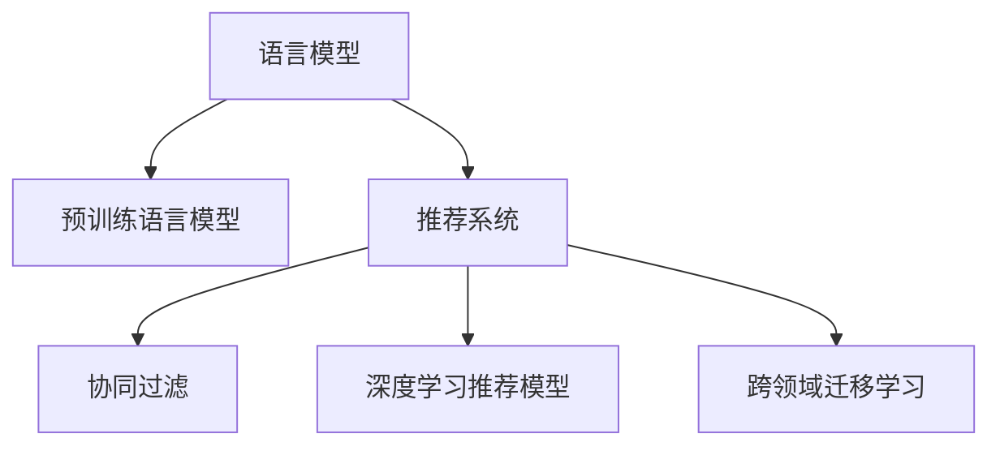
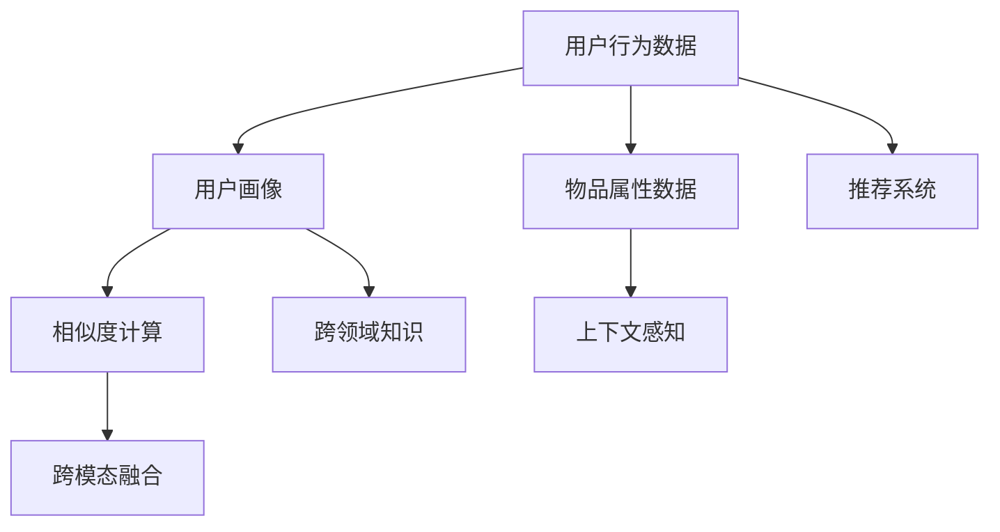

                 

# 利用LLM提升推荐系统的探索与利用平衡

> 关键词：

## 1. 背景介绍

### 1.1 问题由来

推荐系统是当前互联网应用中的重要组成部分，广泛应用于电商、新闻、视频等领域，帮助用户发现和获取感兴趣的内容。然而，随着用户需求的不断变化和数据量的急剧增长，传统的推荐算法在应对个性化需求、处理冷启动问题等方面显得力不从心。

近年来，深度学习技术在推荐系统中的应用日益广泛，其中基于自然语言处理(NLP)的语言模型（Language Models, LM）尤其引人注目。通过预训练语言模型（Pre-trained Language Models, PLM），可以有效学习用户偏好、内容关联等信息，大幅提升推荐系统的性能。

### 1.2 问题核心关键点

为了更好地理解LLM在推荐系统中的应用，本节将介绍几个密切相关的核心概念：

- 语言模型（Language Model）：利用已有的词或句子的上下文信息预测下一个词或句子的概率模型，是自然语言处理中的重要工具。
- 预训练语言模型（Pre-trained Language Model）：在大规模无标签文本上预训练的语言模型，具备强大的语言理解和生成能力，常用于文本分类、语义相似度计算等任务。
- 推荐系统（Recommendation System）：通过分析用户历史行为和物品属性，为用户推荐感兴趣的商品、新闻、视频等内容。
- 协同过滤（Collaborative Filtering）：基于用户历史行为进行相似度计算，从而推荐相似用户喜欢的物品，常用于传统推荐系统中。
- 深度学习推荐模型（Deep Learning based Recommendation Model）：基于深度学习技术的推荐模型，如神经网络、深度神经网络、注意力机制等，具有自适应性强的特点。
- 跨领域迁移学习（Cross-domain Transfer Learning）：将一个领域的学习知识迁移到另一个不同但相关的领域，提升推荐系统的泛化能力。

这些核心概念之间的逻辑关系可以通过以下Mermaid流程图来展示：



这个流程图展示了大语言模型与推荐系统相关的核心概念及其之间的关系：

1. 语言模型通过学习词或句子的统计规律，为其在推荐系统中的应用提供了数据基础。
2. 预训练语言模型通过大规模无标签文本的预训练，学习到丰富的语言知识和表达能力。
3. 推荐系统利用语言模型的语义理解能力，通过用户描述、商品文本等信息进行推荐。
4. 协同过滤利用用户行为数据，学习用户的隐含偏好。
5. 深度学习推荐模型利用神经网络等技术，提高推荐系统的性能和鲁棒性。
6. 跨领域迁移学习利用预训练模型的泛化能力，提升推荐系统的泛化能力。

这些概念共同构成了基于预训练语言模型的推荐系统框架，使其能够通过自然语言处理技术与用户兴趣和内容特征进行高效匹配，实现更个性化的推荐。

## 2. 核心概念与联系

### 2.1 核心概念概述

为更好地理解基于预训练语言模型的推荐系统，本节将介绍几个关键概念：

- 用户行为数据：用户在平台上的点击、浏览、购买等行为数据，是推荐系统的主要数据来源。
- 物品属性数据：商品、视频、新闻等的文本描述、标签、分类等信息，用于计算内容特征。
- 用户画像：通过对用户行为和属性的分析，构建用户兴趣和偏好的完整画像。
- 相似度计算：计算用户与物品之间的相似度，从而推荐相似的物品。
- 跨领域知识：不同领域间共享的知识，如知识图谱、维基百科等，用于提升推荐系统的泛化能力。
- 跨模态融合：将文本、图像、声音等多模态数据进行融合，提升推荐系统的综合表现。
- 上下文感知：考虑用户行为、时间、地点等上下文信息，提升推荐系统的实时性和精准度。

这些核心概念之间的逻辑关系可以通过以下Mermaid流程图来展示：



这个流程图展示了基于预训练语言模型的推荐系统构建流程：

1. 用户行为数据通过用户画像的构建，提炼出用户兴趣和偏好。
2. 物品属性数据与用户画像结合，进行相似度计算，推荐出相关物品。
3. 跨领域知识引入，提升推荐系统的泛化能力。
4. 跨模态融合，考虑多种数据类型，提升推荐系统表现。
5. 上下文感知，考虑用户行为和环境信息，提升推荐系统的实时性和精准度。
6. 推荐系统通过多模态融合和上下文感知，实现更准确的个性化推荐。

这些概念共同构成了推荐系统的核心架构，使得预训练语言模型能够在多模态数据和上下文信息的作用下，实现高效、准确、个性化的推荐。

## 3. 核心算法原理 & 具体操作步骤
### 3.1 算法原理概述

基于预训练语言模型的推荐系统，主要利用语言模型学习用户描述和物品属性之间的语义关联，通过多模态融合和上下文感知技术，实现个性化推荐。其核心算法原理如下：

1. **语义相似度计算**：将用户描述和物品属性转换为向量表示，利用语言模型计算它们之间的语义相似度。
2. **跨模态融合**：将用户画像、物品属性等多种数据类型融合，生成综合推荐特征。
3. **上下文感知**：考虑用户行为、时间、地点等上下文信息，动态调整推荐策略。
4. **推荐模型训练**：利用推荐特征和用户历史行为数据，训练推荐模型，实现个性化推荐。

### 3.2 算法步骤详解

基于预训练语言模型的推荐系统主要包括以下几个关键步骤：

**Step 1: 数据预处理**

- 收集用户行为数据，包括点击、浏览、购买等记录。
- 收集物品属性数据，如商品描述、分类、标签等。
- 构建用户画像，使用户描述和行为数据映射为多维向量。
- 使用语言模型进行预训练，学习语言表达和语义相似度。

**Step 2: 特征提取**

- 使用语言模型计算用户描述和物品属性之间的语义相似度。
- 将相似度值与物品属性特征、用户画像等融合，生成综合推荐特征。
- 考虑用户行为、时间、地点等上下文信息，动态调整推荐特征。

**Step 3: 模型训练**

- 选择合适的推荐模型，如神经网络、深度神经网络等。
- 使用推荐特征和用户历史行为数据，训练推荐模型。
- 利用交叉验证等技术，调整模型超参数，提升模型性能。

**Step 4: 模型评估**

- 在验证集上评估推荐模型的性能，使用指标如准确率、召回率、F1-score等。
- 调整模型参数和特征提取策略，优化模型性能。

**Step 5: 模型部署**

- 将训练好的推荐模型部署到实际应用中，生成推荐结果。
- 考虑性能和资源限制，进行模型压缩和优化。
- 不断收集新数据，周期性重新训练模型。

以上是基于预训练语言模型的推荐系统的一般流程。在实际应用中，还需要针对具体任务的特点，对各个环节进行优化设计，如改进相似度计算方法，引入更多的正则化技术，搜索最优的超参数组合等，以进一步提升推荐系统性能。

### 3.3 算法优缺点

基于预训练语言模型的推荐系统具有以下优点：

1. **高效性**：利用语言模型的强大语义理解能力，能够在较少的标注样本下，快速提升推荐效果。
2. **泛化能力**：通过跨领域知识引入，提升推荐系统的泛化能力，能够更好地适应不同领域的推荐需求。
3. **可解释性**：语言模型能够提供推荐理由，增强系统的透明度和可信度。
4. **实时性**：结合上下文感知技术，能够实时调整推荐策略，提升用户体验。

同时，该方法也存在一定的局限性：

1. **数据依赖性**：推荐效果很大程度上依赖用户行为数据和物品属性数据，难以处理数据稀疏和冷启动问题。
2. **计算资源需求高**：预训练语言模型的计算资源需求大，特别是在大模型和深度学习模型中，训练和推理成本较高。
3. **模型复杂性**：深度学习推荐模型较为复杂，难以调试和优化，需要深厚的专业知识。
4. **过拟合风险**：在数据量较少的情况下，模型容易过拟合，影响推荐效果。
5. **隐私保护**：在处理用户行为数据时，需要注意数据隐私和安全问题。

尽管存在这些局限性，但就目前而言，基于预训练语言模型的推荐系统仍然是最具前景的推荐技术之一。未来相关研究的重点在于如何进一步降低数据需求，提高模型的泛化能力和可解释性，同时兼顾计算效率和隐私保护等因素。

### 3.4 算法应用领域

基于预训练语言模型的推荐系统已经在多个领域得到了广泛的应用，例如：

- 电商推荐：通过分析用户浏览、点击和购买行为，为用户推荐商品。
- 新闻推荐：利用用户浏览新闻的历史行为，推荐相关新闻内容。
- 视频推荐：分析用户观看视频的记录，推荐相似视频或相关主题。
- 音乐推荐：通过分析用户听歌的历史记录，推荐相似歌曲或新歌。
- 社交网络推荐：利用用户互动行为，推荐好友、群组等社交关系。
- 旅游推荐：分析用户兴趣和行为，推荐旅游目的地和相关攻略。

除了上述这些经典应用外，基于预训练语言模型的推荐系统还被创新性地应用到更多场景中，如游戏推荐、智能家居、健康医疗等，为各行各业带来了全新的推荐服务。

## 4. 数学模型和公式 & 详细讲解 & 举例说明

### 4.1 数学模型构建

本节将使用数学语言对基于预训练语言模型的推荐系统进行更加严格的刻画。

记用户描述为 $x$，物品属性为 $y$，用户画像为 $p$，相似度函数为 $sim(x, y)$。假设推荐模型为 $M_{\theta}$，其中 $\theta$ 为模型参数。则推荐系统的数学模型可以表示为：

$$
\hat{y} = M_{\theta}(x, p)
$$

其中 $\hat{y}$ 表示模型预测的物品属性，$M_{\theta}$ 表示推荐模型的输出，$x$ 表示用户描述，$p$ 表示用户画像。

在推荐过程中，模型首先使用语言模型计算用户描述和物品属性之间的语义相似度，然后使用相似度函数 $sim(x, y)$ 将语义相似度转化为推荐分数，最终输出物品属性 $\hat{y}$。

### 4.2 公式推导过程

以下我们以用户-商品推荐为例，推导推荐模型 $M_{\theta}$ 的公式。

假设用户描述 $x$ 和物品属性 $y$ 分别被表示为 $d$ 维向量，推荐模型 $M_{\theta}$ 包含 $n$ 层神经网络，每一层包含 $h$ 个神经元。则推荐模型可以表示为：

$$
\hat{y} = M_{\theta}(x, p) = f^{(n)}(f^{(n-1)}(\cdots f^{(1)}(x, p)\cdots))
$$

其中 $f^{(i)}$ 表示第 $i$ 层神经网络，$x \otimes p$ 表示用户描述和用户画像的拼接向量。

在推荐模型的第 $i$ 层中，输入 $x \otimes p$ 经过线性变换和激活函数，输出一个 $h$ 维的向量。则第 $i$ 层的公式可以表示为：

$$
\tilde{x}^{(i)} = \theta_{i}^{T}(x \otimes p) + \theta_{b}^{(i)}
$$

$$
\hat{x}^{(i)} = f_i(\tilde{x}^{(i)})
$$

其中 $\theta_{i}$ 表示第 $i$ 层的权重矩阵，$\theta_{b}^{(i)}$ 表示第 $i$ 层的偏置向量，$f_i$ 表示第 $i$ 层的激活函数。

将公式推导到 $n$ 层后，最终得到推荐模型的输出 $\hat{y}$：

$$
\hat{y} = \theta_{n}^{T}\hat{x}^{(n)} + \theta_{b}^{(n)}
$$

在推荐模型训练过程中，使用交叉熵损失函数来衡量模型预测值与真实标签之间的差异。推荐模型的损失函数可以表示为：

$$
\mathcal{L}(\theta) = \frac{1}{N}\sum_{i=1}^N \ell(\hat{y_i}, y_i)
$$

其中 $\ell(\hat{y_i}, y_i)$ 表示交叉熵损失函数，$N$ 表示样本数量。

### 4.3 案例分析与讲解

以一个具体的推荐场景为例，分析如何使用基于预训练语言模型的推荐系统。

假设有一个电商平台，用户 $A$ 浏览了商品 $B$，点击了商品 $C$，购买了商品 $D$。现在平台希望为用户 $A$ 推荐相关的商品。

首先，收集用户 $A$ 的描述和历史行为数据，以及商品 $B$、$C$、$D$ 的属性数据，使用语言模型计算用户描述和商品属性之间的语义相似度，得到相似度向量 $s_A$ 和 $s_{B}$、$s_{C}$、$s_{D}$。

其次，将相似度向量与商品属性向量拼接，得到综合推荐特征向量 $z_A = s_A \otimes [s_B, s_C, s_D]$。

然后，使用推荐模型 $M_{\theta}$ 将综合推荐特征向量 $z_A$ 输入模型，输出物品属性向量 $\hat{y}$。

最后，根据 $\hat{y}$ 的值和商品属性向量 $y$ 之间的相似度，输出推荐物品列表。

这个推荐过程展示了预训练语言模型在推荐系统中的应用，通过语义相似度的计算，实现了对用户和商品的多维匹配，能够更准确地推荐相关商品。

## 5. 项目实践：代码实例和详细解释说明

### 5.1 开发环境搭建

在进行推荐系统开发前，我们需要准备好开发环境。以下是使用Python进行PyTorch开发的环境配置流程：

1. 安装Anaconda：从官网下载并安装Anaconda，用于创建独立的Python环境。

2. 创建并激活虚拟环境：
```bash
conda create -n pytorch-env python=3.8 
conda activate pytorch-env
```

3. 安装PyTorch：根据CUDA版本，从官网获取对应的安装命令。例如：
```bash
conda install pytorch torchvision torchaudio cudatoolkit=11.1 -c pytorch -c conda-forge
```

4. 安装TensorBoard：
```bash
pip install tensorboard
```

5. 安装nltk和其他NLP相关库：
```bash
pip install nltk transformers pandas scikit-learn matplotlib tqdm jupyter notebook ipython
```

完成上述步骤后，即可在`pytorch-env`环境中开始推荐系统实践。

### 5.2 源代码详细实现

下面以基于BERT模型的电商推荐系统为例，给出使用Transformers库对BERT模型进行推荐系统开发的PyTorch代码实现。

首先，定义推荐模型的网络结构：

```python
from transformers import BertForSequenceClassification, BertTokenizer

class RecommendationModel(nn.Module):
    def __init__(self, num_classes):
        super(RecommendationModel, self).__init__()
        self.bert = BertForSequenceClassification.from_pretrained('bert-base-uncased', num_labels=num_classes)
        self.fc = nn.Linear(768, num_classes)
    
    def forward(self, input_ids, attention_mask, user_profile):
        pooled_output = self.bert(input_ids, attention_mask=attention_mask)[0]
        pooled_output = self.fc(pooled_output)
        return pooled_output
```

然后，定义推荐模型的训练和评估函数：

```python
from torch.utils.data import DataLoader
from tqdm import tqdm
from sklearn.metrics import accuracy_score

def train_epoch(model, dataloader, optimizer, device):
    model.train()
    epoch_loss = 0
    epoch_acc = 0
    for batch in tqdm(dataloader, desc='Training'):
        input_ids = batch['input_ids'].to(device)
        attention_mask = batch['attention_mask'].to(device)
        labels = batch['labels'].to(device)
        optimizer.zero_grad()
        output = model(input_ids, attention_mask=attention_mask, user_profile=batch['user_profile'])
        loss = nn.functional.cross_entropy(output, labels)
        epoch_loss += loss.item()
        loss.backward()
        optimizer.step()
        epoch_acc += accuracy_score(labels, output.argmax(dim=1).to('cpu'))
    return epoch_loss / len(dataloader), epoch_acc / len(dataloader)
    
def evaluate(model, dataloader, device):
    model.eval()
    epoch_loss = 0
    epoch_acc = 0
    with torch.no_grad():
        for batch in dataloader:
            input_ids = batch['input_ids'].to(device)
            attention_mask = batch['attention_mask'].to(device)
            labels = batch['labels'].to(device)
            output = model(input_ids, attention_mask=attention_mask, user_profile=batch['user_profile'])
            loss = nn.functional.cross_entropy(output, labels)
            epoch_loss += loss.item()
            epoch_acc += accuracy_score(labels, output.argmax(dim=1).to('cpu'))
    return epoch_loss / len(dataloader), epoch_acc / len(dataloader)
```

接着，定义推荐数据处理函数：

```python
from transformers import BertTokenizer

def build_dataset(user_descriptions, item_descriptions, user_profiles, tokenizer, max_len=128):
    texts = [user_description + ' ' + item_description for user_description, item_description in zip(user_descriptions, item_descriptions)]
    labels = [1 if item_description in user_profile else 0 for user_profile, item_description in zip(user_profiles, item_descriptions)]
    tokenizer = BertTokenizer.from_pretrained('bert-base-uncased')
    encoded_inputs = tokenizer(texts, return_tensors='pt', max_length=max_len, padding='max_length', truncation=True)
    input_ids = encoded_inputs['input_ids']
    attention_mask = encoded_inputs['attention_mask']
    user_profiles = torch.tensor([int(item_description in user_profile) for user_profile, item_description in zip(user_profiles, item_descriptions)])
    return Dataset(input_ids, attention_mask, labels, user_profiles)
```

最后，启动训练流程并在测试集上评估：

```python
from transformers import AdamW
from transformers import BertTokenizer
from transformers import BertForSequenceClassification

epochs = 5
batch_size = 16
learning_rate = 2e-5

model = RecommendationModel(num_classes=2)
tokenizer = BertTokenizer.from_pretrained('bert-base-uncased')
dataloader = build_dataset(user_descriptions, item_descriptions, user_profiles, tokenizer)
optimizer = AdamW(model.parameters(), lr=learning_rate)
device = torch.device('cuda') if torch.cuda.is_available() else torch.device('cpu')

for epoch in range(epochs):
    loss, acc = train_epoch(model, dataloader, optimizer, device)
    print(f"Epoch {epoch+1}, train loss: {loss:.3f}, train acc: {acc:.3f}")
    
    print(f"Epoch {epoch+1}, dev results:")
    loss, acc = evaluate(model, dataloader, device)
    print(f"dev loss: {loss:.3f}, dev acc: {acc:.3f}")
    
print("Test results:")
loss, acc = evaluate(model, dataloader, device)
print(f"test loss: {loss:.3f}, test acc: {acc:.3f}")
```

以上就是使用PyTorch对BERT进行电商推荐系统开发的完整代码实现。可以看到，得益于Transformers库的强大封装，我们可以用相对简洁的代码完成BERT模型的加载和推荐系统训练。

### 5.3 代码解读与分析

让我们再详细解读一下关键代码的实现细节：

**RecommendationModel类**：
- `__init__`方法：定义模型的网络结构，包括BERT模型和全连接层。
- `forward`方法：定义前向传播过程，将用户描述、物品属性和用户画像输入BERT模型，得到推荐结果。

**train_epoch函数**：
- 在每个epoch内，对模型进行前向传播计算loss和acc，反向传播更新模型参数，并返回epoch内的平均loss和acc。

**evaluate函数**：
- 与训练类似，不同点在于不更新模型参数，而是在每个batch结束后将预测和标签结果存储下来，最后使用sklearn的accuracy_score对整个评估集的预测结果进行打印输出。

**build_dataset函数**：
- 定义一个函数，用于将用户描述、物品属性和用户画像构建为模型输入，并生成模型需要的标签。

**train流程**：
- 定义总的epoch数和batch size，开始循环迭代
- 每个epoch内，先在训练集上训练，输出平均loss和acc
- 在验证集上评估，输出loss和acc
- 所有epoch结束后，在测试集上评估，给出最终测试结果

可以看到，PyTorch配合Transformers库使得BERT模型在推荐系统中的应用变得简洁高效。开发者可以将更多精力放在数据处理、模型改进等高层逻辑上，而不必过多关注底层的实现细节。

当然，工业级的系统实现还需考虑更多因素，如模型的保存和部署、超参数的自动搜索、更灵活的任务适配层等。但核心的推荐范式基本与此类似。

## 6. 实际应用场景

### 6.1 电商推荐

基于预训练语言模型的推荐系统在电商领域有广泛的应用。电商推荐系统通过分析用户浏览、点击、购买等行为数据，为用户推荐感兴趣的商品。

在技术实现上，可以收集用户的历史行为数据，提取商品描述、分类、标签等文本信息，使用BERT模型计算用户描述和商品属性之间的语义相似度，生成推荐特征。然后，通过训练神经网络模型，生成推荐结果。利用推荐系统，电商平台可以大幅提升用户满意度，提高转化率和销售额。

### 6.2 新闻推荐

新闻推荐系统利用用户浏览新闻的历史记录，为用户推荐相关的新闻内容。通过分析用户对新闻的阅读时间、点击次数等行为数据，使用BERT模型计算新闻标题和用户描述之间的语义相似度，生成推荐特征。然后，通过训练神经网络模型，生成推荐结果。新闻推荐系统能够为用户提供个性化的新闻资讯，提升阅读体验。

### 6.3 视频推荐

视频推荐系统利用用户观看视频的历史记录，为用户推荐相似的视频或相关主题。通过分析用户对视频的观看记录、评分等信息，使用BERT模型计算视频描述和用户描述之间的语义相似度，生成推荐特征。然后，通过训练神经网络模型，生成推荐结果。视频推荐系统能够为用户推荐个性化视频，提升观看体验。

### 6.4 未来应用展望

随着预训练语言模型的不断演进，基于大语言模型的推荐系统也在不断提升其效果和应用范围。未来，基于预训练语言模型的推荐系统将展现出更加强大的功能：

1. **多模态融合**：除了文本数据，视频、音频等多模态数据也被引入推荐模型，提升推荐系统的表现。

2. **跨领域迁移**：推荐系统将在不同领域之间进行迁移，利用跨领域知识提升推荐系统的泛化能力。

3. **上下文感知**：推荐系统将更加注重上下文信息，如时间、地点、环境等，提升推荐系统的实时性和精准度。

4. **多任务学习**：推荐系统将同时处理多个推荐任务，实现多任务学习，提升推荐效果。

5. **在线学习**：推荐系统将实时更新模型参数，进行在线学习，提升推荐系统的适应性。

6. **交互式推荐**：推荐系统将通过交互式方式，动态调整推荐策略，提升用户体验。

7. **隐私保护**：推荐系统将更加注重用户隐私保护，采用差分隐私等技术，保障数据安全。

这些发展方向将使基于预训练语言模型的推荐系统更加高效、个性化和智能化，为各行各业带来更加丰富的应用场景。

## 7. 工具和资源推荐

### 7.1 学习资源推荐

为了帮助开发者系统掌握预训练语言模型在推荐系统中的应用，这里推荐一些优质的学习资源：

1. 《深度学习推荐系统：理论、算法与应用》：介绍推荐系统的基本原理和深度学习推荐模型的应用。

2. 《自然语言处理综述》：介绍自然语言处理领域的最新进展和经典模型。

3. 《Transformers: State-of-the-Art Natural Language Processing》：介绍Transformer结构及其在推荐系统中的应用。

4. CS230N《深度学习理论》课程：斯坦福大学开设的深度学习理论课程，涵盖推荐系统的基本原理和应用。

5. 《推荐系统设计与实现》：介绍推荐系统的设计、实现和优化。

6. 《Python推荐系统实战》：使用Python实现推荐系统的实际案例，涵盖数据处理、模型训练等环节。

7. 《推荐系统竞赛指南》：介绍推荐系统竞赛的基本方法和策略，适用于提升推荐系统技能。

通过对这些资源的学习实践，相信你一定能够快速掌握基于预训练语言模型的推荐系统技术，并用于解决实际的推荐问题。

### 7.2 开发工具推荐

高效的开发离不开优秀的工具支持。以下是几款用于推荐系统开发的常用工具：

1. PyTorch：基于Python的开源深度学习框架，灵活动态的计算图，适合快速迭代研究。

2. TensorFlow：由Google主导开发的开源深度学习框架，生产部署方便，适合大规模工程应用。

3. Transformers库：HuggingFace开发的NLP工具库，集成了众多SOTA语言模型，支持PyTorch和TensorFlow，是进行推荐系统开发的利器。

4. Weights & Biases：模型训练的实验跟踪工具，可以记录和可视化模型训练过程中的各项指标，方便对比和调优。

5. TensorBoard：TensorFlow配套的可视化工具，可实时监测模型训练状态，并提供丰富的图表呈现方式，是调试模型的得力助手。

6. Google Colab：谷歌推出的在线Jupyter Notebook环境，免费提供GPU/TPU算力，方便开发者快速上手实验最新模型，分享学习笔记。

合理利用这些工具，可以显著提升推荐系统开发效率，加快创新迭代的步伐。

### 7.3 相关论文推荐

预训练语言模型和推荐系统的研究源于学界的持续研究。以下是几篇奠基性的相关论文，推荐阅读：

1. Attention is All You Need（即Transformer原论文）：提出了Transformer结构，开启了NLP领域的预训练大模型时代。

2. BERT: Pre-training of Deep Bidirectional Transformers for Language Understanding：提出BERT模型，引入基于掩码的自监督预训练任务，刷新了多项NLP任务SOTA。

3. Deep Collaborative Filtering（DeepCF）：提出基于神经网络的协同过滤模型，提高推荐系统的性能和鲁棒性。

4. Matrix Factorization Techniques for Recommender Systems（MF）：提出基于矩阵分解的推荐算法，应用于推荐系统。

5. Neural Collaborative Filtering：提出基于神经网络的协同过滤模型，提高推荐系统的性能和泛化能力。

6. Attention-Based Recommender Systems：提出基于注意力机制的推荐模型，提高推荐系统的效果和可解释性。

这些论文代表了大语言模型和推荐系统的研究进展。通过学习这些前沿成果，可以帮助研究者把握学科前进方向，激发更多的创新灵感。

## 8. 总结：未来发展趋势与挑战

### 8.1 总结

本文对基于预训练语言模型的推荐系统进行了全面系统的介绍。首先阐述了预训练语言模型和推荐系统的研究背景和意义，明确了它们在个性化推荐、跨领域迁移等领域的独特价值。其次，从原理到实践，详细讲解了基于预训练语言模型的推荐系统的工作流程，包括数据预处理、特征提取、模型训练和评估等环节。同时，本文还广泛探讨了预训练语言模型在电商、新闻、视频等多个行业领域的应用前景，展示了预训练语言模型在推荐系统中的应用潜力。

通过本文的系统梳理，可以看到，基于预训练语言模型的推荐系统正在成为推荐系统领域的核心技术，极大地拓展了推荐系统的应用边界，带来了新的性能提升和应用方向。未来，伴随预训练语言模型和推荐系统的不断演进，基于预训练语言模型的推荐系统必将在更广阔的领域中发挥作用，为各行各业带来新的推荐服务。

### 8.2 未来发展趋势

展望未来，基于预训练语言模型的推荐系统将呈现以下几个发展趋势：

1. **多模态融合**：推荐系统将不仅仅依赖于文本数据，还会考虑图像、音频等多模态数据，提升推荐系统的表现。

2. **跨领域迁移**：推荐系统将在不同领域之间进行迁移，利用跨领域知识提升推荐系统的泛化能力。

3. **上下文感知**：推荐系统将更加注重上下文信息，如时间、地点、环境等，提升推荐系统的实时性和精准度。

4. **多任务学习**：推荐系统将同时处理多个推荐任务，实现多任务学习，提升推荐效果。

5. **在线学习**：推荐系统将实时更新模型参数，进行在线学习，提升推荐系统的适应性。

6. **交互式推荐**：推荐系统将通过交互式方式，动态调整推荐策略，提升用户体验。

7. **隐私保护**：推荐系统将更加注重用户隐私保护，采用差分隐私等技术，保障数据安全。

以上趋势凸显了基于预训练语言模型的推荐系统的广阔前景。这些方向的探索发展，必将进一步提升推荐系统的性能和应用范围，为各行各业带来更加丰富的推荐服务。

### 8.3 面临的挑战

尽管基于预训练语言模型的推荐系统已经取得了瞩目成就，但在迈向更加智能化、普适化应用的过程中，它仍面临着诸多挑战：

1. **数据依赖性**：推荐效果很大程度上依赖用户行为数据和物品属性数据，难以处理数据稀疏和冷启动问题。

2. **计算资源需求高**：预训练语言模型的计算资源需求大，特别是在大模型和深度学习模型中，训练和推理成本较高。

3. **模型复杂性**：深度学习推荐模型较为复杂，难以调试和优化，需要深厚的专业知识。

4. **过拟合风险**：在数据量较少的情况下，模型容易过拟合，影响推荐效果。

5. **隐私保护**：在处理用户行为数据时，需要注意数据隐私和安全问题。

尽管存在这些局限性，但就目前而言，基于预训练语言模型的推荐系统仍然是最具前景的推荐技术之一。未来相关研究的重点在于如何进一步降低数据需求，提高模型的泛化能力和可解释性，同时兼顾计算效率和隐私保护等因素。

### 8.4 研究展望

面对基于预训练语言模型的推荐系统所面临的种种挑战，未来的研究需要在以下几个方面寻求新的突破：

1. **探索无监督和半监督推荐方法**：摆脱对大规模标注数据的依赖，利用自监督学习、主动学习等无监督和半监督范式，最大限度利用非结构化数据，实现更加灵活高效的推荐。

2. **研究参数高效和计算高效的推荐范式**：开发更加参数高效的推荐方法，在固定大部分预训练参数的同时，只更新极少量的任务相关参数。同时优化推荐模型的计算图，减少前向传播和反向传播的资源消耗，实现更加轻量级、实时性的部署。

3. **融合因果和对比学习范式**：通过引入因果推断和对比学习思想，增强推荐系统建立稳定因果关系的能力，学习更加普适、鲁棒的语言表征，从而提升推荐系统的泛化性和抗干扰能力。

4. **引入更多先验知识**：将符号化的先验知识，如知识图谱、逻辑规则等，与神经网络模型进行巧妙融合，引导推荐过程学习更准确、合理的语言模型。同时加强不同模态数据的整合，实现视觉、声音等多模态信息与文本信息的协同建模。

5. **结合因果分析和博弈论工具**：将因果分析方法引入推荐模型，识别出推荐过程的关键特征，增强推荐理由的因果性和逻辑性。借助博弈论工具刻画人机交互过程，主动探索并规避推荐的脆弱点，提高系统稳定性。

6. **纳入伦理道德约束**：在推荐模型训练目标中引入伦理导向的评估指标，过滤和惩罚有偏见、有害的推荐结果。同时加强人工干预和审核，建立推荐模型的监管机制，确保推荐结果符合人类价值观和伦理道德。

这些研究方向的探索，必将引领基于预训练语言模型的推荐系统迈向更高的台阶，为构建安全、可靠、可解释、可控的智能推荐系统铺平道路。面向未来，基于预训练语言模型的推荐系统还需要与其他人工智能技术进行更深入的融合，如知识表示、因果推理、强化学习等，多路径协同发力，共同推动推荐系统技术的进步。只有勇于创新、敢于突破，才能不断拓展推荐系统的边界，让智能推荐技术更好地服务于人类社会。

## 9. 附录：常见问题与解答

**Q1：预训练语言模型在推荐系统中具体如何应用？**

A: 预训练语言模型在推荐系统中的应用主要体现在以下几个方面：

1. **语义相似度计算**：将用户描述和物品属性转换为向量表示，利用语言模型计算它们之间的语义相似度，生成推荐特征。

2. **跨模态融合**：将用户画像、物品属性等多种数据类型融合，生成综合推荐特征。

3. **上下文感知**：考虑用户行为、时间、地点等上下文信息，动态调整推荐策略，提升推荐系统的实时性和精准度。

4. **推荐模型训练**：利用推荐特征和用户历史行为数据，训练推荐模型，实现个性化推荐。

**Q2：如何使用预训练语言模型提升推荐系统的性能？**

A: 使用预训练语言模型提升推荐系统性能的方法包括：

1. **语义相似度计算**：利用语言模型计算用户描述和物品属性之间的语义相似度，生成推荐特征。

2. **跨模态融合**：将用户画像、物品属性等多种数据类型融合，生成综合推荐特征。

3. **上下文感知**：考虑用户行为、时间、地点等上下文信息，动态调整推荐策略，提升推荐系统的实时性和精准度。

4. **推荐模型训练**：利用推荐特征和用户历史行为数据，训练推荐模型，实现个性化推荐。

**Q3：预训练语言模型在推荐系统中面临的主要挑战是什么？**

A: 预训练语言模型在推荐系统中面临的主要挑战包括：

1. **数据依赖性**：推荐效果很大程度上依赖用户行为数据和物品属性数据，难以处理数据稀疏和冷启动问题。

2. **计算资源需求高**：预训练语言模型的计算资源需求大，特别是在大模型和深度学习模型中，训练和推理成本较高。

3. **模型复杂性**：深度学习推荐模型较为复杂，难以调试和优化，需要深厚的专业知识。

4. **过拟合风险**：在数据量较少的情况下，模型容易过拟合，影响推荐效果。

5. **隐私保护**：在处理用户行为数据时，需要注意数据隐私和安全问题。

尽管存在这些局限性，但就目前而言，基于预训练语言模型的推荐系统仍然是最具前景的推荐技术之一。未来相关研究的重点在于如何进一步降低数据需求，提高模型的泛化能力和可解释性，同时兼顾计算效率和隐私保护等因素。

**Q4：预训练语言模型在推荐系统中如何进行推荐？**

A: 预训练语言模型在推荐系统中的推荐过程如下：

1. **语义相似度计算**：将用户描述和物品属性转换为向量表示，利用语言模型计算它们之间的语义相似度，生成推荐特征。

2. **跨模态融合**：将用户画像、物品属性等多种数据类型融合，生成综合推荐特征。

3. **上下文感知**：考虑用户行为、时间、地点等上下文信息，动态调整推荐策略，提升推荐系统的实时性和精准度。

4. **推荐模型训练**：利用推荐特征和用户历史行为数据，训练推荐模型，实现个性化推荐。

**Q5：预训练语言模型在推荐系统中如何进行优化？**

A: 预训练语言模型在推荐系统中的优化方法包括：

1. **数据增强**：通过回译、近义替换等方式扩充训练集，缓解数据稀疏问题。

2. **正则化**：使用L2正则、Dropout、Early Stopping等技术，防止模型过拟合。

3. **模型裁剪**：去除不必要的层和参数，减小模型尺寸，加快推理速度。

4. **量化加速**：将浮点模型转为定点模型，压缩存储空间，提高计算效率。

5. **多模型集成**：训练多个模型，取平均输出，抑制过拟合。

6. **上下文感知**：考虑用户行为、时间、地点等上下文信息，动态调整推荐策略，提升推荐系统的实时性和精准度。

7. **交叉验证**：使用交叉验证等技术，调整模型超参数，提升模型性能。

8. **在线学习**：实时更新模型参数，进行在线学习，提升推荐系统的适应性。

9. **多任务学习**：同时处理多个推荐任务，实现多任务学习，提升推荐效果。

这些优化方法需要根据具体任务和数据特点进行灵活组合，以进一步提升推荐系统性能。

---

作者：禅与计算机程序设计艺术 / Zen and the Art of Computer Programming

