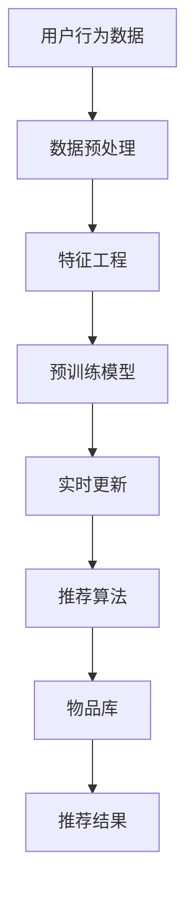

                 

# 利用大模型优化推荐系统的实时更新机制

> 关键词：推荐系统,大模型,实时更新,用户行为,知识图谱,协同过滤,召回算法,逻辑回归,深度学习,TF-IDF,梯度提升

## 1. 背景介绍

在当今数字化时代，个性化推荐系统已成为各大互联网平台的核心竞争力之一。无论是电商网站、视频网站，还是社交媒体平台，推荐系统都在提升用户体验、增加用户粘性、促进销售转化等方面发挥着至关重要的作用。然而，现有的推荐系统仍存在诸多挑战：数据量庞大、维度高、用户行为多样且时变性强，如何在保证效率的同时，满足用户的个性化需求，成为一个亟需解决的问题。

大模型技术的兴起，为推荐系统优化提供了新的思路。通过利用大规模预训练模型，结合用户行为数据，推荐系统能够更加高效地进行实时更新，提供更加精准的个性化推荐。本节将系统介绍利用大模型优化推荐系统的实时更新机制，并探讨其在电商、社交、视频等领域的应用。

## 2. 核心概念与联系

### 2.1 核心概念概述

为更好地理解基于大模型的推荐系统实时更新机制，本节将介绍几个关键概念：

- **推荐系统**：使用用户历史行为数据和物品属性数据，为用户生成个性化推荐列表的系统。常见推荐算法包括协同过滤、基于内容的推荐、基于矩阵分解的推荐等。

- **大模型**：以自回归或自编码模型为代表的大规模预训练模型。通过在海量数据上进行预训练，学习到通用的知识表示，具备强大的表达能力。

- **知识图谱**：将现实世界中的实体和关系映射到图结构的数据库，用于表示和推理复杂知识。推荐系统可以通过知识图谱引入外部知识，提高推荐效果。

- **协同过滤**：利用用户间的相似性，对用户行为数据进行协同推断，生成个性化推荐列表。常见的协同过滤算法包括基于用户的协同过滤、基于物品的协同过滤等。

- **召回算法**：在候选库中寻找与用户兴趣相关的物品，以供推荐。召回算法通常依赖于文本相似度计算、TF-IDF、余弦相似度等方法。

- **逻辑回归**：一种常用的分类算法，用于预测用户对物品的评分或点击率。

- **深度学习**：通过构建多层神经网络模型，从数据中学习非线性关系，用于复杂任务处理。

- **TF-IDF**：一种文本分析技术，用于衡量词在文本中的重要性，常用于文本相似度计算。

- **梯度提升**：一种集成学习算法，通过多次迭代训练基模型，逐步提升预测性能。

- **实时更新**：根据用户实时行为数据，实时更新推荐系统模型，动态生成个性化推荐。

这些概念共同构成了基于大模型的推荐系统实时更新机制，其核心思想是通过利用大规模预训练模型，结合用户行为数据和外部知识，动态优化推荐模型，实现高效、精准的个性化推荐。

### 2.2 核心概念原理和架构的 Mermaid 流程图



## 3. 核心算法原理 & 具体操作步骤

### 3.1 算法原理概述

基于大模型的推荐系统实时更新机制，通过将预训练模型作为特征提取器，结合用户行为数据和外部知识，动态优化推荐模型，生成个性化推荐列表。具体过程包括以下几个关键步骤：

1. **数据预处理**：收集用户行为数据，并将其转化为适合模型训练的格式。

2. **特征工程**：将用户行为数据和物品属性数据进行特征提取，生成模型的输入特征。

3. **预训练模型**：使用大规模预训练模型作为特征提取器，将输入特征映射为高维语义表示。

4. **实时更新**：根据用户实时行为数据和物品库，实时调整推荐模型参数，更新推荐结果。

5. **推荐算法**：利用更新后的推荐模型，结合召回算法生成推荐列表，并提供给用户。

### 3.2 算法步骤详解

以下我们将详细介绍每个步骤的具体实现过程。

**Step 1: 数据预处理**

推荐系统需要收集用户的历史行为数据，并从中提取有用的特征。常用的用户行为数据包括浏览记录、购买记录、评分记录等。

1. **数据清洗**：去除数据中的噪声和异常值，如重复数据、无效记录等。

2. **数据标准化**：将数据转换为标准格式，便于后续处理和计算。

3. **特征工程**：将原始数据转换为适合模型训练的特征向量。常用的特征工程方法包括：
   - 使用滑动窗口将时间序列数据转化为特征。
   - 提取用户的兴趣向量，如用户最近浏览的前n个物品ID。
   - 使用TF-IDF等方法对物品描述进行词袋模型化。

**Step 2: 特征工程**

特征工程是推荐系统中非常关键的一环，好的特征能够提高模型的性能。常用的特征工程方法包括：

1. **用户行为特征**：提取用户的浏览记录、购买记录、评分记录等行为数据，生成用户兴趣向量。

2. **物品属性特征**：提取物品的标签、描述、价格等属性信息，生成物品特征向量。

3. **时间特征**：使用时间戳计算用户行为的时效性，如时间间隔、会话时长等。

4. **交互特征**：计算用户和物品的交互次数、停留时间等。

5. **协同特征**：根据用户间的相似性，生成协同特征，如用户共现矩阵、用户兴趣重叠度等。

**Step 3: 预训练模型**

预训练模型通过在海量数据上进行预训练，学习到通用的知识表示，具备强大的表达能力。常用的预训练模型包括BERT、GPT等。

1. **模型选择**：选择合适的预训练模型，作为特征提取器。

2. **特征映射**：将用户行为特征和物品属性特征输入到预训练模型中，得到高维语义表示。

3. **模型融合**：将预训练模型的输出与其他特征进行融合，生成最终的特征向量。

**Step 4: 实时更新**

实时更新机制的核心是动态调整推荐模型参数，根据用户实时行为数据生成推荐结果。具体过程如下：

1. **模型初始化**：将预训练模型作为初始化参数，搭建推荐系统模型。

2. **数据输入**：将用户实时行为数据输入到模型中，生成推荐预测。

3. **模型训练**：根据推荐预测和用户实际行为，更新模型参数，减小预测误差。

4. **模型评估**：在验证集上评估模型性能，根据评估结果调整模型参数。

5. **模型部署**：将更新后的模型部署到线上，生成实时推荐结果。

**Step 5: 推荐算法**

推荐算法用于生成推荐列表，常用的推荐算法包括：

1. **协同过滤**：基于用户和物品的协同矩阵，进行协同推断，生成推荐列表。

2. **基于内容的推荐**：利用物品属性特征，生成推荐列表。

3. **基于矩阵分解的推荐**：将用户行为矩阵分解为低秩矩阵，生成推荐列表。

4. **深度学习**：使用深度学习模型，如卷积神经网络、循环神经网络等，生成推荐列表。

### 3.3 算法优缺点

基于大模型的推荐系统实时更新机制具有以下优点：

1. **高效性**：预训练模型可以快速进行特征提取，减少训练时间。

2. **鲁棒性**：通过引入外部知识，可以缓解模型对特定数据的依赖，提高泛化性能。

3. **可扩展性**：预训练模型和实时更新机制可以并行处理，适应大规模数据和复杂推荐场景。

4. **个性化推荐**：结合用户实时行为数据，可以动态调整推荐结果，提高个性化程度。

5. **多模态融合**：可以通过引入知识图谱、图像、音频等多模态数据，增强推荐效果。

但同时，该方法也存在一些局限性：

1. **数据需求高**：需要收集大量的用户行为数据和物品属性数据，数据获取成本较高。

2. **模型复杂度高**：预训练模型和实时更新机制复杂，需要较强的计算资源和数据处理能力。

3. **过度依赖数据**：模型性能高度依赖于数据质量和用户行为的多样性，数据稀疏性问题难以解决。

4. **隐私风险**：用户行为数据涉及隐私问题，需要加强数据保护和隐私管理。

### 3.4 算法应用领域

基于大模型的推荐系统实时更新机制，已经在多个领域得到了广泛应用：

- **电商推荐**：电商网站利用用户购买记录和浏览历史，生成个性化推荐列表，提高销售转化率。

- **视频推荐**：视频网站根据用户观看历史和评分记录，推荐相关视频内容，提升用户观看体验。

- **社交推荐**：社交平台根据用户关注和互动记录，推荐相关用户和内容，促进用户粘性。

- **新闻推荐**：新闻网站根据用户浏览记录和反馈，推荐相关新闻文章，提高用户阅读量。

## 4. 数学模型和公式 & 详细讲解 & 举例说明

### 4.1 数学模型构建

基于大模型的推荐系统实时更新机制可以构建以下数学模型：

假设用户行为数据为 $X$，物品属性数据为 $Y$，推荐模型为 $F$，推荐结果为 $Z$。推荐系统的目标是最小化预测误差：

$$
\min_{F} \sum_{i=1}^n ||Z_i - F(X_i, Y_i)||^2
$$

其中 $X_i$ 和 $Y_i$ 分别表示第 $i$ 个用户和物品的特征向量，$Z_i$ 表示第 $i$ 个用户的推荐结果，$F$ 为推荐模型。

### 4.2 公式推导过程

以下将对推荐模型的具体实现进行详细推导。

**协同过滤模型**：

假设用户和物品的协同矩阵为 $S$，用户兴趣向量为 $u$，物品特征向量为 $v$。协同过滤模型的目标是最小化协同误差：

$$
\min_{u,v} \sum_{i=1}^n \sum_{j=1}^m (S_{ij} - u_i^Tv_j)^2
$$

其中 $S_{ij}$ 表示用户 $i$ 对物品 $j$ 的评分，$u_i$ 和 $v_j$ 分别表示用户和物品的隐向量。

**基于内容的推荐模型**：

假设物品属性特征向量为 $y$，推荐模型为 $F$，推荐结果为 $z$。基于内容的推荐模型的目标是最小化预测误差：

$$
\min_{F} \sum_{i=1}^n ||z_i - F(X_i, y)||^2
$$

其中 $X_i$ 表示用户 $i$ 的行为特征向量，$y$ 表示物品属性特征向量。

**基于矩阵分解的推荐模型**：

假设用户行为矩阵为 $B$，推荐模型为 $F$，推荐结果为 $Z$。基于矩阵分解的推荐模型的目标是最小化预测误差：

$$
\min_{F} ||B - FUVT^T||_F^2
$$

其中 $U$ 和 $V$ 为低秩矩阵，$T$ 为转置矩阵，$F$ 为推荐模型。

**深度学习模型**：

假设深度学习模型为 $D$，推荐结果为 $Z$。深度学习模型的目标是最小化预测误差：

$$
\min_{D} \sum_{i=1}^n ||Z_i - D(X_i, Y_i)||^2
$$

其中 $X_i$ 和 $Y_i$ 分别表示用户和物品的特征向量，$Z_i$ 表示用户 $i$ 的推荐结果，$D$ 为深度学习模型。

### 4.3 案例分析与讲解

**电商推荐系统案例**：

电商网站可以利用大模型对用户浏览记录和购买记录进行实时更新，生成个性化推荐列表。具体流程如下：

1. **数据预处理**：收集用户浏览记录和购买记录，并进行数据清洗和标准化。

2. **特征工程**：提取用户兴趣向量、物品属性向量、时间特征、交互特征等。

3. **预训练模型**：使用BERT模型作为特征提取器，将用户和物品特征映射为高维语义表示。

4. **实时更新**：根据用户实时浏览行为，更新推荐模型参数，生成个性化推荐列表。

5. **推荐算法**：结合协同过滤算法和深度学习模型，生成推荐列表，提供给用户。

## 5. 项目实践：代码实例和详细解释说明

### 5.1 开发环境搭建

在进行项目实践前，我们需要准备好开发环境。以下是使用Python进行PyTorch开发的环境配置流程：

1. 安装Anaconda：从官网下载并安装Anaconda，用于创建独立的Python环境。

2. 创建并激活虚拟环境：
```bash
conda create -n pytorch-env python=3.8 
conda activate pytorch-env
```

3. 安装PyTorch：根据CUDA版本，从官网获取对应的安装命令。例如：
```bash
conda install pytorch torchvision torchaudio cudatoolkit=11.1 -c pytorch -c conda-forge
```

4. 安装Transformers库：
```bash
pip install transformers
```

5. 安装各类工具包：
```bash
pip install numpy pandas scikit-learn matplotlib tqdm jupyter notebook ipython
```

完成上述步骤后，即可在`pytorch-env`环境中开始项目实践。

### 5.2 源代码详细实现

下面我们以电商推荐系统为例，给出使用Transformers库进行深度学习模型实时更新的PyTorch代码实现。

首先，定义推荐系统的数据处理函数：

```python
from transformers import BertTokenizer
from torch.utils.data import Dataset
import torch

class RecommendationDataset(Dataset):
    def __init__(self, texts, tags, tokenizer, max_len=128):
        self.texts = texts
        self.tags = tags
        self.tokenizer = tokenizer
        self.max_len = max_len
        
    def __len__(self):
        return len(self.texts)
    
    def __getitem__(self, item):
        text = self.texts[item]
        tags = self.tags[item]
        
        encoding = self.tokenizer(text, return_tensors='pt', max_length=self.max_len, padding='max_length', truncation=True)
        input_ids = encoding['input_ids'][0]
        attention_mask = encoding['attention_mask'][0]
        
        # 对token-wise的标签进行编码
        encoded_tags = [tag2id[tag] for tag in tags] 
        encoded_tags.extend([tag2id['O']] * (self.max_len - len(encoded_tags)))
        labels = torch.tensor(encoded_tags, dtype=torch.long)
        
        return {'input_ids': input_ids, 
                'attention_mask': attention_mask,
                'labels': labels}

# 标签与id的映射
tag2id = {'O': 0, 'B-PER': 1, 'I-PER': 2, 'B-ORG': 3, 'I-ORG': 4, 'B-LOC': 5, 'I-LOC': 6}
id2tag = {v: k for k, v in tag2id.items()}

# 创建dataset
tokenizer = BertTokenizer.from_pretrained('bert-base-cased')

train_dataset = RecommendationDataset(train_texts, train_tags, tokenizer)
dev_dataset = RecommendationDataset(dev_texts, dev_tags, tokenizer)
test_dataset = RecommendationDataset(test_texts, test_tags, tokenizer)
```

然后，定义模型和优化器：

```python
from transformers import BertForTokenClassification, AdamW

model = BertForTokenClassification.from_pretrained('bert-base-cased', num_labels=len(tag2id))

optimizer = AdamW(model.parameters(), lr=2e-5)
```

接着，定义训练和评估函数：

```python
from torch.utils.data import DataLoader
from tqdm import tqdm
from sklearn.metrics import classification_report

device = torch.device('cuda') if torch.cuda.is_available() else torch.device('cpu')
model.to(device)

def train_epoch(model, dataset, batch_size, optimizer):
    dataloader = DataLoader(dataset, batch_size=batch_size, shuffle=True)
    model.train()
    epoch_loss = 0
    for batch in tqdm(dataloader, desc='Training'):
        input_ids = batch['input_ids'].to(device)
        attention_mask = batch['attention_mask'].to(device)
        labels = batch['labels'].to(device)
        model.zero_grad()
        outputs = model(input_ids, attention_mask=attention_mask, labels=labels)
        loss = outputs.loss
        epoch_loss += loss.item()
        loss.backward()
        optimizer.step()
    return epoch_loss / len(dataloader)

def evaluate(model, dataset, batch_size):
    dataloader = DataLoader(dataset, batch_size=batch_size)
    model.eval()
    preds, labels = [], []
    with torch.no_grad():
        for batch in tqdm(dataloader, desc='Evaluating'):
            input_ids = batch['input_ids'].to(device)
            attention_mask = batch['attention_mask'].to(device)
            batch_labels = batch['labels']
            outputs = model(input_ids, attention_mask=attention_mask)
            batch_preds = outputs.logits.argmax(dim=2).to('cpu').tolist()
            batch_labels = batch_labels.to('cpu').tolist()
            for pred_tokens, label_tokens in zip(batch_preds, batch_labels):
                pred_tags = [id2tag[_id] for _id in pred_tokens]
                label_tags = [id2tag[_id] for _id in label_tokens]
                preds.append(pred_tags[:len(label_tags)])
                labels.append(label_tags)
                
    print(classification_report(labels, preds))
```

最后，启动训练流程并在测试集上评估：

```python
epochs = 5
batch_size = 16

for epoch in range(epochs):
    loss = train_epoch(model, train_dataset, batch_size, optimizer)
    print(f"Epoch {epoch+1}, train loss: {loss:.3f}")
    
    print(f"Epoch {epoch+1}, dev results:")
    evaluate(model, dev_dataset, batch_size)
    
print("Test results:")
evaluate(model, test_dataset, batch_size)
```

以上就是使用PyTorch对BERT进行电商推荐系统实时更新的完整代码实现。可以看到，得益于Transformers库的强大封装，我们可以用相对简洁的代码完成BERT模型的加载和实时更新。

### 5.3 代码解读与分析

让我们再详细解读一下关键代码的实现细节：

**RecommendationDataset类**：
- `__init__`方法：初始化文本、标签、分词器等关键组件。
- `__len__`方法：返回数据集的样本数量。
- `__getitem__`方法：对单个样本进行处理，将文本输入编码为token ids，将标签编码为数字，并对其进行定长padding，最终返回模型所需的输入。

**tag2id和id2tag字典**：
- 定义了标签与数字id之间的映射关系，用于将token-wise的预测结果解码回真实的标签。

**训练和评估函数**：
- 使用PyTorch的DataLoader对数据集进行批次化加载，供模型训练和推理使用。
- 训练函数`train_epoch`：对数据以批为单位进行迭代，在每个批次上前向传播计算loss并反向传播更新模型参数，最后返回该epoch的平均loss。
- 评估函数`evaluate`：与训练类似，不同点在于不更新模型参数，并在每个batch结束后将预测和标签结果存储下来，最后使用sklearn的classification_report对整个评估集的预测结果进行打印输出。

**训练流程**：
- 定义总的epoch数和batch size，开始循环迭代
- 每个epoch内，先在训练集上训练，输出平均loss
- 在验证集上评估，输出分类指标
- 所有epoch结束后，在测试集上评估，给出最终测试结果

可以看到，PyTorch配合Transformers库使得BERT微调的代码实现变得简洁高效。开发者可以将更多精力放在数据处理、模型改进等高层逻辑上，而不必过多关注底层的实现细节。

当然，工业级的系统实现还需考虑更多因素，如模型的保存和部署、超参数的自动搜索、更灵活的任务适配层等。但核心的实时更新范式基本与此类似。

## 6. 实际应用场景

### 6.1 电商推荐系统

电商推荐系统可以利用大模型对用户浏览记录和购买记录进行实时更新，生成个性化推荐列表。具体流程如下：

1. **数据预处理**：收集用户浏览记录和购买记录，并进行数据清洗和标准化。

2. **特征工程**：提取用户兴趣向量、物品属性向量、时间特征、交互特征等。

3. **预训练模型**：使用BERT模型作为特征提取器，将用户和物品特征映射为高维语义表示。

4. **实时更新**：根据用户实时浏览行为，更新推荐模型参数，生成个性化推荐列表。

5. **推荐算法**：结合协同过滤算法和深度学习模型，生成推荐列表，提供给用户。

### 6.2 视频推荐系统

视频推荐系统可以根据用户观看历史和评分记录，推荐相关视频内容，提升用户观看体验。具体流程如下：

1. **数据预处理**：收集用户观看记录和评分记录，并进行数据清洗和标准化。

2. **特征工程**：提取用户兴趣向量、视频属性向量、时间特征、交互特征等。

3. **预训练模型**：使用BERT模型作为特征提取器，将用户和视频特征映射为高维语义表示。

4. **实时更新**：根据用户实时观看行为，更新推荐模型参数，生成个性化推荐列表。

5. **推荐算法**：结合协同过滤算法和深度学习模型，生成推荐列表，提供给用户。

### 6.3 社交推荐系统

社交平台可以根据用户关注和互动记录，推荐相关用户和内容，促进用户粘性。具体流程如下：

1. **数据预处理**：收集用户关注记录和互动记录，并进行数据清洗和标准化。

2. **特征工程**：提取用户兴趣向量、用户属性向量、时间特征、交互特征等。

3. **预训练模型**：使用BERT模型作为特征提取器，将用户和物品特征映射为高维语义表示。

4. **实时更新**：根据用户实时互动行为，更新推荐模型参数，生成个性化推荐列表。

5. **推荐算法**：结合协同过滤算法和深度学习模型，生成推荐列表，提供给用户。

### 6.4 未来应用展望

随着大模型和实时更新机制的不断发展，基于大模型的推荐系统将迎来更多应用场景：

1. **智能广告推荐**：利用大模型对用户行为进行实时分析，生成个性化广告推荐，提升广告点击率和转化率。

2. **个性化学习推荐**：根据用户学习行为，推荐相关课程和学习资源，提升学习效果和满意度。

3. **健康医疗推荐**：根据用户健康数据，推荐相关健康建议和医疗资源，提升健康管理和医疗服务质量。

4. **文化娱乐推荐**：根据用户娱乐偏好，推荐相关音乐、影视、游戏等，提升用户娱乐体验。

5. **智能家居推荐**：根据用户行为习惯，推荐相关智能家居产品，提升生活便利性和舒适度。

## 7. 工具和资源推荐

### 7.1 学习资源推荐

为了帮助开发者系统掌握大模型实时更新机制的理论基础和实践技巧，这里推荐一些优质的学习资源：

1. 《Transformer从原理到实践》系列博文：由大模型技术专家撰写，深入浅出地介绍了Transformer原理、BERT模型、实时更新技术等前沿话题。

2. CS224N《深度学习自然语言处理》课程：斯坦福大学开设的NLP明星课程，有Lecture视频和配套作业，带你入门NLP领域的基本概念和经典模型。

3. 《Natural Language Processing with Transformers》书籍：Transformers库的作者所著，全面介绍了如何使用Transformers库进行NLP任务开发，包括实时更新在内的诸多范式。

4. HuggingFace官方文档：Transformers库的官方文档，提供了海量预训练模型和完整的实时更新样例代码，是上手实践的必备资料。

5. CLUE开源项目：中文语言理解测评基准，涵盖大量不同类型的中文NLP数据集，并提供了基于实时更新的baseline模型，助力中文NLP技术发展。

通过对这些资源的学习实践，相信你一定能够快速掌握大模型实时更新机制的精髓，并用于解决实际的NLP问题。

### 7.2 开发工具推荐

高效的开发离不开优秀的工具支持。以下是几款用于大模型实时更新开发的常用工具：

1. PyTorch：基于Python的开源深度学习框架，灵活动态的计算图，适合快速迭代研究。大部分预训练语言模型都有PyTorch版本的实现。

2. TensorFlow：由Google主导开发的开源深度学习框架，生产部署方便，适合大规模工程应用。同样有丰富的预训练语言模型资源。

3. Transformers库：HuggingFace开发的NLP工具库，集成了众多SOTA语言模型，支持PyTorch和TensorFlow，是进行实时更新任务开发的利器。

4. Weights & Biases：模型训练的实验跟踪工具，可以记录和可视化模型训练过程中的各项指标，方便对比和调优。与主流深度学习框架无缝集成。

5. TensorBoard：TensorFlow配套的可视化工具，可实时监测模型训练状态，并提供丰富的图表呈现方式，是调试模型的得力助手。

6. Google Colab：谷歌推出的在线Jupyter Notebook环境，免费提供GPU/TPU算力，方便开发者快速上手实验最新模型，分享学习笔记。

合理利用这些工具，可以显著提升大模型实时更新任务的开发效率，加快创新迭代的步伐。

### 7.3 相关论文推荐

大模型实时更新技术的发展源于学界的持续研究。以下是几篇奠基性的相关论文，推荐阅读：

1. Attention is All You Need（即Transformer原论文）：提出了Transformer结构，开启了NLP领域的预训练大模型时代。

2. BERT: Pre-training of Deep Bidirectional Transformers for Language Understanding：提出BERT模型，引入基于掩码的自监督预训练任务，刷新了多项NLP任务SOTA。

3. Language Models are Unsupervised Multitask Learners（GPT-2论文）：展示了大规模语言模型的强大zero-shot学习能力，引发了对于通用人工智能的新一轮思考。

4. Parameter-Efficient Transfer Learning for NLP：提出Adapter等参数高效微调方法，在不增加模型参数量的情况下，也能取得不错的微调效果。

5. Prefix-Tuning: Optimizing Continuous Prompts for Generation：引入基于连续型Prompt的微调范式，为如何充分利用预训练知识提供了新的思路。

6. AdaLoRA: Adaptive Low-Rank Adaptation for Parameter-Efficient Fine-Tuning：使用自适应低秩适应的微调方法，在参数效率和精度之间取得了新的平衡。

这些论文代表了大模型实时更新技术的发展脉络。通过学习这些前沿成果，可以帮助研究者把握学科前进方向，激发更多的创新灵感。

## 8. 总结：未来发展趋势与挑战

### 8.1 总结

本文对基于大模型的推荐系统实时更新机制进行了全面系统的介绍。首先阐述了推荐系统和实时更新机制的研究背景和意义，明确了实时更新在提高个性化推荐效果、提升用户体验方面的独特价值。其次，从原理到实践，详细讲解了实时更新过程的数学模型和核心步骤，给出了实时更新任务开发的完整代码实例。同时，本文还广泛探讨了实时更新方法在电商、社交、视频等领域的应用前景，展示了实时更新范式的巨大潜力。此外，本文精选了实时更新技术的各类学习资源，力求为读者提供全方位的技术指引。

通过本文的系统梳理，可以看到，基于大模型的实时更新机制正在成为推荐系统的重要范式，极大地拓展了预训练语言模型的应用边界，催生了更多的落地场景。受益于大规模语料的预训练，实时更新模型能够以更高效、灵活的方式动态优化推荐结果，提供更加精准的个性化推荐。未来，伴随预训练语言模型和实时更新方法的持续演进，相信推荐系统必将在更广阔的应用领域大放异彩，深刻影响人类的生产生活方式。

### 8.2 未来发展趋势

展望未来，大模型实时更新技术将呈现以下几个发展趋势：

1. **模型规模持续增大**：随着算力成本的下降和数据规模的扩张，预训练语言模型的参数量还将持续增长。超大规模语言模型蕴含的丰富知识表示，有望支撑更加复杂多变的实时更新推荐。

2. **实时更新方法多样化**：除了传统的全参数实时更新外，未来会涌现更多参数高效的实时更新方法，如 Adapter、Prefix等，在节省计算资源的同时也能保证实时更新精度。

3. **知识图谱融合**：通过引入知识图谱，可以增强推荐模型的表达能力和知识推理能力，提高推荐效果和鲁棒性。

4. **多模态融合**：可以通过引入图像、音频等多模态数据，增强推荐模型的感知能力和泛化能力，提升推荐效果。

5. **在线学习与持续学习**：将在线学习与持续学习思想引入实时更新过程，使推荐模型能够不断从新数据中学习，保持与时俱进。

6. **模型压缩与加速**：通过模型压缩、稀疏化存储等技术，优化实时更新模型的计算图，减少前向传播和反向传播的资源消耗，实现更加轻量级、实时性的部署。

7. **隐私保护与数据安全**：随着用户数据的隐私保护意识增强，实时更新机制需要加强数据保护和隐私管理，确保用户数据的安全。

以上趋势凸显了大模型实时更新技术的广阔前景。这些方向的探索发展，必将进一步提升推荐系统的性能和应用范围，为人类认知智能的进化带来深远影响。

### 8.3 面临的挑战

尽管大模型实时更新技术已经取得了瞩目成就，但在迈向更加智能化、普适化应用的过程中，它仍面临着诸多挑战：

1. **数据获取成本高**：实时更新机制需要大量的用户行为数据和物品属性数据，数据获取成本较高。如何高效获取和处理数据，是实时更新机制面临的首要问题。

2. **模型复杂度高**：实时更新机制涉及复杂的模型训练和优化过程，需要较强的计算资源和数据处理能力。如何降低模型复杂度，优化实时更新流程，是实时更新机制亟需解决的问题。

3. **模型泛化性差**：实时更新模型在面对新的数据分布时，泛化性能往往不佳。如何增强模型的泛化能力，适应复杂多变的用户行为，是实时更新机制的重要研究方向。

4. **隐私风险高**：实时更新机制涉及用户行为的实时分析和处理，用户隐私问题尤为突出。如何保障用户数据隐私，防止数据滥用，是实时更新机制面临的重要挑战。

5. **可解释性不足**：实时更新模型的决策过程通常缺乏可解释性，难以对其推理逻辑进行分析和调试。如何增强模型的可解释性，提升用户信任，是实时更新机制面临的难题。

6. **资源占用大**：实时更新模型的计算复杂度高，资源消耗大，如何优化模型结构和计算图，降低资源占用，是实时更新机制的重要优化方向。

### 8.4 研究展望

面对实时更新机制所面临的挑战，未来的研究需要在以下几个方面寻求新的突破：

1. **在线学习与多任务学习**：结合在线学习与多任务学习，使推荐模型能够不断从新数据中学习，同时适应多个相关任务。

2. **知识图谱与图神经网络**：引入知识图谱与图神经网络，增强推荐模型的表达能力和知识推理能力，提高推荐效果和鲁棒性。

3. **多模态融合与跨模态学习**：将视觉、音频等多模态数据与文本数据进行融合，提高推荐模型的感知能力和泛化能力。

4. **自适应学习与在线优化**：结合自适应学习和在线优化技术，使推荐模型能够动态调整模型参数，提高实时更新效率和效果。

5. **隐私保护与数据安全**：引入隐私保护和数据安全技术，保障用户数据隐私，防止数据滥用和模型泄露。

6. **模型压缩与加速**：通过模型压缩、稀疏化存储等技术，优化实时更新模型的计算图，减少前向传播和反向传播的资源消耗，实现更加轻量级、实时性的部署。

7. **可解释性与可控性**：引入可解释性和可控性技术，增强推荐模型的决策过程的可解释性，提升用户信任和模型可控性。

这些研究方向的探索，必将引领大模型实时更新机制迈向更高的台阶，为构建高效、精准、可控的推荐系统提供新的突破口。面向未来，大模型实时更新机制还需要与其他人工智能技术进行更深入的融合，如知识表示、因果推理、强化学习等，多路径协同发力，共同推动推荐系统技术的进步。只有勇于创新、敢于突破，才能不断拓展推荐系统的边界，让智能技术更好地服务于人类社会。

## 9. 附录：常见问题与解答

**Q1：大模型实时更新是否适用于所有推荐场景？**

A: 大模型实时更新机制在大多数推荐场景上都能取得不错的效果，特别是对于数据量较大的场景。但对于一些特定领域的推荐场景，如医疗、金融等，由于数据隐私和安全性要求，实时更新机制可能存在一定的局限性。此时需要在特定领域语料上进一步预训练，再进行微调，才能获得理想效果。

**Q2：实时更新过程中如何避免过拟合？**

A: 实时更新过程中避免过拟合的方法包括：

1. **数据增强**：通过回译、近义替换等方式扩充训练集。

2. **正则化**：使用L2正则、Dropout等技术，防止模型过度拟合。

3. **早停策略**：在验证集上监测模型性能，当性能不再提升时，停止训练。

4. **模型裁剪**：去除不重要的参数，减小模型规模，降低过拟合风险。

5. **多模型集成**：训练多个模型，取平均输出，抑制过拟合。

这些策略往往需要根据具体任务和数据特点进行灵活组合。只有在数据、模型、训练、推理等各环节进行全面优化，才能最大限度地发挥实时更新机制的威力。

**Q3：实时更新机制在多场景下的实际应用效果如何？**

A: 实时更新机制已经在多个推荐场景上得到了广泛应用，并取得了良好的效果：

1. **电商推荐**：通过实时更新机制，电商网站能够根据用户浏览行为，动态生成个性化推荐列表，显著提升销售转化率。

2. **视频推荐**：视频网站利用实时更新机制，根据用户观看历史，推荐相关视频内容，提升用户观看体验。

3. **社交推荐**：社交平台可以根据用户关注和互动记录，推荐相关用户和内容，促进用户粘性。

4. **新闻推荐**：新闻网站利用实时更新机制，根据用户浏览记录，推荐相关新闻文章，提高用户阅读量。

5. **个性化学习推荐**：根据用户学习行为，推荐相关课程和学习资源，提升学习效果和满意度。

6. **健康医疗推荐**：根据用户健康数据，推荐相关健康建议和医疗资源，提升健康管理和医疗服务质量。

7. **文化娱乐推荐**：根据用户娱乐偏好，推荐相关音乐、影视、游戏等，提升用户娱乐体验。

**Q4：如何评估实时更新机制的性能？**

A: 评估实时更新机制的性能通常需要以下几个指标：

1. **准确率**：推荐列表中的物品是否与用户兴趣高度相关。

2. **召回率**：推荐列表中覆盖用户兴趣的相关物品的比例。

3. **点击率**：用户点击推荐列表中的物品的概率。

4. **覆盖度**：推荐列表中覆盖用户兴趣的相关物品的数量。

5. **多样性**：推荐列表中的物品种类丰富程度。

6. **新颖性**：推荐列表中物品的新颖度。

7. **时效性**：推荐列表的实时更新频率和速度。

8. **用户满意度**：用户对推荐列表的满意度和反馈。

通过综合评估这些指标，可以全面衡量实时更新机制的性能。

**Q5：如何优化实时更新机制的资源消耗？**

A: 优化实时更新机制的资源消耗，可以从以下几个方面入手：

1. **模型压缩**：通过模型压缩、稀疏化存储等技术，减小模型规模，降低资源消耗。

2. **模型裁剪**：去除不重要的参数，减小模型规模，降低计算开销。

3. **分布式训练**：利用分布式训练技术，并行处理大规模数据，提高训练效率。

4. **异步更新**：采用异步更新技术，避免阻塞和资源竞争，提高实时更新效率。

5. **缓存机制**：利用缓存机制，优化数据读取和写入，减少I/O开销。

6. **动态优化**：根据数据分布和用户行为变化，动态调整模型参数，优化实时更新性能。

通过这些优化措施，可以显著降低实时更新机制的资源消耗，提高实时更新效率和效果。

---

作者：禅与计算机程序设计艺术 / Zen and the Art of Computer Programming

