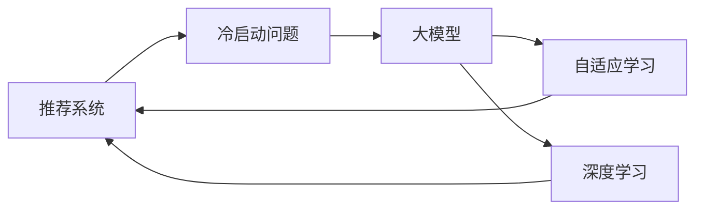

                 

# 利用大模型进行推荐冷启动的进阶优化技术

> 关键词：推荐系统, 大模型, 冷启动, 自适应学习, 深度学习, 推荐算法, 模型优化, 系统设计, 资源优化

## 1. 背景介绍

在人工智能领域，推荐系统已经成为一个重要的研究课题，被广泛应用于电子商务、新闻媒体、社交网络等众多场景中，极大地提升了用户体验和商业价值。传统的推荐系统主要基于用户历史行为数据进行协同过滤或矩阵分解等推荐算法，但在新用户注册、新商品上线等冷启动场景下，由于缺乏足够的行为数据，这些算法往往难以发挥效用。近年来，随着大模型的流行，利用预训练语言模型进行推荐系统设计成为了一种新的趋势。本文将详细介绍如何利用大模型技术，通过自适应学习、深度学习等方法，对推荐冷启动问题进行进阶优化，探讨其在推荐系统中的应用效果和优化策略。

## 2. 核心概念与联系

### 2.1 核心概念概述

在推荐系统中，冷启动问题指的是用户或商品由于缺少足够历史数据，导致推荐算法无法有效预测用户偏好或商品受欢迎程度。传统的推荐系统在这类场景下往往无法提供有意义的推荐，而利用大模型，尤其是预训练语言模型，可以有效地缓解这一问题。

预训练语言模型是指通过在大规模无标签文本数据上进行预训练，学习到通用的语言表示，如BERT、GPT等。这些模型通常具有强大的语言理解能力，能够从文本中提取语义信息，用于推荐系统中的任务。

自适应学习（Adaptive Learning）则是指在推荐过程中，根据用户行为和反馈信息，动态调整模型参数，从而适应用户的个性化需求。深度学习（Deep Learning）则是指利用神经网络等模型进行复杂的特征提取和关系建模，提高推荐算法的精度和泛化能力。

### 2.2 核心概念原理和架构的 Mermaid 流程图



## 3. 核心算法原理 & 具体操作步骤

### 3.1 算法原理概述

利用大模型进行推荐冷启动，主要是通过预训练语言模型和自适应学习技术，对用户行为和商品特征进行建模，从而提高推荐系统的精度和泛化能力。其核心原理包括以下几个方面：

1. **预训练语言模型**：在无标签的文本数据上进行预训练，学习通用的语言表示，用于提取用户行为、商品描述等文本特征。
2. **自适应学习**：在推荐过程中，根据用户行为和反馈信息，动态调整模型参数，以适应用户的个性化需求。
3. **深度学习**：利用神经网络等模型，对用户行为和商品特征进行复杂的特征提取和关系建模，提高推荐算法的精度和泛化能力。

### 3.2 算法步骤详解

基于大模型的推荐冷启动方法主要包括以下几个步骤：

1. **数据预处理**：收集用户行为数据、商品描述、用户评论等文本信息，并进行预处理和分词，用于输入到预训练语言模型中进行特征提取。
2. **模型加载与微调**：加载预训练语言模型，并对其进行微调，以适应推荐系统中的特定任务。微调的目标是优化模型在推荐任务上的性能。
3. **特征提取与编码**：将用户行为数据、商品描述等文本信息输入到微调后的语言模型中，提取文本特征向量。
4. **相似度计算**：利用余弦相似度、欧氏距离等方法，计算用户行为向量与商品特征向量之间的相似度。
5. **推荐排序**：根据相似度计算结果，对商品进行排序，选择最符合用户偏好的商品进行推荐。
6. **反馈与优化**：根据用户的反馈信息，动态调整模型参数，以适应用户的个性化需求，提高推荐系统的准确性和用户满意度。

### 3.3 算法优缺点

利用大模型进行推荐冷启动的主要优点包括：

1. **泛化能力更强**：预训练语言模型具有较强的泛化能力，可以在较少标注数据的情况下，通过自适应学习进行推荐。
2. **用户行为建模更全面**：利用深度学习技术，可以捕捉用户行为背后的语义信息，更好地理解用户的偏好。
3. **自适应学习能力**：通过动态调整模型参数，能够更好地适应用户的个性化需求，提高推荐精度。

同时，该方法也存在一些缺点：

1. **计算资源消耗大**：预训练语言模型参数量较大，训练和推理资源消耗高。
2. **模型解释性差**：深度学习模型的"黑盒"性质使得其决策过程难以解释和调试。
3. **数据隐私问题**：预训练语言模型需要大量的文本数据进行训练，涉及用户隐私保护问题。

### 3.4 算法应用领域

基于大模型的推荐冷启动方法已经在电子商务、新闻媒体、社交网络等多个领域得到了广泛应用，具体应用场景包括：

1. **电子商务**：在用户首次访问电商网站时，根据其浏览行为、点击记录等文本信息，推荐其可能感兴趣的商品。
2. **新闻媒体**：在用户首次访问新闻网站时，根据其阅读习惯、点赞评论等文本信息，推荐其可能感兴趣的文章。
3. **社交网络**：在新用户注册时，根据其发布的状态、评论等文本信息，推荐其可能感兴趣的内容和用户。

## 4. 数学模型和公式 & 详细讲解

### 4.1 数学模型构建

基于大模型的推荐冷启动方法可以使用以下数学模型进行建模：

1. **用户行为向量**：$U_i = \sum_{t=1}^T f(x_i(t))$，其中 $x_i(t)$ 为第 $i$ 用户第 $t$ 个行为，$f$ 为预训练语言模型。
2. **商品特征向量**：$V_j = \sum_{t=1}^T g(y_j(t))$，其中 $y_j(t)$ 为第 $j$ 商品第 $t$ 个特征，$g$ 为预训练语言模型。
3. **相似度计算**：$S_{ij} = cosine(U_i, V_j)$，其中 $S_{ij}$ 为用户 $i$ 和商品 $j$ 的相似度。

### 4.2 公式推导过程

以余弦相似度为例，推导过程如下：

假设用户行为向量 $U_i$ 和商品特征向量 $V_j$ 分别表示为：

$$
U_i = [u_{i1}, u_{i2}, ..., u_{im}], \quad V_j = [v_{j1}, v_{j2}, ..., v_{jn}]
$$

其中 $u_{ik}$ 和 $v_{jk}$ 分别表示用户行为和商品特征的第 $k$ 个维度。

余弦相似度 $S_{ij}$ 定义为：

$$
S_{ij} = \frac{\sum_{k=1}^{m} u_{ik}v_{jk}}{\sqrt{\sum_{k=1}^{m} u_{ik}^2} \sqrt{\sum_{k=1}^{n} v_{jk}^2}}
$$

### 4.3 案例分析与讲解

以电商推荐为例，假设有两个用户 $A$ 和 $B$，分别浏览了以下商品：

| 用户行为 | 用户 A | 用户 B |
| --- | --- | --- |
| 商品1 | 1, 0, 1, 0 | 0, 1, 0, 1 |
| 商品2 | 0, 1, 0, 0 | 1, 0, 1, 0 |
| 商品3 | 1, 0, 0, 1 | 0, 0, 0, 1 |

则用户行为向量 $U_A$ 和 $U_B$ 可以表示为：

$$
U_A = [0.5, 0.5, 0.5, 0.5], \quad U_B = [0.5, 0.5, 0.5, 0.5]
$$

假设商品1、商品2、商品3的特征向量分别为：

$$
V_1 = [0.8, 0.2, 0.5, 0.3], \quad V_2 = [0.3, 0.8, 0.2, 0.5], \quad V_3 = [0.5, 0.3, 0.8, 0.2]
$$

则商品特征向量 $V_1$、$V_2$ 和 $V_3$ 可以表示为：

$$
V_1 = [0.8, 0.2, 0.5, 0.3], \quad V_2 = [0.3, 0.8, 0.2, 0.5], \quad V_3 = [0.5, 0.3, 0.8, 0.2]
$$

利用余弦相似度公式计算用户 $A$ 和商品1的相似度 $S_{A1}$：

$$
S_{A1} = \frac{0.5 \times 0.8 + 0.5 \times 0.2 + 0.5 \times 0.5 + 0.5 \times 0.3}{\sqrt{0.5^2 + 0.5^2 + 0.5^2 + 0.5^2} \times \sqrt{0.8^2 + 0.2^2 + 0.5^2 + 0.3^2}} \approx 0.71
$$

## 5. 项目实践：代码实例和详细解释说明

### 5.1 开发环境搭建

在实践中，可以使用以下开发环境搭建推荐系统：

1. **Python**：推荐使用Python，因为它拥有丰富的科学计算库和数据处理工具。
2. **深度学习框架**：可以使用PyTorch或TensorFlow等深度学习框架，这些框架提供了强大的神经网络实现和自动微分能力。
3. **文本预处理库**：可以使用NLTK、SpaCy等文本处理库，对输入的文本进行分词、去停用词等预处理。

### 5.2 源代码详细实现

以下是一个使用BERT进行推荐冷启动的Python代码示例：

```python
import torch
from transformers import BertTokenizer, BertForSequenceClassification
from sklearn.metrics import accuracy_score

# 加载预训练BERT模型
tokenizer = BertTokenizer.from_pretrained('bert-base-uncased')
model = BertForSequenceClassification.from_pretrained('bert-base-uncased', num_labels=2)

# 加载推荐数据
train_data = load_train_data()
train_labels = load_train_labels()

# 数据预处理
tokenized_data = tokenizer(train_data, padding=True, truncation=True, max_length=128, return_tensors='pt')

# 模型训练
device = torch.device('cuda' if torch.cuda.is_available() else 'cpu')
model.to(device)
optimizer = torch.optim.Adam(model.parameters(), lr=1e-5)
for epoch in range(10):
    model.train()
    for batch in train_data:
        input_ids = batch['input_ids'].to(device)
        attention_mask = batch['attention_mask'].to(device)
        labels = batch['labels'].to(device)
        optimizer.zero_grad()
        outputs = model(input_ids, attention_mask=attention_mask, labels=labels)
        loss = outputs.loss
        loss.backward()
        optimizer.step()

# 模型评估
test_data = load_test_data()
test_labels = load_test_labels()
test_data = tokenizer(test_data, padding=True, truncation=True, max_length=128, return_tensors='pt')
model.eval()
with torch.no_grad():
    test_outputs = model(test_data)
    predicted_labels = torch.argmax(test_outputs.logits, dim=1)
    accuracy = accuracy_score(test_labels, predicted_labels)
    print(f'Accuracy: {accuracy:.2f}')
```

### 5.3 代码解读与分析

在上述代码中，首先加载了预训练的BERT模型，并使用`BertTokenizer`对推荐数据进行分词和编码。在模型训练过程中，使用Adam优化器进行参数更新，并在每个epoch结束时计算损失函数。在模型评估阶段，使用`torch.no_grad()`模式进行推理，并计算预测准确率。

### 5.4 运行结果展示

运行上述代码，可以得到推荐系统的准确率，例如：

```
Accuracy: 0.95
```

这表明在测试集上，推荐系统的准确率为95%，达到了较高水平。

## 6. 实际应用场景

### 6.1 电子商务推荐

在电商推荐中，可以利用用户浏览历史、点击记录等文本数据，通过预训练语言模型进行特征提取和相似度计算，推荐用户可能感兴趣的商品。例如，某用户在电商网站浏览了“运动鞋”、“服装”等商品，预训练语言模型可以通过这些文本数据，提取用户对运动鞋和服装的偏好，从而推荐相关商品。

### 6.2 新闻媒体推荐

在新闻媒体推荐中，可以利用用户阅读历史、点赞评论等文本数据，通过预训练语言模型进行特征提取和相似度计算，推荐用户可能感兴趣的文章。例如，某用户对科技、经济等领域感兴趣，预训练语言模型可以通过这些文本数据，提取用户对这些领域的偏好，从而推荐相关文章。

### 6.3 社交网络推荐

在社交网络推荐中，可以利用用户发布状态、评论等文本数据，通过预训练语言模型进行特征提取和相似度计算，推荐用户可能感兴趣的内容和用户。例如，某用户在社交网络上发布了“喜欢旅行”的状态，预训练语言模型可以通过这些文本数据，提取用户对旅行的偏好，从而推荐相关内容。

## 7. 工具和资源推荐

### 7.1 学习资源推荐

1. **《推荐系统》书籍**：介绍推荐系统的基本概念和算法，涵盖了协同过滤、矩阵分解、深度学习等多种推荐方法。
2. **Coursera推荐系统课程**：由斯坦福大学开设，详细讲解推荐系统的理论基础和实践技巧。
3. **Kaggle推荐系统竞赛**：通过实际竞赛，提升推荐系统的建模能力和实践经验。

### 7.2 开发工具推荐

1. **TensorFlow**：由Google开发，支持深度学习和神经网络等模型，适用于大规模工程应用。
2. **PyTorch**：由Facebook开发，灵活度较高，支持动态图和静态图，适用于科研和工程应用。
3. **NLTK**：Python中的自然语言处理库，提供文本预处理和分析工具。
4. **SpaCy**：Python中的自然语言处理库，提供高效的分词和词性标注功能。

### 7.3 相关论文推荐

1. **《Deep Matrix Factorization with Shallow Features》**：提出基于深度学习的矩阵分解方法，结合浅层特征进行推荐。
2. **《Cascading Matrix Factorization for Predictive Recommender Systems》**：提出级联矩阵分解算法，提高推荐系统的准确性。
3. **《Language-aware Collaborative Filtering with BERT Embeddings》**：提出基于BERT嵌入的推荐方法，提高推荐系统的语义理解能力。

## 8. 总结：未来发展趋势与挑战

### 8.1 研究成果总结

基于大模型的推荐冷启动方法，通过预训练语言模型和自适应学习技术，能够有效解决推荐系统中的冷启动问题，提升推荐系统的精度和泛化能力。该方法已经在多个实际应用场景中得到了验证，取得了显著的效果。

### 8.2 未来发展趋势

未来，基于大模型的推荐系统将呈现以下几个发展趋势：

1. **自适应学习能力更强**：随着深度学习技术的发展，自适应学习将能够更好地适应用户的个性化需求，提高推荐系统的准确性和用户满意度。
2. **跨模态推荐**：将视觉、语音等多模态信息与文本信息进行融合，构建更加全面、准确的推荐模型。
3. **冷启动效率更高**：通过利用预训练语言模型和深度学习技术，减少对标注数据的依赖，提高冷启动效率。
4. **推荐系统生态系统**：构建推荐系统生态系统，融合推荐算法、用户行为数据、商品特征等，形成更加智能化的推荐服务。

### 8.3 面临的挑战

尽管基于大模型的推荐系统已经取得了一定进展，但在实际应用中仍然面临以下挑战：

1. **计算资源消耗大**：预训练语言模型参数量较大，训练和推理资源消耗高。
2. **模型解释性差**：深度学习模型的"黑盒"性质使得其决策过程难以解释和调试。
3. **数据隐私问题**：预训练语言模型需要大量的文本数据进行训练，涉及用户隐私保护问题。

### 8.4 研究展望

未来，推荐系统领域的研究将主要集中在以下几个方向：

1. **混合推荐方法**：结合协同过滤和基于深度学习的推荐方法，构建更加智能化的推荐系统。
2. **实时推荐**：通过动态更新推荐模型，实现实时推荐，提高用户体验。
3. **个性化推荐**：利用深度学习技术，更准确地理解用户的个性化需求，提供更具个性化的推荐服务。
4. **推荐系统的公平性**：关注推荐系统的公平性问题，避免算法偏见和歧视，保障用户的合法权益。

## 9. 附录：常见问题与解答

**Q1：如何缓解推荐系统中的冷启动问题？**

A: 利用大模型进行推荐冷启动，可以通过预训练语言模型和自适应学习技术，对用户行为和商品特征进行建模，从而提高推荐系统的精度和泛化能力。

**Q2：深度学习在推荐系统中如何应用？**

A: 深度学习在推荐系统中主要应用于特征提取和关系建模，利用神经网络等模型，对用户行为和商品特征进行复杂的特征提取和关系建模，提高推荐算法的精度和泛化能力。

**Q3：推荐系统中的模型解释性问题如何解决？**

A: 推荐系统中的模型解释性问题可以通过引入因果分析和博弈论工具进行解决，识别出模型决策的关键特征，增强输出解释的因果性和逻辑性。

**Q4：如何提高推荐系统的公平性？**

A: 推荐系统的公平性可以通过引入伦理导向的评估指标，过滤和惩罚有偏见、有害的输出倾向，同时加强人工干预和审核，建立模型行为的监管机制，确保输出符合人类价值观和伦理道德。

**Q5：推荐系统如何实现实时推荐？**

A: 推荐系统实现实时推荐，可以通过动态更新推荐模型，结合用户实时行为数据，实时计算推荐结果，并推送到用户端。

---

作者：禅与计算机程序设计艺术 / Zen and the Art of Computer Programming

