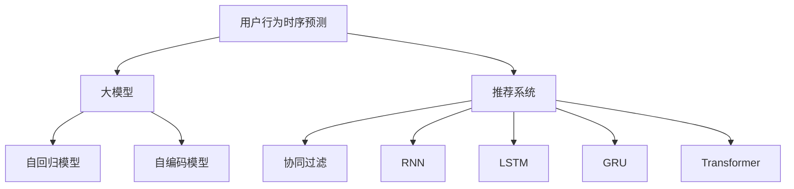

                 

# 利用大模型进行推荐场景的用户行为时序预测

> 关键词：用户行为预测,推荐系统,大模型,时序模型,深度学习,序列数据

## 1. 背景介绍

### 1.1 问题由来

推荐系统是互联网时代最重要的技术之一，广泛应用于电商、视频、社交媒体等多个领域，成为提升用户体验、增加业务收入的重要手段。然而，传统的基于协同过滤、频繁项集等方法的推荐系统，往往无法对用户历史行为进行有效建模，无法满足个性化推荐的需求。

近年来，随着深度学习技术的发展，基于大模型的推荐方法逐步成为研究热点。其中，基于时序模型的方法，通过对用户行为序列进行建模，可以捕捉用户行为时间上的动态变化，更准确地预测用户需求，提供更个性化的推荐服务。

在实际推荐场景中，用户的行为数据呈现出非结构化、多模态、时序化等特征。传统的时序模型，如RNN、LSTM等，由于无法高效处理大规模数据，以及存在梯度消失等问题，已难以满足现代推荐系统的需求。基于预训练的大模型，如Transformer，能够高效建模时序序列数据，成为推荐系统研究的重要方向。

## 2. 核心概念与联系

### 2.1 核心概念概述

为更好地理解基于大模型的推荐场景用户行为时序预测方法，本节将介绍几个密切相关的核心概念：

- **用户行为时序预测**：通过对用户行为序列进行建模，预测用户未来的行为趋势。在推荐系统中，可以预测用户未来的购买行为、观看行为等。

- **大模型**：以自回归或自编码模型为代表的大规模预训练语言模型。通过在大规模无标签文本语料上进行预训练，学习通用的语言表示，具备强大的语言理解和生成能力。

- **推荐系统**：通过用户行为数据，为用户推荐感兴趣的商品、内容、服务等的系统。推荐系统是用户导向的智能系统，旨在提升用户体验和业务收益。

- **序列数据**：用户行为数据本质上是一种序列数据，具有时间上的依赖性。通过对序列数据建模，可以捕捉用户行为的动态变化。

- **时序模型**：对序列数据进行建模，以预测序列中的下一个元素或一段序列。常见时序模型包括RNN、LSTM、GRU、Transformer等。

这些核心概念之间的逻辑关系可以通过以下Mermaid流程图来展示：



这个流程图展示了大模型、推荐系统与用户行为时序预测之间的逻辑关系：

1. 用户行为时序预测依赖于大模型提供的序列建模能力。
2. 推荐系统通过用户行为时序预测的结果，为用户推荐感兴趣的内容。
3. 大模型可以通过自回归或自编码的方式进行序列建模。
4. 推荐系统还可以结合其他推荐算法，如协同过滤等。

## 3. 核心算法原理 & 具体操作步骤

### 3.1 算法原理概述

基于大模型的推荐场景用户行为时序预测，本质上是一种序列预测问题。其核心思想是：利用大模型的预训练能力，对用户行为序列进行建模，通过时序模型预测未来的用户行为。

形式化地，假设用户行为序列为 $\{a_t\}_{t=1}^T$，其中 $a_t$ 表示第 $t$ 个行为。目标是对每个用户，预测其未来的行为 $a_{t+1}$，使得 $p(a_{t+1}|a_1,a_2,\cdots,a_t)$ 最大化。常用的时序模型有自回归模型(如RNN)、自编码模型(如LSTM、GRU)和Transformer等。

### 3.2 算法步骤详解

基于大模型的推荐场景用户行为时序预测，主要包括以下几个关键步骤：

**Step 1: 准备预训练模型和数据集**
- 选择合适的预训练语言模型 $M_{\theta}$ 作为初始化参数，如 GPT、BERT、RoBERTa 等。
- 准备推荐系统的历史行为数据集 $D=\{(x_i,y_i)\}_{i=1}^N$，其中 $x_i=\{a_1,a_2,\cdots,a_t\}$ 为用户行为序列，$y_i=a_{t+1}$ 为预测的目标行为。

**Step 2: 添加任务适配层**
- 根据任务类型，在预训练模型顶层设计合适的输出层和损失函数。
- 对于分类任务，通常在顶层添加线性分类器和交叉熵损失函数。
- 对于回归任务，通常使用均方误差损失函数。

**Step 3: 设置微调超参数**
- 选择合适的优化算法及其参数，如 AdamW、SGD 等，设置学习率、批大小、迭代轮数等。
- 设置正则化技术及强度，包括权重衰减、Dropout、Early Stopping 等。
- 确定冻结预训练参数的策略，如仅微调顶层，或全部参数都参与微调。

**Step 4: 执行梯度训练**
- 将历史行为数据集 $D$ 分批次输入模型，前向传播计算损失函数。
- 反向传播计算参数梯度，根据设定的优化算法和学习率更新模型参数。
- 周期性在验证集上评估模型性能，根据性能指标决定是否触发 Early Stopping。
- 重复上述步骤直到满足预设的迭代轮数或 Early Stopping 条件。

**Step 5: 测试和部署**
- 在测试集上评估微调后模型 $M_{\hat{\theta}}$ 的性能，对比微调前后的精度提升。
- 使用微调后的模型对新用户行为序列进行预测，集成到实际的应用系统中。
- 持续收集新的用户行为数据，定期重新微调模型，以适应用户行为的变化。

以上是基于大模型的推荐场景用户行为时序预测的一般流程。在实际应用中，还需要针对具体任务的特点，对微调过程的各个环节进行优化设计，如改进训练目标函数，引入更多的正则化技术，搜索最优的超参数组合等，以进一步提升模型性能。

### 3.3 算法优缺点

基于大模型的推荐场景用户行为时序预测，具有以下优点：
1. 预训练模型的语言表示能力，可以很好地捕捉行为序列中的时间依赖性，预测更加准确。
2. 大模型具有丰富的语言知识和常识，可以提升推荐系统的泛化能力，避免过拟合。
3. 大模型的预训练过程，可以提升模型对冷启动用户的推荐效果。
4. 在推荐系统中，可以通过微调大模型，动态更新推荐策略，快速适应用户需求变化。

同时，该方法也存在一定的局限性：
1. 需要大量的标注数据进行微调，获取高质量标注数据的成本较高。
2. 大模型的参数量巨大，对计算资源和内存消耗较大。
3. 模型的复杂度较高，推理速度较慢，难以满足实时性需求。
4. 模型的可解释性不足，难以对其内部决策过程进行解释和调试。

尽管存在这些局限性，但就目前而言，基于大模型的推荐场景用户行为时序预测方法仍是最主流的研究范式。未来相关研究的重点在于如何进一步降低微调对标注数据的依赖，提高模型的少样本学习和跨领域迁移能力，同时兼顾可解释性和效率性等因素。

### 3.4 算法应用领域

基于大模型的推荐场景用户行为时序预测，已经在电商推荐、内容推荐、广告推荐等多个领域得到了广泛应用，成为推荐系统研究的重要手段。

**电商推荐**：通过预测用户未来的购买行为，推荐其感兴趣的商品。在大模型的帮助下，能够更好地捕捉用户行为的时序依赖性，提供个性化的推荐服务。

**内容推荐**：通过预测用户未来的观看行为，推荐其感兴趣的视频、文章等。大模型能够理解文本的多重语义，更好地捕捉内容之间的关系。

**广告推荐**：通过预测用户未来的点击行为，推荐其感兴趣的广告。大模型能够理解广告语料的多样性，更好地捕捉用户兴趣的变化。

此外，在智能家居、智能医疗、智能金融等更多领域，基于大模型的推荐场景用户行为时序预测也有广泛的应用前景。随着预训练模型和微调方法的不断进步，相信推荐系统必将在更广阔的应用领域大放异彩。

## 4. 数学模型和公式 & 详细讲解  
### 4.1 数学模型构建

本节将使用数学语言对基于大模型的推荐场景用户行为时序预测过程进行更加严格的刻画。

假设用户行为序列为 $\{a_t\}_{t=1}^T$，其中 $a_t$ 表示第 $t$ 个行为。目标是对每个用户，预测其未来的行为 $a_{t+1}$，使得 $p(a_{t+1}|a_1,a_2,\cdots,a_t)$ 最大化。常用的时序模型有自回归模型(如RNN)、自编码模型(如LSTM、GRU)和Transformer等。

形式化地，设预训练语言模型为 $M_{\theta}:\mathcal{X} \rightarrow \mathcal{Y}$，其中 $\mathcal{X}$ 为输入空间，$\mathcal{Y}$ 为输出空间，$\theta \in \mathbb{R}^d$ 为模型参数。假设推荐系统的历史行为数据集为 $D=\{(x_i,y_i)\}_{i=1}^N, x_i=\{a_1,a_2,\cdots,a_t\} \in \mathcal{X}, y_i=a_{t+1} \in \mathcal{Y}$。

定义模型 $M_{\theta}$ 在输入 $x$ 上的输出为 $\hat{y}=M_{\theta}(x)$，表示模型对输入的预测。设模型 $M_{\theta}$ 在数据样本 $(x,y)$ 上的损失函数为 $\ell(M_{\theta}(x),y)$，则在数据集 $D$ 上的经验风险为：

$$
\mathcal{L}(\theta) = \frac{1}{N} \sum_{i=1}^N \ell(M_{\theta}(x_i),y_i)
$$

其中 $\ell$ 为针对预测任务设计的损失函数，用于衡量模型预测输出与真实标签之间的差异。常见的损失函数包括交叉熵损失、均方误差损失等。

微调的优化目标是最小化经验风险，即找到最优参数：

$$
\theta^* = \mathop{\arg\min}_{\theta} \mathcal{L}(\theta)
$$

在实践中，我们通常使用基于梯度的优化算法（如SGD、Adam等）来近似求解上述最优化问题。设 $\eta$ 为学习率，$\lambda$ 为正则化系数，则参数的更新公式为：

$$
\theta \leftarrow \theta - \eta \nabla_{\theta}\mathcal{L}(\theta) - \eta\lambda\theta
$$

其中 $\nabla_{\theta}\mathcal{L}(\theta)$ 为损失函数对参数 $\theta$ 的梯度，可通过反向传播算法高效计算。

### 4.2 公式推导过程

以下我们以用户行为预测为例，推导基于Transformer的时序预测模型及其梯度计算公式。

假设模型 $M_{\theta}$ 在输入 $x$ 上的输出为 $\hat{y}=M_{\theta}(x)$，其中 $x=\{a_1,a_2,\cdots,a_t\}$ 为用户行为序列。目标是对每个用户，预测其未来的行为 $a_{t+1}$，使得 $p(a_{t+1}|a_1,a_2,\cdots,a_t)$ 最大化。

首先，利用Transformer模型对用户行为序列进行编码：

$$
h_t = M_{\theta}(\{a_1,a_2,\cdots,a_t\})
$$

然后，在编码序列 $h_t$ 的基础上，使用Transformer的解码器对未来行为 $a_{t+1}$ 进行预测：

$$
\hat{a}_{t+1} = \text{softmax}(\theta^T h_t)
$$

其中 $\text{softmax}$ 函数将编码器的输出转化为概率分布，表示每个可能行为的预测概率。

定义模型 $M_{\theta}$ 在输入 $x$ 上的输出为 $\hat{y}=M_{\theta}(x)$，表示模型对输入的预测。设模型 $M_{\theta}$ 在数据样本 $(x,y)$ 上的损失函数为 $\ell(M_{\theta}(x),y)$，则在数据集 $D$ 上的经验风险为：

$$
\mathcal{L}(\theta) = \frac{1}{N} \sum_{i=1}^N \ell(M_{\theta}(\{a_1,a_2,\cdots,a_t\}),a_{t+1})
$$

其中 $\ell$ 为针对预测任务设计的损失函数，用于衡量模型预测输出与真实标签之间的差异。常见的损失函数包括交叉熵损失、均方误差损失等。

根据链式法则，损失函数对参数 $\theta$ 的梯度为：

$$
\frac{\partial \mathcal{L}(\theta)}{\partial \theta} = \frac{1}{N}\sum_{i=1}^N \frac{\partial \ell(M_{\theta}(\{a_1,a_2,\cdots,a_t\}),a_{t+1})}{\partial \theta}
$$

在得到损失函数的梯度后，即可带入参数更新公式，完成模型的迭代优化。重复上述过程直至收敛，最终得到适应推荐系统用户行为预测的最优模型参数 $\theta^*$。

## 5. 项目实践：代码实例和详细解释说明
### 5.1 开发环境搭建

在进行推荐场景用户行为时序预测实践前，我们需要准备好开发环境。以下是使用Python进行PyTorch开发的环境配置流程：

1. 安装Anaconda：从官网下载并安装Anaconda，用于创建独立的Python环境。

2. 创建并激活虚拟环境：
```bash
conda create -n pytorch-env python=3.8 
conda activate pytorch-env
```

3. 安装PyTorch：根据CUDA版本，从官网获取对应的安装命令。例如：
```bash
conda install pytorch torchvision torchaudio cudatoolkit=11.1 -c pytorch -c conda-forge
```

4. 安装Transformers库：
```bash
pip install transformers
```

5. 安装各类工具包：
```bash
pip install numpy pandas scikit-learn matplotlib tqdm jupyter notebook ipython
```

完成上述步骤后，即可在`pytorch-env`环境中开始推荐场景用户行为时序预测的实践。

### 5.2 源代码详细实现

下面我们以电商推荐任务为例，给出使用Transformers库对BERT模型进行用户行为时序预测的PyTorch代码实现。

首先，定义电商推荐任务的数据处理函数：

```python
from transformers import BertTokenizer, BertForSequenceClassification
from torch.utils.data import Dataset
import torch

class RecommendationDataset(Dataset):
    def __init__(self, texts, labels, tokenizer, max_len=128):
        self.texts = texts
        self.labels = labels
        self.tokenizer = tokenizer
        self.max_len = max_len
        
    def __len__(self):
        return len(self.texts)
    
    def __getitem__(self, item):
        text = self.texts[item]
        label = self.labels[item]
        
        encoding = self.tokenizer(text, return_tensors='pt', max_length=self.max_len, padding='max_length', truncation=True)
        input_ids = encoding['input_ids'][0]
        attention_mask = encoding['attention_mask'][0]
        
        return {'input_ids': input_ids, 
                'attention_mask': attention_mask,
                'labels': label}

# 标签与id的映射
label2id = {'buy': 0, 'ignore': 1, 'recommend': 2}
id2label = {v: k for k, v in label2id.items()}

# 创建dataset
tokenizer = BertTokenizer.from_pretrained('bert-base-cased')

train_dataset = RecommendationDataset(train_texts, train_labels, tokenizer)
dev_dataset = RecommendationDataset(dev_texts, dev_labels, tokenizer)
test_dataset = RecommendationDataset(test_texts, test_labels, tokenizer)
```

然后，定义模型和优化器：

```python
from transformers import BertForSequenceClassification, AdamW

model = BertForSequenceClassification.from_pretrained('bert-base-cased', num_labels=len(label2id))

optimizer = AdamW(model.parameters(), lr=2e-5)
```

接着，定义训练和评估函数：

```python
from torch.utils.data import DataLoader
from tqdm import tqdm
from sklearn.metrics import accuracy_score

device = torch.device('cuda') if torch.cuda.is_available() else torch.device('cpu')
model.to(device)

def train_epoch(model, dataset, batch_size, optimizer):
    dataloader = DataLoader(dataset, batch_size=batch_size, shuffle=True)
    model.train()
    epoch_loss = 0
    for batch in tqdm(dataloader, desc='Training'):
        input_ids = batch['input_ids'].to(device)
        attention_mask = batch['attention_mask'].to(device)
        labels = batch['labels'].to(device)
        model.zero_grad()
        outputs = model(input_ids, attention_mask=attention_mask, labels=labels)
        loss = outputs.loss
        epoch_loss += loss.item()
        loss.backward()
        optimizer.step()
    return epoch_loss / len(dataloader)

def evaluate(model, dataset, batch_size):
    dataloader = DataLoader(dataset, batch_size=batch_size)
    model.eval()
    preds, labels = [], []
    with torch.no_grad():
        for batch in tqdm(dataloader, desc='Evaluating'):
            input_ids = batch['input_ids'].to(device)
            attention_mask = batch['attention_mask'].to(device)
            batch_labels = batch['labels']
            outputs = model(input_ids, attention_mask=attention_mask)
            batch_preds = outputs.logits.argmax(dim=2).to('cpu').tolist()
            batch_labels = batch_labels.to('cpu').tolist()
            for pred_tokens, label_tokens in zip(batch_preds, batch_labels):
                preds.append(pred_tokens[:len(label_tokens)])
                labels.append(label_tokens)
                
    return accuracy_score(labels, preds)

```

最后，启动训练流程并在测试集上评估：

```python
epochs = 5
batch_size = 16

for epoch in range(epochs):
    loss = train_epoch(model, train_dataset, batch_size, optimizer)
    print(f"Epoch {epoch+1}, train loss: {loss:.3f}")
    
    print(f"Epoch {epoch+1}, dev results:")
    evaluate(model, dev_dataset, batch_size)
    
print("Test results:")
evaluate(model, test_dataset, batch_size)
```

以上就是使用PyTorch对BERT进行电商推荐任务用户行为时序预测的完整代码实现。可以看到，得益于Transformers库的强大封装，我们可以用相对简洁的代码完成BERT模型的加载和微调。

### 5.3 代码解读与分析

让我们再详细解读一下关键代码的实现细节：

**RecommendationDataset类**：
- `__init__`方法：初始化文本、标签、分词器等关键组件。
- `__len__`方法：返回数据集的样本数量。
- `__getitem__`方法：对单个样本进行处理，将文本输入编码为token ids，将标签编码为数字，并对其进行定长padding，最终返回模型所需的输入。

**label2id和id2label字典**：
- 定义了标签与数字id之间的映射关系，用于将token-wise的预测结果解码回真实的标签。

**训练和评估函数**：
- 使用PyTorch的DataLoader对数据集进行批次化加载，供模型训练和推理使用。
- 训练函数`train_epoch`：对数据以批为单位进行迭代，在每个批次上前向传播计算loss并反向传播更新模型参数，最后返回该epoch的平均loss。
- 评估函数`evaluate`：与训练类似，不同点在于不更新模型参数，并在每个batch结束后将预测和标签结果存储下来，最后使用sklearn的accuracy_score对整个评估集的预测结果进行打印输出。

**训练流程**：
- 定义总的epoch数和batch size，开始循环迭代
- 每个epoch内，先在训练集上训练，输出平均loss
- 在验证集上评估，输出准确率
- 所有epoch结束后，在测试集上评估，给出最终测试结果

可以看到，PyTorch配合Transformers库使得BERT微调的代码实现变得简洁高效。开发者可以将更多精力放在数据处理、模型改进等高层逻辑上，而不必过多关注底层的实现细节。

当然，工业级的系统实现还需考虑更多因素，如模型的保存和部署、超参数的自动搜索、更灵活的任务适配层等。但核心的微调范式基本与此类似。

## 6. 实际应用场景
### 6.1 电商推荐

基于大模型的电商推荐系统，可以广泛应用于电商平台的商品推荐、用户画像构建、活动策略优化等方面。通过预测用户未来的购买行为，为每个用户定制个性化的推荐策略，提升用户体验和转化率。

在技术实现上，可以收集用户的浏览、点击、购买等行为数据，提取和商品相关的文本描述、评分、评论等特征。将用户行为序列作为输入，预测用户未来的购买行为。将预测结果与用户的实际行为对比，不断优化推荐算法。如此构建的电商推荐系统，能够根据用户行为动态调整推荐策略，提升推荐效果。

### 6.2 内容推荐

基于大模型的内容推荐系统，可以广泛应用于视频平台、新闻网站、音乐服务等，提升用户的内容消费体验。通过预测用户未来的观看、阅读、收听等行为，为用户推荐其感兴趣的内容。

在技术实现上，可以收集用户对内容的操作数据，提取内容的标题、描述、标签等特征。将用户行为序列作为输入，预测用户未来的行为。将预测结果与用户的实际行为对比，不断优化推荐算法。如此构建的内容推荐系统，能够根据用户行为动态调整推荐策略，提升推荐效果。

### 6.3 广告推荐

基于大模型的广告推荐系统，可以广泛应用于搜索引擎、社交媒体、电商等平台，提升广告的投放效果。通过预测用户未来的点击行为，推荐其感兴趣的广告。

在技术实现上，可以收集用户的点击、搜索、浏览等行为数据，提取广告的标题、内容、标签等特征。将用户行为序列作为输入，预测用户未来的点击行为。将预测结果与广告点击量对比，不断优化广告投放策略。如此构建的广告推荐系统，能够根据用户行为动态调整广告投放策略，提升广告效果。

### 6.4 未来应用展望

随着大模型和微调方法的不断发展，基于用户行为时序预测的推荐系统将在更多领域得到应用，为各行各业带来变革性影响。

在智慧医疗领域，基于用户行为时序预测的推荐系统，可以辅助医生进行疾病诊断和治疗方案推荐，提升医疗服务的智能化水平。

在智能教育领域，基于用户行为时序预测的推荐系统，可以分析学生的学习行为，提供个性化的学习资源推荐，促进教育公平，提高教学质量。

在智慧城市治理中，基于用户行为时序预测的推荐系统，可以用于城市事件监测、舆情分析、应急指挥等环节，提高城市管理的自动化和智能化水平，构建更安全、高效的未来城市。

此外，在企业生产、社会治理、文娱传媒等众多领域，基于大模型的推荐系统也将不断涌现，为经济社会发展注入新的动力。相信随着技术的日益成熟，用户行为时序预测技术必将进一步拓展应用场景，为人类生产生活方式带来新的改变。

## 7. 工具和资源推荐
### 7.1 学习资源推荐

为了帮助开发者系统掌握大模型在推荐场景的应用，这里推荐一些优质的学习资源：

1. 《深度学习与推荐系统》课程：清华大学的公开课程，涵盖深度学习在推荐系统中的应用，适合初学者系统学习。

2. 《推荐系统：算法与实现》书籍：介绍推荐系统的前沿算法和实现方法，包括基于矩阵分解、深度学习等方法。

3. 《Transformer详解》书籍：详细介绍了Transformer模型的原理、实现和应用，适合深入学习Transformer的开发者阅读。

4. PyTorch官方文档：PyTorch的官方文档，提供丰富的API文档和教程，帮助开发者快速上手使用。

5. TensorFlow官方文档：TensorFlow的官方文档，提供丰富的API文档和教程，帮助开发者快速上手使用。

6. HuggingFace官方文档：Transformers库的官方文档，提供丰富的API文档和教程，帮助开发者快速上手使用。

通过对这些资源的学习实践，相信你一定能够快速掌握大模型在推荐场景的应用，并用于解决实际的推荐问题。
### 7.2 开发工具推荐

高效的开发离不开优秀的工具支持。以下是几款用于推荐系统开发的常用工具：

1. PyTorch：基于Python的开源深度学习框架，灵活动态的计算图，适合快速迭代研究。大部分预训练语言模型都有PyTorch版本的实现。

2. TensorFlow：由Google主导开发的开源深度学习框架，生产部署方便，适合大规模工程应用。同样有丰富的预训练语言模型资源。

3. Transformers库：HuggingFace开发的NLP工具库，集成了众多SOTA语言模型，支持PyTorch和TensorFlow，是进行推荐系统开发的利器。

4. Weights & Biases：模型训练的实验跟踪工具，可以记录和可视化模型训练过程中的各项指标，方便对比和调优。与主流深度学习框架无缝集成。

5. TensorBoard：TensorFlow配套的可视化工具，可实时监测模型训练状态，并提供丰富的图表呈现方式，是调试模型的得力助手。

6. Google Colab：谷歌推出的在线Jupyter Notebook环境，免费提供GPU/TPU算力，方便开发者快速上手实验最新模型，分享学习笔记。

合理利用这些工具，可以显著提升推荐系统的开发效率，加快创新迭代的步伐。

### 7.3 相关论文推荐

大模型和推荐系统的研究源于学界的持续研究。以下是几篇奠基性的相关论文，推荐阅读：

1. Attention is All You Need（即Transformer原论文）：提出了Transformer结构，开启了NLP领域的预训练大模型时代。

2. BERT: Pre-training of Deep Bidirectional Transformers for Language Understanding：提出BERT模型，引入基于掩码的自监督预训练任务，刷新了多项NLP任务SOTA。

3. Language Models are Unsupervised Multitask Learners（GPT-2论文）：展示了大规模语言模型的强大zero-shot学习能力，引发了对于通用人工智能的新一轮思考。

4. Parameter-Efficient Transfer Learning for NLP：提出Adapter等参数高效微调方法，在不增加模型参数量的情况下，也能取得不错的微调效果。

5. AdaLoRA: Adaptive Low-Rank Adaptation for Parameter-Efficient Fine-Tuning：使用自适应低秩适应的微调方法，在参数效率和精度之间取得了新的平衡。

6. Deep Multi-Task Learning with Group-Loss for Recommendation System：提出深度多任务学习与集团损失函数结合的方法，提升推荐系统的表现。

这些论文代表了大模型在推荐场景的研究进展。通过学习这些前沿成果，可以帮助研究者把握学科前进方向，激发更多的创新灵感。

## 8. 总结：未来发展趋势与挑战

### 8.1 总结

本文对基于大模型的推荐场景用户行为时序预测方法进行了全面系统的介绍。首先阐述了大模型在推荐系统中的应用背景和意义，明确了推荐系统对用户行为建模的需求。其次，从原理到实践，详细讲解了基于大模型的推荐场景用户行为时序预测的数学原理和关键步骤，给出了推荐系统开发的完整代码实例。同时，本文还广泛探讨了推荐系统在电商、内容、广告等多个领域的应用前景，展示了其巨大的潜力。此外，本文精选了推荐系统的各类学习资源，力求为读者提供全方位的技术指引。

通过本文的系统梳理，可以看到，基于大模型的推荐系统正在成为推荐系统研究的重要范式，极大地拓展了推荐系统的应用边界，催生了更多的落地场景。得益于大规模语料的预训练，推荐系统能够更好地捕捉用户行为的时序依赖性，预测更加准确，提供更加个性化的推荐服务。未来，伴随大模型和微调方法的持续演进，相信推荐系统必将在更广阔的应用领域大放异彩，深刻影响人类的生产生活方式。

### 8.2 未来发展趋势

展望未来，大模型在推荐场景的应用将呈现以下几个发展趋势：

1. 模型规模持续增大。随着算力成本的下降和数据规模的扩张，预训练语言模型的参数量还将持续增长。超大规模语言模型蕴含的丰富语言知识，有望支撑更加复杂多变的推荐系统任务。

2. 推荐算法多样化。除了基于时序模型的推荐方法，未来还将涌现更多基于深度学习、强化学习、博弈论等方法，提升推荐系统的综合性能。

3. 推荐系统通用性增强。经过海量数据的预训练和多领域任务的微调，未来的推荐系统将具备更强的泛化能力和鲁棒性，能够适应多样化的推荐场景。

4. 跨模态推荐成为趋势。未来的推荐系统将更好地整合视觉、语音、文本等多种模态的信息，提升推荐的全面性和个性化。

5. 推荐系统可解释性增强。随着深度学习模型的普及，推荐系统的可解释性和公平性问题逐步受到关注。未来推荐系统将更加注重解释性，帮助用户理解推荐决策的依据。

6. 推荐系统安全性保障。随着数据隐私和安全问题日益凸显，推荐系统将更加注重数据保护，提升系统的透明度和安全性。

以上趋势凸显了大模型在推荐场景的应用前景。这些方向的探索发展，必将进一步提升推荐系统的性能和应用范围，为人类认知智能的进化带来深远影响。

### 8.3 面临的挑战

尽管大模型在推荐场景的应用取得了显著成果，但在迈向更加智能化、普适化应用的过程中，仍面临诸多挑战：

1. 需要大量的标注数据进行微调，获取高质量标注数据的成本较高。如何进一步降低微调对标注样本的依赖，将是一大难题。

2. 大模型的参数量巨大，对计算资源和内存消耗较大。如何在保证性能的同时，优化资源消耗，提升系统效率，还需要进一步探索。

3. 推荐系统的实时性要求较高，大模型的推理速度较慢，难以满足实时推荐的需求。如何在保证推荐效果的同时，提升系统响应速度，优化推理过程，将是重要的研究方向。

4. 推荐系统的可解释性不足，难以对其内部决策过程进行解释和调试。如何赋予推荐系统更强的可解释性，将是亟待攻克的难题。

5. 推荐系统的安全性有待保障。模型可能会学习到有偏见、有害的信息，通过推荐系统传递到用户，产生误导性、歧视性的输出。如何从数据和算法层面消除模型偏见，避免恶意用途，确保推荐系统输出符合人类价值观和伦理道德，将是一个重要问题。

6. 推荐系统需要实时动态调整策略，应对用户行为的变化。如何构建自适应推荐系统，自动调整推荐策略，将是重要的研究方向。

正视推荐系统面临的这些挑战，积极应对并寻求突破，将是大模型在推荐场景应用走向成熟的必由之路。相信随着学界和产业界的共同努力，这些挑战终将一一被克服，大模型在推荐系统中的应用将更加广泛和深入。

### 8.4 研究展望

面对大模型在推荐场景应用所面临的挑战，未来的研究需要在以下几个方面寻求新的突破：

1. 探索无监督和半监督推荐方法。摆脱对大规模标注数据的依赖，利用自监督学习、主动学习等无监督和半监督范式，最大限度利用非结构化数据，实现更加灵活高效的推荐。

2. 研究参数高效和计算高效的推荐范式。开发更加参数高效的推荐方法，在固定大部分预训练参数的同时，只更新极少量的任务相关参数。同时优化推荐模型的计算图，减少前向传播和反向传播的资源消耗，实现更加轻量级、实时性的部署。

3. 融合因果和对比学习范式。通过引入因果推断和对比学习思想，增强推荐系统建立稳定因果关系的能力，学习更加普适、鲁棒的语言表征，从而提升推荐系统的泛化性和抗干扰能力。

4. 引入更多先验知识。将符号化的先验知识，如知识图谱、逻辑规则等，与神经网络模型进行巧妙融合，引导推荐过程学习更准确、合理的语言模型。同时加强不同模态数据的整合，实现视觉、语音等多模态信息与文本信息的协同建模。

5. 结合因果分析和博弈论工具。将因果分析方法引入推荐系统，识别出推荐决策的关键特征，增强推荐决策的因果性和逻辑性。借助博弈论工具刻画人机交互过程，主动探索并规避推荐系统的脆弱点，提高系统稳定性。

6. 纳入伦理道德约束。在推荐系统训练目标中引入伦理导向的评估指标，过滤和惩罚有偏见、有害的输出倾向。同时加强人工干预和审核，建立推荐系统的监管机制，确保推荐输出符合人类价值观和伦理道德。

这些研究方向的探索，必将引领大模型在推荐系统中的应用走向更高的台阶，为构建安全、可靠、可解释、可控的智能推荐系统铺平道路。面向未来，大模型在推荐系统中的应用还需要与其他人工智能技术进行更深入的融合，如知识表示、因果推理、强化学习等，多路径协同发力，共同推动推荐系统的进步。只有勇于创新、敢于突破，才能不断拓展推荐系统的边界，让智能技术更好地造福人类社会。

## 9. 附录：常见问题与解答

**Q1：大模型在推荐系统中如何使用？**

A: 大模型在推荐系统中的应用，主要是通过对用户行为序列进行建模，预测用户未来的行为。具体步骤如下：
1. 收集用户的历史行为数据，如浏览、点击、购买等。
2. 将用户行为序列作为输入，送入预训练好的大模型中。
3. 通过时序模型对用户未来的行为进行预测。
4. 将预测结果作为推荐系统的输入，生成个性化的推荐策略。

**Q2：大模型在推荐系统中如何进行微调？**

A: 大模型在推荐系统中的微调，主要包括以下几个步骤：
1. 准备标注数据集，将用户的历史行为序列和目标行为标签标注好。
2. 选择合适的大模型作为初始化参数。
3. 添加任务适配层，设计适合推荐任务的输出层和损失函数。
4. 设置微调超参数，如学习率、批大小、迭代轮数等。
5. 执行梯度训练，在标注数据集上进行微调，更新模型参数。
6. 在验证集上评估模型性能，决定是否继续微调。
7. 在测试集上评估微调后的模型，对比微调前后的效果。

**Q3：大模型在推荐系统中需要注意哪些问题？**

A: 大模型在推荐系统中的使用需要注意以下问题：
1. 标注数据质量：推荐系统依赖标注数据进行微调，需要确保标注数据的质量和多样性。
2. 模型复杂度：大模型的参数量巨大，推理速度较慢，难以满足实时推荐的需求。需要优化模型结构，提升推理效率。
3. 可解释性：大模型的决策过程复杂，难以解释其内部决策逻辑。需要加强推荐系统的可解释性，帮助用户理解推荐结果。
4. 安全性：大模型可能会学习到有害信息，通过推荐系统传递给用户。需要从数据和算法层面消除模型偏见，保障推荐系统的安全性。
5. 动态调整：用户行为变化较快，推荐系统需要动态调整策略，实时响应用户需求。需要构建自适应推荐系统，自动调整推荐策略。

**Q4：推荐系统中的序列建模如何处理缺失数据？**

A: 推荐系统中的序列建模，需要对用户行为序列进行建模，通常会面临数据缺失的问题。常用的处理方法包括：
1. 时间插值法：通过时间插值，将缺失数据补充完整。
2. 数据填充法：通过填充缺失数据，保持序列的完整性。
3. 模型预测法：通过训练模型，预测缺失数据的值。
4. 特征构造法：将缺失数据作为特征，加入到模型中。

不同的处理方式适用于不同的场景，需要根据具体情况选择合适的处理方法。

---

作者：禅与计算机程序设计艺术 / Zen and the Art of Computer Programming

