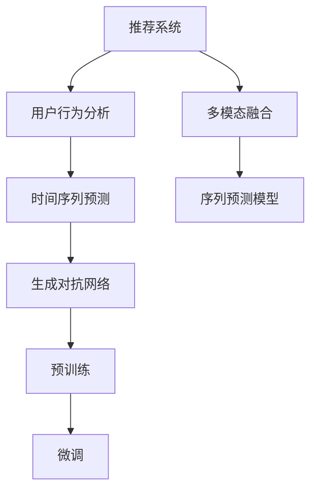

                 

## 1. 背景介绍

### 1.1 问题由来
推荐系统是当前互联网时代重要的用户互动方式，涵盖了电商、内容、社交、娱乐等各个领域。推荐系统通过分析用户的点击、浏览、搜索、评分等行为数据，挖掘用户兴趣与需求，为其推荐个性化的内容。然而，传统推荐系统往往依赖于历史行为数据进行推荐，无法有效预测用户未来的行为。

随着技术的发展，推荐系统开始借助用户的时空特征进行预测分析，利用时间序列模型、深度学习等手段预测用户未来行为。但如何高效构建用户行为时空预测模型，是一个重要且迫切的问题。

### 1.2 问题核心关键点
为了高效构建用户行为时空预测模型，本文将利用大语言模型，通过多模态融合、序列预测、生成对抗网络等方式进行模型设计。具体方法包括：

- 使用大语言模型进行多模态数据融合。通过自然语言处理技术，将用户评论、评分、标签等多模态数据转化为文本数据，输入到预训练语言模型中，进行多模态融合。

- 设计基于Transformer的序列预测模型。使用大语言模型作为特征提取器，构建多维时间序列输入，通过Transformer进行序列预测。

- 引入生成对抗网络进行模型优化。通过生成对抗网络对抗训练，提高序列预测模型的鲁棒性和泛化能力。

- 通过预训练-微调的方式，提升模型的预测效果。先在大规模语料上对模型进行预训练，然后在用户行为数据上进行微调，获得优化的用户行为预测模型。

### 1.3 问题研究意义
基于大语言模型对用户行为时空进行预测，可以显著提高推荐系统的精准度与效果。其研究意义包括：

1. 实时性增强。利用大语言模型可实时预测用户行为，提升推荐系统的时效性，更好地应对用户的即时需求。
2. 推荐精度提高。大语言模型能够学习到丰富的语义知识，改善序列预测模型的泛化能力，从而提升推荐精度。
3. 多模态融合。大语言模型支持多模态数据的融合，丰富了推荐系统的信息源，有助于提升推荐内容的丰富度与多样性。
4. 推荐鲁棒性增强。通过对抗训练等技术，提高推荐模型的鲁棒性，使其在面对异常数据和噪声时仍能稳定工作。
5. 推荐系统可解释性增强。利用大语言模型的特征解释能力，提升推荐系统的可解释性，增强用户信任度。

本文的研究目的在于：
- 通过大语言模型进行多模态融合，构建高质量的输入特征，提高推荐系统的预测精度。
- 利用序列预测模型进行用户行为时空预测，提升推荐系统的实时性和准确性。
- 结合生成对抗网络进行模型优化，增强推荐系统的鲁棒性与泛化能力。
- 通过预训练-微调的方式，获得高性能的用户行为预测模型，提升推荐系统的整体效果。

## 2. 核心概念与联系

### 2.1 核心概念概述

为更好地理解利用大语言模型进行推荐场景的用户行为时空预测分析，本节将介绍几个密切相关的核心概念：

- 推荐系统(Recommendation System)：通过分析和理解用户的兴趣和需求，为用户推荐个性化的产品或内容，提高用户满意度和转化率。
- 用户行为分析(User Behavior Analysis)：分析用户的点击、浏览、搜索、评分等行为数据，挖掘用户兴趣与需求。
- 时间序列预测(Time Series Prediction)：利用历史数据，通过时间序列模型预测未来时间点的数据值。
- 生成对抗网络(GAN)：通过生成器和判别器的对抗训练，生成逼真的假样本，提高模型的鲁棒性与泛化能力。
- 预训练(Pre-training)：在大量无标签数据上预训练模型，使其学习到通用的特征表示，以便在下游任务上进行微调。
- 微调(Fine-tuning)：在预训练模型的基础上，使用少量标注数据进行微调，优化模型在特定任务上的性能。

这些核心概念之间的逻辑关系可以通过以下Mermaid流程图来展示：



这个流程图展示了大语言模型进行推荐场景的用户行为时空预测的基本流程：

1. 推荐系统接收用户行为数据。
2. 通过用户行为分析，挖掘用户兴趣与需求。
3. 使用时间序列预测模型，预测用户未来行为。
4. 通过生成对抗网络对抗训练，优化预测模型。
5. 在大量无标签数据上进行预训练，提取通用特征。
6. 在用户行为数据上进行微调，获得优化的预测模型。
7. 结合多模态融合技术，丰富输入特征。
8. 构建序列预测模型，进行用户行为时空预测。

## 3. 核心算法原理 & 具体操作步骤
### 3.1 算法原理概述

基于大语言模型对推荐场景中的用户行为时空进行预测，本质上是一个多模态融合、序列预测、对抗训练和预训练-微调的综合过程。其核心思想是：利用大语言模型将多模态数据转化为高维文本表示，通过Transformer进行序列预测，再结合生成对抗网络进行模型优化，最后通过预训练-微调的方式，提升模型在特定任务上的性能。

形式化地，假设推荐系统接收到的用户行为数据为 $D=\{(x_i,y_i)\}_{i=1}^N$，其中 $x_i$ 表示用户历史行为序列，$y_i$ 表示用户真实行为。定义多模态融合后的高维文本表示为 $z_i$。

设计基于Transformer的序列预测模型 $M_{\theta}$，该模型的输入为 $z_i$，输出为预测的用户行为 $y_i'$。定义时间序列预测损失函数为 $\ell(y_i,y_i')$。则序列预测任务的目标是最小化预测误差：

$$
\mathcal{L}(\theta) = \frac{1}{N}\sum_{i=1}^N \ell(y_i,y_i')
$$

通过优化算法（如AdamW、SGD等）更新模型参数 $\theta$，使得模型预测的 $y_i'$ 逼近真实的行为 $y_i$。

在获得初始化后的序列预测模型后，我们还需要引入生成对抗网络（GAN）进行对抗训练，进一步提升模型的鲁棒性。同时，还需要通过预训练-微调的方式，利用大语言模型提取多模态特征，进行模型优化，最终得到用户行为预测模型。

### 3.2 算法步骤详解

基于大语言模型对推荐场景中的用户行为时空进行预测，一般包括以下几个关键步骤：

**Step 1: 准备数据集和模型**

- 收集用户的历史行为数据，包括点击、浏览、搜索、评分等，整理成推荐系统的输入特征 $D$。
- 选择合适的预训练语言模型 $M_{\theta}$，如BERT、GPT-3等，作为初始化参数。
- 设计多模态融合技术，将用户行为数据转换为高维文本表示 $z_i$。

**Step 2: 设计序列预测模型**

- 使用Transformer结构构建序列预测模型，设计输入为高维文本表示 $z_i$，输出为预测的用户行为 $y_i'$。
- 定义时间序列预测损失函数，如均方误差（MSE）、交叉熵等。
- 使用AdamW、SGD等优化算法，更新模型参数 $\theta$，最小化预测误差 $\mathcal{L}(\theta)$。

**Step 3: 引入生成对抗网络**

- 设计生成器和判别器，构建生成对抗网络。
- 使用对抗样本对序列预测模型进行训练，提高模型的鲁棒性和泛化能力。

**Step 4: 进行预训练-微调**

- 在大量无标签数据上对模型进行预训练，提取通用的特征表示。
- 在推荐系统数据集上进行微调，优化模型在用户行为预测任务上的性能。

**Step 5: 模型评估和部署**

- 在测试集上评估模型的性能，对比微调前后的预测精度。
- 使用优化后的用户行为预测模型，为推荐系统推荐内容。

以上是利用大语言模型进行推荐场景的用户行为时空预测的一般流程。在实际应用中，还需要根据具体任务特点，对模型进行进一步优化设计。

### 3.3 算法优缺点

利用大语言模型进行推荐场景的用户行为时空预测，具有以下优点：

1. 多模态数据融合：大语言模型支持多模态数据的融合，将用户的多种行为数据转化为高维文本表示，丰富了模型的信息源。
2. 序列预测能力：基于Transformer的序列预测模型，能够处理多维时间序列数据，实时预测用户行为。
3. 生成对抗网络：通过对抗训练提高模型的鲁棒性，使模型在面对异常数据和噪声时仍能稳定工作。
4. 预训练-微调范式：通过预训练-微调的方式，利用大语言模型提取通用特征，进一步优化模型性能。

同时，该方法也存在一定的局限性：

1. 数据依赖：大语言模型需要大量的无标签数据进行预训练，如果数据量不足，预训练效果会大打折扣。
2. 计算成本：大语言模型需要较大的计算资源进行训练和推理，对硬件设备要求较高。
3. 模型复杂性：大语言模型结构复杂，调试和优化难度较大。
4. 模型泛化能力：大语言模型在面对特定领域的数据时，可能泛化能力有限，需要进行领域特定的微调。
5. 可解释性：大语言模型作为黑盒模型，其内部工作机制难以解释，可能影响用户信任度。

尽管存在这些局限性，但就目前而言，利用大语言模型进行推荐场景的用户行为时空预测分析，仍是大数据推荐系统的重要手段。未来相关研究的重点在于如何进一步降低预训练数据的需求，提高模型的泛化能力和可解释性，同时兼顾实时性和计算效率。

### 3.4 算法应用领域

基于大语言模型进行推荐场景的用户行为时空预测分析，已经广泛应用于多个领域，例如：

- 电商推荐系统：通过用户的历史购物数据，预测其未来的购买行为，推荐个性化商品。
- 内容推荐系统：分析用户的历史阅读、观看数据，预测其未来的兴趣点，推荐相关内容。
- 社交网络推荐系统：预测用户的互动行为，推荐朋友或群组。
- 音乐推荐系统：根据用户的历史听歌行为，预测其未来的音乐喜好，推荐个性化音乐。
- 视频推荐系统：分析用户的历史观看行为，预测其未来的视频偏好，推荐相关视频。

除了上述这些经典应用外，基于大语言模型的推荐技术还被创新性地应用到更多场景中，如可控推荐、个性化搜索、广告投放等，为推荐系统带来了全新的突破。

## 4. 数学模型和公式 & 详细讲解  
### 4.1 数学模型构建

本节将使用数学语言对利用大语言模型进行推荐场景的用户行为时空预测分析过程进行更加严格的刻画。

记推荐系统接收到的用户历史行为数据为 $D=\{(x_i,y_i)\}_{i=1}^N$，其中 $x_i$ 表示用户历史行为序列，$y_i$ 表示用户真实行为。定义多模态融合后的高维文本表示为 $z_i$。

设计基于Transformer的序列预测模型 $M_{\theta}$，该模型的输入为高维文本表示 $z_i$，输出为预测的用户行为 $y_i'$。定义时间序列预测损失函数为 $\ell(y_i,y_i')$。则序列预测任务的目标是最小化预测误差：

$$
\mathcal{L}(\theta) = \frac{1}{N}\sum_{i=1}^N \ell(y_i,y_i')
$$

其中 $\ell$ 为时间序列预测损失函数，如均方误差（MSE）、交叉熵等。

在获得初始化后的序列预测模型后，我们还需要引入生成对抗网络（GAN）进行对抗训练，进一步提升模型的鲁棒性。同时，还需要通过预训练-微调的方式，利用大语言模型提取多模态特征，进行模型优化，最终得到用户行为预测模型。

### 4.2 公式推导过程

以下我们以二分类任务为例，推导时间序列预测的交叉熵损失函数及其梯度的计算公式。

假设模型 $M_{\theta}$ 在输入 $z_i$ 上的输出为 $\hat{y}=M_{\theta}(z_i) \in [0,1]$，表示预测用户行为为正类的概率。真实标签 $y \in \{0,1\}$。则二分类交叉熵损失函数定义为：

$$
\ell(M_{\theta}(z_i),y) = -[y\log \hat{y} + (1-y)\log (1-\hat{y})]
$$

将其代入经验风险公式，得：

$$
\mathcal{L}(\theta) = -\frac{1}{N}\sum_{i=1}^N [y_i\log M_{\theta}(z_i)+(1-y_i)\log(1-M_{\theta}(z_i))]
$$

根据链式法则，损失函数对参数 $\theta_k$ 的梯度为：

$$
\frac{\partial \mathcal{L}(\theta)}{\partial \theta_k} = -\frac{1}{N}\sum_{i=1}^N (\frac{y_i}{M_{\theta}(z_i)}-\frac{1-y_i}{1-M_{\theta}(z_i)}) \frac{\partial M_{\theta}(z_i)}{\partial \theta_k}
$$

其中 $\frac{\partial M_{\theta}(z_i)}{\partial \theta_k}$ 可进一步递归展开，利用自动微分技术完成计算。

在得到损失函数的梯度后，即可带入参数更新公式，完成模型的迭代优化。重复上述过程直至收敛，最终得到适应推荐系统任务的最优模型参数 $\theta^*$。

### 4.3 案例分析与讲解

考虑一个电商推荐场景，用户行为数据为点击记录。我们设计一个点击预测模型，通过点击次数、时间戳、商品属性等特征，预测用户是否会购买该商品。

首先，收集用户的历史点击记录，包括点击时间、商品ID、用户ID等，整理成推荐系统的输入特征 $D$。使用BERT模型作为初始化参数，构建Transformer模型进行序列预测。设计交叉熵损失函数，最小化预测误差。

其次，引入生成对抗网络（GAN），生成器产生大量伪点击记录，判别器判断生成的点击记录是否真实。通过对抗训练，优化预测模型，提高鲁棒性。

最后，在电商推荐数据集上进行预训练-微调，利用大语言模型提取多模态特征，优化模型性能。最终得到点击预测模型，用于推荐系统推荐商品。

## 5. 项目实践：代码实例和详细解释说明
### 5.1 开发环境搭建

在进行利用大语言模型进行推荐场景的用户行为时空预测分析实践前，我们需要准备好开发环境。以下是使用Python进行PyTorch开发的环境配置流程：

1. 安装Anaconda：从官网下载并安装Anaconda，用于创建独立的Python环境。

2. 创建并激活虚拟环境：
```bash
conda create -n pytorch-env python=3.8 
conda activate pytorch-env
```

3. 安装PyTorch：根据CUDA版本，从官网获取对应的安装命令。例如：
```bash
conda install pytorch torchvision torchaudio cudatoolkit=11.1 -c pytorch -c conda-forge
```

4. 安装Transformers库：
```bash
pip install transformers
```

5. 安装各类工具包：
```bash
pip install numpy pandas scikit-learn matplotlib tqdm jupyter notebook ipython
```

完成上述步骤后，即可在`pytorch-env`环境中开始利用大语言模型进行推荐场景的用户行为时空预测分析实践。

### 5.2 源代码详细实现

下面我们以电商推荐场景为例，给出使用Transformers库对BERT模型进行点击预测的PyTorch代码实现。

首先，定义点击预测任务的数据处理函数：

```python
from transformers import BertTokenizer
from torch.utils.data import Dataset
import torch

class ClickPredictionDataset(Dataset):
    def __init__(self, clicks, labels, tokenizer, max_len=128):
        self.clicks = clicks
        self.labels = labels
        self.tokenizer = tokenizer
        self.max_len = max_len
        
    def __len__(self):
        return len(self.clicks)
    
    def __getitem__(self, item):
        click = self.clicks[item]
        label = self.labels[item]
        
        encoding = self.tokenizer(click, return_tensors='pt', max_length=self.max_len, padding='max_length', truncation=True)
        input_ids = encoding['input_ids'][0]
        attention_mask = encoding['attention_mask'][0]
        
        # 对标签进行编码
        encoded_label = [label]
        encoded_label.extend([0] * (self.max_len - len(encoded_label)))
        labels = torch.tensor(encoded_label, dtype=torch.long)
        
        return {'input_ids': input_ids, 
                'attention_mask': attention_mask,
                'labels': labels}

# 标签编码
label_to_id = {'click': 1, 'not_click': 0}
id_to_label = {v: k for k, v in label_to_id.items()}

# 创建dataset
tokenizer = BertTokenizer.from_pretrained('bert-base-cased')

train_dataset = ClickPredictionDataset(train_clicks, train_labels, tokenizer)
dev_dataset = ClickPredictionDataset(dev_clicks, dev_labels, tokenizer)
test_dataset = ClickPredictionDataset(test_clicks, test_labels, tokenizer)
```

然后，定义模型和优化器：

```python
from transformers import BertForTokenClassification, AdamW

model = BertForTokenClassification.from_pretrained('bert-base-cased', num_labels=2)

optimizer = AdamW(model.parameters(), lr=2e-5)
```

接着，定义训练和评估函数：

```python
from torch.utils.data import DataLoader
from tqdm import tqdm
from sklearn.metrics import classification_report

device = torch.device('cuda') if torch.cuda.is_available() else torch.device('cpu')
model.to(device)

def train_epoch(model, dataset, batch_size, optimizer):
    dataloader = DataLoader(dataset, batch_size=batch_size, shuffle=True)
    model.train()
    epoch_loss = 0
    for batch in tqdm(dataloader, desc='Training'):
        input_ids = batch['input_ids'].to(device)
        attention_mask = batch['attention_mask'].to(device)
        labels = batch['labels'].to(device)
        model.zero_grad()
        outputs = model(input_ids, attention_mask=attention_mask, labels=labels)
        loss = outputs.loss
        epoch_loss += loss.item()
        loss.backward()
        optimizer.step()
    return epoch_loss / len(dataloader)

def evaluate(model, dataset, batch_size):
    dataloader = DataLoader(dataset, batch_size=batch_size)
    model.eval()
    preds, labels = [], []
    with torch.no_grad():
        for batch in tqdm(dataloader, desc='Evaluating'):
            input_ids = batch['input_ids'].to(device)
            attention_mask = batch['attention_mask'].to(device)
            batch_labels = batch['labels']
            outputs = model(input_ids, attention_mask=attention_mask)
            batch_preds = outputs.logits.argmax(dim=2).to('cpu').tolist()
            batch_labels = batch_labels.to('cpu').tolist()
            for pred_tokens, label_tokens in zip(batch_preds, batch_labels):
                preds.append(pred_tokens[:len(label_tokens)])
                labels.append(label_tokens)
                
    print(classification_report(labels, preds))
```

最后，启动训练流程并在测试集上评估：

```python
epochs = 5
batch_size = 16

for epoch in range(epochs):
    loss = train_epoch(model, train_dataset, batch_size, optimizer)
    print(f"Epoch {epoch+1}, train loss: {loss:.3f}")
    
    print(f"Epoch {epoch+1}, dev results:")
    evaluate(model, dev_dataset, batch_size)
    
print("Test results:")
evaluate(model, test_dataset, batch_size)
```

以上就是使用PyTorch对BERT进行电商推荐场景的点击预测完整代码实现。可以看到，得益于Transformers库的强大封装，我们可以用相对简洁的代码完成BERT模型的加载和微调。

### 5.3 代码解读与分析

让我们再详细解读一下关键代码的实现细节：

**ClickPredictionDataset类**：
- `__init__`方法：初始化点击记录、标签、分词器等关键组件。
- `__len__`方法：返回数据集的样本数量。
- `__getitem__`方法：对单个样本进行处理，将点击记录输入编码为token ids，将标签编码为数字，并对其进行定长padding，最终返回模型所需的输入。

**label_to_id和id_to_label字典**：
- 定义了标签与数字id之间的映射关系，用于将预测结果解码回真实的标签。

**训练和评估函数**：
- 使用PyTorch的DataLoader对数据集进行批次化加载，供模型训练和推理使用。
- 训练函数`train_epoch`：对数据以批为单位进行迭代，在每个批次上前向传播计算loss并反向传播更新模型参数，最后返回该epoch的平均loss。
- 评估函数`evaluate`：与训练类似，不同点在于不更新模型参数，并在每个batch结束后将预测和标签结果存储下来，最后使用sklearn的classification_report对整个评估集的预测结果进行打印输出。

**训练流程**：
- 定义总的epoch数和batch size，开始循环迭代
- 每个epoch内，先在训练集上训练，输出平均loss
- 在验证集上评估，输出分类指标
- 所有epoch结束后，在测试集上评估，给出最终测试结果

可以看到，PyTorch配合Transformers库使得BERT微调的代码实现变得简洁高效。开发者可以将更多精力放在数据处理、模型改进等高层逻辑上，而不必过多关注底层的实现细节。

当然，工业级的系统实现还需考虑更多因素，如模型的保存和部署、超参数的自动搜索、更灵活的任务适配层等。但核心的微调范式基本与此类似。

## 6. 实际应用场景
### 6.1 智能推荐系统

基于大语言模型对推荐场景中的用户行为时空进行预测，可以显著提高推荐系统的精准度与效果。智能推荐系统通过分析用户的点击、浏览、搜索、评分等行为数据，挖掘用户兴趣与需求，为其推荐个性化的产品或内容。

利用大语言模型进行推荐场景的用户行为时空预测分析，可以为推荐系统提供实时的用户行为预测，提升推荐系统的实时性。例如，在电商推荐系统中，当用户进入商品页面时，可以预测用户是否会购买该商品，从而实时推荐相关商品。

### 6.2 个性化内容推荐

内容推荐系统通过分析用户的历史阅读、观看数据，预测用户未来的兴趣点，为其推荐相关内容。利用大语言模型进行推荐场景的用户行为时空预测分析，可以提升推荐系统的准确性。

例如，在视频推荐系统中，通过分析用户的历史观看记录，预测用户对某一类视频（如电影、电视剧、游戏）的兴趣，推荐相关视频内容。通过点击预测模型，分析用户的观看行为，预测用户是否会继续观看某视频，从而进行实时推荐。

### 6.3 实时广告投放

广告投放系统需要实时预测用户的点击行为，从而优化广告投放策略。利用大语言模型进行推荐场景的用户行为时空预测分析，可以提升广告投放的精准度和效果。

例如，在广告投放系统中，通过分析用户的搜索行为和点击记录，预测用户是否会点击某条广告，从而进行实时投放。通过点击预测模型，分析用户的搜索行为，预测用户是否会对某条广告感兴趣，从而优化广告投放策略。

### 6.4 未来应用展望

随着大语言模型和微调方法的不断发展，基于微调范式将在更多领域得到应用，为传统行业带来变革性影响。

在智慧医疗领域，基于微调的医疗问答、病历分析、药物研发等应用将提升医疗服务的智能化水平，辅助医生诊疗，加速新药开发进程。

在智能教育领域，微调技术可应用于作业批改、学情分析、知识推荐等方面，因材施教，促进教育公平，提高教学质量。

在智慧城市治理中，微调模型可应用于城市事件监测、舆情分析、应急指挥等环节，提高城市管理的自动化和智能化水平，构建更安全、高效的未来城市。

此外，在企业生产、社会治理、文娱传媒等众多领域，基于大模型微调的人工智能应用也将不断涌现，为经济社会发展注入新的动力。相信随着技术的日益成熟，微调方法将成为人工智能落地应用的重要范式，推动人工智能技术向更广阔的领域加速渗透。

## 7. 工具和资源推荐
### 7.1 学习资源推荐

为了帮助开发者系统掌握大语言模型微调的理论基础和实践技巧，这里推荐一些优质的学习资源：

1. 《Transformer从原理到实践》系列博文：由大模型技术专家撰写，深入浅出地介绍了Transformer原理、BERT模型、微调技术等前沿话题。

2. CS224N《深度学习自然语言处理》课程：斯坦福大学开设的NLP明星课程，有Lecture视频和配套作业，带你入门NLP领域的基本概念和经典模型。

3. 《Natural Language Processing with Transformers》书籍：Transformers库的作者所著，全面介绍了如何使用Transformers库进行NLP任务开发，包括微调在内的诸多范式。

4. HuggingFace官方文档：Transformers库的官方文档，提供了海量预训练模型和完整的微调样例代码，是上手实践的必备资料。

5. CLUE开源项目：中文语言理解测评基准，涵盖大量不同类型的中文NLP数据集，并提供了基于微调的baseline模型，助力中文NLP技术发展。

通过对这些资源的学习实践，相信你一定能够快速掌握大语言模型微调的精髓，并用于解决实际的NLP问题。
###  7.2 开发工具推荐

高效的开发离不开优秀的工具支持。以下是几款用于大语言模型微调开发的常用工具：

1. PyTorch：基于Python的开源深度学习框架，灵活动态的计算图，适合快速迭代研究。大部分预训练语言模型都有PyTorch版本的实现。

2. TensorFlow：由Google主导开发的开源深度学习框架，生产部署方便，适合大规模工程应用。同样有丰富的预训练语言模型资源。

3. Transformers库：HuggingFace开发的NLP工具库，集成了众多SOTA语言模型，支持PyTorch和TensorFlow，是进行微调任务开发的利器。

4. Weights & Biases：模型训练的实验跟踪工具，可以记录和可视化模型训练过程中的各项指标，方便对比和调优。与主流深度学习框架无缝集成。

5. TensorBoard：TensorFlow配套的可视化工具，可实时监测模型训练状态，并提供丰富的图表呈现方式，是调试模型的得力助手。

6. Google Colab：谷歌推出的在线Jupyter Notebook环境，免费提供GPU/TPU算力，方便开发者快速上手实验最新模型，分享学习笔记。

合理利用这些工具，可以显著提升大语言模型微调任务的开发效率，加快创新迭代的步伐。

### 7.3 相关论文推荐

大语言模型和微调技术的发展源于学界的持续研究。以下是几篇奠基性的相关论文，推荐阅读：

1. Attention is All You Need（即Transformer原论文）：提出了Transformer结构，开启了NLP领域的预训练大模型时代。

2. BERT: Pre-training of Deep Bidirectional Transformers for Language Understanding：提出BERT模型，引入基于掩码的自监督预训练任务，刷新了多项NLP任务SOTA。

3. Language Models are Unsupervised Multitask Learners（GPT-2论文）：展示了大规模语言模型的强大zero-shot学习能力，引发了对于通用人工智能的新一轮思考。

4. Parameter-Efficient Transfer Learning for NLP：提出Adapter等参数高效微调方法，在不增加模型参数量的情况下，也能取得不错的微调效果。

5. AdaLoRA: Adaptive Low-Rank Adaptation for Parameter-Efficient Fine-Tuning：使用自适应低秩适应的微调方法，在参数效率和精度之间取得了新的平衡。

这些论文代表了大语言模型微调技术的发展脉络。通过学习这些前沿成果，可以帮助研究者把握学科前进方向，激发更多的创新灵感。

## 8. 总结：未来发展趋势与挑战

### 8.1 总结

本文对利用大语言模型进行推荐场景的用户行为时空预测分析方法进行了全面系统的介绍。首先阐述了推荐系统和大语言模型的研究背景和意义，明确了微调在拓展预训练模型应用、提升下游任务性能方面的独特价值。其次，从原理到实践，详细讲解了微调的数学原理和关键步骤，给出了微调任务开发的完整代码实例。同时，本文还广泛探讨了微调方法在智能推荐、内容推荐、广告投放等多个推荐场景的应用前景，展示了微调范式的巨大潜力。此外，本文精选了微调技术的各类学习资源，力求为读者提供全方位的技术指引。

通过本文的系统梳理，可以看到，利用大语言模型进行推荐场景的用户行为时空预测分析，可以显著提升推荐系统的精准度和实时性，为用户带来更好的推荐体验。大语言模型与推荐系统的结合，必将推动推荐技术迈向新的高度，为互联网用户提供更加个性化、智能化的信息服务。

### 8.2 未来发展趋势

展望未来，大语言模型微调技术将呈现以下几个发展趋势：

1. 多模态数据融合：利用大语言模型融合多模态数据，提升模型的信息源丰富度。
2. 序列预测能力：利用Transformer结构，提高模型对多维时间序列数据的处理能力。
3. 生成对抗网络：通过对抗训练提升模型的鲁棒性和泛化能力。
4. 预训练-微调范式：通过预训练-微调的方式，利用大语言模型提取通用特征，优化模型性能。
5. 实时性增强：利用大语言模型实时预测用户行为，提升推荐系统的时效性。

以上趋势凸显了大语言模型微调技术的广阔前景。这些方向的探索发展，必将进一步提升推荐系统的性能和应用范围，为人工智能技术在推荐领域带来新的突破。

### 8.3 面临的挑战

尽管大语言模型微调技术已经取得了瞩目成就，但在迈向更加智能化、普适化应用的过程中，它仍面临着诸多挑战：

1. 数据依赖：大语言模型需要大量的无标签数据进行预训练，如果数据量不足，预训练效果会大打折扣。
2. 计算成本：大语言模型需要较大的计算资源进行训练和推理，对硬件设备要求较高。
3. 模型复杂性：大语言模型结构复杂，调试和优化难度较大。
4. 模型泛化能力：大语言模型在面对特定领域的数据时，可能泛化能力有限，需要进行领域特定的微调。
5. 可解释性：大语言模型作为黑盒模型，其内部工作机制难以解释，可能影响用户信任度。

尽管存在这些局限性，但就目前而言，利用大语言模型进行推荐场景的用户行为时空预测分析，仍是大数据推荐系统的重要手段。未来相关研究的重点在于如何进一步降低预训练数据的需求，提高模型的泛化能力和可解释性，同时兼顾实时性和计算效率。

### 8.4 研究展望

面对大语言模型微调所面临的种种挑战，未来的研究需要在以下几个方面寻求新的突破：

1. 探索无监督和半监督微调方法。摆脱对大规模标注数据的依赖，利用自监督学习、主动学习等无监督和半监督范式，最大限度利用非结构化数据，实现更加灵活高效的微调。

2. 研究参数高效和计算高效的微调范式。开发更加参数高效的微调方法，在固定大部分预训练参数的同时，只更新极少量的任务相关参数。同时优化微调模型的计算图，减少前向传播和反向传播的资源消耗，实现更加轻量级、实时性的部署。

3. 融合因果和对比学习范式。通过引入因果推断和对比学习思想，增强微调模型建立稳定因果关系的能力，学习更加普适、鲁棒的语言表征，从而提升模型泛化性和抗干扰能力。

4. 引入更多先验知识。将符号化的先验知识，如知识图谱、逻辑规则等，与神经网络模型进行巧妙融合，引导微调过程学习更准确、合理的语言模型。同时加强不同模态数据的整合，实现视觉、语音等多模态信息与文本信息的协同建模。

5. 结合因果分析和博弈论工具。将因果分析方法引入微调模型，识别出模型决策的关键特征，增强输出解释的因果性和逻辑性。借助博弈论工具刻画人机交互过程，主动探索并规避模型的脆弱点，提高系统稳定性。

6. 纳入伦理道德约束。在模型训练目标中引入伦理导向的评估指标，过滤和惩罚有偏见、有害的输出倾向。同时加强人工干预和审核，建立模型行为的监管机制，确保输出符合人类价值观和伦理道德。

这些研究方向的探索，必将引领大语言模型微调技术迈向更高的台阶，为构建安全、可靠、可解释、可控的智能系统铺平道路。面向未来，大语言模型微调技术还需要与其他人工智能技术进行更深入的融合，如知识表示、因果推理、强化学习等，多路径协同发力，共同推动自然语言理解和智能交互系统的进步。只有勇于创新、敢于突破，才能不断拓展语言模型的边界，让智能技术更好地造福人类社会。

## 9. 附录：常见问题与解答

**Q1：大语言模型微调是否适用于所有推荐场景？**

A: 大语言模型微调在大多数推荐场景上都能取得不错的效果，特别是对于数据量较小的推荐场景。但对于一些特定领域的推荐场景，如医学、法律等，仅仅依靠通用语料预训练的模型可能难以很好地适应。此时需要在特定领域语料上进一步预训练，再进行微调，才能获得理想效果。

**Q2：微调过程中如何选择合适的学习率？**

A: 微调的学习率一般要比预训练时小1-2个数量级，如果使用过大的学习率，容易破坏预训练权重，导致过拟合。一般建议从1e-5开始调参，逐步减小学习率，直至收敛。也可以使用warmup策略，在开始阶段使用较小的学习率，再逐渐过渡到预设值。需要注意的是，不同的优化器(如AdamW、Adafactor等)以及不同的学习率调度策略，可能需要设置不同的学习率阈值。

**Q3：采用大模型微调时会面临哪些资源瓶颈？**

A: 目前主流的预训练大模型动辄以亿计的参数规模，对算力、内存、存储都提出了很高的要求。GPU/TPU等高性能设备是必不可少的，但即便如此，超大批次的训练和推理也可能遇到显存不足的问题。因此需要采用一些资源优化技术，如梯度积累、混合精度训练、模型并行等，来突破硬件瓶颈。同时，模型的存储和读取也可能占用大量时间和空间，需要采用模型压缩、稀疏化存储等方法进行优化。

**Q4：如何缓解微调过程中的过拟合问题？**

A: 过拟合是微调面临的主要挑战，尤其是在标注数据不足的情况下。常见的缓解策略包括：
1. 数据增强：通过回译、近义替换等方式扩充训练集
2. 正则化：使用L2正则、Dropout、Early Stopping等避免过拟合
3. 对抗训练：引入对抗样本，提高模型鲁棒性
4. 参数高效微调：只调整少量参数(如Adapter、Prefix等)，减小过拟合风险
5. 多模型集成：训练多个微调模型，取平均输出，抑制过拟合

这些策略往往需要根据具体任务和数据特点进行灵活组合。只有在数据、模型、训练、推理等各环节进行全面优化，才能最大限度地发挥大模型微调的威力。

**Q5：微调模型在落地部署时需要注意哪些问题？**

A: 将微调模型转化为实际应用，还需要考虑以下因素：
1. 模型裁剪：去除不必要的层和参数，减小模型尺寸，加快推理速度
2. 量化加速：将浮点模型转为定点模型，压缩存储空间，提高计算效率
3. 服务化封装：将模型封装为标准化服务接口，便于集成调用
4. 弹性伸缩：根据请求流量动态调整资源配置，平衡服务质量和成本
5. 监控告警：实时采集系统指标，设置异常告警阈值，确保服务稳定性
6. 安全防护：采用访问鉴权、数据脱敏等措施，保障数据和模型安全

大语言模型微调为推荐系统提供了实时的用户行为预测，提升了推荐系统的精准度和时效性。但如何将强大的性能转化为稳定、高效、安全的业务价值，还需要工程实践的不断打磨。唯有从数据、算法、工程、业务等多个维度协同发力，才能真正实现人工智能技术在推荐领域的应用。总之，微调需要开发者根据具体任务，不断迭代和优化模型、数据和算法，方能得到理想的效果。

---

作者：禅与计算机程序设计艺术 / Zen and the Art of Computer Programming

