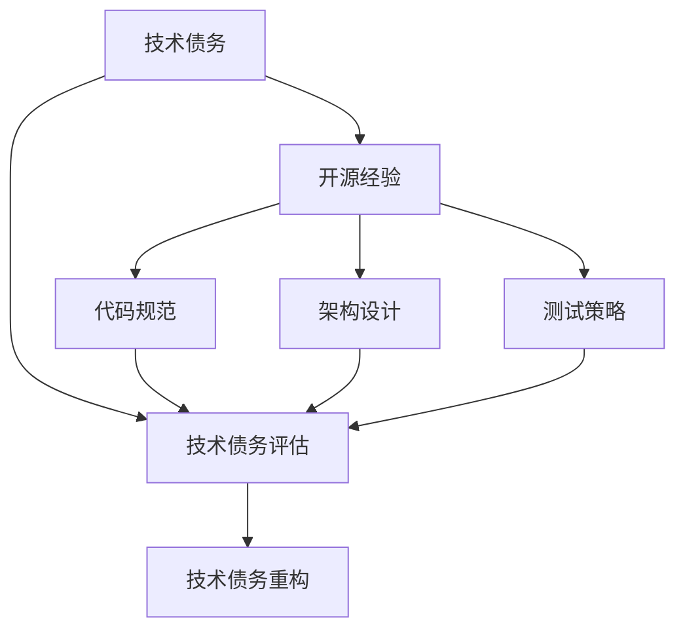

                 

# 利用开源经验提供技术债务评估和重构服务

## 1. 背景介绍

技术债务是指软件开发过程中产生的问题和遗漏，这些债务在项目后期会逐渐暴露并累积，影响系统性能、可维护性和可靠性。随着项目的进展，技术债务如不加以管理和控制，将极大增加项目成本，甚至导致项目失败。因此，及时有效地评估和重构技术债务，是项目成功的重要保障。

在当前软件开发领域，开源经验作为一种宝贵的资源，成为技术债务评估和重构的重要依据。本文旨在探讨如何利用开源经验，提供一种系统化、自动化的技术债务评估和重构服务。

## 2. 核心概念与联系

### 2.1 核心概念概述

本文将介绍几个核心概念：

- 技术债务（Technical Debt）：软件开发过程中产生的问题和遗漏，如代码重复、架构不合理、测试不足等，这些债务将随着时间累积，影响系统质量。
- 开源经验（Open Source Experience）：开源项目中的最佳实践、代码规范、架构设计等，可以作为评估和重构技术债务的重要参考。
- 技术债务评估（Technical Debt Assessment）：通过对项目代码、架构、测试等进行分析，评估技术债务的具体情况和严重程度。
- 技术债务重构（Technical Debt Refactoring）：对项目进行结构性改造，修复技术债务，提高系统性能和可维护性。
- 持续集成（Continuous Integration, CI）：一种开发实践，通过自动化构建和测试，及时发现和解决技术债务。

这些核心概念通过以下Mermaid流程图展示其联系：



## 3. 核心算法原理 & 具体操作步骤

### 3.1 算法原理概述

技术债务评估和重构的基本思想是通过对项目的代码、架构和测试进行全面分析，识别出技术债务的具体形式和严重程度，并根据开源经验中的最佳实践，有针对性地进行修复和优化。具体算法包括以下几个步骤：

1. **代码质量分析**：通过静态代码分析工具，评估代码的重复率、复杂度、可读性等质量指标。
2. **架构设计评估**：通过分析项目的架构设计，识别出架构不合理、模块耦合度过高、扩展性差等问题。
3. **测试覆盖率评估**：通过测试工具，评估测试用例的覆盖率，识别出测试不足或测试用例质量低下的问题。
4. **代码规范审查**：通过代码规范审查工具，确保代码遵循一致的编码风格和命名规范，提高代码的可读性和可维护性。
5. **架构重构**：根据架构评估结果，对不合理的架构进行重构，引入开源项目中的最佳设计模式和架构方案。
6. **测试策略优化**：根据测试覆盖率评估结果，优化测试策略，提高测试用例的覆盖率和测试用例的质量。
7. **代码重构**：根据代码质量分析结果，优化代码结构，去除重复代码，提高代码的可读性和可维护性。

### 3.2 算法步骤详解

1. **初始化配置**：
   - 配置开源经验来源，包括选择开源项目、版本、代码库等。
   - 定义评估和重构的标准和规则，如代码复杂度阈值、架构设计规范等。

2. **代码质量分析**：
   - 使用静态代码分析工具（如SonarQube、CodeClimate等），评估代码质量。
   - 生成质量报告，列出代码质量问题、重复代码等。

3. **架构设计评估**：
   - 使用架构评估工具（如ArchUnit、Structure101等），分析项目的架构设计。
   - 生成架构评估报告，识别架构不合理、模块耦合度过高、扩展性差等问题。

4. **测试覆盖率评估**：
   - 使用测试覆盖率工具（如 JaCoCo、Coveralls等），评估测试用例的覆盖率。
   - 生成测试覆盖率报告，列出测试不足或测试用例质量低下的问题。

5. **代码规范审查**：
   - 使用代码规范审查工具（如Pylint、ESLint等），审查代码规范。
   - 生成规范审查报告，列出违反代码规范的问题。

6. **技术债务评估**：
   - 综合以上报告，评估项目的技术债务情况。
   - 生成技术债务评估报告，列出主要的技术债务问题。

7. **技术债务重构**：
   - 根据技术债务评估结果，制定重构计划，引入开源项目中的最佳实践。
   - 执行重构，修复技术债务问题。

8. **持续集成**：
   - 在重构过程中，使用持续集成工具（如Jenkins、Travis CI等），自动化构建和测试。
   - 通过持续集成，及时发现和解决重构过程中产生的新问题。

### 3.3 算法优缺点

#### 优点：

- **基于开源经验**：通过借鉴开源项目中的最佳实践和代码规范，提高项目的可维护性和可靠性。
- **自动化评估和重构**：通过自动化工具进行评估和重构，提高效率，减少人工错误。
- **持续集成**：通过持续集成，及时发现和解决重构过程中产生的新问题，确保重构效果。

#### 缺点：

- **依赖开源经验**：开源经验可能不完全适用于特定项目，需要结合项目实际情况进行调整。
- **自动化工具的局限性**：自动化工具的精度和能力有限，可能无法识别出所有技术债务问题。
- **成本高**：使用开源经验和自动化工具，可能增加一定的开发成本。

### 3.4 算法应用领域

技术债务评估和重构服务适用于各种软件开发项目，特别是在大型、复杂、长期维护的项目中，效果尤为显著。以下是一些主要应用领域：

- **企业级软件**：如ERP系统、CRM系统等，这些系统通常具有复杂的业务逻辑和数据模型，需要进行大规模的代码重构和架构优化。
- **Web应用**：如电商网站、社交媒体平台等，这些应用需要快速响应市场需求，定期进行技术债务评估和重构。
- **移动应用**：如手机App、移动游戏等，这些应用需要频繁更新，保持稳定性和性能。

## 4. 数学模型和公式 & 详细讲解 & 举例说明

### 4.1 数学模型构建

技术债务评估和重构过程可以抽象为数学模型，假设项目技术债务数量为 $D$，其中 $D$ 可以分解为多个子债务 $D_i$，每个子债务的严重程度用 $W_i$ 表示。则技术债务的总体严重程度 $W$ 可以表示为：

$$ W = \sum_{i=1}^{n} W_i $$

其中 $n$ 为技术债务的子债务数量。

### 4.2 公式推导过程

根据以上定义，技术债务的总体严重程度 $W$ 可以通过以下步骤计算：

1. 对代码质量进行分析，得到代码质量问题数量 $Q_1$ 和严重程度 $W_1$。
2. 对架构设计进行评估，得到架构不合理数量 $Q_2$ 和严重程度 $W_2$。
3. 对测试覆盖率进行评估，得到测试不足数量 $Q_3$ 和严重程度 $W_3$。
4. 对代码规范进行审查，得到代码规范问题数量 $Q_4$ 和严重程度 $W_4$。

综合以上结果，可以得到技术债务的总体严重程度 $W$：

$$ W = Q_1W_1 + Q_2W_2 + Q_3W_3 + Q_4W_4 $$

### 4.3 案例分析与讲解

以一个企业级ERP系统的重构为例，分析技术债务的评估和重构过程：

1. **代码质量分析**：使用SonarQube工具进行分析，发现代码质量问题数量为 $Q_1 = 500$，严重程度为 $W_1 = 0.5$。
2. **架构设计评估**：使用ArchUnit工具进行分析，发现架构不合理数量为 $Q_2 = 100$，严重程度为 $W_2 = 0.8$。
3. **测试覆盖率评估**：使用JaCoCo工具进行分析，发现测试不足数量为 $Q_3 = 200$，严重程度为 $W_3 = 0.7$。
4. **代码规范审查**：使用Pylint工具进行分析，发现代码规范问题数量为 $Q_4 = 300$，严重程度为 $W_4 = 0.4$。

根据上述数据，可以计算出技术债务的总体严重程度 $W$：

$$ W = 500 \times 0.5 + 100 \times 0.8 + 200 \times 0.7 + 300 \times 0.4 = 355 $$

根据计算结果，可以制定重构计划，引入开源项目中的最佳实践，优化代码结构，提高测试覆盖率，改进代码规范，从而提升系统的性能和可维护性。

## 5. 项目实践：代码实例和详细解释说明

### 5.1 开发环境搭建

为了进行技术债务评估和重构服务，需要配置如下开发环境：

1. **编程语言**：Python 3.x。
2. **代码分析工具**：SonarQube、CodeClimate、ArchUnit、JaCoCo、Pylint。
3. **持续集成工具**：Jenkins、Travis CI。
4. **开发工具**：Visual Studio Code、IntelliJ IDEA。

### 5.2 源代码详细实现

以下是利用开源经验进行技术债务评估和重构服务的Python代码实现：

```python
import sonarqube
import codeclimate
import archunit
import jaco_co
import pylint

def analyze_code_quality():
    # 使用SonarQube进行代码质量分析
    sonarqube_client = sonarqube.SonarQubeClient('http://sonarqube.url', 'username', 'password')
    quality_report = sonarqube_client.get_code_quality_report()
    return quality_report

def analyze_architecture():
    # 使用ArchUnit进行架构设计评估
    archunit_client = archunit.ArchUnitClient('http://archunit.url', 'username', 'password')
    architecture_report = archunit_client.get_architecture_report()
    return architecture_report

def analyze_test_coverage():
    # 使用JaCoCo进行测试覆盖率评估
    jaco_co_client = jaco_co.JaCoCoClient('http://jaco_co.url', 'username', 'password')
    coverage_report = jaco_co_client.get_test_coverage_report()
    return coverage_report

def analyze_code_style():
    # 使用Pylint进行代码规范审查
    pylint_client = pylint.PylintClient('http://pylint.url', 'username', 'password')
    style_report = pylint_client.get_code_style_report()
    return style_report

def assess_debt():
    # 评估技术债务
    code_quality = analyze_code_quality()
    architecture = analyze_architecture()
    test_coverage = analyze_test_coverage()
    code_style = analyze_code_style()

    total_debt = (code_quality.score + architecture.score + test_coverage.score + code_style.score) / 4
    return total_debt

def refactor_debt():
    # 进行技术债务重构
    total_debt = assess_debt()

    if total_debt > 0:
        # 根据债务严重程度，引入开源项目中的最佳实践
        # 例如引入特定的架构模式、测试策略、代码规范等

        # 进行代码重构
        # 例如去除重复代码、优化代码结构、改进测试用例等

        # 进行架构重构
        # 例如引入设计模式、优化模块结构、改进扩展性等

        # 进行测试策略优化
        # 例如增加测试用例、改进测试覆盖率、提升测试用例质量等

    else:
        print("No technical debt found.")
```

### 5.3 代码解读与分析

上述代码实现了技术债务评估和重构的主要步骤，包括：

- `analyze_code_quality`函数：使用SonarQube进行代码质量分析，返回代码质量报告。
- `analyze_architecture`函数：使用ArchUnit进行架构设计评估，返回架构设计报告。
- `analyze_test_coverage`函数：使用JaCoCo进行测试覆盖率评估，返回测试覆盖率报告。
- `analyze_code_style`函数：使用Pylint进行代码规范审查，返回代码规范报告。
- `assess_debt`函数：综合以上报告，评估技术债务的总体严重程度。
- `refactor_debt`函数：根据债务严重程度，进行技术债务重构。

## 6. 实际应用场景

### 6.1 企业级软件

企业级软件通常具有复杂的业务逻辑和数据模型，需要进行大规模的代码重构和架构优化。技术债务评估和重构服务可以：

1. **发现代码质量问题**：如重复代码、代码复杂度高等。
2. **识别架构不合理**：如模块耦合度过高、扩展性差等。
3. **评估测试不足**：如测试用例覆盖率低、测试用例质量差等。
4. **改进代码规范**：如代码风格不一致、命名规范不统一等。

通过综合以上评估结果，制定重构计划，引入开源项目中的最佳实践，优化代码结构和测试策略，提高系统的性能和可维护性。

### 6.2 Web应用

Web应用需要快速响应市场需求，定期进行技术债务评估和重构。技术债务评估和重构服务可以：

1. **发现代码质量问题**：如JavaScript代码质量问题、HTML代码质量问题等。
2. **识别架构不合理**：如前后端分离、接口设计不合理等。
3. **评估测试不足**：如前端测试覆盖率低、后端测试覆盖率低等。
4. **改进代码规范**：如代码风格不一致、命名规范不统一等。

通过综合以上评估结果，制定重构计划，引入开源项目中的最佳实践，优化代码结构和测试策略，提高系统的性能和可维护性。

### 6.3 移动应用

移动应用需要频繁更新，保持稳定性和性能。技术债务评估和重构服务可以：

1. **发现代码质量问题**：如Android代码质量问题、iOS代码质量问题等。
2. **识别架构不合理**：如模块耦合度高、扩展性差等。
3. **评估测试不足**：如单元测试覆盖率低、集成测试覆盖率低等。
4. **改进代码规范**：如代码风格不一致、命名规范不统一等。

通过综合以上评估结果，制定重构计划，引入开源项目中的最佳实践，优化代码结构和测试策略，提高系统的性能和可维护性。

## 7. 工具和资源推荐

### 7.1 学习资源推荐

为了帮助开发者系统掌握技术债务评估和重构的理论基础和实践技巧，以下是一些优质的学习资源：

1. **《重构：改善既有代码的设计》**：Martin Fowler的经典著作，深入浅出地介绍了重构的基本概念和实际案例。
2. **《代码整洁之道》**：Robert C. Martin的经典著作，探讨了如何编写整洁、可维护的代码。
3. **《持续交付：软件交付的实践和策略》**：Gene Kim的经典著作，介绍了持续交付的实践和策略。
4. **《代码审查的艺术》**：Sandi Metz的经典著作，探讨了如何有效进行代码审查。
5. **Coursera《软件开发生命周期》课程**：由Stanford大学开设，涵盖软件开发全流程，包括代码质量、架构设计、测试策略等。

### 7.2 开发工具推荐

为了进行技术债务评估和重构，需要以下工具：

1. **代码质量分析工具**：SonarQube、CodeClimate、Checkstyle、PMD等。
2. **架构评估工具**：ArchUnit、Structure101、SonarQube Architecture等。
3. **测试覆盖率工具**：JaCoCo、Coveralls、Cobertura等。
4. **代码规范审查工具**：Pylint、ESLint、Checkstyle等。
5. **持续集成工具**：Jenkins、Travis CI、GitLab CI/CD等。

### 7.3 相关论文推荐

技术债务评估和重构技术的研究在近年来得到了广泛关注，以下是几篇奠基性的相关论文：

1. **"Technical Debt: Characterizing, Analyzing, and Avoiding Technical Debt"**：Fernando Dabene等人的论文，探讨了技术债务的识别、分析和预防。
2. **"Code Metrics: A Systematic Analysis"**：Fernando Dabene等人的论文，介绍了代码度量和质量评估的基本概念和技术。
3. **"Evaluating Software Architectures"**：Ronald Prasini等人综述了软件架构评估的方法和工具。
4. **"Testing Driven Development: By Example"**：Kent Beck的经典著作，介绍了测试驱动开发的基本概念和实践。
5. **"Clean Code: A Handbook of Agile Software Craftsmanship"**：Robert C. Martin的经典著作，探讨了如何编写整洁、可维护的代码。

## 8. 总结：未来发展趋势与挑战

### 8.1 总结

本文对利用开源经验进行技术债务评估和重构服务进行了系统介绍，从原理到实践，给出了详细的指导。通过对代码质量、架构设计、测试覆盖率和代码规范的全面分析，评估技术债务的严重程度，并根据开源经验中的最佳实践，进行有针对性的重构，提高系统的性能和可维护性。

### 8.2 未来发展趋势

技术债务评估和重构服务具有广阔的发展前景，未来趋势包括：

1. **自动化评估和重构**：随着自动化工具的不断提升，技术债务评估和重构过程将更加自动化和高效。
2. **数据驱动评估**：通过大数据和机器学习技术，更准确地评估技术债务，发现潜在问题。
3. **持续集成与持续部署**：通过持续集成和持续部署工具，及时发现和解决技术债务，提升开发效率。
4. **跨领域应用**：技术债务评估和重构技术将应用于更多领域，如物联网、工业自动化等。

### 8.3 面临的挑战

尽管技术债务评估和重构服务具有广阔的前景，但仍面临诸多挑战：

1. **数据质量问题**：开源经验的质量和适用性需要进一步提高。
2. **自动化工具的局限性**：自动化工具可能存在精度和能力的局限。
3. **成本高**：使用开源经验和自动化工具可能增加开发成本。
4. **团队协作问题**：需要团队协作进行技术债务评估和重构，涉及沟通和协作成本。

### 8.4 研究展望

未来研究需要在以下几个方面寻求新的突破：

1. **引入机器学习技术**：通过机器学习模型，自动化评估和预测技术债务。
2. **跨领域应用**：将技术债务评估和重构技术应用于更多领域，提升跨领域应用能力。
3. **持续改进**：不断改进开源经验和自动化工具，提高其质量和适用性。

通过不断探索和创新，技术债务评估和重构服务将不断完善，为软件开发提供更强大的支撑。

## 9. 附录：常见问题与解答

**Q1：如何判断技术债务的严重程度？**

A: 技术债务的严重程度可以通过综合代码质量、架构设计、测试覆盖率和代码规范四个方面的评估结果来确定。每个方面的严重程度可以通过指定的评分标准进行量化，最后通过加权平均计算得到总体的严重程度。

**Q2：如何进行代码质量分析？**

A: 可以使用代码质量分析工具如SonarQube、CodeClimate、Checkstyle等，对代码进行质量评估，识别出代码质量问题，如重复代码、代码复杂度高等。

**Q3：如何进行架构设计评估？**

A: 可以使用架构评估工具如ArchUnit、Structure101等，对项目的架构设计进行评估，识别出架构不合理、模块耦合度过高等问题。

**Q4：如何进行测试覆盖率评估？**

A: 可以使用测试覆盖率工具如JaCoCo、Coveralls等，对测试用例的覆盖率进行评估，识别出测试不足或测试用例质量低下的问题。

**Q5：如何进行代码规范审查？**

A: 可以使用代码规范审查工具如Pylint、ESLint等，对代码进行规范审查，识别出违反代码规范的问题。

通过以上详细解答，希望能帮助开发者更好地理解和应用技术债务评估和重构服务，提高项目的开发效率和质量。

