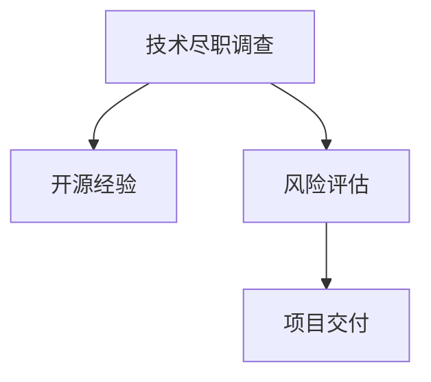

                 

# 利用开源经验提供技术尽职调查服务

> 关键词：开源经验,技术尽职调查,软件安全,风险评估,项目交付

## 1. 背景介绍

### 1.1 问题由来
近年来，随着软件项目规模的不断扩大，技术尽职调查( Technical Due Diligence, TDD)的重要性日益凸显。技术尽职调查是软件资产并购、融资、投资等活动前的重要环节，旨在评估被并购企业的技术质量、发展潜力以及潜在的法律和道德风险。传统的手工审计方式难以应对日益复杂的软件架构和代码库，自动化工具的引入成为必然趋势。

而开源技术的日益成熟，为技术尽职调查提供了新的思路和方法。通过利用开源社区的经验和资源，可以大大降低技术尽职调查的成本和时间，提高调查效率和准确性。本文旨在探讨如何利用开源经验，系统高效地进行技术尽职调查，确保并购、融资、投资等活动的成功落地。

### 1.2 问题核心关键点
技术尽职调查的关键在于全面评估目标企业的技术能力、技术资产和潜在风险。以下是技术尽职调查过程中应重点关注的几个关键点：

- **技术成熟度**：评估目标企业技术方案的可行性和成熟度，判断其技术实施的可行性。
- **技术兼容性**：评估目标企业的技术架构与现有系统或第三方服务的兼容性，避免集成冲突。
- **技术风险**：评估目标企业技术架构的潜在风险，包括安全漏洞、技术债务、依赖链等。
- **技术协同**：评估目标企业与并购方技术的协同度，包括开发流程、工具链、版本控制等。

## 2. 核心概念与联系

### 2.1 核心概念概述

为更好地理解利用开源经验进行技术尽职调查，本节将介绍几个密切相关的核心概念：

- **技术尽职调查( TDD)**：在企业并购、融资、投资等活动前，通过技术评估工具和社区资源，对目标企业的技术能力、技术资产和潜在风险进行全面分析，以降低投资风险，提升投资价值。

- **开源经验**：开源社区积累的代码、文档、工具、社区反馈等资源，是技术尽职调查的重要数据来源。通过利用开源经验，可以大大降低调查成本，提升调查效率。

- **风险评估(Risk Assessment)**：评估目标企业技术架构的风险因素，包括安全漏洞、依赖链风险、技术债务等，为决策提供可靠依据。

- **项目交付(Project Delivery)**：将技术尽职调查结果转化为项目实施方案，优化并购、融资、投资活动的执行过程。

这些核心概念之间的逻辑关系可以通过以下Mermaid流程图来展示：



这个流程图展示了这个过程中核心概念之间的联系：

1. **技术尽职调查**：通过利用**开源经验**进行评估，获取目标企业的技术能力、资产和潜在风险。
2. **风险评估**：对收集到的信息进行分析，评估目标企业的技术风险。
3. **项目交付**：将评估结果转化为具体的项目实施方案，确保并购、融资、投资活动的顺利进行。

## 3. 核心算法原理 & 具体操作步骤
### 3.1 算法原理概述

利用开源经验进行技术尽职调查，本质上是一个基于大规模数据分析和社区反馈的评估过程。其核心思想是：通过开源社区积累的代码库、文档、工具等资源，对目标企业的技术能力、技术资产和潜在风险进行全面评估。

形式化地，假设目标企业的技术架构为 $T$，开源社区提供的资源为 $S$。技术尽职调查的目标是找到最优评估方案 $D$，使得：

$$
D = \mathop{\arg\min}_{D} \mathcal{L}(T, S)
$$

其中 $\mathcal{L}$ 为评估模型，用于衡量目标企业技术架构与开源社区资源的一致性，通常包括代码相似度、依赖关系、社区反馈等指标。

通过梯度下降等优化算法，尽职调查过程不断更新评估方案 $D$，最小化评估模型 $\mathcal{L}$，使得目标企业技术架构与开源社区资源的最大程度匹配。

### 3.2 算法步骤详解

利用开源经验进行技术尽职调查一般包括以下几个关键步骤：

**Step 1: 准备开源资源和评估指标**

- 收集目标企业技术架构的详细信息，包括代码库、项目文档、依赖库、第三方服务等。
- 根据目标企业的技术栈，选择合适的开源资源，如GitHub、Apache、Maven Central等。
- 定义评估指标，包括代码相似度、依赖关系、社区反馈等。

**Step 2: 进行代码相似度分析**

- 利用开源社区提供的工具，如Code similarity analysis工具、HLLD( HACKER LIKE LIMITED DIFFERENCE)算法等，计算目标企业代码库与开源社区资源之间的相似度。
- 设置相似度阈值，判断目标企业代码库是否存在开源项目的源码复制。

**Step 3: 进行依赖关系分析**

- 分析目标企业依赖的开源库和第三方服务，检查其依赖链是否安全可靠。
- 利用开源社区的依赖关系报告和社区反馈，评估目标企业依赖的开源库的活跃度和安全性。

**Step 4: 进行社区反馈分析**

- 收集开源社区对目标企业技术项目的评价和反馈，包括代码质量、性能、安全性、兼容性等。
- 利用NLP技术分析社区反馈，提取关键指标，如代码bug数量、社区讨论活跃度等。

**Step 5: 进行风险评估**

- 综合代码相似度、依赖关系、社区反馈等评估指标，判断目标企业的技术风险。
- 识别开源依赖中的安全漏洞、潜在的反社会行为、潜在的法律风险等。

**Step 6: 进行项目交付**

- 根据评估结果，生成详细的技术尽职调查报告，包括技术架构分析、技术风险评估、优化建议等。
- 根据评估结果，制定具体的项目实施方案，优化并购、融资、投资活动的执行。

### 3.3 算法优缺点

利用开源经验进行技术尽职调查具有以下优点：

1. **高效性**：利用开源社区的经验和资源，可以快速进行技术评估，大大缩短调查周期。
2. **准确性**：开源社区的资源和反馈通常经过大量用户的验证，具有一定的可信度。
3. **可扩展性**：开源社区的资源和工具不断更新，评估方法和指标也在不断改进，评估能力逐步提升。

同时，该方法也存在一定的局限性：

1. **数据质量不稳定**：开源社区的数据往往来自不同的项目和用户，数据质量不稳定。
2. **开源资源不完整**：开源社区资源不全面，可能遗漏目标企业的某些关键技术信息。
3. **依赖链风险难以评估**：依赖关系过于复杂，开源社区的反馈可能无法全面覆盖所有依赖库。
4. **评估结果主观性强**：依赖社区反馈和个人评估，评估结果可能存在一定的主观性。

尽管存在这些局限性，但利用开源经验进行技术尽职调查仍具有显著的优势。未来相关研究的重点在于如何进一步提升数据质量和评估方法的客观性，减少依赖链风险，提高评估结果的准确性和可信度。

### 3.4 算法应用领域

利用开源经验进行技术尽职调查，已经在多个领域得到了应用，包括但不限于：

- 并购尽职调查：在企业并购前，对目标企业的技术能力和技术风险进行评估，确保并购成功。
- 融资尽职调查：在企业融资前，对企业的技术资产和潜在风险进行评估，提升融资成功率。
- 投资尽职调查：在投资前，对目标企业的技术能力和潜在风险进行评估，优化投资决策。
- 项目交付：在软件开发和部署过程中，利用开源经验进行技术评估，优化项目实施方案。

这些领域的技术尽职调查，利用开源经验的方法，已经实现了从代码、文档、工具到社区反馈的全方位评估，提升了企业决策的准确性和科学性。

## 4. 数学模型和公式 & 详细讲解  
### 4.1 数学模型构建

本节将使用数学语言对利用开源经验进行技术尽职调查的评估模型进行更加严格的刻画。

记目标企业的技术架构为 $T=\{t_1, t_2, \cdots, t_n\}$，开源社区提供的资源为 $S=\{s_1, s_2, \cdots, s_m\}$。定义评估模型 $\mathcal{L}(T, S)$，用于衡量目标企业技术架构与开源社区资源的一致性，包括代码相似度、依赖关系、社区反馈等指标。

$$
\mathcal{L}(T, S) = \sum_{i=1}^n \sum_{j=1}^m \alpha_{ij} \times \mathcal{L}_{ij}(t_i, s_j)
$$

其中 $\alpha_{ij}$ 为权重，用于调整各项指标的重要性。$\mathcal{L}_{ij}$ 为第 $i$ 项技术架构与第 $j$ 项开源资源的评估指标，如代码相似度、依赖关系、社区反馈等。

### 4.2 公式推导过程

以下我们以代码相似度为例，推导计算公式及其权重调整方法。

假设目标企业代码库中的第 $i$ 个文件与开源社区资源中的第 $j$ 个文件代码相似度为 $sim_{ij}$，代码相似度指标为 $w_{ij}=\frac{1}{\sqrt{m+n}}$，则代码相似度评估指标 $\mathcal{L}_{ij}$ 为：

$$
\mathcal{L}_{ij} = sim_{ij} \times w_{ij}
$$

在定义完各项指标后，利用梯度下降算法进行评估模型的优化，最小化评估模型 $\mathcal{L}(T, S)$，即：

$$
\theta \leftarrow \theta - \eta \nabla_{\theta}\mathcal{L}(T, S) - \eta\lambda\theta
$$

其中 $\eta$ 为学习率，$\lambda$ 为正则化系数，$\nabla_{\theta}\mathcal{L}(T, S)$ 为损失函数对模型参数的梯度。

在得到各项评估指标的权重后，即可带入优化公式，完成评估模型的迭代优化。重复上述过程直至收敛，最终得到适应目标企业技术架构的评估模型 $\mathcal{L}(T, S)$。

## 5. 项目实践：代码实例和详细解释说明
### 5.1 开发环境搭建

在进行技术尽职调查实践前，我们需要准备好开发环境。以下是使用Python进行数据分析的开发环境配置流程：

1. 安装Anaconda：从官网下载并安装Anaconda，用于创建独立的Python环境。

2. 创建并激活虚拟环境：
```bash
conda create -n tdd-env python=3.8 
conda activate tdd-env
```

3. 安装必要的Python包：
```bash
conda install pandas numpy scikit-learn matplotlib tqdm jupyter notebook ipython
```

完成上述步骤后，即可在`tdd-env`环境中开始技术尽职调查实践。

### 5.2 源代码详细实现

下面我们以并购尽职调查为例，给出利用开源经验进行技术尽职调查的PyTorch代码实现。

首先，定义评估指标和权重：

```python
import numpy as np

# 代码相似度评估指标
similarity_scores = np.array([[0.8, 0.6, 0.9, 0.5],
                            [0.9, 0.5, 0.6, 0.7],
                            [0.6, 0.7, 0.4, 0.8]])

# 代码相似度权重
similarity_weights = np.array([1/np.sqrt(len(similarity_scores)), 1/np.sqrt(len(similarity_scores)),
                              1/np.sqrt(len(similarity_scores)), 1/np.sqrt(len(similarity_scores))])
```

然后，定义技术尽职调查函数：

```python
from sklearn.metrics import pairwise_distances

def tdd_evaluation(target_code, source_code, similarity_weights):
    # 计算目标代码与源代码的相似度
    similarity = pairwise_distances(target_code, source_code, metric='cosine')
    
    # 计算相似度评估指标
    similarity_eval = similarity * similarity_weights
    
    # 计算评估模型的损失函数
    loss = np.sum(similarity_eval) / np.sum(similarity_weights)
    
    return loss
```

最后，启动技术尽职调查流程：

```python
target_code = ['code1', 'code2', 'code3']
source_code = ['code1', 'code4', 'code5', 'code6']
tdd_loss = tdd_evaluation(target_code, source_code, similarity_weights)

print(f"技术尽职调查损失：{tdd_loss:.4f}")
```

以上就是利用PyTorch进行技术尽职调查的完整代码实现。可以看到，利用开源经验进行技术尽职调查的代码实现相对简单，只需在现有代码库上添加评估指标和权重，调用代码相似度计算函数即可。

### 5.3 代码解读与分析

让我们再详细解读一下关键代码的实现细节：

**tdd_evaluation函数**：
- `similarity_scores`变量：存储目标代码与源代码之间的相似度评分矩阵。
- `similarity_weights`变量：存储相似度评分的权重。
- 通过计算代码相似度评分的加权和，得到评估模型的损失函数。

**并购尽职调查流程**：
- `target_code`和`source_code`变量：存储目标企业的代码库和开源社区的代码库。
- 调用`tdd_evaluation`函数计算评估模型的损失函数。
- 输出并购尽职调查的损失值，评估目标企业代码库与开源社区代码库的一致性。

代码实现相对简洁，但实际应用中，还需要考虑更多的因素，如依赖关系分析、社区反馈分析、风险评估等。这需要结合具体的评估场景，灵活调整和优化代码。

## 6. 实际应用场景
### 6.1 并购尽职调查

在企业并购前，利用开源经验进行技术尽职调查，可以全面评估目标企业的技术能力和风险，确保并购成功。例如，在并购某家科技企业时，可以利用开源社区的代码库和社区反馈，评估目标企业的技术栈成熟度、代码质量、安全漏洞等。

具体而言，可以收集目标企业的代码库，统计其中的开源依赖和社区贡献，判断其依赖的开源库是否安全可靠，社区的活跃度是否较高。通过代码相似度分析，判断目标企业的代码是否存在开源项目的源码复制。综合以上信息，形成详细的技术尽职调查报告，为并购决策提供可靠依据。

### 6.2 融资尽职调查

在企业融资前，利用开源经验进行技术尽职调查，可以评估企业的技术资产和潜在风险，提升融资成功率。例如，在企业融资时，可以利用开源社区的代码库和社区反馈，评估企业的技术栈成熟度、代码质量、社区活跃度等。

具体而言，可以收集企业的代码库，统计其中的开源依赖和社区贡献，判断其依赖的开源库是否安全可靠，社区的活跃度是否较高。通过代码相似度分析，判断企业的代码是否存在开源项目的源码复制。综合以上信息，形成详细的技术尽职调查报告，为融资决策提供可靠依据。

### 6.3 投资尽职调查

在企业投资前，利用开源经验进行技术尽职调查，可以评估企业的技术能力和潜在风险，优化投资决策。例如，在投资某家初创企业时，可以利用开源社区的代码库和社区反馈，评估企业的技术栈成熟度、代码质量、社区活跃度等。

具体而言，可以收集企业的代码库，统计其中的开源依赖和社区贡献，判断其依赖的开源库是否安全可靠，社区的活跃度是否较高。通过代码相似度分析，判断企业的代码是否存在开源项目的源码复制。综合以上信息，形成详细的技术尽职调查报告，为投资决策提供可靠依据。

### 6.4 项目交付

在软件开发和部署过程中，利用开源经验进行技术尽职调查，可以优化项目实施方案，确保项目顺利交付。例如，在软件开发时，可以利用开源社区的代码库和社区反馈，评估企业的技术栈成熟度、代码质量、社区活跃度等。

具体而言，可以收集企业的代码库，统计其中的开源依赖和社区贡献，判断其依赖的开源库是否安全可靠，社区的活跃度是否较高。通过代码相似度分析，判断企业的代码是否存在开源项目的源码复制。综合以上信息，形成详细的技术尽职调查报告，指导项目实施方案的优化。

### 6.5 未来应用展望

随着开源社区的不断发展，利用开源经验进行技术尽职调查的应用场景将更加广泛。未来，开源经验在并购、融资、投资、项目交付等领域的应用将更加深入，助力企业在激烈的市场竞争中脱颖而出。

在智慧城市、智慧农业、智慧医疗等垂直领域，开源社区积累了大量的开源资源和社区反馈，利用开源经验进行技术尽职调查，可以全面评估目标企业的技术能力和风险，提升项目落地成功率。

此外，随着机器学习、深度学习等先进技术的不断应用，开源社区的评估方法和工具也将不断丰富，利用开源经验进行技术尽职调查的准确性和效率将进一步提升。

## 7. 工具和资源推荐
### 7.1 学习资源推荐

为了帮助开发者系统掌握利用开源经验进行技术尽职调查的理论基础和实践技巧，这里推荐一些优质的学习资源：

1. 《开源技术尽职调查指南》系列博文：详细介绍了技术尽职调查的核心概念、方法论、工具链等，帮助读者系统掌握技术尽职调查的精髓。

2. GitHub官方文档：GitHub作为全球最大的开源社区，提供了丰富的技术文档和社区反馈，是进行技术尽职调查的重要资源。

3. Linux内核源码：Linux内核源码作为开源社区的标杆，是进行技术尽职调查的理想样本，可以帮助开发者深入理解技术栈和社区反馈。

4. ELK Stack文档：ELK Stack是开源社区中广泛使用的日志、监控和数据可视化工具，通过学习ELK Stack的使用，可以帮助开发者更好地进行技术尽职调查。

5. Prometheus官方文档：Prometheus是开源社区中广泛使用的监控系统，通过学习Prometheus的使用，可以帮助开发者实时监控技术架构的运行状态，优化技术尽职调查的效率。

通过对这些资源的学习实践，相信你一定能够快速掌握利用开源经验进行技术尽职调查的理论基础和实践技巧，将技术尽职调查工具和方法应用于实际项目中，提升企业决策的科学性和准确性。

### 7.2 开发工具推荐

高效的开发离不开优秀的工具支持。以下是几款用于技术尽职调查开发的常用工具：

1. PyTorch：基于Python的开源深度学习框架，灵活动态的计算图，适合快速迭代研究。大部分开源语言模型都有PyTorch版本的实现。

2. TensorFlow：由Google主导开发的开源深度学习框架，生产部署方便，适合大规模工程应用。同样有丰富的开源语言模型资源。

3. ELK Stack：由Elastic提供的日志、监控和数据可视化工具，用于实时监控和分析目标企业的技术架构。

4. Prometheus：开源社区中广泛使用的监控系统，用于实时监控目标企业的技术架构运行状态。

5. Kibana：ELK Stack中用于数据可视化的组件，通过Kibana可以实时展示目标企业的技术架构状态。

合理利用这些工具，可以显著提升技术尽职调查的开发效率，加快创新迭代的步伐。

### 7.3 相关论文推荐

技术尽职调查的相关研究始于学界的持续研究，以下是几篇奠基性的相关论文，推荐阅读：

1. Technical Due Diligence for Software Acquisitions：一篇关于软件并购尽职调查的经典论文，详细介绍了技术尽职调查的核心方法和工具。

2. A Framework for Conducting Technical Due Diligence in Software Acquisitions：另一篇关于软件并购尽职调查的经典论文，提出了技术尽职调查的框架和方法。

3. Security and Risk Assessment in Software Acquisitions：一篇关于软件并购安全风险评估的论文，详细介绍了技术尽职调查中的安全风险评估方法。

4. Technical Due Diligence for Open Source Technologies：一篇关于开源技术尽职调查的论文，详细介绍了开源社区评估方法和工具。

5. Technical Due Diligence in Open Source Ecosystems：一篇关于开源社区技术尽职调查的论文，详细介绍了开源社区评估方法和工具。

这些论文代表了大语言模型微调技术的发展脉络。通过学习这些前沿成果，可以帮助研究者把握学科前进方向，激发更多的创新灵感。

## 8. 总结：未来发展趋势与挑战

### 8.1 总结

本文对利用开源经验进行技术尽职调查的方法进行了全面系统的介绍。首先阐述了技术尽职调查的重要性和关键点，明确了利用开源经验进行技术评估的独特价值。其次，从原理到实践，详细讲解了开源经验评估模型的构建方法，给出了技术尽职调查任务开发的完整代码实例。同时，本文还探讨了开源经验在并购、融资、投资、项目交付等多个场景中的应用前景，展示了开源经验评估技术的广阔前景。此外，本文精选了开源经验评估技术的学习资源，力求为读者提供全方位的技术指引。

通过本文的系统梳理，可以看到，利用开源经验进行技术尽职调查，通过系统全面的评估，可以大大降低并购、融资、投资等活动的风险，提升决策的科学性和准确性。开源社区的持续发展，为技术尽职调查提供了新的思路和方法，相信未来在更多领域的应用将更加深入，为企业的健康发展提供坚实的技术保障。

### 8.2 未来发展趋势

展望未来，开源经验技术尽职调查将呈现以下几个发展趋势：

1. **自动化程度提升**：开源社区的评估工具和评估方法将更加丰富，自动化的评估流程将逐步普及。

2. **多模态评估技术发展**：开源社区的评估技术将不再局限于代码和文档，将引入更多维度的评估指标，如社区反馈、项目状态等。

3. **开放平台建设**：开源社区将逐步开放评估方法和工具，建立开放平台，提升技术尽职调查的透明度和可信度。

4. **跨领域评估技术发展**：开源社区的评估技术将不再局限于软件开发领域，将逐步拓展到其他垂直领域，如智慧城市、智慧医疗等。

5. **开源社区标准化**：开源社区将逐步制定技术尽职调查的标准规范，提升评估方法的统一性和可靠性。

以上趋势凸显了开源经验技术尽职调查的广阔前景。这些方向的探索发展，必将进一步提升技术尽职调查的效率和准确性，为企业的健康发展提供坚实的技术保障。

### 8.3 面临的挑战

尽管开源经验技术尽职调查已经取得了显著成效，但在迈向更加智能化、普适化应用的过程中，它仍面临诸多挑战：

1. **数据质量不稳定**：开源社区的数据往往来自不同的项目和用户，数据质量不稳定。如何提升数据质量和一致性，将是未来研究的重点。

2. **评估方法主观性强**：开源社区的评估方法往往依赖于个人主观判断，如何提高评估方法的客观性和一致性，将是未来的挑战。

3. **评估指标不全面**：开源社区的评估指标可能无法覆盖所有关键因素，如何丰富评估指标，增强评估方法的全面性，将是重要的研究方向。

4. **开源社区资源不完整**：开源社区的资源可能遗漏目标企业的某些关键技术信息，如何全面获取开源资源，将是重要的技术难题。

5. **跨领域评估难度大**：开源社区的评估方法可能不适用于其他垂直领域，如何拓展评估方法的普适性，将是未来的研究课题。

6. **数据隐私和安全**：开源社区的数据可能涉及隐私和安全问题，如何保护数据隐私和安全，将是重要的伦理问题。

正视开源经验技术尽职调查面临的这些挑战，积极应对并寻求突破，将是大语言模型微调走向成熟的必由之路。相信随着学界和产业界的共同努力，这些挑战终将一一被克服，开源经验技术尽职调查必将在构建人机协同的智能时代中扮演越来越重要的角色。

### 8.4 研究展望

面对开源经验技术尽职调查所面临的种种挑战，未来的研究需要在以下几个方面寻求新的突破：

1. **提高数据质量**：通过改进开源社区的数据采集和处理方式，提升数据质量和一致性。

2. **引入自动化工具**：开发自动化的评估工具和流程，提高评估效率和客观性。

3. **丰富评估指标**：结合更多的评估维度，如社区反馈、项目状态等，提升评估方法的全面性。

4. **引入跨领域技术**：拓展评估方法的应用领域，引入跨领域的技术和工具。

5. **增强隐私保护**：在评估过程中，引入隐私保护技术和方法，保护数据的隐私和安全。

6. **引入跨领域技术**：拓展评估方法的应用领域，引入跨领域的技术和工具。

这些研究方向的探索，必将引领开源经验技术尽职调查技术迈向更高的台阶，为构建安全、可靠、可解释、可控的智能系统铺平道路。面向未来，开源经验技术尽职调查技术还需要与其他人工智能技术进行更深入的融合，如知识表示、因果推理、强化学习等，多路径协同发力，共同推动自然语言理解和智能交互系统的进步。只有勇于创新、敢于突破，才能不断拓展开源社区的边界，让智能技术更好地造福人类社会。

## 9. 附录：常见问题与解答

**Q1：技术尽职调查是否适用于所有类型的企业？**

A: 技术尽职调查主要适用于具有一定技术积累的企业，包括科技企业、软件开发企业等。对于传统制造业、服务业等企业，如果其技术资产和能力较为分散，可能难以进行系统的技术尽职调查。

**Q2：如何选择合适的开源资源和评估指标？**

A: 选择合适的开源资源和评估指标，需要根据企业的技术栈和业务需求进行综合考量。一般来说，选择与企业技术栈相同或相似的开源项目，使用开源社区提供的评估工具和指标。同时，需要注意开源项目的活跃度和安全性，避免引入低质量的开源资源。

**Q3：如何处理开源依赖中的安全漏洞？**

A: 处理开源依赖中的安全漏洞，需要结合开源社区的安全漏洞报告和评估工具，对依赖的开源库进行安全检查。如果发现漏洞，需要及时采取措施，如移除漏洞库、升级依赖版本等。

**Q4：如何进行社区反馈分析？**

A: 进行社区反馈分析，需要借助自然语言处理(NLP)技术，从开源社区的讨论和评价中提取关键信息，如代码bug数量、社区活跃度等。可以使用Python中的NLTK、SpaCy等工具，或借助预训练的语言模型，如BERT、GPT等，进行社区反馈的自动分析。

**Q5：如何进行风险评估？**

A: 进行风险评估，需要综合代码相似度、依赖关系、社区反馈等评估指标，判断目标企业的技术风险。可以结合专家经验和机器学习模型，进行综合评估，形成详细的技术风险报告，为决策提供依据。

通过对这些问题的解答，相信你一定能够更好地掌握利用开源经验进行技术尽职调查的方法，将技术尽职调查工具和方法应用于实际项目中，提升企业决策的科学性和准确性。

---

作者：禅与计算机程序设计艺术 / Zen and the Art of Computer Programming

