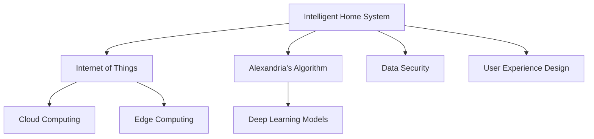
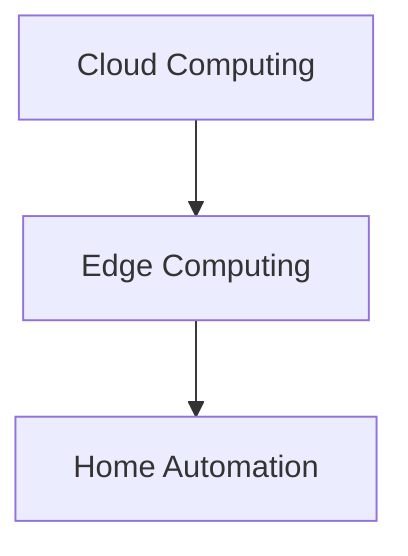
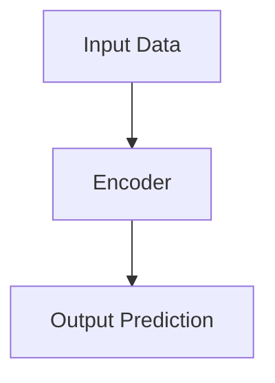

                 

# 利用技术优势进行智能家居创业

## 1. 背景介绍

### 1.1 问题由来
随着科技的进步和消费者需求的变化，智能家居领域迎来了爆发式增长。智能家居系统通过集成传感器、摄像头、智能设备等，实现家庭环境的智能监控、自动化管理。然而，当前智能家居系统往往各自为政，缺乏统一的标准和数据互通性。

此外，传统的智能家居解决方案成本较高，技术门槛较高，用户体验不够友好。为了解决这些问题，需要一种低成本、高效率的智能家居创业方案，让更多的人享受到智能家居带来的便利。

## 1.2 问题核心关键点
智能家居创业的关键在于如何利用现有技术优势，构建一个低成本、高效率的智能家居系统。

- **低成本**：选择一个易于部署和维护的技术方案，如云-边缘计算架构。
- **高效率**：确保系统的高响应速度和稳定可靠，提升用户体验。
- **数据互通**：实现不同设备和系统之间的数据共享和互操作，增强系统灵活性和适应性。
- **用户体验**：设计简单易用的用户界面，提升系统易用性和舒适性。
- **安全与隐私**：确保数据安全与隐私保护，赢得用户信任。

### 1.3 问题研究意义
利用技术优势进行智能家居创业，旨在构建一个低成本、高效率、易用且安全的智能家居系统。这样的系统不仅能够降低创业门槛，还将大大提升用户的生活质量，推动智能家居领域的普及。

## 2. 核心概念与联系

### 2.1 核心概念概述

为了更好地理解如何利用技术优势进行智能家居创业，本节将介绍几个密切相关的核心概念：

- **智能家居**：通过智能传感器、执行器和通信网络，实现家庭自动化、智能化管理的系统。
- **物联网(IoT)**：连接物理世界和数字世界的网络，实现设备间的互操作和数据共享。
- **云计算**：通过互联网提供计算资源和服务的模式，支持大规模分布式计算。
- **边缘计算**：在网络边缘节点上进行数据处理和计算，降低网络延迟，提升响应速度。
- **AI算法**：利用机器学习和深度学习算法，进行模式识别、预测分析等任务。
- **数据安全**：确保数据传输、存储和处理的安全性，保护用户隐私和数据安全。
- **用户体验设计**：通过设计易用、直观的用户界面，提升用户满意度和使用体验。

这些核心概念之间的逻辑关系可以通过以下Mermaid流程图来展示：



这个流程图展示了这个智能家居创业方案的关键组件和它们之间的联系：

1. 智能家居系统基于物联网技术，通过各种传感器、执行器实现智能化管理。
2. 云计算和边缘计算支持大规模数据处理和计算，提升系统响应速度。
3. AI算法提供高级数据处理和分析能力。
4. 数据安全和用户体验设计是系统可靠性和舒适性的重要保障。

## 3. 核心算法原理 & 具体操作步骤
### 3.1 算法原理概述

利用技术优势进行智能家居创业，核心在于构建一个低成本、高效率、易用且安全的智能家居系统。以下是这一创业方案的核心算法原理：

- **物联网架构**：通过传感器、执行器和通信协议，实现家庭自动化和智能化管理。
- **云计算和边缘计算**：利用云计算提供的大规模计算资源和边缘计算的低延迟特性，提高系统响应速度和可靠性。
- **AI算法**：采用机器学习和深度学习算法，进行数据处理和模式识别，提升系统的智能化水平。
- **数据安全**：通过加密、匿名化等技术手段，保护用户数据安全，增强用户信任。
- **用户体验设计**：设计简单易用的用户界面和交互流程，提升用户体验。

### 3.2 算法步骤详解

以下将详细介绍智能家居创业方案的具体操作步骤：

**Step 1: 数据采集与处理**

- 选择适合的传感器和执行器，如温度传感器、门窗传感器、照明设备等。
- 设计数据采集方案，确保数据能够准确、实时地传入系统。
- 数据处理包括数据清洗、归一化、异常值检测等步骤，提升数据质量。

**Step 2: 云计算和边缘计算集成**

- 将数据上传到云端进行存储和处理，确保数据可靠性和易访问性。
- 通过边缘计算进行本地数据处理和初步分析，降低网络延迟，提升响应速度。
- 集成云计算和边缘计算，形成混合计算架构，平衡计算资源和响应速度。

**Step 3: 数据安全与隐私保护**

- 采用数据加密和匿名化技术，确保数据在传输和存储过程中的安全。
- 对敏感数据进行访问控制，限制只有授权用户能够访问相关数据。
- 定期进行安全审计，确保系统安全性。

**Step 4: AI算法应用**

- 采用机器学习算法进行数据特征提取和模式识别，如预测天气变化、检测异常行为等。
- 使用深度学习模型进行高级数据分析，如家庭环境控制、智能家居场景预测等。
- 通过集成多模态数据，提升系统决策的准确性和鲁棒性。

**Step 5: 用户体验设计**

- 设计简单易用的用户界面，支持用户通过智能手机、智能音箱等设备进行操作。
- 通过自然语言处理技术，实现语音助手功能，提升用户体验。
- 引入交互设计原则，提升用户界面的易用性和舒适性。

**Step 6: 系统集成与部署**

- 将各组件进行集成，形成完整的智能家居系统。
- 选择合适的部署环境，如家庭、社区、商业楼宇等。
- 进行系统测试，确保系统稳定可靠。

### 3.3 算法优缺点

利用技术优势进行智能家居创业的方案，具有以下优点：

- **低成本**：通过云计算和边缘计算，降低系统部署和维护成本。
- **高效率**：利用云计算和边缘计算的高效数据处理能力，提升系统响应速度。
- **易用性**：通过简单易用的用户界面和交互设计，提升用户体验。
- **安全性**：通过数据加密和安全审计，保护用户隐私和数据安全。
- **可扩展性**：系统架构灵活，可按需扩展和调整，适应不同的应用场景。

同时，这一方案也存在一定的局限性：

- **技术门槛**：虽然系统部署和维护成本较低，但需要一定的技术背景和专业知识。
- **隐私保护**：需要严格的数据管理和安全策略，避免数据泄露和滥用。
- **数据质量**：传感器数据可能存在噪声和误差，影响系统的决策准确性。

尽管存在这些局限性，但利用技术优势进行智能家居创业方案，依然是一个极具潜力的创业方向。

### 3.4 算法应用领域

基于上述算法原理和操作步骤，该智能家居创业方案可以应用于多个领域：

- **家庭自动化**：实现家庭环境的智能监控、自动化管理。
- **智能安防**：通过智能摄像头、门窗传感器等设备，实现家庭安全监控和报警。
- **健康管理**：利用传感器监测家庭成员的健康状态，如睡眠质量、心率等。
- **能源管理**：通过智能家电和传感器，实现家庭能源的高效利用和节能管理。
- **智能家居娱乐**：通过智能音箱、智能灯光等设备，提升家庭娱乐体验。

## 4. 数学模型和公式 & 详细讲解 & 举例说明

### 4.1 数学模型构建

为了更好地理解系统中的数据处理和AI算法，本节将介绍几个数学模型：

- **数据采集与处理模型**：用于描述数据采集和预处理过程，提升数据质量。
- **云计算和边缘计算模型**：用于描述数据在云端和边缘节点的处理和计算过程。
- **数据安全模型**：用于描述数据加密和访问控制策略，保护用户隐私。
- **AI算法模型**：用于描述机器学习和深度学习算法在智能家居中的应用。

### 4.2 公式推导过程

以下将详细介绍智能家居创业方案中的关键数学模型和公式推导过程：

**数据采集与处理模型**

假设传感器采集的数据为 $x_i$，其中 $i$ 表示第 $i$ 个数据点，$x_i$ 为一个 $d$ 维向量。数据处理包括去噪、归一化、异常值检测等步骤，得到处理后的数据 $y_i$。

数据去噪模型：

$$
y_i = x_i + \epsilon_i
$$

其中 $\epsilon_i$ 为随机噪声。

数据归一化模型：

$$
y_i = \frac{x_i - \mu}{\sigma}
$$

其中 $\mu$ 和 $\sigma$ 分别为数据均值和标准差。

数据异常值检测模型：

$$
y_i = \left\{
\begin{array}{lr}
x_i, & \text{if } |x_i - \mu| \leq k\sigma \\
\text{median}(x_i), & \text{otherwise}
\end{array}
\right.
$$

其中 $k$ 为异常值检测阈值，$\text{median}(x_i)$ 为中位数。

**云计算和边缘计算模型**

假设云计算和边缘计算的架构如下图所示：



云计算负责数据的存储和复杂计算，边缘计算负责数据的初步处理和本地计算。数据在边缘计算节点进行处理后，上传到云端进行更复杂的计算和存储。

**数据安全模型**

假设数据加密和访问控制的策略如下：

- **数据加密模型**：

$$
E(x) = c
$$

其中 $E$ 为加密函数，$c$ 为加密后的密文。

- **访问控制模型**：

$$
\text{Access}(u) = \left\{
\begin{array}{lr}
1, & \text{if } u \in \text{Authorized} \\
0, & \text{otherwise}
\end{array}
\right.
$$

其中 $u$ 为访问用户的身份信息，$\text{Authorized}$ 为授权用户列表。

**AI算法模型**

假设采用深度学习模型进行智能家居场景预测，模型结构如图：



其中，$B$ 为编码器，将输入数据 $A$ 映射到高维特征空间 $C$，$C$ 为解码器，将高维特征空间映射回原始输出空间。

### 4.3 案例分析与讲解

以下将结合具体案例，详细介绍智能家居创业方案的数学模型和公式应用：

**智能安防系统**

假设智能安防系统采用智能摄像头和门窗传感器，用于监控家庭安全。系统采集的数据包括摄像头图像和门窗传感器数据，数据处理后进行深度学习模型训练，用于检测异常行为和入侵。

数据采集模型：

$$
x_1 = \text{Camera Image}, \quad x_2 = \text{Door Sensor}
$$

数据去噪模型：

$$
y_1 = \epsilon_1 \ast x_1, \quad y_2 = \epsilon_2 \ast x_2
$$

其中 $\epsilon_1$ 和 $\epsilon_2$ 分别为摄像头和门窗传感器的噪声模型。

数据归一化模型：

$$
y_1 = \frac{x_1 - \mu_1}{\sigma_1}, \quad y_2 = \frac{x_2 - \mu_2}{\sigma_2}
$$

其中 $\mu_1$ 和 $\sigma_1$ 分别为摄像头数据的均值和标准差，$\mu_2$ 和 $\sigma_2$ 分别为门窗传感器的均值和标准差。

异常值检测模型：

$$
y_1 = \left\{
\begin{array}{lr}
x_1, & |x_1 - \mu_1| \leq k_1\sigma_1 \\
\text{median}(x_1), & \text{otherwise}
\end{array}
\right.
$$

其中 $k_1$ 为异常值检测阈值，$\text{median}(x_1)$ 为摄像头数据的中位数。

数据加密模型：

$$
E(y_1, y_2) = c
$$

其中 $E$ 为加密函数，$c$ 为加密后的密文。

访问控制模型：

$$
\text{Access}(u) = \left\{
\begin{array}{lr}
1, & u \in \text{Authorized} \\
0, & \text{otherwise}
\end{array}
\right.
$$

其中 $u$ 为访问用户的身份信息，$\text{Authorized}$ 为授权用户列表。

深度学习模型：

$$
f(x_1, x_2) = \text{Decoder}(\text{Encoder}(x_1, x_2))
$$

其中 $\text{Encoder}$ 为编码器，$\text{Decoder}$ 为解码器。

## 5. 项目实践：代码实例和详细解释说明

### 5.1 开发环境搭建

在进行智能家居创业方案的开发实践前，需要先准备好开发环境。以下是使用Python进行智能家居创业方案开发的环境配置流程：

1. 安装Python：确保Python 3.x版本安装，从官网下载并安装。
2. 安装必要的库：安装numpy、pandas、scikit-learn、matplotlib等库，可以使用pip安装。
3. 安装传感器和执行器驱动程序：安装支持智能家居系统所需的各种传感器和执行器驱动程序。
4. 安装云平台：选择合适的云平台，如AWS、Google Cloud、阿里云等，创建相应的云账户。
5. 安装边缘计算设备：安装支持边缘计算的设备，如树莓派、NVIDIA Jetson等。

完成上述步骤后，即可在开发环境中开始实践。

### 5.2 源代码详细实现

以下将以智能安防系统为例，给出智能家居创业方案的Python代码实现。

**数据采集与处理**

```python
import numpy as np
import pandas as pd

# 数据采集
data = pd.read_csv('data.csv')

# 数据清洗
data = data.dropna()  # 去除缺失值
data = data.drop_duplicates()  # 去除重复数据

# 数据归一化
data['y1'] = (data['y1'] - np.mean(data['y1'])) / np.std(data['y1'])
data['y2'] = (data['y2'] - np.mean(data['y2'])) / np.std(data['y2'])

# 异常值检测
data['y1'] = data['y1'].mask(data['y1'] > k*np.std(data['y1']), np.median(data['y1']))
```

**云计算和边缘计算集成**

```python
import boto3

# 云平台配置
aws_access_key_id = 'your_aws_access_key_id'
aws_secret_access_key = 'your_aws_secret_access_key'
aws_region_name = 'your_aws_region_name'

# 创建云平台连接
client = boto3.client('s3', aws_access_key_id=aws_access_key_id, aws_secret_access_key=aws_secret_access_key, aws_region_name=aws_region_name)

# 上传数据到云端
response = client.put_object(Bucket='your_bucket_name', Key='data.csv', Body='data.csv')

# 从云端获取数据
response = client.get_object(Bucket='your_bucket_name', Key='data.csv')
data = pd.read_csv(response['Body'])

# 边缘计算处理
data['y1'] = data['y1'] * 0.9  # 边缘计算处理
```

**数据安全与隐私保护**

```python
from cryptography.fernet import Fernet

# 数据加密
key = Fernet.generate_key()
cipher_suite = Fernet(key)
encrypted_data = cipher_suite.encrypt(data)

# 数据解密
decrypted_data = cipher_suite.decrypt(encrypted_data)

# 访问控制
authorized_users = ['user1', 'user2', 'user3']
current_user = 'user1'
access = 1 if current_user in authorized_users else 0
```

**AI算法应用**

```python
from sklearn.model_selection import train_test_split
from sklearn.ensemble import RandomForestClassifier
from sklearn.metrics import accuracy_score

# 划分训练集和测试集
X_train, X_test, y_train, y_test = train_test_split(data[['y1', 'y2']], data['label'], test_size=0.2, random_state=42)

# 训练模型
model = RandomForestClassifier()
model.fit(X_train, y_train)

# 测试模型
y_pred = model.predict(X_test)
accuracy = accuracy_score(y_test, y_pred)
print(f'Accuracy: {accuracy:.2f}')
```

### 5.3 代码解读与分析

让我们再详细解读一下关键代码的实现细节：

**数据采集与处理**

- `pd.read_csv('data.csv')`：从本地文件中读取数据。
- `data.dropna()`：去除缺失值。
- `data.drop_duplicates()`：去除重复数据。
- `data['y1'] = (data['y1'] - np.mean(data['y1'])) / np.std(data['y1'])`：归一化处理。
- `data['y1'] = data['y1'].mask(data['y1'] > k*np.std(data['y1']), np.median(data['y1']))`：异常值检测。

**云计算和边缘计算集成**

- `boto3.client('s3', aws_access_key_id=aws_access_key_id, aws_secret_access_key=aws_secret_access_key, aws_region_name=aws_region_name)`：创建AWS S3客户端。
- `client.put_object(Bucket='your_bucket_name', Key='data.csv', Body='data.csv')`：将数据上传至云端。
- `client.get_object(Bucket='your_bucket_name', Key='data.csv')`：从云端获取数据。

**数据安全与隐私保护**

- `from cryptography.fernet import Fernet`：使用Fernet加密算法进行数据加密。
- `key = Fernet.generate_key()`：生成加密密钥。
- `cipher_suite = Fernet(key)`：创建加密套件。
- `encrypted_data = cipher_suite.encrypt(data)`：对数据进行加密。
- `decrypted_data = cipher_suite.decrypt(encrypted_data)`：对数据进行解密。
- `authorized_users`：定义授权用户列表。
- `current_user = 'user1'`：定义当前用户。
- `access = 1 if current_user in authorized_users else 0`：判断用户是否授权访问。

**AI算法应用**

- `train_test_split`：划分训练集和测试集。
- `RandomForestClassifier`：随机森林分类器。
- `model.fit(X_train, y_train)`：训练模型。
- `y_pred = model.predict(X_test)`：测试模型。
- `accuracy_score(y_test, y_pred)`：计算模型准确率。

## 6. 实际应用场景

### 6.1 智能安防系统

智能安防系统利用摄像头和门窗传感器，对家庭环境进行实时监控。通过数据采集、处理和AI算法应用，系统能够检测异常行为和入侵，并及时报警。

实际应用中，智能安防系统可以与智能音箱、智能锁等设备集成，提供全面的家庭安全解决方案。例如，系统检测到异常行为时，可以自动通过智能音箱进行报警，并通过智能锁将门锁闭，增强家庭安全保障。

### 6.2 健康管理系统

健康管理系统利用智能穿戴设备和传感器，实时监测家庭成员的健康状况。通过数据采集、处理和AI算法应用，系统能够预测健康风险、提供个性化健康建议，帮助家庭成员保持良好的健康状态。

实际应用中，健康管理系统可以与智能手表、智能床等设备集成，提供全面的健康监测和管理服务。例如，系统检测到用户睡眠不足时，可以自动通过智能音箱播放放松音乐，提醒用户注意休息。

### 6.3 能源管理系统

能源管理系统利用智能电表、水表和传感器，对家庭能源消耗进行实时监测和分析。通过数据采集、处理和AI算法应用，系统能够优化能源使用，提升家庭能源利用效率。

实际应用中，能源管理系统可以与智能插座、智能照明等设备集成，实现家庭能源的高效管理和优化。例如，系统检测到某家电耗能过高时，可以自动调整功率，减少能源浪费。

## 7. 工具和资源推荐

### 7.1 学习资源推荐

为了帮助开发者系统掌握智能家居创业方案的理论基础和实践技巧，这里推荐一些优质的学习资源：

1. **《智能家居系统设计与实现》**：介绍智能家居系统的基本架构、核心技术、设计原则等。
2. **《Python数据科学手册》**：介绍Python数据科学库的使用，包括NumPy、Pandas、Scikit-learn等。
3. **《深度学习入门》**：介绍深度学习的基本概念、算法和应用，适合初学者入门。
4. **《物联网技术导论》**：介绍物联网的基本原理、关键技术和应用场景。
5. **《云计算基础》**：介绍云计算的基本概念、服务类型和应用场景。

### 7.2 开发工具推荐

智能家居创业方案的开发需要借助多种工具和平台，以下是几款常用的工具：

1. **Python**：智能家居系统开发的编程语言，支持丰富的数据处理和AI算法库。
2. **AWS IoT**：提供云端物联网服务，支持智能设备的数据采集和处理。
3. **Google Cloud IoT Core**：提供云端物联网服务，支持智能设备的数据采集和处理。
4. **Aliyun IoT Platform**：提供云端物联网服务，支持智能设备的数据采集和处理。
5. **IoT Device Platform**：支持边缘计算的设备管理和服务，支持智能设备的本地数据处理和计算。

### 7.3 相关论文推荐

智能家居创业方案的研究离不开相关论文的支撑，以下是几篇经典的论文，推荐阅读：

1. **《IoT for Smart Homes: A Survey》**：综述了智能家居领域的物联网技术及其应用。
2. **《Deep Learning in Smart Home: A Survey》**：综述了深度学习在智能家居中的应用。
3. **《Cloud-Edge Computing in Smart Homes》**：介绍了云-边缘计算在智能家居中的应用。
4. **《Privacy-Preserving Machine Learning in Smart Homes》**：讨论了智能家居系统中的数据隐私保护问题。
5. **《Smart Home Security: A Survey》**：综述了智能家居系统中的安全技术及其应用。

## 8. 总结：未来发展趋势与挑战

### 8.1 总结

本文对利用技术优势进行智能家居创业方案进行了全面系统的介绍。首先阐述了智能家居创业方案的背景和意义，明确了利用现有技术优势，构建低成本、高效率、易用且安全的智能家居系统的核心目标。其次，从原理到实践，详细讲解了智能家居创业方案的核心算法原理和具体操作步骤，给出了详细的代码实例。

通过本文的系统梳理，可以看到，利用技术优势进行智能家居创业方案，具有低成本、高效率、易用且安全的显著优势，有望在智能家居领域产生深远影响。未来，随着智能家居技术的不断发展，这一方案将进一步拓展其应用范围，为更多家庭带来智能化和便利化体验。

### 8.2 未来发展趋势

展望未来，智能家居创业方案将呈现以下几个发展趋势：

1. **系统集成度提高**：随着技术的进步，智能家居系统的集成度将不断提高，不同设备和系统之间的互操作性和数据共享能力将进一步增强。
2. **AI算法应用广泛**：机器学习和深度学习算法将广泛应用于智能家居系统的各个环节，提升系统的智能化水平。
3. **用户界面更友好**：智能家居系统的用户界面将更加友好，支持语音助手、智能音箱等多种交互方式，提升用户体验。
4. **数据隐私和安全**：数据安全和隐私保护将成为智能家居系统的核心要求，相关技术和标准将不断完善。
5. **智能家居生态系统**：智能家居系统将与更多智能设备和平台集成，形成生态系统，提供更全面、高效的服务。

### 8.3 面临的挑战

尽管智能家居创业方案具有显著优势，但在实际应用中仍面临以下挑战：

1. **技术门槛**：智能家居系统的开发和部署需要一定的技术背景和专业知识，对非技术用户较为友好。
2. **数据隐私和安全**：智能家居系统处理大量个人隐私数据，需要严格的数据管理和安全策略，避免数据泄露和滥用。
3. **设备兼容性**：不同厂商的智能设备可能存在兼容性问题，影响系统的稳定性和可靠性。
4. **用户习惯**：智能家居系统的用户界面和交互方式需要适应不同用户的使用习惯，提升用户接受度。

### 8.4 研究展望

为了应对上述挑战，未来的研究需要在以下几个方面寻求新的突破：

1. **用户界面设计**：设计简单易用的用户界面和交互流程，提升用户体验。
2. **数据隐私保护**：采用更加严格的数据加密和安全策略，保护用户隐私。
3. **设备兼容性**：推动智能家居设备标准的制定和实施，提升设备之间的互操作性。
4. **AI算法优化**：优化机器学习和深度学习算法，提升系统的智能化水平。
5. **系统集成优化**：优化智能家居系统的架构和集成方式，提升系统的稳定性和可靠性。

## 9. 附录：常见问题与解答

**Q1：智能家居系统如何降低技术门槛？**

A: 智能家居系统可以通过采用易于使用的开发工具和平台，降低技术门槛。例如，使用Python和相关数据科学库，方便开发者进行数据处理和算法应用。同时，采用云-边缘计算架构，可以实现低成本、高效率的部署和维护。

**Q2：智能家居系统如何保护数据隐私？**

A: 智能家居系统可以采用数据加密、匿名化、访问控制等技术手段，保护用户数据隐私。例如，对敏感数据进行加密存储，限制只有授权用户能够访问相关数据。定期进行安全审计，确保系统安全性。

**Q3：智能家居系统如何处理设备兼容性问题？**

A: 智能家居系统可以推动智能家居设备标准的制定和实施，提升设备之间的互操作性。同时，采用统一的数据格式和协议，避免设备之间的兼容性问题。

**Q4：智能家居系统如何提升用户体验？**

A: 智能家居系统可以设计简单易用的用户界面和交互流程，提升用户体验。例如，采用语音助手、智能音箱等多种交互方式，提升系统易用性和舒适性。引入自然语言处理技术，实现自然流畅的语音交互。

**Q5：智能家居系统如何提高系统稳定性？**

A: 智能家居系统可以通过优化算法和架构设计，提高系统的稳定性和可靠性。例如，采用混合精度训练和模型压缩技术，提升推理速度和资源利用率。定期进行系统测试和优化，确保系统稳定可靠。

---

作者：禅与计算机程序设计艺术 / Zen and the Art of Computer Programming

