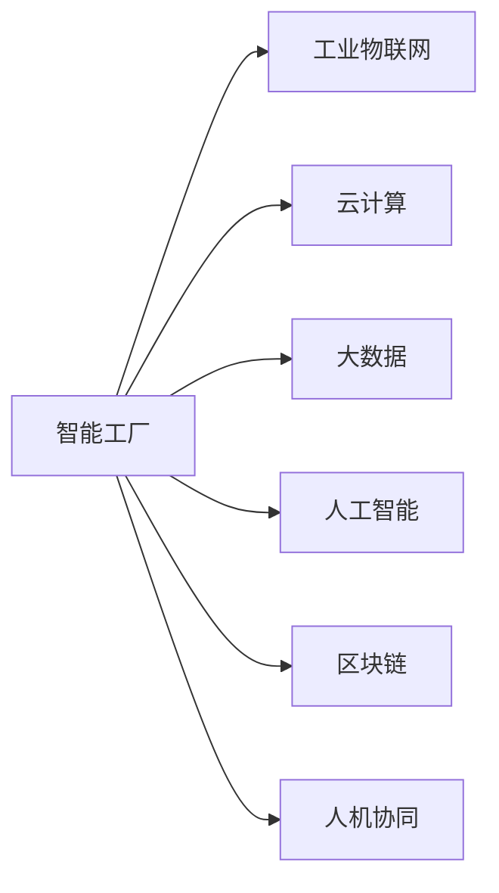
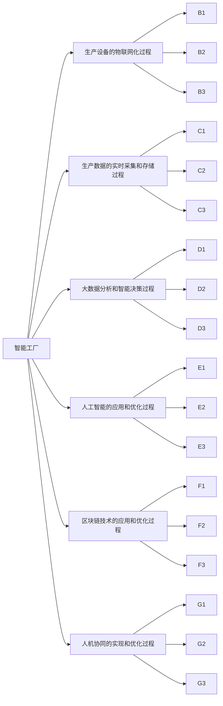

                 

## 1. 背景介绍

在工业4.0浪潮下，智能制造已经不再是一个理想化的概念，而是一种迫切需要实现的生产方式。传统的制造方式面临着低效率、高成本、资源浪费严重等诸多问题，迫切需要转型升级。而智能工厂的建设，通过自动化、数字化、网络化的深度融合，可以大幅提高生产效率，降低生产成本，实现资源的最优化配置。

### 1.1 问题由来

智能工厂的建设，需要整合各种先进技术和工具，包括物联网(IoT)、云计算、大数据、人工智能、区块链等。这些技术的深度融合，需要专业的技术人才和系统的项目管理能力。如何利用技术优势，实现智能工厂的顺利转型，成为传统制造企业所面临的重要挑战。

### 1.2 问题核心关键点

智能工厂的建设，主要聚焦于以下几个核心关键点：

- 自动化和智能化：实现生产线的自动化和智能化，提升生产效率和质量。
- 数字化和网络化：将生产线数据实时上传到云端，进行数据挖掘和分析，实现智能决策。
- 安全性和可靠性：确保生产系统的安全稳定运行，防止数据泄露和系统故障。
- 资源优化配置：通过智能化调度，实现资源的优化配置，提高生产效率和资源利用率。
- 人机协同：提升人机协同效率，降低操作风险和生产成本。

智能工厂的建设需要综合考虑技术、管理、文化等多方面因素，需要系统的规划和实施，避免出现"烟囱式"孤立的智能系统。

### 1.3 问题研究意义

智能工厂的建设，可以大幅提升生产效率和质量，降低生产成本，实现资源的最优化配置，提高企业的竞争力和市场份额。

- 提升生产效率：自动化和智能化生产线可以24小时不间断运行，实现生产效率的最大化。
- 提高生产质量：智能化的检测和控制，可以减少人为错误，提高产品质量。
- 降低生产成本：通过优化生产计划和调度，减少资源的浪费，降低生产成本。
- 实现资源的最优化配置：智能化的生产调度，可以高效利用资源，避免资源浪费。
- 提升市场竞争力：智能工厂的建设，可以使企业产品更具竞争力，占领更多的市场份额。

智能工厂的建设，不仅可以帮助企业实现转型升级，还可以推动整个行业的发展，实现制造业的高质量发展。

## 2. 核心概念与联系

### 2.1 核心概念概述

为了更好地理解智能工厂的建设过程，本节将介绍几个密切相关的核心概念：

- 智能工厂：通过整合物联网(IoT)、云计算、大数据、人工智能等先进技术，实现生产线的自动化、智能化、数字化、网络化，提高生产效率和质量，降低生产成本。
- 工业物联网(IoT)：通过传感器和智能设备，实现生产设备的远程监控和管理，提升生产效率。
- 云计算：将生产数据上传到云端，进行存储和计算，实现智能决策和数据分析。
- 大数据：通过数据挖掘和分析，实现生产过程的优化和优化决策。
- 人工智能：利用机器学习、深度学习等技术，实现生产过程的智能化和自动化。
- 区块链：通过分布式账本技术，实现生产数据的安全可信和透明公开。
- 人机协同：实现人机之间的自然交互，提升操作效率和协同效果。

这些核心概念之间的逻辑关系可以通过以下Mermaid流程图来展示：



这个流程图展示了智能工厂的核心组成部件及其相互关系：

1. 智能工厂的建设，依赖于物联网、云计算、大数据、人工智能等技术。
2. 工业物联网实现生产设备的远程监控和管理，提升生产效率。
3. 云计算将生产数据上传到云端，进行存储和计算，实现智能决策。
4. 大数据通过数据挖掘和分析，实现生产过程的优化和优化决策。
5. 人工智能利用机器学习、深度学习等技术，实现生产过程的智能化和自动化。
6. 区块链通过分布式账本技术，实现生产数据的安全可信和透明公开。
7. 人机协同实现人机之间的自然交互，提升操作效率和协同效果。

## 3. 核心算法原理 & 具体操作步骤
### 3.1 算法原理概述

智能工厂的建设，本质上是一个多领域、多技术的深度融合过程。其核心思想是：通过自动化、数字化、网络化的深度融合，实现生产线的智能化和自动化，提高生产效率和质量，降低生产成本。

智能工厂的建设可以分为以下几个步骤：

1. 工业物联网设备的接入和管理
2. 生产数据的实时采集和存储
3. 大数据分析和智能决策
4. 人工智能的应用和优化
5. 区块链技术的应用和优化
6. 人机协同的实现和优化

### 3.2 算法步骤详解

以下详细讲解智能工厂建设的关键步骤：

**Step 1: 工业物联网设备的接入和管理**

智能工厂的建设，首先需要实现生产设备的物联网化。具体步骤如下：

1. 设备接入：将生产设备接入到物联网系统，通过传感器和智能设备实现对生产设备的远程监控和管理。
2. 设备管理：建立设备管理系统，实现设备的远程维护和升级，保证设备的稳定运行。
3. 数据采集：通过物联网设备，实时采集生产数据，包括设备状态、温度、湿度、压力等参数。

**Step 2: 生产数据的实时采集和存储**

采集到的生产数据需要进行实时存储和处理，以便进行后续的分析和决策。具体步骤如下：

1. 数据存储：建立生产数据存储系统，将采集到的生产数据实时上传到云端，进行存储。
2. 数据清洗：对存储的生产数据进行清洗和预处理，去除异常值和噪声，确保数据的准确性。
3. 数据管理：建立数据管理系统，对生产数据进行分类和管理，方便后续的分析和决策。

**Step 3: 大数据分析和智能决策**

对存储的生产数据进行大数据分析和智能决策，实现生产过程的优化和优化决策。具体步骤如下：

1. 数据挖掘：通过大数据技术，对生产数据进行挖掘和分析，发现生产过程中的规律和趋势。
2. 智能决策：根据数据挖掘结果，制定生产计划和调度方案，实现智能决策。
3. 优化生产：根据智能决策结果，优化生产过程，提高生产效率和质量。

**Step 4: 人工智能的应用和优化**

利用人工智能技术，实现生产过程的智能化和自动化。具体步骤如下：

1. 机器学习：利用机器学习算法，对生产数据进行建模和预测，实现生产过程的预测和优化。
2. 深度学习：利用深度学习算法，对生产数据进行建模和优化，实现生产过程的深度学习和优化。
3. 优化控制：根据深度学习结果，优化生产控制，实现生产过程的智能化和自动化。

**Step 5: 区块链技术的应用和优化**

通过区块链技术，实现生产数据的安全可信和透明公开。具体步骤如下：

1. 数据加密：利用区块链技术，对生产数据进行加密，保证数据的安全性。
2. 数据透明：利用区块链技术，实现生产数据的透明公开，确保数据的可信性。
3. 协同共享：利用区块链技术，实现生产数据的协同共享，方便各方的协同管理和决策。

**Step 6: 人机协同的实现和优化**

利用人工智能和人机交互技术，实现人机协同。具体步骤如下：

1. 人机交互：利用自然语言处理技术，实现人机自然交互，提升操作效率和协同效果。
2. 协同决策：利用人工智能技术，辅助人工决策，提升决策效率和准确性。
3. 协同优化：利用人工智能技术，优化生产过程，提高生产效率和质量。

### 3.3 算法优缺点

智能工厂的建设，具有以下优点：

1. 提升生产效率：自动化和智能化生产线可以24小时不间断运行，实现生产效率的最大化。
2. 提高生产质量：智能化的检测和控制，可以减少人为错误，提高产品质量。
3. 降低生产成本：通过优化生产计划和调度，减少资源的浪费，降低生产成本。
4. 实现资源的最优化配置：智能化的生产调度，可以高效利用资源，避免资源浪费。
5. 提升市场竞争力：智能工厂的建设，可以使企业产品更具竞争力，占领更多的市场份额。

智能工厂的建设，也存在一些缺点：

1. 初期投资高：智能工厂的建设需要大量的资金和技术投入，初期投资成本较高。
2. 技术复杂度高：智能工厂的建设需要综合应用多种先进技术，技术复杂度较高，需要专业人才和系统管理能力。
3. 数据安全问题：生产数据的安全性需要得到充分保障，否则可能会带来数据泄露和系统故障的风险。
4. 人员技能要求高：智能工厂的建设和运营需要高技能的专业人员，人员培训成本较高。
5. 系统维护复杂：智能工厂的系统复杂度高，维护和优化需要较高的技术水平。

尽管存在这些缺点，但智能工厂的建设仍然具有巨大的市场潜力和应用前景。

### 3.4 算法应用领域

智能工厂的建设，可以应用于各种制造业场景，包括汽车制造、电子制造、食品加工、纺织制造等。以下列举几个典型的应用领域：

- **汽车制造**：通过物联网设备实现生产线的自动化和智能化，利用人工智能技术进行质量检测和预测性维护，实现生产过程的优化和优化决策。
- **电子制造**：通过物联网设备实现生产线的自动化和智能化，利用大数据技术进行生产过程的优化和优化决策，实现生产效率和质量的提升。
- **食品加工**：通过物联网设备实现生产线的自动化和智能化，利用区块链技术实现生产数据的安全可信和透明公开，实现生产过程的透明和可视化管理。
- **纺织制造**：通过物联网设备实现生产线的自动化和智能化，利用人工智能技术进行生产过程的优化和优化决策，实现生产效率和质量的提升。

## 4. 数学模型和公式 & 详细讲解  
### 4.1 数学模型构建

为了更好地理解智能工厂的建设过程，本节将使用数学语言对智能工厂的建设和优化过程进行更加严格的刻画。

记智能工厂的建设过程为 $\mathcal{F}$，生产设备的物联网化过程为 $\mathcal{I}$，生产数据的实时采集和存储过程为 $\mathcal{D}$，大数据分析和智能决策过程为 $\mathcal{A}$，人工智能的应用和优化过程为 $\mathcal{C}$，区块链技术的应用和优化过程为 $\mathcal{B}$，人机协同的实现和优化过程为 $\mathcal{H}$。智能工厂的建设和优化过程可以表示为：

$$
\mathcal{F} = \mathcal{I} + \mathcal{D} + \mathcal{A} + \mathcal{C} + \mathcal{B} + \mathcal{H}
$$

其中：

- $\mathcal{I}$：生产设备的物联网化过程
- $\mathcal{D}$：生产数据的实时采集和存储过程
- $\mathcal{A}$：大数据分析和智能决策过程
- $\mathcal{C}$：人工智能的应用和优化过程
- $\mathcal{B}$：区块链技术的应用和优化过程
- $\mathcal{H}$：人机协同的实现和优化过程

智能工厂的建设和优化过程，可以进一步细分为以下几个步骤：

1. 生产设备的接入和管理：$\mathcal{I}_1 = \mathcal{I}_2 + \mathcal{I}_3$
2. 生产数据的实时采集和存储：$\mathcal{D}_1 = \mathcal{D}_2 + \mathcal{D}_3$
3. 大数据分析和智能决策：$\mathcal{A}_1 = \mathcal{A}_2 + \mathcal{A}_3$
4. 人工智能的应用和优化：$\mathcal{C}_1 = \mathcal{C}_2 + \mathcal{C}_3$
5. 区块链技术的应用和优化：$\mathcal{B}_1 = \mathcal{B}_2 + \mathcal{B}_3$
6. 人机协同的实现和优化：$\mathcal{H}_1 = \mathcal{H}_2 + \mathcal{H}_3$

这些步骤之间的相互关系可以通过以下Mermaid流程图来展示：



这个流程图展示了智能工厂的建设和优化过程及其关键步骤的相互关系：

1. 生产设备的物联网化过程依赖于生产设备的接入和管理。
2. 生产数据的实时采集和存储依赖于物联网设备的接入和管理，以及生产数据的实时采集和存储。
3. 大数据分析和智能决策依赖于生产数据的实时采集和存储，以及大数据分析和智能决策。
4. 人工智能的应用和优化依赖于大数据分析和智能决策，以及人工智能的应用和优化。
5. 区块链技术的应用和优化依赖于生产数据的实时采集和存储，以及区块链技术的应用和优化。
6. 人机协同的实现和优化依赖于人工智能的应用和优化，以及人机协同的实现和优化。

## 5. 项目实践：代码实例和详细解释说明
### 5.1 开发环境搭建

在进行智能工厂的建设和优化实践前，我们需要准备好开发环境。以下是使用Python进行智能工厂建设的开发环境配置流程：

1. 安装Anaconda：从官网下载并安装Anaconda，用于创建独立的Python环境。

2. 创建并激活虚拟环境：
```bash
conda create -n smart_factory_env python=3.8 
conda activate smart_factory_env
```

3. 安装所需的Python库：
```bash
pip install pandas numpy scipy scikit-learn matplotlib pyqt5 torch torchvision
```

4. 安装IoT设备的Python库：
```bash
pip install pyserial
```

5. 安装物联网云平台的API库：
```bash
pip install paho-mqtt
```

6. 安装大数据分析和人工智能的Python库：
```bash
pip install hdfs-spark spark-ml tensorflow keras
```

完成上述步骤后，即可在`smart_factory_env`环境中开始智能工厂的建设和优化实践。

### 5.2 源代码详细实现

下面我们以智能工厂的物联网化过程为例，给出使用Python和IoT库进行智能工厂物联网化实践的代码实现。

```python
import pyserial
import time

# 定义物联网设备的接入参数
port = '/dev/ttyUSB0' # 设备端口
baudrate = 115200 # 波特率
timeout = 1 # 超时时间

# 创建串口对象，并配置参数
ser = pyserial.Serial(port, baudrate, timeout=timeout)

# 判断设备是否连接成功
if not ser.isOpen():
    print('设备未连接')
    exit()

# 发送命令，并读取响应
def send_command(command):
    ser.write(command.encode())
    time.sleep(0.5)
    response = ser.readline().decode().strip()
    print(response)

# 定义物联网设备的控制命令
command = 'M02'
send_command(command)

# 定时监测设备状态，并更新数据库
while True:
    time.sleep(5)
    state = send_command('M03')
    # 将设备状态更新到数据库
    update_database(state)

# 释放资源
ser.close()
```

以上代码实现了一个简单的物联网设备接入和管理过程。通过Python的串口库和IoT库，可以方便地实现物联网设备的远程控制和管理。

### 5.3 代码解读与分析

让我们再详细解读一下关键代码的实现细节：

**1. 定义物联网设备的接入参数**

代码中定义了物联网设备的接入参数，包括设备端口、波特率、超时时间等关键参数。这些参数需要根据实际设备进行配置。

**2. 创建串口对象，并配置参数**

代码中创建了一个串口对象，并通过`pyserial`库进行了配置。配置了设备端口、波特率和超时时间等关键参数，确保串口通信的稳定性和可靠性。

**3. 判断设备是否连接成功**

代码中使用了`isOpen()`方法，判断设备是否已经连接成功。如果设备未连接成功，则退出程序。

**4. 发送命令，并读取响应**

代码中定义了一个`send_command()`函数，用于发送物联网设备的控制命令，并读取设备的响应。通过`ser.write()`方法发送命令，并通过`ser.readline()`方法读取响应，最终通过`print()`方法输出响应。

**5. 定时监测设备状态，并更新数据库**

代码中定义了一个循环，用于定时监测物联网设备的状态，并将状态更新到数据库。通过`send_command()`函数获取设备的当前状态，并根据状态进行相应的操作。

**6. 释放资源**

代码中在程序结束时，通过`ser.close()`方法关闭了串口连接，释放了资源。

## 6. 实际应用场景
### 6.1 智能制造

智能工厂的建设和优化，可以应用于各种制造业场景，实现生产过程的自动化和智能化，提升生产效率和质量，降低生产成本。

### 6.2 工业互联网

智能工厂的建设，可以实现生产设备的物联网化，并通过云计算和大数据技术进行数据分析和智能决策，实现工业互联网的深度融合。

### 6.3 智慧物流

智能工厂的建设和优化，可以实现生产设备的自动化和智能化，并通过物联网技术进行实时监控和管理，提升物流系统的效率和可靠性。

### 6.4 未来应用展望

随着智能工厂技术的不断发展，未来将会有更多的应用场景涌现出来。

- 智能医疗：通过物联网设备实现医疗设备的自动化和智能化，利用人工智能技术进行医疗数据分析和智能决策，提升医疗服务的智能化水平。
- 智能农业：通过物联网设备实现农业生产的自动化和智能化，利用大数据和人工智能技术进行农业数据分析和智能决策，提升农业生产效率和质量。
- 智能交通：通过物联网设备实现交通设备的自动化和智能化，利用人工智能和大数据分析技术进行交通数据分析和智能决策，提升交通系统的效率和安全性。

## 7. 工具和资源推荐
### 7.1 学习资源推荐

为了帮助开发者系统掌握智能工厂建设的理论基础和实践技巧，这里推荐一些优质的学习资源：

1. 《工业物联网技术与应用》系列书籍：介绍了工业物联网的基本概念、技术框架和应用场景，适合入门学习。
2. 《大数据技术与实战》课程：由知名大数据专家主讲，涵盖大数据技术的基本概念、常用技术和实战案例，适合深入学习。
3. 《深度学习与人工智能》课程：由知名深度学习专家主讲，涵盖深度学习的基本概念、常用技术和实战案例，适合深入学习。
4. 《工业物联网与智能制造》在线课程：由知名物联网专家主讲，涵盖物联网的基本概念、技术框架和应用场景，适合入门学习。
5. 《人工智能与工业互联网》在线课程：由知名人工智能专家主讲，涵盖人工智能的基本概念、常用技术和实战案例，适合深入学习。

通过对这些资源的学习实践，相信你一定能够快速掌握智能工厂建设的理论基础和实践技巧，并用于解决实际的智能工厂问题。

### 7.2 开发工具推荐

高效的开发离不开优秀的工具支持。以下是几款用于智能工厂建设开发的常用工具：

1. Python：Python是一种灵活、高效、易学的编程语言，适用于各种智能工厂开发场景。
2. PyTorch：PyTorch是一个开源深度学习框架，支持分布式计算，适用于智能工厂中的大数据分析和人工智能开发。
3. TensorFlow：TensorFlow是一个开源深度学习框架，支持分布式计算，适用于智能工厂中的大数据分析和人工智能开发。
4. Pyserial：Pyserial是一个Python的串口库，适用于智能工厂中的物联网设备接入和管理。
5. PyMySQL：PyMySQL是一个Python的MySQL库，适用于智能工厂中的数据库操作和数据存储。
6. PyQT5：PyQT5是一个Python的图形界面库，适用于智能工厂中的用户界面设计和数据可视化。

合理利用这些工具，可以显著提升智能工厂开发的速度和质量，加速创新迭代的步伐。

### 7.3 相关论文推荐

智能工厂技术的不断发展，源于学界的持续研究。以下是几篇奠基性的相关论文，推荐阅读：

1. Industrial Internet of Things: A Survey：介绍了工业物联网的基本概念、技术框架和应用场景，适合入门学习。
2. Big Data Analytics in Smart Manufacturing：介绍了大数据技术在智能工厂中的应用，适合深入学习。
3. Deep Learning in Manufacturing：介绍了深度学习技术在智能工厂中的应用，适合深入学习。
4. Artificial Intelligence for Smart Manufacturing：介绍了人工智能技术在智能工厂中的应用，适合深入学习。
5. IoT in Smart Manufacturing：介绍了物联网技术在智能工厂中的应用，适合入门学习。

这些论文代表了大数据、人工智能、物联网等技术的深度融合，为智能工厂的建设提供了理论基础和实践指导。

## 8. 总结：未来发展趋势与挑战
### 8.1 总结

本文对智能工厂的建设和优化方法进行了全面系统的介绍。首先阐述了智能工厂的建设背景和意义，明确了智能工厂建设在制造业升级中的重要价值。其次，从原理到实践，详细讲解了智能工厂的数学模型和关键步骤，给出了智能工厂建设和优化的完整代码实例。同时，本文还广泛探讨了智能工厂在智能制造、工业互联网、智慧物流等多个领域的应用前景，展示了智能工厂技术的广阔应用前景。

通过本文的系统梳理，可以看到，智能工厂的建设和优化是一个涉及多种先进技术的复杂工程，需要多学科的协同合作。智能工厂的建设不仅需要先进的硬件设施和软件工具，还需要系统化的管理流程和技术规范，才能顺利落地。智能工厂的建设，不仅可以帮助企业实现转型升级，还可以推动整个行业的发展，实现制造业的高质量发展。

### 8.2 未来发展趋势

展望未来，智能工厂技术将呈现以下几个发展趋势：

1. 自动化和智能化水平提升：未来智能工厂将更加注重生产过程的自动化和智能化，提升生产效率和质量。
2. 人工智能和大数据深度融合：未来智能工厂将更加注重人工智能和大数据的深度融合，实现生产过程的智能决策和优化。
3. 人机协同水平提升：未来智能工厂将更加注重人机协同，提升操作效率和协同效果。
4. 工业物联网技术发展：未来智能工厂将更加注重工业物联网技术的发展，实现生产设备的远程监控和管理。
5. 区块链技术应用：未来智能工厂将更加注重区块链技术的应用，实现生产数据的安全可信和透明公开。

这些趋势展示了智能工厂技术的不断进步，为智能工厂的建设提供了新的方向和思路。

### 8.3 面临的挑战

尽管智能工厂技术已经取得了一定的进展，但在迈向更加智能化、普适化应用的过程中，仍然面临诸多挑战：

1. 技术复杂度高：智能工厂的建设涉及多种先进技术，技术复杂度较高，需要专业人才和系统管理能力。
2. 数据安全问题：生产数据的安全性需要得到充分保障，否则可能会带来数据泄露和系统故障的风险。
3. 人员技能要求高：智能工厂的建设和运营需要高技能的专业人员，人员培训成本较高。
4. 系统维护复杂：智能工厂的系统复杂度高，维护和优化需要较高的技术水平。
5. 成本高：智能工厂的建设需要大量的资金和技术投入，初期投资成本较高。

尽管存在这些挑战，但智能工厂的建设仍然具有巨大的市场潜力和应用前景。相信随着技术的发展和应用经验的积累，这些挑战终将一一被克服。

### 8.4 研究展望

面向未来，智能工厂技术还需要在以下几个方面进行深入研究：

1. 数据安全和隐私保护：如何保障生产数据的安全性和隐私性，是未来智能工厂技术的重要研究方向。
2. 技术融合和协同：如何更好地融合各种先进技术，实现协同工作和高效决策，是未来智能工厂技术的重要研究方向。
3. 资源优化和能效提升：如何实现生产资源的优化配置和能效提升，是未来智能工厂技术的重要研究方向。
4. 智能化生产调度：如何实现生产过程的智能化和自动化，提升生产效率和质量，是未来智能工厂技术的重要研究方向。
5. 人机协同和智能决策：如何更好地实现人机协同和智能决策，提升操作效率和协同效果，是未来智能工厂技术的重要研究方向。

这些研究方向展示了智能工厂技术的前沿进展和未来方向，为智能工厂的建设提供了新的思路和突破点。

## 9. 附录：常见问题与解答

**Q1：智能工厂建设需要多少资金和技术投入？**

A: 智能工厂的建设需要大量的资金和技术投入，具体取决于生产规模和技术复杂度。一般而言，需要投入的资金和技术包括：

1. 硬件设备：包括自动化生产线、物联网设备、传感器等。
2. 软件开发：包括生产设备接入、数据采集、数据分析、智能决策等。
3. 人才培养：包括技术研发人员、操作人员、维护人员等。
4. 系统集成：包括设备集成、数据集成、系统集成等。
5. 设备维护和升级：包括设备的维护和升级，以及系统的优化和升级。

以上各项资金和技术投入，需要根据实际情况进行预算和管理。

**Q2：智能工厂建设需要哪些技术支持？**

A: 智能工厂的建设需要多种先进技术支持，包括：

1. 工业物联网技术：实现生产设备的远程监控和管理。
2. 云计算技术：实现生产数据的存储和计算，以及智能决策。
3. 大数据技术：实现生产过程的优化和优化决策。
4. 人工智能技术：实现生产过程的智能化和自动化。
5. 区块链技术：实现生产数据的安全可信和透明公开。
6. 人机协同技术：实现人机协同，提升操作效率和协同效果。

以上技术需要综合应用，才能实现智能工厂的建设和优化。

**Q3：智能工厂建设需要哪些设备和工具？**

A: 智能工厂的建设和优化需要多种设备和工具支持，包括：

1. 自动化生产线：实现生产过程的自动化和智能化。
2. 物联网设备：实现生产设备的远程监控和管理。
3. 传感器：实现生产设备的远程监控和管理。
4. 数据采集设备：实现生产数据的实时采集和存储。
5. 云计算平台：实现生产数据的存储和计算，以及智能决策。
6. 大数据分析工具：实现生产过程的优化和优化决策。
7. 人工智能工具：实现生产过程的智能化和自动化。
8. 区块链平台：实现生产数据的安全可信和透明公开。
9. 用户界面设计工具：实现智能工厂的用户界面设计和数据可视化。

以上设备和工具需要根据实际情况进行配置和管理。

---

作者：禅与计算机程序设计艺术 / Zen and the Art of Computer Programming

