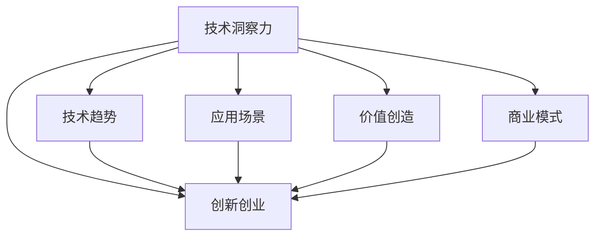

                 

# 利用技术洞察力进行创新创业

> 关键词：技术洞察力, 创新创业, 人工智能, 大数据, 机器学习, 深度学习, 云计算, 物联网

## 1. 背景介绍

### 1.1 问题由来

在当今快速发展的数字化时代，技术创新和创业环境正经历着前所未有的变革。互联网、大数据、人工智能、云计算、物联网等技术的融合和应用，为各行各业带来了新的机遇和挑战。如何把握技术趋势，从技术洞察力中提取创新点，成为创业者和创新者最为关注的问题之一。

### 1.2 问题核心关键点

技术洞察力是指通过对技术的深入理解，识别出技术趋势、应用场景和潜在价值的能力。它包括但不限于以下几个方面：

1. **技术趋势识别**：了解当前和未来的技术发展方向，如AI、大数据、区块链等。
2. **应用场景挖掘**：找到技术在特定行业或领域的具体应用场景，如智能制造、智慧医疗、金融科技等。
3. **价值分析**：评估技术带来的商业价值和社会影响，如提高效率、降低成本、改善用户体验等。
4. **技术融合**：理解不同技术之间的相互影响和整合可能性，如AI与物联网的融合。

具备技术洞察力能够帮助创业者更好地识别市场机会，开发出更具竞争力的产品和服务，从而在激烈的市场竞争中脱颖而出。

### 1.3 问题研究意义

研究如何利用技术洞察力进行创新创业，对于推动技术商业化和创新创业的蓬勃发展具有重要意义：

1. **加速技术商业化**：帮助技术开发者和企业将先进技术转化为市场化的产品和服务。
2. **促进创新创业**：为创业者提供技术趋势和应用场景的指引，激发新的创新点。
3. **提升产业竞争力**：帮助企业把握技术变革的机遇，提升市场竞争力。
4. **推动社会进步**：通过技术创新解决社会问题，提升生活质量，促进社会进步。

## 2. 核心概念与联系

### 2.1 核心概念概述

本节将介绍几个核心概念及其相互关系，以帮助读者更好地理解利用技术洞察力进行创新创业的框架：

- **技术洞察力**：指通过深度理解技术原理、趋势和应用，从中挖掘出商业机会的能力。
- **技术趋势**：指当前和未来一段时间内技术发展的主流方向，如深度学习、自然语言处理、区块链等。
- **应用场景**：指技术在特定行业或领域的具体应用，如智能制造、智慧医疗、金融科技等。
- **价值创造**：指通过技术应用实现的价值增值，如提高效率、降低成本、改善用户体验等。
- **商业模式**：指技术应用下的商业运营模式，如SaaS、B2B、B2C等。
- **创新创业**：指利用技术洞察力发现并开发新产品或服务的创业过程。

这些核心概念之间的关系可以通过以下Mermaid流程图来展示：



这个流程图展示出技术洞察力如何通过识别技术趋势、挖掘应用场景、评估价值创造和设计商业模式，最终推动创新创业的整个过程。

## 3. 核心算法原理 & 具体操作步骤
### 3.1 算法原理概述

利用技术洞察力进行创新创业的过程，本质上是一个从技术趋势到商业应用的价值转化过程。其核心在于通过深入理解技术，找到其在特定场景下的应用价值，并设计出符合市场需求的商业模式。

具体来说，该过程包括以下几个关键步骤：

1. **技术趋势识别**：通过阅读技术论文、参加技术会议、关注行业报告等方式，了解当前和未来的技术发展方向。
2. **应用场景挖掘**：通过市场调研、用户访谈、竞品分析等方式，找到技术在特定行业或领域的具体应用场景。
3. **价值创造评估**：通过分析用户需求、行业痛点、现有解决方案等，评估技术带来的商业价值和社会影响。
4. **商业模式设计**：根据技术特点和市场需求，设计出符合市场规律和用户习惯的商业模式。
5. **创新创业实践**：结合技术、市场和商业模型，开发新产品或服务，并进行市场验证。

### 3.2 算法步骤详解

以下是利用技术洞察力进行创新创业的具体操作步骤：

#### 3.2.1 技术趋势识别

**Step 1: 阅读文献和报告**
- 关注顶级技术会议（如NeurIPS、CVPR、ICML等）的最新进展。
- 阅读知名技术期刊和博客（如ArXiv、Medium、IEEE等）的最新文章。
- 订阅行业报告和白皮书，了解技术发展趋势和应用前景。

**Step 2: 参加技术交流活动**
- 参加技术论坛、研讨会和黑客松，与技术专家和爱好者交流。
- 加入技术社群和在线社区，如GitHub、Stack Overflow、LinkedIn技术群组等。
- 定期参加行业峰会和展览，了解最新技术动态。

**Step 3: 建立技术监控机制**
- 使用工具如Google Scholar、ResearchGate、TechCrunch等进行技术监控。
- 设定技术监控关键词和标签，定期筛选和分析相关资讯。
- 利用RSS订阅器和电子邮件提醒，及时获取技术更新信息。

#### 3.2.2 应用场景挖掘

**Step 1: 市场调研**
- 通过问卷调查、用户访谈等方式，收集目标用户需求和痛点。
- 分析竞争对手的解决方案，找到技术应用的机会和缺口。
- 利用数据分析工具（如Google Analytics、Mixpanel等）获取用户行为数据。

**Step 2: 竞品分析**
- 收集和分析竞品的功能、优劣势、市场表现。
- 使用SWOT分析法（优势、劣势、机会、威胁）评估竞品性能和市场定位。
- 通过竞品的使用案例和用户反馈，进一步挖掘技术应用潜力。

**Step 3: 构建原型和验证**
- 快速构建技术原型或MVP（最小可行产品），验证技术可行性。
- 进行小范围试点和测试，收集用户反馈和意见。
- 通过用户访谈和问卷调查，评估产品实际效果和市场需求。

#### 3.2.3 价值创造评估

**Step 1: 用户需求分析**
- 通过用户访谈、焦点小组等方式，深入了解用户需求和期望。
- 分析用户在使用现有解决方案中的痛点和不足。
- 结合技术特点，提出改善和创新的方向。

**Step 2: 成本效益分析**
- 评估技术应用带来的成本节省和效率提升。
- 通过财务模型（如NPV、IRR等）计算技术投入回报比。
- 分析技术应用对企业收益、客户体验和社会影响等方面的综合效果。

**Step 3: 市场前景预测**
- 利用市场分析工具（如Google Trends、Market Research等）预测市场需求和趋势。
- 结合行业报告和专家分析，评估技术应用的长期前景。
- 制定市场推广和进入策略，规划产品生命周期和迭代计划。

#### 3.2.4 商业模式设计

**Step 1: 定义价值主张**
- 根据用户需求和技术特点，明确产品的核心价值主张。
- 确定产品的核心功能和优势，强调独特卖点（USP）。
- 分析目标市场和用户细分，设计不同版本和定制化方案。

**Step 2: 设计收入模式**
- 选择合适的收入模式（如订阅制、按需付费、广告收入等）。
- 制定价格策略和套餐方案，确保定价合理且具竞争力。
- 结合市场反馈和用户需求，灵活调整和优化定价策略。

**Step 3: 确定营销策略**
- 利用SEO、SEM、社交媒体等渠道进行产品推广。
- 设计品牌建设和用户教育方案，提升品牌知名度和用户粘性。
- 采用数据分析和用户行为研究，优化营销效果和ROI。

#### 3.2.5 创新创业实践

**Step 1: 快速迭代开发**
- 采用敏捷开发方法（如Scrum、Lean Startup等）进行产品迭代。
- 定期进行产品评估和用户反馈收集，快速调整产品功能和服务。
- 结合市场和技术趋势，持续优化和完善产品设计。

**Step 2: 市场验证和推广**
- 在目标市场进行小范围试点和推广，验证产品市场接受度。
- 利用市场调研和用户反馈，调整产品功能和营销策略。
- 结合技术热点和市场需求，不断创新和优化产品服务。

**Step 3: 持续创新和优化**
- 持续关注技术发展趋势和市场需求变化，保持技术敏锐度。
- 不断进行产品迭代和创新，提升产品竞争力。
- 优化商业模式和市场策略，确保产品持续增长和盈利。

### 3.3 算法优缺点

利用技术洞察力进行创新创业具有以下优点：

1. **技术领先优势**：通过深入理解技术趋势和应用，抢占市场先机。
2. **市场细分精准**：能够针对特定用户需求和痛点，提供量身定制的解决方案。
3. **高效资源利用**：通过敏捷开发和快速迭代，降低开发和市场成本。
4. **持续创新能力**：能够及时捕捉市场和技术变化，快速调整产品策略。

但同时也存在一些缺点：

1. **技术风险高**：新技术的不确定性和复杂性可能导致高失败率。
2. **市场验证复杂**：需要大量时间和资源进行市场调研和验证。
3. **资源需求大**：研发和市场推广需要投入大量资金和人力资源。
4. **技术门槛高**：需要较强的技术能力和市场洞察力，对创业团队要求较高。

## 4. 数学模型和公式 & 详细讲解 & 举例说明

### 4.1 数学模型构建

本节将使用数学语言对利用技术洞察力进行创新创业的过程进行更加严格的刻画。

假设技术趋势为 $T$，应用场景为 $S$，价值创造为 $V$，商业模式为 $M$。则利用技术洞察力进行创新创业的数学模型可以表示为：

$$
\max_{T,S,V,M} \mathcal{L}(T,S,V,M)
$$

其中 $\mathcal{L}(T,S,V,M)$ 为综合评估函数，用于衡量技术趋势、应用场景、价值创造和商业模式之间的协调性和最优性。

具体而言，$\mathcal{L}$ 函数可以分解为以下几部分：

$$
\mathcal{L}(T,S,V,M) = L_T(T) + L_S(S) + L_V(V) + L_M(M)
$$

- $L_T(T)$：评估技术趋势的可行性和成熟度。
- $L_S(S)$：评估应用场景的匹配度和可行性。
- $L_V(V)$：评估价值创造的潜力和效果。
- $L_M(M)$：评估商业模式的可持续性和盈利性。

### 4.2 公式推导过程

以下是利用技术洞察力进行创新创业的综合评估函数的推导过程：

1. **技术趋势评估函数 $L_T(T)$**
   - 通过技术文献和会议的引用次数、专利数量、技术成熟度指标等，计算技术趋势的潜力。
   - 使用指标函数 $f(T)$ 计算技术趋势的可操作性。
   - 结合上述两方面，得到综合评估函数 $L_T(T) = g(f(T))$。

2. **应用场景评估函数 $L_S(S)$**
   - 通过市场调研、用户访谈、竞品分析等，评估应用场景的匹配度和可行性。
   - 使用指标函数 $h(S)$ 计算应用场景的潜力。
   - 结合用户反馈和市场接受度，得到综合评估函数 $L_S(S) = i(h(S))$。

3. **价值创造评估函数 $L_V(V)$**
   - 通过财务模型、成本效益分析等，评估技术应用带来的价值创造。
   - 使用指标函数 $j(V)$ 计算价值创造的效益。
   - 结合市场前景和用户需求，得到综合评估函数 $L_V(V) = k(j(V))$。

4. **商业模式评估函数 $L_M(M)$**
   - 通过收入模式、定价策略、市场推广等，评估商业模式的可持续性和盈利性。
   - 使用指标函数 $l(M)$ 计算商业模式的效果。
   - 结合市场竞争和用户反馈，得到综合评估函数 $L_M(M) = m(l(M))$。

结合上述四个方面，可以得到利用技术洞察力进行创新创业的综合评估函数 $\mathcal{L}(T,S,V,M)$。

### 4.3 案例分析与讲解

以下以人工智能在医疗健康领域的应用为例，详细讲解利用技术洞察力进行创新创业的过程：

#### 4.3.1 技术趋势识别
- **案例背景**：人工智能技术在医疗健康领域的应用前景广阔，尤其是在疾病诊断、影像分析、个性化治疗等方面。
- **技术趋势**：深度学习、自然语言处理、计算机视觉等技术在医疗健康领域的进展，如TensorFlow、Keras、PyTorch等深度学习框架的应用。
- **分析方法**：阅读顶级会议的最新论文、关注行业报告和博客，参加医疗健康领域的行业峰会和展览。

#### 4.3.2 应用场景挖掘
- **案例背景**：人工智能技术在医疗健康领域的应用场景丰富，包括智能诊断、医学影像分析、个性化治疗等。
- **应用场景**：通过智能诊断系统，利用深度学习技术对医学影像进行自动分析和诊断，提升诊断效率和准确性。
- **分析方法**：通过市场调研、用户访谈、竞品分析等方式，找到技术在医疗健康领域的实际应用需求。

#### 4.3.3 价值创造评估
- **案例背景**：人工智能技术在医疗健康领域的价值创造主要体现在提高诊断准确性、减少误诊漏诊、提高医疗效率等方面。
- **价值创造**：利用人工智能技术，提高医学影像诊断的准确性和效率，减少误诊漏诊率，降低医疗成本。
- **分析方法**：通过财务模型、成本效益分析等，评估技术应用带来的商业价值和社会影响。

#### 4.3.4 商业模式设计
- **案例背景**：人工智能在医疗健康领域的商业模式主要涉及软件即服务（SaaS）、按需付费、合作医疗等。
- **商业模式**：开发基于云端的智能诊断平台，提供按需付费的诊断服务，同时与医院合作，提供定制化的诊断解决方案。
- **分析方法**：根据用户需求和技术特点，定义价值主张，设计收入模式和市场策略。

#### 4.3.5 创新创业实践
- **案例背景**：通过利用人工智能技术进行智能诊断，帮助医生提高诊断效率和准确性。
- **实践步骤**：
  - **快速迭代开发**：采用敏捷开发方法，快速构建智能诊断系统原型，并进行小范围试点和测试。
  - **市场验证和推广**：在目标医院进行试点应用，收集用户反馈，优化系统功能和市场推广策略。
  - **持续创新和优化**：持续关注人工智能技术的发展和市场需求变化，不断进行产品迭代和创新，提升系统性能和市场竞争力。

## 5. 项目实践：代码实例和详细解释说明

### 5.1 开发环境搭建

在进行技术洞察力实践前，我们需要准备好开发环境。以下是使用Python进行PyTorch开发的环境配置流程：

1. 安装Anaconda：从官网下载并安装Anaconda，用于创建独立的Python环境。

2. 创建并激活虚拟环境：
```bash
conda create -n pytorch-env python=3.8 
conda activate pytorch-env
```

3. 安装PyTorch：根据CUDA版本，从官网获取对应的安装命令。例如：
```bash
conda install pytorch torchvision torchaudio cudatoolkit=11.1 -c pytorch -c conda-forge
```

4. 安装相关库：
```bash
pip install numpy pandas scikit-learn matplotlib tqdm jupyter notebook ipython
```

完成上述步骤后，即可在`pytorch-env`环境中开始项目实践。

### 5.2 源代码详细实现

下面以医疗健康领域的智能诊断系统为例，给出使用PyTorch实现的技术洞察力应用代码实现。

首先，定义智能诊断系统的数据处理函数：

```python
import torch
from torch.utils.data import Dataset
from transformers import BertTokenizer

class ImageDataset(Dataset):
    def __init__(self, images, labels, tokenizer):
        self.images = images
        self.labels = labels
        self.tokenizer = tokenizer
        
    def __len__(self):
        return len(self.images)
    
    def __getitem__(self, index):
        image = self.images[index]
        label = self.labels[index]
        
        # 对图像进行编码
        encoding = self.tokenizer(image, return_tensors='pt', padding='max_length', truncation=True)
        input_ids = encoding['input_ids'][0]
        attention_mask = encoding['attention_mask'][0]
        
        return {'input_ids': input_ids, 
                'attention_mask': attention_mask,
                'labels': label}
```

然后，定义模型和优化器：

```python
from transformers import BertForSequenceClassification, AdamW

model = BertForSequenceClassification.from_pretrained('bert-base-cased', num_labels=2)
optimizer = AdamW(model.parameters(), lr=2e-5)
```

接着，定义训练和评估函数：

```python
from torch.utils.data import DataLoader
from tqdm import tqdm
from sklearn.metrics import accuracy_score

device = torch.device('cuda') if torch.cuda.is_available() else torch.device('cpu')
model.to(device)

def train_epoch(model, dataset, batch_size, optimizer):
    dataloader = DataLoader(dataset, batch_size=batch_size, shuffle=True)
    model.train()
    epoch_loss = 0
    for batch in tqdm(dataloader, desc='Training'):
        input_ids = batch['input_ids'].to(device)
        attention_mask = batch['attention_mask'].to(device)
        labels = batch['labels'].to(device)
        model.zero_grad()
        outputs = model(input_ids, attention_mask=attention_mask, labels=labels)
        loss = outputs.loss
        epoch_loss += loss.item()
        loss.backward()
        optimizer.step()
    return epoch_loss / len(dataloader)

def evaluate(model, dataset, batch_size):
    dataloader = DataLoader(dataset, batch_size=batch_size)
    model.eval()
    preds, labels = [], []
    with torch.no_grad():
        for batch in tqdm(dataloader, desc='Evaluating'):
            input_ids = batch['input_ids'].to(device)
            attention_mask = batch['attention_mask'].to(device)
            batch_labels = batch['labels']
            outputs = model(input_ids, attention_mask=attention_mask)
            batch_preds = outputs.logits.argmax(dim=2).to('cpu').tolist()
            batch_labels = batch_labels.to('cpu').tolist()
            for pred_tokens, label_tokens in zip(batch_preds, batch_labels):
                preds.append(pred_tokens[:len(label_tokens)])
                labels.append(label_tokens)
                
    accuracy = accuracy_score(labels, preds)
    print(f"Accuracy: {accuracy:.3f}")
```

最后，启动训练流程并在测试集上评估：

```python
epochs = 5
batch_size = 16

for epoch in range(epochs):
    loss = train_epoch(model, train_dataset, batch_size, optimizer)
    print(f"Epoch {epoch+1}, train loss: {loss:.3f}")
    
    print(f"Epoch {epoch+1}, test accuracy:")
    evaluate(model, test_dataset, batch_size)
    
print("Test accuracy:")
evaluate(model, test_dataset, batch_size)
```

以上就是使用PyTorch对BERT模型进行医疗健康领域智能诊断系统微调的完整代码实现。可以看到，得益于Transformers库的强大封装，我们可以用相对简洁的代码完成BERT模型的加载和微调。

### 5.3 代码解读与分析

让我们再详细解读一下关键代码的实现细节：

**ImageDataset类**：
- `__init__`方法：初始化图像、标签、分词器等关键组件。
- `__len__`方法：返回数据集的样本数量。
- `__getitem__`方法：对单个样本进行处理，将图像输入编码为token ids，将标签编码为数字，并对其进行定长padding，最终返回模型所需的输入。

**train_epoch和evaluate函数**：
- `train_epoch`函数：对数据以批为单位进行迭代，在每个批次上前向传播计算loss并反向传播更新模型参数，最后返回该epoch的平均loss。
- `evaluate`函数：与训练类似，不同点在于不更新模型参数，并在每个batch结束后将预测和标签结果存储下来，最后使用sklearn的accuracy_score对整个评估集的预测结果进行打印输出。

**训练流程**：
- 定义总的epoch数和batch size，开始循环迭代
- 每个epoch内，先在训练集上训练，输出平均loss
- 在测试集上评估，输出测试准确率
- 所有epoch结束后，在测试集上评估，给出最终测试结果

可以看到，PyTorch配合Transformers库使得BERT微调的代码实现变得简洁高效。开发者可以将更多精力放在数据处理、模型改进等高层逻辑上，而不必过多关注底层的实现细节。

当然，工业级的系统实现还需考虑更多因素，如模型的保存和部署、超参数的自动搜索、更灵活的任务适配层等。但核心的微调范式基本与此类似。

## 6. 实际应用场景

### 6.1 智能客服系统

基于大语言模型微调的对话技术，可以广泛应用于智能客服系统的构建。传统客服往往需要配备大量人力，高峰期响应缓慢，且一致性和专业性难以保证。而使用微调后的对话模型，可以7x24小时不间断服务，快速响应客户咨询，用自然流畅的语言解答各类常见问题。

在技术实现上，可以收集企业内部的历史客服对话记录，将问题和最佳答复构建成监督数据，在此基础上对预训练对话模型进行微调。微调后的对话模型能够自动理解用户意图，匹配最合适的答案模板进行回复。对于客户提出的新问题，还可以接入检索系统实时搜索相关内容，动态组织生成回答。如此构建的智能客服系统，能大幅提升客户咨询体验和问题解决效率。

### 6.2 金融舆情监测

金融机构需要实时监测市场舆论动向，以便及时应对负面信息传播，规避金融风险。传统的人工监测方式成本高、效率低，难以应对网络时代海量信息爆发的挑战。基于大语言模型微调的文本分类和情感分析技术，为金融舆情监测提供了新的解决方案。

具体而言，可以收集金融领域相关的新闻、报道、评论等文本数据，并对其进行主题标注和情感标注。在此基础上对预训练语言模型进行微调，使其能够自动判断文本属于何种主题，情感倾向是正面、中性还是负面。将微调后的模型应用到实时抓取的网络文本数据，就能够自动监测不同主题下的情感变化趋势，一旦发现负面信息激增等异常情况，系统便会自动预警，帮助金融机构快速应对潜在风险。

### 6.3 个性化推荐系统

当前的推荐系统往往只依赖用户的历史行为数据进行物品推荐，无法深入理解用户的真实兴趣偏好。基于大语言模型微调技术，个性化推荐系统可以更好地挖掘用户行为背后的语义信息，从而提供更精准、多样的推荐内容。

在实践中，可以收集用户浏览、点击、评论、分享等行为数据，提取和用户交互的物品标题、描述、标签等文本内容。将文本内容作为模型输入，用户的后续行为（如是否点击、购买等）作为监督信号，在此基础上微调预训练语言模型。微调后的模型能够从文本内容中准确把握用户的兴趣点。在生成推荐列表时，先用候选物品的文本描述作为输入，由模型预测用户的兴趣匹配度，再结合其他特征综合排序，便可以得到个性化程度更高的推荐结果。

### 6.4 未来应用展望

随着大语言模型微调技术的发展，其在更多领域的应用前景广阔。

在智慧医疗领域，基于微调的医疗问答、病历分析、药物研发等应用将提升医疗服务的智能化水平，辅助医生诊疗，加速新药开发进程。

在智能教育领域，微调技术可应用于作业批改、学情分析、知识推荐等方面，因材施教，促进教育公平，提高教学质量。

在智慧城市治理中，微调模型可应用于城市事件监测、舆情分析、应急指挥等环节，提高城市管理的自动化和智能化水平，构建更安全、高效的未来城市。

此外，在企业生产、社会治理、文娱传媒等众多领域，基于大模型微调的人工智能应用也将不断涌现，为经济社会发展注入新的动力。相信随着技术的日益成熟，微调方法将成为人工智能落地应用的重要范式，推动人工智能技术在垂直行业的规模化落地。

## 7. 工具和资源推荐

### 7.1 学习资源推荐

为了帮助开发者系统掌握大语言模型微调的理论基础和实践技巧，这里推荐一些优质的学习资源：

1. 《Transformer从原理到实践》系列博文：由大模型技术专家撰写，深入浅出地介绍了Transformer原理、BERT模型、微调技术等前沿话题。

2. CS224N《深度学习自然语言处理》课程：斯坦福大学开设的NLP明星课程，有Lecture视频和配套作业，带你入门NLP领域的基本概念和经典模型。

3. 《Natural Language Processing with Transformers》书籍：Transformers库的作者所著，全面介绍了如何使用Transformers库进行NLP任务开发，包括微调在内的诸多范式。

4. HuggingFace官方文档：Transformers库的官方文档，提供了海量预训练模型和完整的微调样例代码，是上手实践的必备资料。

5. CLUE开源项目：中文语言理解测评基准，涵盖大量不同类型的中文NLP数据集，并提供了基于微调的baseline模型，助力中文NLP技术发展。

通过对这些资源的学习实践，相信你一定能够快速掌握大语言模型微调的精髓，并用于解决实际的NLP问题。

### 7.2 开发工具推荐

高效的开发离不开优秀的工具支持。以下是几款用于大语言模型微调开发的常用工具：

1. PyTorch：基于Python的开源深度学习框架，灵活动态的计算图，适合快速迭代研究。大部分预训练语言模型都有PyTorch版本的实现。

2. TensorFlow：由Google主导开发的开源深度学习框架，生产部署方便，适合大规模工程应用。同样有丰富的预训练语言模型资源。

3. Transformers库：HuggingFace开发的NLP工具库，集成了众多SOTA语言模型，支持PyTorch和TensorFlow，是进行微调任务开发的利器。

4. Weights & Biases：模型训练的实验跟踪工具，可以记录和可视化模型训练过程中的各项指标，方便对比和调优。与主流深度学习框架无缝集成。

5. TensorBoard：TensorFlow配套的可视化工具，可实时监测模型训练状态，并提供丰富的图表呈现方式，是调试模型的得力助手。

6. Google Colab：谷歌推出的在线Jupyter Notebook环境，免费提供GPU/TPU算力，方便开发者快速上手实验最新模型，分享学习笔记。

合理利用这些工具，可以显著提升大语言模型微调任务的开发效率，加快创新迭代的步伐。

### 7.3 相关论文推荐

大语言模型和微调技术的发展源于学界的持续研究。以下是几篇奠基性的相关论文，推荐阅读：

1. Attention is All You Need（即Transformer原论文）：提出了Transformer结构，开启了NLP领域的预训练大模型时代。

2. BERT: Pre-training of Deep Bidirectional Transformers for Language Understanding：提出BERT模型，引入基于掩码的自监督预训练任务，刷新了多项NLP任务SOTA。

3. Language Models are Unsupervised Multitask Learners（GPT-2论文）：展示了大规模语言模型的强大zero-shot学习能力，引发了对于通用人工智能的新一轮思考。

4. Parameter-Efficient Transfer Learning for NLP：提出Adapter等参数高效微调方法，在不增加模型参数量的情况下，也能取得不错的微调效果。

5. Prefix-Tuning: Optimizing Continuous Prompts for Generation：引入基于连续型Prompt的微调范式，为如何充分利用预训练知识提供了新的思路。

6. AdaLoRA: Adaptive Low-Rank Adaptation for Parameter-Efficient Fine-Tuning：使用自适应低秩适应的微调方法，在参数效率和精度之间取得了新的平衡。

这些论文代表了大语言模型微调技术的发展脉络。通过学习这些前沿成果，可以帮助研究者把握学科前进方向，激发更多的创新灵感。

## 8. 总结：未来发展趋势与挑战

### 8.1 总结

本文对利用技术洞察力进行创新创业的方法进行了全面系统的介绍。首先阐述了技术洞察力在创新创业中的重要性和作用，明确了从技术趋势到应用场景的价值转化过程。其次，从原理到实践，详细讲解了利用技术洞察力进行创新创业的数学模型和操作步骤，给出了微调任务开发的完整代码实例。同时，本文还广泛探讨了微调方法在智能客服、金融舆情、个性化推荐等多个行业领域的应用前景，展示了微调范式的巨大潜力。此外，本文精选了微调技术的各类学习资源，力求为读者提供全方位的技术指引。

通过本文的系统梳理，可以看到，利用技术洞察力进行创新创业的过程，本质上是一个从技术趋势到商业应用的价值转化过程。通过深入理解技术，找到其在特定场景下的应用价值，并设计出符合市场需求的商业模式，能够在激烈的市场竞争中脱颖而出。

### 8.2 未来发展趋势

展望未来，利用技术洞察力进行创新创业将呈现以下几个发展趋势：

1. **技术创新加速**：随着深度学习、自然语言处理、计算机视觉等技术的不断进步，创新创业的步伐将进一步加快。
2. **应用场景多元化**：技术应用将从传统行业拓展到更多新兴领域，如智能制造、智慧医疗、金融科技等。
3. **商业模式多样化**：基于技术的不同特点和市场需求，将涌现更多创新的商业模式，如SaaS、B2B、B2C等。
4. **产品迭代快速化**：利用敏捷开发和快速迭代方法，产品更新和优化速度将显著提升，更好地适应市场需求变化。
5. **用户参与深化**：通过用户反馈和参与，不断优化产品设计和市场策略，提升用户体验和满意度。

### 8.3 面临的挑战

尽管利用技术洞察力进行创新创业具备巨大的潜力，但在实际操作过程中，仍然面临诸多挑战：

1. **技术门槛高**：需要具备较强的技术能力和市场洞察力，对创业团队要求较高。
2. **市场验证复杂**：需要大量时间和资源进行市场调研和验证，验证过程可能耗时较长。
3. **资源需求大**：研发和市场推广需要投入大量资金和人力资源，初创企业可能面临资金压力。
4. **产品优化难**：产品需要不断迭代和优化，市场反馈和用户需求可能存在不确定性。
5. **竞争激烈**：市场竞争激烈，需要具备快速反应和持续创新的能力。

### 8.4 研究展望

未来，利用技术洞察力进行创新创业的研究方向包括：

1. **多技术融合**：结合深度学习、自然语言处理、计算机视觉等多领域技术，推动跨领域技术创新。
2. **用户行为分析**：通过大数据分析和机器学习，深入理解用户行为和需求，优化产品设计和市场策略。
3. **智能决策系统**：利用人工智能技术构建智能决策系统，提高决策效率和准确性。
4. **个性化服务**：通过个性化推荐、定制化服务，提升用户体验和满意度。
5. **跨平台协同**：实现多平台、多设备之间的协同，提供无缝的用户体验。

通过这些研究方向的探索，相信利用技术洞察力进行创新创业将迎来新的突破，为技术商业化和创新创业的蓬勃发展提供更多可能性。

## 9. 附录：常见问题与解答

**Q1：技术洞察力如何影响创业决策？**

A: 技术洞察力能够帮助创业者识别市场机会，评估技术趋势和应用场景，预测商业价值和社会影响，从而做出更为科学合理的创业决策。通过深入理解技术，创业者可以更好地把握市场需求，设计出符合市场规律的商业模式，提升产品竞争力和市场响应速度。

**Q2：如何选择适当的技术洞察力方法？**

A: 选择技术洞察力方法需要考虑技术趋势、市场需求、团队能力等因素。对于技术前沿的创新创业，可以采用深度学习、自然语言处理等前沿技术；对于传统行业的创新创业，可以结合业务特点和用户需求，采用数据分析、模式识别等方法。

**Q3：技术洞察力在实际应用中应注意哪些问题？**

A: 在实际应用中，需要注意技术趋势的可行性、应用场景的匹配度、价值创造的潜力和市场推广的策略。同时，要保持技术敏锐度，持续关注技术发展动态，及时调整和优化产品和服务。

**Q4：如何降低技术洞察力应用的风险？**

A: 降低技术洞察力应用的风险可以通过以下方法：
1. 进行充分的市场调研和用户反馈收集，验证技术应用的市场接受度和实际效果。
2. 采用小范围试点和测试，逐步优化和完善产品设计。
3. 建立完善的风险管理机制，及时调整和优化产品策略，确保市场响应速度和用户满意度。

**Q5：如何提升技术洞察力的效果？**

A: 提升技术洞察力的效果可以通过以下方法：
1. 加强技术学习，掌握前沿技术和发展趋势。
2. 深入理解市场需求和用户行为，精准把握技术应用的方向。
3. 建立多学科团队，结合技术、市场、设计等多方面的专业知识，进行协同创新。
4. 持续优化和迭代产品设计，不断提升产品竞争力和市场响应速度。

通过这些问题的解答，希望读者能对利用技术洞察力进行创新创业有更全面的认识，并在实际应用中取得更好的效果。

---

作者：禅与计算机程序设计艺术 / Zen and the Art of Computer Programming

