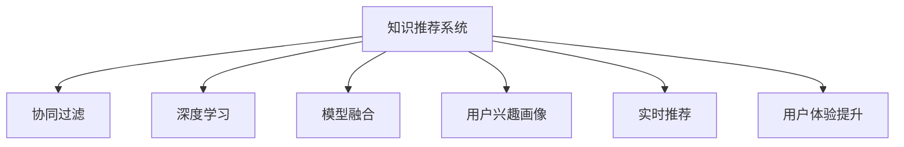

                 

# 利用机器学习优化知识推荐：提升用户体验

> 关键词：知识推荐系统, 机器学习, 协同过滤, 深度学习, 模型融合, 召回率和准确率, 用户兴趣画像, 实时推荐, 用户体验提升

## 1. 背景介绍

在数字化时代，信息量爆炸式增长，如何为用户快速找到有价值的内容，已成为互联网企业面临的重大挑战。传统的网页搜索引擎虽然覆盖面广，但缺乏个性化推荐，难以满足用户多样化的需求。为此，知识推荐系统应运而生，通过分析用户行为，预测其兴趣，将合适的信息推送给用户，极大提升了信息检索的精准度和用户体验。

知识推荐系统在电商、新闻、社交、音乐、视频等多个领域应用广泛，如淘宝的推荐商品、今日头条的新闻推荐、Netflix的个性化视频等。这些系统通常基于大数据和复杂的算法，通过精准推荐用户感兴趣的内容，提升了信息获取的效率和质量，显著增加了用户粘性。

然而，知识推荐系统在实际应用中也面临着不少问题。如数据稀疏性、冷启动问题、用户行为不稳定等，导致推荐精度和用户体验难以满足需求。为了解决这些问题，近年来机器学习技术被引入知识推荐系统，大幅提升了推荐的准确性和个性化程度。

## 2. 核心概念与联系

### 2.1 核心概念概述

为更好地理解利用机器学习优化知识推荐的过程，本节将介绍几个关键概念：

- **知识推荐系统**：通过分析用户行为和数据特征，预测用户兴趣，自动为用户推荐个性化信息。知识推荐系统是互联网企业进行用户价值变现的重要工具。

- **协同过滤(Collaborative Filtering)**：通过用户行为数据（如浏览、购买、评分等）来发现用户间的相似性，预测用户对新物品的评分，实现个性化推荐。

- **深度学习(DL)**：利用神经网络模型自动提取数据特征，学习用户与物品间的复杂关系，进行精准推荐。

- **模型融合**：将多个推荐算法或模型进行组合，取长补短，提升推荐质量。常见的方法包括加权平均、集成学习等。

- **召回率和准确率**：分别表示推荐结果的相关性和正确性。高召回率意味着大量搜索结果，但可能存在噪声；高准确率则保证推荐结果更准确，但结果数量较少。

- **用户兴趣画像**：通过对用户行为数据的综合分析，构建出用户的多维度兴趣标签，如年龄、性别、爱好、兴趣等，用于个性化推荐。

- **实时推荐**：通过实时分析用户行为，动态调整推荐内容，保持推荐结果的时效性和相关性。

- **用户体验提升**：通过优化推荐算法和推荐内容，提高用户满意度，增加用户粘性和转化率。

这些核心概念之间的逻辑关系可以通过以下Mermaid流程图来展示：



这个流程图展示出知识推荐系统的核心概念及其之间的关系：协同过滤、深度学习、模型融合等机器学习技术为知识推荐系统提供数据驱动的个性化推荐，用户兴趣画像帮助更准确地刻画用户，实时推荐和用户体验提升使推荐内容保持最新和相关，提升用户满意度。

## 3. 核心算法原理 & 具体操作步骤
### 3.1 算法原理概述

知识推荐系统的核心在于构建用户与物品间的关联关系，通过这些关系来预测用户对新物品的偏好。其基本思路是将用户与物品的交互数据转化为数值化的特征向量，然后利用机器学习模型学习这些特征向量之间的关系，进而预测用户对新物品的评分或点击概率。

具体来说，知识推荐系统包括两个主要部分：用户行为分析（User Behavior Analysis）和物品特征抽取（Item Feature Extraction）。前者通过协同过滤、深度学习等技术分析用户历史行为数据，构建用户兴趣画像；后者则通过深度学习模型提取物品的特征，学习物品间的关联关系。两者结合，构建出用户对物品的评分或点击概率预测模型。

### 3.2 算法步骤详解

基于机器学习的知识推荐系统主要分为以下几个步骤：

**Step 1: 数据收集与预处理**
- 收集用户的历史行为数据，如浏览、购买、评分等。
- 清洗和预处理数据，去除噪音和异常值，构建出完整、准确的用户行为矩阵。

**Step 2: 用户行为分析**
- 使用协同过滤、深度学习等技术分析用户行为数据，构建用户兴趣画像。
- 协同过滤常用的方法包括基于用户基于物品的协同过滤和基于物品基于用户的协同过滤。
- 深度学习模型常用的包括基于协同过滤的矩阵分解模型、基于神经网络的协同过滤模型等。

**Step 3: 物品特征抽取**
- 使用深度学习模型（如CNN、RNN、Transformer等）对物品的描述信息进行特征抽取。
- 常用特征包括词频、TF-IDF、词向量等。
- 模型输出的物品特征向量可用于计算物品间的相似度，构建出物品特征矩阵。

**Step 4: 用户-物品关系建模**
- 将用户兴趣画像与物品特征矩阵进行拼接或拼接后再进行PCA降维，得到用户对物品的评分或点击概率预测向量。
- 常用的机器学习模型包括线性回归、逻辑回归、SVM、神经网络等。
- 模型训练时，使用用户历史行为数据和物品特征数据，优化模型的参数，使得预测结果更接近真实值。

**Step 5: 推荐生成与调整**
- 根据预测结果生成推荐列表，排列推荐顺序。
- 实时更新推荐模型，动态调整推荐结果，保证推荐内容的时效性和相关性。
- 使用A/B测试等方法评估推荐效果，优化模型参数。

### 3.3 算法优缺点

基于机器学习的知识推荐系统具有以下优点：
1. 高精度推荐：深度学习模型可以自动提取复杂特征，提高推荐的精度和个性化程度。
2. 数据驱动：协同过滤、深度学习等方法充分利用用户行为数据，提供数据驱动的推荐。
3. 实时性：深度学习模型计算速度快，可以实时生成推荐，满足用户即时需求。
4. 跨平台适用：知识推荐系统可以应用于电商、社交、新闻等多个领域。

同时，该方法也存在一些局限性：
1. 数据依赖：协同过滤、深度学习等方法对数据质量和数量要求较高，数据稀疏性问题可能导致推荐效果下降。
2. 冷启动问题：新用户或新物品没有足够的历史数据，难以进行精准推荐。
3. 计算复杂度高：深度学习模型参数多，计算复杂度高，资源消耗较大。
4. 过拟合风险：模型容易过拟合历史数据，泛化性能不足。
5. 解释性不足：深度学习模型的决策过程缺乏可解释性，难以调试和优化。

尽管存在这些局限性，但就目前而言，基于机器学习的知识推荐系统仍是推荐技术的主流范式。未来相关研究的方向是进一步降低对标注数据的依赖，提高模型的跨领域迁移能力，同时兼顾可解释性和伦理安全性等因素。

### 3.4 算法应用领域

基于机器学习的知识推荐系统在多个领域得到广泛应用，如：

- 电商平台：通过推荐系统，为每件商品找到潜在买家，增加销售额。
- 新闻平台：推荐用户可能感兴趣的新闻，增加用户粘性和阅读时长。
- 社交媒体：推荐用户可能感兴趣的内容，增加用户互动和活跃度。
- 视频平台：推荐用户可能感兴趣的视频，增加用户观看时长和付费率。

除了上述这些经典应用外，知识推荐系统还被创新性地应用到更多场景中，如智能家居、健康医疗、金融理财等，为各行各业带来智能化升级。

## 4. 数学模型和公式 & 详细讲解 & 举例说明
### 4.1 数学模型构建

本节将使用数学语言对基于机器学习的知识推荐系统进行更加严格的刻画。

假设用户集为 $U$，物品集为 $I$，用户与物品的评分矩阵为 $\mathbf{R} \in \mathbb{R}^{n \times m}$，其中 $n$ 为物品数量，$m$ 为用户数量。用户 $u$ 对物品 $i$ 的评分记为 $r_{ui}$，其中 $r_{ui}=0$ 表示用户 $u$ 未对物品 $i$ 进行评分。

定义用户 $u$ 的兴趣画像为 $\mathbf{p}_u \in \mathbb{R}^k$，物品 $i$ 的特征向量为 $\mathbf{q}_i \in \mathbb{R}^k$，其中 $k$ 为特征维度。假设用户 $u$ 对物品 $i$ 的评分可以表示为：

$$
r_{ui} = \mathbf{p}_u^T \mathbf{q}_i + \epsilon_{ui}
$$

其中 $\epsilon_{ui}$ 为噪声。将上述式子扩展到所有用户和物品，得到评分矩阵 $\mathbf{R}$ 的表示形式：

$$
\mathbf{R} = \mathbf{P} \mathbf{Q}^T + \mathbf{E}
$$

其中 $\mathbf{P}=[\mathbf{p}_u]_{u=1,...,m}$，$\mathbf{Q}=[\mathbf{q}_i]_{i=1,...,n}$，$\mathbf{E} \in \mathbb{R}^{n \times m}$ 为噪声矩阵。

### 4.2 公式推导过程

为了预测用户 $u$ 对物品 $i$ 的评分，需要构建评分预测模型。常用的机器学习模型包括矩阵分解模型、神经网络模型等。这里以矩阵分解模型为例，进行详细的公式推导。

假设矩阵分解模型的参数为 $\mathbf{W}_u, \mathbf{V}_i \in \mathbb{R}^k$，则模型的预测评分可以表示为：

$$
\hat{r}_{ui} = \mathbf{p}_u^T \mathbf{W}_u + \mathbf{q}_i^T \mathbf{V}_i
$$

将上述式子扩展到所有用户和物品，得到预测评分矩阵 $\mathbf{\hat{R}}$：

$$
\mathbf{\hat{R}} = \mathbf{P} \mathbf{W}_u^T + \mathbf{Q} \mathbf{V}_i^T
$$

模型的目标是最小化预测评分与实际评分之间的均方误差：

$$
\min_{\mathbf{W}_u, \mathbf{V}_i} \frac{1}{2m} \sum_{u=1}^m \sum_{i=1}^n (r_{ui} - \hat{r}_{ui})^2
$$

通过矩阵乘法和向量点积运算，可以得到损失函数：

$$
\mathcal{L}(\mathbf{W}_u, \mathbf{V}_i) = \frac{1}{2} \|\mathbf{R} - \mathbf{P} \mathbf{W}_u^T - \mathbf{Q} \mathbf{V}_i^T\|_F^2
$$

其中 $\| \cdot \|_F$ 表示矩阵的 Frobenius 范数。

通过梯度下降等优化算法，最小化损失函数，得到模型的参数 $\mathbf{W}_u, \mathbf{V}_i$。这样，预测评分矩阵 $\mathbf{\hat{R}}$ 就包含了用户 $u$ 对物品 $i$ 的评分预测。

### 4.3 案例分析与讲解

以电商平台推荐系统为例，分析基于矩阵分解模型的推荐过程。

假设电商平台有 $m$ 个用户和 $n$ 个商品，每个用户的浏览行为可以用向量 $\mathbf{b}_u \in \{0,1\}^{m}$ 表示，其中 $b_{ui}=1$ 表示用户 $u$ 浏览过物品 $i$。通过协同过滤方法，得到用户 $u$ 的兴趣画像 $\mathbf{p}_u = \mathbf{W}_u^T \mathbf{b}_u$。

商品 $i$ 的特征向量 $\mathbf{q}_i$ 可以通过深度学习模型学习得到。将用户兴趣画像和物品特征向量进行拼接或拼接后再进行PCA降维，得到用户对物品的评分预测向量 $\mathbf{\hat{r}}_{ui}$：

$$
\mathbf{\hat{r}}_{ui} = \mathbf{p}_u^T \mathbf{W}_u + \mathbf{q}_i^T \mathbf{V}_i
$$

通过调整模型参数 $\mathbf{W}_u, \mathbf{V}_i$，使得 $\mathbf{\hat{R}}$ 与实际评分矩阵 $\mathbf{R}$ 尽可能接近。最终的推荐列表可以根据 $\mathbf{\hat{r}}_{ui}$ 进行排序，将评分高的商品排在前面。

## 5. 项目实践：代码实例和详细解释说明
### 5.1 开发环境搭建

在进行知识推荐系统开发前，我们需要准备好开发环境。以下是使用Python进行TensorFlow开发的环境配置流程：

1. 安装Anaconda：从官网下载并安装Anaconda，用于创建独立的Python环境。

2. 创建并激活虚拟环境：
```bash
conda create -n tf-env python=3.8 
conda activate tf-env
```

3. 安装TensorFlow：根据CUDA版本，从官网获取对应的安装命令。例如：
```bash
conda install tensorflow tensorflow-gpu=cuda11.1 -c tf -c conda-forge
```

4. 安装各类工具包：
```bash
pip install numpy pandas scikit-learn matplotlib tqdm jupyter notebook ipython
```

完成上述步骤后，即可在`tf-env`环境中开始开发实践。

### 5.2 源代码详细实现

下面我们以电商平台推荐系统为例，给出使用TensorFlow进行知识推荐系统开发的PyTorch代码实现。

首先，定义推荐系统数据处理函数：

```python
import tensorflow as tf

def data_processing(train_data, test_data):
    train_input = tf.data.Dataset.from_tensor_slices(train_data)
    train_input = train_input.shuffle(buffer_size=10000).batch(batch_size=32)
    train_output = tf.data.Dataset.from_tensor_slices(train_labels)
    train_output = train_output.shuffle(buffer_size=10000).batch(batch_size=32)
    
    test_input = tf.data.Dataset.from_tensor_slices(test_data)
    test_output = tf.data.Dataset.from_tensor_slices(test_labels)
    
    return train_input, train_output, test_input, test_output
```

然后，定义协同过滤推荐模型：

```python
class CollaborativeFiltering(tf.keras.Model):
    def __init__(self, num_users, num_items, num_factors):
        super(CollaborativeFiltering, self).__init__()
        self.user_factors = tf.Variable(tf.random.normal(shape=(num_users, num_factors)))
        self.item_factors = tf.Variable(tf.random.normal(shape=(num_items, num_factors)))
        self.bias = tf.Variable(tf.random.normal(shape=(num_users, 1)))
    
    def call(self, user_input, item_input):
        user_embeddings = tf.matmul(user_input, self.user_factors)
        item_embeddings = tf.matmul(item_input, self.item_factors)
        predictions = user_embeddings + item_embeddings + self.bias
        return predictions
```

接着，定义模型训练函数：

```python
def train_model(model, train_input, train_output):
    model.compile(optimizer=tf.keras.optimizers.Adam(learning_rate=0.001), loss='mse')
    model.fit(train_input, train_output, epochs=10, verbose=1)
```

最后，启动训练流程并在测试集上评估：

```python
epochs = 10
batch_size = 32

train_data, train_labels, test_data, test_labels = data_processing(train_dataset, test_dataset)

model = CollaborativeFiltering(num_users=num_users, num_items=num_items, num_factors=num_factors)
train_model(model, train_data, train_labels)

test_predictions = model.predict(test_data)
test_error = tf.reduce_mean((predictions - test_labels)**2)
print(f"Test MSE: {test_error.numpy()}")

```

以上就是使用TensorFlow对知识推荐系统进行开发的完整代码实现。可以看到，TensorFlow提供了强大的TensorFlow Datasets和tf.data API，使得数据预处理和批处理变得简单高效。同时，TensorFlow内置了丰富的优化器和损失函数，便于模型的构建和训练。

### 5.3 代码解读与分析

让我们再详细解读一下关键代码的实现细节：

**data_processing函数**：
- 将训练数据和测试数据转换为TensorFlow Datasets对象。
- 对训练数据进行随机打乱和批处理，方便模型训练。
- 对测试数据进行批处理，以便模型进行预测。

**CollaborativeFiltering模型**：
- 定义用户和物品的因子向量，用于表示用户和物品的隐含特征。
- 定义模型输出预测评分，采用线性加法模型。

**train_model函数**：
- 定义优化器和学习率，指定损失函数为均方误差。
- 使用训练数据进行模型训练，共迭代10轮，并打印训练过程的日志。

**训练流程**：
- 定义总的epoch数和batch size，开始循环迭代
- 在训练集上进行模型训练，输出模型在训练集上的损失
- 在测试集上评估模型，输出测试集上的均方误差

可以看到，TensorFlow使得知识推荐系统的开发变得简便易行。开发者可以使用内置的高阶API快速实现复杂的模型和算法，同时借助TensorFlow的可视化工具，实时监测模型训练和预测结果，极大提高了开发效率。

当然，工业级的系统实现还需考虑更多因素，如模型裁剪、量化加速、服务化封装等。但核心的知识推荐算法基本与此类似。

## 6. 实际应用场景
### 6.1 电商平台推荐

电商平台推荐系统通过分析用户历史浏览行为，预测用户对商品的可能购买意愿，从而实现精准推荐。推荐列表能够极大地提升用户的购买转化率，增加平台的销售额。

在技术实现上，推荐系统可以集成到电商平台的商品浏览、购物车、结算等环节，根据用户的行为数据和评分数据，动态调整推荐内容，增加用户购物体验和满意度。同时，推荐系统也可以实时接收用户反馈，动态调整模型参数，优化推荐结果。

### 6.2 新闻平台推荐

新闻平台推荐系统通过分析用户的历史阅读行为，预测用户可能感兴趣的新闻内容，推荐相关文章。推荐系统可以提高新闻的曝光率和阅读量，增加用户粘性。

推荐系统可以将新闻内容推荐给特定用户，如在用户登录时推荐新闻头条，或在用户浏览新闻时根据其兴趣推荐相关文章。推荐系统还可以结合用户反馈，不断优化推荐算法，提高新闻推荐的准确性和个性化程度。

### 6.3 视频平台推荐

视频平台推荐系统通过分析用户的观看历史和评分数据，预测用户可能感兴趣的视频内容，推荐相关视频。推荐系统可以提高视频内容的曝光率和观看率，增加用户的观看时长和付费率。

推荐系统可以根据用户的观影历史和评分数据，生成个性化视频推荐列表，推荐用户可能感兴趣的电影、电视剧、综艺等视频内容。推荐系统还可以结合用户反馈，动态调整推荐算法，提高推荐的精准性和个性化程度。

### 6.4 未来应用展望

随着知识推荐技术的不断发展，未来推荐系统将在更多领域得到应用，为各行各业带来智能化升级。

在智慧城市治理中，推荐系统可以用于推荐交通路线、推荐景区、推荐事件等信息，提升城市的智能化水平，减少用户查找信息的成本。

在教育领域，推荐系统可以用于推荐学习资源、推荐课后练习、推荐名师等信息，提升学习效果和教师的辅导效率。

在金融领域，推荐系统可以用于推荐股票、债券、基金等信息，帮助用户做出更加明智的投资决策，提升投资收益。

此外，在企业生产、科学研究、医疗健康等众多领域，知识推荐技术也将得到广泛应用，为各行各业带来新的突破。相信随着推荐技术的不断进步，未来推荐系统必将成为人工智能落地应用的重要范式，推动人工智能技术在各个领域的广泛应用。

## 7. 工具和资源推荐
### 7.1 学习资源推荐

为了帮助开发者系统掌握知识推荐系统的理论基础和实践技巧，这里推荐一些优质的学习资源：

1. 《推荐系统实战》：介绍推荐系统的基础知识和经典算法，结合实际案例进行详细讲解。

2. Coursera《推荐系统》课程：由斯坦福大学教授主讲，涵盖推荐系统的基本原理和算法，适合初学者和进阶者。

3. 《推荐系统》：KDD'10大会获奖论文，系统介绍推荐系统的发展历程和前沿技术。

4 《深度学习推荐系统》：介绍了深度学习在推荐系统中的应用，涵盖协同过滤、深度学习等方法。

5 《推荐系统理论》：经典的推荐系统理论书籍，详细阐述推荐系统的基本原理和算法。

通过对这些资源的学习实践，相信你一定能够快速掌握知识推荐系统的精髓，并用于解决实际的推荐问题。

### 7.2 开发工具推荐

高效的开发离不开优秀的工具支持。以下是几款用于知识推荐系统开发的常用工具：

1. TensorFlow：由Google主导开发的开源深度学习框架，生产部署方便，适合大规模工程应用。

2. PyTorch：基于Python的开源深度学习框架，灵活动态的计算图，适合快速迭代研究。

3. Weights & Biases：模型训练的实验跟踪工具，可以记录和可视化模型训练过程中的各项指标，方便对比和调优。

4. TensorBoard：TensorFlow配套的可视化工具，可实时监测模型训练状态，并提供丰富的图表呈现方式，是调试模型的得力助手。

5. Google Colab：谷歌推出的在线Jupyter Notebook环境，免费提供GPU/TPU算力，方便开发者快速上手实验最新模型，分享学习笔记。

合理利用这些工具，可以显著提升知识推荐系统的开发效率，加快创新迭代的步伐。

### 7.3 相关论文推荐

知识推荐系统的发展源于学界的持续研究。以下是几篇奠基性的相关论文，推荐阅读：

1. Factorization Machines for Preference Learning（IEEE ICML'07）：提出矩阵分解模型，用于预测用户评分，是协同过滤的经典方法。

2. A Neural Collaborative Filtering Approach（ICML'15）：提出基于神经网络的协同过滤模型，显著提高了推荐系统的准确性。

3. Attention-based Recommender Systems（NIPS'17）：提出基于注意力机制的推荐模型，进一步提升了推荐系统的个性化程度。

4. Deep Collaborative Filtering with Fourier Transformer Networks（SIGKDD'20）：提出基于傅里叶变换的Transformer网络，实现了更高效的推荐系统。

5. Knowledge-Graph-Based Recommender Systems（IEEE TKDE'18）：提出基于知识图谱的推荐模型，提升了推荐系统对复杂关系的建模能力。

这些论文代表了大推荐系统的研究脉络。通过学习这些前沿成果，可以帮助研究者把握学科前进方向，激发更多的创新灵感。

## 8. 总结：未来发展趋势与挑战

### 8.1 总结

本文对基于机器学习的知识推荐系统进行了全面系统的介绍。首先阐述了知识推荐系统的背景和意义，明确了推荐算法在提升用户体验中的重要价值。其次，从原理到实践，详细讲解了推荐算法的数学模型和核心步骤，给出了推荐系统开发的完整代码实例。同时，本文还广泛探讨了推荐系统在电商平台、新闻平台、视频平台等多个领域的应用前景，展示了推荐技术的广阔应用空间。

通过本文的系统梳理，可以看到，基于机器学习的知识推荐技术正在成为推荐技术的主流范式，极大地提升了推荐系统的个性化程度和准确性。未来的推荐系统将在各个领域得到更广泛的应用，为各行各业带来智能化升级。

### 8.2 未来发展趋势

展望未来，知识推荐系统将呈现以下几个发展趋势：

1. 多模态推荐：将用户的多模态数据（如文本、图片、语音等）进行融合，提升推荐系统的跨模态推荐能力。

2. 实时推荐：通过实时分析用户行为，动态调整推荐内容，满足用户即时需求。

3. 深度学习模型的创新：基于深度学习模型的推荐系统将继续创新，如引入Transformer网络、GNN网络等，提升推荐模型的表现。

4. 跨领域推荐：推荐系统将从单一领域扩展到多个领域，如电商平台、新闻平台、视频平台等，提供全场景推荐服务。

5. 个性化推荐算法：推荐算法将更加个性化，引入AI和心理学等跨学科知识，提升推荐系统的用户满意度。

6. 集成推荐系统：多种推荐算法（如协同过滤、深度学习、内容推荐等）进行集成，取长补短，提高推荐系统的效果。

以上趋势凸显了知识推荐系统的广阔前景。这些方向的探索发展，必将进一步提升推荐系统的性能和应用范围，为各行各业带来智能化升级。

### 8.3 面临的挑战

尽管知识推荐系统取得了巨大的成功，但仍面临诸多挑战：

1. 数据质量和数量不足：推荐系统依赖大量的用户行为数据，而数据质量和数量不足可能导致推荐效果不佳。

2. 冷启动问题：新用户或新物品没有足够的历史数据，难以进行精准推荐。

3. 计算复杂度高：深度学习模型参数多，计算复杂度高，资源消耗较大。

4. 过拟合风险：模型容易过拟合历史数据，泛化性能不足。

5. 可解释性不足：深度学习模型的决策过程缺乏可解释性，难以调试和优化。

尽管存在这些挑战，但知识推荐系统的核心优势依然明显。通过不断优化数据采集和处理，提升模型效率和可解释性，知识推荐系统必将在未来迎来更广泛的应用。

### 8.4 研究展望

面对知识推荐系统所面临的挑战，未来的研究需要在以下几个方面寻求新的突破：

1. 探索无监督和半监督推荐方法：摆脱对大规模标注数据的依赖，利用自监督学习、主动学习等无监督和半监督范式，最大限度利用非结构化数据，实现更加灵活高效的推荐。

2. 研究参数高效和计算高效的推荐范式：开发更加参数高效的推荐方法，在固定大部分预训练参数的同时，只更新极少量的任务相关参数。同时优化推荐模型的计算图，减少前向传播和反向传播的资源消耗，实现更加轻量级、实时性的部署。

3. 融合因果分析和博弈论工具：将因果分析方法引入推荐模型，识别出模型决策的关键特征，增强输出解释的因果性和逻辑性。借助博弈论工具刻画人机交互过程，主动探索并规避模型的脆弱点，提高系统稳定性。

4. 纳入伦理道德约束：在模型训练目标中引入伦理导向的评估指标，过滤和惩罚有偏见、有害的输出倾向。同时加强人工干预和审核，建立模型行为的监管机制，确保输出符合人类价值观和伦理道德。

这些研究方向的探索，必将引领知识推荐技术迈向更高的台阶，为构建安全、可靠、可解释、可控的智能系统铺平道路。面向未来，知识推荐技术还需要与其他人工智能技术进行更深入的融合，如知识表示、因果推理、强化学习等，多路径协同发力，共同推动自然语言理解和智能交互系统的进步。只有勇于创新、敢于突破，才能不断拓展推荐系统的边界，让智能技术更好地造福人类社会。

## 9. 附录：常见问题与解答

**Q1：知识推荐系统如何评估推荐效果？**

A: 知识推荐系统的评估指标主要包括以下几种：

1. 准确率（Precision）：推荐列表中符合用户兴趣的占比，即 TP/(TP+FP)。

2. 召回率（Recall）：推荐列表中实际符合用户兴趣的占比，即 TP/(TP+FN)。

3. F1值（F1-score）：准确率和召回率的调和平均数，综合考虑了两种指标。

4. 点击率（Click-through Rate, CTR）：推荐列表中用户实际点击的比例，即点击数/推荐数。

5. 转化率（Conversion Rate, CR）：推荐列表中用户实际购买的占比，即转化数/推荐数。

推荐系统通常使用A/B测试方法，对不同模型或不同推荐列表进行评估，选择表现最优的模型进行实际部署。

**Q2：知识推荐系统如何缓解冷启动问题？**

A: 冷启动问题是推荐系统面临的一个常见挑战，通常可以通过以下几种方式缓解：

1. 使用基线推荐：对于新用户或新物品，可以使用简单的基线推荐方法，如均匀分布、随机推荐等，保证推荐的基本质量。

2. 引入外部数据：对于新用户，可以使用外部数据（如社交网络信息、用户属性等）进行推荐，补充用户行为数据的缺失。

3. 使用先验知识：对于新物品，可以引入专家知识、领域知识，进行推荐。

4. 混合推荐：将协同过滤推荐、内容推荐、深度学习推荐等方法进行混合，取长补短，提升推荐质量。

5. 用户引导推荐：通过用户输入关键词、兴趣标签等，引导推荐系统进行推荐，缩短用户的学习曲线。

**Q3：知识推荐系统如何进行模型剪枝？**

A: 模型剪枝是优化推荐系统性能的一种重要方法，可以通过以下几种方式实现：

1. 权重剪枝：将权重较小的神经元进行剔除，减少模型参数量。

2. 特征选择：通过特征重要性排序，选择重要的特征进行保留，减少特征维度。

3. 子空间学习：将模型参数进行低秩分解，保留主要特征子空间，减少计算量。

4. 混合剪枝：将权重剪枝、特征选择、子空间学习等多种方法进行混合，优化推荐系统性能。

**Q4：知识推荐系统如何进行多模态融合？**

A: 多模态融合是将用户的多模态数据（如文本、图片、语音等）进行融合，提升推荐系统的跨模态推荐能力。具体实现方式如下：

1. 特征提取：对用户的多模态数据进行特征提取，生成多模态特征向量。

2. 特征融合：将多模态特征向量进行融合，生成高维特征向量。

3. 模型训练：将高维特征向量输入推荐模型，进行训练。

4. 推荐生成：使用训练好的模型进行推荐，生成推荐列表。

多模态融合可以显著提升推荐系统的表现，但需要注意不同模态数据的融合方式和权重分配，避免信息冗余和冲突。

---

作者：禅与计算机程序设计艺术 / Zen and the Art of Computer Programming

