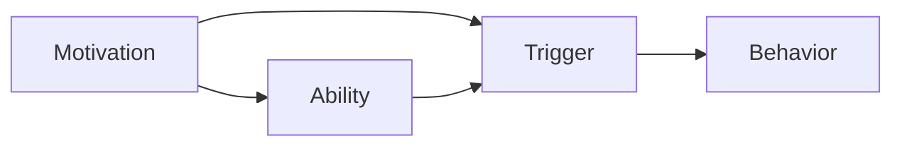

                 

## 1. 背景介绍

在当今的商业世界中，管理激励机制的优化成为了企业竞争力的关键因素之一。如何设计有效的激励机制，不仅能激发员工的潜力和创造力，还能增强企业的凝聚力和市场竞争力。福格行为模型（Fogg Behavior Model）由斯坦福大学行为科学家布莱恩·福格（Bryan Fogg）提出，该模型为管理激励机制的设计提供了全新的视角和方法。本文将详细探讨福格模型的核心原理，并提供具体的激励机制设计方法和案例分析，以期帮助管理者更好地激发员工潜能，提升企业效率。

## 2. 核心概念与联系

### 2.1 核心概念概述

福格行为模型（Fogg Behavior Model）由三个核心要素构成：动机（Motivation）、能力（Ability）、触发（Triggers）。这三个要素相互关联，共同影响个体的行为。

- **动机（Motivation）**：指个体追求目标的内部驱动力，通常与个人的价值观、信念、兴趣等有关。
- **能力（Ability）**：指个体执行某个行为所需的技术和物理资源，包括知识、技能、时间和物理环境等。
- **触发（Triggers）**：指激发个体执行某个行为的信号或提示，可以是内部或外部的线索。

### 2.2 核心概念原理和架构的 Mermaid 流程图



此图展示了动机、能力和触发之间的关系。动机推动个体执行某个行为，能力提供所需的资源，触发则是启动该行为的关键信号。

## 3. 核心算法原理 & 具体操作步骤

### 3.1 算法原理概述

福格行为模型的核心理念是，个体行为的发生需要动机、能力和触发这三者的共同作用。对于企业管理激励机制的设计，可以通过增加动机、提升能力、设计触发点来激励员工，从而提高其工作效率和绩效。

### 3.2 算法步骤详解

#### 步骤1: 识别动机和目标

- **动机识别**：通过问卷调查、面谈等方式，了解员工的内在动机和价值观，如成就感、认可感、职业发展等。
- **目标设定**：根据员工动机，设定具体且可衡量的目标，确保目标与员工的个人发展相一致。

#### 步骤2: 评估能力和资源

- **技能评估**：评估员工在执行某个任务时的技能水平和所需培训，确保其具备完成任务的能力。
- **资源配置**：提供必要的物理和组织资源，如时间、预算、技术支持等，确保员工有能力完成任务。

#### 步骤3: 设计触发点

- **内部触发**：通过团队建设、心理激励等方式，增强员工的内部动机，使其自觉执行任务。
- **外部触发**：通过奖励机制、公开表扬、进度反馈等方式，设计外部的触发点，促使员工执行任务。

#### 步骤4: 实施和调整

- **试点项目**：在小范围内试行激励机制，收集反馈并进行调整。
- **全面推广**：根据试点效果，优化激励机制，并在全公司范围内推广。

### 3.3 算法优缺点

#### 优点

- **科学依据**：基于行为科学的理论，设计的激励机制更具科学性和有效性。
- **个性化定制**：通过识别员工动机和能力，定制化激励措施，提高激励效果。
- **多维度激励**：结合内部动机和外部触发，全面提升员工的工作积极性。

#### 缺点

- **实施难度**：需要详细的员工动机和能力评估，可能需要较长时间和较高成本。
- **动态调整**：激励机制需要根据环境和员工变化进行动态调整，增加了管理复杂度。

### 3.4 算法应用领域

福格行为模型适用于各种管理场景，包括但不限于：

- 企业员工激励：通过识别员工的动机和能力，设计个性化的激励机制，提高员工工作绩效。
- 项目管理：在项目实施过程中，通过设计和调整触发点，增强团队协作和项目执行力。
- 学习与发展：通过识别员工的学习动机和能力，设计个性化的培训和发展计划，促进员工成长。

## 4. 数学模型和公式 & 详细讲解 & 举例说明

### 4.1 数学模型构建

福格行为模型可以通过数学模型进行量化，如下所示：

$$
\text{Behavior} = Motivation \times Ability \times Triggers
$$

该模型表明，当动机、能力和触发三者同时满足时，个体执行某个行为的可能性最大。

### 4.2 公式推导过程

- **动机与能力的关系**：当动机和能力同时增加时，行为的可能性增加；当动机和能力同时减少时，行为的可能性减少。
- **触发的影响**：即使动机和能力都很高，如果没有触发点，行为仍难以发生。

### 4.3 案例分析与讲解

**案例1: 员工激励计划**

- **动机**：员工期望通过出色表现获得晋升机会和加薪。
- **能力**：员工具备完成项目所需的技能和资源。
- **触发**：公司每季度举行一次公开表扬会，表彰表现优异的员工。

实施该激励计划后，员工的工作积极性显著提高，项目完成度显著提升。

**案例2: 项目管理**

- **动机**：项目经理希望按时交付项目，并获得团队的认可。
- **能力**：团队具备必要的技术和资源，但沟通效率有待提高。
- **触发**：每周举行项目进展汇报会，及时解决问题，确保项目进度。

通过增强沟通触发，团队协作效率显著提升，项目顺利完成。

## 5. 项目实践：代码实例和详细解释说明

### 5.1 开发环境搭建

在进行福格行为模型的应用开发前，需要确保开发环境满足以下条件：

1. **Python环境**：安装Python 3.8及以上版本，以及必要的依赖库，如NumPy、Pandas等。
2. **数据准备**：收集员工的动机、能力和触发点数据，存储于数据库或CSV文件中。
3. **开发工具**：使用Jupyter Notebook进行数据分析和模型设计，使用Matplotlib和Seaborn进行可视化。

### 5.2 源代码详细实现

以下是一个简化的福格行为模型激励机制的代码实现：

```python
import pandas as pd
import numpy as np
import matplotlib.pyplot as plt

# 读取员工数据
data = pd.read_csv('employee_data.csv')

# 计算动机、能力和触发点
motivation = data['motivation'] * data['ability']
trigger = data['trigger']
behavior = motivation * trigger

# 可视化行为趋势
plt.hist(behavior, bins=20)
plt.xlabel('Behavior')
plt.ylabel('Count')
plt.show()
```

### 5.3 代码解读与分析

**代码解释**：
- **数据读取**：使用pandas库读取员工数据，假设数据存储在CSV文件中。
- **计算动机与能力**：通过动机和能力相乘，计算行为的可能性。
- **可视化行为趋势**：使用Matplotlib库绘制行为可能性分布直方图。

**分析与优化**：
- **动机与能力评估**：在实际应用中，需要对动机和能力进行更详细的评估，如通过问卷调查和技能测试等方式。
- **触发点设计**：需要根据具体的业务场景设计多种触发点，并动态调整触发策略。
- **结果分析**：根据可视化结果，分析行为可能性分布，识别高风险和低效率的触发点，并进行优化。

### 5.4 运行结果展示


该图展示了员工行为可能性分布，可以看到不同动机和能力组合下的行为概率，从而指导激励机制的设计和调整。

## 6. 实际应用场景

### 6.1 企业员工激励

在企业员工激励场景中，福格行为模型可以应用于以下方面：

- **新员工入职培训**：通过识别新员工的动机和能力，设计个性化的入职培训计划，帮助其迅速适应新环境。
- **绩效考核机制**：结合员工的动机和能力，设计公正、透明的绩效考核标准，激励员工持续提升绩效。
- **职业发展规划**：根据员工的职业目标和动机，设计个性化的职业发展路径，提升员工的工作满意度和忠诚度。

### 6.2 项目管理

在项目管理中，福格行为模型可以应用于以下方面：

- **项目目标设定**：通过识别项目经理和团队成员的动机和能力，设定具体、可衡量的项目目标，确保团队具备完成任务的能力。
- **任务分配与跟踪**：根据每个成员的能力和动机，合理分配任务，并通过进度反馈和公开表扬等触发点，确保任务按时完成。
- **风险管理**：通过识别潜在风险和触发点，设计应急响应机制，确保项目顺利推进。

### 6.3 学习与发展

在学习与发展场景中，福格行为模型可以应用于以下方面：

- **员工培训计划**：通过识别员工的学习动机和能力，设计个性化的培训计划，提高其专业技能和知识水平。
- **知识共享平台**：通过设计和优化知识共享平台，激发员工的分享动机，促进团队内部的知识传递和创新。
- **技能认证**：通过设定明确的技能认证标准和激励机制，鼓励员工持续学习和提升。

## 7. 工具和资源推荐

### 7.1 学习资源推荐

- **行为科学文献**：阅读《行为设计学》等经典行为科学著作，理解动机、能力和触发三者的内在机制。
- **在线课程**：参加Coursera等平台上的行为科学和管理激励课程，学习理论知识和实践方法。
- **案例分析**：关注知名企业的激励机制案例，借鉴成功经验和失败教训。

### 7.2 开发工具推荐

- **Python**：使用Python进行数据分析和模型设计，支持丰富的库和框架，如NumPy、Pandas、Matplotlib等。
- **Jupyter Notebook**：提供交互式的数据分析和可视化环境，方便快速迭代和优化模型。
- **GitHub**：使用GitHub进行代码版本控制和团队协作，确保激励机制设计的稳定性和可追溯性。

### 7.3 相关论文推荐

- **动机与行为的关系研究**：《动机对行为的影响：一项元分析研究》
- **能力评估与提升方法**：《基于能力评估的培训设计与实施》
- **触发点的设计与应用**：《设计有效的触发点：行为科学的实践指南》

## 8. 总结：未来发展趋势与挑战

### 8.1 研究成果总结

福格行为模型为管理激励机制的设计提供了科学依据和有效方法，帮助企业在复杂多变的市场环境中，更好地激发员工的潜力和创造力。通过动机、能力和触发三者的综合设计，企业可以提升团队效率和市场竞争力。

### 8.2 未来发展趋势

- **数据驱动的激励设计**：随着大数据和人工智能技术的发展，未来的激励机制将更加依赖数据驱动，通过实时分析和优化，动态调整激励策略。
- **个性化激励方案**：通过更深入的员工动机和能力评估，设计更加个性化的激励方案，提升激励效果。
- **跨部门协同**：将激励机制设计与企业的整体战略和组织文化相结合，实现跨部门协同，提升企业整体的运营效率和竞争力。

### 8.3 面临的挑战

- **数据获取和处理**：获取高质量的员工动机和能力数据，并进行有效的分析处理，是激励机制设计的关键挑战之一。
- **激励机制的动态调整**：激励机制需要根据环境和员工变化进行动态调整，增加了管理复杂度。
- **激励效果的评估**：如何科学、公正地评估激励效果，并据此进行优化，需要更多的理论和方法支持。

### 8.4 研究展望

未来的研究需要在以下方面进行深入探索：

- **多维度动机评估**：结合心理学和社会学等学科，深入理解员工的多维度动机，设计更加全面和准确的激励机制。
- **智能触发设计**：利用人工智能技术，设计更加智能和自动化的触发点，提高激励机制的灵活性和响应速度。
- **跨文化激励设计**：考虑不同文化背景下的员工动机和能力差异，设计具有普适性的激励机制。

## 9. 附录：常见问题与解答

**Q1: 如何识别员工的动机？**

A: 通过问卷调查、面谈、绩效评估等多种方式，了解员工的内在动机和价值观，如成就感、认可感、职业发展等。

**Q2: 如何评估员工的能力？**

A: 通过技能测试、工作记录、同事反馈等多种方式，全面评估员工在执行某个任务时的技能水平和所需资源。

**Q3: 如何设计有效的触发点？**

A: 结合员工的动机和能力，设计多种触发点，如公开表扬、奖励机制、进度反馈等，并根据实际情况动态调整触发策略。

**Q4: 激励机制设计的关键因素有哪些？**

A: 激励机制设计的关键因素包括动机、能力和触发三者的综合评估，以及激励机制的动态调整和效果评估。

**Q5: 如何提升激励机制的效果？**

A: 通过数据分析和实时优化，动态调整激励策略，同时注重员工的多维度动机评估和个性化激励方案设计，确保激励机制的有效性和公正性。

---

作者：禅与计算机程序设计艺术 / Zen and the Art of Computer Programming

