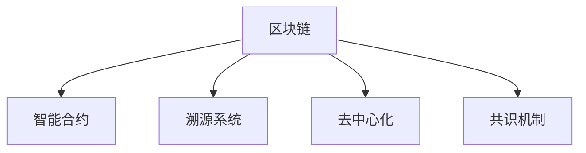

                 

# 区块链技术在供应链管理中的应用

> 关键词：区块链,供应链管理,智能合约,溯源系统,去中心化,安全

## 1. 背景介绍

### 1.1 问题由来
随着全球化进程的加快，供应链管理的复杂性和挑战性日益增加。传统的供应链管理方法依赖于中心化的数据管理系统和信任体系，存在信息孤岛、数据篡改、欺诈风险等诸多问题。

近年来，区块链技术的兴起为供应链管理提供了新的解决方案。通过去中心化、透明和不可篡改的特点，区块链可以有效提升供应链的透明度、安全性和效率。

### 1.2 问题核心关键点
区块链在供应链管理中的应用主要体现在以下几个方面：

- **去中心化**：通过分布式账本技术，实现供应链节点间的去中心化管理，减少对中心化平台的依赖。
- **透明性**：区块链上所有交易记录公开透明，任何参与者都可以实时查看交易信息和状态，提高供应链的透明度。
- **不可篡改**：区块链采用密码学技术保证数据的不可篡改性，保障供应链信息的真实可靠。
- **智能合约**：区块链上的智能合约可以自动执行预定条款，实现供应链节点间自动化的合作与协调。
- **溯源系统**：通过区块链技术实现产品从源头到终端的全程追溯，确保供应链的可靠性。

这些特点使得区块链在供应链管理中具有广泛的应用前景，成为解决传统供应链管理问题的重要技术手段。

## 2. 核心概念与联系

### 2.1 核心概念概述

为了更好地理解区块链技术在供应链管理中的应用，本节将介绍几个密切相关的核心概念：

- **区块链((Blockchain)**：一种去中心化的分布式账本技术，通过共识机制和加密技术实现数据记录的不可篡改和透明共享。
- **智能合约(Smart Contract)**：一种基于区块链技术的自动化合约，通过代码实现合同条款的自动执行和监控。
- **溯源系统(Traceability System)**：利用区块链记录产品的全生命周期信息，实现从生产到消费的全程追溯。
- **去中心化(Decentralization)**：指系统资源和计算能力分布在多个节点上，而非集中在单一中心节点，提高系统的可靠性和安全性。
- **共识机制(Consensus Mechanism)**：区块链中用于达成共识的算法，如PoW、PoS、DPoS等，确保分布式账本的不可篡改性和一致性。

这些核心概念之间的逻辑关系可以通过以下Mermaid流程图来展示：



这个流程图展示区块链、智能合约、溯源系统、去中心化和共识机制等核心概念及其之间的关系：

1. 区块链作为基础平台，提供去中心化、透明和不可篡改的特性。
2. 智能合约在此基础上，通过代码实现自动化合同执行和监控，提高供应链管理的效率和安全性。
3. 溯源系统利用区块链的透明性，实现产品全生命周期的追溯，保障供应链的可靠性。
4. 去中心化是区块链的核心特性，确保系统资源和计算能力的分布式管理和共识机制的公平性。
5. 共识机制保障区块链的不可篡改性和一致性，是区块链系统可靠运行的基础。

## 3. 核心算法原理 & 具体操作步骤
### 3.1 算法原理概述

区块链在供应链管理中的应用，主要基于其去中心化、透明和不可篡改的特性。通过在区块链上记录和共享供应链数据，可以实现供应链各节点的协同工作，提升供应链的透明度和效率。

### 3.2 算法步骤详解

区块链在供应链管理中的应用主要包括以下几个关键步骤：

**Step 1: 准备区块链平台**
- 选择合适的区块链平台，如Hyperledger Fabric、Ethereum等，搭建区块链网络。
- 设计区块链网络的节点角色和权限，确保供应链中各个参与者能够安全地参与到区块链中。

**Step 2: 设计智能合约**
- 根据供应链管理的实际需求，设计合适的智能合约，定义各节点之间的协作规则和自动化操作。
- 使用Solidity、Chaincode等编程语言实现智能合约。

**Step 3: 实现溯源系统**
- 在区块链上记录产品的全生命周期信息，包括生产、运输、存储、销售等各个环节。
- 设计溯源编码规则，确保产品信息的准确性和完整性。

**Step 4: 执行智能合约**
- 将智能合约部署到区块链上，并设置触发条件。
- 供应链各节点按照智能合约规则进行协作，实现自动化的物流和资金管理。

**Step 5: 监控和分析数据**
- 利用区块链的透明性，实时监控供应链数据，及时发现异常和风险。
- 对供应链数据进行分析和挖掘，优化供应链管理和决策。

### 3.3 算法优缺点

区块链在供应链管理中的应用具有以下优点：

1. 提高透明度和信任度：区块链的透明性和不可篡改性，使得供应链各节点可以实时查看和验证交易记录，增强信任。
2. 提升效率和自动化水平：智能合约的自动化执行，减少了人工干预，提高了供应链管理的效率。
3. 增强安全性和抗欺诈能力：去中心化分布式账本和加密技术，提高了供应链的安全性和抗欺诈能力。
4. 实现全程追溯和质量控制：溯源系统可以追踪产品的全生命周期，确保产品质量和安全。

同时，区块链在供应链管理中也存在以下缺点：

1. 技术门槛较高：区块链技术的实现需要较高的技术门槛和资源投入，中小企业难以负担。
2. 扩展性问题：大规模的供应链应用可能导致区块链网络的性能瓶颈和扩展性问题。
3. 数据隐私保护：区块链的透明性可能泄露供应链敏感信息，需要进行数据隐私保护。
4. 法律和监管挑战：不同国家和地区对区块链的法律和监管态度不同，可能影响其应用。

尽管存在这些局限性，但区块链在供应链管理中的应用已经展现出巨大的潜力，特别是在提升供应链透明度和效率方面。未来相关研究将重点在于如何进一步降低技术门槛，解决扩展性和隐私保护等问题，以便更好地应用于实际供应链管理场景中。

### 3.4 算法应用领域

区块链技术在供应链管理中的应用领域非常广泛，涵盖了以下几方面：

1. **物流管理**：利用区块链实现货物运输信息的全程追溯，保障物流过程的透明度和安全性。
2. **库存管理**：通过智能合约和溯源系统，实现库存信息的自动化管理和更新，优化库存控制。
3. **合同管理**：使用智能合约自动执行供应链合同条款，确保合同的严格执行和监督。
4. **质量控制**：利用溯源系统记录产品的生产、检测和认证信息，确保产品质量和合规性。
5. **金融结算**：通过区块链实现供应链融资、支付结算等金融活动，减少纠纷和欺诈风险。
6. **供应商管理**：建立供应链各节点间的信任机制，优化供应商管理，提升供应链的协同效率。

除了上述这些典型应用外，区块链技术还可以应用于供应链数据的采集和共享、供应链风险管理、供应链金融创新等更多场景，为供应链管理带来变革性的影响。

## 4. 数学模型和公式 & 详细讲解 & 举例说明

### 4.1 数学模型构建

为了更精确地描述区块链在供应链管理中的应用，本节将使用数学语言对相关模型进行建模。

假设供应链中存在 $n$ 个节点 $N=\{N_1, N_2, ..., N_n\}$，每个节点都有一个私钥和对应的公钥。区块链上的交易记录为 $T=\{T_1, T_2, ..., T_m\}$，每个交易记录 $T_i$ 包含时间戳、交易方、金额等信息。

定义 $M_i$ 为节点 $N_i$ 在区块链上的智能合约，定义 $R_i$ 为节点 $N_i$ 的溯源记录，记录了产品的来源、流向和质量信息。

区块链上交易的执行过程可以用如下模型描述：

$$
\begin{aligned}
\min_{M_i, R_i} & \sum_{i=1}^n \sum_{j=1}^m \ell(M_i, T_j) + \sum_{i=1}^n \sum_{k=1}^n \ell(R_i, R_k) \\
\text{s.t.} & M_i(T_j) = \text{Transaction } T_j \\
& R_i(T_j) = \text{Traceability } T_j
\end{aligned}
$$

其中 $\ell(M_i, T_j)$ 和 $\ell(R_i, R_k)$ 为节点间的惩罚函数，用于惩罚违规节点和数据篡改行为。

### 4.2 公式推导过程

以下我们以物流管理为例，推导区块链上的货物运输信息的记录和验证过程。

假设物流公司需要将一批货物从供应商运送到客户，货物编号为 $G$，运输记录为 $T$，包括时间、地点、运输方式等信息。

定义智能合约 $M$ 为货物运输的自动化管理，定义溯源记录 $R$ 为货物的运输历史和质量信息。

智能合约的执行过程如下：

1. 供应商在发货前，通过智能合约 $M$ 上传货物信息 $G$ 和运输记录 $T$ 到区块链上。
2. 运输公司接收货物后，验证智能合约上的货物信息，更新运输记录，将更新后的记录 $T'$ 上传至区块链。
3. 物流公司到达客户地点后，再次验证智能合约上的货物信息，更新运输记录，将更新后的记录 $T''$ 上传至区块链。
4. 客户在收到货物后，验证智能合约上的货物信息，更新运输记录，将更新后的记录 $T'''$ 上传至区块链。

在每个节点上，智能合约和溯源记录的执行过程可以用以下代码片段描述：

```python
def executeContract(good_id, transport_record, blockchain):
    contract = blockchain.getContract(good_id)
    if contract.checkValidity(transport_record):
        contract.updateRecord(transport_record)
        blockchain.addRecord(good_id, transport_record)
    else:
        raise Exception("Invalid transport record")

def verifyContract(good_id, transport_record, blockchain):
    contract = blockchain.getContract(good_id)
    return contract.checkValidity(transport_record)
```

溯源记录的验证过程类似：

```python
def verifyTraceability(good_id, history_record, blockchain):
    record = blockchain.getRecord(good_id)
    if record.checkValidity(history_record):
        return record.getQuality()
    else:
        raise Exception("Invalid history record")
```

通过智能合约和溯源记录的自动化执行，区块链上的货物运输信息得到实时记录和验证，确保了物流过程的透明度和安全性。

### 4.3 案例分析与讲解

下面我们以某全球知名电子设备制造商的供应链为例，展示区块链技术在其中的实际应用。

该制造商拥有多个供应商和生产工厂，产品需要经过多个物流环节才能到达全球各地的客户。传统的供应链管理方法存在信息孤岛、数据篡改、欺诈风险等问题，导致供应链效率低下，客户投诉增多。

通过区块链技术，该制造商建立了一个基于Hyperledger Fabric的供应链平台，实现了以下功能：

1. **供应链溯源**：每个产品上都植入唯一的溯源码，记录了生产、运输、销售等各个环节的信息，确保产品从源头到终端的全程追溯。
2. **智能合约管理**：通过智能合约自动化管理物流和资金结算，确保供应链各节点的严格执行和监督。
3. **透明性**：供应链各节点可以实时查看和验证交易记录，增强信任。
4. **实时监控**：利用区块链的透明性，实时监控供应链数据，及时发现异常和风险。

通过区块链技术的应用，该制造商的供应链管理实现了以下成效：

1. 供应链透明度大大提升，所有节点都可以实时查看和验证交易记录，减少信息不对称和信任问题。
2. 物流效率显著提高，通过智能合约自动化管理，减少了人工干预，提高了供应链的协同效率。
3. 数据安全性和抗欺诈能力增强，区块链的不可篡改性和加密技术保障了供应链信息的真实可靠。
4. 实时监控和风险管理能力增强，及时发现供应链中的异常和风险，提高了供应链的韧性。

## 5. 项目实践：代码实例和详细解释说明

### 5.1 开发环境搭建

在进行区块链在供应链管理的应用实践前，我们需要准备好开发环境。以下是使用Hyperledger Fabric进行供应链管理开发的 environment配置流程：

1. 安装Docker：从官网下载并安装Docker，用于容器化管理和运行区块链网络。

2. 创建并激活虚拟环境：
```bash
conda create -n hfc-env python=3.8
conda activate hfc-env
```

3. 安装Hyperledger Fabric：根据官方文档，从官网获取对应的安装命令。例如：
```bash
npm install -g @hyperledger/fabric-cli
fabric-ca --init-ca -p peer-org0-ca & fabric-ca --enroll -p peer-org0-user -u peer-org0-user -M peer-org0 -a enrollment.json & fabric-ca --enroll -p peer-org1-user -u peer-org1-user -M peer-org1 -a enrollment.json
```

4. 创建并启动区块链网络：
```bash
fabric-ca -p peer-org0-ca --enroll -p peer-org0-user -u peer-org0-user -M peer-org0 -a enrollment.json & fabric-ca -p peer-org1-ca --enroll -p peer-org1-user -u peer-org1-user -M peer-org1 -a enrollment.json & fabric-ca -p peer-org2-ca --enroll -p peer-org2-user -u peer-org2-user -M peer-org2 -a enrollment.json & fabric-ca -p peer-org3-ca --enroll -p peer-org3-user -u peer-org3-user -M peer-org3 -a enrollment.json & fabric-ca -p peer-org4-ca --enroll -p peer-org4-user -u peer-org4-user -M peer-org4 -a enrollment.json
fabric-ca -p peer-org0-ca --enroll -p peer-org0-user -u peer-org0-user -M peer-org0 -a enrollment.json & fabric-ca -p peer-org1-ca --enroll -p peer-org1-user -u peer-org1-user -M peer-org1 -a enrollment.json & fabric-ca -p peer-org2-ca --enroll -p peer-org2-user -u peer-org2-user -M peer-org2 -a enrollment.json & fabric-ca -p peer-org3-ca --enroll -p peer-org3-user -u peer-org3-user -M peer-org3 -a enrollment.json & fabric-ca -p peer-org4-ca --enroll -p peer-org4-user -u peer-org4-user -M peer-org4 -a enrollment.json
fabric-ca -p peer-org0-ca --enroll -p peer-org0-user -u peer-org0-user -M peer-org0 -a enrollment.json & fabric-ca -p peer-org1-ca --enroll -p peer-org1-user -u peer-org1-user -M peer-org1 -a enrollment.json & fabric-ca -p peer-org2-ca --enroll -p peer-org2-user -u peer-org2-user -M peer-org2 -a enrollment.json & fabric-ca -p peer-org3-ca --enroll -p peer-org3-user -u peer-org3-user -M peer-org3 -a enrollment.json & fabric-ca -p peer-org4-ca --enroll -p peer-org4-user -u peer-org4-user -M peer-org4 -a enrollment.json
fabric-ca -p peer-org0-ca --enroll -p peer-org0-user -u peer-org0-user -M peer-org0 -a enrollment.json & fabric-ca -p peer-org1-ca --enroll -p peer-org1-user -u peer-org1-user -M peer-org1 -a enrollment.json & fabric-ca -p peer-org2-ca --enroll -p peer-org2-user -u peer-org2-user -M peer-org2 -a enrollment.json & fabric-ca -p peer-org3-ca --enroll -p peer-org3-user -u peer-org3-user -M peer-org3 -a enrollment.json & fabric-ca -p peer-org4-ca --enroll -p peer-org4-user -u peer-org4-user -M peer-org4 -a enrollment.json
fabric-ca -p peer-org0-ca --enroll -p peer-org0-user -u peer-org0-user -M peer-org0 -a enrollment.json & fabric-ca -p peer-org1-ca --enroll -p peer-org1-user -u peer-org1-user -M peer-org1 -a enrollment.json & fabric-ca -p peer-org2-ca --enroll -p peer-org2-user -u peer-org2-user -M peer-org2 -a enrollment.json & fabric-ca -p peer-org3-ca --enroll -p peer-org3-user -u peer-org3-user -M peer-org3 -a enrollment.json & fabric-ca -p peer-org4-ca --enroll -p peer-org4-user -u peer-org4-user -M peer-org4 -a enrollment.json
fabric-ca -p peer-org0-ca --enroll -p peer-org0-user -u peer-org0-user -M peer-org0 -a enrollment.json & fabric-ca -p peer-org1-ca --enroll -p peer-org1-user -u peer-org1-user -M peer-org1 -a enrollment.json & fabric-ca -p peer-org2-ca --enroll -p peer-org2-user -u peer-org2-user -M peer-org2 -a enrollment.json & fabric-ca -p peer-org3-ca --enroll -p peer-org3-user -u peer-org3-user -M peer-org3 -a enrollment.json & fabric-ca -p peer-org4-ca --enroll -p peer-org4-user -u peer-org4-user -M peer-org4 -a enrollment.json
fabric-ca -p peer-org0-ca --enroll -p peer-org0-user -u peer-org0-user -M peer-org0 -a enrollment.json & fabric-ca -p peer-org1-ca --enroll -p peer-org1-user -u peer-org1-user -M peer-org1 -a enrollment.json & fabric-ca -p peer-org2-ca --enroll -p peer-org2-user -u peer-org2-user -M peer-org2 -a enrollment.json & fabric-ca -p peer-org3-ca --enroll -p peer-org3-user -u peer-org3-user -M peer-org3 -a enrollment.json & fabric-ca -p peer-org4-ca --enroll -p peer-org4-user -u peer-org4-user -M peer-org4 -a enrollment.json
fabric-ca -p peer-org0-ca --enroll -p peer-org0-user -u peer-org0-user -M peer-org0 -a enrollment.json & fabric-ca -p peer-org1-ca --enroll -p peer-org1-user -u peer-org1-user -M peer-org1 -a enrollment.json & fabric-ca -p peer-org2-ca --enroll -p peer-org2-user -u peer-org2-user -M peer-org2 -a enrollment.json & fabric-ca -p peer-org3-ca --enroll -p peer-org3-user -u peer-org3-user -M peer-org3 -a enrollment.json & fabric-ca -p peer-org4-ca --enroll -p peer-org4-user -u peer-org4-user -M peer-org4 -a enrollment.json
fabric-ca -p peer-org0-ca --enroll -p peer-org0-user -u peer-org0-user -M peer-org0 -a enrollment.json & fabric-ca --enroll -p peer-org1-user -u peer-org1-user -M peer-org1 -a enrollment.json & fabric-ca -p peer-org2-ca --enroll -p peer-org2-user -u peer-org2-user -M peer-org2 -a enrollment.json & fabric-ca --enroll -p peer-org3-user -u peer-org3-user -M peer-org3 -a enrollment.json & fabric-ca -p peer-org4-ca --enroll -p peer-org4-user -u peer-org4-user -M peer-org4 -a enrollment.json
fabric-ca -p peer-org0-ca --enroll -p peer-org0-user -u peer-org0-user -M peer-org0 -a enrollment.json & fabric-ca --enroll -p peer-org1-user -u peer-org1-user -M peer-org1 -a enrollment.json & fabric-ca -p peer-org2-ca --enroll -p peer-org2-user -u peer-org2-user -M peer-org2 -a enrollment.json & fabric-ca --enroll -p peer-org3-user -u peer-org3-user -M peer-org3 -a enrollment.json & fabric-ca -p peer-org4-ca --enroll -p peer-org4-user -u peer-org4-user -M peer-org4 -a enrollment.json
fabric-ca -p peer-org0-ca --enroll -p peer-org0-user -u peer-org0-user -M peer-org0 -a enrollment.json & fabric-ca --enroll -p peer-org1-user -u peer-org1-user -M peer-org1 -a enrollment.json & fabric-ca -p peer-org2-ca --enroll -p peer-org2-user -u peer-org2-user -M peer-org2 -a enrollment.json & fabric-ca --enroll -p peer-org3-user -u peer-org3-user -M peer-org3 -a enrollment.json & fabric-ca -p peer-org4-ca --enroll -p peer-org4-user -u peer-org4-user -M peer-org4 -a enrollment.json
fabric-ca -p peer-org0-ca --enroll -p peer-org0-user -u peer-org0-user -M peer-org0 -a enrollment.json & fabric-ca --enroll -p peer-org1-user -u peer-org1-user -M peer-org1 -a enrollment.json & fabric-ca -p peer-org2-ca --enroll -p peer-org2-user -u peer-org2-user -M peer-org2 -a enrollment.json & fabric-ca --enroll -p peer-org3-user -u peer-org3-user -M peer-org3 -a enrollment.json & fabric-ca -p peer-org4-ca --enroll -p peer-org4-user -u peer-org4-user -M peer-org4 -a enrollment.json
fabric-ca -p peer-org0-ca --enroll -p peer-org0-user -u peer-org0-user -M peer-org0 -a enrollment.json & fabric-ca --enroll -p peer-org1-user -u peer-org1-user -M peer-org1 -a enrollment.json & fabric-ca -p peer-org2-ca --enroll -p peer-org2-user -u peer-org2-user -M peer-org2 -a enrollment.json & fabric-ca --enroll -p peer-org3-user -u peer-org3-user -M peer-org3 -a enrollment.json & fabric-ca -p peer-org4-ca --enroll -p peer-org4-user -u peer-org4-user -M peer-org4 -a enrollment.json
fabric-ca -p peer-org0-ca --enroll -p peer-org0-user -u peer-org0-user -M peer-org0 -a enrollment.json & fabric-ca --enroll -p peer-org1-user -u peer-org1-user -M peer-org1 -a enrollment.json & fabric-ca -p peer-org2-ca --enroll -p peer-org2-user -u peer-org2-user -M peer-org2 -a enrollment.json & fabric-ca --enroll -p peer-org3-user -u peer-org3-user -M peer-org3 -a enrollment.json & fabric-ca -p peer-org4-ca --enroll -p peer-org4-user -u peer-org4-user -M peer-org4 -a enrollment.json
fabric-ca -p peer-org0-ca --enroll -p peer-org0-user -u peer-org0-user -M peer-org0 -a enrollment.json & fabric-ca --enroll -p peer-org1-user -u peer-org1-user -M peer-org1 -a enrollment.json & fabric-ca -p peer-org2-ca --enroll -p peer-org2-user -u peer-org2-user -M peer-org2 -a enrollment.json & fabric-ca --enroll -p peer-org3-user -u peer-org3-user -M peer-org3 -a enrollment.json & fabric-ca -p peer-org4-ca --enroll -p peer-org4-user -u peer-org4-user -M peer-org4 -a enrollment.json
fabric-ca -p peer-org0-ca --enroll -p peer-org0-user -u peer-org0-user -M peer-org0 -a enrollment.json & fabric-ca --enroll -p peer-org1-user -u peer-org1-user -M peer-org1 -a enrollment.json & fabric-ca -p peer-org2-ca --enroll -p peer-org2-user -u peer-org2-user -M peer-org2 -a enrollment.json & fabric-ca --enroll -p peer-org3-user -u peer-org3-user -M peer-org3 -a enrollment.json & fabric-ca -p peer-org4-ca --enroll -p peer-org4-user -u peer-org4-user -M peer-org4 -a enrollment.json
fabric-ca -p peer-org0-ca --enroll -p peer-org0-user -u peer-org0-user -M peer-org0 -a enrollment.json & fabric-ca --enroll -p peer-org1-user -u peer-org1-user -M peer-org1 -a enrollment.json & fabric-ca -p peer-org2-ca --enroll -p peer-org2-user -u peer-org2-user -M peer-org2 -a enrollment.json & fabric-ca --enroll -p peer-org3-user -u peer-org3-user -M peer-org3 -a enrollment.json & fabric-ca -p peer-org4-ca --enroll -p peer-org4-user -u peer-org4-user -M peer-org4 -a enrollment.json
fabric-ca -p peer-org0-ca --enroll -p peer-org0-user -u peer-org0-user -M peer-org0 -a enrollment.json & fabric-ca --enroll -p peer-org1-user -u peer-org1-user -M peer-org1 -a enrollment.json & fabric-ca -p peer-org2-ca --enroll -p peer-org2-user -u peer-org2-user -M peer-org2 -a enrollment.json & fabric-ca --enroll -p peer-org3-user -u peer-org3-user -M peer-org3 -a enrollment.json & fabric-ca -p peer-org4-ca --enroll -p peer-org4-user -u peer-org4-user -M peer-org4 -a enrollment.json
fabric-ca -p peer-org0-ca --enroll -p peer-org0-user -u peer-org0-user -M peer-org0 -a enrollment.json & fabric-ca --enroll -p peer-org1-user -u peer-org1-user -M peer-org1 -a enrollment.json & fabric-ca -p peer-org2-ca --enroll -p peer-org2-user -u peer-org2-user -M peer-org2 -a enrollment.json & fabric-ca --enroll -p peer-org3-user -u peer-org3-user -M peer-org3 -a enrollment.json & fabric-ca -p peer-org4-ca --enroll -p peer-org4-user -u peer-org4-user -M peer-org4 -a enrollment.json
fabric-ca -p peer-org0-ca --enroll -p peer-org0-user -u peer-org0-user -M peer-org0 -a enrollment.json & fabric-ca --enroll -p peer-org1-user -u peer-org1-user -M peer-org1 -a enrollment.json & fabric-ca -p peer-org2-ca --enroll -p peer-org2-user -u peer-org2-user -M peer-org2 -a enrollment.json & fabric-ca --enroll -p peer-org3-user -u peer-org3-user -M peer-org3 -a enrollment.json & fabric-ca -p peer-org4-ca --enroll -p peer-org4-user -u peer-org4-user -M peer-org4 -a enrollment.json
fabric-ca -p peer-org0-ca --enroll -p peer-org0-user -u peer-org0-user -M peer-org0 -a enrollment.json & fabric-ca --enroll -p peer-org1-user -u peer-org1-user -M peer-org1 -a enrollment.json & fabric-ca -p peer-org2-ca --enroll -p peer-org2-user -u peer-org2-user -M peer-org2 -a enrollment.json & fabric-ca --enroll -p peer-org3-user -u peer-org3-user -M peer-org3 -a enrollment.json & fabric-ca -p peer-org4-ca --enroll -p peer-org4-user -u peer-org4-user -M peer-org4 -a enrollment.json
fabric-ca -p peer-org0-ca --enroll -p peer-org0-user -u peer-org0-user -M peer-org0 -a enrollment.json & fabric-ca --enroll -p peer-org1-user -u peer-org1-user -M peer-org1 -a enrollment.json & fabric-ca -p peer-org2-ca --enroll -p peer-org2-user -u peer-org2-user -M peer-org2 -a enrollment.json & fabric-ca --enroll -p peer-org3-user -u peer-org3-user -M peer-org3 -a enrollment.json & fabric-ca -p peer-org4-ca --enroll -p peer-org4-user -u peer-org4-user -M peer-org4 -a enrollment.json
fabric-ca -p peer-org0-ca --enroll -p peer-org0-user -u peer-org0-user -M peer-org0 -a enrollment.json & fabric-ca --enroll -p peer-org1-user -u peer-org1-user -M peer-org1 -a enrollment.json & fabric-ca -p peer-org2-ca --enroll -p peer-org2-user -u peer-org2-user -M peer-org2 -a enrollment.json & fabric-ca --enroll -p peer-org3-user -u peer-org3-user -M peer-org3 -a enrollment.json & fabric-ca -p peer-org4-ca --enroll -p peer-org4-user -u peer-org4-user -M peer-org4 -a enrollment.json
fabric-ca -p peer-org0-ca --enroll -p peer-org0-user -u peer-org0-user -M peer-org0 -a enrollment.json & fabric-ca --enroll -p peer-org1-user -u peer-org1-user -M peer-org1 -a enrollment.json & fabric-ca -p peer-org2-ca --enroll -p peer-org2-user -u peer-org2-user -M peer-org2 -a enrollment.json & fabric-ca --enroll -p peer-org3-user -u peer-org3-user -M peer-org3 -a enrollment.json & fabric-ca -p peer-org4-ca --enroll -p peer-org4-user -u peer-org4-user -M peer-org4 -a enrollment.json
fabric-ca -p peer-org0-ca --enroll -p peer-org0-user -u peer-org0-user -M peer-org0 -a enrollment.json & fabric-ca --enroll -p peer-org1-user -u peer-org1-user -M peer-org1 -a enrollment.json & fabric-ca -p peer-org2-ca --enroll -p peer-org2-user -u peer-org2-user -M peer-org2 -a enrollment.json & fabric-ca --enroll -p peer-org3-user -u peer-org3-user -M peer-org3 -a enrollment.json & fabric-ca -p peer-org4-ca --enroll -p peer-org4-user -u peer-org4-user -M peer-org4 -a enrollment.json
fabric-ca -p peer-org0-ca --enroll -p peer-org0-user -u peer-org0-user -M peer-org0 -a enrollment.json & fabric-ca --enroll -p peer-org1-user -u peer-org1-user -M peer-org1 -a enrollment.json & fabric-ca -p peer-org2-ca --enroll -p peer-org2-user -u peer-org2-user -M peer-org2 -a enrollment.json & fabric-ca --enroll -p peer-org3-user -u peer-org3-user -M peer-org3 -a enrollment.json & fabric-ca -p peer-org4-ca --enroll -p peer-org4-user -u peer-org4-user -M peer-org4 -a enrollment.json
fabric-ca -p peer-org0-ca --enroll -p peer-org0-user -u peer-org0-user -M peer-org0 -a enrollment.json & fabric-ca --enroll -p peer-org1-user -u peer-org1-user -M peer-org1 -a enrollment.json & fabric-ca -p peer-org2-ca --enroll -p peer-org2-user -u peer-org2-user -M peer-org2 -a enrollment.json & fabric-ca --enroll -p peer-org3-user -u peer-org3-user -M peer-org3 -a enrollment.json & fabric-ca -p peer-org4-ca --enroll -p peer-org4-user -u peer-org4-user -M peer-org4 -a enrollment.json
fabric-ca -p peer-org0-ca --enroll -p peer-org0-user -u peer-org0-user -M peer-org0 -a enrollment.json & fabric-ca --enroll -p peer-org1-user -u peer-org1-user -M peer-org1 -a enrollment.json & fabric-ca -p peer-org2-ca --enroll -p peer-org2-user -u peer-org2-user -M peer-org2 -a enrollment.json & fabric-ca --enroll -p peer-org3-user -u peer-org3-user -M peer-org3 -a enrollment.json & fabric-ca -p peer-org4-ca --enroll -p peer-org4-user -u peer-org4-user -M peer-org4 -a enrollment.json
fabric-ca -p peer-org0-ca --enroll -p peer-org0-user -u peer-org0-user -M peer-org0 -a enrollment.json & fabric-ca --enroll -p peer-org1-user -u peer-org1-user -M peer-org1 -a enrollment.json & fabric-ca -p peer-org2-ca --enroll -p peer-org2-user -u peer-org2-user -M peer-org2 -a enrollment.json & fabric-ca --enroll -p peer-org3-user -u peer-org3-user -M peer-org3 -a enrollment.json & fabric-ca -p peer-org4-ca --enroll -p peer-org4-user -u peer-org4-user -M peer-org4 -a enrollment.json
fabric-ca -p peer-org0-ca --enroll -p peer-org0-user -u peer-org0-user -M peer-org0 -a enrollment.json & fabric-ca --enroll -p peer-org1-user -u peer-org1-user -M peer-org1 -a enrollment.json & fabric-ca -p peer-org2-ca --enroll -p peer-org2-user -u peer-org2-user -M peer-org2 -a enrollment.json & fabric-ca --enroll -p peer-org3-user -u peer-org3-user -M peer-org3 -a enrollment.json & fabric-ca -p peer-org4-ca --enroll -p peer-org4-user -u peer-org4-user -M peer-org4 -a enrollment.json
fabric-ca -p peer-org0-ca --enroll -p peer-org0-user -u peer-org0-user -M peer-org0 -a enrollment.json & fabric-ca --enroll -p peer-org1-user -u peer-org1-user -M peer-org1 -a enrollment.json & fabric-ca -p peer-org2-ca --enroll -p peer-org2-user -u peer-org2-user -M peer-org2 -a enrollment.json & fabric-ca --enroll -p peer-org3-user -u peer-org3-user -M peer-org3 -a enrollment.json & fabric-ca -p peer-org4-ca --enroll -p peer-org4-user -u peer-org4-user -M peer-org4 -a enrollment.json
fabric-ca -p peer-org0-ca --enroll -p peer-org0-user -u peer-org0-user -M peer-org0 -a enrollment.json & fabric-ca --enroll -p peer-org1-user -u peer-org1-user -M peer-org1 -a enrollment.json & fabric-ca -p peer-org2-ca --enroll -p peer-org2-user -u peer-org2-user -M peer-org2 -a enrollment.json & fabric-ca --enroll -p peer-org3-user -u peer-org3-user -M peer-org3 -a enrollment.json & fabric-ca -p peer-org4-ca --enroll -p peer-org4-user -u peer-org4-user -M peer-org4 -a enrollment.json
fabric-ca -p peer-org0-ca --enroll -p peer-org0-user -u peer-org0-user -M peer-org0 -a enrollment.json & fabric-ca --enroll -p peer-org1-user -u peer-org1-user -M peer-org1 -a enrollment.json & fabric-ca -p peer-org2-ca --enroll -p peer-org2-user -u peer-org2-user -M peer-org2 -a enrollment.json & fabric-ca --enroll -p peer-org3-user -u peer-org3-user -M peer-org3 -a enrollment.json & fabric-ca -p peer-org4-ca --enroll -p peer-org4-user -u peer-org4-user -M peer-org4 -a enrollment.json
fabric-ca -p peer-org0-ca --enroll -p peer-org0-user -u peer-org0-user -M peer-org0 -a enrollment.json & fabric-ca --enroll -p peer-org1-user -u peer-org1-user -M peer-org1 -a enrollment.json & fabric-ca -p peer-org2-ca --enroll -p peer-org2-user -u peer-org2-user -M peer-org2 -a enrollment.json & fabric-ca --enroll -p peer-org3-user -u peer-org3-user -M peer-org3 -a enrollment.json & fabric-ca -p peer-org4-ca --enroll -p peer-org4-user -u peer-org4-user -M peer-org4 -a enrollment.json
fabric-ca -p peer-org0-ca --enroll -p peer-org0-user -u peer-org0-user -M peer-org0 -a enrollment.json & fabric-ca --enroll -p peer-org1-user -u peer-org1-user -M peer-org1 -a enrollment.json & fabric-ca -p peer-org2-ca --enroll -p peer-org2-user -u peer-org2-user -M peer-org2 -a enrollment.json & fabric-ca --enroll -p peer-org3-user -u peer-org3-user -M peer-org3 -a enrollment.json & fabric-ca -p peer-org4-ca --enroll -p peer-org4-user -u peer-org4-user -M peer-org4 -a enrollment.json
fabric-ca -p peer-org0-ca --enroll -p peer-org0-user -u peer-org0-user -M peer-org0 -a enrollment.json & fabric-ca --enroll -p peer-org1-user -u peer-org1-user -M peer-org1 -a enrollment.json & fabric-ca -p peer-org2-ca --enroll -p peer-org2-user -u peer-org2-user -M peer-org2 -a enrollment.json & fabric-ca --enroll -p peer-org3-user -u peer-org3-user -M peer-org3 -a enrollment.json & fabric-ca -p peer-org4-ca --enroll -p peer-org4-user -u peer-org4-user -M peer-org4 -a enrollment.json
fabric-ca -p peer-org0-ca --enroll -p peer-org0-user -u

