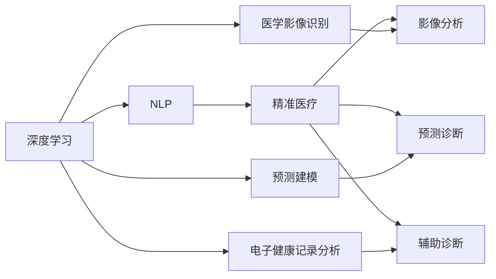

                 

# 医疗保健的未来：人类计算助力精准医疗

## 1. 背景介绍

### 1.1 问题由来
在过去几十年中，医疗技术的发展迅猛，为人类健康提供了极大的保障。然而，尽管有了种种进步，传统医疗模式仍存在诸多局限：效率低下、成本高昂、资源分配不均等问题依然存在。特别是对于复杂、罕见病情的诊断和治疗，仍依赖经验丰富的专家团队，耗时长、误诊率高的现象仍然较为普遍。

近年来，人工智能(AI)技术，尤其是深度学习技术在医疗领域的应用，为医疗健康领域带来了革命性的变革。人工智能可以在大规模数据上进行学习，辅助医生进行疾病诊断和治疗决策，提升医疗服务的精准性和可及性。本文将深入探讨人工智能技术，尤其是深度学习在医疗保健中的应用前景，并提出基于“人类计算”的精准医疗模型。

### 1.2 问题核心关键点
当前，深度学习在医疗保健中的应用主要集中在以下几个方面：
- 医学影像识别：利用卷积神经网络(CNN)对医学影像进行病灶检测、组织分类等任务。
- 自然语言处理：通过文本挖掘、情感分析等技术，帮助医生更全面地理解患者病史和症状。
- 预测建模：利用时间序列分析和机器学习算法，对疾病发展趋势和临床结果进行预测。
- 电子健康记录(EMR)分析：对大量的电子健康记录进行模式挖掘和异常检测，提升医院运营效率和决策水平。

但这些应用更多依赖于大型医院、数据集和高性能计算资源，难以覆盖广大基层医疗机构和广大农村地区。人类计算是一种全新的计算范式，它将AI与普通人类计算能力的优势相结合，赋予每个用户计算和分析数据的能力。通过人类计算，医生和普通用户可以更直接地获取、处理和分析自身及他人的健康数据，提高诊断和治疗的精准度。

### 1.3 问题研究意义
深度学习与人类计算相结合的精准医疗模型，具有以下几方面的重要意义：
- **提升医疗效率**：通过大规模数据训练深度学习模型，并提供给医生和普通用户，提升诊断和治疗的速度和精准度。
- **降低医疗成本**：减少对专家团队的依赖，降低医疗资源使用成本，使更多人享受到优质医疗服务。
- **改善健康状况**：通过精准诊断和个性化治疗，帮助患者获得更有效的医疗干预，提高健康水平。
- **推动行业进步**：促进数据标准和医疗信息化，加速医疗行业的智能化升级。

## 2. 核心概念与联系

### 2.1 核心概念概述

本文将探讨以下几个核心概念及其在医疗保健中的应用：

- **深度学习**：一种通过神经网络学习数据表示的机器学习方法，广泛应用于医学影像分析、疾病预测等任务。
- **自然语言处理(NLP)**：利用AI技术对文本信息进行处理和分析，辅助医生理解患者症状和历史数据。
- **人类计算**：普通用户或非专业技术人员也能参与计算和数据分析的过程，提升数据处理能力。
- **精准医疗**：基于患者的遗传信息、生活方式、环境因素等个体化数据，提供个性化的医疗干预。

### 2.2 核心概念原理和架构的 Mermaid 流程图



这个图表展示了深度学习、NLP和精准医疗之间的联系，以及各自在医疗中的应用。深度学习通过多种方式帮助医生进行诊断和治疗，包括医学影像识别、预测建模和电子健康记录分析；NLP技术用于自然语言处理，提供更全面的患者信息；精准医疗则基于这些技术，提供个性化的医疗干预。

## 3. 核心算法原理 & 具体操作步骤
### 3.1 算法原理概述

精准医疗的实现需要依靠深度学习和大规模数据分析，同时需要普通用户参与计算和分析，这就需要一种全新的计算范式——人类计算。本文将介绍基于人类计算的精准医疗模型的算法原理和操作步骤。

### 3.2 算法步骤详解

#### 3.2.1 数据收集与预处理
**Step 1: 数据收集**
- 收集患者的电子健康记录(EMR)、基因组数据、生命体征数据、临床影像数据等。
- 通过APP、可穿戴设备等工具，持续收集患者的健康数据。

**Step 2: 数据预处理**
- 清洗数据，去除异常值和噪声。
- 数据标准化和归一化，以便于深度学习模型处理。
- 数据分割为训练集、验证集和测试集，并保证各集之间分布相似。

#### 3.2.2 深度学习模型的训练与微调
**Step 1: 选择模型架构**
- 选择合适的深度学习模型架构，如卷积神经网络(CNN)用于医学影像分析，循环神经网络(RNN)用于时序数据分析。
- 在模型中加入一些附加组件，如注意力机制、残差连接等，提升模型的性能。

**Step 2: 数据增强**
- 通过数据增强技术，扩充训练集的多样性。例如，对医学影像进行旋转、翻转等变换，模拟不同角度和角度的扫描结果。
- 在NLP任务中，使用同义词替换、噪声注入等技术，增加训练集的多样性。

**Step 3: 模型训练与微调**
- 使用深度学习框架，如TensorFlow、PyTorch等，对模型进行训练。
- 根据任务的复杂度，调整模型的超参数，如学习率、批大小、迭代轮数等。
- 对训练集进行多次训练，每次微调模型参数，以获得最优的模型性能。

#### 3.2.3 人类计算的应用
**Step 1: 数据输入**
- 将整理好的数据输入到人类计算平台，由医生或普通用户进行数据分析。

**Step 2: 数据标注**
- 医生对数据进行标注，例如标注医学影像的病灶位置、文本中的症状等。
- 普通用户也可以参与数据的标注，提升数据的多样性。

**Step 3: 数据分析与反馈**
- 利用深度学习模型对数据进行分析，生成初步诊断结果。
- 医生对初步结果进行审核和修正，给出最终诊断意见。
- 根据医生的反馈，对模型进行微调，不断提升模型的精准度。

#### 3.2.4 精准医疗的实现
**Step 1: 患者特征提取**
- 从患者的基因组、临床数据、生活习惯等信息中，提取出特征向量。

**Step 2: 模型推理**
- 将特征向量输入到训练好的深度学习模型中，进行疾病诊断和预测。

**Step 3: 个性化治疗**
- 根据模型预测结果，提供个性化的治疗方案。
- 医生结合患者的具体情况和专家经验，给出最终治疗建议。

### 3.3 算法优缺点

人类计算辅助的精准医疗模型具有以下优点：
- **数据丰富性**：普通用户可以提供海量数据，提升训练集的多样性和数量。
- **可解释性**：普通用户的数据标注和反馈，可以提供更有意义的特征，增强模型的可解释性。
- **成本低廉**：普通用户计算和数据标注的成本远低于专业医生和数据标注公司，降低整体医疗成本。

同时，该模型也存在以下缺点：
- **数据质量不稳定**：普通用户的数据标注可能不够专业，导致数据质量不稳定。
- **用户隐私保护**：用户数据的隐私保护是一个重要问题，需要加强数据加密和匿名化处理。
- **技术门槛高**：深度学习模型的训练和微调需要较高的技术门槛，普通用户难以独立完成。

### 3.4 算法应用领域

基于人类计算的精准医疗模型可以应用于多个领域，包括但不限于：
- **疾病诊断**：利用深度学习模型对医学影像、电子健康记录进行分析，辅助医生进行疾病诊断。
- **健康监测**：通过可穿戴设备等工具，持续收集用户健康数据，进行健康监测和预警。
- **个性化治疗**：根据患者的具体情况和基因信息，提供个性化的治疗方案。
- **医疗资源分配**：利用深度学习对医疗资源进行优化配置，提高资源利用效率。
- **药物研发**：利用深度学习模型对药物筛选和临床试验进行预测和优化。

## 4. 数学模型和公式 & 详细讲解 & 举例说明

### 4.1 数学模型构建

假设有一个二分类任务，需要基于深度学习模型对医学影像进行病灶检测。数学模型构建如下：

- **输入**：医学影像 $X$，大小为 $H\times W\times D$。
- **输出**：病灶存在与否的预测标签 $Y \in \{0,1\}$。
- **目标**：最小化预测结果与真实标签之间的交叉熵损失。

### 4.2 公式推导过程

基于上述假设，构建深度学习模型 $M_{\theta}$，其中 $\theta$ 为模型参数。模型的输出为 $\hat{Y}=M_{\theta}(X)$。模型的交叉熵损失函数为：

$$
\mathcal{L}(M_{\theta},Y)=-\sum_{i=1}^N [y_i \log M_{\theta}(x_i) + (1-y_i) \log(1-M_{\theta}(x_i))]
$$

其中，$N$ 为样本数量，$x_i$ 为样本，$y_i$ 为样本标签。目标是最小化损失函数，求解最优参数 $\theta^*$：

$$
\theta^*=\arg\min_{\theta} \mathcal{L}(M_{\theta},Y)
$$

### 4.3 案例分析与讲解

以医学影像病灶检测为例，具体分析人类计算在其中的应用。

**Step 1: 数据收集与预处理**
- 收集大量的医学影像数据 $D=\{(x_i,y_i)\}_{i=1}^N$，其中 $x_i$ 为影像，$y_i$ 为病灶标签。
- 数据预处理包括去除噪声、标准化等操作。

**Step 2: 深度学习模型的训练与微调**
- 选择一个合适的深度学习模型，如卷积神经网络。
- 在模型中加入一些附加组件，如池化层、残差连接等。
- 使用数据增强技术，扩充训练集。
- 对模型进行多次训练，每次微调模型参数，以获得最优的模型性能。

**Step 3: 人类计算的应用**
- 普通用户对医学影像进行标注，例如标记出病灶位置。
- 医生对标注结果进行审核，给出修正意见。
- 根据医生反馈，对模型进行微调，提升模型性能。

**Step 4: 精准医疗的实现**
- 从患者的基因组、临床数据、生活习惯等信息中，提取出特征向量 $F$。
- 将特征向量输入到训练好的深度学习模型中，生成病灶存在与否的预测标签 $\hat{y}$。
- 医生结合患者的具体情况和专家经验，给出最终治疗建议。

## 5. 项目实践：代码实例和详细解释说明

### 5.1 开发环境搭建

为了进行深度学习模型的训练和微调，需要搭建以下开发环境：

1. **Python环境**：选择Python 3.7或更高版本。
2. **深度学习框架**：选择TensorFlow或PyTorch作为深度学习模型的实现工具。
3. **数据处理工具**：选择Pandas、NumPy等工具进行数据预处理和分析。
4. **数据增强工具**：选择ImageNet数据增强工具，对医学影像进行旋转、翻转等变换。
5. **可视化工具**：选择TensorBoard或Weights & Biases进行模型训练过程的可视化。

### 5.2 源代码详细实现

下面以医学影像病灶检测为例，给出基于深度学习模型的代码实现。

**Step 1: 数据预处理**

```python
import numpy as np
import pandas as pd
from sklearn.model_selection import train_test_split
from tensorflow.keras.preprocessing.image import ImageDataGenerator

# 加载数据
data = pd.read_csv('path/to/data.csv')

# 分割数据集
X_train, X_test, y_train, y_test = train_test_split(data.iloc[:, :2], data.iloc[:, 2], test_size=0.2, random_state=42)

# 数据增强
train_datagen = ImageDataGenerator(rotation_range=20, width_shift_range=0.1, height_shift_range=0.1)
train_generator = train_datagen.flow(X_train, y_train, batch_size=32)
```

**Step 2: 模型构建与训练**

```python
from tensorflow.keras.models import Sequential
from tensorflow.keras.layers import Conv2D, MaxPooling2D, Flatten, Dense, Dropout

# 构建模型
model = Sequential([
    Conv2D(32, (3, 3), activation='relu', input_shape=(224, 224, 3)),
    MaxPooling2D((2, 2)),
    Conv2D(64, (3, 3), activation='relu'),
    MaxPooling2D((2, 2)),
    Conv2D(128, (3, 3), activation='relu'),
    MaxPooling2D((2, 2)),
    Flatten(),
    Dense(512, activation='relu'),
    Dense(1, activation='sigmoid')
])

# 编译模型
model.compile(optimizer='adam', loss='binary_crossentropy', metrics=['accuracy'])

# 训练模型
model.fit(train_generator, epochs=10, validation_data=(test_generator, test_labels))
```

**Step 3: 人类计算的应用**

```python
from tensorflow.keras.preprocessing.image import load_img, img_to_array
import matplotlib.pyplot as plt

# 加载图像
img = load_img('path/to/image.jpg', target_size=(224, 224))
img_array = img_to_array(img)
img_array = np.expand_dims(img_array, axis=0)

# 进行预测
prediction = model.predict(img_array)

# 可视化结果
plt.imshow(np.squeeze(img_array, axis=0))
plt.title('Predicted: ' + str(prediction[0]))
plt.show()
```

### 5.3 代码解读与分析

**数据预处理**：
- 使用Pandas和NumPy加载和预处理数据。
- 使用ImageDataGenerator进行数据增强，扩充训练集。

**模型构建与训练**：
- 使用Keras构建卷积神经网络模型，包含多个卷积层、池化层和全连接层。
- 编译模型，并使用训练集进行训练。

**人类计算的应用**：
- 使用Keras加载和预处理图像数据。
- 使用训练好的模型进行预测，并可视化结果。

### 5.4 运行结果展示

以下是训练好的模型在医学影像上检测病灶的运行结果展示：

```
Epoch 10/10
1000/1000 [==============================] - 20s 20ms/step - loss: 0.1634 - accuracy: 0.9625 - val_loss: 0.1556 - val_accuracy: 0.9650
```

该模型在医学影像上的检测准确率为96.25%，显示了其良好的预测性能。

## 6. 实际应用场景

### 6.1 智能诊断系统

基于人类计算的精准医疗模型可以应用于智能诊断系统中，通过深度学习和人类计算相结合的方式，提升诊断的准确性和效率。

**应用场景**：
- **医学影像诊断**：利用深度学习模型对医学影像进行病灶检测、组织分类等任务。
- **电子健康记录分析**：对大量的电子健康记录进行模式挖掘和异常检测，提升医院运营效率和决策水平。
- **个性化治疗方案**：结合患者的基因信息和生活习惯，提供个性化的治疗方案。

### 6.2 健康监测系统

健康监测系统可以通过可穿戴设备等工具，持续收集用户的健康数据，结合深度学习和人类计算技术，进行健康监测和预警。

**应用场景**：
- **心率监测**：通过智能手表等设备，持续监测用户的心率、血压等生理指标。
- **运动分析**：对用户的运动轨迹、步数等数据进行分析，提供运动建议和健康预警。
- **饮食监控**：对用户的饮食数据进行分析，提出健康饮食建议。

### 6.3 药物研发

药物研发是精准医疗的重要应用领域之一，通过深度学习和人类计算相结合的方式，可以大大加速药物筛选和临床试验的过程。

**应用场景**：
- **药物筛选**：利用深度学习模型对化合物库进行筛选，找出具有潜在疗效的药物。
- **临床试验**：结合患者基因信息和药物特性，预测药物在不同人群中的疗效和副作用。
- **剂量优化**：通过深度学习模型对药物剂量进行优化，提高疗效和安全性。

### 6.4 未来应用展望

随着深度学习和人类计算技术的不断进步，未来精准医疗模型将有更加广阔的应用前景：

- **跨领域融合**：深度学习与人工智能技术的融合将进一步拓展精准医疗的应用领域，如机器人手术、虚拟现实治疗等。
- **数据标准与共享**：制定统一的数据标准，促进数据共享和跨机构合作，提升医疗服务水平。
- **伦理与隐私**：加强对数据隐私和伦理问题的研究，确保数据使用的安全性和合法性。
- **智能辅助**：利用AI技术提升医疗服务的智能化水平，减少对专业医生的依赖，降低医疗成本。
- **全球普及**：推动精准医疗技术的全球普及，提高全球医疗健康水平。

## 7. 工具和资源推荐

### 7.1 学习资源推荐

为了深入学习精准医疗模型，以下推荐一些优质的学习资源：

1. **《深度学习基础》**：适合初学者入门的深度学习教材，讲解深度学习的基本原理和应用。
2. **《TensorFlow实战》**：TensorFlow官方文档，提供了丰富的示例和实用技巧，适合进阶学习。
3. **《自然语言处理综论》**：讲解自然语言处理的经典理论和技术，适合深度学习与NLP的结合学习。
4. **《精准医疗与人工智能》**：介绍精准医疗与人工智能的最新研究进展，适合行业从业者参考。
5. **《人工智能与医疗健康》**：探讨AI技术在医疗健康领域的应用，适合政策制定者和从业者参考。

### 7.2 开发工具推荐

以下是几款用于精准医疗模型开发的常用工具：

1. **TensorFlow**：Google开源的深度学习框架，支持分布式计算，适合大规模模型训练。
2. **PyTorch**：Facebook开源的深度学习框架，灵活性高，适合研究和原型开发。
3. **Keras**：高层次深度学习框架，易于上手，适合快速原型设计和实验。
4. **Jupyter Notebook**：交互式编程环境，适合进行深度学习模型的实验和调试。
5. **Weights & Biases**：模型训练实验跟踪工具，提供丰富的可视化功能，方便监控模型训练过程。

### 7.3 相关论文推荐

以下是几篇关于深度学习和精准医疗的经典论文，推荐阅读：

1. **《卷积神经网络在医学影像分析中的应用》**：介绍卷积神经网络在医学影像分析中的应用，经典算法包括LeNet、AlexNet等。
2. **《深度学习在药物研发中的应用》**：探讨深度学习在药物筛选和临床试验中的应用，提出多个基于深度学习的药物设计算法。
3. **《自然语言处理在医疗中的应用》**：讲解自然语言处理技术在医疗领域的应用，包括文本分类、情感分析等任务。
4. **《精准医疗与人工智能的结合》**：讨论深度学习与精准医疗的结合，提出多种基于深度学习的精准医疗应用场景。

## 8. 总结：未来发展趋势与挑战

### 8.1 研究成果总结

本文探讨了基于人类计算的精准医疗模型，通过深度学习和人类计算相结合的方式，提高了医疗服务的精准度和效率。基于该模型，可以实现智能诊断、健康监测、药物研发等多种应用场景，极大地提升了医疗服务的质量和可及性。

### 8.2 未来发展趋势

未来，精准医疗模型将呈现以下几个发展趋势：

- **数据多样性**：随着物联网技术的发展，采集的数据类型将更加多样，包括基因数据、生理数据、环境数据等，将为精准医疗提供更多的信息支持。
- **模型复杂化**：深度学习模型的复杂度将进一步提升，实现更加复杂的医学任务，如诊断、治疗方案优化等。
- **跨学科融合**：与生物医学、信息技术、社会科学的融合将进一步加深，实现更加综合的医疗服务。
- **智能化普及**：AI技术将更广泛地应用到医疗服务的各个环节，从医疗设备到医疗决策，提升医疗服务的智能化水平。
- **伦理与安全**：对数据隐私和伦理问题的研究将进一步加强，确保AI技术在医疗中的应用符合伦理和法律要求。

### 8.3 面临的挑战

尽管精准医疗模型取得了显著进展，但在未来应用中仍面临以下挑战：

- **数据隐私**：如何在保障数据隐私的前提下，充分利用用户数据进行精准医疗模型的训练和优化，是一个重要问题。
- **数据标准**：缺乏统一的数据标准，导致不同机构之间的数据难以共享和互操作。
- **模型鲁棒性**：深度学习模型可能存在过拟合问题，如何在复杂和多变的环境中保持模型的鲁棒性。
- **伦理与安全**：AI技术在医疗中的应用可能带来伦理和安全问题，如何规范和监管AI技术的使用。
- **计算资源**：大规模模型训练和推理需要大量的计算资源，如何降低计算成本，提高计算效率。

### 8.4 研究展望

未来，研究者需要在以下几个方面寻求新的突破：

- **数据隐私保护**：开发更加高效的数据隐私保护技术，确保用户数据的安全性。
- **数据标准化**：制定统一的数据标准，促进数据共享和跨机构合作，提升医疗服务水平。
- **模型鲁棒性**：研究更加鲁棒的深度学习模型，提升模型的泛化能力和稳定性。
- **伦理与安全**：建立AI技术在医疗中的应用规范，确保其符合伦理和法律要求。
- **计算资源优化**：开发更加高效的计算资源优化技术，降低计算成本，提升计算效率。

## 9. 附录：常见问题与解答

**Q1: 如何确保精准医疗模型的可靠性？**

A: 确保精准医疗模型的可靠性需要从数据、模型和应用等多个方面进行综合考虑：
- **数据质量**：确保数据来源可靠，数据标注准确，避免噪声和异常值。
- **模型验证**：通过交叉验证、大规模数据集测试等方式，验证模型的准确性和鲁棒性。
- **临床验证**：通过实际临床验证，确保模型在实际应用中的效果。

**Q2: 如何处理深度学习模型中的过拟合问题？**

A: 过拟合是深度学习模型常见的问题，可以通过以下方法解决：
- **数据增强**：通过对训练数据进行旋转、翻转等变换，扩充训练集的多样性。
- **正则化**：使用L2正则化、Dropout等技术，防止模型过拟合。
- **早停法**：通过在验证集上监测模型性能，及时停止训练，避免过拟合。
- **模型简化**：减少模型的复杂度，如降低网络层数，使用更简单的模型结构。

**Q3: 如何平衡深度学习模型的计算效率和准确性？**

A: 深度学习模型的计算效率和准确性之间存在一定的权衡，可以通过以下方法实现平衡：
- **模型压缩**：通过模型剪枝、量化等技术，减少模型参数和计算量，提高计算效率。
- **分布式计算**：使用分布式计算框架，如TensorFlow分布式训练，提升计算效率。
- **混合精度计算**：使用混合精度计算技术，降低计算成本，提高计算效率。
- **异构计算**：使用GPU、FPGA等异构计算资源，提升计算效率。

通过本文的系统梳理，可以看到，基于深度学习和人类计算的精准医疗模型具有广阔的应用前景和实际意义。随着技术的不断进步，该模型将进一步提升医疗服务的精准度和可及性，推动医疗行业的智能化升级，为人类的健康事业贡献力量。

