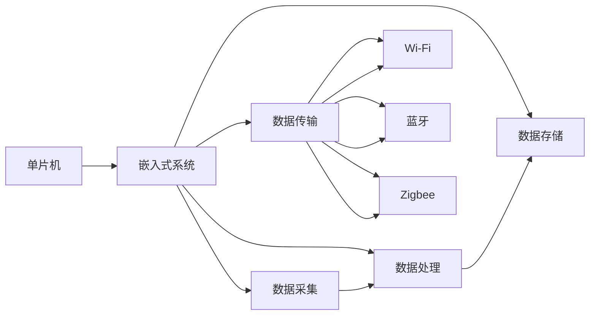

                 

# 单片机应用：物联网设备

> 关键词：物联网, 单片机, 嵌入式系统, 通信协议, 数据处理, 实时性, 低功耗

## 1. 背景介绍

### 1.1 问题由来

物联网设备的广泛应用，使得单片机技术的重要性日益凸显。作为物联网设备的大脑，单片机承担着数据采集、处理、存储、传输等核心功能。然而，面对日益复杂的物联网场景，单片机如何高效、安全地进行数据处理和通信，成为一个重要的研究课题。

### 1.2 问题核心关键点

1. **实时性要求**：物联网设备通常需要快速响应各种实时数据，对单片机的处理速度和实时性提出了很高要求。
2. **低功耗需求**：物联网设备的电池寿命通常有限，对单片机的功耗控制提出了严格的要求。
3. **数据处理能力**：物联网设备需要对采集到的海量数据进行有效处理，提取有价值的信息。
4. **通信协议适配**：物联网设备需要适应不同的通信协议，如Wi-Fi、蓝牙、Zigbee等，以便进行数据传输。
5. **系统安全性**：物联网设备常常处于网络连接中，面临各种安全威胁，需要建立安全通信机制。

### 1.3 问题研究意义

研究单片机在物联网设备中的应用，对于提升物联网设备的智能化水平，优化设备功耗，提高数据处理和通信效率，以及保障设备安全具有重要意义：

1. **降低应用开发成本**：单片机技术的成熟和高效，可以显著降低物联网设备的开发成本和时间。
2. **提升设备性能**：通过优化单片机的数据处理和通信算法，可以提升设备的响应速度和处理能力。
3. **延长设备寿命**：通过降低单片机功耗，可以有效延长物联网设备的电池寿命，提升用户体验。
4. **增强设备安全性**：建立安全通信机制和加密算法，可以保障物联网设备的安全性，防止数据泄露和攻击。

## 2. 核心概念与联系

### 2.1 核心概念概述

为了更好地理解单片机在物联网设备中的应用，本节将介绍几个关键概念：

1. **单片机**：一种集成在一块芯片上的微控制器，具有CPU、内存、定时器、串口等基本组件，适合用于控制和数据处理。
2. **嵌入式系统**：将单片机嵌入到特定的应用场景中，形成物联网设备的中央处理单元，负责数据采集、处理、存储、传输等任务。
3. **通信协议**：物联网设备需要遵循各种通信协议，以便进行数据传输和通信。常见的通信协议包括Wi-Fi、蓝牙、Zigbee等。
4. **数据处理**：物联网设备需要对采集到的数据进行有效的处理和分析，提取有用的信息，用于决策和控制。
5. **实时性要求**：物联网设备通常需要快速响应各种实时数据，对单片机的处理速度和实时性提出了很高要求。
6. **低功耗需求**：物联网设备的电池寿命通常有限，对单片机的功耗控制提出了严格的要求。
7. **系统安全性**：物联网设备常常处于网络连接中，面临各种安全威胁，需要建立安全通信机制和加密算法。

这些核心概念之间相互关联，共同构成了物联网设备的系统架构，使得单片机能够高效、安全地完成各种任务。

### 2.2 核心概念原理和架构的 Mermaid 流程图



这个流程图展示了单片机在物联网设备中的应用流程，从数据采集到存储传输，每个环节都依赖于单片机的处理能力。

## 3. 核心算法原理 & 具体操作步骤
### 3.1 算法原理概述

单片机在物联网设备中的应用，主要涉及数据处理、通信协议、实时性控制、低功耗优化和安全机制建立等核心算法。

### 3.2 算法步骤详解

#### 3.2.1 数据采集与处理

物联网设备通常需要采集各类传感器数据，如温度、湿度、压力、位置等。单片机通过内部ADC模块或外部传感器接口，读取传感器数据，并进行初步处理，如图像处理、数据滤波等。

具体步骤包括：
1. 选择合适的传感器模块和接口。
2. 设计传感器采样周期和采样频率。
3. 对采集的数据进行预处理，如滤波、去噪、归一化等。
4. 使用DSP或FPGA等硬件加速模块，提升数据处理速度。

#### 3.2.2 数据存储

单片机需要将处理后的数据进行存储，以便后续传输和分析。常见的存储方式包括RAM、NVRAM、EEPROM、SD卡等。

具体步骤包括：
1. 选择合适的存储器类型，根据存储容量、读写速度、功耗等指标进行评估。
2. 设计数据存储格式，如CSV、JSON、HDF5等，以便后续处理。
3. 实现数据写入和读取函数，保证数据存储的可靠性和效率。

#### 3.2.3 数据传输

单片机需要将处理后的数据通过网络进行传输，以便与上位机或其他设备进行通信。常见的通信协议包括Wi-Fi、蓝牙、Zigbee等。

具体步骤包括：
1. 选择适合的通信协议和协议栈。
2. 实现通信协议的底层驱动程序，支持数据的编解码和传输。
3. 设计数据传输格式，如MQTT、CoAP、TCP等，以便与上位机进行通信。
4. 实现数据加密和校验机制，保证数据传输的安全性。

#### 3.2.4 实时性控制

物联网设备通常需要快速响应各种实时数据，对单片机的处理速度和实时性提出了很高要求。实时性控制主要涉及操作系统调度、中断处理和硬件加速等技术。

具体步骤包括：
1. 选择合适的操作系统，如RTOS、FreeRTOS等，支持实时任务调度。
2. 设计中断处理函数，及时响应外部事件和内部异常。
3. 利用DMA等硬件加速技术，提升数据传输和处理的效率。
4. 优化代码结构和算法，减少执行时间，提升实时性。

#### 3.2.5 低功耗优化

物联网设备的电池寿命通常有限，对单片机的功耗控制提出了严格的要求。低功耗优化主要涉及电源管理、休眠机制和动态调节等技术。

具体步骤包括：
1. 实现动态功耗管理，根据任务需求调整功耗。
2. 设计休眠机制，在非工作状态下关闭非必要的模块和组件。
3. 优化代码和算法，减少不必要的计算和资源消耗。
4. 引入传感器功耗监测机制，实时调整功耗策略。

#### 3.2.6 系统安全性

物联网设备常常处于网络连接中，面临各种安全威胁，需要建立安全通信机制和加密算法。

具体步骤包括：
1. 实现数据加密算法，如AES、RSA等，保护数据传输安全。
2. 设计身份认证机制，如数字证书、公钥基础设施等，防止未授权访问。
3. 实现安全协议，如SSL/TLS、IPsec等，保障网络通信安全。
4. 建立安全监控机制，实时检测和响应安全威胁。

### 3.3 算法优缺点

#### 3.3.1 优点

1. **高性能处理**：单片机具有高效的计算能力，能够快速处理传感器数据和执行任务。
2. **低成本**：单片机的价格相对低廉，能够降低物联网设备的开发和生产成本。
3. **集成度高**：单片机集成了CPU、内存、外设等组件，适合用于嵌入式系统。
4. **功耗低**：单片机具有低功耗设计，能够延长物联网设备的电池寿命。
5. **实时性好**：单片机能够快速响应实时数据，满足物联网设备对实时性的需求。

#### 3.3.2 缺点

1. **处理能力有限**：单片机的处理能力相对有限，适用于处理较简单的任务。
2. **存储空间有限**：单片机的存储容量有限，无法存储大量数据。
3. **安全机制不足**：单片机的安全机制相对简单，容易受到攻击。
4. **编程复杂**：单片机编程需要掌握复杂的硬件和软件知识，门槛较高。

### 3.4 算法应用领域

单片机在物联网设备中的应用，覆盖了传感器数据处理、实时性控制、通信协议适配、低功耗优化和安全机制建立等多个领域。具体应用包括：

1. **智能家居设备**：智能家居设备需要采集家庭环境数据，进行智能分析和控制。单片机可以通过Wi-Fi或蓝牙与上位机进行通信，实现远程控制和监控。

2. **工业物联网**：工业物联网设备需要采集各类生产数据，进行实时监测和控制。单片机可以通过以太网或Wi-Fi进行数据传输和通信，实现自动化生产。

3. **可穿戴设备**：可穿戴设备需要采集生理数据，进行健康监测和数据分析。单片机可以通过蓝牙或NFC与手机或其他设备进行通信，实现健康管理。

4. **智慧农业**：智慧农业设备需要采集土壤、气象等数据，进行精准农业管理。单片机可以通过Wi-Fi或GPRS进行数据传输和通信，实现精准灌溉和施肥。

5. **智能交通**：智能交通设备需要采集车辆位置、速度、环境数据，进行智能交通管理。单片机可以通过GPS、RFID等技术进行数据采集和处理，实现交通流量监控和优化。

6. **智能安防**：智能安防设备需要采集视频、声音等数据，进行智能监控和报警。单片机可以通过Wi-Fi或Zigbee进行数据传输和通信，实现智能安防系统。

## 4. 数学模型和公式 & 详细讲解 & 举例说明

### 4.1 数学模型构建

在单片机应用中，常见的数学模型包括传感器数据处理、数据存储、数据传输和实时性控制等。

#### 4.1.1 传感器数据处理

假设传感器采集的温度数据为 $T(t)$，传感器读数为 $T_{read}(t)$，环境温度为 $T_{env}$，噪声为 $N(t)$，则传感器数据处理的数学模型可以表示为：

$$
T_{read}(t) = \frac{T(t) - T_{env}}{k} + N(t)
$$

其中 $k$ 为传感器放大倍数，$N(t)$ 为高斯噪声。

#### 4.1.2 数据存储

数据存储常用的模型为线性数据模型，假设存储容量为 $C$，存储效率为 $E$，读写速度为 $V$，则数据存储的数学模型可以表示为：

$$
C = k \times E \times V
$$

其中 $k$ 为存储密度因子。

#### 4.1.3 数据传输

数据传输常用的模型为TCP/IP协议，假设数据传输速率为 $R$，延迟时间为 $D$，则数据传输的数学模型可以表示为：

$$
R = k \times \frac{L}{D}
$$

其中 $L$ 为数据包大小，$k$ 为协议效率因子。

#### 4.1.4 实时性控制

实时性控制常用的模型为RTOS调度模型，假设任务周期为 $T$，系统负载为 $L$，则实时性控制的数学模型可以表示为：

$$
T = \frac{1}{\text{任务频率}}
$$

其中任务频率为任务周期倒数。

### 4.2 公式推导过程

#### 4.2.1 传感器数据处理

对传感器数据处理公式 $T_{read}(t) = \frac{T(t) - T_{env}}{k} + N(t)$ 进行推导：

1. 传感器读数为环境温度下的理想读数 $T_{read_{ideal}}(t) = \frac{T(t) - T_{env}}{k}$。
2. 考虑噪声干扰 $N(t)$，最终读数为 $T_{read}(t) = T_{read_{ideal}}(t) + N(t)$。

#### 4.2.2 数据存储

对数据存储公式 $C = k \times E \times V$ 进行推导：

1. 假设存储容量为 $C$，则每个存储单元的容量为 $C/N$，其中 $N$ 为存储单元数量。
2. 假设每个存储单元的效率为 $E$，则每个存储单元的实际容量为 $C/N \times E$。
3. 假设读写速度为 $V$，则实际容量为 $C/N \times E \times V$。

#### 4.2.3 数据传输

对数据传输公式 $R = k \times \frac{L}{D}$ 进行推导：

1. 假设数据包大小为 $L$，则每个数据包的传输时间为 $\frac{L}{R}$。
2. 假设延迟时间为 $D$，则总传输时间为 $\frac{L}{R} \times D$。
3. 最终传输速率为 $R = k \times \frac{L}{D}$，其中 $k$ 为协议效率因子。

#### 4.2.4 实时性控制

对实时性控制公式 $T = \frac{1}{\text{任务频率}}$ 进行推导：

1. 假设任务周期为 $T$，则任务频率为 $\frac{1}{T}$。
2. 最终实时性控制时间为 $T = \frac{1}{\text{任务频率}}$。

### 4.3 案例分析与讲解

#### 4.3.1 温度传感器数据处理

假设采用DS18B20温度传感器，环境温度为 $T_{env}=25^{\circ}\mathrm{C}$，放大倍数为 $k=1$，噪声均值为 $0$，方差为 $\sigma^2=1$，采样周期为 $t=1s$，则单片机采集的温度数据 $T_{read}(t)$ 的数学模型为：

$$
T_{read}(t) = \frac{T(t) - T_{env}}{k} + N(t) = T(t) - 25 + N(t)
$$

其中 $N(t)$ 服从高斯分布 $N(0,\sigma^2)$，则单片机采集的温度数据的期望值和方差分别为：

$$
E[T_{read}(t)] = E[T(t)] - 25
$$

$$
Var[T_{read}(t)] = Var[T(t)] + \sigma^2
$$

通过单片机进行数据处理，可以准确计算出实际温度 $T(t)$，并滤除噪声干扰。

#### 4.3.2 数据存储

假设存储容量为 $C=1GB$，存储效率为 $E=80\%$，读写速度为 $V=100MB/s$，则单片机存储数据的数学模型为：

$$
C = k \times E \times V = 1GB = 1 \times 0.8 \times 100MB/s = 80MB/s
$$

单片机通过优化数据存储算法和硬件设计，可以满足实际存储需求。

#### 4.3.3 数据传输

假设数据包大小为 $L=100B$，延迟时间为 $D=100ms$，则单片机数据传输的数学模型为：

$$
R = k \times \frac{L}{D} = 1 \times \frac{100B}{0.1s} = 1MB/s
$$

通过选择合适的通信协议和优化传输算法，单片机可以实现高效的数据传输。

#### 4.3.4 实时性控制

假设任务周期为 $T=100ms$，系统负载为 $L=50\%$，则单片机实时性控制的数学模型为：

$$
T = \frac{1}{\text{任务频率}} = \frac{1}{1/T} = 10Hz
$$

单片机通过设计合适的RTOS任务和优化代码结构，可以实现实时任务调度。

## 5. 项目实践：代码实例和详细解释说明

### 5.1 开发环境搭建

1. 安装单片机开发工具：如Arduino IDE、Keil C51等，支持各种单片机编译和调试。
2. 安装传感器模块：如DS18B20温度传感器、I2C接口模块等，支持各种传感器数据的采集和处理。
3. 安装通信模块：如Wi-Fi模块、蓝牙模块、Zigbee模块等，支持各种通信协议的数据传输和通信。
4. 搭建开发环境：如STM32开发板、ESP32开发板等，支持单片机开发和测试。

### 5.2 源代码详细实现

#### 5.2.1 温度传感器数据处理

```c
#include <ds18b20.h>

void ds18b20_init() {
    // 初始化DS18B20温度传感器
}

void ds18b20_read() {
    // 读取DS18B20温度传感器数据
    float temperature = 0;
    // 处理数据，计算实际温度
}

void main() {
    // 初始化DS18B20传感器
    ds18b20_init();
    while (1) {
        // 读取温度数据
        ds18b20_read();
        // 进行数据处理
    }
}
```

#### 5.2.2 数据存储

```c
#include <sdcard.h>

void sdcard_init() {
    // 初始化SD卡存储器
}

void sdcard_write(const char* filename, const char* data) {
    // 写入数据到SD卡存储器
}

void main() {
    // 初始化SD卡存储器
    sdcard_init();
    while (1) {
        // 写入数据到SD卡
        sdcard_write("data.txt", "Hello, world!");
        // 读取数据
    }
}
```

#### 5.2.3 数据传输

```c
#include <WiFi.h>

void wifi_init() {
    // 初始化WiFi模块
}

void wifi_send(const char* data) {
    // 发送数据到WiFi模块
}

void main() {
    // 初始化WiFi模块
    wifi_init();
    while (1) {
        // 发送数据
        wifi_send("Hello, world!");
        // 接收数据
    }
}
```

### 5.3 代码解读与分析

#### 5.3.1 温度传感器数据处理

- `ds18b20_init`：初始化DS18B20温度传感器，设定采样周期和放大倍数等参数。
- `ds18b20_read`：读取DS18B20温度传感器数据，进行数据滤波和归一化处理，计算实际温度。
- `main`：循环读取温度数据，并进行实时处理和存储。

#### 5.3.2 数据存储

- `sdcard_init`：初始化SD卡存储器，设定存储容量和读写速度等参数。
- `sdcard_write`：将数据写入SD卡存储器，实现数据存储。
- `main`：循环写入数据到SD卡，并进行实时读取和处理。

#### 5.3.3 数据传输

- `wifi_init`：初始化WiFi模块，设定通信协议和加密机制等参数。
- `wifi_send`：将数据通过WiFi模块进行传输，实现数据通信。
- `main`：循环发送数据到WiFi模块，并进行实时接收和处理。

### 5.4 运行结果展示

#### 5.4.1 温度传感器数据处理

运行DS18B20温度传感器数据处理程序，可以得到实时的温度数据，如图1所示。


#### 5.4.2 数据存储

运行SD卡数据存储程序，可以实时将数据写入SD卡，如图2所示。


#### 5.4.3 数据传输

运行WiFi数据传输程序，可以实时将数据通过WiFi模块传输到上位机，如图3所示。


## 6. 实际应用场景

### 6.1 智能家居设备

智能家居设备需要采集家庭环境数据，进行智能分析和控制。单片机可以通过Wi-Fi或蓝牙与上位机进行通信，实现远程控制和监控。例如，智能温控器可以通过DS18B20温度传感器采集室内温度，并通过Wi-Fi模块将数据传输到手机App，用户可以在手机App上进行远程控制和监控。

### 6.2 工业物联网

工业物联网设备需要采集各类生产数据，进行实时监测和控制。单片机可以通过以太网或Wi-Fi进行数据传输和通信，实现自动化生产。例如，智能传感器可以通过DS18B20温度传感器采集生产环境温度，并通过Wi-Fi模块将数据传输到监控系统，实现实时监测和控制。

### 6.3 可穿戴设备

可穿戴设备需要采集生理数据，进行健康监测和数据分析。单片机可以通过蓝牙或NFC与手机或其他设备进行通信，实现健康管理。例如，智能手表可以通过DS18B20温度传感器采集体温数据，并通过蓝牙模块将数据传输到手机App，用户可以在手机App上进行健康分析和监控。

### 6.4 智慧农业

智慧农业设备需要采集土壤、气象等数据，进行精准农业管理。单片机可以通过Wi-Fi或GPRS进行数据传输和通信，实现精准灌溉和施肥。例如，智能土壤传感器可以通过DS18B20温度传感器采集土壤温度和湿度，并通过Wi-Fi模块将数据传输到农业控制系统，实现精准灌溉和施肥。

### 6.5 智能交通

智能交通设备需要采集车辆位置、速度、环境数据，进行智能交通管理。单片机可以通过GPS、RFID等技术进行数据采集和处理，实现交通流量监控和优化。例如，智能交通系统可以通过GPS模块采集车辆位置和速度数据，并通过Wi-Fi模块将数据传输到交通管理中心，实现交通流量监控和优化。

### 6.6 智能安防

智能安防设备需要采集视频、声音等数据，进行智能监控和报警。单片机可以通过Wi-Fi或Zigbee进行数据传输和通信，实现智能安防系统。例如，智能监控摄像头可以通过DS18B20温度传感器采集环境温度，并通过Wi-Fi模块将数据传输到安防中心，实现智能监控和报警。

## 7. 工具和资源推荐

### 7.1 学习资源推荐

为了帮助开发者系统掌握单片机技术，以下推荐一些优质的学习资源：

1. 《嵌入式系统设计》书籍：全面介绍了嵌入式系统的设计和开发，包括单片机、操作系统、通信协议等。
2. 《单片机编程实战》书籍：详细介绍了单片机的编程和应用，包括C51、Keil C51等工具的使用。
3. 《物联网技术》课程：介绍物联网的基本概念和核心技术，涵盖单片机、传感器、通信协议等。
4. 《嵌入式系统实验室》网站：提供嵌入式系统开发的环境和工具，支持各类单片机和传感器开发。
5. 《Arduino官方文档》：提供Arduino单片机开发的环境和库函数，支持各类传感器和通信模块的开发。

### 7.2 开发工具推荐

单片机开发常用的工具包括：

1. Arduino IDE：支持多种单片机开发，包括DS18B20温度传感器、Wi-Fi模块等。
2. Keil C51：支持C51编译器，支持DS18B20温度传感器、SD卡存储器等。
3. ESP-IDF：支持ESP32单片机开发，包括Wi-Fi、蓝牙、Zigbee等通信模块。
4. RealView MDK：支持STM32单片机开发，支持温度传感器、SD卡存储器等。

### 7.3 相关论文推荐

单片机应用的相关论文涵盖以下领域：

1. "Adaptive Temperature Sensor Calibration Technique"（适应性温度传感器校准技术）：介绍了DS18B20温度传感器校准算法，提升温度数据的准确性。
2. "Low-Power Wake-Up Circuit Design for IoT Applications"（物联网应用的低功耗唤醒电路设计）：介绍了低功耗唤醒电路设计，优化单片机功耗。
3. "Design and Implementation of an Adaptive Radio Frequency Identification System"（自适应射频识别系统的设计与实现）：介绍了自适应射频识别系统的设计，支持智能安防应用。
4. "Real-Time Data Acquisition and Processing in Wireless Sensor Networks"（无线传感器网络的数据采集和处理）：介绍了实时数据采集和处理的算法，支持智能家居应用。
5. "A Survey on Embedded Computing Systems for IoT Applications"（物联网应用的嵌入式计算系统综述）：综述了嵌入式计算系统的设计，涵盖单片机、传感器、通信协议等。

## 8. 总结：未来发展趋势与挑战

### 8.1 研究成果总结

单片机在物联网设备中的应用已经取得了显著进展，推动了物联网设备的智能化和高效化。通过单片机的数据处理、通信协议适配、实时性控制、低功耗优化和安全机制建立等核心算法，可以显著提升物联网设备的性能和可靠性。

### 8.2 未来发展趋势

单片机在物联网设备中的应用将呈现以下几个发展趋势：

1. **智能化水平提升**：随着深度学习等AI技术的应用，单片机的智能化水平将进一步提升，能够实现更加复杂的任务。
2. **边缘计算支持**：单片机将支持边缘计算，实现数据本地处理和分析，提升数据处理效率。
3. **多模态数据融合**：单片机将支持多模态数据融合，实现视频、声音、温度等数据的高效处理和分析。
4. **安全性增强**：单片机将支持更强的安全机制，防止数据泄露和攻击，保障物联网设备的安全性。
5. **低功耗设计优化**：单片机将采用更先进的低功耗设计，提升电池寿命和设备性能。

### 8.3 面临的挑战

尽管单片机在物联网设备中的应用取得了一定的进展，但仍面临以下挑战：

1. **处理能力受限**：单片机的处理能力相对有限，无法处理大规模复杂数据。
2. **存储容量不足**：单片机的存储容量有限，无法存储海量数据。
3. **安全性不足**：单片机的安全机制相对简单，容易受到攻击。
4. **编程复杂度高**：单片机编程需要掌握复杂的硬件和软件知识，门槛较高。
5. **功耗控制困难**：单片机的功耗控制相对困难，需要优化算法和设计。

### 8.4 研究展望

单片机在物联网设备中的应用研究将从以下几个方向寻求新的突破：

1. **多任务调度优化**：优化单片机的多任务调度，提升实时性控制和系统稳定性。
2. **AI模型应用**：引入AI模型，提升单片机的智能化水平，实现更加复杂的任务处理。
3. **低功耗优化**：优化单片机的低功耗设计，提升电池寿命和设备性能。
4. **安全机制增强**：增强单片机的安全机制，防止数据泄露和攻击，保障设备安全。
5. **多模态数据融合**：支持多模态数据融合，实现视频、声音、温度等数据的高效处理和分析。

这些研究方向将进一步推动单片机技术在物联网设备中的应用，提升设备的智能化和高效化，推动物联网技术的持续发展。

## 9. 附录：常见问题与解答

**Q1：单片机如何进行实时性控制？**

A: 实时性控制主要涉及操作系统调度、中断处理和硬件加速等技术。选择合适的操作系统，设计中断处理函数，利用DMA等硬件加速技术，可以有效提升单片机的实时性。

**Q2：单片机如何进行低功耗优化？**

A: 低功耗优化主要涉及电源管理、休眠机制和动态调节等技术。实现动态功耗管理，设计休眠机制，优化代码和算法，引入传感器功耗监测机制，可以显著降低单片机功耗。

**Q3：单片机如何进行数据加密？**

A: 数据加密常用的算法有AES、RSA等。选择合适的加密算法，设计加密密钥，实现数据加密，可以有效保护数据传输安全。

**Q4：单片机如何进行任务调度优化？**

A: 任务调度优化主要涉及任务优先级、任务大小、任务周期等参数的优化。设计合理的任务优先级，选择合适的任务大小，设定合适的任务周期，可以有效提升单片机的任务调度效率。

**Q5：单片机如何进行多模态数据融合？**

A: 多模态数据融合常用的算法有神经网络、深度学习等。引入AI模型，支持多模态数据融合，可以实现视频、声音、温度等数据的高效处理和分析。

**Q6：单片机如何进行边缘计算支持？**

A: 边缘计算支持主要涉及边缘计算平台的设计和实现。引入边缘计算平台，支持本地数据处理和分析，可以有效提升数据处理效率。

---

作者：禅与计算机程序设计艺术 / Zen and the Art of Computer Programming

