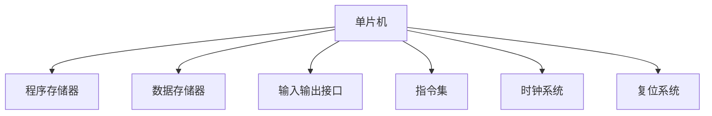

                 

# 单片机编程：嵌入式系统的基石

## 1. 背景介绍

### 1.1 问题由来
单片机是嵌入式系统中最基础、最核心的部分，广泛应用于各种电子设备中。在当前智能硬件普及的趋势下，掌握单片机编程技术成为了各类工程师的必备技能。尽管单片机种类繁多，但大多以8位和16位为主流，在嵌入式领域有着广泛的应用。因此，深入了解单片机编程，对于理解嵌入式系统的工作原理和开发复杂系统具有重要意义。

### 1.2 问题核心关键点
单片机编程涉及硬件设计与软件编程两个层面。硬件设计包括选择适合的单片机芯片，设计电路布局，实现芯片与外围设备（如存储器、输入输出设备等）的接口。软件编程包括编写操作系统内核、驱动代码，以及应用软件等。单片机编程的技术要点在于如何高效、可靠地实现软件与硬件的协同工作。

## 2. 核心概念与联系

### 2.1 核心概念概述

为更好地理解单片机编程，本节将介绍几个关键概念及其相互之间的联系：

- **单片机(Microcontroller Unit, MCU)**：集成CPU、存储器、输入输出接口等组件的单一芯片，可用于控制各种电子设备。

- **程序存储器(Program Memory, PM)**：用于存储程序的只读存储器，分为掩模编程型(OTP)、紫外线擦除型(EPROM)、电擦除型(E2PROM)等类型。

- **数据存储器(Data Memory, DM)**：用于存储数据的随机访问存储器，分为通用数据存储器、专用数据存储器等。

- **输入输出接口(I/O Ports)**：单片机与外部设备（如传感器、显示屏、键盘等）通信的接口，分为高/低电平、开漏/推挽、复用/专用等类型。

- **指令集(Instruction Set)**：单片机支持的指令类型和操作，包括算术、逻辑、位操作、控制、数据传输等指令。

- **时钟系统**：单片机正常运行所需要的时间基准，包括时钟源、时钟频率、时钟分频器等。

- **复位系统**：系统启动或异常情况下对单片机进行复位的控制电路，如上电复位、手动复位、看门狗复位等。

这些概念之间的逻辑关系可以通过以下Mermaid流程图来展示：



这个流程图展示了下单片机系统的核心组件及其相互之间的关系：

1. 单片机作为中央处理器，整合了程序存储器、数据存储器、输入输出接口等组件。
2. 程序存储器用于存放程序代码，数据存储器用于保存运行时的数据。
3. 输入输出接口用于与外部设备通信，实现系统的输入输出功能。
4. 指令集提供了单片机运行所需的命令。
5. 时钟系统提供了系统运行的时间基准。
6. 复位系统确保系统在异常情况下能够正常重启。

这些概念共同构成了单片机系统的工作原理，使得单片机能够高效地控制各种硬件设备，实现复杂的自动化功能。

## 3. 核心算法原理 & 具体操作步骤

### 3.1 算法原理概述

单片机编程的核心在于编写程序代码，实现特定的控制逻辑。程序代码由一系列的机器指令组成，每条指令执行特定的操作。单片机通过逐条执行程序指令，完成对外部设备的控制。单片机的程序通常存储在程序存储器中，运行时从程序存储器逐条读取指令并执行。

### 3.2 算法步骤详解

单片机编程的流程一般包括以下几个关键步骤：

**Step 1: 硬件设计**
- 确定需要控制的输入输出设备，如传感器、显示屏、键盘等。
- 选择合适的单片机芯片，并设计电路板布局。
- 设计接口电路，实现单片机与外围设备之间的数据传输。

**Step 2: 编写程序代码**
- 根据需求编写单片机的控制逻辑，包括启动、运行、停止等操作。
- 使用单片机支持的指令集编写程序代码，确保程序能够正确执行。
- 使用高级语言（如C、C++、汇编等）编写程序，提高开发效率和程序可读性。

**Step 3: 调试与优化**
- 使用仿真器或实际硬件测试程序运行情况，定位和修复错误。
- 根据测试结果调整程序代码，优化性能和可靠性。
- 使用上电复位、看门狗等技术提高系统的稳定性。

**Step 4: 烧写与测试**
- 将编写好的程序代码烧写到单片机的程序存储器中。
- 进行实际应用测试，验证程序功能的正确性。
- 根据测试结果进一步优化程序代码。

### 3.3 算法优缺点

单片机编程具有以下优点：
1. 功能强大：单片机集成度高，可以控制多种外围设备，实现复杂的控制逻辑。
2. 成本低廉：单片机芯片和外围电路成本较低，易于批量生产。
3. 可靠性高：单片机程序固化在芯片中，不易受到外部干扰。

同时，该方法也存在以下缺点：
1. 编程难度高：单片机指令集相对复杂，需要开发者具备一定的硬件和软件知识。
2. 开发周期长：单片机程序调试和优化需要耗费大量时间和精力。
3. 扩展性差：单片机程序固化在芯片中，难以动态扩展和升级。
4. 缺乏通用性：不同单片机型号的指令集和资源分配不同，需要针对性地进行设计和编程。

尽管存在这些局限性，但单片机编程仍是嵌入式系统开发的基础，具有广泛的应用场景。

### 3.4 算法应用领域

单片机编程广泛应用于各种嵌入式系统的开发中，包括但不限于以下领域：

- **智能家居**：通过单片机控制家电设备的开关、温度、湿度等参数，实现智能家居功能。
- **汽车电子**：单片机用于汽车电子控制单元(ECU)，控制车辆的发动机、刹车、灯光等系统。
- **医疗设备**：单片机用于监护设备、手术设备等，实现对病人状态和手术参数的实时监控。
- **工业控制**：单片机用于工业自动化设备，实现对生产线、机器人、传感器的控制。
- **消费电子**：单片机用于各种消费电子产品，如手机、平板电脑、智能穿戴设备等。
- **能源管理**：单片机用于能源管理系统，实现对电网、光伏设备等能源的监控和管理。

## 4. 数学模型和公式 & 详细讲解 & 举例说明

### 4.1 数学模型构建

单片机编程的数学模型主要涉及指令集、数据传输、时序控制等。下面以16位单片机为例，构建一个简单的程序存储器读写数学模型。

设单片机程序存储器的容量为 $P$ 字节，每个字节的程序指令为 $I$ 位。设程序存储器的寻址范围为 $A$ 字节，寻址单位的长度为 $B$ 字节。则程序存储器的总容量为：

$$
P = A \times B
$$

设单片机的主频为 $f$，指令周期为 $t_i$，程序执行速度为 $v$。则程序执行速度的计算公式为：

$$
v = \frac{P}{t_i} = \frac{A \times B}{t_i}
$$

### 4.2 公式推导过程

设单片机的数据存储器容量为 $D$ 字节，每个字节的存储数据为 $J$ 位。设数据存储器的寻址范围为 $S$ 字节，寻址单位的长度为 $C$ 字节。则数据存储器的总容量为：

$$
D = S \times C
$$

设单片机的输入输出接口数量为 $I/O$，每个接口的数据传输速率为 $R_i$。设输入输出接口的并行度为 $P$，每个接口的数据宽度为 $W$ 位。则数据传输速率的计算公式为：

$$
R = I/O \times R_i \times P \times W
$$

### 4.3 案例分析与讲解

以一个简单的温度传感器控制为例，分析单片机编程的应用。假设使用16位单片机控制DS18B20温度传感器，程序存储器容量为64KB，数据存储器容量为16KB，输入输出接口数量为2，每个接口的数据传输速率为1MHz，并行度为1，数据宽度为16位。根据上述数学模型，可以计算出单片机的程序执行速度和数据传输速率：

$$
P = 64KB = 2^16 \times B \Rightarrow B = \frac{64KB}{2^16} = 256B
$$

$$
D = 16KB = 2^14 \times C \Rightarrow C = \frac{16KB}{2^14} = 128B
$$

$$
v = \frac{A \times B}{t_i} = \frac{64KB}{t_i}
$$

$$
R = I/O \times R_i \times P \times W = 2 \times 1MHz \times 1 \times 16 = 32Mbps
$$

根据以上计算结果，可以初步确定单片机程序和数据存储器的分配，以及输入输出接口的设计。这个案例展示了如何通过数学模型来分析和设计单片机系统的硬件和软件。

## 5. 项目实践：代码实例和详细解释说明

### 5.1 开发环境搭建

在进行单片机编程之前，需要搭建开发环境。以下是使用Keil μVision IDE搭建开发环境的步骤：

1. 安装Keil μVision IDE：从官网下载并安装Keil IDE，下载适用于目标单片机的仿真器。
2. 连接目标单片机：通过串口或其他接口连接目标单片机，打开Keil IDE的调试器。
3. 安装目标单片机的库文件：在Keil IDE中添加目标单片机的库文件，以便编译器使用。

### 5.2 源代码详细实现

下面以PIC16F84A单片机为例，展示单片机程序的基本实现。PIC16F84A单片机使用16位指令集，支持程序存储器和数据存储器。

首先，定义程序存储器的一些基本变量：

```c
#include <xc.h>
#include <stdint.h>

#pragma config FOSC=PTM, FOSCEN=ON
#pragma config BAUD = 9600, BRG16 = OFF, TXEN = ON, RXEN = ON, RTS = OFF, CSM = ON

void main(void) {
    // 设置程序存储器寻址空间
    TRISA = 0x07;  // 设置输入A端口为输入状态
    TRISB = 0x00;  // 设置输入B端口为输出状态
    TRISC = 0x00;  // 设置输入C端口为输入状态
    // 设置数据存储器寻址空间
    PSW = 0x00;  // 设置程序存储器为栈指针
    PSW = 0x20;  // 设置数据存储器为栈指针
    // 设置I/O接口
    PPS = 0x00;  // 设置输入输出接口
    TRIS = 0x00;  // 设置I/O引脚
    PIN = 0x00;  // 设置I/O引脚输入输出
    GIE = 1;  // 开启中断
    // 启动主程序
    __asm("  MOV  WP, #0x8000");  // 设置堆栈指针为0x8000
    __asm("  MOV  R1, #0x8000");  // 设置程序地址为0x8000
    __asm("  GOTO  R1");  // 跳转到主程序
}
```

然后，定义主程序和一些基本的输入输出函数：

```c
void initGPIO(void) {
    // 初始化I/O端口
    TRISA = 0x07;  // 设置输入A端口为输入状态
    TRISB = 0x00;  // 设置输入B端口为输出状态
    TRISC = 0x00;  // 设置输入C端口为输入状态
}

void initI2C(void) {
    // 初始化I2C接口
    I2CE = 0x03;  // 设置I2C作为输入输出端口
    I2CON = 0x00;  // 设置I2C工作模式
    I2CDE = 0x00;  // 设置I2C时钟频率
    I2CIE = 1;  // 开启I2C中断
}

void initTimer(void) {
    // 初始化计时器
    T1CON = 0x80;  // 设置定时器1为16位模式
    T1H = 0xFF;  // 设置定时器1为1ms计时
    T1GIE = 1;  // 开启定时器1中断
}

void Timer1Interrupt(void) {
    // 定时器1中断处理函数
    // 输出温度传感器数据
    // 调用I2C输出数据
    // 调用其他定时器处理函数
}

void initSystem(void) {
    // 初始化系统
    // 设置I/O引脚
    // 设置时钟系统
    // 设置复位系统
}

void main(void) {
    // 初始化系统
    initSystem();
    // 初始化I/O接口
    initGPIO();
    initI2C();
    initTimer();
    // 启动主程序
    __asm("  MOV  WP, #0x8000");  // 设置堆栈指针为0x8000
    __asm("  MOV  R1, #0x8000");  // 设置程序地址为0x8000
    __asm("  GOTO  R1");  // 跳转到主程序
}
```

### 5.3 代码解读与分析

在以上代码中，我们首先定义了程序存储器和数据存储器的寻址空间，以及I/O接口的配置。然后定义了主程序和一些常用的输入输出函数，如GPIO初始化、I2C初始化、定时器初始化等。最后，在主函数中调用这些函数，启动系统。

需要注意的是，单片机编程需要使用汇编语言进行底层操作，这是因为单片机的指令集相对复杂，难以用高级语言直接操作。同时，单片机程序代码通常需要在程序存储器中固化，因此需要在开发环境中进行交叉编译和链接，将代码烧写到程序存储器中。

## 6. 实际应用场景

### 6.1 智能家居系统

单片机可以应用于智能家居系统的控制，实现对家庭环境、安全、娱乐等功能的控制。例如，通过单片机控制家中的灯光、空调、窗帘等设备，提高生活质量和安全性。

### 6.2 汽车电子系统

单片机可以应用于汽车电子控制单元(ECU)中，控制汽车的发动机、刹车、灯光等系统。例如，通过单片机读取传感器的数据，实现车辆的自适应巡航控制、自动泊车等功能。

### 6.3 医疗设备

单片机可以应用于医疗设备中，实现对病人的状态监控和操作控制。例如，通过单片机读取传感器数据，实时监测病人的心率、血压、血糖等指标，并将数据上传至远程服务器。

### 6.4 工业控制

单片机可以应用于工业自动化设备中，实现对生产线的控制和监控。例如，通过单片机控制机器人的运动轨迹、生产线的机械臂，实现自动化生产。

## 7. 工具和资源推荐

### 7.1 学习资源推荐

为了帮助开发者掌握单片机编程技术，这里推荐一些优质的学习资源：

1. 《Microcontroller Programming and Application》系列书籍：提供了单片机编程的基础知识和实际应用案例，适合初学者入门。
2. 《Keil C51 Programming with Hardware Tools》文档：提供了Keil μVision IDE的使用方法和实例代码。
3. 《PIC16F84A User's Reference Manual》：提供了PIC16F84A单片机的详细硬件和软件接口信息。
4. 《STMicroelectronics TIMERS and Timer Applications》文档：提供了定时器的详细使用说明和应用示例。
5. 《Bosch Sensortec BMP280》文档：提供了温湿度传感器的详细使用说明和应用示例。

通过对这些资源的学习实践，相信你一定能够快速掌握单片机编程的精髓，并用于解决实际的嵌入式系统问题。

### 7.2 开发工具推荐

单片机编程通常使用Keil μVision IDE进行开发，以下是一些常用的开发工具：

1. Keil μVision IDE：适用于各种单片机，提供了集成的调试器和编译器。
2. Keil uLink IDE：适用于ARM单片机，提供了远程调试和程序下载功能。
3. MPLAB IDE：适用于PIC单片机，提供了集成的调试器和编译器。
4. IAR Embedded Workbench：适用于多种单片机，提供了集成的调试器和编译器。

这些工具提供了友好的开发环境，帮助开发者高效地编写和调试单片机程序。

### 7.3 相关论文推荐

单片机编程的研究领域涉及硬件设计、软件编程、时序控制等方面，以下是几篇奠基性的相关论文，推荐阅读：

1. "Digital Systems Design" by W.M. Razavi：介绍了数字系统的基本设计和实现方法，适合单片机硬件设计的入门学习。
2. "Embedded Systems: Computer-Aided Design and Modeling" by M.M. Yusuf et al.：介绍了嵌入式系统的设计和实现方法，包括单片机硬件和软件设计。
3. "Programmable Logic Devices: From Microcontrollers to FPGAs" by T.C. Sherwood et al.：介绍了可编程逻辑器件的设计和应用，适合单片机编程和嵌入式系统的学习。
4. "Real-Time Operating Systems for Embedded Systems" by R. Blick et al.：介绍了实时操作系统在嵌入式系统中的应用，适合单片机编程和系统开发的学习。
5. "Digital Design with Verilog" by A. Kummar et al.：介绍了基于Verilog硬件描述语言的设计和实现方法，适合单片机硬件设计和时序控制的学习。

这些论文代表了单片机编程领域的研究进展和应用方向，通过学习这些前沿成果，可以帮助研究者掌握单片机编程的最新技术和方法。

## 8. 总结：未来发展趋势与挑战

### 8.1 总结

本文对单片机编程技术进行了全面系统的介绍。首先阐述了单片机编程的背景和意义，明确了单片机编程在嵌入式系统中的核心地位。其次，从硬件设计到软件编程，详细讲解了单片机编程的各个环节，包括硬件电路设计、程序存储器与数据存储器配置、I/O接口设计等。最后，本文展示了单片机编程在实际应用中的广泛应用场景，展示了单片机编程技术的强大功能。

通过本文的系统梳理，可以看到，单片机编程技术在嵌入式系统的开发中具有重要意义，涉及硬件电路设计和软件编程两个层面，需要开发者具备全面的技术和知识储备。掌握单片机编程，将为开发复杂的嵌入式系统打下坚实的基础。

### 8.2 未来发展趋势

展望未来，单片机编程技术将呈现以下几个发展趋势：

1. 更高的集成度：未来的单片机将具有更高的集成度和更丰富的外围接口，支持更多的输入输出设备。

2. 更强的计算能力：未来的单片机将具备更强的计算能力，支持更多的复杂算法和数据处理。

3. 更高的可靠性：未来的单片机将具备更高的可靠性，支持更多的冗余设计和容错机制。

4. 更广泛的开发工具：未来的单片机编程将支持更多开发工具和平台，提高开发效率和代码复用性。

5. 更丰富的应用场景：未来的单片机将应用于更多的领域，如医疗、交通、工业控制等，满足不同场景的需求。

6. 更强大的安全性和隐私保护：未来的单片机将具备更强大的安全性和隐私保护机制，防止恶意攻击和数据泄露。

以上趋势凸显了单片机编程技术的广阔前景，预示着未来的嵌入式系统将具备更强的智能化、自动化和安全性。

### 8.3 面临的挑战

尽管单片机编程技术已经取得了显著进展，但在迈向更加智能化、普适化应用的过程中，它仍面临诸多挑战：

1. 编程难度高：单片机编程需要使用汇编语言，对开发者硬件和软件知识要求高。

2. 调试复杂：单片机程序通常需要直接在硬件上调试，调试过程复杂且耗时。

3. 资源有限：单片机硬件资源有限，难以支持大规模和复杂的数据处理。

4. 兼容性差：不同单片机型号的指令集和资源分配不同，难以直接移植代码。

5. 难以优化：单片机程序固化在芯片中，难以动态优化和升级。

6. 缺乏标准化：单片机编程技术缺乏统一的标准和规范，开发者需要根据不同应用场景进行自定义开发。

这些挑战需要未来在硬件设计、软件编程、开发工具等方面进行持续优化和改进，以提升单片机编程技术的适用性和可扩展性。

### 8.4 研究展望

未来的单片机编程技术将在以下几个方面进行探索和突破：

1. 开发更加高效的编译器和仿真器：提升单片机程序的编译和调试效率，减少开发成本和开发周期。

2. 引入高级编程语言：引入C++、Python等高级语言，提高单片机编程的可读性和可维护性。

3. 优化资源配置：优化单片机程序和数据存储器的配置，提升系统的资源利用率和性能。

4. 引入新的设计思想：引入软件定义网络(Software Defined Network, SDN)、微控制器系统设计(Microcontroller System Design, MSD)等新设计思想，提升单片机系统的灵活性和可扩展性。

5. 支持多种操作系统：支持RTOS、Linux等操作系统，提升单片机系统的稳定性和安全性。

6. 引入AI和机器学习：引入AI和机器学习算法，提升单片机系统的智能化和自适应能力。

这些研究方向将引领单片机编程技术的未来发展，为开发更智能化、普适化的嵌入式系统奠定基础。总之，单片机编程技术需要在硬件设计、软件编程、开发工具等方面不断创新和优化，才能满足未来复杂多变的嵌入式系统需求。

