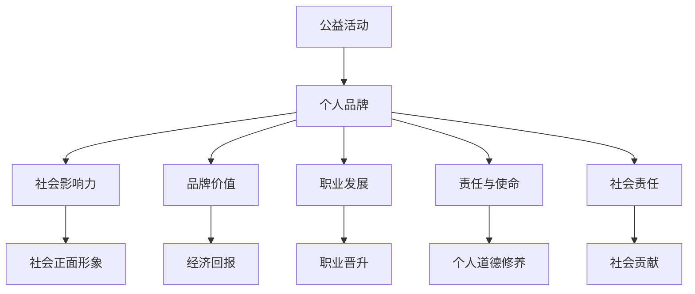

                 

# 参与公益活动：提升个人品牌的社会价值

> 关键词：公益活动,个人品牌,社会影响力,品牌价值,职业发展,责任与使命,社会责任

## 1. 背景介绍

### 1.1 问题由来
在当今社会，个人品牌越来越成为职业发展的重要一环。无论是在职场上还是社交网络上，优秀的个人品牌都能显著提升个人的影响力和竞争力。然而，单纯依靠商业技巧和市场营销，难以全面塑造一个有深度、有责任感的个人形象。

### 1.2 问题核心关键点
为了提升个人品牌的社会价值，越来越多的专业人士选择参与公益活动，通过实际行动传递正面价值观，践行社会责任。公益活动不仅帮助他人，还能在过程中提升个人的综合素质和职业声誉。

### 1.3 问题研究意义
参与公益活动不仅能直接帮助需要帮助的人，还能在社会大众和行业内建立良好的品牌形象，提升个人在职业发展和社交网络中的地位。通过公益活动，可以展示个人的责任感和使命感，促进与他人的深度互动和信任建立。

## 2. 核心概念与联系

### 2.1 核心概念概述

为更好地理解参与公益活动对个人品牌提升的作用，本节将介绍几个密切相关的核心概念：

- **公益活动**：指任何旨在帮助他人、推动社会进步的自愿行为，包括慈善捐助、志愿服务、社区活动等。
- **个人品牌**：指个人在职业和社交网络中形成的独特形象和价值观，通过专业能力、个人特质、社会责任等多方面构成。
- **社会影响力**：指个人通过行为和观点对社会产生正面或负面的影响能力。
- **品牌价值**：指个人品牌在社会和经济领域的实际和潜在价值。
- **职业发展**：指个人在职业生涯中的成长和进步，包括晋升、加薪、建立人脉等。
- **责任与使命**：指个人在职业和社会生活中所承担的责任和追求的使命。
- **社会责任**：指个人和企业应对社会作出贡献的义务，关注环保、公益、社区建设等领域。

这些概念之间的逻辑关系可以通过以下Mermaid流程图来展示：



这个流程图展示了个体参与公益活动的过程和影响：

1. 通过参与公益活动，个体在社会中建立正面形象，增强社会影响力。
2. 个人品牌在职业和社交网络中的价值提升，获得经济回报和职业发展机会。
3. 公益行为加强了个人对社会责任的承担，促进道德修养的提升。
4. 公益活动促进了社会价值的实现，个体也因此获得了社会的认可和尊重。

## 3. 核心算法原理 & 具体操作步骤
### 3.1 算法原理概述

参与公益活动对个人品牌的提升，本质上是利用正面行为在社会网络中建立连接，传递正面价值观，从而提升个人影响力的过程。这可以通过以下步骤实现：

1. **选择公益领域**：根据个人兴趣和能力，选择适合的公益活动领域。
2. **参与并持续**：定期参与公益活动，建立稳定的参与机制。
3. **展示成果**：通过社交媒体、职业履历等途径展示公益活动的成果和影响。
4. **持续反馈**：根据参与效果和反馈调整公益活动策略，持续改进。

### 3.2 算法步骤详解

基于公益活动的个人品牌提升方法，通常包括以下几个关键步骤：

**Step 1: 确定公益领域**
- 评估自身兴趣、技能和时间，选择合适的公益领域，如教育、环保、健康等。
- 研究该领域的热点问题和具体需求，确定参与方向。

**Step 2: 选择公益项目**
- 找到在该领域内活跃的公益组织或项目。
- 与组织或项目负责人取得联系，了解具体参与方式。

**Step 3: 制定参与计划**
- 确定参与的时间频率和持续时间。
- 设定具体的任务目标，如筹款、志愿服务时长、项目推广等。

**Step 4: 持续参与和反馈**
- 定期参与公益活动，记录活动经历和成果。
- 在社交媒体和职业履历上展示参与经历，分享心得体会。
- 向参与者、组织者和受益者收集反馈，评估活动效果，调整策略。

**Step 5: 整合成果和展示**
- 将公益活动的成果整合进个人品牌故事，包括成功案例、社会影响、个人收获等。
- 在求职面试、公开演讲、社交媒体等场合展示公益经历，提升社会影响力。

### 3.3 算法优缺点

参与公益活动对个人品牌的提升具有以下优点：
1. 增强社会影响力。通过正面行为在社会中建立连接，传递正面价值观，提升个人在社会网络中的影响力。
2. 提升职业发展机会。在职业履历中展示公益活动经历，增强在职场中的竞争力和说服力。
3. 增加社会认可。获得社会和行业内的认可和尊重，扩大个人品牌的传播范围。
4. 促进道德修养。通过公益行为加强责任感，提升道德水平。

同时，参与公益活动也存在一些局限性：
1. 时间成本高。公益活动需要投入大量时间和精力，尤其是长期参与。
2. 资源投入大。部分公益活动可能需要较大的资金或物质支持。
3. 效果不确定。公益活动的社会影响可能难以量化，存在一定的风险。
4. 社会质疑。公益活动可能受到部分人的质疑和不信任，影响品牌形象。

尽管存在这些局限性，但就目前而言，参与公益活动仍是提升个人品牌社会价值的重要手段。未来相关研究的重点在于如何更高效、更透明地进行公益活动，同时兼顾品牌价值的提升。

### 3.4 算法应用领域

参与公益活动的社会影响力提升方法，在多个领域得到了应用，例如：

- **职业发展**：在求职面试、升职加薪、职业转型中，通过展示公益活动经历，提升个人竞争力。
- **教育培训**：在学术研究、教育培训中，通过公益活动增强教学和研究的社会价值，提升学术影响力。
- **企业社会责任**：在企业运营中，通过公益活动展示企业社会责任，提升品牌形象。
- **个人品牌建设**：在社交媒体、博客、演讲等场合，通过公益活动展示个人价值观和社会责任，增强品牌传播力。
- **社会影响力提升**：在社会组织、公共事务中，通过公益活动提升个人在社会中的影响力和话语权。

除了上述这些经典应用外，公益活动还被创新性地应用到更多领域，如文化艺术推广、科技创新、环保行动等，为社会带来更广泛的影响。

## 4. 数学模型和公式 & 详细讲解  
### 4.1 数学模型构建

本节将使用数学语言对参与公益活动的个人品牌提升过程进行更加严格的刻画。

记参与公益活动的次数为 $n$，每次活动带来的正面影响为 $f_i$，则在社会网络中建立的影响力 $I$ 可以表示为：

$$
I = \sum_{i=1}^n f_i
$$

其中 $f_i$ 为第 $i$ 次公益活动带来的正面影响，可以是提升的社会认知度、帮助的人数、筹集的资金等。通过多次活动，影响力 $I$ 逐渐积累，提升了个人品牌的社会价值。

### 4.2 公式推导过程

以下我们以公益活动带来的社会认知度提升为例，推导影响力 $I$ 的计算公式。

假设每次公益活动带来的社会认知度提升为 $g_i$，则影响力 $I$ 可表示为：

$$
I = \sum_{i=1}^n g_i
$$

其中 $g_i$ 为第 $i$ 次公益活动带来的社会认知度提升，通常通过问卷调查、社会媒体分析等方式获取。

在具体计算过程中，可以设定基线认知度 $C_0$，每次活动带来的认知度提升 $\Delta C_i$，则 $g_i = C_0 + \Delta C_i$。通过累加每次活动的认知度提升，得到总影响力 $I$。

### 4.3 案例分析与讲解

以社区志愿活动为例，通过多次参与社区志愿服务，志愿者在社会中建立了正面形象，提升了个人品牌的影响力。

假设社区志愿服务每次能提升志愿者的社会认知度 $g_i = 0.1$，共参与 $n=10$ 次，则总影响力 $I$ 为：

$$
I = \sum_{i=1}^n g_i = 0.1 \times 10 = 1
$$

通过连续参与社区志愿服务，志愿者在社会网络中建立的影响力逐渐积累，提升了个人品牌的社会价值。

## 5. 项目实践：代码实例和详细解释说明
### 5.1 开发环境搭建

在进行公益活动实践前，我们需要准备好开发环境。以下是使用Python进行项目开发的环境配置流程：

1. 安装Python：从官网下载并安装Python，建议选择3.x版本。
2. 安装开发工具：如PyCharm、VSCode等，用于开发和调试公益活动项目。
3. 准备公益活动数据：收集相关公益项目的活动数据，包括参与人数、活动地点、活动成果等。
4. 设置代码仓库：使用Git创建代码仓库，方便团队协作和版本管理。

完成上述步骤后，即可在开发环境中进行公益活动项目的设计和实现。

### 5.2 源代码详细实现

这里我们以社区志愿活动记录系统为例，给出使用Python进行公益活动项目开发的完整代码实现。

首先，定义活动记录类：

```python
class VolunteerActivity:
    def __init__(self, activity_name, date, location, participants):
        self.activity_name = activity_name
        self.date = date
        self.location = location
        self.participants = participants
    
    def record(self):
        print(f"Activity {self.activity_name} was conducted on {self.date} at {self.location} with {self.participants} participants.")
```

然后，定义数据管理类：

```python
class ActivityDatabase:
    def __init__(self):
        self.activities = []
    
    def add_activity(self, activity):
        self.activities.append(activity)
    
    def display_activities(self):
        for activity in self.activities:
            activity.record()
```

最后，启动记录系统：

```python
if __name__ == '__main__':
    db = ActivityDatabase()
    while True:
        action = input("Enter 'add' to add a new activity, or 'quit' to quit: ")
        if action == 'add':
            name = input("Enter activity name: ")
            date = input("Enter activity date (YYYY-MM-DD): ")
            location = input("Enter activity location: ")
            participants = int(input("Enter number of participants: "))
            activity = VolunteerActivity(name, date, location, participants)
            db.add_activity(activity)
        elif action == 'quit':
            break
        else:
            print("Invalid action. Please try again.")
```

以上代码实现了简单的社区志愿活动记录系统，可以添加、展示和退出活动记录。

### 5.3 代码解读与分析

让我们再详细解读一下关键代码的实现细节：

**VolunteerActivity类**：
- `__init__`方法：初始化活动的基本信息。
- `record`方法：记录活动的详细信息，并通过打印输出展示。

**ActivityDatabase类**：
- `__init__`方法：初始化活动数据库，用于存储活动记录。
- `add_activity`方法：将新活动添加到数据库中。
- `display_activities`方法：展示数据库中的所有活动记录，调用每个活动的`record`方法输出详细信息。

**while循环**：
- 用户通过命令行交互，选择要执行的操作：添加新活动或退出程序。
- 根据用户输入调用相应方法，记录活动或退出程序。
- 如果用户输入错误，提示用户重新输入。

可以看到，使用Python进行公益活动项目的开发，代码简洁易懂，实现高效。开发者可以将更多精力放在项目设计、业务逻辑和用户体验上，而不必过多关注底层的实现细节。

当然，工业级的系统实现还需考虑更多因素，如用户界面设计、数据存储优化、安全防护等。但核心的公益活动记录流程基本与此类似。

## 6. 实际应用场景
### 6.1 企业社会责任项目

企业社会责任(ESR)项目是现代企业提升品牌形象、履行社会责任的重要手段。通过参与公益活动，企业可以在社区、环保、教育等各个领域发挥作用，展现企业的社会价值。

具体而言，企业可以在年度预算中设定一定的公益活动预算，建立ESR办公室或团队，定期策划和组织公益活动。通过公益项目的实施，企业在社会中树立了良好的品牌形象，增强了消费者和公众的信任，提升了品牌的社会价值。

### 6.2 社会影响力提升

公益活动不仅局限于企业的CSR项目，个人也可以通过参与公益活动，提升自己在社会中的影响力。在社交媒体、博客、公开演讲等场合，通过展示公益活动成果，传递正能量，增强社会网络中的正面影响力。

以环保公益活动为例，通过参与植树造林、垃圾分类等活动，个人在社会中树立了环保意识，提升了在环保领域的知名度和话语权。在社交媒体上分享活动照片和心得体会，可以吸引更多人关注环保事业，增强公益活动的社会影响力。

### 6.3 公益创业项目

越来越多的创业者和创新者选择将公益理念融入创业项目中，通过公益活动和技术创新，解决社会问题，推动社会进步。

以公益电商平台为例，通过在线销售环保产品，并将部分收益捐赠给环保组织，不仅支持了环保事业，还创造了商业价值。在公益创业项目中，创业者和企业可以将商业利润和公益活动紧密结合，实现双赢。

## 7. 工具和资源推荐
### 7.1 学习资源推荐

为了帮助开发者系统掌握公益活动对个人品牌提升的理论基础和实践技巧，这里推荐一些优质的学习资源：

1. **《公益事业管理与运营》书籍**：系统介绍了公益活动的规划、执行和评估方法，适合公益从业者阅读。
2. **公益组织平台**：如“壹基金”、“中国扶贫基金会”等，提供大量公益项目案例和成功经验，适合学习和借鉴。
3. **在线课程**：如“公益项目管理与评估”课程，通过线上学习，提升公益项目管理和评估能力。
4. **公益论坛和研讨会**：定期参加公益论坛和研讨会，与同行交流心得，获取最新资讯。
5. **公益项目评估工具**：如“公益创投平台”，提供公益项目评估工具和方法，帮助评估项目效果和影响。

通过对这些资源的学习实践，相信你一定能够全面掌握公益活动对个人品牌提升的精髓，并用于解决实际的公益问题。

### 7.2 开发工具推荐

高效的开发离不开优秀的工具支持。以下是几款用于公益活动开发和管理的常用工具：

1. **项目管理工具**：如JIRA、Trello等，帮助团队协作，管理公益活动流程。
2. **数据分析工具**：如Excel、Tableau等，用于数据分析和可视化，评估公益活动效果。
3. **社交媒体管理工具**：如Hootsuite、Weibo等，帮助发布和管理公益活动信息，提升传播力。
4. **在线协作平台**：如Google Docs、Microsoft Teams等，支持远程协作，共享活动文档和进展。
5. **资源管理工具**：如Grants.gov、Crowdfunding平台等，帮助获取公益活动资金和资源。

合理利用这些工具，可以显著提升公益活动的开发和管理效率，确保项目顺利进行。

### 7.3 相关论文推荐

公益活动的组织和实施，涉及多学科知识的综合应用。以下是几篇奠基性的相关论文，推荐阅读：

1. **《企业社会责任的经济价值》**：探讨了企业社会责任对企业绩效、品牌价值和社会影响的关系。
2. **《公益活动对社会认知度的影响》**：研究了公益活动在提升社会认知度和建立品牌形象方面的效果。
3. **《公益项目设计与评估》**：介绍了公益项目的设计、执行和评估方法，提供系统性指导。
4. **《公益创业的社会影响》**：分析了公益创业对社会问题的解决途径和影响，提供了创新的思路。
5. **《社会影响力提升的策略》**：介绍了提升个人和组织在社会中的影响力的策略和案例。

这些论文代表了大公益活动研究的进展，通过学习这些前沿成果，可以帮助研究者把握公益活动的发展方向，激发更多的创新灵感。

## 8. 总结：未来发展趋势与挑战

### 8.1 总结

本文对参与公益活动提升个人品牌社会价值的方法进行了全面系统的介绍。首先阐述了公益活动对个人品牌提升的作用和意义，明确了公益活动在职业发展和社交网络中的重要性。其次，从原理到实践，详细讲解了公益活动的数学模型和操作步骤，给出了完整的代码实现和实例讲解。同时，本文还广泛探讨了公益活动在企业社会责任、社会影响力提升、公益创业等多个领域的应用前景，展示了公益活动的社会价值。此外，本文精选了公益活动的各类学习资源，力求为读者提供全方位的技术指引。

通过本文的系统梳理，可以看到，参与公益活动不仅能直接帮助需要帮助的人，还能在社会大众和行业内建立良好的品牌形象，提升个人在职业发展和社交网络中的地位。通过公益活动，可以展示个人的责任感和使命感，促进与他人的深度互动和信任建立。未来，伴随公益活动的持续演进，公益行为必将在构建人机协同的智能时代中扮演越来越重要的角色。

### 8.2 未来发展趋势

展望未来，公益活动对个人品牌的提升将呈现以下几个发展趋势：

1. **技术赋能**：利用大数据、AI等技术手段，提升公益活动的效率和效果。通过数据分析和可视化，精准评估公益项目的影响力和成本效益。
2. **跨界合作**：公益活动与商业、文化、科技等领域深度融合，形成跨界合作模式，实现资源共享和协同创新。
3. **社会化参与**：通过社交媒体和社区平台，鼓励更多公众参与公益活动，扩大公益活动的覆盖面和影响力。
4. **全球化视角**：在全球化背景下，公益活动注重跨国合作和全球视野，推动全球社会进步和可持续发展。
5. **可持续性**：公益活动注重可持续发展，通过环保、教育、健康等领域的长期投入，实现社会的长远进步。

以上趋势凸显了公益活动对个人品牌提升的广阔前景。这些方向的探索发展，必将进一步提升公益活动的社会价值，为构建和谐社会和可持续发展做出更大贡献。

### 8.3 面临的挑战

尽管公益活动在提升个人品牌方面具有重要意义，但在迈向更加智能化、普适化应用的过程中，它仍面临诸多挑战：

1. **资源限制**：公益活动需要大量人力、物力、财力支持，资源有限成为制约公益活动实施的主要障碍。
2. **效果评估**：公益活动的社会影响难以量化，评估效果和成本效益存在一定难度。
3. **社会信任**：公益活动面临部分公众和媒体的质疑和不信任，影响公益活动的公信力和社会价值。
4. **法律法规**：公益活动的实施需要符合相关法律法规，操作复杂性增加。
5. **执行难度**：公益活动的实施需要协调多方利益，执行难度较大。

尽管存在这些挑战，但公益活动对个人品牌提升的价值不容忽视。未来研究需要在以下几个方面寻求新的突破：

1. **资源优化**：通过高效的项目管理和资源配置，提升公益活动的实施效率。
2. **效果评估**：引入多维度、多层次的评估指标，科学评估公益活动的效果和影响。
3. **社会信任**：加强公益活动的透明度和公开性，建立健全的监管机制，增强公信力。
4. **法律法规**：加强公益活动的法律法规研究和实施，保障公益活动的合法合规。
5. **执行优化**：通过跨界合作和多方协作，优化公益活动的实施过程，提升执行效率。

通过这些努力，公益活动必将在构建人机协同的智能时代中发挥更大作用，为社会带来更多正能量。

### 8.4 研究展望

面向未来，公益活动的研究方向和应用前景将更加广阔，需要在以下几个方面持续探索：

1. **技术融合**：公益活动与AI、大数据、区块链等技术的深度融合，提升公益活动的智能化水平。
2. **模式创新**：公益活动的多种模式探索，如众筹公益、AI公益等，形成多样化的公益解决方案。
3. **公众参与**：通过社交媒体和社区平台，促进公众参与公益活动，提升公益活动的覆盖面和影响力。
4. **全球合作**：公益活动注重跨国合作，推动全球社会进步和可持续发展。
5. **可持续发展**：公益活动的可持续发展研究，通过长期投入，实现社会的长远进步。

这些方向的研究和实践，必将引领公益活动向更高台阶迈进，为社会带来更多正能量。只有勇于创新、敢于突破，才能不断拓展公益活动的边界，让公益行为在构建和谐社会和可持续发展中发挥更大作用。

## 9. 附录：常见问题与解答

**Q1：参与公益活动是否需要具备特定技能和经验？**

A: 参与公益活动不需要特定的技能和经验，只要有意愿和热情即可。公益活动的核心在于传递正能量，帮助他人，而非展示专业能力。任何人都可以从自身能力出发，选择适合的公益领域和项目。

**Q2：如何平衡公益活动和个人职业发展？**

A: 通过合理规划时间，将公益活动纳入职业发展规划，可以使公益活动和个人职业发展相辅相成。例如，选择在职业发展关键期参与公益活动，提升个人影响力和品牌价值；在职业转型期参与公益活动，展示社会责任和职业素养。

**Q3：公益活动带来的社会影响力是否可以量化？**

A: 公益活动带来的社会影响力可以通过问卷调查、社会媒体分析等方式进行量化评估。例如，通过调查参与者、受益者的满意度，评估活动的效果和影响。同时，结合数据分析工具，对公益活动的覆盖面、传播力等进行评估。

**Q4：公益活动的资金和资源从哪里获得？**

A: 公益活动的资金和资源可以通过多种渠道获得，如政府资助、企业捐赠、社会募资等。例如，通过众筹平台发布公益项目，吸引公众参与捐款；与企业合作，获取资金和物资支持；参与公益组织和项目，获得资源和指导。

**Q5：公益活动中的安全和法律问题如何处理？**

A: 公益活动中安全和法律问题需要格外重视。例如，在进行公益活动前，了解相关法律法规，确保活动合法合规；制定应急预案，保障参与者的安全和健康；加强风险评估和防范，避免意外情况的发生。

通过本文的系统梳理，可以看到，参与公益活动不仅能直接帮助需要帮助的人，还能在社会大众和行业内建立良好的品牌形象，提升个人在职业发展和社交网络中的地位。通过公益活动，可以展示个人的责任感和使命感，促进与他人的深度互动和信任建立。未来，伴随公益活动的持续演进，公益行为必将在构建人机协同的智能时代中扮演越来越重要的角色。

---

作者：禅与计算机程序设计艺术 / Zen and the Art of Computer Programming

