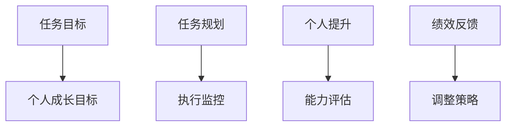

                 

# 双重目标法:管理者保持高效专注

> 关键词：管理，目标设定，绩效管理，决策分析，时间管理，效率提升

## 1. 背景介绍

在现代企业的复杂环境中，管理者面临的任务繁多且动态变化。如何高效地分配时间、资源、人力，确保团队目标的顺利实现，成为企业成功的关键。然而，面对海量的信息和不断涌现的新任务，管理者往往感到力不从心。

本文探讨一种创新管理方法——**双重目标法**，旨在通过设定并优化双重目标（任务目标与个人成长目标），帮助管理者保持高效专注，确保个人和团队的长期成功。

## 2. 核心概念与联系

### 2.1 核心概念概述

双重目标法是一种以结果为导向的管理方法，通过设定和优化双重目标（任务目标与个人成长目标），帮助管理者平衡短期与长期、个人与团队的需求，实现高效管理。

- **任务目标**：指明确的工作目标和计划，如完成项目、达成销售指标等。
- **个人成长目标**：指个人职业发展与技能提升的目标，如提高领导力、掌握新技术等。

通过设置和优化这两个目标，管理者可以更系统地规划时间、资源和团队任务，确保团队目标的顺利实现，同时促进个人发展。

### 2.2 核心概念原理和架构的 Mermaid 流程图(Mermaid 流程节点中不要有括号、逗号等特殊字符)



## 3. 核心算法原理 & 具体操作步骤

### 3.1 算法原理概述

双重目标法通过设定双重目标，帮助管理者系统规划时间和资源，确保任务的顺利完成和个人成长。其核心思想是：

1. **明确双重目标**：将任务目标和个人成长目标相结合，共同制定管理计划。
2. **时间与资源优化**：通过时间管理技巧，如番茄工作法、四象限法则等，优化资源分配，提高工作效率。
3. **定期评估与调整**：通过绩效评估和反馈机制，持续监控任务进度和个人成长，及时调整策略。

### 3.2 算法步骤详解

**Step 1: 设定双重目标**

- **任务目标设定**：根据公司的战略目标和业务需求，明确具体的任务目标。例如，完成某项新产品开发、提升销售额等。
- **个人成长目标设定**：基于个人职业规划，明确技能提升或职业发展的目标。例如，掌握某项新技能、获得某个证书等。

**Step 2: 制定时间与资源计划**

- **时间管理**：使用时间管理工具，如Gantt图、时间块管理等，规划每日、每周和每月的任务和时间。
- **资源分配**：根据任务目标和个人成长目标，合理分配人力、物力和财力资源。

**Step 3: 执行与监控**

- **任务执行**：按照时间计划，高效执行各项任务，确保任务目标的实现。
- **个人提升**：利用个人学习时间，如读书、培训等，逐步实现个人成长目标。
- **监控与反馈**：定期评估任务进度和个人成长，根据反馈调整计划。

**Step 4: 评估与调整**

- **绩效评估**：通过KPI、360度反馈等方法，评估任务目标和个人成长目标的达成情况。
- **调整策略**：根据评估结果，调整时间计划、资源分配和策略，确保双重目标的持续优化。

### 3.3 算法优缺点

双重目标法的主要优点包括：

- **系统性规划**：通过设定双重目标，系统规划时间和资源，确保高效完成任务和个人成长。
- **促进个人发展**：通过个人成长目标的设定，激励个人持续学习和提升，促进职业发展。
- **动态调整**：通过绩效评估和反馈机制，灵活调整管理策略，适应动态变化的环境。

同时，也存在一些缺点：

- **目标设定难度**：任务目标和个人成长目标的设定需要深入思考和规划，可能耗时较多。
- **资源分配复杂**：不同任务和个人成长需求的资源分配可能存在冲突，需要精细管理。
- **执行难度大**：高效执行和持续监控需要严格的时间管理和自律性，对管理者的要求较高。

### 3.4 算法应用领域

双重目标法在多个领域都具有广泛应用，包括但不限于：

- **项目管理**：帮助项目经理高效规划任务和时间，确保项目按时完成。
- **人力资源管理**：通过设定个人成长目标，促进员工职业发展和公司人才储备。
- **组织战略规划**：设定公司长期目标和个人成长目标，协同推进公司战略的实现。
- **个人生活管理**：个人时间管理和职业发展计划的制定，提升生活质量和职业成就。

## 4. 数学模型和公式 & 详细讲解 & 举例说明

### 4.1 数学模型构建

双重目标法的数学模型可以表示为：

$$
\begin{aligned}
\text{Maximize} & \quad f(\text{任务目标}, \text{个人成长目标}) \\
\text{Subject to} & \quad \begin{cases}
g_1(\text{任务目标}) \leq 0 \\
g_2(\text{个人成长目标}) \leq 0 \\
h_1(\text{时间与资源计划}) \geq 0 \\
h_2(\text{执行与监控}) \geq 0 \\
h_3(\text{评估与调整}) \geq 0 \\
\end{cases}
\end{aligned}
$$

其中，$f$ 表示总目标函数，$g_i$ 表示约束条件，$h_i$ 表示状态变量。

### 4.2 公式推导过程

通过设定任务目标$T$和个人成长目标$P$，双重目标法的约束条件可以表示为：

$$
\begin{aligned}
g_1(T) &= \text{未完成任务量} \\
g_2(P) &= \text{未达成的个人成长目标} \\
h_1(T,P) &= \text{时间与资源计划的可行性} \\
h_2(T,P) &= \text{执行与监控的有效性} \\
h_3(T,P) &= \text{评估与调整的合理性} \\
\end{aligned}
$$

在优化过程中，目标函数$f$可以是时间利用率、任务完成率、个人成长进度等指标的综合函数。

### 4.3 案例分析与讲解

假设某公司CEO设定如下双重目标：

- **任务目标**：在一年内完成某项新产品的上市，需要完成研发、市场推广和销售等多项任务。
- **个人成长目标**：在两年内成为行业内的顶尖管理专家，需要掌握新的管理理论和技术。

通过设定这些目标，可以构建如下数学模型：

$$
\begin{aligned}
\text{Maximize} & \quad \alpha \times \text{产品上市成功率} + \beta \times \text{个人成长进度} \\
\text{Subject to} & \quad \begin{cases}
\text{研发时间} + \text{市场推广时间} + \text{销售时间} = 12 \text{个月} \\
\text{掌握的管理理论数量} + \text{掌握的技术数量} = 10 \text{项} \\
\text{时间与资源计划的可行性} \geq 0 \\
\text{执行与监控的有效性} \geq 0 \\
\text{评估与调整的合理性} \geq 0 \\
\end{cases}
\end{aligned}
$$

其中，$\alpha$和$\beta$为权重，根据实际需求调整。

通过优化上述模型，可以找到一个最优解，确保任务目标和个人成长目标同时实现。例如，假设经过优化后，CEO需要在前6个月重点完成产品研发，后6个月重点完成市场推广和销售，同时每个月抽出2天时间学习新知识，最终实现了双重目标的平衡。

## 5. 项目实践：代码实例和详细解释说明

### 5.1 开发环境搭建

双重目标法主要依赖于管理工具和方法，不需要复杂的编程实现。以下是一般的开发环境搭建步骤：

1. **项目管理工具**：使用JIRA、Trello等工具，规划和监控任务进度。
2. **时间管理工具**：使用RescueTime、Toggl等工具，记录和管理个人时间。
3. **学习管理工具**：使用Coursera、Udacity等平台，设定和完成个人学习目标。

### 5.2 源代码详细实现

双重目标法的代码实现主要通过编写管理计划、监控进度和学习计划等模块，进行时间与资源的规划和管理。以下是一个简化的代码示例：

```python
class DualObjectiveManager:
    def __init__(self, task_goals, personal_goals):
        self.task_goals = task_goals
        self.personal_goals = personal_goals

    def plan(self, time_period):
        task_plan = self._plan_tasks(time_period)
        personal_plan = self._plan_personal_growth(task_plan)
        return task_plan, personal_plan

    def _plan_tasks(self, time_period):
        # 规划任务时间
        # 假设为时间块管理
        return self._time_block_management(time_period)

    def _plan_personal_growth(self, task_plan):
        # 规划个人学习时间
        # 假设为每周2天
        return {'学习时间': 2, '学习内容': []}

    def _execute_monitor(self, task_plan, personal_plan):
        # 执行任务和监控个人成长
        pass

    def _evaluate_adjust(self, task_plan, personal_plan):
        # 评估任务进度和个人成长
        pass

# 示例使用
manager = DualObjectiveManager(
    task_goals={'研发': '3个月', '市场推广': '3个月', '销售': '3个月'},
    personal_goals={'管理理论': '5项', '技术': '5项'}
)
task_plan, personal_plan = manager.plan(12)
print(task_plan)
print(personal_plan)
```

### 5.3 代码解读与分析

上述代码示例展示了双重目标法的核心模块：

- **双重目标设定**：通过初始化任务目标和个人成长目标。
- **时间与资源规划**：使用时间块管理方法，规划任务时间。
- **个人成长规划**：设定每周固定学习时间。
- **执行与监控**：实际执行任务和个人学习，监控进度。
- **评估与调整**：定期评估任务进度和个人成长，调整计划。

### 5.4 运行结果展示

运行上述代码示例，可以得到任务和个人成长的初步规划，如：

- **任务计划**：研发3个月，市场推广3个月，销售3个月。
- **个人成长计划**：每周学习2天，学习内容待定。

## 6. 实际应用场景

### 6.1 项目管理

双重目标法在项目管理中，可以帮助项目经理平衡任务进度和团队绩效，确保项目按时高质量完成。例如，某IT项目经理可以设定如下双重目标：

- **任务目标**：在6个月内开发并上线某电商平台，需要完成需求分析、系统设计和代码开发等多项任务。
- **个人成长目标**：在1年内掌握敏捷开发方法论，提升项目管理能力。

通过双重目标法，项目经理可以详细规划任务时间，并每周设定2天进行敏捷开发培训和学习，确保双重目标的实现。

### 6.2 人力资源管理

在人力资源管理中，双重目标法可以帮助HR制定个人职业发展计划，提升员工满意度和工作效率。例如，某公司HR可以设定如下双重目标：

- **任务目标**：在一年内提升招聘效率，缩短平均招聘周期至30天。
- **个人成长目标**：在两年内获得人力资源管理师证书，提升专业能力。

通过双重目标法，HR可以制定详细的招聘计划，同时安排员工参加人力资源管理培训，提升专业能力，实现个人和公司的共同发展。

### 6.3 组织战略规划

在组织战略规划中，双重目标法可以帮助高层管理人员平衡短期目标和长期战略，确保公司的可持续发展。例如，某公司CEO可以设定如下双重目标：

- **任务目标**：在一年内完成新产品的上市，提升市场份额。
- **个人成长目标**：在三年内成为行业领袖，掌握最新的管理理论和技术。

通过双重目标法，CEO可以制定详细的战略规划，同时安排个人学习时间，提升管理能力和技术水平，确保公司的长期成功。

## 7. 工具和资源推荐

### 7.1 学习资源推荐

1. **项目管理书籍**：《项目管理知识体系指南（PMBOK）》，PMI编写，系统介绍项目管理方法和工具。
2. **时间管理书籍**：《高效能人士的七个习惯》，史蒂芬·柯维，提供时间管理的基本原则和技巧。
3. **学习平台**：Coursera、Udemy等，提供多种职业发展和技能提升的在线课程。

### 7.2 开发工具推荐

1. **项目管理工具**：JIRA、Trello、Asana等，提供任务规划和进度监控的功能。
2. **时间管理工具**：RescueTime、Toggl等，帮助记录和管理个人时间。
3. **学习管理工具**：Coursera、Udacity、edX等，提供定制化学习计划和进度管理。

### 7.3 相关论文推荐

1. **项目管理**：《敏捷项目管理实践指南》，Jon Kruk，详细介绍敏捷项目管理的方法和工具。
2. **时间管理**：《番茄工作法》，Francesco Cirillo，介绍时间管理的基本原则和技巧。
3. **人力资源管理**：《人力资源管理实践指南》，Deloitte，提供人力资源管理的基本方法和工具。

## 8. 总结：未来发展趋势与挑战

### 8.1 研究成果总结

双重目标法通过设定双重目标，帮助管理者平衡任务和个人成长，提升整体效率和绩效。其核心思想包括任务目标和个人成长目标的设定、时间与资源的优化、动态评估与调整等。

### 8.2 未来发展趋势

未来，双重目标法将在以下几个方面进一步发展：

1. **智能化管理**：结合AI和大数据技术，实现任务和资源优化的智能化决策。
2. **跨部门协同**：打破部门壁垒，实现跨部门协同管理，提升整体效率。
3. **动态自适应**：通过实时反馈和调整，实现管理策略的自适应优化。
4. **数据驱动**：利用大数据和分析工具，提供更为精准的管理决策支持。

### 8.3 面临的挑战

双重目标法在推广和应用过程中，仍面临以下挑战：

1. **目标设定困难**：需要管理者具备深入的业务理解和规划能力，设定合理的双重目标。
2. **资源分配复杂**：不同任务和个人成长需求的资源分配可能存在冲突，需要精细管理。
3. **执行难度大**：高效执行和持续监控需要严格的时间管理和自律性，对管理者的要求较高。

### 8.4 研究展望

未来，研究人员应关注以下研究方向：

1. **多目标优化算法**：开发更为复杂和高效的多目标优化算法，实现双重目标的同时，优化更多维度的指标。
2. **智能决策支持**：结合AI和大数据技术，提供更为精准的决策支持和资源优化建议。
3. **跨部门协同机制**：建立跨部门的协同机制，提升整体管理效率和协作能力。

总之，双重目标法为管理者提供了一种系统化的管理方法，帮助其平衡任务和个人成长，提升整体效率和绩效。随着技术的不断进步和管理理论的深入研究，双重目标法将在更多领域得到应用，推动企业管理的创新与发展。

## 9. 附录：常见问题与解答

**Q1: 双重目标法适用于所有类型的工作吗？**

A: 双重目标法主要适用于需要系统规划时间和资源的任务，如项目管理、人力资源管理、组织战略规划等。对于需要高度创造性和随机性的工作，双重目标法可能需要结合其他管理方法进行应用。

**Q2: 如何设置合理的双重目标？**

A: 设置合理的双重目标需要管理者具备深入的业务理解和规划能力。可以通过SWOT分析、PEST分析等工具，综合考虑内部资源和外部环境，设定可行的目标。

**Q3: 如何管理时间与资源？**

A: 时间与资源管理可以通过工具和方法实现，如Gantt图、时间块管理、四象限法则等。同时，需要进行定期的评估和调整，确保目标的实现。

**Q4: 如何评估和调整双重目标？**

A: 评估和调整双重目标需要定期进行绩效评估和反馈，可以使用KPI、360度反馈等方法，根据评估结果调整计划。

**Q5: 如何平衡任务和个人成长？**

A: 平衡任务和个人成长需要管理者具备时间管理和自律性。可以通过设定优先级、时间块管理等方法，确保任务目标和个人成长目标的协同推进。

通过这些问题和解答，希望能够帮助你更好地理解双重目标法的应用场景和实践方法，提升管理效率和绩效。

