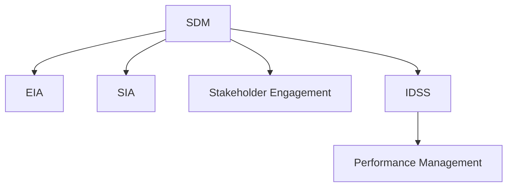

                 

# 可持续发展管理：实现长期环境和社会责任

> 关键词：可持续发展管理,环境责任,社会责任,长效管理,环境影响评估,社会影响评估,利益相关者参与,智能决策支持系统,绩效管理,绿色创新

## 1. 背景介绍

### 1.1 问题由来
近年来，随着全球化进程的加速，企业运营对环境和社会的影响日益显著。在资源有限、环境恶化的背景下，如何平衡经济效益与环境保护、社会责任的关系，成为全球共识。可持续发展管理（Sustainable Development Management, SDM）应运而生，强调在经济活动中兼顾环境与社会的长期利益，实现长期发展。

### 1.2 问题核心关键点
可持续发展管理的关键在于构建系统的、全面的管理体系，实现经济效益、环境影响和社会影响的协同优化。核心关键点包括：
- 环境影响评估（Environmental Impact Assessment, EIA）：系统评估项目对环境的潜在影响，并提出相应的缓解措施。
- 社会影响评估（Social Impact Assessment, SIA）：评估项目对社会的长期影响，特别是对弱势群体的影响，确保社会公正。
- 利益相关者参与（Stakeholder Engagement）：广泛听取利益相关者意见，确保决策的透明和公平。
- 智能决策支持系统（Intelligent Decision Support System, IDSS）：利用数据分析和人工智能技术，辅助科学决策。
- 绩效管理（Performance Management）：通过定期评估和反馈，确保SDM体系的持续改进。

### 1.3 问题研究意义
开展可持续发展管理对于提升企业的竞争力和社会责任感，具有重要意义：

1. **提升企业竞争力**：符合国际标准，获取市场认可，吸引人才和投资者。
2. **实现长期利益**：避免短期利益导致的资源浪费和环境破坏。
3. **促进社会和谐**：改善社区环境，增强员工满意度和忠诚度。
4. **响应政策要求**：符合国家和地区的环保法规和行业标准。
5. **推动技术创新**：引入绿色技术和方法，实现资源利用最大化。

## 2. 核心概念与联系

### 2.1 核心概念概述

为更好地理解可持续发展管理的核心概念，本节将介绍几个密切相关的核心概念：

- **可持续发展管理（SDM）**：通过构建系统的管理体系，实现经济、环境和社会效益的协同优化。
- **环境影响评估（EIA）**：系统评估项目对环境的潜在影响，并提出相应的缓解措施。
- **社会影响评估（SIA）**：评估项目对社会的长期影响，确保社会公正。
- **利益相关者参与（Stakeholder Engagement）**：广泛听取利益相关者意见，确保决策的透明和公平。
- **智能决策支持系统（IDSS）**：利用数据分析和人工智能技术，辅助科学决策。
- **绩效管理（Performance Management）**：通过定期评估和反馈，确保SDM体系的持续改进。

这些核心概念之间的逻辑关系可以通过以下Mermaid流程图来展示：



这个流程图展示了大语言模型的核心概念及其之间的关系：

1. **SDM**通过**EIA**和**SIA**评估环境和社会影响，确保决策的科学性和公正性。
2. **Stakeholder Engagement**广泛听取利益相关者意见，增强决策的透明度和参与度。
3. **IDSS**利用数据分析和人工智能技术，辅助决策制定。
4. **Performance Management**通过定期评估和反馈，持续改进SDM体系。

这些概念共同构成了可持续发展管理的核心框架，为其在实际应用中的有效实施提供了理论基础。

## 3. 核心算法原理 & 具体操作步骤
### 3.1 算法原理概述

可持续发展管理的目标是通过科学方法和工具，系统评估和优化项目的经济、环境和社会影响，实现长期利益。其核心算法原理包括以下几个方面：

1. **环境影响评估（EIA）**：使用生命周期分析（Life Cycle Analysis, LCA）等方法，系统评估项目的全生命周期环境影响，包括原材料获取、生产、使用和废弃物处理等环节。

2. **社会影响评估（SIA）**：通过社会调查、问卷等方式，系统评估项目对社区、家庭、教育、就业等方面的长期影响，特别是对弱势群体的影响。

3. **利益相关者参与（Stakeholder Engagement）**：采用问卷调查、公众听证会、在线论坛等形式，广泛听取包括员工、社区居民、政府机构、投资者在内的所有利益相关者的意见和建议。

4. **智能决策支持系统（IDSS）**：利用数据分析和机器学习技术，对环境和社会影响数据进行建模和预测，辅助科学决策。

5. **绩效管理（Performance Management）**：通过定期评估和反馈，监测和改进SDM体系的执行效果，确保长期目标的实现。

### 3.2 算法步骤详解

可持续发展管理的实施步骤如下：

**Step 1: 构建SDM框架**
- 根据项目特点，选择合适的SDM框架和方法，确定环境和社会影响的评估指标。
- 设计利益相关者的参与机制，明确各方的权责。

**Step 2: 环境影响评估（EIA）**
- 收集项目的全生命周期数据，包括原材料获取、生产、使用和废弃物处理等环节。
- 应用LCA、生态足迹等方法，系统评估项目的环境影响。
- 根据评估结果，提出相应的缓解措施和建议。

**Step 3: 社会影响评估（SIA）**
- 设计问卷和调查表，收集利益相关者的意见和建议。
- 分析数据，评估项目对社会各层面的长期影响，特别是对弱势群体的影响。
- 根据评估结果，调整项目设计，确保社会公正。

**Step 4: 利益相关者参与（Stakeholder Engagement）**
- 通过问卷调查、公众听证会、在线论坛等方式，广泛听取利益相关者的意见和建议。
- 将反馈结果整合到项目设计中，确保决策的透明和公平。

**Step 5: 智能决策支持系统（IDSS）**
- 利用数据分析和机器学习技术，对环境和社会影响数据进行建模和预测。
- 辅助科学决策，优化项目设计和实施方案。

**Step 6: 绩效管理（Performance Management）**
- 定期评估项目执行效果，监测环境和社会影响。
- 根据评估结果，调整和改进SDM体系，确保长期目标的实现。

### 3.3 算法优缺点

可持续发展管理具有以下优点：
1. **系统性**：通过科学方法和工具，系统评估项目的全生命周期环境和社会影响。
2. **透明性**：广泛听取利益相关者意见，增强决策的透明度和参与度。
3. **科学性**：利用数据分析和机器学习技术，辅助科学决策。
4. **可操作性**：通过定期评估和反馈，持续改进SDM体系，确保长期目标的实现。

同时，该方法也存在一定的局限性：
1. **数据收集难度**：环境和社会影响的评估需要大量数据，数据收集难度较大。
2. **模型复杂性**：智能决策支持系统需要复杂的建模和预测，对数据和算法的要求较高。
3. **利益冲突**：利益相关者的意见可能存在冲突，需要有效协调和整合。
4. **成本较高**：实施SDM需要较高的成本投入，包括数据收集、模型构建和评估等环节。

尽管存在这些局限性，但就目前而言，可持续发展管理仍是一种系统、全面、科学的管理方法，具有广阔的应用前景。

### 3.4 算法应用领域

可持续发展管理在多个领域得到了广泛应用，例如：

- **制造业**：评估产品全生命周期环境影响，优化生产过程，实现绿色制造。
- **建筑业**：评估建筑项目的环境和社会影响，提升能效，减少资源浪费。
- **交通运输**：评估交通系统的环境和社会影响，优化路线和交通方式，提升出行效率。
- **农业**：评估农业活动的环境和社会影响，优化种植和养殖方式，促进可持续农业。
- **能源**：评估能源项目的全生命周期环境影响，优化能源利用，促进绿色能源发展。
- **城市规划**：评估城市建设的环境和社会影响，优化城市布局，提升城市宜居性。

除了上述这些领域外，可持续发展管理还被创新性地应用于更多场景中，如可持继旅游、环保产品设计、社区服务提升等，为可持续发展提供新的路径。

## 4. 数学模型和公式 & 详细讲解 & 举例说明

### 4.1 数学模型构建

本节将使用数学语言对可持续发展管理的核心算法进行更加严格的刻画。

**环境影响评估（EIA）**：
- 假设项目的环境影响可以用全生命周期碳排放量 $C$ 和能耗 $E$ 来表示。
- 应用LCA方法，将全生命周期碳排放量和能耗作为EIA的评估指标。
- 数学模型如下：
$$
C = \sum_{i=1}^n C_i
$$
$$
E = \sum_{i=1}^n E_i
$$
其中，$C_i$ 和 $E_i$ 分别为第 $i$ 个环节的碳排放量和能耗。

**社会影响评估（SIA）**：
- 假设项目对社会的影响可以用就业机会 $J$ 和社区生活质量 $Q$ 来表示。
- 通过社会调查和问卷，收集利益相关者的意见和建议，并应用多因素综合评估模型进行量化。
- 数学模型如下：
$$
J = \sum_{i=1}^n J_i
$$
$$
Q = \sum_{i=1}^n Q_i
$$
其中，$J_i$ 和 $Q_i$ 分别为第 $i$ 个环节的就业机会和社区生活质量。

### 4.2 公式推导过程

以下我们以LCA为例，推导环境影响评估（EIA）的公式。

假设项目由 $n$ 个环节组成，每个环节的碳排放量和能耗分别为 $C_i$ 和 $E_i$。LCA方法通过生命周期全周期的视角，对项目的碳排放量和能耗进行系统评估。

应用LCA方法，项目的总碳排放量和能耗可以表示为：
$$
C = \sum_{i=1}^n C_i
$$
$$
E = \sum_{i=1}^n E_i
$$

在得到全生命周期的碳排放量和能耗后，即可进一步分析其在各个环节中的具体分布和贡献，找出碳排放和能耗的主要来源，提出相应的缓解措施。

### 4.3 案例分析与讲解

假设某工业生产项目由五个环节组成，每个环节的碳排放量和能耗如表所示：

| 环节 | $C_i$ (kg) | $E_i$ (kWh) |
|------|-----------|------------|
| 原材料获取 | 100 | 500 |
| 生产 | 200 | 1000 |
| 运输 | 50 | 100 |
| 使用 | 30 | 200 |
| 废弃物处理 | 50 | 50 |

根据LCA方法，项目的总碳排放量和能耗分别为：
$$
C = 100 + 200 + 50 + 30 + 50 = 430 \text{kg}
$$
$$
E = 500 + 1000 + 100 + 200 + 50 = 1850 \text{kWh}
$$

根据上述计算结果，可以发现生产环节是碳排放和能耗的主要来源，占总量的48%和54%。针对这些主要环节，可以采取节能减排措施，如优化生产工艺、使用可再生能源等，实现环境影响的最小化。

## 5. 项目实践：代码实例和详细解释说明
### 5.1 开发环境搭建

在进行可持续发展管理实践前，我们需要准备好开发环境。以下是使用Python进行PyTorch开发的环境配置流程：

1. 安装Anaconda：从官网下载并安装Anaconda，用于创建独立的Python环境。

2. 创建并激活虚拟环境：
```bash
conda create -n pytorch-env python=3.8 
conda activate pytorch-env
```

3. 安装PyTorch：根据CUDA版本，从官网获取对应的安装命令。例如：
```bash
conda install pytorch torchvision torchaudio cudatoolkit=11.1 -c pytorch -c conda-forge
```

4. 安装各类工具包：
```bash
pip install numpy pandas scikit-learn matplotlib tqdm jupyter notebook ipython
```

完成上述步骤后，即可在`pytorch-env`环境中开始实践。

### 5.2 源代码详细实现

这里我们以环境影响评估（EIA）为例，给出使用Python进行LCA计算的代码实现。

首先，定义LCA计算函数：

```python
import numpy as np

def lifecycle_analysis(c, e):
    n = len(c)
    C_total = np.sum(c)
    E_total = np.sum(e)
    return C_total, E_total
```

然后，定义数据集：

```python
c = [100, 200, 50, 30, 50]
e = [500, 1000, 100, 200, 50]
```

最后，调用函数进行LCA计算：

```python
C, E = lifecycle_analysis(c, e)
print(f"Total carbon footprint: {C} kg")
print(f"Total energy consumption: {E} kWh")
```

以上就是使用Python进行LCA计算的完整代码实现。可以看到，借助NumPy库，LCA计算变得简单高效。

### 5.3 代码解读与分析

让我们再详细解读一下关键代码的实现细节：

**lifecycle_analysis函数**：
- `def lifecycle_analysis(c, e)`：定义LCA计算函数，接收碳排放量和能耗两个数组。
- `n = len(c)`：计算环节数量。
- `C_total = np.sum(c)`：计算总碳排放量。
- `E_total = np.sum(e)`：计算总能耗。
- `return C_total, E_total`：返回计算结果。

**数据集定义**：
- `c = [100, 200, 50, 30, 50]`：定义各环节的碳排放量。
- `e = [500, 1000, 100, 200, 50]`：定义各环节的能耗。

**LCA计算**：
- `C, E = lifecycle_analysis(c, e)`：调用LCA计算函数，得到总碳排放量和总能耗。
- `print(f"Total carbon footprint: {C} kg")`：打印总碳排放量。
- `print(f"Total energy consumption: {E} kWh")`：打印总能耗。

可以看到，通过简单的函数调用和数据处理，我们完成了LCA的计算，得到了项目的总碳排放量和总能耗。

## 6. 实际应用场景
### 6.1 智能制造

智能制造是可持续发展管理的重要应用场景之一。通过将环境和社会影响评估嵌入到生产计划和流程中，可以实现绿色制造，提高资源利用效率，减少环境污染。

在技术实现上，可以采用智能决策支持系统（IDSS），对生产过程中的环境和社会影响进行实时监测和预测。利用数据分析和机器学习技术，可以优化生产工艺和流程，减少资源浪费和环境污染。同时，通过智能排程和调度，可以实现生产线的动态优化，提升生产效率和产品质量。

### 6.2 绿色建筑

绿色建筑是指在设计和建造过程中，充分考虑环境和社会影响，实现能源消耗最低、环境污染最小、资源利用最高的建筑。

在绿色建筑的设计和建设过程中，可持续发展管理可以发挥重要作用。通过系统评估建筑的全生命周期环境影响，优化材料选择和施工工艺，减少能耗和排放。同时，通过智能决策支持系统（IDSS），可以实现建筑运行状态的实时监测和优化，提升建筑能效和舒适性。

### 6.3 可持续城市

可持续城市是指在城市规划和管理中，充分考虑环境和社会影响，实现资源高效利用和生态平衡的城市。

在城市规划和管理中，可持续发展管理可以提供科学决策支持。通过系统评估城市建设的环境和社会影响，优化城市布局和功能分区，提升城市宜居性和可持续性。同时，通过智能决策支持系统（IDSS），可以实现城市运行状态的实时监测和优化，提升城市管理效率和居民生活质量。

### 6.4 未来应用展望

随着可持续发展管理技术的不断进步，其在更多领域得到应用，为可持续发展提供新的路径。

在智慧农业领域，通过系统评估农业活动的环境和社会影响，优化种植和养殖方式，提升农业的可持续性和生产效率。在可持继旅游领域，通过系统评估旅游项目的环境和社会影响，优化旅游活动设计，提升旅游项目的可持续性和游客体验。

未来，随着数据和算法的不断进步，可持续发展管理将变得更加智能和高效，实现更多领域的绿色发展和资源优化。

## 7. 工具和资源推荐
### 7.1 学习资源推荐

为了帮助开发者系统掌握可持续发展管理的理论基础和实践技巧，这里推荐一些优质的学习资源：

1. **《可持续发展管理与实践》系列书籍**：系统介绍了可持续发展管理的理论基础、方法论和实践案例，是学习可持续发展管理的经典教材。

2. **Coursera《可持续发展管理》课程**：由多所知名大学和研究机构开设，系统讲解可持续发展管理的理论和实践。

3. **《可持续发展管理案例分析》书籍**：通过实际案例，深入分析可持续发展管理在不同领域的实施方法和效果。

4. **IEEE Xplore数据库**：包含大量可持续发展管理的学术论文和技术报告，是学习和研究的重要资源。

5. **国际可持续发展协会（ISDA）网站**：提供丰富的可持续发展管理案例和资源，是实践学习的宝贵资料。

通过对这些资源的学习实践，相信你一定能够快速掌握可持续发展管理的精髓，并用于解决实际的可持续发展问题。
### 7.2 开发工具推荐

高效的开发离不开优秀的工具支持。以下是几款用于可持续发展管理开发的常用工具：

1. **Python**：作为数据科学和人工智能的重要语言，Python拥有丰富的库和框架，适合可持续发展管理的开发。

2. **PyTorch**：基于Python的深度学习框架，支持分布式计算和模型优化，适合复杂数据分析和建模。

3. **TensorFlow**：由Google主导开发的深度学习框架，支持大规模分布式计算，适合复杂的模型训练和优化。

4. **Matplotlib和Seaborn**：数据可视化工具，可以生成各种图表，帮助分析数据和呈现结果。

5. **Jupyter Notebook**：交互式编程环境，支持代码和结果的快速迭代和共享，适合实验开发。

合理利用这些工具，可以显著提升可持续发展管理的开发效率，加快创新迭代的步伐。

### 7.3 相关论文推荐

可持续发展管理的发展源于学界的持续研究。以下是几篇奠基性的相关论文，推荐阅读：

1. **《可持续发展的环境、经济和社会影响评估框架》**：提出了一种综合的环境、经济和社会影响评估方法，系统评估项目的全生命周期影响。

2. **《利益相关者参与和可持续发展管理》**：探讨了利益相关者参与在可持续发展管理中的作用，提出了多种利益相关者参与机制。

3. **《智能决策支持系统在可持续发展管理中的应用》**：介绍了智能决策支持系统在可持续发展管理中的作用，提出了多种智能决策支持方法。

4. **《绩效管理在可持续发展管理中的应用》**：研究了绩效管理在可持续发展管理中的作用，提出了多种绩效管理工具和方法。

5. **《绿色创新在可持续发展管理中的应用》**：探讨了绿色创新在可持续发展管理中的作用，提出了多种绿色创新方法。

这些论文代表了大语言模型微调技术的发展脉络。通过学习这些前沿成果，可以帮助研究者把握学科前进方向，激发更多的创新灵感。

## 8. 总结：未来发展趋势与挑战
### 8.1 总结

本文对可持续发展管理的核心算法进行了全面系统的介绍。首先阐述了可持续发展管理的理论基础和核心概念，明确了SDM体系在实现经济、环境和社会效益协同优化方面的独特价值。其次，从原理到实践，详细讲解了环境影响评估、社会影响评估、利益相关者参与、智能决策支持系统、绩效管理的算法原理和具体操作步骤，给出了完整的代码实例和解释。同时，本文还广泛探讨了可持续发展管理在智能制造、绿色建筑、可持续城市等多个领域的应用前景，展示了SDM范式的广阔前景。最后，本文精选了SDM技术的各类学习资源，力求为读者提供全方位的技术指引。

通过本文的系统梳理，可以看到，可持续发展管理作为一种系统、全面、科学的管理方法，已经在多个领域得到应用，为可持续发展提供了新的路径。未来，伴随数据和算法的不断进步，SDM技术还将进一步提升其应用范围和效果，为可持续发展做出更大的贡献。

### 8.2 未来发展趋势

展望未来，可持续发展管理将呈现以下几个发展趋势：

1. **数据驱动决策**：随着大数据和人工智能技术的发展，数据驱动的决策将更加科学和高效，减少主观判断和偏差。

2. **全生命周期管理**：在产品设计、生产、使用、废弃等全生命周期环节，系统评估环境和社会影响，实现全生命周期的可持续发展。

3. **智能优化管理**：利用智能决策支持系统（IDSS），实现动态优化和实时管理，提升管理效率和决策效果。

4. **利益相关者协同管理**：通过利益相关者参与机制，增强决策的透明度和参与度，实现多方协同管理。

5. **绿色创新管理**：通过绿色创新管理，引入新的技术和方法，实现资源利用最大化和环境影响最小化。

6. **绩效管理优化**：通过优化绩效管理方法，实现SDM体系的持续改进和优化，确保长期目标的实现。

这些趋势凸显了可持续发展管理技术的广阔前景。这些方向的探索发展，必将进一步提升SDM体系的科学性和实用性，为实现可持续发展提供更可靠的技术支撑。

### 8.3 面临的挑战

尽管可持续发展管理已经取得了瞩目成就，但在迈向更加智能化、普适化应用的过程中，仍面临诸多挑战：

1. **数据获取难度**：环境和社会影响的评估需要大量数据，数据获取难度较大。

2. **模型复杂性**：智能决策支持系统需要复杂的建模和预测，对数据和算法的要求较高。

3. **利益冲突协调**：利益相关者的意见可能存在冲突，需要有效协调和整合。

4. **成本较高**：实施SDM需要较高的成本投入，包括数据收集、模型构建和评估等环节。

尽管存在这些挑战，但通过持续的技术创新和实践优化，SDM技术仍有很大的发展空间，为实现可持续发展提供更多的技术手段和实践路径。

### 8.4 研究展望

面对可持续发展管理所面临的挑战，未来的研究需要在以下几个方面寻求新的突破：

1. **数据融合与共享**：推动数据的标准化和共享，实现数据的无缝整合和高效利用。

2. **模型优化与验证**：开发更加高效的模型，优化模型性能和可解释性，增强模型的可信度。

3. **智能优化与协同管理**：引入智能优化和协同管理技术，实现动态优化和多方协同管理。

4. **绿色创新与跨学科融合**：引入绿色创新技术和跨学科融合思想，推动技术创新和知识融合。

5. **利益相关者参与与监管机制**：建立有效的利益相关者参与机制，确保决策的透明和公正，制定监管机制，确保系统安全。

这些研究方向的探索，必将引领可持续发展管理技术迈向更高的台阶，为实现可持续发展提供更可靠的技术支撑。面向未来，可持续发展管理还需要与其他技术进行更深入的融合，如知识表示、因果推理、强化学习等，多路径协同发力，共同推动可持续发展技术的发展。只有勇于创新、敢于突破，才能不断拓展可持续发展管理的边界，为实现可持续发展做出更大的贡献。

## 9. 附录：常见问题与解答

**Q1：可持续发展管理是否适用于所有项目？**

A: 可持续发展管理适用于大多数项目，特别是那些具有显著环境和社会影响的项目。对于小型项目或短期项目，可以考虑采用其他管理方法。

**Q2：如何选择合适的环境影响评估方法？**

A: 选择合适的环境影响评估方法需要根据项目的类型、规模和特点进行综合考虑。LCA、碳足迹分析等方法适用于全生命周期分析，而局部环境影响评估方法适用于特定环节的评估。

**Q3：如何提高利益相关者参与的效率和效果？**

A: 提高利益相关者参与的效率和效果，可以采用在线调查、公众听证会、社区会议等多种形式。确保参与者的多样性和代表性，促进意见的广泛听取和有效整合。

**Q4：如何评估项目的长期社会影响？**

A: 评估项目的长期社会影响，可以通过定量和定性相结合的方式进行。定量方法包括问卷调查、社会网络分析等，定性方法包括深度访谈、焦点小组等，结合两者可以更全面地评估项目的社会影响。

**Q5：可持续发展管理是否需要持续改进？**

A: 是的，可持续发展管理需要持续改进，以适应不断变化的环境和社会需求。定期评估和管理绩效，及时调整和优化SDM体系，是确保其长期有效性的关键。

---

作者：禅与计算机程序设计艺术 / Zen and the Art of Computer Programming

