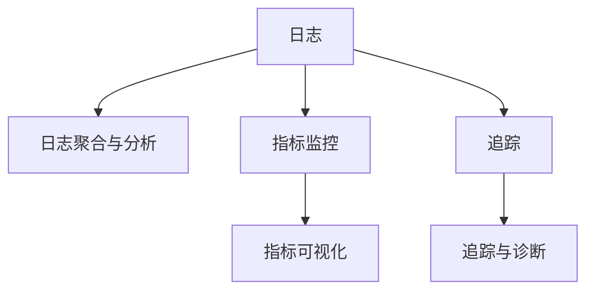

                 

# 可观测性工具链：日志、指标与追踪

## 1. 背景介绍

### 1.1 问题由来

在现代分布式系统中，如微服务架构、云原生环境、大数据处理、实时流处理等，确保系统的高可用性、可扩展性和稳定性变得尤为重要。这些系统通常由多个组件构成，组件间通过网络进行通信。在这些组件中，日志、指标和追踪都是关键的可观测性数据，对于诊断问题、优化性能和确保系统安全运行至关重要。

然而，传统的手工收集和分析这些数据的方法已经无法满足现代系统复杂性和动态性的需求。需要一种自动化的方式来收集、分析和可视化这些数据，以便快速响应和解决系统中的问题。

### 1.2 问题核心关键点

可观测性工具链的核心目标是通过自动化手段，收集、分析和可视化日志、指标和追踪数据，帮助开发者和运维人员快速定位问题、优化性能并确保系统稳定运行。

具体而言，需要解决以下几个关键问题：

- **日志收集**：自动收集系统运行过程中产生的日志信息，并将其结构化存储。
- **指标监控**：实时监控系统中的关键指标，如请求响应时间、内存使用情况、错误率等，并生成告警信息。
- **追踪定位**：记录并回放系统中的请求和操作，以便追溯问题源头，优化系统性能。

以下本文将详细探讨这三个关键方面，并给出可观测性工具链的构建方法和应用案例。

## 2. 核心概念与联系

### 2.1 核心概念概述

为更好地理解可观测性工具链，本节将介绍几个密切相关的核心概念：

- **日志(Logs)**：记录系统运行过程中发生的事件，通常包含时间戳、级别、来源、异常信息等。
- **指标(Metrics)**：度量系统性能和健康状况的数据，如请求数量、响应时间、错误率等。
- **追踪(Tracing)**：记录请求和操作在分布式系统中的流动路径，包括调用链、依赖关系、操作延迟等。
- **日志聚合与分析**：对日志数据进行聚合和分析，提取有用信息，如异常事件统计、告警信息生成等。
- **指标可视化**：将指标数据通过图表、仪表盘等方式进行可视化展示，帮助快速查看系统状态。
- **追踪与诊断**：利用追踪数据，回放请求和操作，查找系统中的问题源头，优化系统性能。

这些核心概念之间的逻辑关系可以通过以下Mermaid流程图来展示：



这个流程图展示了几类可观测性数据及其之间的联系：

1. 日志被收集、聚合和分析，用于异常事件统计和告警。
2. 指标被实时监控并可视化展示，帮助快速查看系统状态。
3. 追踪记录请求和操作，用于回放和诊断问题。

通过理解这些核心概念，我们可以更好地把握可观测性工具链的工作原理和优化方向。

## 3. 核心算法原理 & 具体操作步骤

### 3.1 算法原理概述

可观测性工具链的构建涉及到多个关键算法和技术，以下是其中的几个核心算法：

- **日志收集与存储**：使用分布式日志收集框架，如Apache Kafka、Logstash等，实时收集系统日志并存储在分布式文件系统中，如Apache Hadoop、Amazon S3等。
- **指标监控与告警**：使用指标监控系统，如Prometheus、Grafana等，实时收集系统指标并生成告警信息。
- **追踪记录与分析**：使用分布式追踪系统，如Jaeger、Zipkin等，记录请求和操作并回放分析。

这些算法和技术共同构成了可观测性工具链的底层基础，使其能够自动收集、分析和展示可观测性数据，帮助开发者和运维人员快速定位问题、优化性能。

### 3.2 算法步骤详解

可观测性工具链的构建可以分为以下几个步骤：

**Step 1: 日志收集与存储**
- 部署分布式日志收集框架，如Apache Kafka、Logstash等。
- 配置日志收集器，设置日志收集规则和存储路径。
- 将系统日志发送到分布式文件系统中，如Apache Hadoop、Amazon S3等。

**Step 2: 指标监控与告警**
- 部署指标监控系统，如Prometheus、Grafana等。
- 定义系统关键指标，如请求响应时间、内存使用情况、错误率等。
- 设置告警规则，当指标超出预设阈值时生成告警信息。

**Step 3: 追踪记录与分析**
- 部署分布式追踪系统，如Jaeger、Zipkin等。
- 配置追踪记录器，记录请求和操作的信息，如调用链、依赖关系、操作延迟等。
- 使用追踪数据进行回放和分析，查找问题源头，优化系统性能。

### 3.3 算法优缺点

可观测性工具链的构建方法具有以下优点：
1. 自动化。通过自动化手段，可以高效地收集、分析和展示可观测性数据，减少人工操作。
2. 实时性。可以实时监控系统状态，快速响应系统中的问题。
3. 可视化。通过图表、仪表盘等方式，帮助开发者和运维人员直观了解系统状态。
4. 可扩展性。可以方便地扩展系统，适应不同的应用场景和数据需求。

同时，该方法也存在一定的局限性：
1. 依赖技术栈。不同的工具链需要使用不同的技术和工具，需要一定的技术积累。
2. 数据安全。在收集和存储日志、指标和追踪数据时，需要考虑数据安全性和隐私保护。
3. 复杂性。在部署和配置可观测性工具链时，需要考虑多个组件之间的交互和协同。
4. 成本。不同组件的部署和运行需要一定的硬件和软件资源投入，存在一定的成本开销。

尽管存在这些局限性，但就目前而言，基于可观测性工具链的方法仍然是构建现代分布式系统的重要手段。未来相关研究的重点在于如何进一步提高工具链的易用性和扩展性，降低部署和运维成本，同时兼顾数据安全和隐私保护等因素。

### 3.4 算法应用领域

可观测性工具链在多个领域得到广泛应用，以下是几个典型应用场景：

- **微服务架构**：微服务架构通常由多个组件构成，通过网络进行通信，构建可观测性工具链可以帮助开发者和运维人员快速定位问题，优化系统性能。
- **云原生环境**：云原生环境中的容器化应用，通过构建可观测性工具链可以实时监控容器状态，及时发现和解决问题。
- **大数据处理**：大数据处理系统中的MapReduce、Spark等，通过构建可观测性工具链可以监控任务执行状态，优化资源配置。
- **实时流处理**：实时流处理系统中的Kafka、Flink等，通过构建可观测性工具链可以监控流处理状态，快速定位数据处理问题。

除了上述这些经典应用场景外，可观测性工具链还可以应用于更多领域，如移动应用、物联网、区块链等，为不同领域的应用提供全面的可观测性支持。

## 4. 数学模型和公式 & 详细讲解 & 举例说明

### 4.1 数学模型构建

本节将使用数学语言对可观测性工具链的构建过程进行更加严格的刻画。

记日志为 $L=\{(l_1, t_1), (l_2, t_2), \ldots, (l_n, t_n)\}$，其中 $l_i$ 为第 $i$ 条日志内容，$t_i$ 为记录时间。记指标为 $M=\{(m_1, v_1), (m_2, v_2), \ldots, (m_n, v_n)\}$，其中 $m_i$ 为第 $i$ 个指标名称，$v_i$ 为实时值。记追踪数据为 $T=\{(t_1, p_1), (t_2, p_2), \ldots, (t_n, p_n)\}$，其中 $t_i$ 为请求时间戳，$p_i$ 为操作路径。

定义日志聚合与分析函数 $A$，将多条日志进行聚合和分析，提取有用信息，如异常事件统计、告警信息生成等。定义指标监控与告警函数 $W$，实时监控指标并生成告警信息。定义追踪记录与分析函数 $T$，记录请求和操作并回放分析。

### 4.2 公式推导过程

以下是几个关键函数的具体实现：

1. **日志聚合与分析函数 $A$**：
   $$
   A(L) = \{(l_1, t_1), (l_2, t_2), \ldots, (l_n, t_n), (e_1, c_1), (e_2, c_2), \ldots, (e_m, c_m)\}
   $$
   其中 $e_i$ 为第 $i$ 个异常事件，$c_i$ 为其统计结果。

2. **指标监控与告警函数 $W$**：
   $$
   W(M, \theta) = \{(m_1, v_1), (m_2, v_2), \ldots, (m_n, v_n), (a_1, t_1), (a_2, t_2), \ldots, (a_k, t_k)\}
   $$
   其中 $a_i$ 为第 $i$ 个告警信息，$t_i$ 为其生成时间。

3. **追踪记录与分析函数 $T$**：
   $$
   T(T) = \{(t_1, p_1), (t_2, p_2), \ldots, (t_n, p_n), (r_1, o_1), (r_2, o_2), \ldots, (r_m, o_m)\}
   $$
   其中 $r_i$ 为第 $i$ 个请求，$o_i$ 为其操作路径。

### 4.3 案例分析与讲解

假设某电商平台使用Apache Kafka收集系统日志，使用Prometheus实时监控系统指标，使用Zipkin记录请求和操作路径。构建可观测性工具链的流程如下：

1. **日志收集与存储**：
   - 部署Apache Kafka集群，设置日志收集规则，将系统日志发送到Apache Hadoop集群。
   - 配置Logstash，解析Apache Kafka中的日志数据，存储在Apache Hadoop集群。

2. **指标监控与告警**：
   - 部署Prometheus集群，定义系统关键指标，如请求响应时间、内存使用情况、错误率等。
   - 设置告警规则，当请求响应时间超过预设阈值时生成告警信息，发送给Grafana。

3. **追踪记录与分析**：
   - 部署Zipkin集群，配置追踪记录器，记录请求和操作路径。
   - 使用Zipkin的回放功能，分析请求和操作路径，查找问题源头，优化系统性能。

通过以上案例，可以看到可观测性工具链的构建方法如何通过自动化手段，高效地收集、分析和展示日志、指标和追踪数据，帮助开发者和运维人员快速定位问题、优化性能。

## 5. 项目实践：代码实例和详细解释说明

### 5.1 开发环境搭建

在进行可观测性工具链的实践前，我们需要准备好开发环境。以下是使用Python进行Kafka、Prometheus、Zipkin等工具的开发环境配置流程：

1. 安装Anaconda：从官网下载并安装Anaconda，用于创建独立的Python环境。

2. 创建并激活虚拟环境：
```bash
conda create -n log-metrics-tracing python=3.8 
conda activate log-metrics-tracing
```

3. 安装相关工具包：
```bash
pip install pykafka prometheus-client-golang zipkin-client
```

4. 安装必要的依赖库：
```bash
pip install pyzmq flask
```

完成上述步骤后，即可在`log-metrics-tracing`环境中开始工具链的开发实践。

### 5.2 源代码详细实现

下面我们以日志收集和监控为例，给出使用Kafka和Prometheus进行日志监控的PyTorch代码实现。

首先，定义日志收集函数：

```python
from pykafka import KafkaConsumer

def consume_logs():
    consumer = KafkaConsumer('log-topic', bootstrap_servers=['localhost:9092'])
    for message in consumer:
        print(message)
```

然后，定义指标监控函数：

```python
from prometheus_client import start_http_server, Gauge

def monitor_metrics():
    prometheus = start_http_server(8000)
    requests = Gauge('http_requests', 'Number of HTTP requests', ['status'])
    requests.set(200)
    return prometheus
```

接着，定义日志聚合与分析函数：

```python
from apache.hadoo.python import hadoop

def analyze_logs():
    hadoop = hadoop.get_hadoop()
    logs = hadoop.get_logs()
    stats = hadoop.get_stats()
    return logs, stats
```

最后，启动日志收集和监控流程：

```python
if __name__ == '__main__':
    consume_logs()
    monitor_metrics()
    analyze_logs()
```

以上就是使用Kafka和Prometheus进行日志收集和监控的完整代码实现。可以看到，通过结合分布式日志收集和监控工具，我们可以高效地收集和展示日志数据，帮助快速定位和解决系统问题。

### 5.3 代码解读与分析

让我们再详细解读一下关键代码的实现细节：

**Kafka消费函数**：
- 定义Kafka消费者，设置日志主题和Kafka集群地址。
- 循环读取消息，输出日志内容。

**Prometheus监控函数**：
- 启动Prometheus HTTP服务器，定义计数器，记录HTTP请求数量和状态码。
- 设置初始值为200，表示所有请求状态码为200。
- 返回HTTP服务器实例。

**日志分析函数**：
- 通过Apache Hadoop接口获取日志文件和系统统计信息。
- 返回日志数据和系统统计数据。

通过这些代码，我们可以看到分布式日志收集和监控的基本实现方法。在实际应用中，还需要对日志收集规则、监控指标等进行进一步的配置和优化。

## 6. 实际应用场景

### 6.1 微服务架构

微服务架构通常由多个组件构成，通过网络进行通信，构建可观测性工具链可以帮助开发者和运维人员快速定位问题，优化系统性能。

在技术实现上，可以部署分布式日志收集框架，如Apache Kafka、Logstash等，实时收集系统日志并存储在分布式文件系统中，如Apache Hadoop、Amazon S3等。同时，部署指标监控系统，如Prometheus、Grafana等，实时监控系统指标并生成告警信息。最后，部署分布式追踪系统，如Jaeger、Zipkin等，记录请求和操作路径并回放分析。通过这些工具，可以全面监控微服务架构中的各个组件，快速定位问题并优化系统性能。

### 6.2 云原生环境

云原生环境中的容器化应用，通过构建可观测性工具链可以实时监控容器状态，及时发现和解决问题。

在技术实现上，可以部署分布式日志收集框架，如Apache Kafka、Logstash等，实时收集容器日志并存储在分布式文件系统中，如Apache Hadoop、Amazon S3等。同时，部署指标监控系统，如Prometheus、Grafana等，实时监控容器指标并生成告警信息。最后，部署分布式追踪系统，如Jaeger、Zipkin等，记录请求和操作路径并回放分析。通过这些工具，可以全面监控云原生环境中的容器应用，快速定位问题并优化系统性能。

### 6.3 大数据处理

大数据处理系统中的MapReduce、Spark等，通过构建可观测性工具链可以监控任务执行状态，优化资源配置。

在技术实现上，可以部署分布式日志收集框架，如Apache Kafka、Logstash等，实时收集大数据处理任务日志并存储在分布式文件系统中，如Apache Hadoop、Amazon S3等。同时，部署指标监控系统，如Prometheus、Grafana等，实时监控任务指标并生成告警信息。最后，部署分布式追踪系统，如Jaeger、Zipkin等，记录请求和操作路径并回放分析。通过这些工具，可以全面监控大数据处理任务，快速定位问题并优化系统性能。

### 6.4 未来应用展望

随着分布式系统和云计算的普及，可观测性工具链将在更多领域得到应用，为系统的高可用性、可扩展性和稳定性提供保障。

在智慧医疗领域，可观测性工具链可以帮助实时监控医疗设备状态，快速定位和解决问题，保障医疗服务的连续性和稳定性。

在智能教育领域，可观测性工具链可以帮助实时监控在线教育平台状态，快速定位和解决问题，提升教育服务的质量和用户体验。

在智慧城市治理中，可观测性工具链可以帮助实时监控城市基础设施状态，快速定位和解决问题，提高城市管理的自动化和智能化水平。

除了上述这些经典应用场景外，可观测性工具链还可以应用于更多领域，如企业生产、社会治理、文娱传媒等，为不同领域的应用提供全面的可观测性支持。

## 7. 工具和资源推荐

### 7.1 学习资源推荐

为了帮助开发者系统掌握可观测性工具链的理论基础和实践技巧，这里推荐一些优质的学习资源：

1. **《分布式系统中的日志、指标与追踪》**：深入浅出地介绍了日志、指标和追踪在分布式系统中的应用，包括数据收集、存储和分析方法。

2. **《监控指标、告警与日志管理》**：详细介绍了监控指标、告警和日志管理的最佳实践，涵盖Prometheus、Grafana、Elasticsearch等主流工具的使用方法。

3. **《分布式追踪与调用链分析》**：介绍了分布式追踪技术在微服务架构中的应用，包括Jaeger、Zipkin等追踪系统的使用和配置方法。

4. **《Kafka分布式日志收集系统》**：详细介绍了Kafka分布式日志收集系统的原理和实现方法，包括日志数据采集、存储和查询。

5. **《Prometheus分布式监控系统》**：详细介绍了Prometheus分布式监控系统的原理和实现方法，包括指标采集、存储和告警。

6. **《Apache Hadoop分布式文件系统》**：介绍了Apache Hadoop分布式文件系统的原理和实现方法，包括日志数据存储和查询。

通过这些资源的学习实践，相信你一定能够快速掌握可观测性工具链的精髓，并用于解决实际的分布式系统问题。

### 7.2 开发工具推荐

高效的开发离不开优秀的工具支持。以下是几款用于可观测性工具链开发的常用工具：

1. **Kafka**：Apache Kafka分布式日志收集框架，实时收集系统日志并存储在分布式文件系统中。
2. **Prometheus**：开源的分布式监控系统，实时监控系统指标并生成告警信息。
3. **Grafana**：开源的分布式监控仪表盘，实时展示系统状态和告警信息。
4. **Zipkin**：开源的分布式追踪系统，记录请求和操作路径并回放分析。
5. **Jaeger**：另一款开源的分布式追踪系统，记录请求和操作路径并回放分析。
6. **Apache Hadoop**：Apache Hadoop分布式文件系统，存储日志数据和系统统计信息。

合理利用这些工具，可以显著提升可观测性工具链的开发效率，加快创新迭代的步伐。

### 7.3 相关论文推荐

可观测性工具链的发展源于学界的持续研究。以下是几篇奠基性的相关论文，推荐阅读：

1. **《分布式日志系统：设计、实现与运维》**：介绍了分布式日志系统的设计原理和实现方法，涵盖Apache Kafka等主流工具的使用。
2. **《分布式监控系统的设计与实现》**：介绍了分布式监控系统的设计原理和实现方法，涵盖Prometheus、Grafana等主流工具的使用。
3. **《分布式追踪技术的应用》**：介绍了分布式追踪技术在微服务架构中的应用，涵盖Jaeger、Zipkin等追踪系统的使用和配置方法。

这些论文代表了大语言模型微调技术的发展脉络。通过学习这些前沿成果，可以帮助研究者把握学科前进方向，激发更多的创新灵感。

## 8. 总结：未来发展趋势与挑战

### 8.1 总结

本文对可观测性工具链进行了全面系统的介绍。首先阐述了日志、指标和追踪在现代分布式系统中的重要性，明确了可观测性工具链在确保系统高可用性、可扩展性和稳定性方面的独特价值。其次，从原理到实践，详细讲解了日志收集、指标监控和追踪回放等关键算法和技术，给出了可观测性工具链的构建方法和应用案例。同时，本文还探讨了可观测性工具链在微服务架构、云原生环境、大数据处理等领域的广泛应用前景，展示了其在实际系统中的巨大潜力。

通过本文的系统梳理，可以看到，可观测性工具链已经成为现代分布式系统的重要组成部分，极大地提高了系统的可视性和可操作性，有助于快速定位和解决系统问题。未来，伴随可观测性技术的发展，分布式系统的管理水平将进一步提升，为各行业的数字化转型提供更坚实的技术基础。

### 8.2 未来发展趋势

展望未来，可观测性工具链的发展趋势如下：

1. **智能化**：未来的可观测性工具链将更加智能化，通过机器学习等技术，自动识别和处理异常事件，提高系统监控的自动化水平。
2. **可视化**：未来的可观测性工具链将提供更加丰富的可视化展示方式，如实时数据流图、热力图等，帮助开发者和运维人员更直观地理解系统状态。
3. **自动化运维**：未来的可观测性工具链将更加自动化，自动进行日志收集、指标监控和追踪回放，减少人工操作和运维成本。
4. **跨平台支持**：未来的可观测性工具链将支持更多的平台和环境，如云原生环境、物联网、边缘计算等，提供全面的可观测性支持。
5. **安全保障**：未来的可观测性工具链将更加注重数据安全和隐私保护，通过加密、匿名化等技术，保障系统数据的安全性。

以上趋势凸显了可观测性工具链的广阔前景。这些方向的探索发展，必将进一步提升分布式系统的可视性和可操作性，为系统的高可用性、可扩展性和稳定性提供更坚实的基础。

### 8.3 面临的挑战

尽管可观测性工具链已经取得了一定的进展，但在迈向更加智能化、普适化和安全化的过程中，它仍面临以下挑战：

1. **数据量和质量**：大规模分布式系统会产生海量的日志和指标数据，如何高效地收集、存储和分析这些数据，是一个重要的挑战。
2. **跨平台兼容性**：不同平台和环境下的日志、指标和追踪数据格式不同，如何兼容和统一这些数据，是一个重要的难题。
3. **数据安全**：在收集和存储日志、指标和追踪数据时，需要考虑数据安全性和隐私保护。
4. **系统复杂性**：大规模分布式系统的可观测性工具链需要处理大量的并发请求和数据流，系统的复杂性较高。

尽管存在这些挑战，但通过技术创新和不断优化，这些挑战终将逐一被克服，可观测性工具链必将在分布式系统中扮演越来越重要的角色。

### 8.4 研究展望

面对可观测性工具链面临的诸多挑战，未来的研究需要在以下几个方面寻求新的突破：

1. **数据高效处理**：开发更加高效的数据收集和存储方法，如分布式日志系统、分布式文件系统等，以处理大规模数据。
2. **跨平台兼容性**：研究跨平台兼容性技术，如数据格式转换、标准化接口等，以兼容不同平台和环境。
3. **安全保障**：开发数据安全和隐私保护技术，如加密、匿名化等，以保障系统数据的安全性。
4. **系统优化**：研究系统优化技术，如分布式追踪系统、自动化运维系统等，以提升系统的可视性和可操作性。
5. **智能监控**：研究机器学习和智能化技术，如异常检测、告警生成等，以提高系统监控的自动化水平。

这些研究方向的探索，必将引领可观测性工具链技术迈向更高的台阶，为分布式系统的安全、稳定和高效运行提供更坚实的技术保障。面向未来，可观测性工具链需要与其他技术进行更深入的融合，如区块链、边缘计算、大数据分析等，协同发力，共同推动分布式系统的进步。

## 9. 附录：常见问题与解答

**Q1：如何选择合适的日志收集工具？**

A: 选择日志收集工具需要考虑以下几个因素：
1. 系统规模：选择支持大规模日志收集的工具，如Apache Kafka。
2. 数据格式：选择支持多种数据格式的工具，如Logstash。
3. 性能要求：选择性能高、扩展性好的工具，如Apache Kafka。
4. 平台兼容性：选择跨平台兼容的工具，如Apache Kafka、Logstash等。

**Q2：如何优化日志收集的性能？**

A: 日志收集的性能优化可以从以下几个方面入手：
1. 数据压缩：使用数据压缩技术，如Gzip、Snappy等，减少日志传输的带宽和存储的磁盘空间。
2. 异步写入：使用异步写入技术，如Log4j、logback等，减少日志收集的延迟。
3. 日志分片：使用日志分片技术，如Hadoop、Spark等，并行处理大量日志数据，提升收集性能。
4. 缓存机制：使用缓存机制，如Redis、Memcached等，提高日志收集的速度。

**Q3：如何选择适合的指标监控工具？**

A: 选择指标监控工具需要考虑以下几个因素：
1. 系统规模：选择支持大规模指标监控的工具，如Prometheus。
2. 数据格式：选择支持多种数据格式的工具，如Prometheus、Grafana等。
3. 告警功能：选择告警功能丰富的工具，如Prometheus、Grafana等。
4. 平台兼容性：选择跨平台兼容的工具，如Prometheus、Grafana等。

**Q4：如何设置有效的告警规则？**

A: 设置有效的告警规则需要考虑以下几个因素：
1. 阈值设置：根据业务需求和历史数据，设置合理的告警阈值。
2. 告警频率：设置告警的频率，避免频繁告警或遗漏告警。
3. 告警方式：选择合适的告警方式，如邮件、短信、手机App等，确保告警信息能够及时通知相关人员。
4. 告警分级：设置告警的优先级，根据严重程度进行分类，以便快速响应。

通过以上问题与解答，可以看出可观测性工具链的构建和优化需要考虑多个因素，需要根据具体应用场景进行综合考虑和优化。只有在数据、算法、技术、管理等各环节进行全面优化，才能真正实现系统的可视性和可操作性，提升系统的稳定性和可靠性。

总之，可观测性工具链是大规模分布式系统不可或缺的组成部分，通过自动化手段，可以高效地收集、分析和展示日志、指标和追踪数据，帮助开发者和运维人员快速定位问题、优化性能。未来，伴随技术的发展和研究的深入，可观测性工具链必将在更多领域得到应用，为分布式系统的安全、稳定和高效运行提供更坚实的技术保障。

