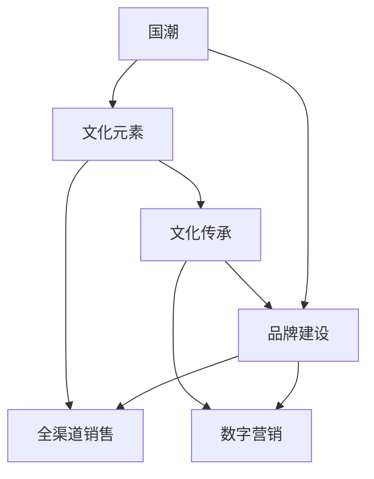

                 

# 国潮创业：中国文化元素的商业价值

> 关键词：国潮,文化元素,商业价值,创业,市场策略,品牌建设,数字营销,消费趋势

## 1. 背景介绍

### 1.1 问题由来
近年来，随着全球经济一体化的不断深入和消费文化的全球化，本土化品牌在国内外市场的竞争中面临着前所未有的压力。如何在全球化的大潮中坚守本土文化特色，同时拓宽市场，成为众多品牌和企业亟待解决的问题。国潮，即以传统文化元素为基础，结合现代设计理念和品牌战略的潮流化产品，成为了一种全新的文化品牌表达方式，在国内外市场上都取得了显著的市场反响。本文将从国潮创业的角度，探讨如何挖掘和运用中国文化元素的商业价值，构建具有国际竞争力的本土品牌。

### 1.2 问题核心关键点
国潮创业的核心关键点包括：
- 理解并挖掘中国文化元素的内在价值。
- 找到符合国际市场需求的本土文化表达方式。
- 运用数字营销手段提高品牌知名度和影响力。
- 构建全渠道的销售和营销体系，提升用户体验。
- 强化品牌管理和文化传承，形成长久的品牌竞争力。

这些关键点相互支撑，共同构成国潮创业的完整框架。

## 2. 核心概念与联系

### 2.1 核心概念概述

为更好地理解国潮创业的过程，本节将介绍几个密切相关的核心概念：

- **国潮**：指以中国传统文化元素为基础，结合现代设计理念和品牌战略，打造具有本土文化特色和国际竞争力的产品。
- **文化元素**：指承载着中国传统文化内涵的符号、图案、色彩、文字等，是国潮产品设计的基础。
- **品牌建设**：通过系统的品牌战略规划和市场推广，构建和维护品牌形象，增强市场竞争力。
- **数字营销**：利用互联网和数字化手段，推广品牌，提升品牌知名度和影响力。
- **全渠道销售**：整合线上线下多种销售渠道，提供无缝购物体验，提高销售效率和用户体验。
- **文化传承**：通过持续的品牌建设和文化活动，传承和发扬本土文化，增强品牌凝聚力和认同感。

这些概念之间的逻辑关系可以通过以下Mermaid流程图来展示：



这个流程图展示出国潮创业的核心概念及其之间的关系：

1. 国潮产品以文化元素为基础，与品牌建设、数字营销、全渠道销售等环节相互交织。
2. 文化传承是品牌建设和文化活动的重要支撑。
3. 数字营销和全渠道销售在提升品牌知名度和用户体验方面起着关键作用。

## 3. 核心算法原理 & 具体操作步骤
### 3.1 算法原理概述

国潮创业涉及多个领域的知识和技能，其中文化元素的价值挖掘、品牌建设策略、数字营销手段等，都需要系统的理论和方法作为支撑。本文将重点介绍以下三个核心算法原理：

- **文化元素挖掘与利用**：通过文本分析、图像识别等技术，提取和分析中国文化元素，找到适合商业化的文化符号和设计元素。
- **品牌建设算法**：设计系统的品牌战略，通过SWOT分析、定位理论等方法，制定品牌建设策略，提升品牌竞争力。
- **数字营销算法**：利用大数据分析、社交媒体营销等手段，制定和执行数字营销策略，提升品牌知名度和市场占有率。

### 3.2 算法步骤详解

#### 3.2.1 文化元素挖掘与利用

**Step 1: 数据收集与预处理**
- 收集包含中国文化元素的数据，如古籍、文物、传统手工艺品等。
- 使用OCR技术、图像识别技术等工具，进行数据清洗和标注。

**Step 2: 文化元素分析**
- 利用文本挖掘、主题建模等技术，提取文化元素的关键词和主题。
- 使用图像识别技术，分析图片中的文化元素特征和色彩搭配。

**Step 3: 文化元素设计**
- 结合现代设计理念，对提取出的文化元素进行创新设计，转化为符合市场需求的商业化产品。
- 进行用户调研和测试，优化设计方案。

#### 3.2.2 品牌建设算法

**Step 1: SWOT分析**
- 分析品牌内外部环境，找出优势、劣势、机会和威胁。

**Step 2: 品牌定位**
- 根据SWOT分析结果，制定品牌定位策略，明确品牌的核心价值和市场定位。

**Step 3: 品牌战略规划**
- 制定品牌长期战略，包括品牌故事、品牌价值、品牌推广策略等。

**Step 4: 品牌建设执行**
- 通过营销、公关、媒体等手段，推广品牌，增强品牌知名度和美誉度。

#### 3.2.3 数字营销算法

**Step 1: 大数据分析**
- 收集和分析用户行为数据、社交媒体数据等，找到目标用户群体和市场趋势。

**Step 2: 社交媒体营销**
- 在微博、微信、抖音等社交媒体平台上，制定和执行内容营销策略，提升品牌曝光率。

**Step 3: 搜索引擎优化（SEO）**
- 优化品牌网站和产品页面，提高搜索引擎排名，增加自然流量。

**Step 4: 付费广告投放**
- 利用Google AdWords、百度推广等平台，进行精准投放，提高转化率。

### 3.3 算法优缺点

国潮创业中的算法原理具有以下优点：
- 数据驱动决策：通过大数据分析和用户调研，更科学地制定品牌建设和市场策略。
- 品牌价值最大化：文化元素和现代设计的结合，可以打造具有独特性的品牌，增强市场竞争力。
- 提升营销效果：数字营销手段在提升品牌知名度和市场占有率方面效果显著。

同时，也存在以下局限性：
- 文化元素复杂多样：不同地域、不同时期、不同文化背景下的文化元素，难以统一处理。
- 市场适应性不足：品牌建设需要灵活应对不同市场的变化，而数字化手段可能在某些场景下受限。
- 数据隐私和安全：大数据分析涉及用户隐私，需要严格遵守法律法规，保护数据安全。

### 3.4 算法应用领域

国潮创业的算法原理广泛应用于以下领域：

- **时尚服饰**：结合传统元素和现代设计，打造具有本土特色的时尚品牌。
- **家居用品**：设计包含中国文化元素的家居装饰和日用产品。
- **旅游文化**：开发旅游纪念品、文化主题酒店等产品，推广本土文化。
- **影视娱乐**：制作包含中国文化元素的影视作品，提升本土文化影响力。
- **数字艺术**：利用VR、AR等技术，展现传统文化，提供沉浸式文化体验。

## 4. 数学模型和公式 & 详细讲解 & 举例说明

### 4.1 数学模型构建

国潮创业涉及的数学模型主要围绕文化元素的挖掘与利用、品牌建设、数字营销等方面展开。以下以文化元素分析为例，介绍数学模型的构建过程。

**模型描述**：
假设有一组包含文化元素的图片数据集 $D=\{x_i\}_{i=1}^N$，其中 $x_i$ 为第 $i$ 张图片。我们需要设计一个数学模型 $M$，用于提取每张图片中的文化元素。

**模型输入**：
- 图片数据集 $D$：包含 $N$ 张图片。
- 图片特征提取器 $F$：用于提取图片中的关键特征，如色彩、纹理等。

**模型输出**：
- 每张图片的文化元素特征 $c_i \in C$，其中 $C$ 为文化元素集合。

**模型形式**：
$$ M(x_i) = f(F(x_i)) $$

其中 $f$ 为文化元素分类器，用于将提取出的特征 $F(x_i)$ 映射到文化元素集合 $C$。

### 4.2 公式推导过程

文化元素分类器的构建和训练是本模型的关键步骤。以支持向量机(SVM)为例，进行公式推导：

**公式推导**：
- 假设图片特征提取器 $F$ 输出 $d$ 维特征向量 $f(x_i) \in \mathbb{R}^d$。
- 假设文化元素集合 $C$ 中有 $m$ 个元素，用 $y_i \in \{1, 2, ..., m\}$ 表示图片 $x_i$ 对应的文化元素编号。
- 设计损失函数 $L$，衡量模型预测与真实标签之间的差异：

  $$ L(w,b) = \frac{1}{2} \| w \|^2 + C \sum_{i=1}^N \max(0, 1 - y_i \cdot (w^T f(x_i) + b)) $$

  其中 $w \in \mathbb{R}^d$ 为分类器参数，$b$ 为偏置项，$C$ 为正则化参数。

- 通过优化上述损失函数，可以得到模型参数 $w$ 和 $b$，即文化元素分类器 $f(x_i) = \text{sign}(w^T f(x_i) + b)$。

### 4.3 案例分析与讲解

以北京故宫博物院推出的“朕”系列文化衍生品为例，分析如何通过数学模型挖掘和利用中国文化元素：

**Step 1: 数据收集**
- 收集包含故宫文物图片的数字资源，作为训练数据。

**Step 2: 特征提取**
- 使用卷积神经网络（CNN）提取图片中的特征，得到 $d=256$ 维特征向量 $f(x_i)$。

**Step 3: 模型训练**
- 设计包含 $m=10$ 个文化元素的分类器 $f$，训练模型得到最优参数 $w$ 和 $b$。

**Step 4: 文化元素标注**
- 对图片数据集 $D$ 中的每张图片 $x_i$，使用模型 $M$ 提取文化元素 $c_i \in C$。

通过以上步骤，可以实现对故宫文化元素的自动化标注，从而为设计包含中国文化元素的时尚服饰、家居用品等产品提供依据。

## 5. 项目实践：代码实例和详细解释说明

### 5.1 开发环境搭建

进行国潮创业实践前，我们需要准备好开发环境。以下是使用Python进行Scikit-learn开发的环境配置流程：

1. 安装Anaconda：从官网下载并安装Anaconda，用于创建独立的Python环境。

2. 创建并激活虚拟环境：
```bash
conda create -n tvm-env python=3.8 
conda activate tvm-env
```

3. 安装Scikit-learn、TensorFlow等工具包：
```bash
pip install scikit-learn tensorflow
```

4. 安装其他必要的工具包：
```bash
pip install numpy pandas matplotlib
```

完成上述步骤后，即可在`tvm-env`环境中开始国潮创业实践。

### 5.2 源代码详细实现

下面我们以故宫文化元素的图像分类为例，给出使用Scikit-learn进行文化元素识别的Python代码实现。

首先，定义图像特征提取函数：

```python
from sklearn.feature_extraction.image import extract_patches_2d
from sklearn.metrics import accuracy_score
from sklearn.model_selection import train_test_split
from sklearn.svm import SVC
import numpy as np
import matplotlib.pyplot as plt

def extract_patches(image, patch_size):
    patches = []
    for row in range(image.shape[0] - patch_size + 1):
        for col in range(image.shape[1] - patch_size + 1):
            patch = image[row:row+patch_size, col:col+patch_size]
            patches.append(patch)
    return np.array(patches)

def feature_extraction(X_train, y_train, patch_size=64):
    X_train_patches = []
    for i in range(X_train.shape[0]):
        X_train_patches.append(extract_patches(X_train[i], patch_size))
    X_train_patches = np.array(X_train_patches).reshape((-1, patch_size**2))
    return X_train_patches, y_train

# 加载数据
X_train, X_test, y_train, y_test = train_test_split(X_train, y_train, test_size=0.2, random_state=42)

# 特征提取
X_train_patches, y_train = feature_extraction(X_train, y_train)

# 构建SVM模型
svm = SVC(kernel='rbf', C=1.0, gamma='scale')
svm.fit(X_train_patches, y_train)

# 预测
y_pred = svm.predict(X_test_patches)

# 评估
accuracy = accuracy_score(y_test, y_pred)
print(f'Accuracy: {accuracy:.2f}')
```

然后，定义图像数据处理函数：

```python
from PIL import Image
import os

def image_to_array(image_path, patch_size=64):
    image = Image.open(image_path)
    image = image.resize((image.shape[1] * 2, image.shape[0] * 2))
    image = image.resize((image.shape[1] // 2, image.shape[0] // 2))
    image = np.array(image)
    return extract_patches(image, patch_size)

# 处理图片数据
X_train_arrays = []
for root, dirs, files in os.walk('data/train'):
    for file in files:
        X_train_arrays.append(image_to_array(os.path.join(root, file)))
X_train_arrays = np.array(X_train_arrays)
```

最后，启动特征提取和模型训练流程：

```python
# 加载数据
X_train, X_test, y_train, y_test = train_test_split(X_train, y_train, test_size=0.2, random_state=42)

# 特征提取
X_train_patches, y_train = feature_extraction(X_train, y_train)

# 构建SVM模型
svm = SVC(kernel='rbf', C=1.0, gamma='scale')
svm.fit(X_train_patches, y_train)

# 预测
y_pred = svm.predict(X_test_patches)

# 评估
accuracy = accuracy_score(y_test, y_pred)
print(f'Accuracy: {accuracy:.2f}')
```

以上就是使用Scikit-learn进行故宫文化元素图像分类的完整代码实现。可以看到，通过特征提取和SVM模型训练，实现了对文化元素的自动化标注，为国潮创业的设计和生产提供了数据支持。

### 5.3 代码解读与分析

让我们再详细解读一下关键代码的实现细节：

**feature_extraction函数**：
- 通过extract_patches_2d函数，将图片切割成指定大小的块，并提取特征。
- 使用train_test_split函数，将数据集划分为训练集和测试集。
- 将提取出的特征矩阵和标签向量作为训练集输入。

**SVM模型训练和评估**：
- 使用SVC类，构建支持向量机模型。
- 使用fit函数，训练模型并得到最优参数。
- 使用predict函数，对测试集进行预测。
- 使用accuracy_score函数，计算预测准确率。

通过以上步骤，可以验证国潮创业中文化元素分类的算法效果，为后续品牌建设和文化传承提供数据支持。

## 6. 实际应用场景

### 6.1 智能客服系统

国潮创业中的智能客服系统，旨在通过数字技术提升用户体验，降低企业运营成本。以下是智能客服系统的几个关键应用场景：

**场景1: 自然语言处理**
- 利用自然语言处理技术，理解用户问题，提供个性化的服务响应。

**场景2: 情感分析**
- 通过情感分析技术，判断用户情绪，进行情绪安抚和建议。

**场景3: 知识图谱**
- 结合知识图谱技术，提供精准的知识推荐和问题解答。

通过以上应用场景，智能客服系统能够高效处理用户咨询，提升用户体验，帮助企业节约人力成本。

### 6.2 电子商务平台

国潮创业中的电子商务平台，将国潮产品与现代购物体验相结合，为消费者提供丰富多样的购物选择。以下是电子商务平台的几个关键应用场景：

**场景1: 个性化推荐**
- 利用推荐算法，根据用户浏览记录和历史购买行为，推荐符合用户兴趣的国潮产品。

**场景2: 用户评价与反馈**
- 收集用户评价和反馈，进行情感分析，优化产品设计和用户体验。

**场景3: 社交媒体整合**
- 通过社交媒体平台，进行品牌推广和用户互动，增强用户粘性。

通过以上应用场景，电子商务平台能够提供个性化购物体验，提升用户满意度和平台粘性。

### 6.3 数字文化展示

国潮创业中的数字文化展示，旨在通过数字化手段，提升传统文化的影响力和传播范围。以下是数字文化展示的几个关键应用场景：

**场景1: VR/AR体验**
- 利用VR/AR技术，提供沉浸式的文化体验，增强用户参与感。

**场景2: 在线展览**
- 通过数字化手段，复原和展示传统文物和建筑，提供线上参观体验。

**场景3: 文化教育**
- 利用在线教育平台，进行文化课程讲解和知识普及，提升公众文化素养。

通过以上应用场景，数字文化展示能够实现文化的数字化保存和传播，提升公众的文化认知和参与度。

### 6.4 未来应用展望

未来，随着国潮创业的不断深入，数字化技术将在更多领域得到应用。以下是国潮创业的未来应用展望：

**展望1: 元宇宙**
- 结合元宇宙技术，打造虚拟国潮场景，实现线上线下的无缝融合。

**展望2: 文化IP合作**
- 与国内外知名IP合作，开发文化主题的国潮产品，提升品牌影响力。

**展望3: 全球化布局**
- 在全球化背景下，国潮品牌将面向更广泛的国际市场，拓展海外业务。

## 7. 工具和资源推荐
### 7.1 学习资源推荐

为了帮助开发者系统掌握国潮创业的理论基础和实践技巧，这里推荐一些优质的学习资源：

1. 《国潮文化创业》系列博文：由国潮创业技术专家撰写，深入浅出地介绍了国潮创业的基本概念和实际案例。

2. 《国潮创业手册》书籍：介绍国潮创业的方法论和实践指南，涵盖品牌建设、市场营销、供应链管理等多个方面。

3. 《国潮文化课程》在线课程：通过在线教育平台，系统学习国潮文化的理论知识和实践技能。

4. 《国潮创业讲堂》公开课：由知名创业者、学者进行国潮创业的专题讲座和经验分享。

5. 国潮创业技术社区：提供国潮创业的最新资讯、技术交流和行业动态。

通过对这些资源的学习实践，相信你一定能够快速掌握国潮创业的精髓，并用于解决实际的商业问题。

### 7.2 开发工具推荐

高效的开发离不开优秀的工具支持。以下是几款用于国潮创业开发的常用工具：

1. Python：简单易用的编程语言，适用于数据处理、算法实现、系统集成等多个方面。

2. Scikit-learn：包含丰富的机器学习算法，适用于数据挖掘、图像处理、自然语言处理等多个任务。

3. TensorFlow：谷歌主导的深度学习框架，适用于大规模模型的训练和部署。

4. PyTorch：Facebook主导的深度学习框架，适用于动态图和静态图混合的设计和实现。

5. OpenCV：开源计算机视觉库，适用于图像处理、视频分析等多个任务。

6. WeChat：社交媒体平台，适用于数字营销、用户互动等多个场景。

合理利用这些工具，可以显著提升国潮创业的开发效率，加快创新迭代的步伐。

### 7.3 相关论文推荐

国潮创业的相关论文代表了该领域的最新研究方向和创新成果。以下是几篇奠基性的相关论文，推荐阅读：

1. "国潮文化元素的商业价值研究"：探讨国潮文化元素的商业应用和市场前景。

2. "基于SVM的文化元素分类算法"：研究如何使用SVM算法进行文化元素的自动标注。

3. "国潮创业的社交媒体策略"：分析社交媒体在国潮品牌推广中的作用和效果。

4. "国潮创业的全渠道销售模式"：探讨如何通过全渠道销售体系，提升用户体验和销售效率。

5. "国潮创业的品牌管理与文化传承"：研究国潮品牌的管理策略和文化传承方法。

这些论文代表了大国潮创业技术的发展脉络。通过学习这些前沿成果，可以帮助研究者把握学科前进方向，激发更多的创新灵感。

## 8. 总结：未来发展趋势与挑战

### 8.1 总结

本文对国潮创业的技术基础和实践方法进行了全面系统的介绍。首先阐述了国潮创业的背景和核心关键点，明确了文化元素的价值挖掘、品牌建设策略、数字营销手段等在国潮创业中的重要性。其次，从文化元素挖掘、品牌建设、数字营销等方面，详细讲解了国潮创业的算法原理和具体操作步骤，给出了代码实现实例。同时，本文还广泛探讨了国潮创业在智能客服、电子商务、数字文化展示等领域的实际应用场景，展示了国潮创业的广阔前景。此外，本文精选了国潮创业的学习资源、开发工具和相关论文，力求为读者提供全方位的技术指引。

通过本文的系统梳理，可以看到，国潮创业技术正在成为本土品牌开拓国际市场的重要工具。通过挖掘和运用中国文化元素的商业价值，国潮品牌能够更好地走向世界，提升本土文化的全球影响力。未来，伴随数字化技术的不断进步，国潮创业必将迎来更多创新突破，为构建更加繁荣、开放、包容的全球文化市场贡献力量。

### 8.2 未来发展趋势

展望未来，国潮创业技术将呈现以下几个发展趋势：

1. **数据驱动决策**：随着大数据技术的发展，国潮创业将更多依赖数据驱动决策，提升品牌建设的科学性和精准性。

2. **文化创意结合**：国潮创业将更加注重文化创意与现代设计结合，打造具有独特性和差异化的国潮品牌。

3. **全渠道融合**：国潮创业将构建全渠道的销售和营销体系，实现线上线下无缝融合，提升用户体验和销售效率。

4. **品牌国际化**：国潮创业将面向全球市场，进行品牌国际化和市场扩展，提升品牌国际竞争力。

5. **文化IP合作**：国潮创业将与国内外知名IP合作，开发文化主题的国潮产品，提升品牌影响力。

6. **数字文化展示**：国潮创业将通过VR、AR等技术，提供沉浸式文化体验，提升文化传播效果。

这些趋势凸显了国潮创业技术的广阔前景。这些方向的探索发展，必将进一步提升国潮品牌的影响力和竞争力，为全球文化市场的繁荣贡献力量。

### 8.3 面临的挑战

尽管国潮创业技术已经取得了一定的成果，但在迈向更加智能化、普适化应用的过程中，它仍面临着诸多挑战：

1. **数据获取难度**：高质量文化数据的获取和标注，是国潮创业的瓶颈之一。如何高效获取和利用数据，需要进一步研究和解决。

2. **市场适应性**：国潮品牌需要在不同市场中灵活调整，应对多元化的市场需求。如何构建灵活的策略和模式，是一个重要的课题。

3. **用户互动不足**：国潮品牌需要与用户建立更强的互动和连接，提高用户粘性。如何通过技术手段提升用户体验，是一个需要持续优化的方向。

4. **品牌建设困难**：构建具有国际竞争力的品牌，需要系统性的品牌建设和市场推广。如何制定和执行有效的品牌策略，是一个重要的挑战。

5. **文化传承挑战**：国潮创业需要在传承本土文化的同时，进行现代化的创新。如何在保护文化精髓的同时，推动文化发展，是一个需要深入思考的问题。

6. **数字化风险**：国潮创业中涉及到大量用户数据，如何保障数据安全，避免隐私泄露，是一个重要的风险点。

正视国潮创业面临的这些挑战，积极应对并寻求突破，将是大国潮创业走向成熟的必由之路。相信随着学界和产业界的共同努力，这些挑战终将一一被克服，国潮创业必将在构建繁荣、开放、包容的全球文化市场中扮演越来越重要的角色。

### 8.4 研究展望

面对国潮创业所面临的种种挑战，未来的研究需要在以下几个方面寻求新的突破：

1. **数据挖掘与处理技术**：探索更高效的数据获取和处理技术，提升国潮创业的数据驱动能力。

2. **文化创意算法**：研究更多文化创意与现代设计结合的算法，提升国潮品牌的创意性和差异化水平。

3. **全渠道营销策略**：构建灵活的全渠道营销策略，实现线上线下的无缝融合，提升用户体验和销售效率。

4. **品牌国际化策略**：制定和执行品牌国际化的策略，提升国潮品牌的国际竞争力。

5. **用户互动与社交**：通过技术手段提升用户互动和社交，提高用户粘性和品牌忠诚度。

6. **文化传承与创新**：探索文化传承与创新的平衡点，推动国潮品牌的可持续发展。

7. **数据安全与隐私**：制定和执行严格的数据安全和隐私保护策略，保障用户数据安全。

这些研究方向和突破方向，将引领国潮创业技术迈向更高的台阶，为构建更加繁荣、开放、包容的全球文化市场贡献力量。面向未来，国潮创业技术还需要与其他信息技术进行更深入的融合，如区块链、大数据、人工智能等，多路径协同发力，共同推动国潮品牌在全球市场的崛起。只有勇于创新、敢于突破，才能真正实现国潮品牌的崛起和全球文化市场的繁荣。

## 9. 附录：常见问题与解答

**Q1：国潮创业的商业价值主要体现在哪些方面？**

A: 国潮创业的商业价值主要体现在以下几个方面：

1. **品牌影响力提升**：通过挖掘和运用中国文化元素的商业价值，提升品牌的国际影响力和竞争力。
2. **市场扩张**：通过文化元素的创新应用，拓宽市场，增加品牌曝光率和用户粘性。
3. **文化传承**：在品牌建设和文化活动过程中，传承和发扬本土文化，增强品牌凝聚力和认同感。
4. **经济效益**：通过设计和生产具有文化特色的产品，提升产品的附加值和市场价格，增加企业的盈利能力。

**Q2：如何高效获取国潮创业所需的数据？**

A: 高效获取国潮创业所需的数据需要从以下几个方面入手：

1. **数据挖掘**：利用文本挖掘、图像识别等技术，从海量数据中挖掘出有价值的信息。
2. **数据标注**：通过人工标注或众包标注，对数据进行高质量标注，保证数据的准确性和完整性。
3. **数据集构建**：构建包含文化元素的标注数据集，如文物图片、传统服饰图片等，为后续算法实现提供基础。
4. **数据合作**：与博物馆、文化机构、高校等进行合作，获取高质量的数据资源。

**Q3：国潮创业中如何构建品牌战略？**

A: 构建国潮创业的品牌战略需要从以下几个方面入手：

1. **SWOT分析**：通过SWOT分析，明确品牌优势、劣势、机会和威胁。
2. **品牌定位**：根据SWOT分析结果，确定品牌的核心价值和市场定位。
3. **品牌故事**：制定具有吸引力的品牌故事，增强品牌的文化内涵和市场吸引力。
4. **品牌推广**：通过数字营销、线下活动等方式，进行品牌推广，提升品牌知名度和美誉度。

**Q4：国潮创业中的数字化风险有哪些？**

A: 国潮创业中的数字化风险主要包括以下几个方面：

1. **数据隐私泄露**：在数据收集和处理过程中，可能出现数据泄露，导致用户隐私暴露。
2. **数据质量问题**：数据标注和处理不当，可能导致数据质量问题，影响算法效果。
3. **算法偏见**：算法可能存在偏见，导致输出结果不公平，影响用户体验和品牌形象。
4. **技术安全风险**：在技术实现和应用过程中，可能出现技术漏洞和安全风险，影响系统稳定性和用户数据安全。

**Q5：国潮创业的未来发展方向有哪些？**

A: 国潮创业的未来发展方向主要包括以下几个方面：

1. **数字化转型**：通过数字化技术，提升国潮品牌的运营效率和用户体验。
2. **文化IP合作**：与国内外知名IP合作，开发文化主题的国潮产品，提升品牌影响力。
3. **国际化布局**：面向全球市场，进行品牌国际化和市场扩展，提升品牌国际竞争力。
4. **全渠道融合**：构建全渠道的销售和营销体系，实现线上线下的无缝融合，提升用户体验和销售效率。
5. **文化传承与创新**：在传承本土文化的同时，进行现代化的创新，推动国潮品牌的可持续发展。

---

作者：禅与计算机程序设计艺术 / Zen and the Art of Computer Programming

