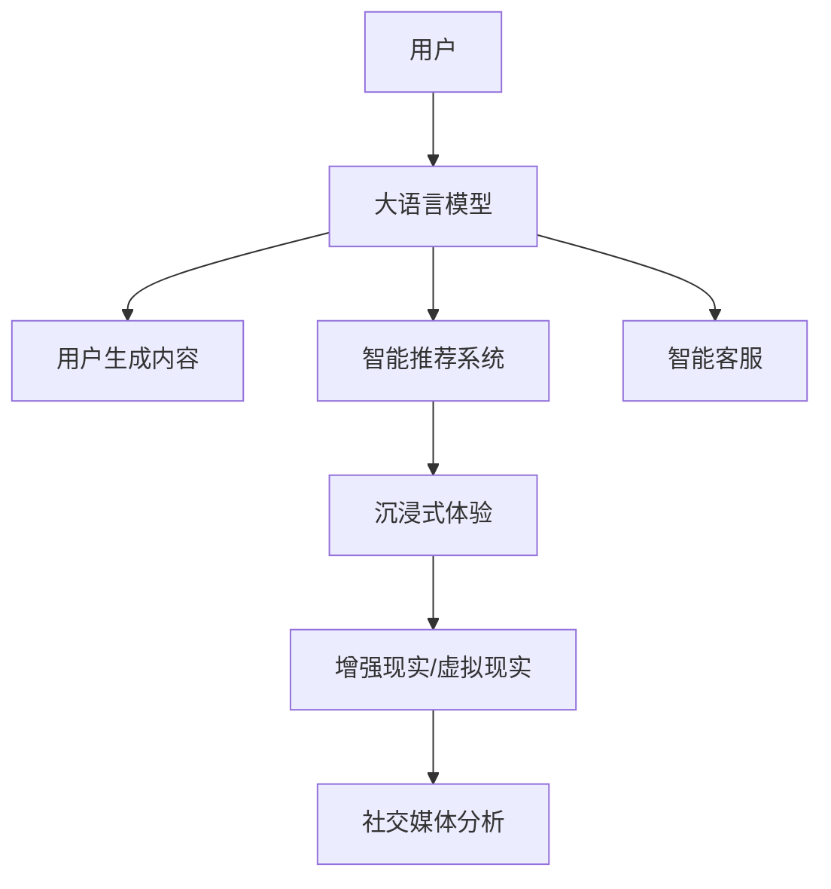

                 

# 在线娱乐与 LLM：互动、沉浸式的内容

> 关键词：大语言模型(LLM), 自然语言处理(NLP), 用户生成内容(UGC), 智能推荐系统, 沉浸式体验, 增强现实(AR), 虚拟现实(VR), 社交媒体

## 1. 背景介绍

### 1.1 问题由来

随着互联网技术的飞速发展，在线娱乐已逐渐成为人们日常生活的重要组成部分。从视频、音乐到游戏、直播，各种形式的娱乐内容层出不穷，极大地丰富了人们的精神文化生活。同时，移动互联网和智能设备的普及，使得用户可以随时随地获取和互动，进一步推动了在线娱乐产业的繁荣。

然而，传统的在线娱乐内容往往以单向传输为主，用户被动接受信息，缺乏互动性和沉浸感。这不仅降低了用户体验，也限制了内容创意的发挥。为了突破这一瓶颈，在线娱乐产业亟需引入更智能、更互动的创新内容形态。

大语言模型（Large Language Models, LLMs）作为当前最先进的自然语言处理（Natural Language Processing, NLP）技术，以其强大的语言理解和生成能力，为在线娱乐内容的创新提供了新的可能性。通过与在线娱乐的深度融合，大语言模型不仅能提供更加丰富、多样的互动体验，还能显著提升内容的智能化和个性化水平，极大地拓展了在线娱乐产业的发展空间。

### 1.2 问题核心关键点

目前，在线娱乐与大语言模型的结合，主要体现在以下几个关键点：

1. **智能推荐系统**：通过分析用户行为和偏好，大语言模型能够实现更加精准和个性化的内容推荐，极大地提升用户体验。
2. **用户生成内容（UGC）**：大语言模型能帮助用户生成高质量、创意性的UGC，丰富内容形态，激发用户参与度。
3. **互动式内容创作**：大语言模型能够辅助用户进行内容创作，如自动生成对话、生成式文本等，提高内容生产的效率和质量。
4. **沉浸式体验**：通过增强现实（AR）和虚拟现实（VR）等技术，大语言模型能构建更加沉浸和互动的内容场景，提升用户沉浸感。
5. **社交媒体分析与智能客服**：大语言模型能帮助社交媒体平台分析用户情感、行为，优化用户体验，同时提升客服系统的智能化水平。

### 1.3 问题研究意义

将大语言模型引入在线娱乐领域，对于提升用户体验、促进内容创新、推动产业升级具有重要意义：

1. **提升用户体验**：大语言模型能提供个性化、智能化的内容推荐，使娱乐内容更符合用户兴趣和需求，极大地提升用户满意度和粘性。
2. **激发内容创意**：通过大语言模型辅助内容生成，用户在娱乐过程中可以创作出更具个性和创意的内容，丰富娱乐形态。
3. **推动产业升级**：大语言模型的引入，将促使在线娱乐产业从传统的单向内容传输向互动、沉浸式内容创作转变，为产业带来新的发展机遇。
4. **促进数据智能**：大语言模型能对用户行为和情感进行深度分析，帮助企业优化运营策略，提升市场竞争力。
5. **赋能新兴技术**：通过与AR/VR等新兴技术的结合，大语言模型能创造更加沉浸和互动的娱乐体验，引领科技潮流。

## 2. 核心概念与联系

### 2.1 核心概念概述

为更好地理解在线娱乐与大语言模型的融合，本节将介绍几个关键概念及其关系：

- **大语言模型 (LLM)**：以自回归模型（如GPT）或自编码模型（如BERT）为代表的大规模预训练语言模型。通过在大规模无标签文本语料上进行预训练，学习到丰富的语言知识和常识，具备强大的语言理解和生成能力。

- **自然语言处理 (NLP)**：研究如何使计算机理解、处理和生成人类语言的技术。大语言模型是NLP技术的核心组成部分，用于处理文本数据的预训练和微调。

- **用户生成内容 (UGC)**：用户在互联网平台上自发生成的内容，如评论、帖子、视频等。大语言模型能够辅助用户生成高质量的UGC，提升内容质量。

- **智能推荐系统**：根据用户的历史行为和偏好，推荐个性化内容的技术。大语言模型通过分析用户意图和上下文，实现更精准的推荐。

- **沉浸式体验**：通过AR/VR等技术，使用户能够沉浸在虚拟或增强现实环境中，提升互动性和体验感。大语言模型能构建更加沉浸和互动的内容场景。

- **增强现实 (AR) 和虚拟现实 (VR)**：利用计算机图形技术，将虚拟内容叠加到现实世界中，或完全构建一个虚拟世界，使用户能以沉浸式方式与内容互动。

这些核心概念之间通过互动、生成的机制，紧密联系在一起，共同构成了大语言模型在在线娱乐领域的创新应用框架。

### 2.2 核心概念原理和架构的 Mermaid 流程图



这个流程图展示了用户与大语言模型互动的全过程：

1. **用户**：通过互动接口与系统交互，提出内容需求或行为指令。
2. **大语言模型**：理解用户意图，辅助生成UGC，优化推荐系统，提供智能客服等。
3. **用户生成内容**：用户通过大语言模型辅助生成UGC，丰富内容形态。
4. **智能推荐系统**：根据用户历史行为，推荐个性化内容。
5. **沉浸式体验**：通过AR/VR技术，使用户沉浸在虚拟或增强现实环境中。
6. **社交媒体分析**：分析用户情感和行为，优化用户体验。
7. **智能客服**：提供智能化的客服服务，提升用户体验。

这些环节通过大语言模型的语言理解和生成能力，形成了一个闭环的互动体系，显著提升了在线娱乐内容的智能化和个性化水平。

## 3. 核心算法原理 & 具体操作步骤

### 3.1 算法原理概述

在线娱乐与大语言模型的结合，本质上是一个基于用户互动和个性化需求的智能内容生成和推荐过程。其核心算法原理可以概括为以下几点：

1. **用户意图理解**：大语言模型通过分析用户行为、文本输入、情感等数据，理解用户的具体需求和偏好。
2. **内容生成与推荐**：基于用户意图，大语言模型辅助生成UGC，并使用推荐算法为用户推荐个性化内容。
3. **沉浸式体验构建**：利用AR/VR技术，构建沉浸式的娱乐场景，增强用户互动性。
4. **社交媒体分析**：通过分析社交媒体上的用户情感、行为数据，优化用户体验。
5. **智能客服**：大语言模型提供智能客服服务，提升用户满意度。

### 3.2 算法步骤详解

在线娱乐与大语言模型的结合，主要包括以下几个关键步骤：

**Step 1: 数据收集与预处理**

- **用户行为数据**：收集用户在平台上的浏览记录、点击行为、评分反馈等数据，形成用户行为数据集。
- **用户生成内容 (UGC)**：收集用户发布的文章、评论、视频等UGC，形成UGC数据集。
- **情感数据**：通过自然语言处理技术，从用户评论、帖子等文本中提取情感信息。

**Step 2: 预训练模型选择与适配**

- **模型选择**：选择合适的预训练语言模型（如GPT、BERT等），作为内容生成和推荐的初始化参数。
- **任务适配**：根据具体任务需求，设计合适的输出层和损失函数，适配大语言模型。

**Step 3: 用户意图理解**

- **意图分析**：通过大语言模型分析用户文本输入、行为数据等，提取用户的具体需求和偏好。
- **上下文建模**：利用大语言模型构建用户上下文，理解用户的行为语境。

**Step 4: 内容生成与推荐**

- **UGC生成**：利用大语言模型辅助用户生成UGC，提升内容质量和多样性。
- **内容推荐**：根据用户意图和上下文，使用推荐算法为用户推荐个性化内容。

**Step 5: 沉浸式体验构建**

- **AR/VR技术**：利用AR/VR技术，构建沉浸式娱乐场景，增强用户互动体验。
- **场景生成**：利用大语言模型生成沉浸式场景的文本描述，辅助场景构建。

**Step 6: 社交媒体分析与智能客服**

- **社交媒体情感分析**：通过大语言模型分析社交媒体上的用户情感、行为数据，优化用户体验。
- **智能客服**：利用大语言模型提供智能客服服务，提升用户满意度。

**Step 7: 模型微调和优化**

- **微调**：在实际应用中，根据反馈数据不断微调模型，提升推荐和生成的精度。
- **优化**：使用优化算法和正则化技术，避免模型过拟合和提高模型泛化能力。

### 3.3 算法优缺点

在线娱乐与大语言模型结合的算法，具有以下优点：

1. **个性化推荐**：通过大语言模型辅助，能够实现更加精准和个性化的内容推荐，提升用户满意度。
2. **用户生成内容 (UGC)**：大语言模型能辅助用户生成高质量、创意性的UGC，丰富内容形态，激发用户参与度。
3. **沉浸式体验**：通过AR/VR技术，构建沉浸式的娱乐场景，增强用户互动性。
4. **智能客服**：提供智能化的客服服务，提升用户体验。

同时，这种结合也存在一些局限性：

1. **资源消耗**：大规模预训练模型的计算资源消耗大，对硬件设备要求较高。
2. **隐私问题**：在收集用户数据和行为信息时，需注意数据隐私和用户权益保护。
3. **依赖标注数据**：高质量的推荐和生成的结果，依赖于大量的标注数据和用户反馈。
4. **内容多样性**：需要持续引入新的内容和场景，才能保持内容的丰富多样。
5. **算法复杂性**：涉及多种技术和算法，如NLP、推荐系统、AR/VR等，需要较强的技术积累。

### 3.4 算法应用领域

在线娱乐与大语言模型结合的算法，已经广泛应用于多个领域：

1. **视频推荐系统**：利用大语言模型对视频内容进行情感分析，推荐用户感兴趣的视频。
2. **游戏内容生成**：通过大语言模型生成游戏剧情、角色对话等，丰富游戏内容。
3. **虚拟主播**：利用大语言模型驱动虚拟主播生成自然流畅的语音和对话，提升用户互动体验。
4. **社交媒体互动**：通过大语言模型分析社交媒体上的用户情感和行为，优化互动体验。
5. **虚拟旅游**：利用大语言模型辅助生成虚拟旅游场景的文本描述，增强用户沉浸感。

这些领域的大规模应用，展示了在线娱乐与大语言模型结合的巨大潜力和广泛应用前景。

## 4. 数学模型和公式 & 详细讲解 & 举例说明

### 4.1 数学模型构建

在线娱乐与大语言模型的结合，可以通过以下数学模型进行描述：

- **用户行为数据**：记用户行为数据集为 $\mathcal{D}=\{(x_i,y_i)\}_{i=1}^N$，其中 $x_i$ 为行为数据，$y_i$ 为行为标签。
- **用户生成内容 (UGC)**：记UGC数据集为 $\mathcal{D}_{UGC}=\{(x_{UGC_i},y_{UGC_i})\}_{i=1}^M$，其中 $x_{UGC_i}$ 为UGC文本，$y_{UGC_i}$ 为UGC标签。
- **情感数据**：记情感数据集为 $\mathcal{D}_{sent}=\{(x_{sent_i},y_{sent_i})\}_{i=1}^K$，其中 $x_{sent_i}$ 为情感文本，$y_{sent_i}$ 为情感标签。
- **社交媒体数据**：记社交媒体数据集为 $\mathcal{D}_{social}=\{(x_{social_i},y_{social_i})\}_{i=1}^L$，其中 $x_{social_i}$ 为社交媒体文本，$y_{social_i}$ 为社交媒体标签。

### 4.2 公式推导过程

以**情感分析**为例，推导大语言模型在情感分析中的应用过程：

假设大语言模型为 $M_{\theta}$，其中 $\theta$ 为模型参数。情感分析的任务是给定情感文本 $x$，预测其情感标签 $y$。情感分析的损失函数为交叉熵损失函数：

$$
\ell(M_{\theta}(x),y) = -y\log M_{\theta}(x) - (1-y)\log(1-M_{\theta}(x))
$$

在实际应用中，可以将情感文本 $x$ 输入到大语言模型 $M_{\theta}$ 中，计算其输出概率 $\hat{y}=M_{\theta}(x)$。利用交叉熵损失函数计算预测结果与真实标签之间的差异，从而得到损失函数：

$$
\mathcal{L}(\theta) = \frac{1}{N}\sum_{i=1}^N \ell(M_{\theta}(x_i),y_i)
$$

利用梯度下降等优化算法，最小化损失函数 $\mathcal{L}$，不断更新模型参数 $\theta$，从而获得最优模型参数 $\hat{\theta}$，实现情感分析任务的微调。

### 4.3 案例分析与讲解

以**视频推荐系统**为例，展示大语言模型在推荐系统中的应用：

假设推荐系统中有 $n$ 个视频，用户历史行为数据为 $\mathcal{D}=\{(x_i,y_i)\}_{i=1}^N$，其中 $x_i$ 为用户的历史观看记录，$y_i$ 为用户的偏好标签。利用大语言模型 $M_{\theta}$ 对视频内容进行情感分析，生成每个视频的情绪评分 $e_j$。推荐算法可以基于情绪评分和用户偏好标签，为用户推荐最可能感兴趣的视频。推荐系统的目标是最小化推荐误差，优化模型参数 $\theta$：

$$
\mathcal{L}(\theta) = \frac{1}{N}\sum_{i=1}^N \ell(M_{\theta}(x_i),y_i)
$$

通过不断优化模型参数 $\theta$，推荐系统能够实现更精准和个性化的内容推荐。

## 5. 项目实践：代码实例和详细解释说明

### 5.1 开发环境搭建

在进行在线娱乐与大语言模型结合的项目实践前，需要准备好开发环境。以下是使用Python进行PyTorch开发的环境配置流程：

1. 安装Anaconda：从官网下载并安装Anaconda，用于创建独立的Python环境。

2. 创建并激活虚拟环境：
```bash
conda create -n pytorch-env python=3.8 
conda activate pytorch-env
```

3. 安装PyTorch：根据CUDA版本，从官网获取对应的安装命令。例如：
```bash
conda install pytorch torchvision torchaudio cudatoolkit=11.1 -c pytorch -c conda-forge
```

4. 安装Transformers库：
```bash
pip install transformers
```

5. 安装各类工具包：
```bash
pip install numpy pandas scikit-learn matplotlib tqdm jupyter notebook ipython
```

完成上述步骤后，即可在`pytorch-env`环境中开始项目实践。

### 5.2 源代码详细实现

下面以视频推荐系统为例，给出使用Transformers库对BERT模型进行情感分析的PyTorch代码实现。

首先，定义情感分析任务的数据处理函数：

```python
from transformers import BertTokenizer
from torch.utils.data import Dataset
import torch

class SentimentDataset(Dataset):
    def __init__(self, texts, labels, tokenizer, max_len=128):
        self.texts = texts
        self.labels = labels
        self.tokenizer = tokenizer
        self.max_len = max_len
        
    def __len__(self):
        return len(self.texts)
    
    def __getitem__(self, item):
        text = self.texts[item]
        label = self.labels[item]
        
        encoding = self.tokenizer(text, return_tensors='pt', max_length=self.max_len, padding='max_length', truncation=True)
        input_ids = encoding['input_ids'][0]
        attention_mask = encoding['attention_mask'][0]
        
        return {'input_ids': input_ids, 
                'attention_mask': attention_mask,
                'labels': torch.tensor(label, dtype=torch.long)}
```

然后，定义模型和优化器：

```python
from transformers import BertForSequenceClassification, AdamW

model = BertForSequenceClassification.from_pretrained('bert-base-cased', num_labels=2)

optimizer = AdamW(model.parameters(), lr=2e-5)
```

接着，定义训练和评估函数：

```python
from torch.utils.data import DataLoader
from tqdm import tqdm
from sklearn.metrics import classification_report

device = torch.device('cuda') if torch.cuda.is_available() else torch.device('cpu')
model.to(device)

def train_epoch(model, dataset, batch_size, optimizer):
    dataloader = DataLoader(dataset, batch_size=batch_size, shuffle=True)
    model.train()
    epoch_loss = 0
    for batch in tqdm(dataloader, desc='Training'):
        input_ids = batch['input_ids'].to(device)
        attention_mask = batch['attention_mask'].to(device)
        labels = batch['labels'].to(device)
        model.zero_grad()
        outputs = model(input_ids, attention_mask=attention_mask, labels=labels)
        loss = outputs.loss
        epoch_loss += loss.item()
        loss.backward()
        optimizer.step()
    return epoch_loss / len(dataloader)

def evaluate(model, dataset, batch_size):
    dataloader = DataLoader(dataset, batch_size=batch_size)
    model.eval()
    preds, labels = [], []
    with torch.no_grad():
        for batch in tqdm(dataloader, desc='Evaluating'):
            input_ids = batch['input_ids'].to(device)
            attention_mask = batch['attention_mask'].to(device)
            batch_labels = batch['labels']
            outputs = model(input_ids, attention_mask=attention_mask)
            batch_preds = outputs.logits.argmax(dim=2).to('cpu').tolist()
            batch_labels = batch_labels.to('cpu').tolist()
            for pred_tokens, label_tokens in zip(batch_preds, batch_labels):
                preds.append(pred_tokens)
                labels.append(label_tokens)
                
    print(classification_report(labels, preds))
```

最后，启动训练流程并在测试集上评估：

```python
epochs = 5
batch_size = 16

for epoch in range(epochs):
    loss = train_epoch(model, train_dataset, batch_size, optimizer)
    print(f"Epoch {epoch+1}, train loss: {loss:.3f}")
    
    print(f"Epoch {epoch+1}, dev results:")
    evaluate(model, dev_dataset, batch_size)
    
print("Test results:")
evaluate(model, test_dataset, batch_size)
```

以上就是使用PyTorch对BERT进行情感分析任务微调的完整代码实现。可以看到，得益于Transformers库的强大封装，我们可以用相对简洁的代码完成BERT模型的加载和微调。

### 5.3 代码解读与分析

让我们再详细解读一下关键代码的实现细节：

**SentimentDataset类**：
- `__init__`方法：初始化文本、标签、分词器等关键组件。
- `__len__`方法：返回数据集的样本数量。
- `__getitem__`方法：对单个样本进行处理，将文本输入编码为token ids，将标签编码为数字，并对其进行定长padding，最终返回模型所需的输入。

**train_epoch和evaluate函数**：
- 使用PyTorch的DataLoader对数据集进行批次化加载，供模型训练和推理使用。
- 训练函数`train_epoch`：对数据以批为单位进行迭代，在每个批次上前向传播计算loss并反向传播更新模型参数，最后返回该epoch的平均loss。
- 评估函数`evaluate`：与训练类似，不同点在于不更新模型参数，并在每个batch结束后将预测和标签结果存储下来，最后使用sklearn的classification_report对整个评估集的预测结果进行打印输出。

**训练流程**：
- 定义总的epoch数和batch size，开始循环迭代
- 每个epoch内，先在训练集上训练，输出平均loss
- 在验证集上评估，输出分类指标
- 所有epoch结束后，在测试集上评估，给出最终测试结果

可以看到，PyTorch配合Transformers库使得BERT微调的代码实现变得简洁高效。开发者可以将更多精力放在数据处理、模型改进等高层逻辑上，而不必过多关注底层的实现细节。

当然，工业级的系统实现还需考虑更多因素，如模型的保存和部署、超参数的自动搜索、更灵活的任务适配层等。但核心的微调范式基本与此类似。

## 6. 实际应用场景

### 6.1 智能推荐系统

大语言模型在智能推荐系统中的应用，主要体现在以下几个方面：

**视频推荐**：利用大语言模型对视频内容进行情感分析，生成每个视频的情绪评分。推荐算法可以基于情绪评分和用户偏好标签，为用户推荐最可能感兴趣的视频。

**音乐推荐**：通过大语言模型分析用户评论和评分，生成音乐风格和情感标签。推荐算法可以根据用户历史行为和标签推荐相似音乐。

**图书推荐**：利用大语言模型分析书评和用户评论，生成书籍内容和风格标签。推荐算法可以根据用户历史阅读行为和标签推荐相似书籍。

### 6.2 用户生成内容（UGC）

用户生成内容（UGC）是在线娱乐的重要组成部分，大语言模型在其中发挥了重要作用：

**自动生成对话**：利用大语言模型生成虚拟角色的对话，提升用户体验。
**生成式文本**：通过大语言模型生成创意性的文章、故事、代码等UGC，丰富内容形态。
**UGC分析**：利用大语言模型分析用户UGC的情感和主题，优化推荐和生成策略。

### 6.3 沉浸式体验

大语言模型与AR/VR技术结合，创造了更加沉浸和互动的娱乐体验：

**虚拟主播**：利用大语言模型驱动虚拟主播生成自然流畅的语音和对话，提升用户互动体验。
**虚拟旅游**：利用大语言模型辅助生成虚拟旅游场景的文本描述，增强用户沉浸感。
**互动游戏**：通过大语言模型生成游戏对话和剧情，丰富游戏内容。

### 6.4 社交媒体分析与智能客服

大语言模型在社交媒体分析和智能客服中的应用，主要体现在以下几个方面：

**情感分析**：通过大语言模型分析社交媒体上的用户情感和行为，优化互动体验。
**智能客服**：利用大语言模型提供智能客服服务，提升用户满意度。

## 7. 工具和资源推荐

### 7.1 学习资源推荐

为了帮助开发者系统掌握在线娱乐与大语言模型的结合理论基础和实践技巧，这里推荐一些优质的学习资源：

1. 《Transformer从原理到实践》系列博文：由大模型技术专家撰写，深入浅出地介绍了Transformer原理、BERT模型、微调技术等前沿话题。

2. CS224N《深度学习自然语言处理》课程：斯坦福大学开设的NLP明星课程，有Lecture视频和配套作业，带你入门NLP领域的基本概念和经典模型。

3. 《Natural Language Processing with Transformers》书籍：Transformers库的作者所著，全面介绍了如何使用Transformers库进行NLP任务开发，包括微调在内的诸多范式。

4. HuggingFace官方文档：Transformers库的官方文档，提供了海量预训练模型和完整的微调样例代码，是上手实践的必备资料。

5. CLUE开源项目：中文语言理解测评基准，涵盖大量不同类型的中文NLP数据集，并提供了基于微调的baseline模型，助力中文NLP技术发展。

通过对这些资源的学习实践，相信你一定能够快速掌握在线娱乐与大语言模型结合的精髓，并用于解决实际的NLP问题。
###  7.2 开发工具推荐

高效的开发离不开优秀的工具支持。以下是几款用于在线娱乐与大语言模型结合开发的常用工具：

1. PyTorch：基于Python的开源深度学习框架，灵活动态的计算图，适合快速迭代研究。大部分预训练语言模型都有PyTorch版本的实现。

2. TensorFlow：由Google主导开发的开源深度学习框架，生产部署方便，适合大规模工程应用。同样有丰富的预训练语言模型资源。

3. Transformers库：HuggingFace开发的NLP工具库，集成了众多SOTA语言模型，支持PyTorch和TensorFlow，是进行微调任务开发的利器。

4. Weights & Biases：模型训练的实验跟踪工具，可以记录和可视化模型训练过程中的各项指标，方便对比和调优。与主流深度学习框架无缝集成。

5. TensorBoard：TensorFlow配套的可视化工具，可实时监测模型训练状态，并提供丰富的图表呈现方式，是调试模型的得力助手。

6. Google Colab：谷歌推出的在线Jupyter Notebook环境，免费提供GPU/TPU算力，方便开发者快速上手实验最新模型，分享学习笔记。

合理利用这些工具，可以显著提升在线娱乐与大语言模型结合任务的开发效率，加快创新迭代的步伐。

### 7.3 相关论文推荐

在线娱乐与大语言模型结合的研究源于学界的持续研究。以下是几篇奠基性的相关论文，推荐阅读：

1. Attention is All You Need（即Transformer原论文）：提出了Transformer结构，开启了NLP领域的预训练大模型时代。

2. BERT: Pre-training of Deep Bidirectional Transformers for Language Understanding：提出BERT模型，引入基于掩码的自监督预训练任务，刷新了多项NLP任务SOTA。

3. Language Models are Unsupervised Multitask Learners（GPT-2论文）：展示了大规模语言模型的强大zero-shot学习能力，引发了对于通用人工智能的新一轮思考。

4. Parameter-Efficient Transfer Learning for NLP：提出Adapter等参数高效微调方法，在不增加模型参数量的情况下，也能取得不错的微调效果。

5. Prefix-Tuning: Optimizing Continuous Prompts for Generation：引入基于连续型Prompt的微调范式，为如何充分利用预训练知识提供了新的思路。

6. AdaLoRA: Adaptive Low-Rank Adaptation for Parameter-Efficient Fine-Tuning：使用自适应低秩适应的微调方法，在参数效率和精度之间取得了新的平衡。

这些论文代表了大语言模型与在线娱乐结合的发展脉络。通过学习这些前沿成果，可以帮助研究者把握学科前进方向，激发更多的创新灵感。

## 8. 总结：未来发展趋势与挑战

### 8.1 总结

本文对在线娱乐与大语言模型的结合进行了全面系统的介绍。首先阐述了在线娱乐和现代大语言模型的发展背景和意义，明确了微调技术在提升用户体验、促进内容创新、推动产业升级方面的独特价值。其次，从原理到实践，详细讲解了在线娱乐与大语言模型的结合算法原理和关键步骤，给出了微调任务开发的完整代码实例。同时，本文还广泛探讨了在线娱乐与大语言模型结合在视频推荐、用户生成内容、沉浸式体验、社交媒体分析与智能客服等多个领域的应用前景，展示了微调范式的巨大潜力。此外，本文精选了微调技术的各类学习资源，力求为读者提供全方位的技术指引。

通过本文的系统梳理，可以看到，在线娱乐与大语言模型结合，通过智能推荐、用户生成内容、沉浸式体验等多重创新，正在改变传统娱乐内容的表现形式，引领娱乐行业的数字化转型。未来，伴随大语言模型的持续演进和技术的不断突破，在线娱乐与大语言模型的结合将带来更多的应用可能，为人们提供更加丰富、多样的娱乐体验。

### 8.2 未来发展趋势

展望未来，在线娱乐与大语言模型结合的技术将呈现以下几个发展趋势：

1. **内容个性化推荐**：随着用户数据的积累，在线娱乐内容推荐将更加个性化、精准化，提升用户体验。
2. **用户生成内容（UGC）创新**：利用大语言模型生成UGC，将进一步丰富娱乐形态，激发用户创造力。
3. **沉浸式娱乐体验**：AR/VR技术的结合，将创造更加沉浸、互动的娱乐体验，增强用户沉浸感。
4. **社交媒体智能分析**：通过大语言模型分析社交媒体情感和行为，优化用户体验，提升服务质量。
5. **智能客服服务**：利用大语言模型提供智能客服服务，提升用户满意度。
6. **多模态内容创作**：结合视觉、音频等多模态数据，创造更加丰富多样的内容形态。

以上趋势凸显了在线娱乐与大语言模型结合技术的广阔前景。这些方向的探索发展，将进一步提升在线娱乐内容的多样性、互动性和个性化水平，为娱乐产业带来新的发展机遇。

### 8.3 面临的挑战

尽管在线娱乐与大语言模型结合技术已经取得了显著成就，但在迈向更加智能化、普适化应用的过程中，仍面临以下挑战：

1. **数据隐私和安全**：在收集用户数据和行为信息时，需注意数据隐私和用户权益保护，避免数据泄露和滥用。
2. **模型资源消耗**：大规模预训练模型的计算资源消耗大，对硬件设备要求较高，需优化算法和资源使用，降低计算成本。
3. **推荐精度和多样性**：需要持续优化推荐算法，平衡推荐精度和内容多样性，避免内容同质化。
4. **用户交互界面设计**：需要设计更加自然、易用的用户交互界面，提升用户互动体验。
5. **内容伦理和规范**：需制定合理的算法规范，确保内容健康、积极，避免有害信息的传播。

这些挑战需要通过技术、算法和伦理等多方面的协同努力，才能有效应对和解决。只有克服这些挑战，才能实现在线娱乐与大语言模型的深度融合，推动行业健康、可持续发展。

### 8.4 研究展望

面对在线娱乐与大语言模型结合所面临的挑战，未来的研究需要在以下几个方面寻求新的突破：

1. **数据隐私保护**：探索差分隐私、联邦学习等隐私保护技术，确保用户数据的安全和隐私。
2. **轻量级模型优化**：开发更加轻量级的模型架构和优化算法，降低计算资源消耗，提升模型性能。
3. **个性化推荐优化**：引入更多推荐算法和优化方法，如协同过滤、基于图的推荐等，提升推荐精度和多样性。
4. **用户交互界面设计**：设计更加自然、易用的用户交互界面，提升用户互动体验。
5. **内容伦理规范**：制定合理的算法规范和伦理指南，确保内容健康、积极，避免有害信息的传播。
6. **多模态内容创作**：探索视觉、音频等多模态数据的深度融合，创造更加丰富多样的内容形态。

这些研究方向将引领在线娱乐与大语言模型结合技术的持续演进，推动娱乐行业的智能化和普适化发展，为人们提供更加丰富、多样、健康、积极的娱乐体验。

## 9. 附录：常见问题与解答

**Q1：在线娱乐与大语言模型结合是否适用于所有娱乐内容？**

A: 在线娱乐与大语言模型结合主要适用于那些具有交互性和智能化的娱乐内容，如视频、游戏、直播等。对于一些单向传输的娱乐形式，如纯文本博客、音乐播放等，大语言模型的应用价值相对有限。

**Q2：大语言模型如何提升在线娱乐的个性化推荐？**

A: 大语言模型能够通过分析用户行为和偏好，生成更精准和个性化的推荐内容。具体步骤包括：

1. 收集用户历史行为数据，构建用户行为特征。
2. 利用大语言模型对娱乐内容进行情感分析，生成内容情感标签。
3. 根据用户行为特征和内容情感标签，使用推荐算法为用户推荐个性化内容。

**Q3：大语言模型在用户生成内容（UGC）中起什么作用？**

A: 大语言模型能够辅助用户生成高质量、创意性的UGC，提升内容质量。具体步骤包括：

1. 收集用户输入的文本数据，如评论、帖子等。
2. 利用大语言模型生成文本补全、纠错、翻译等辅助信息。
3. 结合用户输入和辅助信息，生成最终UGC文本。

**Q4：大语言模型与AR/VR技术的结合如何实现沉浸式体验？**

A: 大语言模型与AR/VR技术的结合，主要通过以下方式实现沉浸式体验：

1. 利用大语言模型生成沉浸式场景的文本描述，辅助场景构建。
2. 在AR/VR场景中，利用大语言模型生成自然流畅的对话和剧情，增强用户互动性。
3. 利用大语言模型对用户行为进行情感分析，优化AR/VR体验。

**Q5：大语言模型在社交媒体分析中起什么作用？**

A: 大语言模型在社交媒体分析中的应用，主要体现在以下几个方面：

1. 分析社交媒体上的用户情感和行为数据，优化用户体验。
2. 利用大语言模型进行情感分析和内容生成，提升社交媒体平台的互动性。
3. 通过分析社交媒体上的热门话题和趋势，优化内容推荐和广告投放策略。

**Q6：大语言模型在智能客服中的作用是什么？**

A: 大语言模型在智能客服中的应用，主要体现在以下几个方面：

1. 利用大语言模型理解用户意图，生成自然流畅的回复。
2. 通过情感分析，优化客服机器人对用户情感的响应。
3. 利用大语言模型进行知识库检索和推理，提升客服系统的智能化水平。

以上问题与解答，希望能帮助读者更好地理解在线娱乐与大语言模型结合的原理和应用，推动相关技术的进一步发展。

---

作者：禅与计算机程序设计艺术 / Zen and the Art of Computer Programming

