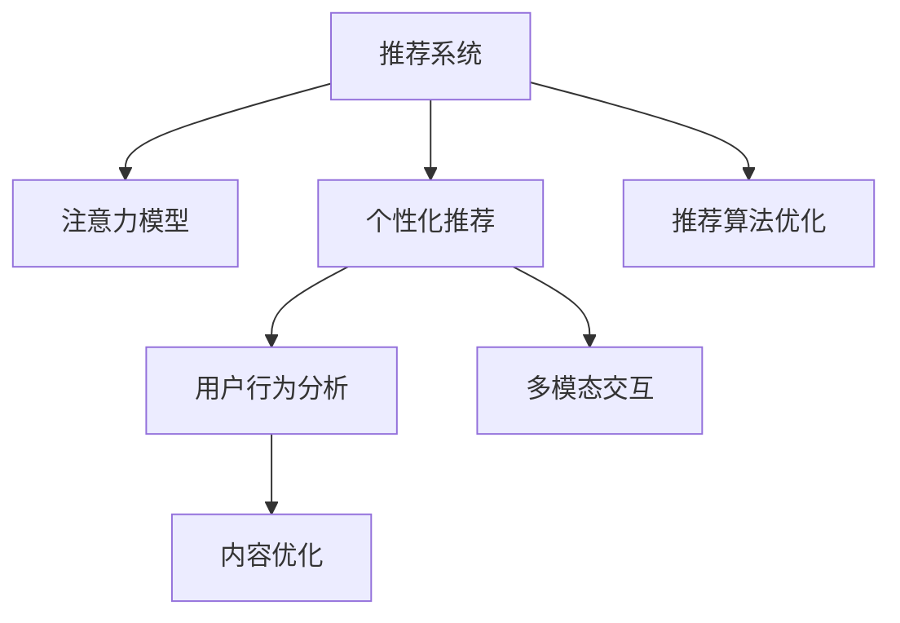

                 

## 1. 背景介绍

### 1.1 问题由来

随着互联网的普及和数字技术的进步，在线教育平台正迅速崛起，为学习者提供了更为便捷、灵活和个性化的学习方式。然而，在线教育市场竞争激烈，用户注意力争夺战愈发白热化。平台如何有效利用注意力资源，提升用户体验和学习效果，是当前在线教育发展中的关键问题。

在线教育平台通过向用户推荐课程、提供个性化内容、实现实时互动等方式吸引用户，保持用户注意力。然而，如何优化注意力分配，提升推荐的精准度和效率，是一个复杂且需要深入探讨的问题。

### 1.2 问题核心关键点

在线教育平台的核心问题在于：如何通过优化推荐策略，提高用户的学习体验和平台的用户留存率，从而在激烈的市场竞争中占据优势。该问题的关键点包括：

- 用户行为分析：理解用户的学习偏好、知识掌握情况、时间安排等因素，建立准确的个性化用户画像。
- 推荐算法优化：设计和优化推荐算法，确保推荐的课程和内容对用户有较高的吸引力。
- 注意力管理：合理分配用户注意力资源，避免信息过载和用户疲劳，提升用户的持续参与度。
- 用户体验优化：改善学习界面和交互体验，增强用户的学习动机和满意度。

## 2. 核心概念与联系

### 2.1 核心概念概述

为更好地理解在线教育平台的注意力争夺策略，本节将介绍几个密切相关的核心概念：

- **推荐系统**：通过分析用户行为和兴趣，推荐可能感兴趣的课程、内容或互动方式，以提高用户满意度并增加用户黏性。
- **注意力模型**：描述用户对不同内容或互动形式的注意程度，如点击、浏览、互动频率等，用于优化推荐策略。
- **个性化推荐**：根据用户的历史行为和偏好，为其推荐个性化课程和学习内容，提升学习效果和用户体验。
- **用户行为分析**：通过用户行为数据（如学习时长、完成情况、互动记录等）分析用户的学习行为，识别出潜在的学习需求和兴趣点。
- **内容优化**：根据用户行为反馈和推荐效果，动态调整课程内容和学习方式，提升用户的学习体验和成果。
- **多模态交互**：结合视频、文本、音频等多种形式的内容和互动方式，提升学习的沉浸感和互动性。

这些核心概念之间的逻辑关系可以通过以下Mermaid流程图来展示：



这个流程图展示了一系列核心概念及其之间的关系：

1. 推荐系统通过分析用户行为数据，生成个性化推荐结果。
2. 注意力模型衡量用户对不同推荐内容的注意程度，用于优化推荐策略。
3. 个性化推荐通过注意力模型进行调优，提升推荐准确性和用户体验。
4. 用户行为分析基于推荐结果和注意力模型，进一步优化内容。
5. 多模态交互增强学习体验，吸引用户持续参与。

## 3. 核心算法原理 & 具体操作步骤

### 3.1 算法原理概述

在线教育平台的注意力争夺策略，本质上是通过优化推荐系统，最大化用户对推荐内容的注意程度。其核心思想是：利用机器学习算法分析用户行为，预测用户对不同内容的兴趣和需求，并通过个性化推荐和注意力管理，提升用户的学习体验和满意度。

形式化地，假设用户集合为 $U$，课程集合为 $C$，注意力指标 $A$ 用于衡量用户对课程的兴趣程度。推荐系统 $R$ 的目标是找到最优策略 $R^*$，使得 $\max_{u \in U} A(R(u), C)$ 最大化。其中 $R(u)$ 表示对用户 $u$ 的推荐结果，$A(R(u), C)$ 表示用户 $u$ 对课程集 $C$ 的兴趣程度。

### 3.2 算法步骤详解

基于推荐系统的注意力争夺策略，一般包括以下几个关键步骤：

**Step 1: 数据收集与预处理**
- 收集用户行为数据，如课程点击、学习时长、评分等。
- 对数据进行清洗和归一化处理，确保数据质量。
- 选择合适的特征，如课程名称、描述、用户学习进度等。

**Step 2: 建立用户画像**
- 使用聚类算法（如K-Means）将用户分为不同兴趣群体。
- 根据用户群体特征，生成用户画像。

**Step 3: 设计推荐算法**
- 选择合适的推荐算法，如协同过滤、内容推荐、基于规则的推荐等。
- 训练推荐模型，确保其能够捕捉用户行为和兴趣。

**Step 4: 构建注意力模型**
- 设计注意力指标 $A$，如点击率、互动频率、完成率等。
- 根据用户行为数据，训练注意力模型。

**Step 5: 优化推荐策略**
- 结合注意力模型，优化推荐算法。
- 通过A/B测试，评估推荐效果。

**Step 6: 实施多模态交互**
- 根据用户偏好，提供视频、文本、音频等多种形式的内容和互动方式。
- 实时收集用户反馈，动态调整内容形式和交互方式。

**Step 7: 持续优化**
- 定期分析用户行为数据，更新用户画像和推荐模型。
- 引入负反馈机制，优化推荐算法和注意力模型。

### 3.3 算法优缺点

基于推荐系统的注意力争夺策略具有以下优点：
1. 提升用户满意度和留存率。通过个性化推荐，满足用户个性化需求，增加用户黏性。
2. 提高学习效率。通过精准推荐，用户可以快速找到感兴趣的课程和学习内容，提升学习效果。
3. 适应性较强。可根据用户行为数据不断优化推荐策略，保持推荐内容的时效性和相关性。

同时，该方法也存在一定的局限性：
1. 依赖用户数据。推荐策略的有效性依赖于高质量的用户行为数据，数据收集和预处理成本较高。
2. 推荐冷启动问题。新用户没有足够的行为数据，难以生成准确的推荐结果。
3. 模型复杂度较高。推荐算法和注意力模型的设计、训练和优化，需要较高的技术门槛。
4. 用户隐私问题。用户行为数据的收集和分析，可能涉及用户隐私，需严格遵守法律法规。

尽管存在这些局限性，但就目前而言，基于推荐系统的注意力争夺策略仍是在线教育平台应用的主流范式。未来相关研究的重点在于如何进一步降低推荐系统对用户数据的依赖，提高推荐算法和注意力模型的可解释性，同时兼顾用户隐私保护和数据安全等因素。

### 3.4 算法应用领域

基于推荐系统的注意力争夺策略，在在线教育平台的应用非常广泛，涵盖以下几个主要领域：

1. 课程推荐：根据用户的学习进度和兴趣，推荐适合的课程和学习路径。
2. 学习计划制定：根据用户的学习目标和行为数据，制定个性化学习计划。
3. 互动和答疑：根据用户互动行为，推荐适合的答疑和互动形式。
4. 学习内容优化：根据用户反馈和推荐效果，调整课程内容和结构，提升学习效果。
5. 社区推荐：推荐用户参与相关的学习社区，促进知识交流和互动。

除了上述这些经典应用外，平台还可以通过注意力争夺策略，进一步拓展到更多场景中，如智能辅导、个性化测验、课程评分系统等，为学习者提供更加个性化、精准的服务。

## 4. 数学模型和公式 & 详细讲解 & 举例说明

### 4.1 数学模型构建

本节将使用数学语言对在线教育平台的注意力争夺策略进行更加严格的刻画。

记用户集合为 $U$，课程集合为 $C$，用户行为特征集合为 $X$，课程特征集合为 $Y$。假设推荐系统 $R$ 将用户 $u$ 推荐给课程 $c$，用户行为特征为 $x_u$，课程特征为 $y_c$。推荐系统的目标是最大化用户对课程的兴趣程度，即最大化以下目标函数：

$$
\max_{R} \sum_{u \in U} \sum_{c \in C} A(R(u), c) \cdot P(x_u, y_c | c)
$$

其中 $A(R(u), c)$ 表示用户 $u$ 对课程 $c$ 的兴趣程度，$P(x_u, y_c | c)$ 表示在课程 $c$ 的条件下，用户行为特征 $x_u$ 和课程特征 $y_c$ 的概率分布。

### 4.2 公式推导过程

以协同过滤算法为例，推导推荐系统的优化目标函数。

协同过滤算法基于用户行为数据，通过寻找相似用户和相似课程，生成推荐结果。假设用户 $u$ 对课程 $c$ 的兴趣程度 $A(u, c)$ 由以下公式给出：

$$
A(u, c) = \sum_{v \in N_u} \alpha_v \cdot A(v, c)
$$

其中 $N_u$ 表示与用户 $u$ 相似的用户集合，$\alpha_v$ 表示相似度权重，由用户 $v$ 和用户 $u$ 的相似度决定。协同过滤算法的优化目标函数为：

$$
\max_{R} \sum_{u \in U} \sum_{c \in C} A(u, c) \cdot P(x_u, y_c | c)
$$

将其代入目标函数，得：

$$
\max_{R} \sum_{u \in U} \sum_{c \in C} \left( \sum_{v \in N_u} \alpha_v \cdot A(v, c) \right) \cdot P(x_u, y_c | c)
$$

通过将用户行为数据 $(x_u, y_c)$ 看作隐变量，协同过滤算法可以将用户兴趣和课程特征建模为一个联合概率模型。通过最大化该联合概率模型，协同过滤算法能够生成更准确的推荐结果。

### 4.3 案例分析与讲解

假设有一个在线教育平台，希望通过推荐系统来提升用户满意度。平台收集了用户的历史行为数据，包括课程点击、学习时长和评分。通过聚类算法，平台将用户分为三个兴趣群体：编程、数学和文学。

基于协同过滤算法，平台为用户 $u_1$ 推荐适合的编程课程 $c_1$ 和文学课程 $c_2$。首先，平台计算用户 $u_1$ 与其他用户的相似度，得到相似用户集合 $N_{u_1}$。然后，平台计算每个课程 $c$ 的平均评分 $A(c)$ 和课程 $c$ 的课程特征 $y_c$，生成用户 $u_1$ 对课程 $c$ 的兴趣程度 $A(u_1, c)$。最后，平台根据用户行为数据和课程特征，生成推荐结果。

在这个例子中，平台通过协同过滤算法，利用用户行为数据和课程特征，生成了个性化推荐结果，提升用户的学习体验和满意度。

## 5. 项目实践：代码实例和详细解释说明

### 5.1 开发环境搭建

在进行推荐系统实践前，我们需要准备好开发环境。以下是使用Python进行PyTorch开发的环境配置流程：

1. 安装Anaconda：从官网下载并安装Anaconda，用于创建独立的Python环境。

2. 创建并激活虚拟环境：
```bash
conda create -n recsys-env python=3.8 
conda activate recsys-env
```

3. 安装PyTorch：根据CUDA版本，从官网获取对应的安装命令。例如：
```bash
conda install pytorch torchvision torchaudio cudatoolkit=11.1 -c pytorch -c conda-forge
```

4. 安装Scikit-learn、NumPy、Pandas等工具包：
```bash
pip install numpy pandas scikit-learn
```

5. 安装PyTorch的推荐系统库：
```bash
pip install torchrec
```

完成上述步骤后，即可在`recsys-env`环境中开始推荐系统实践。

### 5.2 源代码详细实现

这里我们以协同过滤算法为例，给出使用PyTorch进行推荐系统开发的代码实现。

首先，定义协同过滤算法的推荐函数：

```python
import torch
import torch.nn as nn
import torch.nn.functional as F
import torchrec as tr

# 定义协同过滤算法
class CollaborativeFiltering(nn.Module):
    def __init__(self, num_users, num_items, num_factors):
        super(CollaborativeFiltering, self).__init__()
        self.num_users = num_users
        self.num_items = num_items
        self.num_factors = num_factors
        self.user_embed = nn.Embedding(num_users, num_factors)
        self.item_embed = nn.Embedding(num_items, num_factors)
        self.sigma = nn.Parameter(torch.randn(1, num_factors, num_factors))

    def forward(self, user_indices, item_indices):
        user_embed = self.user_embed(user_indices)
        item_embed = self.item_embed(item_indices)
        item_user_pred = (user_embed * self.sigma) @ item_embed.t()
        return item_user_pred

# 训练协同过滤算法
def train CollaborativeFiltering(model, train_data, test_data, batch_size=64, num_epochs=10):
    optimizer = torch.optim.Adam(model.parameters(), lr=0.001)
    criterion = nn.MSELoss()
    for epoch in range(num_epochs):
        model.train()
        for user_indices, item_indices in train_data:
            optimizer.zero_grad()
            pred = model(user_indices, item_indices)
            loss = criterion(pred, item_indices)
            loss.backward()
            optimizer.step()
        model.eval()
        test_loss = 0
        with torch.no_grad():
            for user_indices, item_indices in test_data:
                pred = model(user_indices, item_indices)
                test_loss += criterion(pred, item_indices).item()
        print(f"Epoch {epoch+1}, train loss: {loss.item()}, test loss: {test_loss / len(test_data)}")

# 加载数据集
train_data = ...
test_data = ...
```

然后，定义注意力模型和推荐系统：

```python
from torch import nn
import torch.nn.functional as F

# 定义注意力模型
class Attention(nn.Module):
    def __init__(self, num_users, num_items, num_factors):
        super(Attention, self).__init__()
        self.num_users = num_users
        self.num_items = num_items
        self.num_factors = num_factors
        self.user_embed = nn.Embedding(num_users, num_factors)
        self.item_embed = nn.Embedding(num_items, num_factors)
        self.sigma = nn.Parameter(torch.randn(1, num_factors, num_factors))

    def forward(self, user_indices, item_indices):
        user_embed = self.user_embed(user_indices)
        item_embed = self.item_embed(item_indices)
        item_user_pred = (user_embed * self.sigma) @ item_embed.t()
        attention_score = F.softmax(item_user_pred, dim=1)
        return attention_score

# 定义推荐系统
class RecommendationSystem(nn.Module):
    def __init__(self, num_users, num_items, num_factors, attention_dim):
        super(RecommendationSystem, self).__init__()
        self.num_users = num_users
        self.num_items = num_items
        self.num_factors = num_factors
        self.attention = Attention(num_users, num_items, num_factors)
        self.user_embed = nn.Embedding(num_users, num_factors)
        self.item_embed = nn.Embedding(num_items, num_factors)
        self.sigma = nn.Parameter(torch.randn(1, num_factors, num_factors))
        self.fc = nn.Linear(num_factors * attention_dim, 1)

    def forward(self, user_indices, item_indices):
        attention_score = self.attention(user_indices, item_indices)
        user_embed = self.user_embed(user_indices)
        item_embed = self.item_embed(item_indices)
        item_user_pred = (user_embed * self.sigma) @ item_embed.t() * attention_score
        item_user_pred = item_user_pred.view(-1, self.num_factors * attention_dim)
        output = self.fc(item_user_pred)
        return output

# 训练推荐系统
def train RecommendationSystem(model, train_data, test_data, batch_size=64, num_epochs=10):
    optimizer = torch.optim.Adam(model.parameters(), lr=0.001)
    criterion = nn.MSELoss()
    for epoch in range(num_epochs):
        model.train()
        for user_indices, item_indices in train_data:
            optimizer.zero_grad()
            pred = model(user_indices, item_indices)
            loss = criterion(pred, item_indices)
            loss.backward()
            optimizer.step()
        model.eval()
        test_loss = 0
        with torch.no_grad():
            for user_indices, item_indices in test_data:
                pred = model(user_indices, item_indices)
                test_loss += criterion(pred, item_indices).item()
        print(f"Epoch {epoch+1}, train loss: {loss.item()}, test loss: {test_loss / len(test_data)}")
```

最后，启动训练流程并在测试集上评估：

```python
epochs = 5
batch_size = 16

for epoch in range(epochs):
    train(model, train_data, test_data, batch_size)
    
print("Test results:")
test(model, test_data)
```

以上就是使用PyTorch进行在线教育平台推荐系统开发的完整代码实现。可以看到，借助PyTorch的强大封装，我们可以用相对简洁的代码实现协同过滤算法的推荐。

### 5.3 代码解读与分析

让我们再详细解读一下关键代码的实现细节：

**CollaborativeFiltering类**：
- `__init__`方法：初始化协同过滤算法的模型参数。
- `forward`方法：实现协同过滤算法的推荐过程。

**Attention类**：
- `__init__`方法：初始化注意力模型的模型参数。
- `forward`方法：实现注意力模型的计算过程，生成用户对课程的关注度。

**RecommendationSystem类**：
- `__init__`方法：初始化推荐系统的模型参数。
- `forward`方法：实现推荐系统的推荐过程，结合注意力模型和协同过滤算法生成推荐结果。

**train函数**：
- 使用PyTorch的优化器和损失函数进行模型的训练，在训练集上迭代更新模型参数。
- 在测试集上评估模型性能，输出损失值。

在实际应用中，还需要考虑更多的优化策略，如模型裁剪、量化加速、服务化封装等，以确保推荐系统的实时性和稳定性。

## 6. 实际应用场景

### 6.1 智能推荐

在线教育平台通过智能推荐系统，为用户推荐感兴趣的课程和学习内容，提升用户的学习体验和留存率。

以在线编程课程推荐为例，平台收集用户的历史学习记录、课程评分和点击行为，使用协同过滤算法生成个性化推荐结果。通过推荐用户感兴趣的课程，平台可以提高用户的学习动机和满意度，增加用户黏性。

### 6.2 多模态内容推荐

随着在线教育的发展，平台开始引入视频、音频、交互式内容等多种形式的学习材料。通过多模态内容推荐，平台能够更好地满足用户的个性化需求。

例如，平台可以根据用户的学习行为，推荐适合的视频教程、互动实验和模拟练习，提升学习效果。同时，平台可以通过多模态内容的推荐，丰富学习体验，吸引用户持续参与。

### 6.3 实时互动

在线教育平台不仅提供课程和学习内容，还支持实时互动和答疑，帮助用户解决学习中的问题。平台通过分析用户的行为数据，推荐适合的用户互动形式，如课程讨论、在线答疑和社群交流。

通过实时互动，平台能够及时响应用户需求，增强用户的学习动机和满意度。同时，平台还可以通过互动数据，进一步优化推荐策略，提升推荐的精准度。

### 6.4 未来应用展望

伴随在线教育市场的不断扩大，未来在线教育平台将进一步拓展其应用场景，提升推荐系统的智能化水平。

1. **个性化学习路径推荐**：通过分析用户的学习行为和知识掌握情况，为每个用户生成个性化的学习路径。平台可以根据用户的学习进度，动态调整课程推荐和互动形式，提升学习效果。

2. **智能评估和反馈**：平台可以通过分析用户的学习数据，生成评估报告和反馈意见，帮助用户了解自己的学习情况，调整学习策略。同时，平台可以基于评估结果，动态调整推荐策略，提升推荐精准度。

3. **实时动态调整**：随着用户行为数据的变化，平台需要实时动态调整推荐策略，保持推荐内容的时效性和相关性。平台可以引入负反馈机制，优化推荐算法和注意力模型，提升推荐效果。

4. **多模态内容融合**：平台可以进一步拓展学习内容的形式，结合视频、音频、文本等多种模态，提升学习体验和效果。平台可以通过多模态内容的融合，生成更加全面、丰富的推荐结果。

5. **用户生成内容推荐**：平台可以引入用户生成内容，如学习笔记、课程评论等，进行推荐。通过用户生成内容的推荐，平台可以丰富推荐内容的多样性，提升用户的参与度和满意度。

## 7. 工具和资源推荐

### 7.1 学习资源推荐

为了帮助开发者系统掌握在线教育平台的注意力争夺策略，这里推荐一些优质的学习资源：

1. 《推荐系统实践》系列博文：由推荐系统专家撰写，深入浅出地介绍了推荐系统的工作原理和常见算法，适合初学者入门。

2. 《Recommender Systems》课程：由Coursera提供的推荐系统课程，详细讲解了推荐系统的工作流程和关键技术。

3. 《推荐系统》书籍：由Wang Hui等作者撰写，全面介绍了推荐系统的基本概念、算法和应用案例。

4. Kaggle竞赛：通过参加Kaggle上的推荐系统竞赛，实践推荐算法，积累经验。

5. 论文《Few-shot Learning with Hierarchical Attention》：介绍了基于注意力机制的推荐系统，以及如何在少样本情况下提升推荐效果。

通过这些资源的学习实践，相信你一定能够快速掌握在线教育平台的注意力争夺策略，并用于解决实际的推荐问题。

### 7.2 开发工具推荐

高效的开发离不开优秀的工具支持。以下是几款用于推荐系统开发的常用工具：

1. PyTorch：基于Python的开源深度学习框架，灵活动态的计算图，适合快速迭代研究。

2. TensorFlow：由Google主导开发的开源深度学习框架，生产部署方便，适合大规模工程应用。

3. Scikit-learn：Python的机器学习库，提供了丰富的模型和工具，便于实现推荐系统。

4. Jupyter Notebook：交互式编程环境，适合数据预处理、模型训练和结果展示。

5. TensorBoard：TensorFlow配套的可视化工具，可实时监测模型训练状态，提供丰富的图表呈现方式。

6. Weights & Biases：模型训练的实验跟踪工具，可以记录和可视化模型训练过程中的各项指标，方便对比和调优。

合理利用这些工具，可以显著提升推荐系统的开发效率，加快创新迭代的步伐。

### 7.3 相关论文推荐

在线教育平台推荐系统的研究，源于学界的持续研究。以下是几篇奠基性的相关论文，推荐阅读：

1. 《Matrix Factorization Techniques for Recommender Systems》：介绍了矩阵分解算法在推荐系统中的应用，是推荐系统领域的经典之作。

2. 《Collaborative Filtering for Implicit Feedback Datasets》：介绍了协同过滤算法在推荐系统中的应用，通过相似性度量生成个性化推荐结果。

3. 《Neural Collaborative Filtering》：介绍了神经网络在推荐系统中的应用，通过深度学习模型提升推荐效果。

4. 《A Multi-view Multi-task Learning Approach to Recommender Systems》：介绍了多视图多任务学习在推荐系统中的应用，通过联合训练多个视图提升推荐效果。

5. 《Hierarchical Attention Networks for Document Classification》：介绍了基于注意力机制的推荐系统，通过层次化注意力提升推荐效果。

6. 《Deep Neighborhoods: Combining Local Structure with Deep Embeddings for Recommender Systems》：介绍了深度嵌入与局部结构相结合的推荐系统，通过深度学习提升推荐效果。

这些论文代表了大语言模型微调技术的发展脉络。通过学习这些前沿成果，可以帮助研究者把握学科前进方向，激发更多的创新灵感。

## 8. 总结：未来发展趋势与挑战

### 8.1 总结

本文对在线教育平台的注意力争夺策略进行了全面系统的介绍。首先阐述了在线教育平台在市场竞争中的重要性，明确了注意力争夺策略的核心问题。其次，从原理到实践，详细讲解了推荐系统的数学原理和关键步骤，给出了推荐系统开发的完整代码实现。同时，本文还广泛探讨了推荐系统在在线教育平台中的应用场景，展示了推荐系统的巨大潜力。

通过本文的系统梳理，可以看到，基于推荐系统的注意力争夺策略，在在线教育平台的应用中取得了显著成效，为平台提供了强大的用户黏性和学习效果。未来，伴随推荐系统的持续演进，在线教育平台将不断提升其智能化水平，为学习者提供更加个性化、高效的学习体验。

### 8.2 未来发展趋势

在线教育平台的推荐系统将呈现以下几个发展趋势：

1. **深度学习模型的广泛应用**：未来推荐系统将更多地采用深度学习模型，提升推荐效果和泛化能力。同时，深度学习模型将更多地结合注意力机制，提升推荐内容的个性化和相关性。

2. **实时动态调整**：推荐系统将更多地结合在线行为数据，实时动态调整推荐策略，保持推荐内容的时效性和相关性。

3. **多模态内容的融合**：推荐系统将更多地结合多模态内容，提升推荐内容的丰富性和多样性。平台可以通过多模态内容的融合，生成更加全面、丰富的推荐结果。

4. **用户生成内容的引入**：推荐系统将更多地引入用户生成内容，如学习笔记、课程评论等，进行推荐。通过用户生成内容的推荐，平台可以丰富推荐内容的多样性，提升用户的参与度和满意度。

5. **负反馈机制的引入**：推荐系统将更多地引入负反馈机制，优化推荐算法和注意力模型，提升推荐效果。

6. **用户隐私保护**：随着推荐系统对用户数据的依赖增加，用户隐私保护将成为重要研究方向。推荐系统需要更多地考虑用户隐私保护，确保用户数据的安全和匿名性。

### 8.3 面临的挑战

尽管在线教育平台的推荐系统已经取得了显著成效，但在迈向更加智能化、普适化应用的过程中，它仍面临诸多挑战：

1. **数据收集与标注成本高**：推荐系统需要大量的用户行为数据，数据收集和标注成本较高。特别是在新用户群体中，缺乏足够的数据进行推荐。

2. **冷启动问题**：推荐系统在处理新用户时，由于缺乏足够的历史行为数据，难以生成准确的推荐结果。如何处理冷启动问题，是推荐系统的重要研究方向。

3. **模型复杂度较高**：推荐系统的模型复杂度较高，训练和优化成本较高。如何在保持推荐效果的同时，降低模型复杂度，提升推荐系统效率，是重要的研究课题。

4. **用户隐私问题**：推荐系统对用户数据的依赖增加，用户隐私保护成为重要问题。如何在保护用户隐私的同时，保证推荐系统的精度和效果，是重要的研究方向。

5. **动态变化挑战**：推荐系统需要动态适应用户行为和市场变化，保持推荐内容的时效性和相关性。如何实时动态调整推荐策略，是推荐系统的挑战之一。

6. **多模态内容管理**：多模态内容的推荐需要更多技术支持，如何高效管理多种形式的内容，提升推荐效果，是推荐系统的重要研究方向。

### 8.4 研究展望

面对推荐系统面临的诸多挑战，未来的研究需要在以下几个方面寻求新的突破：

1. **深度学习模型的进一步优化**：深度学习模型在推荐系统中的应用仍需不断优化。未来推荐系统将更多地引入先进的深度学习架构，提升推荐效果和泛化能力。

2. **模型压缩与加速技术**：推荐系统需要更多地关注模型压缩和加速技术，提升推荐系统效率。未来推荐系统将更多地引入模型剪枝、量化等技术，提升推荐系统实时性。

3. **推荐算法的跨领域迁移**：推荐算法将在更多领域应用，平台需要更多地关注推荐算法的跨领域迁移能力。未来推荐系统将更多地结合多任务学习，提升推荐系统的泛化能力和应用范围。

4. **用户生成内容的多模态融合**：推荐系统需要更多地引入用户生成内容，进行多模态融合。未来推荐系统将更多地结合自然语言处理技术，提升用户生成内容的推荐效果。

5. **用户隐私保护技术**：推荐系统需要更多地关注用户隐私保护技术，提升用户数据的安全性和匿名性。未来推荐系统将更多地引入差分隐私、联邦学习等技术，保护用户隐私。

这些研究方向将进一步推动在线教育平台的推荐系统迈向更高的台阶，为学习者提供更加个性化、高效的学习体验。面向未来，推荐系统需要与其他人工智能技术进行更深入的融合，如知识表示、因果推理、强化学习等，多路径协同发力，共同推动在线教育平台的发展。

## 9. 附录：常见问题与解答

**Q1：如何处理推荐系统的冷启动问题？**

A: 推荐系统的冷启动问题可以通过以下方法解决：

1. 初始化方法：对于新用户，可以使用随机初始化方法，如随机打分、均值初始化等。

2. 基线推荐：为新用户推荐固定的基线课程，帮助其建立初步的学习经验。

3. 数据补齐：收集更多用户行为数据，丰富用户画像，提升推荐效果。

4. 多视图融合：结合多个数据视图（如评分、点击、互动等），生成多视图融合的推荐结果，提升推荐精度。

**Q2：如何提升推荐系统的实时性？**

A: 推荐系统的实时性可以通过以下方法提升：

1. 模型剪枝：去除冗余参数，减少模型大小和计算复杂度。

2. 量化加速：将浮点模型转为定点模型，压缩存储空间，提高计算效率。

3. 服务化封装：将模型封装为标准化服务接口，便于调用。

4. 水平扩展：使用多节点部署，水平扩展计算资源，提升推荐系统实时性。

**Q3：推荐系统在处理多模态内容时需要注意哪些问题？**

A: 推荐系统在处理多模态内容时需要注意以下问题：

1. 内容融合：如何高效地融合多种形式的内容，提升推荐效果。

2. 数据格式转换：如何将不同格式的内容转换成统一格式，便于模型处理。

3. 数据同步：如何保证多模态数据的一致性和同步性，避免数据不一致的问题。

4. 模型优化：如何优化多模态推荐模型的结构和参数，提升推荐效果。

**Q4：如何保护用户隐私？**

A: 推荐系统在处理用户数据时，需要注意以下隐私保护问题：

1. 数据匿名化：对用户数据进行匿名化处理，保护用户隐私。

2. 差分隐私：采用差分隐私技术，确保在保护用户隐私的前提下，保证推荐系统的精度和效果。

3. 数据加密：对用户数据进行加密处理，确保数据传输和存储的安全性。

4. 访问控制：对用户数据进行访问控制，确保只有授权人员能够访问用户数据。

这些方法可以帮助推荐系统在保护用户隐私的同时，保证推荐系统的精度和效果。

**Q5：推荐系统的推荐效果如何评估？**

A: 推荐系统的推荐效果可以通过以下方法评估：

1. 准确率（Precision）：衡量推荐结果的相关性，即推荐结果中正确用户数占推荐总数量的比例。

2. 召回率（Recall）：衡量推荐结果的全面性，即推荐结果中正确用户数占真实用户总数量的比例。

3. F1值：综合准确率和召回率的指标，用于衡量推荐系统的整体效果。

4. NDCG值：衡量推荐系统的前n推荐结果的相关性，即推荐结果中相关用户数占真实用户数的前n比例。

5. HR值：衡量推荐系统的前n推荐结果的覆盖率，即推荐结果中正确用户数占真实用户数的前n比例。

通过这些指标，可以全面评估推荐系统的推荐效果，找出改进方向。

通过本文的系统梳理，可以看到，在线教育平台的推荐系统通过优化注意力争夺策略，实现了个性化推荐，提升了用户的学习体验和平台的用户留存率。未来，伴随推荐系统的持续演进，在线教育平台将不断提升其智能化水平，为学习者提供更加个性化、高效的学习体验。

---

作者：禅与计算机程序设计艺术 / Zen and the Art of Computer Programming

