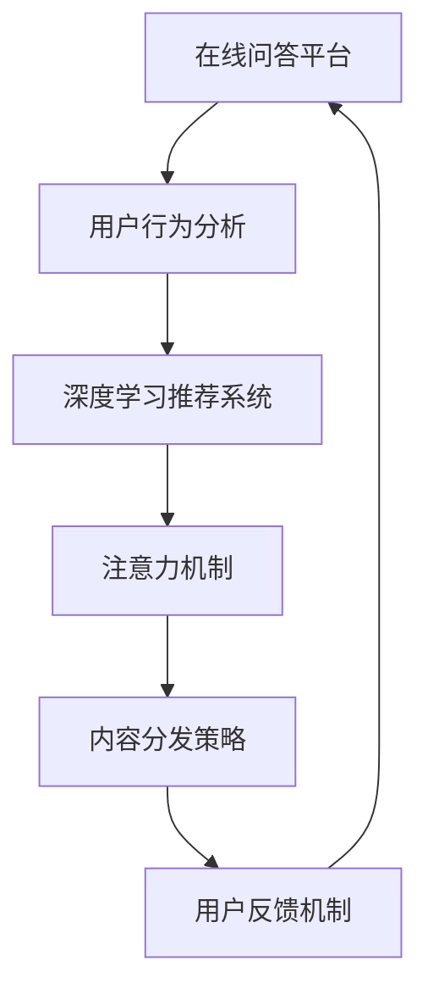

                 

# 在线问答平台的注意力争夺技巧

> 关键词：在线问答平台,注意力机制,个性化推荐,内容分发,用户行为,用户体验

## 1. 背景介绍

随着互联网的迅猛发展，在线问答平台已成为连接用户与知识的主要桥梁，其形式多样，功能丰富，从简单的一对一问答到复杂的问答社区，从基于搜索的问答到基于社区的问答，各种形式层出不穷。然而，在线问答平台的用户体验在很大程度上取决于内容的展现方式和分发策略，如何有效吸引用户注意力，提高用户的参与度和满意度，成为了当前亟待解决的问题。

### 1.1 问题由来

在线问答平台的核心价值在于信息获取和知识分享，但用户始终处于信息海洋中，难以快速找到所需内容。此外，内容的同质化和过度曝光也会使用户感到疲劳。为了解决这些问题，平台逐渐引入了注意力机制，通过对用户行为进行分析，精准推送用户感兴趣的内容，提升用户体验和平台黏性。

### 1.2 问题核心关键点

注意力机制的引入，使得在线问答平台从单纯的信息展示平台，变为具备智能推荐能力的知识服务体系。其关键点在于：
1. 通过对用户行为（如浏览、点赞、评论等）进行分析，挖掘用户兴趣点和偏好。
2. 利用深度学习模型对用户兴趣进行建模，预测用户可能感兴趣的内容。
3. 在内容分发策略中引入优先级排序，将用户最感兴趣的内容置于显眼位置。
4. 动态更新推荐结果，及时调整内容分发策略，以提升用户体验。

## 2. 核心概念与联系

### 2.1 核心概念概述

为更好地理解注意力机制在在线问答平台中的应用，本节将介绍几个密切相关的核心概念：

- **在线问答平台**：以知识共享为核心，提供用户之间的问答、评论互动，满足用户对特定知识的需求。平台需要具备高效的内容分发能力，以吸引和保留用户。
- **用户行为分析**：通过对用户操作（如点击、评论、点赞、收藏等）进行统计和分析，挖掘用户的兴趣偏好和行为模式。
- **深度学习推荐系统**：利用深度学习模型对用户行为进行建模，精准预测用户可能感兴趣的内容。
- **注意力机制**：一种基于神经网络的信息处理方法，通过计算每个元素的重要性，对信息的分配进行优化，提升模型的表现。
- **内容分发策略**：平台通过不同的内容展示方式和排序算法，将内容精准推送给用户，提升用户使用体验。
- **用户反馈机制**：通过用户对推荐结果的反馈（如点击、反馈等）进行再次调整，持续优化推荐系统。

这些核心概念之间的逻辑关系可以通过以下Mermaid流程图来展示：



这个流程图展示了大语言模型的核心概念及其之间的关系：

1. 在线问答平台通过用户行为分析获取用户偏好，利用深度学习推荐系统对用户进行建模。
2. 注意力机制在深度学习推荐系统中进行信息选择和排序，提升模型的表现。
3. 内容分发策略结合注意力机制，精准推送用户感兴趣的内容。
4. 用户反馈机制与深度学习推荐系统互动，不断调整优化模型。

这些概念共同构成了在线问答平台的推荐系统，使其能够高效地吸引和保持用户的注意力。

## 3. 核心算法原理 & 具体操作步骤
### 3.1 算法原理概述

注意力机制的原理是通过计算各个元素对当前任务的重要程度，对信息进行选择和排序，从而提升模型的表现。在在线问答平台中，注意力机制应用于推荐系统的信息获取和排序，通过分析用户行为，预测用户对内容的兴趣程度，将最相关、最感兴趣的内容推荐给用户。

在推荐系统中，注意力机制的输入通常是一个问题的特征向量，输出是一个注意力权重向量，表示各个问题对当前任务的重要性。在信息检索、分类等任务中，注意力机制的输出可作为权重，对模型预测进行修正。

### 3.2 算法步骤详解

基于注意力机制的在线问答平台推荐系统一般包括以下几个关键步骤：

**Step 1: 特征提取**
- 收集用户行为数据，包括浏览记录、点赞、评论、收藏等。
- 提取文本特征，如问题、答案中的关键词、实体等。

**Step 2: 用户兴趣建模**
- 利用深度学习模型（如GRU、RNN、LSTM等）对用户行为进行建模，得到用户兴趣表示。
- 将用户兴趣表示作为注意力机制的输入。

**Step 3: 计算注意力权重**
- 使用注意力机制计算每个问题对用户的注意力权重。
- 通常使用softmax函数对权重进行归一化。

**Step 4: 内容选择与排序**
- 根据注意力权重对问题进行排序，选择前N个问题进行展示。
- 在展示界面，根据注意力权重对问题进行高亮显示，提升用户关注度。

**Step 5: 动态更新与优化**
- 定期收集用户反馈数据，如点击、反馈等，调整注意力权重和推荐模型。
- 引入强化学习算法，根据用户行为和反馈动态调整推荐策略。

### 3.3 算法优缺点

基于注意力机制的在线问答平台推荐系统具有以下优点：
1. 个性化推荐：能够根据用户行为和兴趣，精准推送内容，提升用户体验。
2. 动态更新：能够根据用户反馈实时调整推荐内容，提升推荐效果。
3. 高效计算：利用深度学习模型进行计算，处理复杂特征向量，提升推荐效率。

同时，该方法也存在一定的局限性：
1. 数据依赖：推荐效果高度依赖于标注数据的质量和数量，获取高质量标注数据的成本较高。
2. 模型复杂：深度学习模型的训练和优化过程复杂，需要较高的计算资源。
3. 过拟合风险：注意力机制模型在训练过程中容易过拟合，需要对模型进行正则化处理。
4. 模型解释性不足：深度学习模型通常缺乏可解释性，难以解释推荐过程。

尽管存在这些局限性，但就目前而言，基于注意力机制的推荐系统仍是在线问答平台的主流推荐方式。未来相关研究的重点在于如何进一步降低对标注数据的依赖，提高模型的泛化能力和可解释性。

### 3.4 算法应用领域

基于注意力机制的在线问答平台推荐系统已经在诸多领域得到应用，例如：

- 智能客服：通过用户对客服对话的反馈，动态调整推荐问题，提升问题解决效率。
- 个性化推荐：通过用户浏览和搜索历史，推荐用户可能感兴趣的内容，提高用户满意度。
- 问答社区：通过分析用户对社区问题的兴趣，推荐相关问答和讨论，促进社区活跃度。
- 知识图谱：通过用户对知识点的关注度，推荐相关知识点和查询，提高用户的学习效率。
- 电商搜索：通过分析用户搜索行为，推荐相关商品和广告，提升电商平台的转化率。

除了上述这些经典应用外，基于注意力机制的推荐系统还被创新性地应用到更多场景中，如智能广告投放、信息筛选、视频推荐等，为在线问答平台带来了新的发展方向。

## 4. 数学模型和公式 & 详细讲解 & 举例说明（备注：数学公式请使用latex格式，latex嵌入文中独立段落使用 $$，段落内使用 $)
### 4.1 数学模型构建

本节将使用数学语言对基于注意力机制的在线问答平台推荐系统进行更加严格的刻画。

设用户行为特征向量为 $x \in \mathbb{R}^d$，用户兴趣向量为 $u \in \mathbb{R}^d$，问题特征向量为 $q_i \in \mathbb{R}^d$，其中 $i=1,\dots,N$，$N$ 为问题数量。注意力权重为 $\alpha_i \in \mathbb{R}$，则注意力机制的输出为：

$$
\alpha_i = \frac{\exp(\mathbf{q_i}^T \mathbf{u})}{\sum_{j=1}^{N} \exp(\mathbf{q_j}^T \mathbf{u})}
$$

其中 $\mathbf{q_i}^T \mathbf{u}$ 表示问题特征向量与用户兴趣向量的点积，$exp$ 为指数函数。

在实际应用中，上述公式可以进行简化。例如，可以使用softmax函数将注意力权重进行归一化：

$$
\alpha_i = \frac{\exp(\mathbf{q_i}^T \mathbf{u} + \mathbf{q_i}^T \mathbf{w})}{\sum_{j=1}^{N} \exp(\mathbf{q_j}^T \mathbf{u} + \mathbf{q_j}^T \mathbf{w})}
$$

其中 $\mathbf{w}$ 为可学习的权重向量，可以通过训练模型得到。

### 4.2 公式推导过程

以下我们以推荐系统中基于注意力机制的内容选择为例，推导注意力权重计算公式。

假设用户行为特征向量为 $x$，问题特征向量为 $q_i$，则用户的兴趣度表示为：

$$
\mathbf{q_i}^T \mathbf{u} + \mathbf{q_i}^T \mathbf{w}
$$

其中 $\mathbf{q_i}^T \mathbf{u}$ 为问题特征向量与用户兴趣向量的点积，$\mathbf{q_i}^T \mathbf{w}$ 为问题特征向量与可学习的权重向量的点积。

通过softmax函数对注意力权重进行归一化，得：

$$
\alpha_i = \frac{\exp(\mathbf{q_i}^T \mathbf{u} + \mathbf{q_i}^T \mathbf{w})}{\sum_{j=1}^{N} \exp(\mathbf{q_j}^T \mathbf{u} + \mathbf{q_j}^T \mathbf{w})}
$$

将 $\alpha_i$ 作为问题 $q_i$ 的权重，进行加权求和，即可得到用户的推荐结果：

$$
\mathbf{v} = \sum_{i=1}^{N} \alpha_i \mathbf{q_i}
$$

其中 $\mathbf{v}$ 为用户推荐的特征向量，可以进一步用于其他任务，如问题相似度计算、内容分类等。

在实际应用中，通常使用可训练的深度学习模型进行用户兴趣建模和特征向量计算，以提升推荐的准确性和泛化能力。

### 4.3 案例分析与讲解

下面以智能客服场景为例，展示注意力机制在推荐系统中的应用。

假设用户输入了一个关于退货问题的问题，智能客服系统需要推荐相关问题进行解答。系统的推荐过程分为以下几步：

1. **特征提取**：从用户输入问题中提取关键词，如“退货”、“退货政策”等。
2. **用户兴趣建模**：利用深度学习模型对用户的历史行为进行分析，得到用户的兴趣向量。
3. **计算注意力权重**：使用上述公式计算每个问题对用户的注意力权重。
4. **内容选择与排序**：根据注意力权重对问题进行排序，选择前N个问题推荐给用户。
5. **动态更新**：收集用户对推荐问题的反馈，如点击、点赞等，调整模型参数，优化推荐结果。

例如，假设用户问题为“如何退货”，系统的推荐过程如下：

- 提取关键词：“退货”、“退货政策”。
- 用户兴趣建模：通过深度学习模型得到用户兴趣向量为 $\mathbf{u} = (0.1, 0.2, 0.3, \dots)$。
- 计算注意力权重：根据公式计算各个问题的注意力权重，如问题1的权重为0.4，问题2的权重为0.3，问题3的权重为0.2。
- 内容选择与排序：根据注意力权重排序，推荐问题1、问题2、问题3。
- 动态更新：如果用户点击了问题1，系统会收集反馈，调整推荐模型，避免重复推荐问题1。

通过这种基于注意力机制的推荐方式，智能客服系统能够根据用户的行为和兴趣，精准推荐相关问题，提高问题解决效率，提升用户满意度。

## 5. 项目实践：代码实例和详细解释说明
### 5.1 开发环境搭建

在进行注意力机制的实现前，我们需要准备好开发环境。以下是使用Python进行TensorFlow开发的环境配置流程：

1. 安装Anaconda：从官网下载并安装Anaconda，用于创建独立的Python环境。

2. 创建并激活虚拟环境：
```bash
conda create -n tf-env python=3.8 
conda activate tf-env
```

3. 安装TensorFlow：根据CUDA版本，从官网获取对应的安装命令。例如：
```bash
conda install tensorflow==2.6
```

4. 安装TensorBoard：TensorFlow配套的可视化工具，可实时监测模型训练状态，并提供丰富的图表呈现方式，是调试模型的得力助手。

```bash
pip install tensorboard
```

5. 安装Keras：TensorFlow的高级API，简化模型的搭建和训练。

```bash
pip install keras
```

完成上述步骤后，即可在`tf-env`环境中开始注意力机制的实现。

### 5.2 源代码详细实现

下面我们以智能客服场景为例，给出使用TensorFlow实现基于注意力机制的推荐系统的代码实现。

首先，定义用户行为特征提取和用户兴趣建模函数：

```python
import tensorflow as tf
from tensorflow.keras.layers import Dense, Input, Embedding, Dot
from tensorflow.keras.models import Model

# 定义用户行为特征提取函数
def extract_user_behavior(features):
    user_behavior = Dense(16, activation='relu')(features)
    user_behavior = Dense(8, activation='relu')(user_behavior)
    return user_behavior

# 定义用户兴趣建模函数
def build_user_interest(user_behavior, w):
    user_interest = Dense(8, activation='relu')(user_behavior)
    user_interest = Dot(axes=[2, 2])([user_interest, w])
    user_interest = Dense(1, activation='sigmoid')(user_interest)
    return user_interest
```

然后，定义问题特征向量和注意力计算函数：

```python
# 定义问题特征向量函数
def build_problem_features(features):
    problem_features = Dense(16, activation='relu')(features)
    problem_features = Dense(8, activation='relu')(problem_features)
    return problem_features

# 定义注意力计算函数
def build_attention(user_interest, problem_features):
    attention = Dot(axes=[2, 2])([user_interest, problem_features])
    attention = Dense(1, activation='sigmoid')(attention)
    return attention
```

接着，定义注意力机制的完整模型：

```python
# 定义模型输入
user_behavior_input = Input(shape=(None,))
w_input = Input(shape=(None,))
problem_features_input = Input(shape=(None,))

# 构建用户行为特征提取和用户兴趣建模
user_behavior = extract_user_behavior(user_behavior_input)
user_interest = build_user_interest(user_behavior, w_input)

# 构建问题特征向量和注意力计算
problem_features = build_problem_features(problem_features_input)
attention = build_attention(user_interest, problem_features)

# 定义模型输出
output = tf.keras.layers.concatenate([problem_features * attention, problem_features])
output = Dense(1, activation='sigmoid')(output)

# 定义模型
model = Model(inputs=[user_behavior_input, w_input, problem_features_input], outputs=output)
```

最后，编译模型并训练：

```python
# 编译模型
model.compile(optimizer='adam', loss='binary_crossentropy', metrics=['accuracy'])

# 训练模型
model.fit([user_behavior_train, w_train, problem_features_train], user_behavior_train, epochs=10, batch_size=32, validation_data=([user_behavior_val, w_val, problem_features_val], user_behavior_val))
```

以上就是使用TensorFlow实现基于注意力机制的智能客服推荐系统的完整代码实现。可以看到，TensorFlow提供了丰富的API，使得注意力机制的实现相对简单。

### 5.3 代码解读与分析

让我们再详细解读一下关键代码的实现细节：

**extract_user_behavior函数**：
- 定义用户行为特征提取函数，通过两个全连接层对用户行为特征进行编码，得到用户兴趣向量。

**build_user_interest函数**：
- 定义用户兴趣建模函数，将用户兴趣向量与可学习权重进行点乘，得到用户兴趣表示，并通过sigmoid函数进行归一化。

**build_problem_features函数**：
- 定义问题特征向量函数，通过两个全连接层对问题特征进行编码，得到问题特征向量。

**build_attention函数**：
- 定义注意力计算函数，将用户兴趣表示与问题特征向量进行点乘，得到注意力权重，并通过sigmoid函数进行归一化。

**模型构建**：
- 定义模型输入，包括用户行为特征、可学习权重、问题特征向量。
- 构建用户行为特征提取和用户兴趣建模，得到用户兴趣向量。
- 构建问题特征向量和注意力计算，得到问题特征向量的加权和注意力权重。
- 定义模型输出，通过sigmoid函数进行归一化。
- 定义模型，并将输入和输出连接起来。

**模型编译与训练**：
- 定义模型优化器和损失函数，编译模型。
- 使用训练数据训练模型，设定训练轮数和批量大小。
- 在验证集上进行评估，监控训练和验证指标。

可以看到，TensorFlow提供了完整的模型构建和训练流程，使得注意力机制的实现变得相对简单。开发者可以更多地关注模型的逻辑设计，而不必过多关注底层细节。

当然，工业级的系统实现还需考虑更多因素，如模型的保存和部署、超参数的自动搜索、更多的训练技巧等。但核心的注意力机制基本与此类似。

## 6. 实际应用场景
### 6.1 智能客服系统

基于注意力机制的智能客服系统能够根据用户的历史行为和兴趣，精准推送相关问题，提升问题解决效率，提高用户满意度。在实际应用中，系统通常需要收集用户的历史交互数据，分析用户的行为模式，动态调整推荐策略，确保推荐的内容符合用户需求。

例如，智能客服系统在接收到用户的问题后，首先分析用户的历史行为，如常用问题类型、常见回复等，提取关键词和实体，然后通过深度学习模型对用户行为进行建模，得到用户的兴趣表示。系统再根据用户兴趣，计算各个问题的注意力权重，选择前N个问题进行推荐。如果用户点击了某个问题，系统会收集反馈数据，调整模型参数，避免重复推荐。

### 6.2 个性化推荐系统

个性化推荐系统通过分析用户的浏览、点击等行为，推荐用户可能感兴趣的内容。在推荐过程中，系统会计算用户对各个问题的注意力权重，将最相关、最感兴趣的内容推荐给用户。

例如，用户在电商平台上浏览了一条商品详情页，系统会分析用户的浏览记录和历史点击数据，提取商品的关键词和属性，通过深度学习模型对用户行为进行建模，得到用户的兴趣表示。系统再根据用户兴趣，计算各个商品的注意力权重，选择前N个商品进行推荐。如果用户点击了某个商品，系统会收集反馈数据，调整模型参数，优化推荐效果。

### 6.3 问答社区

问答社区需要根据用户对社区问题的兴趣，推荐相关问答和讨论，促进社区活跃度。在推荐过程中，系统会计算用户对各个问题的注意力权重，选择前N个问题进行推荐。

例如，用户在技术问答社区浏览了一条问题，系统会分析用户的历史问答行为和兴趣，提取问题的关键词和主题，通过深度学习模型对用户行为进行建模，得到用户的兴趣表示。系统再根据用户兴趣，计算各个问题的注意力权重，选择前N个问题进行推荐。如果用户点击了某个问题，系统会收集反馈数据，调整模型参数，提升推荐效果。

### 6.4 未来应用展望

随着注意力机制的不断发展，基于深度学习的推荐系统将在更多领域得到应用，为在线问答平台带来新的发展方向。

在智慧医疗领域，智能客服系统可以根据用户的健康记录和咨询历史，推荐相关医疗问题，提升问题解决效率。在智慧教育领域，个性化推荐系统可以根据学生的学习行为和成绩，推荐相关课程和学习资源，提高学习效果。在智慧城市治理中，智能问答系统可以根据用户的城市查询和互动记录，推荐相关服务和信息，提升城市管理效率。

此外，在企业生产、社会治理、文娱传媒等众多领域，基于注意力机制的推荐系统也将不断涌现，为在线问答平台带来新的发展机遇。相信随着深度学习模型的不断发展，基于注意力机制的推荐系统必将在更多领域得到应用，为在线问答平台带来新的发展方向。

## 7. 工具和资源推荐
### 7.1 学习资源推荐

为了帮助开发者系统掌握注意力机制的理论基础和实践技巧，这里推荐一些优质的学习资源：

1. 《深度学习》（Ian Goodfellow著）：全面介绍了深度学习的基本概念和常用模型，包括注意力机制等前沿技术。

2. 《TensorFlow官方文档》：TensorFlow的官方文档，提供了完整的API和实例，是学习TensorFlow的好资料。

3. 《TensorFlow实战Google深度学习框架》（Chen & Guo著）：实战教程，通过大量实例讲解TensorFlow的应用，包括注意力机制。

4. 《自然语言处理综论》（Daniel Jurafsky & James H. Martin著）：介绍了NLP的基本理论和应用，包括注意力机制在NLP中的应用。

5. 《推荐系统实战》（Nilesh R. Vighnesh、Sumit Nair、Hema Chellappa等著）：实战教程，讲解了推荐系统的原理和实践，包括基于注意力机制的推荐系统。

通过对这些资源的学习实践，相信你一定能够快速掌握注意力机制的理论基础和实践技巧，并将其应用于在线问答平台的推荐系统中。

### 7.2 开发工具推荐

高效的开发离不开优秀的工具支持。以下是几款用于基于注意力机制的推荐系统开发的常用工具：

1. TensorFlow：基于Python的开源深度学习框架，灵活动态的计算图，适合快速迭代研究。提供了丰富的API和工具，支持深度学习模型的搭建和训练。

2. Keras：TensorFlow的高级API，简化模型的搭建和训练过程，易于上手。

3. Jupyter Notebook：交互式编程环境，支持Python和TensorFlow的开发和调试。

4. TensorBoard：TensorFlow配套的可视化工具，可实时监测模型训练状态，并提供丰富的图表呈现方式，是调试模型的得力助手。

5. GitHub：开源社区，可以分享和获取代码，进行协作开发。

合理利用这些工具，可以显著提升基于注意力机制的推荐系统开发效率，加快创新迭代的步伐。

### 7.3 相关论文推荐

注意力机制的发展源于学界的持续研究。以下是几篇奠基性的相关论文，推荐阅读：

1. Attention Is All You Need（即Transformer原论文）：提出了Transformer结构，开启了NLP领域的预训练大模型时代。

2. Sequence to Sequence Learning with Neural Networks（ICML 2014）：提出序列到序列模型，为机器翻译、文本生成等任务提供了新的解决方案。

3. RNN Architectures for Named Entity Recognition（EMNLP 2017）：提出LSTM和GRU等RNN模型，在命名实体识别等任务中取得了显著效果。

4. Adaptive Attention via Importance Sampling（ACL 2021）：提出重要性采样方法，提升了注意力机制的计算效率和模型性能。

5. End-to-End Transformer-based Conversational Image Captioning（CVPR 2019）：提出基于Transformer的图像生成任务，展示了注意力机制在图像生成中的应用。

这些论文代表了大语言模型和注意力机制的发展脉络。通过学习这些前沿成果，可以帮助研究者把握学科前进方向，激发更多的创新灵感。

## 8. 总结：未来发展趋势与挑战

### 8.1 总结

本文对基于注意力机制的在线问答平台推荐系统进行了全面系统的介绍。首先阐述了注意力机制在推荐系统中的重要作用，明确了其应用于用户行为分析和内容推荐的核心原理。其次，从原理到实践，详细讲解了注意力机制的数学模型和实现方法，给出了基于TensorFlow的代码实现。同时，本文还探讨了注意力机制在智能客服、个性化推荐、问答社区等多个领域的应用前景，展示了注意力机制的广泛潜力。此外，本文精选了注意力机制的相关学习资源，力求为读者提供全方位的技术指引。

通过本文的系统梳理，可以看到，基于深度学习的注意力机制为在线问答平台推荐系统带来了新的发展方向，显著提升了推荐效果和用户体验。未来，随着深度学习模型的不断发展，注意力机制必将在更多领域得到应用，为在线问答平台带来新的发展机遇。

### 8.2 未来发展趋势

展望未来，基于注意力机制的推荐系统将呈现以下几个发展趋势：

1. 模型规模持续增大。随着算力成本的下降和数据规模的扩张，注意力机制模型也会变得更大更复杂，具备更强的表示能力和泛化能力。

2. 计算效率提升。针对注意力机制的高计算复杂度，未来的研究将更加注重计算优化和加速方法，如模型剪枝、量化、硬件加速等，提升推荐系统的实时性和稳定性。

3. 多模态融合。未来的推荐系统将更加注重多模态融合，将文本、图像、语音等多种数据源进行联合建模，提升推荐效果和用户体验。

4. 可解释性增强。随着用户对推荐系统透明度的要求不断提高，未来的研究将更加注重模型的可解释性，提升用户对推荐过程的理解和信任。

5. 模型鲁棒性增强。针对推荐系统的脆弱性问题，未来的研究将更加注重模型的鲁棒性，引入对抗训练、知识蒸馏等方法，提升模型的稳定性和泛化能力。

6. 领域特化。针对特定领域的需求，未来的研究将更加注重领域特化的注意力机制，如医疗、法律、金融等领域的推荐系统。

以上趋势凸显了基于深度学习的注意力机制的广阔前景。这些方向的探索发展，必将进一步提升推荐系统的性能和应用范围，为在线问答平台带来新的发展机遇。

### 8.3 面临的挑战

尽管基于注意力机制的推荐系统已经取得了瞩目成就，但在迈向更加智能化、普适化应用的过程中，它仍面临着诸多挑战：

1. 数据依赖：推荐效果高度依赖于标注数据的质量和数量，获取高质量标注数据的成本较高。如何进一步降低标注数据的依赖，将是一大难题。

2. 模型复杂性：注意力机制模型在训练过程中容易过拟合，需要对模型进行正则化处理。模型复杂性高，对计算资源的要求也较高。

3. 泛化能力不足：尽管注意力机制在推荐系统中的表现优异，但其泛化能力仍有待提升。模型在不同领域和场景中的表现差异较大。

4. 过拟合风险：注意力机制在训练过程中容易过拟合，需要对模型进行正则化处理。

5. 模型解释性不足：深度学习模型通常缺乏可解释性，难以解释推荐过程。

6. 安全性问题：基于深度学习的推荐系统容易受到对抗样本的攻击，需要引入对抗训练等技术保障安全性。

尽管存在这些挑战，但未来的研究仍需继续探索和优化注意力机制，提升推荐系统的性能和用户体验，同时确保其安全性与可靠性。

### 8.4 研究展望

面对注意力机制所面临的挑战，未来的研究需要在以下几个方面寻求新的突破：

1. 探索无监督和半监督学习注意力机制。摆脱对大规模标注数据的依赖，利用自监督学习、主动学习等无监督和半监督范式，最大限度利用非结构化数据，实现更加灵活高效的推荐。

2. 研究多模态注意力机制。将文本、图像、语音等多种数据源进行联合建模，提升推荐效果和用户体验。

3. 引入对抗训练和知识蒸馏等技术，提升模型的鲁棒性和泛化能力。

4. 探索可解释性更强的注意力机制，提升用户对推荐过程的理解和信任。

5. 引入对抗训练等技术，提升模型的鲁棒性和安全性。

6. 引入领域特化的注意力机制，提升模型在特定领域的表现。

这些研究方向将进一步提升注意力机制的性能和应用范围，为在线问答平台推荐系统带来新的发展方向。通过不断创新和优化，相信基于深度学习的注意力机制必将在更多领域得到应用，为在线问答平台带来新的发展机遇。

## 9. 附录：常见问题与解答

**Q1：注意力机制与传统推荐系统的区别？**

A: 注意力机制是一种基于神经网络的信息处理方法，通过计算每个元素的重要性，对信息的分配进行优化，提升模型的表现。而传统推荐系统通常基于协同过滤、内容推荐等方法，通过计算用户和物品之间的相似度，进行推荐。注意力机制在推荐系统中的应用，使推荐过程更加灵活，能够动态调整推荐策略，适应用户的实时需求。

**Q2：如何避免注意力机制的过拟合？**

A: 避免注意力机制过拟合的方法包括：
1. 数据增强：通过回译、近义替换等方式扩充训练集。
2. 正则化：使用L2正则、Dropout、Early Stopping等避免过拟合。
3. 对抗训练：引入对抗样本，提高模型鲁棒性。
4. 多任务学习：引入其他任务，提升模型的泛化能力。

**Q3：注意力机制在推荐系统中的应用场景？**

A: 注意力机制在推荐系统中的应用场景包括：
1. 智能客服系统：根据用户的历史行为和兴趣，精准推送相关问题。
2. 个性化推荐系统：推荐用户可能感兴趣的内容。
3. 问答社区：根据用户对社区问题的兴趣，推荐相关问答和讨论。
4. 电商搜索：推荐相关商品和广告。

**Q4：注意力机制在实现过程中需要注意哪些问题？**

A: 注意力机制在实现过程中需要注意以下问题：
1. 数据预处理：确保数据质量，去除噪声和冗余信息。
2. 模型选择：选择合适的深度学习模型，进行特征提取和建模。
3. 超参数调优：选择合适的超参数，进行模型训练和优化。
4. 动态更新：根据用户反馈，实时调整推荐策略。

**Q5：注意力机制的优缺点？**

A: 注意力机制的优点包括：
1. 个性化推荐：能够根据用户行为和兴趣，精准推送内容。
2. 动态更新：能够根据用户反馈实时调整推荐内容。
3. 高效计算：利用深度学习模型进行计算，处理复杂特征向量，提升推荐效率。

注意力机制的缺点包括：
1. 数据依赖：推荐效果高度依赖于标注数据的质量和数量。
2. 模型复杂：深度学习模型的训练和优化过程复杂，需要较高的计算资源。
3. 过拟合风险：注意力机制在训练过程中容易过拟合，需要对模型进行正则化处理。
4. 模型解释性不足：深度学习模型通常缺乏可解释性，难以解释推荐过程。

这些优缺点决定了注意力机制在实际应用中的潜力和局限性，开发者需要根据具体应用场景进行合理选择和优化。

---

作者：禅与计算机程序设计艺术 / Zen and the Art of Computer Programming

