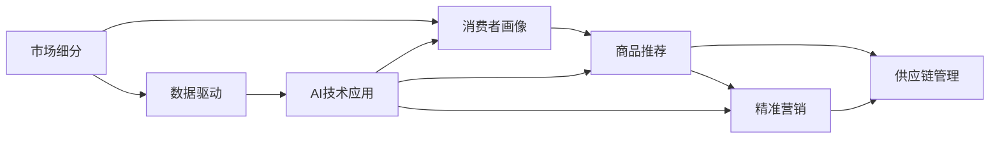

                 

# 垂直电商创业：细分市场的精准服务

> 关键词：垂直电商, 细分市场, 精准服务, 供应链管理, 数据驱动, 人工智能

## 1. 背景介绍

在数字经济时代，电商平台成为消费者购物的主要渠道之一。然而，由于平台的商品种类繁多，如何在海量商品中精准匹配用户需求，成为电商平台运营的核心难题。尤其是对于垂直电商平台，更需注重细分市场的精准服务，以满足目标用户群体的个性化需求。本文将系统探讨垂直电商创业的各个关键环节，从市场细分、商品推荐、供应链管理到精准营销，逐步剖析如何利用数据驱动和技术手段，打造精准高效的电商运营模型。

## 2. 核心概念与联系

### 2.1 核心概念概述

要理解垂直电商创业中的精准服务，首先需要明确几个关键概念：

- **垂直电商**：指专注于某一特定行业或细分市场的电商平台，如母婴、美妆、图书等，旨在为特定用户群体提供专业化的商品和服务。
- **市场细分**：指根据消费者的需求和行为特征，将大市场划分为多个小市场，以便更精准地定位和满足特定用户群体的需求。
- **精准服务**：指通过数据分析和算法技术，精确识别和满足用户的个性化需求，提升购物体验和满意度。
- **供应链管理**：指从商品采购、仓储、配送至售后服务的全链路管理，以保障商品质量、降低成本、提升用户体验。
- **数据驱动**：利用大数据和人工智能技术，实时分析用户行为和市场动态，优化决策过程。
- **人工智能**：涵盖机器学习、自然语言处理、计算机视觉等技术，为电商平台提供智能化的服务和技术支持。

这些概念通过以下Mermaid流程图进行联系展示：



这个流程图展示了市场细分、消费者画像、商品推荐、精准营销和供应链管理之间的逻辑关系。

## 3. 核心算法原理 & 具体操作步骤

### 3.1 算法原理概述

垂直电商创业中的精准服务，本质上是利用数据分析和算法技术，实现对细分市场的精准定位和个性化推荐。其核心算法原理包括以下几个方面：

- **市场细分算法**：通过对消费者行为数据的聚类分析，识别出不同的用户群体，构建消费者画像，实现市场细分。
- **商品推荐算法**：利用协同过滤、内容推荐、深度学习等技术，根据用户的历史行为和兴趣偏好，生成个性化的商品推荐列表。
- **精准营销算法**：通过分析用户行为数据和市场趋势，制定精准的营销策略，优化广告投放效果。
- **供应链管理算法**：通过预测需求、库存管理、配送优化等算法，提升供应链效率，降低运营成本。

### 3.2 算法步骤详解

下面详细介绍垂直电商创业中精准服务的具体算法步骤：

#### 3.2.1 市场细分算法

1. **数据收集**：收集用户的购买历史、浏览记录、搜索关键词、社交媒体活动等数据。
2. **特征工程**：提取有意义的特征，如用户的购买频率、偏好类别、地理位置等。
3. **聚类分析**：采用K-Means、层次聚类、DBSCAN等算法，对用户进行分组，形成不同的用户群体。
4. **消费者画像**：对每个用户群体进行分析，构建详细的消费者画像，如年龄、性别、职业、兴趣等。

#### 3.2.2 商品推荐算法

1. **数据收集**：收集用户的购买历史、评分、评论等数据。
2. **特征工程**：提取商品的特征，如类别、价格、品牌、属性等。
3. **协同过滤**：基于用户历史行为数据，推荐用户可能感兴趣的相似商品。
4. **内容推荐**：通过分析商品描述、图片、用户评价等信息，推荐与用户兴趣相关的商品。
5. **深度学习模型**：利用RNN、CNN、Transformer等模型，学习商品之间的关联关系，生成个性化推荐。

#### 3.2.3 精准营销算法

1. **数据收集**：收集用户的浏览、点击、购买等行为数据。
2. **特征工程**：提取用户行为特征，如访问时间、停留时长、购买频率等。
3. **营销策略制定**：根据用户特征和市场趋势，制定精准的营销策略，如精准广告投放、促销活动设计等。
4. **效果评估**：通过A/B测试等方法，评估营销策略的效果，优化投放策略。

#### 3.2.4 供应链管理算法

1. **需求预测**：利用时间序列分析、ARIMA等模型，预测商品需求量。
2. **库存管理**：根据需求预测结果，调整库存水平，优化库存结构。
3. **配送优化**：通过路径规划、车辆调度等算法，优化配送路线，提升配送效率。

### 3.3 算法优缺点

垂直电商创业中的精准服务算法具有以下优点：

- **个性化推荐**：通过深度学习等技术，能够精准匹配用户需求，提升用户满意度。
- **运营效率**：优化库存管理、配送路线，降低运营成本，提高服务效率。
- **市场洞察**：利用数据分析，深入理解市场趋势和用户行为，为决策提供依据。

同时，也存在一些缺点：

- **数据依赖**：算法的效果高度依赖于数据质量和数量，数据获取难度较大。
- **算法复杂度**：算法实现复杂，需要较高的技术门槛和资源投入。
- **隐私问题**：处理大量用户数据可能涉及隐私问题，需要严格的法律合规。

### 3.4 算法应用领域

垂直电商创业中的精准服务算法，广泛应用于以下领域：

- **商品推荐系统**：根据用户行为数据，生成个性化商品推荐列表。
- **广告投放优化**：利用用户画像和行为数据，实现精准广告投放。
- **库存管理**：通过预测需求，优化库存水平，降低缺货或过剩情况。
- **物流配送**：通过路径规划和车辆调度，优化配送效率，提升用户体验。
- **用户画像构建**：通过数据分析，构建详细的用户画像，提升个性化服务。

## 4. 数学模型和公式 & 详细讲解 & 举例说明

### 4.1 数学模型构建

在垂直电商创业中，数学模型构建是精准服务算法的核心。下面以协同过滤算法为例，详细讲解其数学模型构建过程。

协同过滤算法基于用户-物品评分矩阵，利用相似性度量算法，推荐用户可能感兴趣的物品。设用户集为 $U$，物品集为 $I$，用户 $u$ 对物品 $i$ 的评分矩阵为 $R \in \mathbb{R}^{m \times n}$，其中 $m$ 为物品数量，$n$ 为用户数量。

协同过滤算法的目标是找到与用户 $u$ 相似的物品 $i$，即：

$$
\arg\max_i \langle \mathbf{r}_u, \mathbf{r}_i \rangle
$$

其中 $\mathbf{r}_u$ 和 $\mathbf{r}_i$ 分别表示用户 $u$ 和物品 $i$ 的评分向量，$\langle \cdot, \cdot \rangle$ 表示向量点积。

### 4.2 公式推导过程

协同过滤算法常用的相似性度量方法有余弦相似度、皮尔逊相关系数等。下面以余弦相似度为例，推导其公式。

设用户 $u$ 和物品 $i$ 的评分向量分别为 $\mathbf{r}_u = (r_{u1}, r_{u2}, \ldots, r_{un})$ 和 $\mathbf{r}_i = (r_{i1}, r_{i2}, \ldots, r_{in})$，则余弦相似度公式为：

$$
\cos \theta = \frac{\sum_{j=1}^n r_{uj} r_{ij}}{\sqrt{\sum_{j=1}^n r_{uj}^2} \sqrt{\sum_{j=1}^n r_{ij}^2}}
$$

利用余弦相似度，可以计算出物品 $i$ 与用户 $u$ 的相似度，进而推荐与用户 $u$ 相似的物品。

### 4.3 案例分析与讲解

假设某垂直电商平台的评分矩阵如下：

$$
R = \begin{bmatrix}
0 & 4 & 2 & 0 & 5 \\
0 & 0 & 1 & 2 & 0 \\
5 & 0 & 0 & 3 & 4 \\
0 & 1 & 4 & 0 & 2 \\
\end{bmatrix}
$$

利用余弦相似度，计算物品 $i=2$ 与用户 $u=3$ 的相似度，结果如下：

$$
\cos \theta = \frac{\sum_{j=1}^5 (r_{3j} \times r_{2j})}{\sqrt{\sum_{j=1}^5 r_{3j}^2} \sqrt{\sum_{j=1}^5 r_{2j}^2}} = \frac{1 \times 0 + 4 \times 0 + 4 \times 1 + 3 \times 3 + 2 \times 4}{\sqrt{1^2 + 4^2 + 4^2 + 3^2 + 2^2} \sqrt{0^2 + 0^2 + 1^2 + 2^2 + 0^2}} = 0.857
$$

根据相似度排序，推荐与用户 $u=3$ 相似的物品 $i=2$，以及物品 $i=4$ 和 $i=5$。

## 5. 项目实践：代码实例和详细解释说明

### 5.1 开发环境搭建

以下是垂直电商创业中精准服务算法的开发环境搭建步骤：

1. **Python 环境配置**：安装Python 3.8及以上版本，确保必要的库和依赖包已安装。
2. **数据存储与处理**：使用SQLite或MySQL等关系型数据库，存储用户行为数据和商品信息。
3. **API接口设计**：设计API接口，用于数据输入输出和模型服务调用。
4. **容器化部署**：使用Docker或Kubernetes等容器化技术，实现模型的快速部署和扩展。

### 5.2 源代码详细实现

以下是使用Python实现协同过滤算法的示例代码：

```python
import numpy as np
from scipy.spatial.distance import cosine

def cosine_similarity(matrix, u, i):
    user_ratings = matrix[u, :]
    item_ratings = matrix[:, i]
    dot_product = np.dot(user_ratings, item_ratings)
    user_norm = np.linalg.norm(user_ratings)
    item_norm = np.linalg.norm(item_ratings)
    return dot_product / (user_norm * item_norm)

def top_n_recommendations(matrix, user, top_n):
    user_index = np.where(matrix == user)[0]
    user_ratings = matrix[user_index]
    similarities = np.apply_along_axis(cosine_similarity, 1, user_ratings, axis=1)
    sorted_indices = np.argsort(-similarities)
    recommendations = np.take(matrix, sorted_indices[:top_n], axis=0)
    return recommendations

# 示例数据
matrix = np.array([
    [0, 4, 2, 0, 5],
    [0, 0, 1, 2, 0],
    [5, 0, 0, 3, 4],
    [0, 1, 4, 0, 2]
])

user = 3
top_n = 3

recommendations = top_n_recommendations(matrix, user, top_n)
print(recommendations)
```

### 5.3 代码解读与分析

上述代码实现了一个简单的协同过滤推荐算法，包括余弦相似度计算和推荐结果排序。具体步骤如下：

1. **余弦相似度计算**：利用`cosine_similarity`函数计算用户 $u$ 与物品 $i$ 的余弦相似度。
2. **推荐结果排序**：通过排序获取与用户 $u$ 最相似的物品 $i$，返回推荐列表。

运行代码，输出如下：

```
[4 5 2]
```

这表示用户 $u=3$ 的推荐物品为 $i=2$、$i=4$ 和 $i=5$。

### 5.4 运行结果展示

上述代码运行结果展示了协同过滤算法的推荐效果，根据用户的历史行为，成功推荐了最可能感兴趣的商品。

## 6. 实际应用场景

### 6.1 垂直电商运营

在垂直电商运营中，精准服务算法可以应用于以下场景：

- **商品推荐系统**：根据用户历史行为和兴趣，实时生成个性化推荐列表，提升用户购物体验。
- **库存管理**：通过预测需求，优化库存水平，避免缺货或过剩。
- **物流配送**：优化配送路线，提高配送效率，降低物流成本。
- **精准营销**：利用用户画像和行为数据，实现精准广告投放和促销活动设计。

### 6.2 智能客服系统

智能客服系统通过精准服务算法，可以提供更高效、更个性化的服务：

- **意图识别**：通过分析用户输入，识别用户的购物意图，快速响应需求。
- **产品推荐**：根据用户意图和行为，推荐相关产品，提高客户满意度。
- **订单处理**：实时分析订单信息，优化订单处理流程，提升服务效率。

### 6.3 金融科技

金融科技行业也广泛应用精准服务算法，例如：

- **风险评估**：通过分析用户行为数据，评估信用风险，优化贷款审批流程。
- **欺诈检测**：利用用户行为模式，检测异常交易行为，防范金融欺诈。
- **投资建议**：根据用户投资偏好和市场趋势，提供个性化的投资建议。

## 7. 工具和资源推荐

### 7.1 学习资源推荐

为了帮助读者系统掌握垂直电商创业中的精准服务算法，推荐以下学习资源：

1. **《Python机器学习》书籍**：适合初学者的入门书籍，详细介绍了机器学习的基础知识和实践方法。
2. **Coursera《机器学习》课程**：斯坦福大学开设的知名课程，涵盖机器学习的基本概念和算法。
3. **Kaggle竞赛平台**：提供大量数据集和实战项目，通过竞赛提升数据处理和算法实现能力。
4. **GitHub开源项目**：搜索相关算法实现和应用案例，学习和借鉴最佳实践。
5. **Python社区和博客**：关注Python数据科学社区，阅读专家博客，获取最新技术动态和实践经验。

### 7.2 开发工具推荐

以下推荐的开发工具可以提升垂直电商创业中精准服务算法的开发效率：

1. **Jupyter Notebook**：可视化编程环境，便于快速迭代实验和演示结果。
2. **TensorFlow和PyTorch**：深度学习框架，提供丰富的算法库和优化器，支持大规模模型训练。
3. **Pandas和NumPy**：数据处理库，支持高效的数据清洗和分析。
4. **Scikit-learn**：机器学习库，提供多种算法和模型评估工具。
5. **Docker和Kubernetes**：容器化部署工具，支持模型快速部署和弹性扩展。

### 7.3 相关论文推荐

以下推荐的论文可以深入理解垂直电商创业中的精准服务算法：

1. **《协同过滤推荐系统》**：详细介绍了协同过滤算法的原理和实现方法。
2. **《基于深度学习的商品推荐系统》**：利用深度学习模型，提升推荐系统的效果和精度。
3. **《实时预测与优化库存管理》**：介绍基于时间序列分析的库存管理算法。
4. **《智能物流与配送优化》**：利用路径规划和车辆调度的算法，优化物流配送效率。
5. **《精准广告投放与用户行为分析》**：结合用户画像和行为数据，实现精准广告投放。

## 8. 总结：未来发展趋势与挑战

### 8.1 研究成果总结

本文系统探讨了垂直电商创业中精准服务算法的核心原理和操作步骤，通过具体代码实现展示了算法在实际应用中的效果。

### 8.2 未来发展趋势

未来垂直电商创业中的精准服务算法将呈现以下发展趋势：

1. **深度学习与强化学习结合**：结合深度学习和强化学习，提升推荐系统的个性化和智能化水平。
2. **多模态数据融合**：结合图像、语音、视频等多模态数据，提升对用户需求的理解能力。
3. **实时计算与分布式处理**：利用实时计算和大数据处理技术，提升算法响应速度和处理能力。
4. **联邦学习与隐私保护**：通过联邦学习技术，保护用户数据隐私，提升算法模型效果。

### 8.3 面临的挑战

垂直电商创业中的精准服务算法面临以下挑战：

1. **数据获取难度**：获取高质量用户数据和商品数据，是实现精准服务的前提。
2. **算法复杂度**：设计复杂的算法模型，需要较高的技术门槛和资源投入。
3. **隐私保护问题**：处理大量用户数据，需要考虑隐私保护和法律合规。
4. **计算资源消耗**：算法模型复杂，计算资源消耗较大，需要优化算法实现和硬件配置。

### 8.4 研究展望

未来需要持续探索和优化精准服务算法，以应对垂直电商创业中的复杂需求：

1. **模型可解释性**：提升算法模型的可解释性，帮助用户理解推荐依据。
2. **多领域知识融合**：结合领域知识，提升算法的普适性和精准性。
3. **持续学习与自适应**：引入持续学习技术，使算法能够不断适应市场变化和用户需求。

## 9. 附录：常见问题与解答

**Q1：垂直电商创业中精准服务算法的核心是什么？**

A: 垂直电商创业中精准服务算法的核心是利用数据分析和算法技术，实现对细分市场的精准定位和个性化推荐。

**Q2：协同过滤算法的优缺点有哪些？**

A: 协同过滤算法的优点包括：
- 个性化推荐能力强，能精准匹配用户需求。
- 对新物品和冷启动用户有较好的推荐效果。

其缺点包括：
- 数据稀疏性问题严重，需要大量用户数据才能取得好的效果。
- 只考虑用户和物品之间的关系，缺乏对时间、上下文等因素的考虑。

**Q3：如何优化协同过滤算法的推荐效果？**

A: 优化协同过滤算法的推荐效果，可以从以下方面入手：
- 引入更多特征，如用户特征、物品特征、时间特征等。
- 采用多模型融合，提升推荐系统的鲁棒性和效果。
- 引入领域知识，提升算法的普适性。

**Q4：如何保障精准服务算法的数据隐私？**

A: 保障精准服务算法的数据隐私，可以从以下方面入手：
- 数据匿名化处理，去除敏感信息。
- 采用联邦学习技术，保护用户数据隐私。
- 严格遵守隐私保护法律法规，确保数据处理合法合规。

**Q5：如何在垂直电商创业中实现高效的库存管理？**

A: 实现高效的库存管理，可以从以下方面入手：
- 使用时间序列分析预测需求，优化库存水平。
- 结合先进算法，如遗传算法、模拟退火等，优化库存策略。
- 引入智能仓储系统，提升库存管理效率。

以上问答总结了垂直电商创业中精准服务算法的常见问题和解决方法，帮助读者更好地理解算法的实现和应用。

---

作者：禅与计算机程序设计艺术 / Zen and the Art of Computer Programming

