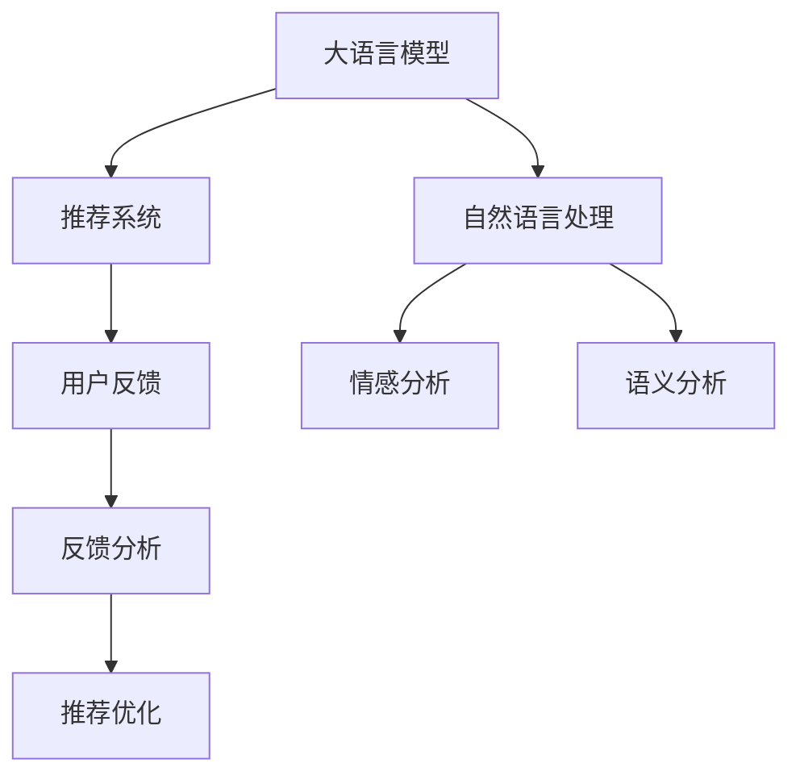

                 

# 基于LLM的推荐系统用户反馈分析

> 关键词：自然语言处理(NLP),推荐系统,用户反馈分析,大语言模型(LLM),深度学习

## 1. 背景介绍

### 1.1 问题由来

在互联网时代，推荐系统已经广泛应用于各个领域，如电商、新闻、社交等。推荐系统通过分析用户的历史行为和兴趣偏好，为其提供个性化的推荐内容，显著提升了用户体验和平台收益。然而，推荐系统在提高用户体验的同时，也可能产生负面影响，如推荐内容与用户兴趣不符、信息过载、数据隐私泄露等。因此，用户反馈分析成为推荐系统性能优化和用户体验改善的重要途径。

传统的推荐系统通常采用静态特征模型，基于用户的历史行为进行推荐。但这些特征往往难以捕捉用户的真实兴趣和动态变化，无法实时响应用户的反馈。大语言模型(LLM)作为当前NLP领域的前沿技术，凭借其在自然语言理解和生成方面的强大能力，为推荐系统提供了新的思路。

### 1.2 问题核心关键点

基于LLM的推荐系统用户反馈分析，即通过大语言模型对用户的反馈信息进行分析，挖掘其背后的语义信息和情感倾向，进一步优化推荐算法，提升推荐效果和用户体验。核心关键点包括：

- 用户反馈信息的自然语言处理。
- 基于语义分析和情感识别的推荐优化。
- 用户反馈在推荐系统中的实时应用。

这些关键点共同构成了基于LLM的推荐系统用户反馈分析的核心范式，帮助推荐系统更好地理解用户需求，生成个性化的推荐内容，提高系统的精准度和用户的满意度。

## 2. 核心概念与联系

### 2.1 核心概念概述

为更好地理解基于LLM的推荐系统用户反馈分析方法，本节将介绍几个密切相关的核心概念：

- 大语言模型(Large Language Model, LLM)：指通过大规模语料预训练获得的语言模型，如GPT、BERT等。这些模型具备强大的自然语言理解和生成能力，能够理解复杂的语义信息，提取情感倾向。

- 推荐系统(Recommendation System)：通过分析用户的历史行为和兴趣偏好，为用户推荐个性化内容。主要包括协同过滤、内容推荐、混合推荐等。

- 自然语言处理(Natural Language Processing, NLP)：研究如何让计算机理解、生成和处理自然语言的技术。涉及文本分类、情感分析、机器翻译等任务。

- 用户反馈(User Feedback)：用户对推荐系统推荐内容的反馈信息，如评价、评论、点击、收藏等。这些反馈信息能够反映用户对内容的喜好和满意度。

- 情感分析(Affective Analysis)：通过自然语言处理技术，自动识别文本中的情感倾向，如正面、负面、中性等。

- 语义分析(Semantic Analysis)：通过自然语言处理技术，理解文本的深层语义信息，如实体识别、关系抽取等。

这些核心概念之间的逻辑关系可以通过以下Mermaid流程图来展示：



这个流程图展示了大语言模型、自然语言处理、推荐系统、用户反馈和情感分析、语义分析等核心概念之间的关系：

1. 大语言模型通过预训练获得语言理解能力，为推荐系统提供个性化的推荐内容。
2. 推荐系统基于用户历史行为和兴趣进行推荐，并通过用户反馈进行优化。
3. 自然语言处理技术，通过情感分析、语义分析等技术，提取用户反馈中的情感信息和语义信息。
4. 用户反馈分析，通过情感分析和语义分析，提取反馈中的情感倾向和语义信息，用于推荐优化。
5. 推荐系统根据用户反馈和情感分析结果，进一步优化推荐算法，提升推荐效果。

## 3. 核心算法原理 & 具体操作步骤
### 3.1 算法原理概述

基于LLM的推荐系统用户反馈分析方法，本质上是一种利用自然语言处理技术，优化推荐算法的深度学习范式。其核心思想是：将用户反馈信息输入到预训练的大语言模型中，通过情感分析和语义分析，提取其中的情感倾向和语义信息，并根据分析结果对推荐算法进行优化，从而提升推荐效果和用户体验。

形式化地，假设推荐系统为用户 $u$ 推荐物品 $i$，用户对物品 $i$ 的反馈为 $y \in \{0,1\}$，其中 $y=1$ 表示用户对物品 $i$ 有正反馈，$y=0$ 表示用户对物品 $i$ 有负反馈。设用户反馈的文本描述为 $f$，通过大语言模型 $M_{\theta}$ 进行情感分析和语义分析，提取情感倾向 $e \in [-1,1]$ 和语义信息 $s$。则推荐优化的目标函数为：

$$
\mathcal{L}(\theta) = \sum_{u,i} \max(\mathcal{L}_{\text{semi-supervised}}(y_i,f_i),\mathcal{L}_{\text{supervised}}(y_i,e_i,s_i))
$$

其中 $\mathcal{L}_{\text{semi-supervised}}$ 为半监督损失函数，用于优化用户反馈的语义表示；$\mathcal{L}_{\text{supervised}}$ 为监督损失函数，用于优化用户的情感倾向和语义信息的匹配。

### 3.2 算法步骤详解

基于LLM的推荐系统用户反馈分析主要包括以下几个关键步骤：

**Step 1: 数据准备**
- 收集推荐系统的用户反馈数据，包括评论、评分、点击等。
- 将用户反馈转化为文本形式，提取其中的语义信息和情感倾向。

**Step 2: 模型初始化**
- 选择合适的预训练语言模型 $M_{\theta}$，如BERT、GPT等。
- 使用预训练模型进行情感分析和语义分析，提取用户反馈的情感倾向 $e$ 和语义信息 $s$。

**Step 3: 特征提取**
- 将用户反馈的情感倾向和语义信息作为推荐模型的特征，用于优化推荐算法。
- 在特征中融入其他用户行为数据，如浏览历史、购买记录等。

**Step 4: 模型优化**
- 根据用户反馈的情感倾向和语义信息，优化推荐模型。
- 使用半监督损失函数和监督损失函数，分别优化用户的语义表示和情感倾向。

**Step 5: 推荐输出**
- 根据优化后的推荐模型，为每个用户生成个性化推荐列表。
- 实时监控用户反馈，不断优化推荐策略。

### 3.3 算法优缺点

基于LLM的推荐系统用户反馈分析方法具有以下优点：
1. 精准性高：通过大语言模型对用户反馈进行深度分析，提取情感倾向和语义信息，提高推荐精准度。
2. 实时性高：能够实时响应用户反馈，快速调整推荐策略，提升用户体验。
3. 通用性强：适用于各种类型的用户反馈，如文本、图像、音频等。

同时，该方法也存在一定的局限性：
1. 数据依赖性强：模型效果很大程度上依赖于用户反馈的质量和数量，获取高质量标注数据的成本较高。
2. 计算开销大：大语言模型通常参数量巨大，计算资源消耗较大。
3. 泛化能力有限：当前大语言模型在特定领域的泛化能力还有待提升，可能无法很好地适应某些专业领域的推荐场景。
4. 模型复杂度高：基于大语言模型的推荐系统结构复杂，模型训练和推理过程较为耗时。

尽管存在这些局限性，但就目前而言，基于LLM的推荐系统用户反馈分析方法仍是一种极具潜力的推荐优化手段。未来相关研究的重点在于如何进一步降低对标注数据的依赖，提高模型的泛化能力，同时兼顾实时性和可解释性等因素。

### 3.4 算法应用领域

基于LLM的推荐系统用户反馈分析方法，已在多个领域得到广泛应用，包括但不限于：

- 电商推荐：通过分析用户的购物评论和评分，优化个性化推荐内容，提升购物体验。
- 内容推荐：对用户对视频、文章、音乐等的反馈进行分析，生成更精准的推荐列表。
- 社交推荐：对用户在社交平台上的互动信息进行情感分析和语义分析，推荐更多兴趣相投的用户和内容。
- 金融推荐：通过分析用户对理财产品、股票等的反馈，优化推荐策略，降低投资风险。
- 旅游推荐：对用户的旅游评论和评分进行分析，生成符合用户偏好的旅游路线和景点推荐。

除了上述这些经典应用场景外，基于LLM的推荐系统用户反馈分析技术还在更多领域得到探索和应用，如健康推荐、教育推荐、游戏推荐等，为推荐系统的智能化和个性化提供新的解决方案。

## 4. 数学模型和公式 & 详细讲解 & 举例说明
### 4.1 数学模型构建

本节将使用数学语言对基于LLM的推荐系统用户反馈分析过程进行更加严格的刻画。

假设推荐系统为用户 $u$ 推荐物品 $i$，用户对物品 $i$ 的反馈为 $y \in \{0,1\}$，其中 $y=1$ 表示用户对物品 $i$ 有正反馈，$y=0$ 表示用户对物品 $i$ 有负反馈。设用户反馈的文本描述为 $f$，通过大语言模型 $M_{\theta}$ 进行情感分析和语义分析，提取情感倾向 $e \in [-1,1]$ 和语义信息 $s$。

设用户反馈的情感倾向和语义信息作为推荐模型的特征向量 $x$，则推荐优化目标函数为：

$$
\mathcal{L}(\theta) = \sum_{u,i} \max(\mathcal{L}_{\text{semi-supervised}}(y_i,f_i),\mathcal{L}_{\text{supervised}}(y_i,e_i,s_i))
$$

其中 $\mathcal{L}_{\text{semi-supervised}}$ 为半监督损失函数，用于优化用户反馈的语义表示；$\mathcal{L}_{\text{supervised}}$ 为监督损失函数，用于优化用户的情感倾向和语义信息的匹配。

在实际应用中，情感分析和语义分析的模型往往基于神经网络架构，如Transformer、BERT等，通过掩码语言模型、下一句预测、语义匹配等任务进行训练，提取用户反馈的情感倾向和语义信息。

### 4.2 公式推导过程

以下我们以用户评论的情感分析为例，推导情感分析的损失函数及其梯度计算公式。

假设用户评论的文本描述为 $f$，模型 $M_{\theta}$ 在输入 $f$ 上的输出为 $\hat{y}=M_{\theta}(f) \in [0,1]$，表示用户评论的情感倾向。则二分类交叉熵损失函数定义为：

$$
\ell(M_{\theta}(f),y) = -[y\log \hat{y} + (1-y)\log (1-\hat{y})]
$$

将其代入推荐优化的目标函数，得：

$$
\mathcal{L}(\theta) = \sum_{u,i} \max(-[y_i\log M_{\theta}(f_i)+(1-y_i)\log(1-M_{\theta}(f_i)),\ell(M_{\theta}(f_i),e_i,s_i))
$$

根据链式法则，损失函数对参数 $\theta_k$ 的梯度为：

$$
\frac{\partial \mathcal{L}(\theta)}{\partial \theta_k} = \sum_{u,i} \max(\frac{y_i}{M_{\theta}(f_i)}-\frac{1-y_i}{1-M_{\theta}(f_i)}\frac{\partial M_{\theta}(f_i)}{\partial \theta_k},\frac{\partial \ell(M_{\theta}(f_i),e_i,s_i)}{\partial \theta_k})
$$

其中 $\frac{\partial M_{\theta}(f_i)}{\partial \theta_k}$ 可进一步递归展开，利用自动微分技术完成计算。

在得到情感分析损失函数和梯度后，即可带入推荐优化目标函数，完成推荐模型的迭代优化。重复上述过程直至收敛，最终得到适应用户反馈的推荐模型。

## 5. 项目实践：代码实例和详细解释说明
### 5.1 开发环境搭建

在进行基于LLM的推荐系统用户反馈分析实践前，我们需要准备好开发环境。以下是使用Python进行PyTorch开发的环境配置流程：

1. 安装Anaconda：从官网下载并安装Anaconda，用于创建独立的Python环境。

2. 创建并激活虚拟环境：
```bash
conda create -n pytorch-env python=3.8 
conda activate pytorch-env
```

3. 安装PyTorch：根据CUDA版本，从官网获取对应的安装命令。例如：
```bash
conda install pytorch torchvision torchaudio cudatoolkit=11.1 -c pytorch -c conda-forge
```

4. 安装Transformers库：
```bash
pip install transformers
```

5. 安装各类工具包：
```bash
pip install numpy pandas scikit-learn matplotlib tqdm jupyter notebook ipython
```

完成上述步骤后，即可在`pytorch-env`环境中开始推荐系统用户反馈分析实践。

### 5.2 源代码详细实现

下面我们以电商推荐系统为例，给出使用Transformers库对BERT模型进行情感分析和语义分析的PyTorch代码实现。

首先，定义电商推荐系统的数据处理函数：

```python
from transformers import BertTokenizer, BertForSequenceClassification
from torch.utils.data import Dataset, DataLoader
import torch

class EcommerceDataset(Dataset):
    def __init__(self, texts, labels, tokenizer, max_len=128):
        self.texts = texts
        self.labels = labels
        self.tokenizer = tokenizer
        self.max_len = max_len
        
    def __len__(self):
        return len(self.texts)
    
    def __getitem__(self, item):
        text = self.texts[item]
        label = self.labels[item]
        
        encoding = self.tokenizer(text, return_tensors='pt', max_length=self.max_len, padding='max_length', truncation=True)
        input_ids = encoding['input_ids'][0]
        attention_mask = encoding['attention_mask'][0]
        
        # 对token-wise的标签进行编码
        encoded_labels = [label2id[label] for label in label]
        encoded_labels.extend([label2id['O']] * (self.max_len - len(encoded_labels)))
        labels = torch.tensor(encoded_labels, dtype=torch.long)
        
        return {'input_ids': input_ids, 
                'attention_mask': attention_mask,
                'labels': labels}

# 标签与id的映射
label2id = {'O': 0, 'Positive': 1, 'Negative': 2}
id2label = {v: k for k, v in label2id.items()}

# 创建dataset
tokenizer = BertTokenizer.from_pretrained('bert-base-cased')

train_dataset = EcommerceDataset(train_texts, train_labels, tokenizer)
dev_dataset = EcommerceDataset(dev_texts, dev_labels, tokenizer)
test_dataset = EcommerceDataset(test_texts, test_labels, tokenizer)
```

然后，定义模型和优化器：

```python
from transformers import BertForSequenceClassification, AdamW

model = BertForSequenceClassification.from_pretrained('bert-base-cased', num_labels=len(label2id))

optimizer = AdamW(model.parameters(), lr=2e-5)
```

接着，定义训练和评估函数：

```python
from tqdm import tqdm
from sklearn.metrics import classification_report

device = torch.device('cuda') if torch.cuda.is_available() else torch.device('cpu')
model.to(device)

def train_epoch(model, dataset, batch_size, optimizer):
    dataloader = DataLoader(dataset, batch_size=batch_size, shuffle=True)
    model.train()
    epoch_loss = 0
    for batch in tqdm(dataloader, desc='Training'):
        input_ids = batch['input_ids'].to(device)
        attention_mask = batch['attention_mask'].to(device)
        labels = batch['labels'].to(device)
        model.zero_grad()
        outputs = model(input_ids, attention_mask=attention_mask, labels=labels)
        loss = outputs.loss
        epoch_loss += loss.item()
        loss.backward()
        optimizer.step()
    return epoch_loss / len(dataloader)

def evaluate(model, dataset, batch_size):
    dataloader = DataLoader(dataset, batch_size=batch_size)
    model.eval()
    preds, labels = [], []
    with torch.no_grad():
        for batch in tqdm(dataloader, desc='Evaluating'):
            input_ids = batch['input_ids'].to(device)
            attention_mask = batch['attention_mask'].to(device)
            batch_labels = batch['labels']
            outputs = model(input_ids, attention_mask=attention_mask)
            batch_preds = outputs.logits.argmax(dim=2).to('cpu').tolist()
            batch_labels = batch_labels.to('cpu').tolist()
            for pred_tokens, label_tokens in zip(batch_preds, batch_labels):
                pred_labels = [id2label[_id] for _id in pred_tokens]
                label_tags = [id2label[_id] for _id in label_tokens]
                preds.append(pred_labels[:len(label_tags)])
                labels.append(label_tags)
                
    print(classification_report(labels, preds))
```

最后，启动训练流程并在测试集上评估：

```python
epochs = 5
batch_size = 16

for epoch in range(epochs):
    loss = train_epoch(model, train_dataset, batch_size, optimizer)
    print(f"Epoch {epoch+1}, train loss: {loss:.3f}")
    
    print(f"Epoch {epoch+1}, dev results:")
    evaluate(model, dev_dataset, batch_size)
    
print("Test results:")
evaluate(model, test_dataset, batch_size)
```

以上就是使用PyTorch对BERT进行情感分析和语义分析的电商推荐系统用户反馈分析的完整代码实现。可以看到，得益于Transformers库的强大封装，我们可以用相对简洁的代码完成BERT模型的加载和微调。

### 5.3 代码解读与分析

让我们再详细解读一下关键代码的实现细节：

**EcommerceDataset类**：
- `__init__`方法：初始化文本、标签、分词器等关键组件。
- `__len__`方法：返回数据集的样本数量。
- `__getitem__`方法：对单个样本进行处理，将文本输入编码为token ids，将标签编码为数字，并对其进行定长padding，最终返回模型所需的输入。

**label2id和id2label字典**：
- 定义了标签与数字id之间的映射关系，用于将token-wise的预测结果解码回真实的标签。

**训练和评估函数**：
- 使用PyTorch的DataLoader对数据集进行批次化加载，供模型训练和推理使用。
- 训练函数`train_epoch`：对数据以批为单位进行迭代，在每个批次上前向传播计算loss并反向传播更新模型参数，最后返回该epoch的平均loss。
- 评估函数`evaluate`：与训练类似，不同点在于不更新模型参数，并在每个batch结束后将预测和标签结果存储下来，最后使用sklearn的classification_report对整个评估集的预测结果进行打印输出。

**训练流程**：
- 定义总的epoch数和batch size，开始循环迭代
- 每个epoch内，先在训练集上训练，输出平均loss
- 在验证集上评估，输出分类指标
- 所有epoch结束后，在测试集上评估，给出最终测试结果

可以看到，PyTorch配合Transformers库使得BERT微调的代码实现变得简洁高效。开发者可以将更多精力放在数据处理、模型改进等高层逻辑上，而不必过多关注底层的实现细节。

当然，工业级的系统实现还需考虑更多因素，如模型的保存和部署、超参数的自动搜索、更灵活的任务适配层等。但核心的微调范式基本与此类似。

## 6. 实际应用场景
### 6.1 电商推荐系统

基于大语言模型的推荐系统用户反馈分析方法，在电商推荐系统中有着广泛的应用。电商推荐系统通过分析用户的购物评论和评分，优化个性化推荐内容，提升购物体验。

在技术实现上，可以收集电商平台的购物评论和评分数据，将其转化为自然语言文本，通过BERT模型进行情感分析和语义分析。根据分析结果，优化推荐算法，生成符合用户偏好的推荐商品列表。对于用户的新评论，还可以实时监测情感倾向和语义信息，动态调整推荐策略，提升用户的购物体验。

### 6.2 内容推荐系统

内容推荐系统通过分析用户对视频、文章、音乐等的反馈信息，生成更精准的推荐列表。用户反馈的文本描述可以包括评价、评分、评论等，通过BERT模型进行情感分析和语义分析，提取其中的情感倾向和语义信息，用于优化推荐算法。

具体而言，可以收集用户的评价和评分，将其转化为自然语言文本，通过BERT模型进行情感分析和语义分析。根据分析结果，优化推荐算法，生成更符合用户偏好的推荐内容。对于用户的实时评论，还可以实时监测情感倾向和语义信息，动态调整推荐策略，提升用户的推荐体验。

### 6.3 社交推荐系统

社交推荐系统通过分析用户在社交平台上的互动信息，推荐更多兴趣相投的用户和内容。用户反馈的文本描述可以包括评论、点赞、分享等，通过BERT模型进行情感分析和语义分析，提取其中的情感倾向和语义信息，用于优化推荐算法。

具体而言，可以收集用户的社交互动信息，将其转化为自然语言文本，通过BERT模型进行情感分析和语义分析。根据分析结果，优化推荐算法，生成更多符合用户偏好的推荐内容。对于用户的实时互动信息，还可以实时监测情感倾向和语义信息，动态调整推荐策略，提升用户的社交体验。

### 6.4 金融推荐系统

金融推荐系统通过分析用户对理财产品、股票等的反馈信息，优化推荐策略，降低投资风险。用户反馈的文本描述可以包括评价、评论、交易记录等，通过BERT模型进行情感分析和语义分析，提取其中的情感倾向和语义信息，用于优化推荐算法。

具体而言，可以收集用户的理财和交易记录，将其转化为自然语言文本，通过BERT模型进行情感分析和语义分析。根据分析结果，优化推荐算法，生成更符合用户偏好的投资组合。对于用户的实时反馈信息，还可以实时监测情感倾向和语义信息，动态调整推荐策略，降低投资风险。

## 7. 工具和资源推荐
### 7.1 学习资源推荐

为了帮助开发者系统掌握基于LLM的推荐系统用户反馈分析的理论基础和实践技巧，这里推荐一些优质的学习资源：

1. 《深度学习基础》课程：斯坦福大学开设的深度学习基础课程，介绍了深度学习的基本概念和常用算法。
2. 《自然语言处理》课程：北京大学开设的自然语言处理课程，涵盖了NLP的基本概念和经典模型。
3. 《推荐系统》书籍：由张博文所著，全面介绍了推荐系统的理论基础和实践技巧。
4. 《BERT: Pre-training of Deep Bidirectional Transformers for Language Understanding》论文：BERT模型的原论文，介绍了BERT模型的预训练过程和推荐优化方法。
5. HuggingFace官方文档：BERT模型的官方文档，提供了海量预训练模型和完整的推荐系统开发样例代码，是上手实践的必备资料。

通过对这些资源的学习实践，相信你一定能够快速掌握基于LLM的推荐系统用户反馈分析的精髓，并用于解决实际的推荐系统问题。
###  7.2 开发工具推荐

高效的开发离不开优秀的工具支持。以下是几款用于基于LLM的推荐系统用户反馈分析开发的常用工具：

1. PyTorch：基于Python的开源深度学习框架，灵活动态的计算图，适合快速迭代研究。大部分预训练语言模型都有PyTorch版本的实现。
2. TensorFlow：由Google主导开发的开源深度学习框架，生产部署方便，适合大规模工程应用。同样有丰富的预训练语言模型资源。
3. Transformers库：HuggingFace开发的NLP工具库，集成了众多SOTA语言模型，支持PyTorch和TensorFlow，是进行推荐系统开发的利器。
4. Weights & Biases：模型训练的实验跟踪工具，可以记录和可视化模型训练过程中的各项指标，方便对比和调优。与主流深度学习框架无缝集成。
5. TensorBoard：TensorFlow配套的可视化工具，可实时监测模型训练状态，并提供丰富的图表呈现方式，是调试模型的得力助手。
6. Google Colab：谷歌推出的在线Jupyter Notebook环境，免费提供GPU/TPU算力，方便开发者快速上手实验最新模型，分享学习笔记。

合理利用这些工具，可以显著提升基于LLM的推荐系统用户反馈分析任务的开发效率，加快创新迭代的步伐。

### 7.3 相关论文推荐

基于LLM的推荐系统用户反馈分析技术的发展源于学界的持续研究。以下是几篇奠基性的相关论文，推荐阅读：

1. Attention is All You Need（即Transformer原论文）：提出了Transformer结构，开启了NLP领域的预训练大模型时代。
2. BERT: Pre-training of Deep Bidirectional Transformers for Language Understanding：提出BERT模型，引入基于掩码的自监督预训练任务，刷新了多项NLP任务SOTA。
3. Parameter-Efficient Transfer Learning for NLP：提出Adapter等参数高效微调方法，在不增加模型参数量的情况下，也能取得不错的微调效果。
4. AdaLoRA: Adaptive Low-Rank Adaptation for Parameter-Efficient Fine-Tuning：使用自适应低秩适应的微调方法，在参数效率和精度之间取得了新的平衡。
5. Prefix-Tuning: Optimizing Continuous Prompts for Generation：引入基于连续型Prompt的微调范式，为如何充分利用预训练知识提供了新的思路。
6. LSTM: A Long Short-Term Memory Network：提出LSTM结构，用于自然语言处理的序列建模，为基于序列信息的推荐优化提供了新的思路。

这些论文代表了大语言模型微调技术的发展脉络。通过学习这些前沿成果，可以帮助研究者把握学科前进方向，激发更多的创新灵感。

## 8. 总结：未来发展趋势与挑战
### 8.1 总结

本文对基于LLM的推荐系统用户反馈分析方法进行了全面系统的介绍。首先阐述了基于LLM的推荐系统用户反馈分析的研究背景和意义，明确了用户反馈分析在推荐系统优化和用户体验提升中的重要性。其次，从原理到实践，详细讲解了基于LLM的推荐系统用户反馈分析的数学原理和关键步骤，给出了完整的代码实例和详细解读。同时，本文还广泛探讨了基于LLM的推荐系统用户反馈分析在电商、内容、社交、金融等多个领域的应用前景，展示了该方法在推荐系统性能优化和用户体验改善中的巨大潜力。

通过本文的系统梳理，可以看到，基于LLM的推荐系统用户反馈分析方法正在成为推荐系统领域的重要范式，极大地拓展了推荐系统的智能化和个性化能力，提高了系统的精准度和用户的满意度。得益于大语言模型的自然语言处理能力和深度学习范式，该方法有望进一步提升推荐系统的性能和用户体验，推动推荐系统技术的发展。

### 8.2 未来发展趋势

展望未来，基于LLM的推荐系统用户反馈分析技术将呈现以下几个发展趋势：

1. 模型规模持续增大。随着算力成本的下降和数据规模的扩张，预训练语言模型的参数量还将持续增长。超大规模语言模型蕴含的丰富语言知识，有望支撑更加复杂多变的推荐场景。

2. 推荐算法更智能。未来推荐系统将融合更多的自然语言处理技术，如知识图谱、语义表示、情感分析等，提升推荐的精准度和个性化程度。

3. 实时性更强的反馈分析。基于LLM的推荐系统用户反馈分析，能够实时响应用户反馈，动态调整推荐策略，提升用户体验。

4. 多模态推荐系统。未来的推荐系统将融合多种数据模态，如文本、图像、音频等，通过多模态信息整合，提升推荐效果。

5. 用户可解释性更强。推荐系统将引入更多的可解释性技术，如因果推理、用户行为分析等，增强用户对推荐内容的理解。

6. 个性化推荐优化。基于LLM的推荐系统用户反馈分析，能够更好地捕捉用户的深层次兴趣和需求，生成更符合用户偏好的推荐内容。

以上趋势凸显了基于LLM的推荐系统用户反馈分析技术的广阔前景。这些方向的探索发展，必将进一步提升推荐系统的性能和用户体验，为人工智能技术在垂直行业的落地应用提供新的解决方案。

### 8.3 面临的挑战

尽管基于LLM的推荐系统用户反馈分析技术已经取得了瞩目成就，但在迈向更加智能化、普适化应用的过程中，它仍面临着诸多挑战：

1. 数据依赖性强。模型效果很大程度上依赖于用户反馈的质量和数量，获取高质量标注数据的成本较高。如何进一步降低微调对标注样本的依赖，将是一大难题。

2. 计算开销大。大语言模型通常参数量巨大，计算资源消耗较大。如何优化模型结构，降低计算开销，提高模型的实时性和可扩展性，还需要更多研究和实践。

3. 泛化能力有限。当前大语言模型在特定领域的泛化能力还有待提升，可能无法很好地适应某些专业领域的推荐场景。

4. 模型复杂度高。基于大语言模型的推荐系统结构复杂，模型训练和推理过程较为耗时。如何优化模型结构和算法，提升系统的性能和实时性，是未来的重要研究方向。

5. 用户隐私保护。用户反馈信息往往涉及个人隐私，如何保护用户隐私，避免数据滥用，是推荐系统设计中必须考虑的重要问题。

6. 模型公平性和偏见。当前推荐系统存在一定程度的偏见，如何消除模型偏见，提升系统的公平性，也是重要的研究方向。

尽管存在这些挑战，但就目前而言，基于LLM的推荐系统用户反馈分析方法仍是一种极具潜力的推荐优化手段。未来相关研究的重点在于如何进一步降低对标注数据的依赖，提高模型的泛化能力，同时兼顾实时性和可解释性等因素。

### 8.4 研究展望

面对基于LLM的推荐系统用户反馈分析所面临的种种挑战，未来的研究需要在以下几个方面寻求新的突破：

1. 探索无监督和半监督微调方法。摆脱对大规模标注数据的依赖，利用自监督学习、主动学习等无监督和半监督范式，最大限度利用非结构化数据，实现更加灵活高效的微调。

2. 研究参数高效和计算高效的微调范式。开发更加参数高效的微调方法，在固定大部分预训练参数的同时，只更新极少量的任务相关参数。同时优化微调模型的计算图，减少前向传播和反向传播的资源消耗，实现更加轻量级、实时性的部署。

3. 融合因果和对比学习范式。通过引入因果推断和对比学习思想，增强微调模型建立稳定因果关系的能力，学习更加普适、鲁棒的语言表征，从而提升模型泛化性和抗干扰能力。

4. 引入更多先验知识。将符号化的先验知识，如知识图谱、逻辑规则等，与神经网络模型进行巧妙融合，引导微调过程学习更准确、合理的语言模型。同时加强不同模态数据的整合，实现视觉、语音等多模态信息与文本信息的协同建模。

5. 结合因果分析和博弈论工具。将因果分析方法引入微调模型，识别出模型决策的关键特征，增强输出解释的因果性和逻辑性。借助博弈论工具刻画人机交互过程，主动探索并规避模型的脆弱点，提高系统稳定性。

6. 纳入伦理道德约束。在模型训练目标中引入伦理导向的评估指标，过滤和惩罚有偏见、有害的输出倾向。同时加强人工干预和审核，建立模型行为的监管机制，确保输出符合人类价值观和伦理道德。

这些研究方向的探索，必将引领基于LLM的推荐系统用户反馈分析技术迈向更高的台阶，为构建安全、可靠、可解释、可控的智能系统铺平道路。面向未来，基于LLM的推荐系统用户反馈分析技术还需要与其他人工智能技术进行更深入的融合，如知识表示、因果推理、强化学习等，多路径协同发力，共同推动自然语言理解和智能交互系统的进步。只有勇于创新、敢于突破，才能不断拓展语言模型的边界，让智能技术更好地造福人类社会。

## 9. 附录：常见问题与解答
**Q1：大语言模型微调是否适用于所有NLP任务？**

A: 大语言模型微调在大多数NLP任务上都能取得不错的效果，特别是对于数据量较小的任务。但对于一些特定领域的任务，如医学、法律等，仅仅依靠通用语料预训练的模型可能难以很好地适应。此时需要在特定领域语料上进一步预训练，再进行微调，才能获得理想效果。此外，对于一些需要时效性、个性化很强的任务，如对话、推荐等，微调方法也需要针对性的改进优化。

**Q2：微调过程中如何选择合适的学习率？**

A: 微调的学习率一般要比预训练时小1-2个数量级，如果使用过大的学习率，容易破坏预训练权重，导致过拟合。一般建议从1e-5开始调参，逐步减小学习率，直至收敛。也可以使用warmup策略，在开始阶段使用较小的学习率，再逐渐过渡到预设值。需要注意的是，不同的优化器(如AdamW、Adafactor等)以及不同的学习率调度策略，可能需要设置不同的学习率阈值。

**Q3：采用大语言模型微调时会面临哪些资源瓶颈？**

A: 目前主流的预训练大模型动辄以亿计的参数规模，对算力、内存、存储都提出了很高的要求。GPU/TPU等高性能设备是必不可少的，但即便如此，超大批次的训练和推理也可能遇到显存不足的问题。因此需要采用一些资源优化技术，如梯度积累、混合精度训练、模型并行等，来突破硬件瓶颈。同时，模型的存储和读取也可能占用大量时间和空间，需要采用模型压缩、稀疏化存储等方法进行优化。

**Q4：如何缓解微调过程中的过拟合问题？**

A: 过拟合是微调面临的主要挑战，尤其是在标注数据不足的情况下。常见的缓解策略包括：
1. 数据增强：通过回译、近义替换等方式扩充训练集
2. 正则化：使用L2正则、Dropout、Early Stopping等避免过拟合
3. 对抗训练：引入对抗样本，提高模型鲁棒性
4. 参数高效微调：只调整少量参数(如Adapter、Prefix等)，减小过拟合风险
5. 多模型集成：训练多个微调模型，取平均输出，抑制过拟合

这些策略往往需要根据具体任务和数据特点进行灵活组合。只有在数据、模型、训练、推理等各环节进行全面优化，才能最大限度地发挥大语言模型微调的威力。

**Q5：微调模型在落地部署时需要注意哪些问题？**

A: 将微调模型转化为实际应用，还需要考虑以下因素：
1. 模型裁剪：去除不必要的层和参数，减小模型尺寸，加快推理速度
2. 量化加速：将浮点模型转为定点模型，压缩存储空间，提高计算效率
3. 服务化封装：将模型封装为标准化服务接口，便于集成调用
4. 弹性伸缩：根据请求流量动态调整资源配置，平衡服务质量和成本
5. 监控告警：实时采集系统指标，设置异常告警阈值，确保服务稳定性
6. 安全防护：采用访问鉴权、数据脱敏等措施，保障数据和模型安全

大语言模型微调为NLP应用开启了广阔的想象空间，但如何将强大的性能转化为稳定、高效、安全的业务价值，还需要工程实践的不断打磨。唯有从数据、算法、工程、业务等多个维度协同发力，才能真正实现人工智能技术在垂直行业的规模化落地。总之，微调需要开发者根据具体任务，不断迭代和优化模型、数据和算法，方能得到理想的效果。

---

作者：禅与计算机程序设计艺术 / Zen and the Art of Computer Programming

