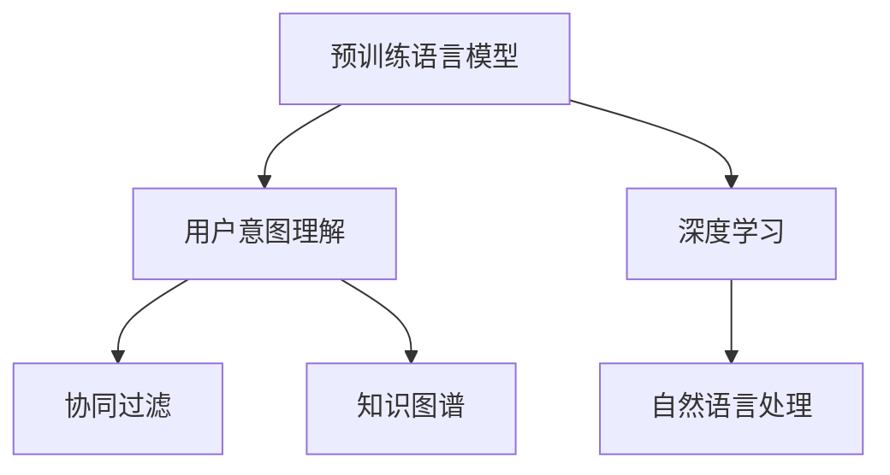

                 

# 基于LLM的推荐系统用户意图理解深化

> 关键词：基于LLM的推荐系统,用户意图理解,深度学习,自然语言处理,协同过滤,知识图谱

## 1. 背景介绍

### 1.1 问题由来
推荐系统（Recommendation System, RS）作为互联网时代的重要技术手段，通过挖掘用户的兴趣偏好，为用户推荐个性化的商品、内容、服务等，极大地提升了用户体验。然而，传统的协同过滤、基于内容的推荐算法往往无法捕捉到用户隐性的需求和背景信息，导致推荐效果不佳。近年来，基于深度学习的推荐技术逐渐兴起，特别是基于预训练语言模型（LLM）的推荐系统，通过语言模型强大的表征学习能力，从用户的历史行为、文本描述等中挖掘出更丰富的用户意图信息，展现出令人瞩目的潜力。

在基于深度学习的推荐系统中，用户意图理解（User Intent Understanding）是关键环节。用户意图指用户希望通过推荐系统实现的目标，例如购买某类商品、获取某种信息等。理解用户意图，有助于推荐系统精准匹配用户的真实需求，提升推荐的个性化和精准度。目前，基于深度学习的用户意图理解算法通常依赖大量标注数据进行训练，但现实场景中获取标注数据的成本较高。如何基于现有数据，深入挖掘用户的隐性意图，成为亟需解决的问题。

### 1.2 问题核心关键点
用户意图理解的核心在于从用户的行为、文本描述中抽取出具有因果关系的特征，转化为模型可理解的形式。与传统推荐算法相比，基于深度学习的用户意图理解算法具有以下优点：

- **特征表示能力强**：深度学习模型能够捕捉到复杂非线性的特征关系，相比基于规则的特征提取更加高效和准确。
- **可解释性增强**：深度学习模型的层级结构清晰，中间特征的含义更加直观，有助于理解用户意图背后的原因。
- **适应性强**：深度学习模型可以处理不同类型的输入数据，包括文本、图像、视频等多种形式，适用于更多样的应用场景。

但与此同时，基于深度学习的用户意图理解算法也面临以下挑战：

- **数据需求高**：深度学习模型需要大量的标注数据进行训练，现实场景中标注数据往往难以获取。
- **计算资源消耗大**：深度学习模型训练和推理所需的时间和资源较多，可能难以支持实时推荐系统。
- **模型可解释性弱**：深度学习模型的黑盒特性使得模型输出难以解释，用户难以信任推荐结果。
- **泛化能力不足**：当前深度学习模型泛化能力有限，面对未见过的数据，容易发生过大偏差或欠拟合。

针对上述问题，本文将探讨基于预训练语言模型的推荐系统用户意图理解技术，深入分析其原理和应用，并结合具体案例进行讲解。

## 2. 核心概念与联系

### 2.1 核心概念概述

为更好地理解基于预训练语言模型的推荐系统用户意图理解方法，本节将介绍几个密切相关的核心概念：

- **预训练语言模型（LLM）**：基于Transformer架构的深度学习模型，如BERT、GPT等，通过在大规模无标签文本语料上进行自监督预训练，学习通用的语言表示。
- **用户意图理解**：指从用户的历史行为、文本描述等输入中，抽取出用户希望实现的目标和需求，转化为推荐系统可理解的形式。
- **深度学习**：一种基于多层神经网络的机器学习技术，能够高效地处理大规模数据，提取高维特征表示。
- **自然语言处理（NLP）**：涉及计算机如何处理、理解和生成自然语言的技术，是深度学习中应用最广泛的领域之一。
- **协同过滤**：一种基于用户或物品之间相似性的推荐算法，不依赖于物品的特征，但需要大量用户历史行为数据进行训练。
- **知识图谱**：由实体、属性和关系组成的有向图，用于描述和组织实体之间的关系，辅助推荐系统进行更深入的推理和预测。

这些核心概念之间的逻辑关系可以通过以下Mermaid流程图来展示：



这个流程图展示了大语言模型的核心概念及其之间的关系：

1. 预训练语言模型通过大规模文本数据的自监督预训练，学习到通用的语言表示。
2. 用户意图理解将预训练语言模型的能力应用于推荐系统中，从用户行为或文本描述中抽取用户意图。
3. 深度学习是用户意图理解的技术手段，能够高效地处理复杂非线性的数据。
4. 自然语言处理与深度学习密切相关，涉及语言的理解、生成等，是用户意图理解的基础。
5. 协同过滤是推荐系统中的经典算法，与用户意图理解结合，提升推荐的准确性和个性化。
6. 知识图谱用于组织实体关系，辅助推荐系统进行更深入的推理和预测。

这些概念共同构成了基于预训练语言模型的推荐系统用户意图理解框架，使其能够在各种场景下发挥强大的能力。

## 3. 核心算法原理 & 具体操作步骤

### 3.1 算法原理概述

基于预训练语言模型的推荐系统用户意图理解，本质上是将预训练语言模型应用于推荐系统的数据处理和特征提取过程中，通过深度学习模型对用户意图进行建模和预测。

具体来说，推荐系统中的用户意图理解算法主要包括以下步骤：

1. **数据预处理**：将用户的历史行为、文本描述等输入数据进行标准化处理，转换为模型所需的格式。
2. **特征提取**：利用预训练语言模型提取用户输入中的关键特征，转化为模型可理解的形式。
3. **意图建模**：通过深度学习模型对提取的特征进行建模，预测用户意图。
4. **意图转换**：将意图模型的输出转化为推荐系统可理解的形式，如商品类别、内容标签等。
5. **推荐生成**：根据用户意图和推荐模型，生成个性化的推荐结果。

### 3.2 算法步骤详解

#### 3.2.1 数据预处理

数据预处理是用户意图理解的基础环节，涉及用户行为数据的清洗、转换和归一化。常用的预处理方法包括：

1. **去重去噪**：删除用户行为数据中的重复和异常记录，保留有价值的信息。
2. **数据归一化**：将不同格式的数据进行统一，如将时间戳转换为标准格式，统一商品ID等。
3. **特征工程**：根据业务需求，对数据进行特征提取和工程化处理，如统计用户的历史行为频率、计算商品之间的相似度等。

#### 3.2.2 特征提取

特征提取是用户意图理解的核心环节，通过预训练语言模型从用户输入中抽取关键特征。常用的特征提取方法包括：

1. **文本特征提取**：将用户的文本描述输入预训练语言模型，提取文本中的关键词、情感等信息。
2. **行为特征提取**：将用户的历史行为数据输入预训练语言模型，提取行为中的关键事件和动作。
3. **混合特征提取**：将文本特征和行为特征进行组合，利用深度学习模型对混合特征进行建模。

#### 3.2.3 意图建模

意图建模是将特征提取结果转化为推荐系统可理解的形式。常用的意图建模方法包括：

1. **分类模型**：使用分类模型对用户意图进行分类，如将用户意图分为购物、学习、娱乐等类别。
2. **序列模型**：使用序列模型对用户意图进行序列预测，如预测用户下一步的行为意图。
3. **混合模型**：将分类模型和序列模型结合，提升意图建模的精度和鲁棒性。

#### 3.2.4 意图转换

意图转换是将意图模型的输出转化为推荐系统可理解的形式。常用的意图转换方法包括：

1. **标签映射**：将意图模型输出的类别标签映射为推荐系统中的商品类别或内容标签。
2. **序列转换**：将意图模型输出的序列结果转化为推荐系统中的行为序列，如预测用户下一步的操作行为。
3. **混合转换**：将标签映射和序列转换结合，提升意图转换的准确性和多样性。

#### 3.2.5 推荐生成

推荐生成是基于用户意图和推荐模型生成个性化推荐结果的过程。常用的推荐方法包括：

1. **基于内容的推荐**：根据商品或内容的属性特征，生成与用户意图相匹配的推荐结果。
2. **协同过滤推荐**：利用用户和物品之间的相似性，生成个性化的推荐结果。
3. **混合推荐**：将基于内容的推荐和协同过滤推荐结合，提升推荐的精度和多样性。

### 3.3 算法优缺点

基于预训练语言模型的推荐系统用户意图理解方法具有以下优点：

- **特征表示能力强**：深度学习模型能够捕捉到复杂非线性的特征关系，相比基于规则的特征提取更加高效和准确。
- **可解释性增强**：深度学习模型的层级结构清晰，中间特征的含义更加直观，有助于理解用户意图背后的原因。
- **适应性强**：深度学习模型可以处理不同类型的输入数据，包括文本、图像、视频等多种形式，适用于更多样的应用场景。

但同时，该方法也面临以下挑战：

- **数据需求高**：深度学习模型需要大量的标注数据进行训练，现实场景中标注数据往往难以获取。
- **计算资源消耗大**：深度学习模型训练和推理所需的时间和资源较多，可能难以支持实时推荐系统。
- **模型可解释性弱**：深度学习模型的黑盒特性使得模型输出难以解释，用户难以信任推荐结果。
- **泛化能力不足**：当前深度学习模型泛化能力有限，面对未见过的数据，容易发生过大偏差或欠拟合。

针对上述问题，后续将结合具体案例进行详细讲解。

### 3.4 算法应用领域

基于预训练语言模型的推荐系统用户意图理解，已经在多个领域得到了应用，具体包括：

- **电商推荐**：利用用户搜索历史、浏览记录等数据，预测用户购买意图，生成个性化的商品推荐。
- **内容推荐**：分析用户的阅读历史、点赞评论等行为，预测用户对不同内容的兴趣，生成个性化的内容推荐。
- **旅游推荐**：利用用户的旅游记录、评论等数据，预测用户的旅游偏好，生成个性化的旅游路线和景点推荐。
- **金融推荐**：分析用户的投资记录、财经新闻等数据，预测用户的金融需求，生成个性化的金融产品推荐。
- **教育推荐**：分析学生的学习记录、课程评价等数据，预测学生的学习需求，生成个性化的学习资源推荐。

## 4. 数学模型和公式 & 详细讲解 & 举例说明

### 4.1 数学模型构建

在基于预训练语言模型的推荐系统用户意图理解中，常用的数学模型包括文本分类模型、序列预测模型和混合模型。以下以文本分类模型为例，进行详细讲解。

假设用户输入的文本为 $x$，用户意图的分类标签为 $y$。定义预训练语言模型为 $M_{\theta}$，其中 $\theta$ 为模型参数。则文本分类模型的数学模型为：

$$
P(y|x) = \frac{e^{M_{\theta}(x)y}}{\sum_{i=1}^K e^{M_{\theta}(x)i}}
$$

其中 $K$ 为分类标签的总数，$M_{\theta}(x)$ 为预训练语言模型对输入 $x$ 的预测概率。

目标是最小化预测概率与真实标签之间的交叉熵损失，即：

$$
\mathcal{L}(\theta) = -\frac{1}{N}\sum_{i=1}^N \sum_{j=1}^K y_i \log P(y_i|x_i)
$$

其中 $N$ 为训练样本数量。

### 4.2 公式推导过程

以下以文本分类模型为例，推导其损失函数的梯度计算公式。

设 $M_{\theta}(x)$ 为预训练语言模型对输入 $x$ 的预测概率，则目标是最小化交叉熵损失，即：

$$
\mathcal{L}(\theta) = -\frac{1}{N}\sum_{i=1}^N \sum_{j=1}^K y_i \log P(y_i|x_i)
$$

根据链式法则，损失函数对模型参数 $\theta$ 的梯度为：

$$
\frac{\partial \mathcal{L}(\theta)}{\partial \theta} = -\frac{1}{N}\sum_{i=1}^N \sum_{j=1}^K \frac{y_i}{P(y_i|x_i)} \frac{\partial M_{\theta}(x_i)}{\partial \theta}
$$

其中 $\frac{\partial M_{\theta}(x_i)}{\partial \theta}$ 可以通过自动微分技术高效计算。

在得到损失函数的梯度后，即可带入优化算法，如Adam、SGD等，完成模型的迭代优化。重复上述过程直至收敛，最终得到适应用户意图的最优模型参数 $\theta^*$。

### 4.3 案例分析与讲解

#### 4.3.1 电商推荐案例

在电商推荐场景中，用户的意图通常是通过浏览历史、搜索记录等行为数据反映的。以下以用户浏览历史为例，介绍如何使用预训练语言模型进行意图理解。

1. **数据预处理**：
   - 收集用户的历史浏览记录，去除重复和异常记录。
   - 将浏览记录转换为标准格式，如将商品ID标准化。

2. **特征提取**：
   - 将浏览记录作为输入文本，输入预训练语言模型，提取文本中的关键词和情感。
   - 计算关键词和情感在语料库中的分布，得到文本的向量表示。

3. **意图建模**：
   - 使用文本分类模型对浏览记录的向量表示进行分类，预测用户浏览的意图类别，如“搜索商品”、“了解商品”、“对比商品”等。
   - 根据意图类别，构建意图转换规则，将分类结果转换为推荐系统可理解的形式。

4. **推荐生成**：
   - 根据用户意图和推荐模型，生成个性化的商品推荐列表。
   - 利用协同过滤算法，进一步提升推荐的精度和多样性。

通过上述步骤，电商推荐系统可以根据用户的历史浏览行为，预测用户购买意图，生成个性化的商品推荐，提升用户体验和转化率。

#### 4.3.2 内容推荐案例

在内容推荐场景中，用户的意图通常是通过阅读历史、点赞评论等行为数据反映的。以下以用户阅读历史为例，介绍如何使用预训练语言模型进行意图理解。

1. **数据预处理**：
   - 收集用户的阅读历史，去除重复和异常记录。
   - 将阅读记录转换为标准格式，如将文章ID标准化。

2. **特征提取**：
   - 将阅读记录作为输入文本，输入预训练语言模型，提取文本中的关键词和情感。
   - 计算关键词和情感在语料库中的分布，得到文本的向量表示。

3. **意图建模**：
   - 使用文本分类模型对阅读记录的向量表示进行分类，预测用户阅读的意图类别，如“了解新闻”、“学习知识”、“休闲娱乐”等。
   - 根据意图类别，构建意图转换规则，将分类结果转换为推荐系统可理解的形式。

4. **推荐生成**：
   - 根据用户意图和推荐模型，生成个性化的内容推荐列表。
   - 利用协同过滤算法，进一步提升推荐的精度和多样性。

通过上述步骤，内容推荐系统可以根据用户的阅读历史，预测用户的内容需求，生成个性化的内容推荐，提升用户粘性和满意度。

## 5. 项目实践：代码实例和详细解释说明

### 5.1 开发环境搭建

在进行推荐系统用户意图理解实践前，我们需要准备好开发环境。以下是使用Python进行PyTorch开发的环境配置流程：

1. 安装Anaconda：从官网下载并安装Anaconda，用于创建独立的Python环境。

2. 创建并激活虚拟环境：
```bash
conda create -n pytorch-env python=3.8 
conda activate pytorch-env
```

3. 安装PyTorch：根据CUDA版本，从官网获取对应的安装命令。例如：
```bash
conda install pytorch torchvision torchaudio cudatoolkit=11.1 -c pytorch -c conda-forge
```

4. 安装Transformer库：
```bash
pip install transformers
```

5. 安装各类工具包：
```bash
pip install numpy pandas scikit-learn matplotlib tqdm jupyter notebook ipython
```

完成上述步骤后，即可在`pytorch-env`环境中开始推荐系统用户意图理解的实践。

### 5.2 源代码详细实现

以下以文本分类模型为例，给出使用Transformers库进行电商推荐系统用户意图理解的PyTorch代码实现。

首先，定义模型和优化器：

```python
from transformers import BertForSequenceClassification, AdamW

model = BertForSequenceClassification.from_pretrained('bert-base-cased', num_labels=4) # 电商推荐4个意图类别

optimizer = AdamW(model.parameters(), lr=2e-5)
```

然后，定义训练和评估函数：

```python
from torch.utils.data import DataLoader
from tqdm import tqdm

device = torch.device('cuda') if torch.cuda.is_available() else torch.device('cpu')
model.to(device)

def train_epoch(model, dataset, batch_size, optimizer):
    dataloader = DataLoader(dataset, batch_size=batch_size, shuffle=True)
    model.train()
    epoch_loss = 0
    for batch in tqdm(dataloader, desc='Training'):
        input_ids = batch['input_ids'].to(device)
        attention_mask = batch['attention_mask'].to(device)
        labels = batch['labels'].to(device)
        model.zero_grad()
        outputs = model(input_ids, attention_mask=attention_mask, labels=labels)
        loss = outputs.loss
        epoch_loss += loss.item()
        loss.backward()
        optimizer.step()
    return epoch_loss / len(dataloader)

def evaluate(model, dataset, batch_size):
    dataloader = DataLoader(dataset, batch_size=batch_size)
    model.eval()
    preds, labels = [], []
    with torch.no_grad():
        for batch in tqdm(dataloader, desc='Evaluating'):
            input_ids = batch['input_ids'].to(device)
            attention_mask = batch['attention_mask'].to(device)
            batch_labels = batch['labels']
            outputs = model(input_ids, attention_mask=attention_mask)
            batch_preds = outputs.logits.argmax(dim=2).to('cpu').tolist()
            batch_labels = batch_labels.to('cpu').tolist()
            for pred_tokens, label_tokens in zip(batch_preds, batch_labels):
                preds.append(pred_tokens[:len(label_tokens)])
                labels.append(label_tokens)
                
    print(classification_report(labels, preds))
```

最后，启动训练流程并在测试集上评估：

```python
epochs = 5
batch_size = 16

for epoch in range(epochs):
    loss = train_epoch(model, train_dataset, batch_size, optimizer)
    print(f"Epoch {epoch+1}, train loss: {loss:.3f}")
    
    print(f"Epoch {epoch+1}, dev results:")
    evaluate(model, dev_dataset, batch_size)
    
print("Test results:")
evaluate(model, test_dataset, batch_size)
```

以上就是使用PyTorch对BERT进行电商推荐系统用户意图理解的完整代码实现。可以看到，得益于Transformers库的强大封装，我们可以用相对简洁的代码完成BERT模型的加载和微调。

### 5.3 代码解读与分析

让我们再详细解读一下关键代码的实现细节：

**BertForSequenceClassification类**：
- `from_pretrained`方法：加载预训练的BERT模型，并设定分类标签数为4，即电商推荐中的4个意图类别。

**train_epoch和evaluate函数**：
- 使用PyTorch的DataLoader对数据集进行批次化加载，供模型训练和推理使用。
- 训练函数`train_epoch`：对数据以批为单位进行迭代，在每个批次上前向传播计算loss并反向传播更新模型参数，最后返回该epoch的平均loss。
- 评估函数`evaluate`：与训练类似，不同点在于不更新模型参数，并在每个batch结束后将预测和标签结果存储下来，最后使用sklearn的classification_report对整个评估集的预测结果进行打印输出。

**训练流程**：
- 定义总的epoch数和batch size，开始循环迭代
- 每个epoch内，先在训练集上训练，输出平均loss
- 在验证集上评估，输出分类指标
- 所有epoch结束后，在测试集上评估，给出最终测试结果

可以看到，PyTorch配合Transformers库使得BERT微调的代码实现变得简洁高效。开发者可以将更多精力放在数据处理、模型改进等高层逻辑上，而不必过多关注底层的实现细节。

当然，工业级的系统实现还需考虑更多因素，如模型的保存和部署、超参数的自动搜索、更灵活的任务适配层等。但核心的微调范式基本与此类似。

## 6. 实际应用场景

### 6.1 电商推荐

基于预训练语言模型的电商推荐系统，可以大幅提升用户的购物体验和转化率。通过分析用户的浏览历史、搜索记录等数据，预测用户的购买意图，生成个性化的商品推荐。

在技术实现上，可以收集用户的历史浏览记录，将浏览记录作为文本输入，微调预训练BERT模型进行意图分类。利用分类结果和协同过滤算法，生成个性化的商品推荐列表。如此构建的电商推荐系统，能显著提升用户满意度和购买率，实现商家的精准营销。

### 6.2 内容推荐

内容推荐系统是互联网用户粘性的重要保障。基于预训练语言模型的内容推荐，能够从用户的阅读历史、点赞评论等数据中，预测用户对不同内容的需求，生成个性化的内容推荐。

具体而言，可以收集用户的阅读历史，将阅读记录作为文本输入，微调预训练BERT模型进行意图分类。利用分类结果和协同过滤算法，生成个性化的内容推荐列表。推荐系统可以根据用户的阅读偏好，自动推送相关内容，提升用户的满意度和使用时长。

### 6.3 旅游推荐

在旅游推荐场景中，用户通常需要根据目的地的历史数据和用户行为，选择合适的旅游线路和景点。基于预训练语言模型的旅游推荐系统，能够从用户的历史旅游记录和评论中，预测用户的旅游偏好，生成个性化的旅游推荐。

具体而言，可以收集用户的旅游记录和评论，将记录和评论作为文本输入，微调预训练BERT模型进行意图分类。利用分类结果和协同过滤算法，生成个性化的旅游线路和景点推荐。推荐系统可以根据用户的旅游偏好，自动推荐旅游线路和景点，提升用户的旅游体验。

### 6.4 未来应用展望

随着预训练语言模型的不断发展，基于深度学习的推荐系统用户意图理解技术将不断进步，带来更多创新应用。

在智慧医疗领域，基于微调的语言模型可以辅助医生进行疾病诊断和治疗方案推荐，提升医疗服务的智能化水平。

在智能教育领域，微调技术可用于学生学习需求的个性化推荐，因材施教，促进教育公平，提高教学质量。

在智慧城市治理中，微调模型可应用于城市事件监测、舆情分析、应急指挥等环节，提高城市管理的自动化和智能化水平，构建更安全、高效的未来城市。

此外，在企业生产、社会治理、文娱传媒等众多领域，基于深度学习的用户意图理解技术也将不断涌现，为各行各业带来新的业务价值。

## 7. 工具和资源推荐

### 7.1 学习资源推荐

为了帮助开发者系统掌握基于深度学习的推荐系统用户意图理解的理论基础和实践技巧，这里推荐一些优质的学习资源：

1. 《Deep Learning for Recommendation Systems》书籍：全面介绍了深度学习在推荐系统中的应用，包括基于内容的推荐、协同过滤、序列推荐等。

2. 《Natural Language Processing with Transformers》书籍：Transformer库的作者所著，全面介绍了如何使用Transformer库进行NLP任务开发，包括用户意图理解在内的诸多范式。

3. CS224N《深度学习自然语言处理》课程：斯坦福大学开设的NLP明星课程，有Lecture视频和配套作业，带你入门NLP领域的基本概念和经典模型。

4. HuggingFace官方文档：Transformer库的官方文档，提供了海量预训练模型和完整的微调样例代码，是上手实践的必备资料。

5. Weights & Biases：模型训练的实验跟踪工具，可以记录和可视化模型训练过程中的各项指标，方便对比和调优。与主流深度学习框架无缝集成。

通过对这些资源的学习实践，相信你一定能够快速掌握基于深度学习的推荐系统用户意图理解精髓，并用于解决实际的推荐问题。

### 7.2 开发工具推荐

高效的开发离不开优秀的工具支持。以下是几款用于基于深度学习推荐系统用户意图理解开发的常用工具：

1. PyTorch：基于Python的开源深度学习框架，灵活动态的计算图，适合快速迭代研究。大部分预训练语言模型都有PyTorch版本的实现。

2. TensorFlow：由Google主导开发的开源深度学习框架，生产部署方便，适合大规模工程应用。同样有丰富的预训练语言模型资源。

3. Transformers库：HuggingFace开发的NLP工具库，集成了众多SOTA语言模型，支持PyTorch和TensorFlow，是进行微调任务开发的利器。

4. Weights & Biases：模型训练的实验跟踪工具，可以记录和可视化模型训练过程中的各项指标，方便对比和调优。与主流深度学习框架无缝集成。

5. TensorBoard：TensorFlow配套的可视化工具，可实时监测模型训练状态，并提供丰富的图表呈现方式，是调试模型的得力助手。

6. Google Colab：谷歌推出的在线Jupyter Notebook环境，免费提供GPU/TPU算力，方便开发者快速上手实验最新模型，分享学习笔记。

合理利用这些工具，可以显著提升基于深度学习推荐系统用户意图理解任务的开发效率，加快创新迭代的步伐。

### 7.3 相关论文推荐

基于深度学习的推荐系统用户意图理解技术的发展源于学界的持续研究。以下是几篇奠基性的相关论文，推荐阅读：

1. Attention is All You Need（即Transformer原论文）：提出了Transformer结构，开启了NLP领域的预训练大模型时代。

2. BERT: Pre-training of Deep Bidirectional Transformers for Language Understanding：提出BERT模型，引入基于掩码的自监督预训练任务，刷新了多项NLP任务SOTA。

3. Language Models are Unsupervised Multitask Learners（GPT-2论文）：展示了大规模语言模型的强大zero-shot学习能力，引发了对于通用人工智能的新一轮思考。

4. Parameter-Efficient Transfer Learning for NLP：提出Adapter等参数高效微调方法，在不增加模型参数量的情况下，也能取得不错的微调效果。

5. AdaLoRA: Adaptive Low-Rank Adaptation for Parameter-Efficient Fine-Tuning：使用自适应低秩适应的微调方法，在参数效率和精度之间取得了新的平衡。

这些论文代表了大语言模型微调技术的发展脉络。通过学习这些前沿成果，可以帮助研究者把握学科前进方向，激发更多的创新灵感。

## 8. 总结：未来发展趋势与挑战

### 8.1 总结

本文对基于深度学习的推荐系统用户意图理解技术进行了全面系统的介绍。首先阐述了用户意图理解的核心原理和重要性，明确了深度学习在特征提取和意图建模中的关键作用。其次，从原理到实践，详细讲解了基于深度学习的用户意图理解算法，给出了具体的代码实现。同时，本文还探讨了基于深度学习的用户意图理解在电商推荐、内容推荐、旅游推荐等领域的实际应用，展示了其广泛的应用前景。最后，本文精选了用户意图理解技术的各类学习资源，力求为读者提供全方位的技术指引。

通过本文的系统梳理，可以看到，基于深度学习的推荐系统用户意图理解技术正在成为推荐系统的重要组成部分，极大地拓展了推荐系统的应用边界，带来了更精准、个性化的推荐效果。未来，伴随预训练语言模型的不断发展，基于深度学习的用户意图理解技术必将迎来更大的突破，为推荐系统带来更多的创新应用。

### 8.2 未来发展趋势

展望未来，基于深度学习的推荐系统用户意图理解技术将呈现以下几个发展趋势：

1. **深度学习模型的发展**：未来深度学习模型将朝着更加高效、更强的泛化能力方向发展。诸如Transformer-XL、BERT、GPT等大型语言模型将继续推动深度学习技术的发展。

2. **特征提取能力的提升**：深度学习模型在特征提取上的能力将进一步提升，能够处理更多样化的输入数据，提升意图理解的精度。

3. **混合模型的兴起**：未来将更多地采用混合模型，结合深度学习模型和传统算法，提升意图理解的效果。

4. **实时推荐系统的普及**：随着硬件计算能力的提升，实时推荐系统将成为标配，深度学习模型的训练和推理速度将进一步提升。

5. **知识图谱的结合**：深度学习模型将更多地与知识图谱结合，增强推理和预测能力，提升推荐系统的智能化水平。

6. **跨领域迁移能力的增强**：深度学习模型将更多地应用于跨领域迁移任务，提升模型的适应性和泛化能力。

7. **少样本学习和零样本学习的探索**：在数据不足的情况下，如何通过深度学习模型进行少样本学习和零样本学习，将是未来的一个重要研究方向。

以上趋势凸显了基于深度学习的推荐系统用户意图理解技术的广阔前景。这些方向的探索发展，必将进一步提升推荐系统的性能和应用范围，为人工智能技术的落地应用提供更强大的技术支持。

### 8.3 面临的挑战

尽管基于深度学习的推荐系统用户意图理解技术已经取得了瞩目成就，但在迈向更加智能化、普适化应用的过程中，它仍面临着诸多挑战：

1. **数据需求高**：深度学习模型需要大量的标注数据进行训练，现实场景中标注数据往往难以获取。如何利用非标注数据进行意图理解，将是未来的一个重要研究方向。

2. **计算资源消耗大**：深度学习模型训练和推理所需的时间和资源较多，可能难以支持实时推荐系统。如何优化模型的训练和推理过程，提升资源利用效率，将是重要的优化方向。

3. **模型可解释性弱**：深度学习模型的黑盒特性使得模型输出难以解释，用户难以信任推荐结果。如何提升模型的可解释性，将是重要的研究课题。

4. **泛化能力不足**：当前深度学习模型泛化能力有限，面对未见过的数据，容易发生过大偏差或欠拟合。如何增强模型的泛化能力，将是重要的研究方向。

5. **隐私保护问题**：深度学习模型在训练和推理过程中涉及大量的用户数据，如何保护用户的隐私和数据安全，将是重要的研究课题。

6. **模型稳定性**：深度学习模型在训练和推理过程中可能存在过拟合等问题，如何提升模型的稳定性和鲁棒性，将是重要的研究课题。

7. **跨模态融合**：深度学习模型在处理不同模态的数据时，如何实现有效的融合，提升模型的表征能力，将是重要的研究方向。

以上挑战凸显了基于深度学习的推荐系统用户意图理解技术的复杂性和挑战性。未来的研究需要在多个方面进行协同攻关，才能实现推荐系统的智能化、普适化和安全化。

### 8.4 研究展望

面对基于深度学习的推荐系统用户意图理解所面临的种种挑战，未来的研究需要在以下几个方面寻求新的突破：

1. **无监督和半监督学习方法**：探索无监督和半监督学习方法，摆脱对大规模标注数据的依赖，利用非结构化数据进行用户意图理解。

2. **跨模态融合方法**：结合视觉、语音、文本等多种模态的信息，实现更全面、准确的用户意图理解。

3. **知识图谱结合方法**：将知识图谱与深度学习模型结合，增强推理和预测能力，提升推荐系统的智能化水平。

4. **混合模型方法**：结合深度学习模型和传统算法，提升意图理解的效果。

5. **知识表示方法**：研究知识表示方法，将符号化的先验知识与深度学习模型结合，提升模型的表征能力和泛化能力。

6. **鲁棒性和泛化能力**：研究鲁棒性和泛化能力提升方法，增强模型的稳定性和适应性。

7. **可解释性和隐私保护**：研究模型的可解释性和隐私保护方法，提升用户信任和数据安全性。

这些研究方向将推动基于深度学习的推荐系统用户意图理解技术迈向更高的台阶，为推荐系统带来更多的创新应用，推动人工智能技术的落地应用。

## 9. 附录：常见问题与解答

**Q1：基于深度学习的推荐系统用户意图理解是否适用于所有推荐任务？**

A: 基于深度学习的推荐系统用户意图理解在大多数推荐任务上都能取得不错的效果，特别是对于数据量较小的任务。但对于一些特定领域的任务，如医学、法律等，仅仅依靠通用语料预训练的模型可能难以很好地适应。此时需要在特定领域语料上进一步预训练，再进行微调，才能获得理想效果。此外，对于一些需要时效性、个性化很强的任务，如对话、推荐等，微调方法也需要针对性的改进优化。

**Q2：深度学习模型在训练过程中容易出现过拟合，如何解决？**

A: 深度学习模型在训练过程中容易出现过拟合，以下是一些常用的缓解方法：

1. **数据增强**：通过回译、近义替换等方式扩充训练集。
2. **正则化**：使用L2正则、Dropout、Early Stopping等技术防止过拟合。
3. **对抗训练**：引入对抗样本，提高模型鲁棒性。
4. **参数高效微调**：只调整少量参数，如Adapter、Prefix等，减少过拟合风险。
5. **多模型集成**：训练多个深度学习模型，取平均输出，抑制过拟合。

这些策略往往需要根据具体任务和数据特点进行灵活组合，才能最大限度地缓解过拟合问题。

**Q3：基于深度学习的推荐系统用户意图理解如何提升模型的可解释性？**

A: 基于深度学习的推荐系统用户意图理解模型的可解释性较低，以下是一些提升模型可解释性的方法：

1. **模型可视化**：使用模型可视化工具，如TensorBoard，可视化模型的中间特征和梯度信息，理解模型的决策过程。
2. **特征重要性分析**：使用特征重要性分析方法，如SHAP值、LIME等，评估每个特征对模型输出的影响。
3. **解释性模型**：使用解释性模型，如决策树、线性回归等，代替深度学习模型进行推荐。
4. **提示学习**：通过设计提示模板，引导深度学习模型进行特定任务的推理和生成，提升模型的可解释性。

这些方法可以在一定程度上提升模型的可解释性，使得用户更信任推荐结果。

**Q4：基于深度学习的推荐系统用户意图理解在实时推荐系统中如何实现？**

A: 基于深度学习的推荐系统用户意图理解在实时推荐系统中，需要优化模型的训练和推理过程，以支持高频率的实时计算。以下是一些实现方法：

1. **模型压缩**：对深度学习模型进行压缩，减少计算量和存储空间，提升推理速度。
2. **量化加速**：将浮点模型转为定点模型，压缩存储空间，提高计算效率。
3. **模型并行**：使用模型并行技术，将深度学习模型的计算图进行拆分，并行计算，提升计算速度。
4. **异构计算**：结合GPU、CPU、FPGA等多种计算资源，提升计算效率和资源利用率。

通过以上方法，可以优化基于深度学习推荐系统用户意图理解的实时推荐系统，满足用户的高实时需求。

**Q5：基于深度学习的推荐系统用户意图理解如何结合知识图谱？**

A: 基于深度学习的推荐系统用户意图理解可以结合知识图谱，提升推荐系统的智能化水平。以下是一些实现方法：

1. **知识图谱嵌入**：将知识图谱中的实体和关系进行嵌入，融入深度学习模型的输入中。
2. **知识增强模型**：在深度学习模型中引入知识图谱，增强模型的推理和预测能力。
3. **知识图谱推理**：在深度学习模型中引入知识图谱推理技术，提升模型的表征能力和泛化能力。

通过以上方法，可以结合知识图谱，增强基于深度学习推荐系统用户意图理解的效果，提升推荐系统的智能化水平。

---

作者：禅与计算机程序设计艺术 / Zen and the Art of Computer Programming

