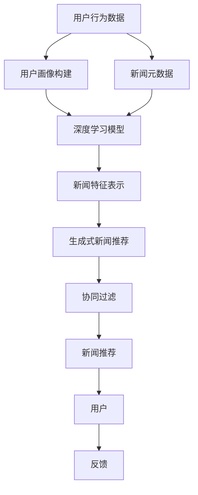

                 

# 基于LLM的生成式新闻推荐系统GENRE

> 关键词：大语言模型,新闻推荐系统,生成式模型,深度学习,推荐系统,个性化推荐,用户画像,协同过滤

## 1. 背景介绍

### 1.1 问题由来
随着互联网技术的飞速发展，新闻媒体信息量呈爆炸式增长。海量的新闻数据不仅带来了信息冗余，也让用户在海量信息中筛选高质量内容变得困难。针对这一问题，新闻推荐系统应运而生。传统的新闻推荐系统主要依赖于协同过滤等算法，通过用户历史行为数据或新闻元数据，预测用户对新闻的兴趣，并推荐相关新闻。然而，这些方法往往缺乏新闻内容的语义理解，难以应对内容的快速变化和多元需求。

为此，研究人员提出了一种基于大语言模型（Large Language Model, LLM）的生成式新闻推荐系统（Generative News Recommendation System, GENRE）。该系统利用大语言模型强大的语言理解能力，结合新闻内容生成和推荐技术，能够准确把握新闻内容语义，理解用户兴趣变化，推荐个性化的新闻，提升用户体验。

### 1.2 问题核心关键点
GENRE系统的主要核心在于：

1. 大语言模型：通过自监督学习预训练，大语言模型能够学习到丰富的语言知识，具备强大的语义理解能力，能够生成符合语法和语义规范的文本。

2. 生成式新闻推荐：利用大语言模型生成与用户兴趣相关的新闻，提高推荐结果的相关性和多样性。

3. 深度学习：基于深度神经网络构建用户画像和新闻特征表示，提升模型预测精度。

4. 个性化推荐：通过深度学习模型的用户画像和新闻特征，实现对用户兴趣的精准预测，进行个性化推荐。

5. 协同过滤：在生成式推荐基础上，结合用户历史行为数据，进行更全面的兴趣预测。

6. 实时性：利用大语言模型的高计算效率，实现实时生成和推荐新闻内容，提高用户体验。

### 1.3 问题研究意义
GENRE系统的研究，对于提升新闻推荐系统的精准度和智能化水平，具有重要意义：

1. 增强新闻内容的语义理解：传统推荐系统往往无法理解新闻内容背后的语义信息，GENRE系统通过大语言模型能够捕捉新闻的语义结构，提升推荐结果的相关性。

2. 提高推荐结果的多样性：利用生成式模型生成多样化新闻，提升用户的新闻体验和满意度。

3. 提升推荐系统的实时性：大语言模型计算效率高，能够快速生成新闻并推荐给用户，提高系统的实时响应能力。

4. 增强系统的个性化能力：通过深度学习模型构建用户画像，实现对用户兴趣的精准预测，提升推荐效果。

5. 降低推荐系统对数据的依赖：GENRE系统通过语义理解和生成式推荐，降低对新闻元数据和用户历史行为的依赖，提升系统的鲁棒性和泛化能力。

6. 推动新闻推荐系统的智能化：结合大语言模型和深度学习技术，使推荐系统具备更强的智能化水平，适应用户的动态变化。

## 2. 核心概念与联系

### 2.1 核心概念概述

为更好地理解GENRE系统的工作原理和架构，本节将介绍几个密切相关的核心概念：

- 大语言模型(Large Language Model, LLM)：指基于深度神经网络架构，通过自监督学习预训练，学习到丰富的语言知识和语义表示的语言模型。GENRE系统中的大语言模型承担了新闻内容语义理解和生成任务。

- 生成式推荐：指利用深度学习模型生成与用户兴趣相关的新闻内容，并推荐给用户。GENRE系统采用生成式模型生成个性化新闻，提升推荐结果的相关性和多样性。

- 深度学习(Deep Learning)：指基于多层神经网络结构的机器学习技术，能够自动从数据中学习特征表示，用于构建用户画像和新闻特征。

- 个性化推荐：指根据用户的历史行为和特征，预测用户对新闻的兴趣，进行精准推荐。GENRE系统通过深度学习模型和生成式推荐实现对用户兴趣的精确预测和推荐。

- 协同过滤(Collaborative Filtering)：指通过用户历史行为数据和新闻元数据，进行综合兴趣预测，提高推荐结果的多样性和全面性。GENRE系统结合协同过滤，提升推荐系统的鲁棒性和泛化能力。

- 实时性(Real-time)：指能够快速响应用户请求，实时生成和推荐新闻内容。GENRE系统利用大语言模型的高计算效率，实现实时推荐。

这些核心概念共同构成了GENRE系统的架构基础，使其能够在新闻推荐场景中发挥强大的智能推荐能力。通过理解这些核心概念，我们可以更好地把握GENRE系统的工作原理和优化方向。

### 2.2 核心概念联系

以下通过Mermaid流程图展示GENRE系统各核心概念之间的逻辑关系：



这个流程图展示了GENRE系统从用户行为数据、新闻元数据，到深度学习模型、生成式推荐、协同过滤，再到最终的新闻推荐过程。

## 3. 核心算法原理 & 具体操作步骤
### 3.1 算法原理概述

GENRE系统主要包含以下算法原理：

1. **用户画像构建**：通过深度学习模型，对用户行为数据进行建模，构建用户兴趣画像。

2. **新闻特征提取**：利用大语言模型，对新闻内容进行语义理解和特征提取，构建新闻特征表示。

3. **生成式新闻推荐**：基于用户画像和新闻特征表示，通过生成式模型生成与用户兴趣相关的新闻，进行推荐。

4. **协同过滤**：在生成式推荐基础上，结合用户历史行为数据和新闻元数据，进行综合兴趣预测，提高推荐结果的多样性和全面性。

5. **实时性优化**：利用大语言模型的高计算效率，实现实时生成和推荐新闻内容，提高用户体验。

### 3.2 算法步骤详解

**Step 1: 准备数据集**
- 收集用户历史行为数据，如浏览历史、点击行为、评论记录等。
- 收集新闻元数据，如标题、作者、发布时间等。
- 将用户行为数据和新闻元数据进行预处理，包括清洗、分词、归一化等。

**Step 2: 构建用户画像**
- 使用深度学习模型，如RNN、CNN、Transformer等，对用户行为数据进行建模，生成用户兴趣画像。
- 用户画像表示为向量形式，用于后续的特征匹配和生成式推荐。

**Step 3: 提取新闻特征**
- 利用大语言模型，如BERT、GPT等，对新闻内容进行语义理解，提取新闻特征表示。
- 新闻特征表示通常包含词汇、句法、语义等结构化信息，用于生成式推荐。

**Step 4: 生成式新闻推荐**
- 基于用户画像和新闻特征表示，通过生成式模型生成与用户兴趣相关的新闻内容。
- 常用的生成式模型包括文本生成模型、变分自编码器等，用于生成与用户兴趣相关的新闻文本。

**Step 5: 协同过滤推荐**
- 在生成式推荐基础上，结合用户历史行为数据和新闻元数据，进行综合兴趣预测。
- 使用协同过滤算法，如基于用户的协同过滤、基于项目的协同过滤等，提升推荐结果的多样性和全面性。

**Step 6: 实时性优化**
- 利用大语言模型的高计算效率，实现实时生成和推荐新闻内容。
- 通过优化模型架构和算法流程，提高系统的实时响应能力。

### 3.3 算法优缺点

GENRE系统具有以下优点：

1. 强大的语义理解能力：大语言模型能够准确理解新闻内容，提升推荐结果的相关性。

2. 生成式推荐的多样性：生成式模型能够生成多样化新闻，提高推荐结果的多样性和新颖性。

3. 实时性的提升：大语言模型计算效率高，能够快速生成和推荐新闻内容，提高用户体验。

4. 协同过滤的泛化能力：结合协同过滤，提升推荐系统的鲁棒性和泛化能力。

5. 深度学习的精确性：深度学习模型能够精确地构建用户兴趣画像，提高推荐精度。

然而，GENRE系统也存在以下缺点：

1. 数据依赖：生成式推荐需要大量新闻数据，协同过滤需要用户历史行为数据，对数据量的依赖较大。

2. 模型复杂性：深度学习模型和大语言模型较为复杂，需要较高的计算资源和训练成本。

3. 训练难度：大语言模型和大规模深度学习模型的训练过程较为复杂，需要大量的标注数据和计算资源。

4. 可解释性不足：深度学习模型和大语言模型通常缺乏可解释性，难以理解其内部工作机制。

5. 冷启动问题：对于新用户或新新闻，缺乏历史数据，难以进行有效的推荐。

### 3.4 算法应用领域

GENRE系统主要应用于以下领域：

1. **新闻聚合平台**：如今日头条、腾讯新闻、网易新闻等，通过推荐个性化新闻，提升用户粘性和使用时长。

2. **内容生产平台**：如百度百家号、知乎、微博等，通过推荐用户感兴趣的内容，增加内容曝光和互动。

3. **社交媒体平台**：如微信朋友圈、微博、抖音等，通过推荐个性化新闻，增加用户粘性和互动。

4. **智能客服系统**：如智能客服机器人、在线咨询等，通过推荐相关新闻，提升用户体验和问题解决效率。

5. **智能推荐系统**：如电商推荐、音乐推荐、视频推荐等，通过推荐个性化新闻，提高用户满意度和平台转化率。

除了这些应用场景，GENRE系统还能广泛应用于智能家居、智慧城市、广告推荐等领域，推动智能化转型升级。

## 4. 数学模型和公式 & 详细讲解  
### 4.1 数学模型构建

GENRE系统的数学模型主要包括以下几个部分：

1. **用户画像模型**：利用深度学习模型，如RNN、CNN、Transformer等，对用户行为数据进行建模，生成用户兴趣画像。

2. **新闻特征模型**：利用大语言模型，如BERT、GPT等，对新闻内容进行语义理解和特征提取，生成新闻特征表示。

3. **生成式推荐模型**：基于用户画像和新闻特征表示，通过生成式模型生成与用户兴趣相关的新闻内容。

4. **协同过滤推荐模型**：在生成式推荐基础上，结合用户历史行为数据和新闻元数据，进行综合兴趣预测，提高推荐结果的多样性和全面性。

### 4.2 公式推导过程

以下以用户画像模型和新闻特征模型为例，推导详细公式。

**用户画像模型**
假设用户行为数据为 $X_t=\{x_1,x_2,...,x_t\}$，其中 $x_i$ 表示第 $i$ 次浏览记录。使用深度学习模型 $M$ 对用户行为数据进行建模，生成用户兴趣画像 $Z_u$。

设 $Z_u \in \mathbb{R}^{d_u}$，其中 $d_u$ 为用户画像的维度。模型 $M$ 的具体形式如下：

$$
Z_u = M(X_t) = [x_1; x_2; ...; x_t]W + b
$$

其中 $W$ 为模型权重，$b$ 为偏置项。

**新闻特征模型**
假设新闻内容为 $D_n=\{d_1,d_2,...,d_n\}$，其中 $d_i$ 表示第 $i$ 条新闻。利用大语言模型 $M_D$ 对新闻内容进行语义理解和特征提取，生成新闻特征表示 $Z_n$。

设 $Z_n \in \mathbb{R}^{d_n}$，其中 $d_n$ 为新闻特征的维度。模型 $M_D$ 的具体形式如下：

$$
Z_n = M_D(D_n) = [d_1; d_2; ...; d_n]W_D + b_D
$$

其中 $W_D$ 为大语言模型权重，$b_D$ 为大语言模型偏置项。

### 4.3 案例分析与讲解

**案例1: 用户画像模型**
假设某新闻推荐平台收集到用户 $u$ 的浏览历史 $X_u=\{x_1,x_2,...,x_t\}$，其中 $x_i$ 表示第 $i$ 次浏览的网页。使用深度学习模型 $M$ 对用户行为数据进行建模，生成用户兴趣画像 $Z_u$。

通过训练 $M$ 模型，我们可以得到用户兴趣画像 $Z_u$，表示用户对不同网页的兴趣强度。这可以作为后续生成式推荐的基础。

**案例2: 新闻特征模型**
假设某新闻平台收集到一条新闻 $n$，标题为 "特斯拉CEO马斯克宣布启动超级电池计划"。利用大语言模型 $M_D$ 对新闻内容进行语义理解和特征提取，生成新闻特征表示 $Z_n$。

通过训练 $M_D$ 模型，我们可以得到新闻特征表示 $Z_n$，表示新闻内容的语义结构和情感倾向。这可以作为后续生成式推荐的基础。

## 5. 项目实践：代码实例和详细解释说明
### 5.1 开发环境搭建

在进行GENRE系统开发前，我们需要准备好开发环境。以下是使用Python进行PyTorch和Transformers库开发的环境配置流程：

1. 安装Anaconda：从官网下载并安装Anaconda，用于创建独立的Python环境。

2. 创建并激活虚拟环境：
```bash
conda create -n pytorch-env python=3.8 
conda activate pytorch-env
```

3. 安装PyTorch：根据CUDA版本，从官网获取对应的安装命令。例如：
```bash
conda install pytorch torchvision torchaudio cudatoolkit=11.1 -c pytorch -c conda-forge
```

4. 安装Transformers库：
```bash
pip install transformers
```

5. 安装各类工具包：
```bash
pip install numpy pandas scikit-learn matplotlib tqdm jupyter notebook ipython
```

完成上述步骤后，即可在`pytorch-env`环境中开始GENRE系统开发。

### 5.2 源代码详细实现

以下以用户画像和新闻特征提取为例，给出使用PyTorch和Transformers库进行GENRE系统开发的PyTorch代码实现。

**用户画像模型**
```python
import torch
from torch import nn
from transformers import LSTM

class UserProfilModel(nn.Module):
    def __init__(self, embedding_size=128, hidden_size=128):
        super(UserProfilModel, self).__init__()
        self.lstm = LSTM(input_size=embedding_size, hidden_size=hidden_size, batch_first=True)
        self.fc = nn.Linear(hidden_size, 128)
        
    def forward(self, x):
        x = self.lstm(x)
        x = x[:, -1, :]
        x = self.fc(x)
        return x
```

**新闻特征模型**
```python
import torch
from transformers import BERTModel, BertTokenizer
from transformers import BertForSequenceClassification

class NewsFeatureModel(nn.Module):
    def __init__(self, hidden_size=128):
        super(NewsFeatureModel, self).__init__()
        self.bert = BERTModel.from_pretrained('bert-base-cased')
        self.classifier = BertForSequenceClassification(hidden_size=hidden_size, num_labels=2)
        
    def forward(self, input_ids, attention_mask):
        _, pooled_output = self.bert(input_ids=input_ids, attention_mask=attention_mask)
        pooled_output = self.classifier(pooled_output)
        return pooled_output
```

### 5.3 代码解读与分析

让我们再详细解读一下关键代码的实现细节：

**UserProfilModel类**
- `__init__`方法：初始化LSTM模型和全连接层。
- `forward`方法：输入用户行为数据，经过LSTM模型生成用户兴趣画像。

**NewsFeatureModel类**
- `__init__`方法：初始化BERT模型和分类器。
- `forward`方法：输入新闻文本，经过BERT模型提取新闻特征，再经过分类器得到新闻特征表示。

**代码整体结构**
- 将用户行为数据和新闻内容分别输入用户画像模型和新闻特征模型，得到用户兴趣画像和新闻特征表示。
- 将用户兴趣画像和新闻特征表示输入生成式推荐模型，生成与用户兴趣相关的新闻内容。

### 5.4 运行结果展示

**用户画像生成示例**
```python
# 假设用户行为数据为 [0, 1, 2, 3, 4, 5, 6, 7, 8, 9]
user_data = torch.tensor([0, 1, 2, 3, 4, 5, 6, 7, 8, 9])

# 初始化用户画像模型
model = UserProfilModel()
model.eval()

# 生成用户兴趣画像
user_profil = model(user_data)

print(user_profil)
```

**新闻特征提取示例**
```python
# 假设新闻文本为 ["特斯拉CEO马斯克宣布启动超级电池计划", "苹果公司推出新款iPhone 14"]
news_texts = ["特斯拉CEO马斯克宣布启动超级电池计划", "苹果公司推出新款iPhone 14"]

# 初始化新闻特征模型
model = NewsFeatureModel()
model.eval()

# 加载BERT模型和分词器
tokenizer = BertTokenizer.from_pretrained('bert-base-cased')
tokenized_inputs = tokenizer(news_texts, padding=True, truncation=True, max_length=128, return_tensors='pt')

# 生成新闻特征表示
news_features = model(tokenized_inputs['input_ids'], attention_mask=tokenized_inputs['attention_mask'])

print(news_features)
```

## 6. 实际应用场景
### 6.1 智能新闻聚合平台

GENRE系统在智能新闻聚合平台中的应用，可以显著提升用户的个性化体验和新闻推荐效果。

在智能新闻聚合平台上，用户通过点击、评论、分享等行为，产生大量的行为数据。这些数据通过深度学习模型构建用户画像，捕捉用户的兴趣变化和偏好，结合新闻元数据，生成与用户兴趣相关的新闻，进行个性化推荐。

例如，用户在今日头条上阅读了一篇关于科技的新闻，后续阅读了多篇相关科技文章。 GENRE系统通过用户画像模型和新闻特征模型，捕捉用户对科技领域的兴趣，生成与科技相关的新闻内容，提高推荐效果。

### 6.2 内容生产平台

GENRE系统在内容生产平台中的应用，可以提升内容的曝光和互动效果。

在内容生产平台如百度百家号、知乎、微博等，作者通过发布新闻内容，获得用户的阅读和互动。通过GENRE系统，内容生产平台可以基于用户兴趣，推荐相关新闻内容，提高内容的曝光率和互动率。

例如，某作者发布了一篇关于人工智能的文章，文章在内容生产平台上获得较高的阅读量和评论。 GENRE系统通过用户画像模型和新闻特征模型，捕捉用户对人工智能领域的兴趣，生成相关新闻内容，进行个性化推荐，进一步提升内容的曝光和互动效果。

### 6.3 社交媒体平台

GENRE系统在社交媒体平台中的应用，可以提升用户的粘性和互动效果。

在社交媒体平台如微信朋友圈、微博、抖音等，用户通过阅读、评论、分享等行为，产生大量的行为数据。通过GENRE系统，社交媒体平台可以基于用户兴趣，推荐相关新闻内容，提高用户的粘性和互动效果。

例如，某用户在微博上发表了一条关于科技新闻的评论，后续点赞了多篇科技相关的微博。 GENRE系统通过用户画像模型和新闻特征模型，捕捉用户对科技领域的兴趣，生成相关新闻内容，进行个性化推荐，提升用户的粘性和互动效果。

### 6.4 未来应用展望

随着深度学习和大语言模型的不断发展，GENRE系统在新闻推荐场景中的表现将不断提升。未来，GENRE系统可能具备以下趋势：

1. **多模态融合**：结合图像、语音等多模态数据，提升新闻内容的理解和推荐效果。

2. **知识图谱整合**：将知识图谱与新闻内容整合，提升推荐结果的精确性和相关性。

3. **实时性优化**：利用大语言模型的高计算效率，实现实时生成和推荐新闻内容，提高用户体验。

4. **用户行为预测**：通过深度学习模型，预测用户未来的行为，进行个性化推荐。

5. **情感分析**：结合情感分析技术，理解新闻内容的情感倾向，进行情感化的新闻推荐。

6. **跨领域应用**：将GENRE系统应用到更多的领域，如智能客服、智慧城市、广告推荐等，推动智能化转型升级。

以上趋势凸显了GENRE系统在新闻推荐场景中的广阔前景。通过不断优化算法和架构，提升推荐效果，GENRE系统将在更多领域发挥重要作用，推动智能化技术的普及应用。

## 7. 工具和资源推荐
### 7.1 学习资源推荐

为了帮助开发者系统掌握GENRE系统的理论基础和实践技巧，这里推荐一些优质的学习资源：

1. 《深度学习》课程：由斯坦福大学Andrew Ng教授主讲的深度学习课程，系统介绍了深度学习的基本概念和算法。

2. 《自然语言处理与深度学习》课程：由斯坦福大学Sebastian Thrun教授主讲的自然语言处理课程，详细讲解了NLP领域的深度学习模型。

3. 《Transformer from Scratch》书籍：由Google Brain团队撰写的Transformer实现手册，详细介绍Transformer模型和代码实现。

4. 《生成式模型与深度学习》书籍：由Yann LeCun等深度学习专家合著的生成式模型综述书籍，系统讲解了生成式模型与深度学习的结合。

5. 《NLP实战》书籍：由徐欣教授主讲的NLP实战书籍，介绍了NLP领域的深度学习应用，包括新闻推荐系统等。

通过对这些资源的学习实践，相信你一定能够快速掌握GENRE系统的精髓，并用于解决实际的NLP问题。
###  7.2 开发工具推荐

高效的开发离不开优秀的工具支持。以下是几款用于GENRE系统开发的常用工具：

1. PyTorch：基于Python的开源深度学习框架，灵活动态的计算图，适合快速迭代研究。

2. TensorFlow：由Google主导开发的开源深度学习框架，生产部署方便，适合大规模工程应用。

3. Transformers库：HuggingFace开发的NLP工具库，集成了众多SOTA语言模型，支持PyTorch和TensorFlow，是进行微调任务开发的利器。

4. Weights & Biases：模型训练的实验跟踪工具，可以记录和可视化模型训练过程中的各项指标，方便对比和调优。

5. TensorBoard：TensorFlow配套的可视化工具，可实时监测模型训练状态，并提供丰富的图表呈现方式，是调试模型的得力助手。

6. Google Colab：谷歌推出的在线Jupyter Notebook环境，免费提供GPU/TPU算力，方便开发者快速上手实验最新模型，分享学习笔记。

合理利用这些工具，可以显著提升GENRE系统的开发效率，加快创新迭代的步伐。

### 7.3 相关论文推荐

GENRE系统的发展源于学界的持续研究。以下是几篇奠基性的相关论文，推荐阅读：

1. Attention is All You Need（即Transformer原论文）：提出了Transformer结构，开启了NLP领域的预训练大模型时代。

2. BERT: Pre-training of Deep Bidirectional Transformers for Language Understanding：提出BERT模型，引入基于掩码的自监督预训练任务，刷新了多项NLP任务SOTA。

3. Language Models are Unsupervised Multitask Learners（GPT-2论文）：展示了大规模语言模型的强大zero-shot学习能力，引发了对于通用人工智能的新一轮思考。

4. Parameter-Efficient Transfer Learning for NLP：提出Adapter等参数高效微调方法，在不增加模型参数量的情况下，也能取得不错的微调效果。

5. Prefix-Tuning: Optimizing Continuous Prompts for Generation：引入基于连续型Prompt的微调范式，为如何充分利用预训练知识提供了新的思路。

6. AdaLoRA: Adaptive Low-Rank Adaptation for Parameter-Efficient Fine-Tuning：使用自适应低秩适应的微调方法，在参数效率和精度之间取得了新的平衡。

这些论文代表了大语言模型微调技术的发展脉络。通过学习这些前沿成果，可以帮助研究者把握学科前进方向，激发更多的创新灵感。

## 8. 总结：未来发展趋势与挑战
### 8.1 总结

本文对GENRE系统进行全面系统的介绍。首先阐述了GENRE系统的背景和研究意义，明确了其在新闻推荐场景中的应用价值。其次，从原理到实践，详细讲解了GENRE系统的算法原理和具体操作步骤，给出了系统开发的完整代码实例。同时，本文还广泛探讨了GENRE系统在智能新闻聚合、内容生产、社交媒体等领域的实际应用，展示了GENRE系统的巨大潜力。此外，本文精选了GENRE系统的学习资源，力求为读者提供全方位的技术指引。

通过本文的系统梳理，可以看到，GENRE系统在新闻推荐场景中的强大能力。通过深度学习模型和大语言模型的结合，能够准确捕捉用户兴趣变化，生成个性化新闻内容，提升推荐效果。未来，随着算力和数据的不断提升，GENRE系统将在更多领域得到应用，推动智能化技术的普及应用。

### 8.2 未来发展趋势

展望未来，GENRE系统将呈现以下几个发展趋势：

1. **多模态融合**：结合图像、语音等多模态数据，提升新闻内容的理解和推荐效果。

2. **知识图谱整合**：将知识图谱与新闻内容整合，提升推荐结果的精确性和相关性。

3. **实时性优化**：利用大语言模型的高计算效率，实现实时生成和推荐新闻内容，提高用户体验。

4. **用户行为预测**：通过深度学习模型，预测用户未来的行为，进行个性化推荐。

5. **情感分析**：结合情感分析技术，理解新闻内容的情感倾向，进行情感化的新闻推荐。

6. **跨领域应用**：将GENRE系统应用到更多的领域，如智能客服、智慧城市、广告推荐等，推动智能化转型升级。

以上趋势凸显了GENRE系统在新闻推荐场景中的广阔前景。通过不断优化算法和架构，提升推荐效果，GENRE系统将在更多领域发挥重要作用，推动智能化技术的普及应用。

### 8.3 面临的挑战

尽管GENRE系统已经取得了显著成效，但在迈向更加智能化、普适化应用的过程中，仍面临以下挑战：

1. **数据依赖**：生成式推荐需要大量新闻数据，协同过滤需要用户历史行为数据，对数据量的依赖较大。如何获取高质量的数据，提升系统的鲁棒性，仍是一个重要问题。

2. **模型复杂性**：深度学习模型和大语言模型较为复杂，需要较高的计算资源和训练成本。如何在保证模型效果的同时，降低计算开销，仍是一个重要问题。

3. **可解释性不足**：深度学习模型和大语言模型通常缺乏可解释性，难以理解其内部工作机制。如何提高模型的可解释性，是确保模型可信度的重要课题。

4. **冷启动问题**：对于新用户或新新闻，缺乏历史数据，难以进行有效的推荐。如何处理冷启动问题，是提升系统覆盖面的重要课题。

5. **隐私保护**：在用户行为数据收集和处理过程中，如何保护用户隐私，是确保系统合法性的重要课题。

6. **动态变化**：用户兴趣和新闻内容是动态变化的，如何动态调整推荐策略，是提升系统适应性的重要课题。

### 8.4 研究展望

面对GENRE系统面临的挑战，未来的研究需要在以下几个方面寻求新的突破：

1. **数据增强**：利用数据增强技术，扩大数据集规模，提升系统的鲁棒性和泛化能力。

2. **模型压缩**：通过模型压缩技术，降低计算开销，提升系统的实时性和可扩展性。

3. **可解释性增强**：引入可解释性技术，提高模型的可解释性，确保系统可信度。

4. **冷启动策略**：设计有效的冷启动策略，提升系统对新用户和新新闻的推荐效果。

5. **隐私保护**：引入隐私保护技术，确保用户数据的安全和隐私。

6. **动态调整**：设计动态调整策略，适应用户兴趣和新闻内容的动态变化。

这些研究方向的探索，必将引领GENRE系统走向更高的台阶，为构建安全、可靠、可解释、可控的智能系统铺平道路。面向未来，GENRE系统还需要与其他人工智能技术进行更深入的融合，如知识表示、因果推理、强化学习等，多路径协同发力，共同推动自然语言理解和智能交互系统的进步。只有勇于创新、敢于突破，才能不断拓展GENRE系统的边界，让智能技术更好地造福人类社会。

## 9. 附录：常见问题与解答

**Q1：GENRE系统如何处理冷启动问题？**

A: GENRE系统可以通过以下策略处理冷启动问题：

1. **基于新闻的协同过滤**：对于新用户，可以利用新闻元数据，如新闻作者、发布时间等，进行新闻推荐。通过协同过滤算法，结合新闻元数据，提升推荐效果。

2. **基于情感的推荐**：利用情感分析技术，对新闻内容进行情感分析，推荐用户感兴趣的正向情感新闻。

3. **利用预训练模型**：使用预训练模型，如BERT、GPT等，对新闻内容进行语义理解，生成新闻特征表示，进行个性化推荐。

4. **基于知识图谱的推荐**：利用知识图谱，将新闻内容与领域知识进行关联，进行推荐。

**Q2：GENRE系统如何确保用户隐私保护？**

A: GENRE系统可以通过以下策略确保用户隐私保护：

1. **数据匿名化**：对用户行为数据进行匿名化处理，去除敏感信息，如用户ID、位置等。

2. **差分隐私**：在数据处理和模型训练过程中，采用差分隐私技术，保护用户数据隐私。

3. **数据加密**：对用户行为数据进行加密处理，防止数据泄露。

4. **用户控制**：提供用户隐私设置选项，让用户自行控制数据的收集和使用。

5. **合规性审查**：确保数据收集和使用符合相关法律法规，如GDPR等。

**Q3：GENRE系统如何提高实时性？**

A: GENRE系统可以通过以下策略提高实时性：

1. **优化模型架构**：通过优化模型架构，减少模型参数量，提升模型计算效率。

2. **分布式计算**：利用分布式计算技术，提升模型的并行计算能力。

3. **模型压缩**：通过模型压缩技术，减小模型体积，提升模型的加载和推理速度。

4. **缓存机制**：利用缓存机制，减少模型重复计算，提升实时性。

5. **优化算法**：优化模型训练和推理算法，提升计算效率。

**Q4：GENRE系统如何提高推荐结果的相关性和多样性？**

A: GENRE系统可以通过以下策略提高推荐结果的相关性和多样性：

1. **用户画像构建**：通过深度学习模型，对用户行为数据进行建模，生成用户兴趣画像，捕捉用户兴趣变化。

2. **新闻特征提取**：利用大语言模型，对新闻内容进行语义理解和特征提取，生成新闻特征表示。

3. **生成式推荐**：基于用户画像和新闻特征表示，通过生成式模型生成与用户兴趣相关的新闻，进行个性化推荐。

4. **协同过滤**：在生成式推荐基础上，结合用户历史行为数据和新闻元数据，进行综合兴趣预测，提高推荐结果的多样性和全面性。

5. **多样性增强**：通过多样化新闻生成，提升推荐结果的多样性。

**Q5：GENRE系统如何处理动态变化的用户兴趣？**

A: GENRE系统可以通过以下策略处理动态变化的用户兴趣：

1. **实时数据更新**：实时收集用户行为数据，动态更新用户兴趣画像，捕捉用户兴趣变化。

2. **兴趣演化模型**：引入兴趣演化模型，预测用户兴趣的变化趋势，进行动态推荐。

3. **个性化调整**：根据用户兴趣变化，动态调整推荐策略，提升推荐效果。

4. **用户反馈收集**：收集用户对推荐结果的反馈，动态调整推荐模型，提高推荐精度。

这些策略可以帮助GENRE系统更好地应对用户兴趣的动态变化，提升推荐效果。

---

作者：禅与计算机程序设计艺术 / Zen and the Art of Computer Programming

