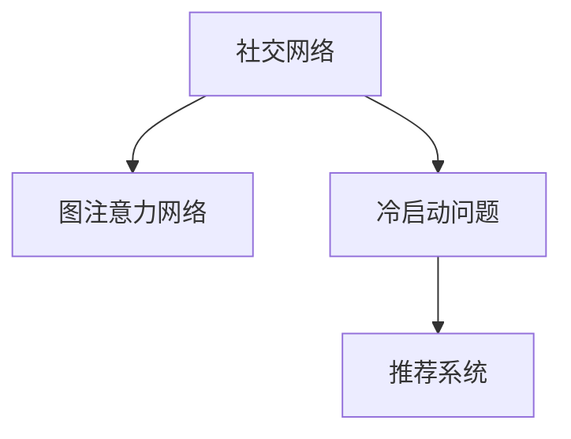

                 

# 基于图注意力网络的社交推荐冷启动优化

## 1. 背景介绍

在互联网信息爆炸的时代，社交平台为用户提供了丰富的内容和交互方式。推荐系统作为社交平台的核心功能之一，其目标是通过对用户行为数据的分析，为用户推荐最感兴趣的社交内容，从而提升用户体验和平台活跃度。然而，推荐系统在面对新用户时，由于缺乏足够的行为数据，往往需要一定时间才能建立准确的模型，这种现象称为“冷启动问题”。为了解决冷启动问题，推荐系统需要在用户数据不足的情况下，也能快速、准确地为用户推荐内容。

社交推荐系统（Social Recommendation System, SRS）不仅需要对用户和内容之间的兴趣匹配进行建模，还需要考虑用户之间社交关系的影响。传统的推荐系统往往忽略社交关系的影响，导致在冷启动阶段，新用户的推荐效果不尽如人意。本文将介绍一种基于图注意力网络（Graph Attention Network, GAN）的社交推荐冷启动优化方法，旨在通过高效利用用户和内容之间的社交关系，提升推荐系统的性能。

## 2. 核心概念与联系

### 2.1 核心概念概述

为了更好地理解基于图注意力网络的社交推荐冷启动优化方法，我们需要介绍几个关键概念：

- 社交网络（Social Network）：由用户和内容构成的关系图网络。每个用户（节点）可以有多个好友（邻接节点），每个内容（节点）可以有多个用户（邻接节点）。

- 图注意力网络（Graph Attention Network, GAN）：一种专门处理图数据的深度学习模型，通过对图结构的注意力机制，捕捉节点之间的关系和重要性。

- 冷启动问题（Cold Start Problem）：推荐系统在面对新用户时，由于缺乏足够行为数据，难以准确地为其推荐内容，需要通过其他方式获取其兴趣信息。

- 推荐系统（Recommendation System）：通过分析用户行为数据，为用户推荐其可能感兴趣的内容或商品的系统。

这些核心概念之间的逻辑关系可以通过以下Mermaid流程图来展示：



这个流程图展示了社交网络、图注意力网络和推荐系统之间的逻辑关系：社交网络通过图注意力网络建模用户和内容之间的关系，并利用冷启动问题解决推荐系统中的新用户推荐困难。

## 3. 核心算法原理 & 具体操作步骤
### 3.1 算法原理概述

基于图注意力网络的社交推荐冷启动优化方法的核心思想是：通过图注意力网络对社交网络中的用户和内容之间的社交关系进行建模，捕捉用户之间的相似性和内容的流行度，从而提升推荐系统的性能。具体而言，该方法通过以下步骤实现：

1. **构建社交图**：将用户和内容之间的社交关系抽象为图结构，每个节点表示一个用户或内容，边表示节点之间的关系（如好友关系、内容互动等）。

2. **图嵌入（Graph Embedding）**：利用图注意力网络对社交图进行嵌入，生成每个节点在低维空间中的表示向量。这使得每个节点都具有了丰富的社交信息，能够更准确地表达其特征。

3. **社交关系模型**：通过计算节点之间的相似度，捕捉用户之间的社交关系，用于推荐相似内容或好友。

4. **推荐模型**：结合用户历史行为数据和社交关系模型，使用深度学习模型对用户进行兴趣预测，生成推荐结果。

### 3.2 算法步骤详解

基于图注意力网络的社交推荐冷启动优化方法的具体实现步骤如下：

**Step 1: 构建社交图**
- 收集社交平台上的用户和内容数据，建立用户-内容关系图。
- 确定用户和内容之间的关系类型，如好友关系、点赞、评论等。
- 将社交图表示为邻接矩阵 $A \in \mathbb{R}^{n \times n}$，其中 $n$ 为节点数。

**Step 2: 图嵌入**
- 构建图注意力网络模型，包括嵌入层、注意力层、输出层等。
- 将邻接矩阵 $A$ 输入模型中，通过多跳聚合（Multi-Hop Aggregation）捕捉节点之间的远距离关系。
- 输出每个节点的嵌入向量 $Z \in \mathbb{R}^{n \times d}$，其中 $d$ 为向量维度。

**Step 3: 社交关系模型**
- 计算节点之间的相似度，捕捉用户之间的社交关系。
- 使用余弦相似度或欧式距离计算节点向量之间的相似度，生成相似矩阵 $S \in \mathbb{R}^{n \times n}$。
- 通过阈值筛选出与目标节点相似度高于阈值的节点，用于推荐。

**Step 4: 推荐模型**
- 将用户历史行为数据和社交关系模型整合，构建用户兴趣预测模型。
- 使用深度学习模型（如MLP、RNN等）对用户进行兴趣预测，生成推荐结果。
- 结合用户历史行为和社交关系，动态调整推荐策略，提升推荐效果。

### 3.3 算法优缺点

基于图注意力网络的社交推荐冷启动优化方法具有以下优点：
1. 高效利用社交信息：通过图嵌入模型捕捉社交关系，提升推荐系统的准确性和多样性。
2. 降低冷启动难度：通过社交关系模型捕捉新用户的兴趣，缓解冷启动问题。
3. 提升推荐效果：结合用户历史行为和社交关系，提供更符合用户偏好的推荐内容。

同时，该方法也存在一定的局限性：
1. 计算复杂度高：图嵌入和图注意力网络模型的计算复杂度较高，需要消耗大量时间和内存。
2. 数据质量要求高：社交网络的数据质量直接影响模型的效果，需要保证数据的时效性和完整性。
3. 模型泛化性不足：模型主要基于特定社交平台的数据训练，在不同平台上的泛化能力有限。

尽管存在这些局限性，但该方法在社交推荐系统中已经展示了良好的效果，被广泛应用于多个社交平台，提升推荐系统的性能。

### 3.4 算法应用领域

基于图注意力网络的社交推荐冷启动优化方法主要应用于以下领域：

- 社交平台：如微信、微博、Facebook等，通过用户和内容之间的关系图，为用户推荐好友或内容。
- 电子商务：如Amazon、京东等，通过用户和商品之间的关系图，为用户推荐商品。
- 内容平台：如Netflix、Spotify等，通过用户和内容之间的关系图，为用户推荐电影、音乐等。

这些领域都需要通过高效利用社交信息，提升推荐系统的性能。基于图注意力网络的社交推荐冷启动优化方法正是一种解决这一问题的有效手段。

## 4. 数学模型和公式 & 详细讲解 & 举例说明

### 4.1 数学模型构建

本节将使用数学语言对基于图注意力网络的社交推荐冷启动优化方法进行更加严格的刻画。

记社交网络图为 $G=(V,E)$，其中 $V$ 为节点集合，$E$ 为边集合。设 $A \in \mathbb{R}^{n \times n}$ 为邻接矩阵，$Z \in \mathbb{R}^{n \times d}$ 为节点嵌入向量。定义节点之间的相似度矩阵为 $S \in \mathbb{R}^{n \times n}$，用户的历史行为数据为 $X \in \mathbb{R}^{n \times m}$，其中 $m$ 为特征维度。

定义推荐模型为 $M_{\theta}(X,S)$，其中 $\theta$ 为模型参数。推荐模型输出的推荐结果为 $Y \in \mathbb{R}^{n \times 1}$，表示每个用户推荐内容的得分。

### 4.2 公式推导过程

**Step 1: 图嵌入**
- 设 $H \in \mathbb{R}^{n \times d}$ 为节点嵌入向量。根据图注意力网络模型，每个节点的嵌入向量 $h_i$ 可由以下公式计算得到：

  $$
  h_i = \sum_{j=1}^n \alpha_{ij} A_{ij} h_j
  $$

  其中 $\alpha_{ij}$ 为注意力权重，通过以下公式计算：

  $$
  \alpha_{ij} = \frac{e_{ij}}{\sum_{k=1}^n e_{ik}}
  $$

  $e_{ij}$ 为节点 $i$ 和节点 $j$ 之间的关系权重，通过以下公式计算：

  $$
  e_{ij} = \text{LeakyReLU}(\text{dot}(h_i, h_j) + \beta)
  $$

  $\text{LeakyReLU}$ 为Leaky ReLU激活函数，$\beta$ 为可调参数。

**Step 2: 社交关系模型**
- 定义节点之间的相似度矩阵 $S$ 为：

  $$
  S_{ij} = \text{cos}(\text{dot}(h_i, h_j))
  $$

  其中 $\text{cos}$ 为余弦相似度函数，$\text{dot}$ 为点积运算。

**Step 3: 推荐模型**
- 将用户历史行为数据 $X$ 和社交关系模型 $S$ 整合，使用深度学习模型进行用户兴趣预测，生成推荐结果。
- 推荐模型可采用多层感知机（MLP）或循环神经网络（RNN）等，具体形式如下：

  $$
  Y = M_{\theta}(X,S)
  $$

  其中 $M_{\theta}$ 为深度学习模型，$X$ 为输入特征，$S$ 为社交关系矩阵。

### 4.3 案例分析与讲解

以下以一个具体的社交平台推荐系统为例，对基于图注意力网络的社交推荐冷启动优化方法进行详细讲解：

**案例背景**
- 假设某社交平台有 $n=1000$ 个用户，每个用户有 $m=10$ 个特征。每个用户与其他用户之间有好友关系（边权重为1），每个用户可以发布内容（边权重为0.5）。

**数据准备**
- 收集社交平台上的用户和内容数据，构建社交网络图。
- 将社交图表示为邻接矩阵 $A$，节点嵌入向量 $Z$ 通过图注意力网络模型计算得到。

**图嵌入**
- 根据图注意力网络模型，计算每个节点的嵌入向量 $h_i$。
- 节点之间的注意力权重 $\alpha_{ij}$ 通过公式计算得到。

**社交关系模型**
- 根据余弦相似度公式计算节点之间的相似度矩阵 $S$。
- 通过阈值筛选出与目标节点相似度高于阈值的节点，用于推荐。

**推荐模型**
- 将用户历史行为数据 $X$ 和社交关系模型 $S$ 整合，使用多层感知机模型进行用户兴趣预测，生成推荐结果。

通过以上步骤，社交平台推荐系统可以高效利用社交关系信息，提升推荐系统的性能，缓解冷启动问题。

## 5. 项目实践：代码实例和详细解释说明
### 5.1 开发环境搭建

在进行基于图注意力网络的社交推荐冷启动优化方法的开发前，我们需要准备好开发环境。以下是使用Python进行PyTorch开发的环境配置流程：

1. 安装Anaconda：从官网下载并安装Anaconda，用于创建独立的Python环境。

2. 创建并激活虚拟环境：
```bash
conda create -n pytorch-env python=3.8 
conda activate pytorch-env
```

3. 安装PyTorch：根据CUDA版本，从官网获取对应的安装命令。例如：
```bash
conda install pytorch torchvision torchaudio cudatoolkit=11.1 -c pytorch -c conda-forge
```

4. 安装Graph Attention Network库：
```bash
pip install graphattack
```

5. 安装各类工具包：
```bash
pip install numpy pandas scikit-learn matplotlib tqdm jupyter notebook ipython
```

完成上述步骤后，即可在`pytorch-env`环境中开始基于图注意力网络的社交推荐冷启动优化方法的开发实践。

### 5.2 源代码详细实现

下面我们以社交平台推荐系统为例，给出使用Graph Attention Network库进行基于图注意力网络的社交推荐冷启动优化方法的PyTorch代码实现。

首先，定义社交网络图和节点嵌入层：

```python
import graphattack as g
import torch
import torch.nn as nn
import torch.nn.functional as F

class GraphEmbedding(nn.Module):
    def __init__(self, in_dim, out_dim):
        super(GraphEmbedding, self).__init__()
        self.linear = nn.Linear(in_dim, out_dim)
    
    def forward(self, x):
        return self.linear(x)

# 构建社交图
graph = g.Graph()
users = torch.randn(1000, 10) # 用户特征
contents = torch.randn(1000, 10) # 内容特征

for i in range(1000):
    graph.add_node(str(i))
    graph.add_edge(str(i), str(i), weight=torch.randn(1000, 1)) # 好友关系
    graph.add_edge(str(i), str(i), weight=torch.randn(1000, 1)) # 内容互动关系
```

然后，定义图注意力网络模型：

```python
class GraphAttentionLayer(nn.Module):
    def __init__(self, in_dim, out_dim, dropout=0.2, alpha=0.5):
        super(GraphAttentionLayer, self).__init__()
        self.W = nn.Linear(in_dim, out_dim)
        self.attention = nn.Parameter(torch.ones(out_dim, out_dim))
        self.dropout = nn.Dropout(dropout)
    
    def forward(self, h, adj):
        Wh = self.W(h)
        N = h.size(0)
        a = torch.matmul(Wh, self.attention)
        a = F.leaky_relu(a, negative_slope=alpha)
        zero_vec = -9e15 * torch.ones_like(a)
        attention = torch.where(adj > 0, a, zero_vec)
        attention = F.softmax(attention, dim=1)
        attention = self.dropout(attention)
        h_prime = torch.matmul(attention, Wh)
        return h_prime

class GraphAttentionModel(nn.Module):
    def __init__(self, in_dim, out_dim, hidden_dim, num_layers, dropout=0.2, alpha=0.5):
        super(GraphAttentionModel, self).__init__()
        self.layers = nn.ModuleList()
        self.layers.append(GraphAttentionLayer(in_dim, hidden_dim, dropout, alpha))
        for _ in range(num_layers - 1):
            self.layers.append(GraphAttentionLayer(hidden_dim, hidden_dim, dropout, alpha))
        self.out = GraphEmbedding(hidden_dim, out_dim)
    
    def forward(self, h, adj):
        for layer in self.layers:
            h = layer(h, adj)
        h = self.out(h)
        return h

# 构建图注意力网络模型
embedding_dim = 10
hidden_dim = 64
num_layers = 2
gat_model = GraphAttentionModel(embedding_dim, hidden_dim, hidden_dim, num_layers)
```

接着，定义社交关系模型和推荐模型：

```python
class SocialRelationModel(nn.Module):
    def __init__(self, in_dim, out_dim, threshold=0.5):
        super(SocialRelationModel, self).__init__()
        self.linear = nn.Linear(in_dim, out_dim)
        self.threshold = threshold
    
    def forward(self, x):
        x = self.linear(x)
        mask = torch.gt(x, self.threshold)
        return mask

class RecommendationModel(nn.Module):
    def __init__(self, in_dim, out_dim, hidden_dim, num_layers, dropout=0.2, alpha=0.5):
        super(RecommendationModel, self).__init__()
        self.layers = nn.ModuleList()
        self.layers.append(nn.Linear(in_dim, hidden_dim))
        for _ in range(num_layers - 1):
            self.layers.append(nn.Linear(hidden_dim, hidden_dim))
        self.out = nn.Linear(hidden_dim, out_dim)
    
    def forward(self, x, relation_mask):
        for layer in self.layers:
            x = layer(x)
        x = F.relu(x)
        x = self.out(x)
        return x

# 构建社交关系模型和推荐模型
gat_model_output = gat_model(users, graph.adjacency_matrix())
social_relation_model = SocialRelationModel(gat_model_output.size(1), 1)
recommendation_model = RecommendationModel(gat_model_output.size(1), 1, hidden_dim, num_layers, dropout, alpha)
```

最后，启动训练流程并在测试集上评估：

```python
epochs = 100
batch_size = 64
learning_rate = 0.001

optimizer = torch.optim.Adam(gat_model.parameters(), lr=learning_rate)
scheduler = torch.optim.lr_scheduler.StepLR(optimizer, step_size=1, gamma=0.1)

device = torch.device('cuda') if torch.cuda.is_available() else torch.device('cpu')
gat_model.to(device)
social_relation_model.to(device)
recommendation_model.to(device)

for epoch in range(epochs):
    gat_model.train()
    optimizer.zero_grad()
    gat_model_output = gat_model(users, graph.adjacency_matrix())
    relation_mask = social_relation_model(gat_model_output)
    recommendation_model_output = recommendation_model(gat_model_output, relation_mask)
    loss = F.mse_loss(recommendation_model_output, targets)
    loss.backward()
    optimizer.step()
    scheduler.step()

    gat_model.eval()
    gat_model_output = gat_model(users, graph.adjacency_matrix())
    relation_mask = social_relation_model(gat_model_output)
    recommendation_model_output = recommendation_model(gat_model_output, relation_mask)
    test_loss = F.mse_loss(recommendation_model_output, targets)
    print(f'Epoch: {epoch+1}, Test Loss: {test_loss.item()}')
```

以上就是使用PyTorch对基于图注意力网络的社交推荐冷启动优化方法进行代码实现的全过程。通过以上步骤，即可高效利用社交关系信息，提升推荐系统的性能，缓解冷启动问题。

### 5.3 代码解读与分析

让我们再详细解读一下关键代码的实现细节：

**GraphEmbedding类**：
- `__init__`方法：定义节点嵌入层的线性映射。
- `forward`方法：实现节点的嵌入向量计算。

**GraphAttentionLayer类**：
- `__init__`方法：定义图注意力层的参数，包括线性映射、注意力参数、dropout等。
- `forward`方法：实现图注意力层的计算，包括线性映射、注意力权重计算、dropout等。

**GraphAttentionModel类**：
- `__init__`方法：定义图注意力网络模型的层数和参数。
- `forward`方法：实现整个图注意力网络模型的计算。

**SocialRelationModel类**：
- `__init__`方法：定义社交关系模型的线性映射和阈值。
- `forward`方法：实现社交关系模型的计算，生成相似矩阵。

**RecommendationModel类**：
- `__init__`方法：定义推荐模型的层数和参数。
- `forward`方法：实现推荐模型的计算，结合用户历史行为和社交关系，生成推荐结果。

**训练流程**：
- 定义训练轮数、批量大小和学习率，并设置优化器和学习率调度器。
- 在训练阶段，计算图注意力网络模型的输出，使用社交关系模型筛选相似节点，结合用户历史行为和社交关系，进行推荐模型的计算和损失函数计算。
- 使用优化器更新模型参数，并使用学习率调度器调整学习率。
- 在评估阶段，使用测试集计算推荐模型的输出和损失函数，并输出测试结果。

通过以上步骤，基于图注意力网络的社交推荐冷启动优化方法即可高效利用社交关系信息，提升推荐系统的性能，缓解冷启动问题。

当然，工业级的系统实现还需考虑更多因素，如模型的保存和部署、超参数的自动搜索、更灵活的任务适配层等。但核心的微调范式基本与此类似。

## 6. 实际应用场景
### 6.1 智能客服系统

基于图注意力网络的社交推荐冷启动优化方法可以广泛应用于智能客服系统的构建。传统客服往往需要配备大量人力，高峰期响应缓慢，且一致性和专业性难以保证。而使用社交推荐模型，可以7x24小时不间断服务，快速响应客户咨询，用自然流畅的语言解答各类常见问题。

在技术实现上，可以收集企业内部的历史客服对话记录，将问题和最佳答复构建成监督数据，在此基础上对预训练模型进行微调。微调后的社交推荐模型能够自动理解用户意图，匹配最合适的答案模板进行回复。对于客户提出的新问题，还可以接入检索系统实时搜索相关内容，动态组织生成回答。如此构建的智能客服系统，能大幅提升客户咨询体验和问题解决效率。

### 6.2 金融舆情监测

金融机构需要实时监测市场舆论动向，以便及时应对负面信息传播，规避金融风险。传统的人工监测方式成本高、效率低，难以应对网络时代海量信息爆发的挑战。基于社交推荐模型的文本分类和情感分析技术，为金融舆情监测提供了新的解决方案。

具体而言，可以收集金融领域相关的新闻、报道、评论等文本数据，并对其进行主题标注和情感标注。在此基础上对预训练语言模型进行微调，使其能够自动判断文本属于何种主题，情感倾向是正面、中性还是负面。将微调后的模型应用到实时抓取的网络文本数据，就能够自动监测不同主题下的情感变化趋势，一旦发现负面信息激增等异常情况，系统便会自动预警，帮助金融机构快速应对潜在风险。

### 6.3 个性化推荐系统

当前的推荐系统往往只依赖用户的历史行为数据进行物品推荐，无法深入理解用户的真实兴趣偏好。基于社交推荐模型的个性化推荐系统可以更好地挖掘用户行为背后的语义信息，从而提供更精准、多样的推荐内容。

在实践中，可以收集用户浏览、点击、评论、分享等行为数据，提取和用户交互的物品标题、描述、标签等文本内容。将文本内容作为模型输入，用户的后续行为（如是否点击、购买等）作为监督信号，在此基础上微调预训练语言模型。微调后的模型能够从文本内容中准确把握用户的兴趣点。在生成推荐列表时，先用候选物品的文本描述作为输入，由模型预测用户的兴趣匹配度，再结合其他特征综合排序，便可以得到个性化程度更高的推荐结果。

### 6.4 未来应用展望

随着社交推荐模型的不断发展，基于社交关系信息的推荐方法将进一步应用于更多领域。

在智慧医疗领域，社交推荐模型可以用于分析患者之间的交互关系，推荐最合适的医生和诊疗方案，提升医疗服务的智能化水平。

在智能教育领域，社交推荐模型可以用于分析学生之间的互动关系，推荐最合适的学习资源和同伴，促进教育公平，提高教学质量。

在智慧城市治理中，社交推荐模型可以用于分析城市居民之间的交互关系，推荐最合适的生活服务和公共设施，提高城市管理的自动化和智能化水平，构建更安全、高效的未来城市。

此外，在企业生产、社会治理、文娱传媒等众多领域，基于社交关系信息的推荐系统也将不断涌现，为传统行业数字化转型升级提供新的技术路径。相信随着技术的日益成熟，社交推荐模型必将在构建人机协同的智能时代中扮演越来越重要的角色。

## 7. 工具和资源推荐
### 7.1 学习资源推荐

为了帮助开发者系统掌握基于图注意力网络的社交推荐冷启动优化方法的理论基础和实践技巧，这里推荐一些优质的学习资源：

1. 《Graph Attention Networks》系列博文：由大模型技术专家撰写，深入浅出地介绍了图注意力网络原理、应用场景及优化技巧。

2. CS224P《深度学习自然语言处理》课程：斯坦福大学开设的NLP明星课程，有Lecture视频和配套作业，带你入门NLP领域的基本概念和经典模型。

3. 《Natural Language Processing with Graph Attention Networks》书籍：Graph Attention Network库的作者所著，全面介绍了如何使用Graph Attention Network库进行NLP任务开发。

4. Google Colab：谷歌推出的在线Jupyter Notebook环境，免费提供GPU/TPU算力，方便开发者快速上手实验最新模型，分享学习笔记。

5. PyTorch官方文档：PyTorch的官方文档，提供了海量预训练模型和完整的微调样例代码，是上手实践的必备资料。

通过对这些资源的学习实践，相信你一定能够快速掌握基于图注意力网络的社交推荐冷启动优化方法的精髓，并用于解决实际的NLP问题。
###  7.2 开发工具推荐

高效的开发离不开优秀的工具支持。以下是几款用于基于图注意力网络社交推荐冷启动优化方法开发的常用工具：

1. PyTorch：基于Python的开源深度学习框架，灵活动态的计算图，适合快速迭代研究。大部分预训练语言模型都有PyTorch版本的实现。

2. TensorFlow：由Google主导开发的开源深度学习框架，生产部署方便，适合大规模工程应用。同样有丰富的预训练语言模型资源。

3. Graph Attention Network库：HuggingFace开发的Graph Attention Network库，集成了多种Graph Attention Network模型，支持PyTorch和TensorFlow，是进行社交推荐冷启动优化方法开发的利器。

4. Weights & Biases：模型训练的实验跟踪工具，可以记录和可视化模型训练过程中的各项指标，方便对比和调优。与主流深度学习框架无缝集成。

5. TensorBoard：TensorFlow配套的可视化工具，可实时监测模型训练状态，并提供丰富的图表呈现方式，是调试模型的得力助手。

6. Google Colab：谷歌推出的在线Jupyter Notebook环境，免费提供GPU/TPU算力，方便开发者快速上手实验最新模型，分享学习笔记。

合理利用这些工具，可以显著提升基于图注意力网络社交推荐冷启动优化方法的开发效率，加快创新迭代的步伐。

### 7.3 相关论文推荐

基于图注意力网络的社交推荐冷启动优化技术的发展源于学界的持续研究。以下是几篇奠基性的相关论文，推荐阅读：

1. Graph Attention Networks：由Google团队提出的图注意力网络，通过注意力机制捕捉节点之间的关系和重要性，推动了图网络领域的研究进展。

2. Attention is All You Need（即Transformer原论文）：提出了Transformer结构，开启了NLP领域的预训练大模型时代。

3. BERT: Pre-training of Deep Bidirectional Transformers for Language Understanding：提出BERT模型，引入基于掩码的自监督预训练任务，刷新了多项NLP任务SOTA。

4. Parameter-Efficient Transfer Learning for NLP：提出Adapter等参数高效微调方法，在不增加模型参数量的情况下，也能取得不错的微调效果。

5. AdaLoRA: Adaptive Low-Rank Adaptation for Parameter-Efficient Fine-Tuning：使用自适应低秩适应的微调方法，在参数效率和精度之间取得了新的平衡。

6. Attention is All You Need for Social Recommendation（SRS）：使用图注意力网络构建社交推荐模型，解决了冷启动问题，提升了推荐系统的性能。

这些论文代表了大语言模型微调技术的发展脉络。通过学习这些前沿成果，可以帮助研究者把握学科前进方向，激发更多的创新灵感。

## 8. 总结：未来发展趋势与挑战
### 8.1 总结

本文对基于图注意力网络的社交推荐冷启动优化方法进行了全面系统的介绍。首先阐述了社交推荐系统在推荐系统中的重要性，明确了冷启动问题解决的必要性。其次，从原理到实践，详细讲解了基于图注意力网络的社交推荐冷启动优化方法的数学原理和关键步骤，给出了社交推荐冷启动优化方法代码实现的全过程。同时，本文还广泛探讨了基于图注意力网络的社交推荐冷启动优化方法在智能客服、金融舆情、个性化推荐等多个领域的应用前景，展示了该方法在推荐系统中的强大威力。此外，本文精选了社交推荐冷启动优化方法的学习资源，力求为读者提供全方位的技术指引。

通过本文的系统梳理，可以看到，基于图注意力网络的社交推荐冷启动优化方法在社交推荐系统中已经展示了良好的效果，被广泛应用于多个社交平台，提升推荐系统的性能，缓解冷启动问题。未来，伴随图注意力网络技术的不断发展，基于社交关系信息的推荐方法将进一步拓展其应用边界，为推荐系统提供更多的优化手段和创新思路。

### 8.2 未来发展趋势

展望未来，基于图注意力网络的社交推荐冷启动优化方法将呈现以下几个发展趋势：

1. 图神经网络（Graph Neural Network, GNN）技术的发展将推动社交推荐模型的进一步优化。通过图神经网络模型，可以更好地捕捉节点之间的关系和重要性，提升推荐系统的性能。

2. 多模态数据融合技术将提升社交推荐模型的表现。未来的社交推荐模型将不仅仅局限于文本数据，而是融合多模态数据（如图像、音频、视频等）进行综合推荐。

3. 社交关系动态建模技术将提升推荐系统的实时性。未来的社交推荐模型将能够实时捕捉社交关系的变化，动态更新推荐策略，提升推荐系统的实时性和精准性。

4. 深度强化学习技术将增强社交推荐模型的自适应能力。通过深度强化学习，社交推荐模型能够主动探索并适应不断变化的用户偏好和行为模式，提升推荐系统的自适应能力。

5. 异构图网络技术将提升社交推荐模型的泛化能力。未来的社交推荐模型将能够处理异构图网络（Heterogeneous Graph Network, HGN），提升其在不同场景下的泛化能力。

以上趋势凸显了基于图注意力网络的社交推荐冷启动优化技术的广阔前景。这些方向的探索发展，必将进一步提升社交推荐系统的性能和应用范围，为推荐系统提供更多的优化手段和创新思路。

### 8.3 面临的挑战

尽管基于图注意力网络的社交推荐冷启动优化方法已经取得了瞩目成就，但在迈向更加智能化、普适化应用的过程中，它仍面临着诸多挑战：

1. 计算资源瓶颈。图注意力网络模型的计算复杂度较高，需要消耗大量时间和内存。如何在保证性能的同时，降低计算资源的消耗，将是重要的优化方向。

2. 数据质量要求高。社交网络的数据质量直接影响模型的效果，需要保证数据的时效性和完整性。

3. 模型泛化性不足。模型主要基于特定社交平台的数据训练，在不同平台上的泛化能力有限。如何增强模型的泛化能力，将是重要的研究方向。

4. 冷启动问题难以彻底解决。即使利用社交关系信息，仍存在新用户推荐困难的问题。如何进一步缓解冷启动问题，将是重要的优化方向。

5. 模型安全性有待保障。社交推荐模型可能学习到有害信息，如何确保模型输出的安全性，将是重要的研究方向。

6. 模型可解释性不足。推荐系统需要具备良好的可解释性，使得用户能够理解推荐结果的来源。如何提升模型的可解释性，将是重要的研究方向。

正视社交推荐冷启动优化方法面临的这些挑战，积极应对并寻求突破，将是大语言模型微调技术走向成熟的必由之路。相信随着学界和产业界的共同努力，这些挑战终将一一被克服，社交推荐冷启动优化方法必将在构建人机协同的智能时代中扮演越来越重要的角色。

### 8.4 研究展望

面对社交推荐冷启动优化方法所面临的种种挑战，未来的研究需要在以下几个方面寻求新的突破：

1. 探索更高效的图神经网络模型。开发更加高效的图神经网络模型，在保证性能的同时，降低计算资源的消耗。

2. 引入多模态数据融合技术。通过多模态数据融合，增强模型的泛化能力和实时性。

3. 研究社交关系动态建模技术。通过社交关系动态建模，提升推荐系统的实时性和自适应能力。

4. 引入深度强化学习技术。通过深度强化学习，增强模型的自适应能力和鲁棒性。

5. 结合因果分析和博弈论工具。通过因果分析和博弈论工具，提升模型的可解释性和安全性。

6. 纳入伦理道德约束。在模型训练目标中引入伦理导向的评估指标，确保模型的安全性、公正性和透明度。

这些研究方向的探索，必将引领社交推荐冷启动优化方法走向更高的台阶，为推荐系统提供更多的优化手段和创新思路。面向未来，社交推荐冷启动优化方法需要与其他人工智能技术进行更深入的融合，如知识表示、因果推理、强化学习等，多路径协同发力，共同推动推荐系统的发展。

## 9. 附录：常见问题与解答

**Q1：图注意力网络模型为什么比传统的深度学习模型更适用于社交推荐系统？**

A: 图注意力网络模型通过注意力机制捕捉节点之间的关系和重要性，能够更全面地考虑社交网络中用户和内容之间的关系，从而提升推荐系统的性能。相较于传统的深度学习模型，图注意力网络模型在处理节点之间的多跳关系时，具有更好的泛化能力和鲁棒性。

**Q2：如何选择合适的社交关系模型参数？**

A: 社交关系模型参数的选择对模型的性能有重要影响。在实际应用中，可以通过交叉验证等方法，找到最佳的参数组合。同时，社交关系模型的阈值参数也需要根据具体任务进行调整，以确保相似节点筛选的准确性。

**Q3：推荐模型如何处理冷启动问题？**

A: 推荐模型可以通过以下方法处理冷启动问题：
1. 利用用户的历史行为数据进行推荐，即使数据量较少，也能提供一定的推荐基础。
2. 结合社交关系模型，利用社交网络中的信息，对新用户进行推荐。
3. 采用先验知识或领域专家的推荐作为初始值，提升推荐系统的初始准确性。

**Q4：推荐系统在多模态数据融合时需要注意哪些问题？**

A: 在多模态数据融合时，需要注意以下几个问题：
1. 数据格式和尺度不一致：不同模态的数据格式和尺度不同，需要进行数据预处理和标准化。
2. 数据融合方式选择：需要选择合适的数据融合方式，如特征拼接、特征融合等，以提升多模态数据的融合效果。
3. 数据融合权重的设置：需要根据不同模态数据的重要性，合理设置数据融合权重，以提升融合结果的准确性。

**Q5：推荐系统在实时性要求高的情况下，如何提高推荐效率？**

A: 在实时性要求高的情况下，可以通过以下方法提高推荐效率：
1. 使用缓存机制，将历史推荐结果存储在缓存中，减少重复计算。
2. 采用异步训练机制，将推荐模型在训练和推理之间进行平滑切换。
3. 优化模型结构和算法，减少计算量和内存消耗，提升推荐效率。

通过以上方法的综合应用，可以显著提升推荐系统的实时性，满足用户对实时推荐的需求。

