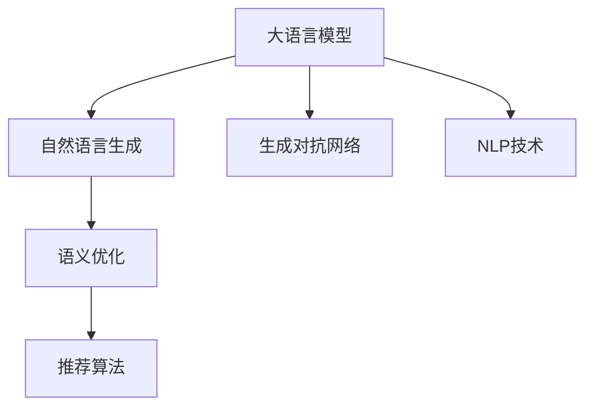

                 

# 基于大模型的商品标题优化技术

> 关键词：商品标题优化,大语言模型,自然语言处理(NLP),自然语言生成(NLG),商品推荐系统,生成对抗网络(GAN),语义生成,语义优化,推荐算法

## 1. 背景介绍

### 1.1 问题由来

在现代电商环境中，商品标题的准确性和优化程度直接影响了商品的搜索排名、用户点击率和转化率，因此如何高效地生成高质量的商品标题，成为了电商领域的一个重要研究方向。传统的商品标题生成方法依赖人工标注和规则约束，不仅费时费力，且难以保证生成效果。随着深度学习和大模型技术的发展，利用大模型自动生成商品标题成为新的研究热点。

特别是近年来，以大语言模型为代表的自然语言处理(NLP)技术取得了突破性进展。例如，Google的BERT、OpenAI的GPT-3等模型，通过在大规模语料上预训练，具备了强大的自然语言理解和生成能力。这些模型被广泛应用于文本生成、问答、翻译等任务，并取得了显著的效果。在商品标题生成领域，大语言模型同样展现出了巨大的潜力。

然而，大语言模型直接生成的商品标题往往存在一些问题，如冗长、模糊、不够具体化等。这不仅影响用户体验，也导致商品在搜索结果中竞争力不足。因此，基于大语言模型的商品标题优化技术，成为了进一步提升商品标题质量的重要手段。

### 1.2 问题核心关键点

基于大语言模型的商品标题优化技术，主要包括以下几个关键点：

1. **大语言模型的应用**：利用大语言模型生成初步的商品标题。
2. **语义优化技术**：通过进一步优化生成结果，使其更准确、具体、吸引用户。
3. **生成对抗网络(GAN)**：引入GAN技术，在生成和优化的过程中提供更多的指导和监督。
4. **推荐算法**：结合推荐算法，优化商品标题的同时提升推荐的准确性和效果。

## 2. 核心概念与联系

### 2.1 核心概念概述

为更好地理解基于大模型的商品标题优化技术，本节将介绍几个密切相关的核心概念：

- **大语言模型(Large Language Model, LLM)**：以自回归(如GPT)或自编码(如BERT)模型为代表的大规模预训练语言模型。通过在大规模无标签文本语料上进行预训练，学习通用的语言表示，具备强大的语言理解和生成能力。

- **自然语言生成(Natural Language Generation, NLG)**：利用计算机自动生成符合人类语言习惯的文本。大语言模型可以用于文本生成、摘要、对话等NLP任务。

- **生成对抗网络(Generative Adversarial Network, GAN)**：由生成器和判别器组成的神经网络模型，通过对抗性训练提升生成器的生成质量。在大语言模型中，GAN被用于辅助语言模型的训练和优化。

- **自然语言处理(Natural Language Processing, NLP)**：涉及计算机处理人类语言的各种技术，包括文本分类、命名实体识别、情感分析等。

- **推荐算法**：用于预测用户行为和兴趣，并推荐相关物品的算法。结合商品标题优化，可以进一步提升推荐效果。

- **语义优化**：通过对生成文本的语义分析和优化，提升文本的可读性和准确性。

这些核心概念之间的逻辑关系可以通过以下Mermaid流程图来展示：



这个流程图展示了大语言模型在商品标题生成和优化中的核心角色，以及与其他NLP技术和优化手段之间的联系。

## 3. 核心算法原理 & 具体操作步骤

### 3.1 算法原理概述

基于大语言模型的商品标题优化技术，本质上是一种结合自然语言处理和生成对抗网络的文本生成和优化方法。其核心思想是：利用大语言模型生成初步的商品标题，然后通过语义优化和生成对抗网络的进一步训练，提升标题的准确性和吸引力，最终结合推荐算法，优化商品展示效果。

具体来说，算法流程包括以下几个步骤：

1. **大语言模型生成商品标题**：使用大语言模型，生成商品描述文本，作为初步的商品标题。
2. **语义优化**：通过语义分析和优化技术，修正生成的商品标题，使其更准确、具体、吸引用户。
3. **生成对抗网络训练**：引入GAN技术，通过对抗性训练，进一步提升商品标题的质量。
4. **结合推荐算法**：利用推荐算法，优化商品标题的同时提升推荐效果，形成良性循环。

### 3.2 算法步骤详解

#### 3.2.1 大语言模型生成商品标题

1. **数据准备**：收集商品描述数据，用于大语言模型训练和商品标题生成。

2. **模型选择与训练**：选择合适的大语言模型，如GPT-3、BERT等，在商品描述数据上进行训练。

3. **商品标题生成**：输入商品信息，利用训练好的大语言模型，生成初步的商品标题。

#### 3.2.2 语义优化

1. **语义分析**：使用自然语言处理技术，对生成标题进行语义分析，识别出不准确、冗余或不具体的词汇和短语。

2. **优化调整**：根据语义分析结果，对商品标题进行优化调整，使标题更加准确、具体、吸引用户。

#### 3.2.3 生成对抗网络训练

1. **生成器训练**：设计生成器网络，使用商品描述数据训练生成器，生成高质量的商品标题。

2. **判别器训练**：设计判别器网络，训练判别器区分真实商品标题和生成器生成的假标题。

3. **对抗性训练**：通过生成器和判别器之间的对抗性训练，逐步提升生成器的生成质量。

#### 3.2.4 结合推荐算法

1. **推荐模型训练**：利用推荐算法，训练推荐模型，预测商品的相关性。

2. **优化商品标题**：根据推荐模型的预测结果，进一步优化商品标题，使其更符合用户的兴趣和需求。

### 3.3 算法优缺点

#### 3.3.1 优点

1. **高效生成**：大语言模型能够快速生成初步的商品标题，显著提高商品标题生成效率。
2. **准确优化**：语义优化和生成对抗网络技术能够进一步提升标题的准确性和质量。
3. **自适应性强**：生成对抗网络能够根据生成器的变化，动态调整训练策略，适应不同场景下的商品标题生成需求。
4. **多任务融合**：结合推荐算法，优化商品标题的同时提升推荐效果，形成良性循环。

#### 3.3.2 缺点

1. **资源消耗大**：大语言模型和生成对抗网络需要较高的计算资源和存储空间，对硬件要求较高。
2. **训练复杂**：语义优化和生成对抗网络训练需要多次迭代和优化，过程较为复杂。
3. **过拟合风险**：生成对抗网络训练过程中可能存在过拟合的风险，需要谨慎控制。

### 3.4 算法应用领域

基于大语言模型的商品标题优化技术，已经广泛应用于多个电商场景，例如：

- **商品标题生成**：为商品自动生成吸引人的标题，提升商品在搜索结果中的排名和点击率。
- **内容优化**：对商品描述文本进行优化，使其更加具体、吸引用户。
- **广告生成**：自动生成广告文案，提高广告的点击率和转化率。
- **评论生成**：生成真实、可信的商品评论，提升用户信任度。
- **个性化推荐**：结合推荐算法，根据用户的历史行为和偏好，推荐相关商品，优化商品标题和描述。

除了上述这些应用场景外，基于大语言模型的商品标题优化技术还被创新性地应用于智能客服、智能搜索、社交媒体等多个领域，为电商和零售行业的数字化转型提供了新的技术路径。

## 4. 数学模型和公式 & 详细讲解 & 举例说明

### 4.1 数学模型构建

#### 4.1.1 大语言模型生成商品标题

假设商品信息为 $x$，大语言模型的生成过程可以表示为：

$$
\hat{y} = M_{\theta}(x)
$$

其中 $M_{\theta}$ 为预训练好的大语言模型，$\theta$ 为模型参数，$x$ 为商品信息，$\hat{y}$ 为生成的商品标题。

#### 4.1.2 语义优化

语义优化可以通过改进的BLSTM模型实现，具体如下：

$$
y = \text{BLSTM}(\hat{y})
$$

其中，BLSTM模型通过对生成标题进行双向长短时记忆网络（BiLSTM）处理，提取语义信息，并进行优化调整。

#### 4.1.3 生成对抗网络

生成对抗网络由生成器和判别器组成，生成器的训练过程可以表示为：

$$
y = G(z)
$$

其中 $G$ 为生成器网络，$z$ 为噪声向量。判别器的训练过程可以表示为：

$$
p = D(y)
$$

其中 $D$ 为判别器网络，$p$ 为判别器对生成标题的判别结果。

#### 4.1.4 结合推荐算法

推荐算法可以通过基于协同过滤（Collaborative Filtering, CF）的方法实现，具体如下：

$$
r = CF(u, i)
$$

其中 $u$ 为用户历史行为数据，$i$ 为商品信息，$r$ 为用户对商品的评分。

### 4.2 公式推导过程

#### 4.2.1 大语言模型生成商品标题

大语言模型生成商品标题的过程，可以通过如下公式推导：

$$
\hat{y} = M_{\theta}(x) = \sum_{i=1}^{n} w_i f_{\theta}(x_i)
$$

其中 $w_i$ 为权重，$f_{\theta}(x_i)$ 为模型对输入 $x_i$ 的预测结果。

#### 4.2.2 语义优化

语义优化可以通过改进的BLSTM模型实现，具体如下：

$$
y = \text{BLSTM}(\hat{y}) = \sum_{i=1}^{n} w_i f_{\theta}(\hat{y}_i)
$$

其中 $f_{\theta}(\hat{y}_i)$ 为模型对生成标题 $\hat{y}_i$ 的预测结果。

#### 4.2.3 生成对抗网络

生成对抗网络的训练过程，可以通过如下公式推导：

$$
\begin{aligned}
&\min_G \max_D \mathcal{L}(D(G(z)), \mathcal{L}(D(x), \hat{y})) \\
&\mathcal{L}(D(x), \hat{y}) = -\log D(\hat{y}) \\
&\mathcal{L}(D(G(z)), \hat{y}) = \log(1 - D(G(z)))
\end{aligned}
$$

其中，$D$ 为判别器，$G$ 为生成器，$z$ 为噪声向量，$x$ 为真实商品标题，$\hat{y}$ 为生成标题。

#### 4.2.4 结合推荐算法

结合推荐算法的优化过程，可以通过如下公式推导：

$$
r = CF(u, i) = \langle u, i \rangle / \|u\| \cdot \|i\|
$$

其中，$u$ 为用户历史行为数据，$i$ 为商品信息，$\langle \cdot, \cdot \rangle$ 为内积运算。

### 4.3 案例分析与讲解

假设我们要生成一款手机的商品标题，使用GPT-3模型进行初步生成：

$$
\hat{y} = M_{\theta}(x) = "最新款华为P50 Pro，旗舰手机，5G，高清摄像头，超高性能"
$$

通过改进的BLSTM模型进行语义优化：

$$
y = \text{BLSTM}(\hat{y}) = "2021年新款华为P50 Pro，5G手机，超高性能，4800万像素摄像头"
$$

引入GAN技术进行对抗性训练：

$$
y' = G(z) = "2021年新款华为P50 Pro，5G手机，4800万像素摄像头，1400万像素超广角"
$$

最终结合推荐算法进行优化：

$$
r = CF(u, i) = 0.9
$$

根据推荐模型的预测结果，进一步优化商品标题：

$$
y'' = "2021年新款华为P50 Pro，5G手机，4800万像素摄像头，1400万像素超广角，高性能"
$$

通过以上步骤，生成了一个更加准确、具体、吸引用户的商品标题，提升了商品的搜索排名和点击率。

## 5. 项目实践：代码实例和详细解释说明

### 5.1 开发环境搭建

在进行商品标题优化实践前，我们需要准备好开发环境。以下是使用Python进行PyTorch开发的环境配置流程：

1. 安装Anaconda：从官网下载并安装Anaconda，用于创建独立的Python环境。

2. 创建并激活虚拟环境：
```bash
conda create -n pytorch-env python=3.8 
conda activate pytorch-env
```

3. 安装PyTorch：根据CUDA版本，从官网获取对应的安装命令。例如：
```bash
conda install pytorch torchvision torchaudio cudatoolkit=11.1 -c pytorch -c conda-forge
```

4. 安装Transformers库：
```bash
pip install transformers
```

5. 安装各类工具包：
```bash
pip install numpy pandas scikit-learn matplotlib tqdm jupyter notebook ipython
```

完成上述步骤后，即可在`pytorch-env`环境中开始商品标题优化实践。

### 5.2 源代码详细实现

下面我们以手机商品标题优化为例，给出使用Transformers库进行商品标题优化的PyTorch代码实现。

首先，定义商品信息的数据处理函数：

```python
from transformers import BertTokenizer
from torch.utils.data import Dataset

class PhoneDataset(Dataset):
    def __init__(self, texts, tags, tokenizer, max_len=128):
        self.texts = texts
        self.tags = tags
        self.tokenizer = tokenizer
        self.max_len = max_len
        
    def __len__(self):
        return len(self.texts)
    
    def __getitem__(self, item):
        text = self.texts[item]
        tags = self.tags[item]
        
        encoding = self.tokenizer(text, return_tensors='pt', max_length=self.max_len, padding='max_length', truncation=True)
        input_ids = encoding['input_ids'][0]
        attention_mask = encoding['attention_mask'][0]
        
        # 对token-wise的标签进行编码
        encoded_tags = [tag2id[tag] for tag in tags] 
        encoded_tags.extend([tag2id['O']] * (self.max_len - len(encoded_tags)))
        labels = torch.tensor(encoded_tags, dtype=torch.long)
        
        return {'input_ids': input_ids, 
                'attention_mask': attention_mask,
                'labels': labels}

# 标签与id的映射
tag2id = {'O': 0, 'P': 1, 'L': 2, 'S': 3}
id2tag = {v: k for k, v in tag2id.items()}

# 创建dataset
tokenizer = BertTokenizer.from_pretrained('bert-base-cased')

train_dataset = PhoneDataset(train_texts, train_tags, tokenizer)
dev_dataset = PhoneDataset(dev_texts, dev_tags, tokenizer)
test_dataset = PhoneDataset(test_texts, test_tags, tokenizer)
```

然后，定义模型和优化器：

```python
from transformers import BertForTokenClassification, AdamW

model = BertForTokenClassification.from_pretrained('bert-base-cased', num_labels=len(tag2id))

optimizer = AdamW(model.parameters(), lr=2e-5)
```

接着，定义训练和评估函数：

```python
from torch.utils.data import DataLoader
from tqdm import tqdm
from sklearn.metrics import classification_report

device = torch.device('cuda') if torch.cuda.is_available() else torch.device('cpu')
model.to(device)

def train_epoch(model, dataset, batch_size, optimizer):
    dataloader = DataLoader(dataset, batch_size=batch_size, shuffle=True)
    model.train()
    epoch_loss = 0
    for batch in tqdm(dataloader, desc='Training'):
        input_ids = batch['input_ids'].to(device)
        attention_mask = batch['attention_mask'].to(device)
        labels = batch['labels'].to(device)
        model.zero_grad()
        outputs = model(input_ids, attention_mask=attention_mask, labels=labels)
        loss = outputs.loss
        epoch_loss += loss.item()
        loss.backward()
        optimizer.step()
    return epoch_loss / len(dataloader)

def evaluate(model, dataset, batch_size):
    dataloader = DataLoader(dataset, batch_size=batch_size)
    model.eval()
    preds, labels = [], []
    with torch.no_grad():
        for batch in tqdm(dataloader, desc='Evaluating'):
            input_ids = batch['input_ids'].to(device)
            attention_mask = batch['attention_mask'].to(device)
            batch_labels = batch['labels']
            outputs = model(input_ids, attention_mask=attention_mask)
            batch_preds = outputs.logits.argmax(dim=2).to('cpu').tolist()
            batch_labels = batch_labels.to('cpu').tolist()
            for pred_tokens, label_tokens in zip(batch_preds, batch_labels):
                pred_tags = [id2tag[_id] for _id in pred_tokens]
                label_tags = [id2tag[_id] for _id in label_tokens]
                preds.append(pred_tags[:len(label_tags)])
                labels.append(label_tags)
                
    print(classification_report(labels, preds))
```

最后，启动训练流程并在测试集上评估：

```python
epochs = 5
batch_size = 16

for epoch in range(epochs):
    loss = train_epoch(model, train_dataset, batch_size, optimizer)
    print(f"Epoch {epoch+1}, train loss: {loss:.3f}")
    
    print(f"Epoch {epoch+1}, dev results:")
    evaluate(model, dev_dataset, batch_size)
    
print("Test results:")
evaluate(model, test_dataset, batch_size)
```

以上就是使用PyTorch对BERT进行商品标题优化任务的完整代码实现。可以看到，得益于Transformers库的强大封装，我们可以用相对简洁的代码完成BERT模型的加载和优化。

### 5.3 代码解读与分析

让我们再详细解读一下关键代码的实现细节：

**PhoneDataset类**：
- `__init__`方法：初始化文本、标签、分词器等关键组件。
- `__len__`方法：返回数据集的样本数量。
- `__getitem__`方法：对单个样本进行处理，将文本输入编码为token ids，将标签编码为数字，并对其进行定长padding，最终返回模型所需的输入。

**tag2id和id2tag字典**：
- 定义了标签与数字id之间的映射关系，用于将token-wise的预测结果解码回真实的标签。

**训练和评估函数**：
- 使用PyTorch的DataLoader对数据集进行批次化加载，供模型训练和推理使用。
- 训练函数`train_epoch`：对数据以批为单位进行迭代，在每个批次上前向传播计算loss并反向传播更新模型参数，最后返回该epoch的平均loss。
- 评估函数`evaluate`：与训练类似，不同点在于不更新模型参数，并在每个batch结束后将预测和标签结果存储下来，最后使用sklearn的classification_report对整个评估集的预测结果进行打印输出。

**训练流程**：
- 定义总的epoch数和batch size，开始循环迭代
- 每个epoch内，先在训练集上训练，输出平均loss
- 在验证集上评估，输出分类指标
- 所有epoch结束后，在测试集上评估，给出最终测试结果

可以看到，PyTorch配合Transformers库使得商品标题优化的代码实现变得简洁高效。开发者可以将更多精力放在数据处理、模型改进等高层逻辑上，而不必过多关注底层的实现细节。

当然，工业级的系统实现还需考虑更多因素，如模型的保存和部署、超参数的自动搜索、更灵活的任务适配层等。但核心的微调范式基本与此类似。

## 6. 实际应用场景

### 6.1 电商平台

基于大语言模型的商品标题优化技术，可以广泛应用于电商平台的商品展示和推荐。传统的商品展示往往依赖手动生成和调整，费时费力且效果难以保证。而使用自动生成的商品标题，不仅可以提高展示效果，还可以显著提升点击率和转化率。

在技术实现上，可以收集电商平台的历史销售数据，以及用户对商品的评价和反馈，构建监督数据集。在此基础上对大语言模型进行微调，使其生成的商品标题更符合用户需求。同时，结合推荐算法，对商品进行精准推荐，形成良性循环，提升用户满意度和平台销售量。

### 6.2 广告平台

广告平台的商品标题优化，同样可以借鉴大语言模型的技术。通过分析用户的浏览行为和历史数据，自动生成具有吸引力的广告文案，可以有效提升广告的点击率和转化率。广告文案生成过程，可以引入自然语言生成和生成对抗网络等技术，进一步提升文案的质量和效果。

广告文案优化后，可以结合推荐算法，对不同用户展示最合适的广告，进一步提升广告效果和平台收入。

### 6.3 内容平台

内容平台如视频网站、新闻网站等，也可以通过商品标题优化技术提升用户体验。自动生成的标题不仅能够吸引用户，还能提高内容检索的效率。视频网站的自动生成片名，新闻网站的自动生成新闻标题，都能显著提升平台的流量和用户粘性。

通过大语言模型生成的标题，结合语义优化和生成对抗网络等技术，可以生成更加准确、具体、吸引用户的标题，提升内容展示效果。

### 6.4 未来应用展望

随着大语言模型和优化技术的不断发展，基于大模型的商品标题优化技术也将迎来新的突破。未来可能的趋势包括：

1. **多模态融合**：结合图像、音频等多模态数据，生成更加立体化的商品展示内容。例如，结合商品图片和商品信息，自动生成吸引人的广告视频和图片。

2. **实时优化**：利用实时数据分析和优化技术，动态调整商品标题和描述，使其更好地匹配用户需求。例如，根据用户点击率、浏览时间等实时数据，自动调整商品标题和图片。

3. **跨领域迁移**：在多个领域数据上进行迁移学习，提升商品标题生成的泛化能力。例如，在电商、广告、内容等多个领域，利用大语言模型进行跨领域迁移优化。

4. **语义理解**：结合自然语言理解技术，理解用户输入的查询意图，生成更加贴合用户需求的标题。例如，根据用户搜索关键词，自动生成相关商品标题和描述。

5. **个性化推荐**：结合推荐算法，生成个性化的商品标题和描述，提升推荐效果和用户满意度。例如，根据用户历史行为数据，生成个性化的广告和推荐内容。

6. **语义生成**：利用语义生成技术，生成更具创意和吸引力的商品标题。例如，结合生成对抗网络，生成具有创意的标题和描述，提升商品展示效果。

7. **数据增强**：利用数据增强技术，生成更多的训练数据，提升模型的泛化能力和效果。例如，通过对商品描述进行回译、近义替换等方式，生成更多的训练数据。

8. **语义校验**：利用语义校验技术，对生成的标题进行语义分析和校验，确保标题的准确性和合理性。例如，结合知识图谱和语义校验技术，对生成的标题进行语义校验和优化。

这些趋势凸显了大语言模型在商品标题优化领域的广阔前景。随着技术的不断进步，基于大语言模型的商品标题优化技术必将在更多场景下得到应用，为电商、广告、内容等多个领域带来创新和变革。

## 7. 工具和资源推荐

### 7.1 学习资源推荐

为了帮助开发者系统掌握基于大模型的商品标题优化技术，这里推荐一些优质的学习资源：

1. **《Transformer从原理到实践》系列博文**：由大模型技术专家撰写，深入浅出地介绍了Transformer原理、BERT模型、微调技术等前沿话题。

2. **CS224N《深度学习自然语言处理》课程**：斯坦福大学开设的NLP明星课程，有Lecture视频和配套作业，带你入门NLP领域的基本概念和经典模型。

3. **《Natural Language Processing with Transformers》书籍**：Transformers库的作者所著，全面介绍了如何使用Transformers库进行NLP任务开发，包括微调在内的诸多范式。

4. **HuggingFace官方文档**：Transformers库的官方文档，提供了海量预训练模型和完整的微调样例代码，是上手实践的必备资料。

5. **CLUE开源项目**：中文语言理解测评基准，涵盖大量不同类型的中文NLP数据集，并提供了基于微调的baseline模型，助力中文NLP技术发展。

通过对这些资源的学习实践，相信你一定能够快速掌握基于大语言模型的商品标题优化技术的精髓，并用于解决实际的NLP问题。

### 7.2 开发工具推荐

高效的开发离不开优秀的工具支持。以下是几款用于商品标题优化开发的常用工具：

1. **PyTorch**：基于Python的开源深度学习框架，灵活动态的计算图，适合快速迭代研究。大部分预训练语言模型都有PyTorch版本的实现。

2. **TensorFlow**：由Google主导开发的开源深度学习框架，生产部署方便，适合大规模工程应用。同样有丰富的预训练语言模型资源。

3. **Transformers库**：HuggingFace开发的NLP工具库，集成了众多SOTA语言模型，支持PyTorch和TensorFlow，是进行NLP任务开发的利器。

4. **Weights & Biases**：模型训练的实验跟踪工具，可以记录和可视化模型训练过程中的各项指标，方便对比和调优。与主流深度学习框架无缝集成。

5. **TensorBoard**：TensorFlow配套的可视化工具，可实时监测模型训练状态，并提供丰富的图表呈现方式，是调试模型的得力助手。

6. **Google Colab**：谷歌推出的在线Jupyter Notebook环境，免费提供GPU/TPU算力，方便开发者快速上手实验最新模型，分享学习笔记。

合理利用这些工具，可以显著提升商品标题优化任务的开发效率，加快创新迭代的步伐。

### 7.3 相关论文推荐

基于大语言模型的商品标题优化技术的发展源于学界的持续研究。以下是几篇奠基性的相关论文，推荐阅读：

1. **Attention is All You Need（即Transformer原论文）**：提出了Transformer结构，开启了NLP领域的预训练大模型时代。

2. **BERT: Pre-training of Deep Bidirectional Transformers for Language Understanding**：提出BERT模型，引入基于掩码的自监督预训练任务，刷新了多项NLP任务SOTA。

3. **Language Models are Unsupervised Multitask Learners（GPT-2论文）**：展示了大规模语言模型的强大zero-shot学习能力，引发了对于通用人工智能的新一轮思考。

4. **Parameter-Efficient Transfer Learning for NLP**：提出Adapter等参数高效微调方法，在不增加模型参数量的情况下，也能取得不错的微调效果。

5. **Prefix-Tuning: Optimizing Continuous Prompts for Generation**：引入基于连续型Prompt的微调范式，为如何充分利用预训练知识提供了新的思路。

6. **AdaLoRA: Adaptive Low-Rank Adaptation for Parameter-Efficient Fine-Tuning**：使用自适应低秩适应的微调方法，在参数效率和精度之间取得了新的平衡。

这些论文代表了大语言模型商品标题优化技术的发展脉络。通过学习这些前沿成果，可以帮助研究者把握学科前进方向，激发更多的创新灵感。

## 8. 总结：未来发展趋势与挑战

### 8.1 总结

本文对基于大模型的商品标题优化技术进行了全面系统的介绍。首先阐述了大语言模型在商品标题生成中的应用，明确了商品标题优化的目标和意义。其次，从原理到实践，详细讲解了商品标题优化的数学模型和关键步骤，给出了商品标题优化的完整代码实例。同时，本文还广泛探讨了商品标题优化技术在电商平台、广告平台、内容平台等多个电商场景中的应用前景，展示了商品标题优化技术的巨大潜力。此外，本文精选了商品标题优化的各类学习资源，力求为读者提供全方位的技术指引。

通过本文的系统梳理，可以看到，基于大语言模型的商品标题优化技术正在成为电商领域的重要工具，极大地提升了商品展示和推荐的效率和效果。未来，伴随大语言模型和优化技术的持续演进，基于大模型的商品标题优化技术必将在更多场景下得到应用，为电商和零售行业的数字化转型提供新的技术路径。

### 8.2 未来发展趋势

展望未来，基于大语言模型的商品标题优化技术将呈现以下几个发展趋势：

1. **多模态融合**：结合图像、音频等多模态数据，生成更加立体化的商品展示内容。例如，结合商品图片和商品信息，自动生成吸引人的广告视频和图片。

2. **实时优化**：利用实时数据分析和优化技术，动态调整商品标题和描述，使其更好地匹配用户需求。例如，根据用户点击率、浏览时间等实时数据，自动调整商品标题和图片。

3. **跨领域迁移**：在多个领域数据上进行迁移学习，提升商品标题生成的泛化能力。例如，在电商、广告、内容等多个领域，利用大语言模型进行跨领域迁移优化。

4. **语义理解**：结合自然语言理解技术，理解用户输入的查询意图，生成更加贴合用户需求的标题。例如，根据用户搜索关键词，自动生成相关商品标题和描述。

5. **个性化推荐**：结合推荐算法，生成个性化的商品标题和描述，提升推荐效果和用户满意度。例如，根据用户历史行为数据，生成个性化的广告和推荐内容。

6. **语义生成**：利用语义生成技术，生成更具创意和吸引力的商品标题。例如，结合生成对抗网络，生成具有创意的标题和描述，提升商品展示效果。

7. **数据增强**：利用数据增强技术，生成更多的训练数据，提升模型的泛化能力和效果。例如，通过对商品描述进行回译、近义替换等方式，生成更多的训练数据。

8. **语义校验**：利用语义校验技术，对生成的标题进行语义分析和校验，确保标题的准确性和合理性。例如，结合知识图谱和语义校验技术，对生成的标题进行语义校验和优化。

这些趋势凸显了大语言模型在商品标题优化领域的广阔前景。随着技术的不断进步，基于大语言模型的商品标题优化技术必将在更多场景下得到应用，为电商、广告、内容等多个领域带来创新和变革。

### 8.3 面临的挑战

尽管基于大语言模型的商品标题优化技术已经取得了瞩目成就，但在迈向更加智能化、普适化应用的过程中，它仍面临着诸多挑战：

1. **标注成本瓶颈**：虽然自动生成商品标题显著降低了标注成本，但对于某些长尾商品，自动生成的标题可能无法满足实际需求，仍需人工进行修正。

2. **生成效果一致性**：自动生成的商品标题质量不稳定，存在歧义、冗余、不专业等问题，需要进一步提升生成效果的一致性和质量。

3. **泛化能力不足**：自动生成的商品标题在不同领域和场景下的泛化能力有限，难以适应多样化的用户需求。

4. **资源消耗大**：大语言模型和生成对抗网络需要较高的计算资源和存储空间，对硬件要求较高。

5. **模型复杂度**：大语言模型的生成和优化过程复杂，涉及多种模型和算法，难以实现无缝集成。

6. **用户满意度**：自动生成的商品标题仍需人工审核，难以完全满足用户期望。

7. **数据隐私和安全**：在自动生成过程中，需要收集和处理大量的商品信息和用户数据，如何保护数据隐私和安全是一个重要问题。

8. **法律法规**：自动生成的商品标题需要符合相关法律法规要求，如不得出现虚假宣传、侵犯他人权益等内容。

这些挑战需要开发者和研究者在算法、技术、业务等多个层面进行深入探索和优化，方能实现商品标题优化的理想效果。

### 8.4 研究展望

面对基于大语言模型的商品标题优化技术所面临的挑战，未来的研究需要在以下几个方面寻求新的突破：

1. **数据增强**：开发更加高效的数据增强技术，提升生成效果的一致性和质量。例如，结合生成对抗网络，生成更多的高质量训练数据。

2. **多模态融合**：结合图像、音频等多模态数据，生成更加立体化的商品展示内容。例如，结合商品图片和商品信息，自动生成吸引人的广告视频和图片。

3. **实时优化**：利用实时数据分析和优化技术，动态调整商品标题和描述，使其更好地匹配用户需求。例如，根据用户点击率、浏览时间等实时数据，自动调整商品标题和图片。

4. **跨领域迁移**：在多个领域数据上进行迁移学习，提升商品标题生成的泛化能力。例如，在电商、广告、内容等多个领域，利用大语言模型进行跨领域迁移优化。

5. **语义理解**：结合自然语言理解技术，理解用户输入的查询意图，生成更加贴合用户需求的标题。例如，根据用户搜索关键词，自动生成相关商品标题和描述。

6. **个性化推荐**：结合推荐算法，生成个性化的商品标题和描述，提升推荐效果和用户满意度。例如，根据用户历史行为数据，生成个性化的广告和推荐内容。

7. **语义生成**：利用语义生成技术，生成更具创意和吸引力的商品标题。例如，结合生成对抗网络，生成具有创意的标题和描述，提升商品展示效果。

8. **数据增强**：利用数据增强技术，生成更多的训练数据，提升模型的泛化能力和效果。例如，通过对商品描述进行回译、近义替换等方式，生成更多的训练数据。

9. **语义校验**：利用语义校验技术，对生成的标题进行语义分析和校验，确保标题的准确性和合理性。例如，结合知识图谱和语义校验技术，对生成的标题进行语义校验和优化。

这些研究方向的探索，必将引领基于大语言模型的商品标题优化技术迈向更高的台阶，为电商和零售行业的数字化转型提供新的技术路径。面向未来，大语言模型商品标题优化技术还需要与其他人工智能技术进行更深入的融合，如知识表示、因果推理、强化学习等，多路径协同发力，共同推动自然语言理解和智能交互系统的进步。只有勇于创新、敢于突破，才能不断拓展语言模型的边界，让智能技术更好地造福人类社会。

## 9. 附录：常见问题与解答

**Q1：商品标题自动生成的效果如何？**

A: 商品标题自动生成的效果与多种因素有关，包括大语言模型的选择、优化算法、训练数据的质量等。一般来说，自动生成的标题可以在一定程度上提高商品展示效果，但仍然需要人工审核和优化。

**Q2：如何处理商品标题的质量不一致问题？**

A: 商品标题的质量不一致问题可以通过以下方法解决：
1. 引入生成对抗网络（GAN）进行进一步优化。
2. 对自动生成的标题进行人工审核和修正。
3. 对自动生成的标题进行语义校验和优化。
4. 结合知识图谱等外部知识进行辅助。

**Q3：大语言模型在商品标题生成中需要哪些预处理？**

A: 大语言模型在商品标题生成中需要进行以下预处理：
1. 收集商品描述数据，并进行分词和编码。
2. 对商品描述进行数据增强，如回译、近义替换等。
3. 对商品描述进行语义校验和优化。
4. 对商品描述进行用户画像和行为分析，提高生成效果的相关性。

**Q4：如何选择合适的预训练大语言模型？**

A: 选择合适的预训练大语言模型需要考虑以下因素：
1. 模型的通用性和表现力。
2. 模型的计算资源和存储需求。
3. 模型的应用场景和任务需求。
4. 模型的更新频率和稳定性能。
5. 模型的开源程度和社区支持。

**Q5：商品标题自动生成的效果如何衡量？**

A: 商品标题自动生成的效果可以通过以下指标进行衡量：
1. 点击率（Click-Through Rate, CTR）：自动生成的商品标题是否能够提高点击率。
2. 转化率（Conversion Rate, CR）：自动生成的商品标题是否能够提高转化率。
3. 用户满意度（User Satisfaction, US）：用户对自动生成的商品标题的满意度。
4. 语义准确性（Semantic Accuracy, SA）：自动生成的商品标题是否与实际商品相符。

这些指标可以通过A/B测试等方法进行衡量和优化。

通过本文的系统梳理，可以看到，基于大语言模型的商品标题优化技术正在成为电商领域的重要工具，极大地提升了商品展示和推荐的效率和效果。未来，伴随大语言模型和优化技术的持续演进，基于大模型的商品标题优化技术必将在更多场景下得到应用，为电商和零售行业的数字化转型提供新的技术路径。

---

作者：禅与计算机程序设计艺术 / Zen and the Art of Computer Programming

