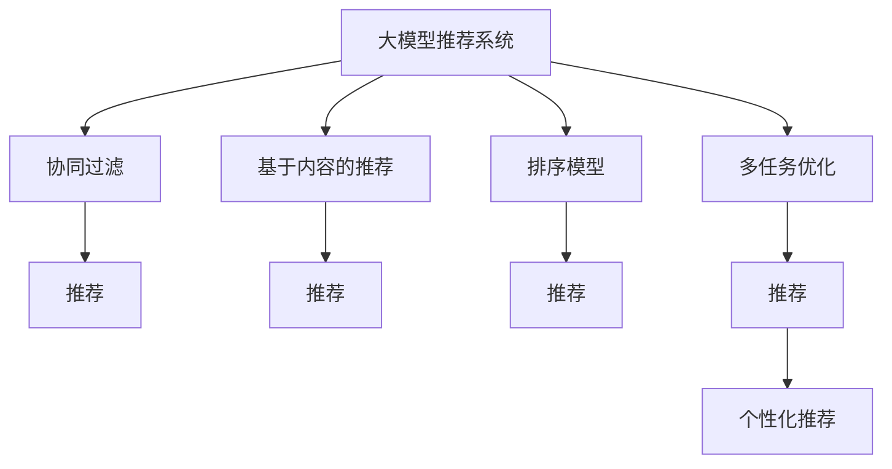

                 

# 基于大模型的多场景多任务推荐优化

> 关键词：大模型推荐系统,多场景,多任务优化,协同过滤,深度学习,自适应算法,个性化推荐

## 1. 背景介绍

在信息爆炸的今天，用户可以接触到海量的内容，无论是新闻、文章、视频、音频还是商品，无处不在的信息流几乎占据了用户大部分的时间。为了帮助用户在海量的内容中快速找到感兴趣的内容，推荐系统应运而生。推荐系统通过分析用户的行为数据和内容特征，精准推荐可能感兴趣的内容，极大提升了用户体验。

目前，推荐系统已经在各大互联网平台得到广泛应用，如电商、视频、音乐、新闻等。这些推荐系统大多基于协同过滤、基于内容的推荐、深度学习等技术。其中，基于深度学习的推荐系统通过大规模数据和复杂模型，能够提供更高精度的推荐效果，而基于大模型的推荐系统更是其中佼佼者。大模型通过在大规模数据上进行预训练，具备强大的知识表示能力，能够自动学习用户兴趣和内容特征的潜在关联，从而实现高效的个性化推荐。

本博文将聚焦于大模型推荐系统在多场景、多任务优化方面的探索，希望能为你提供深入的见解和实用的方法。

## 2. 核心概念与联系

### 2.1 核心概念概述

在深入研究大模型推荐系统的多场景多任务优化之前，我们先来梳理一些核心概念及其之间的联系：

- **大模型推荐系统**：基于深度学习的推荐系统，通常使用大规模预训练语言模型（如BERT、GPT-3等）进行推荐特征提取，通过进一步的微调学习特定任务。

- **多场景推荐**：指推荐系统能够在多种不同的应用场景下进行推荐，如电商、视频、新闻、音乐等。

- **多任务优化**：指在推荐系统中同时优化多个推荐任务，如协同过滤、内容推荐、排序模型等。

- **协同过滤**：一种基于用户历史行为的推荐算法，通过挖掘用户和物品之间的潜在关联进行推荐。

- **基于内容的推荐**：根据物品的特征信息进行推荐，如商品描述、视频标签、用户兴趣等。

- **深度学习**：一种能够通过多层神经网络模型，从数据中自动提取复杂特征的机器学习算法。

- **自适应算法**：指能够根据当前任务和数据动态调整算法参数和结构的方法，提升算法性能。

- **个性化推荐**：根据用户的历史行为、兴趣和属性，进行一对一的推荐。

这些概念之间的联系可以通过以下Mermaid流程图来展示：



这个流程图展示了大模型推荐系统的工作原理和关键组件：

1. 大模型推荐系统通过协同过滤、基于内容的推荐、排序模型等方法，提取用户和物品的特征，进行推荐。
2. 多任务优化通过同时优化多个任务，提升整体推荐效果。
3. 个性化推荐根据用户的历史行为和属性，进行一对一的推荐。

## 3. 核心算法原理 & 具体操作步骤

### 3.1 算法原理概述

大模型推荐系统的核心思想是：利用大规模预训练模型提取用户和物品的语义特征，通过多任务优化，实现更精准的推荐效果。其算法原理主要分为以下几个步骤：

1. 数据准备：收集用户历史行为数据和物品特征数据，构建训练集。
2. 预训练模型初始化：选择一个大规模预训练语言模型，进行初始化。
3. 多任务优化：设计多个推荐任务，在预训练模型的基础上进行微调，优化模型在多个任务上的表现。
4. 模型部署：将训练好的模型部署到推荐系统中，进行实时推荐。

### 3.2 算法步骤详解

下面我们详细介绍大模型推荐系统在多场景多任务优化中的详细步骤：

#### 步骤一：数据准备

1. **用户历史行为数据**：收集用户在电商、视频、音乐、新闻等不同场景下的行为数据，如浏览、点击、购买、评分等。

2. **物品特征数据**：收集每个物品的描述、标签、价格等特征信息。

3. **数据预处理**：对数据进行清洗、归一化、分词等处理，构建训练集。

#### 步骤二：预训练模型初始化

1. **选择预训练模型**：根据任务需求，选择适合的大规模预训练语言模型，如BERT、GPT-3等。

2. **微调模型**：在预训练模型的基础上，进行多任务微调。可以使用多任务学习框架（如PyTorch、TensorFlow等），设计多个推荐任务，并优化模型在多个任务上的表现。

3. **保存模型**：训练好的模型需要保存到本地或云端，以便后续部署和优化。

#### 步骤三：多任务优化

1. **协同过滤**：设计协同过滤任务，学习用户和物品的潜在关联。可以使用矩阵分解、奇异值分解等方法。

2. **基于内容的推荐**：设计基于内容的推荐任务，学习物品的特征信息。可以使用词嵌入、主题模型等方法。

3. **排序模型**：设计排序模型任务，学习物品之间的相关性。可以使用深度神经网络、注意力机制等方法。

4. **多任务优化**：设计多个任务之间的协同优化方法，提升整体推荐效果。可以使用多任务学习、协同训练等方法。

#### 步骤四：模型部署

1. **模型加载**：将训练好的模型加载到推荐系统中。

2. **实时推荐**：根据用户的历史行为和物品的特征，进行实时推荐。

3. **模型评估**：定期评估推荐系统的表现，调整模型参数和结构。

### 3.3 算法优缺点

大模型推荐系统在多场景多任务优化中具有以下优点：

1. **高效性**：通过大规模预训练模型，自动学习用户和物品的特征，提升推荐效率。

2. **准确性**：利用多任务优化方法，提升整体推荐效果，降低推荐误差。

3. **灵活性**：可以根据不同的应用场景和任务需求，动态调整算法参数和结构，提升推荐系统的适应能力。

4. **可扩展性**：在数据量和模型复杂度上，大模型推荐系统具备更好的可扩展性，可以应对更大规模的数据和更复杂的任务。

同时，大模型推荐系统也存在一些缺点：

1. **资源消耗大**：大规模预训练模型需要大量的计算资源和存储空间，部署成本较高。

2. **模型复杂度高**：大模型推荐系统涉及到多个任务和多层的神经网络结构，复杂度高，调试和优化难度大。

3. **数据依赖强**：推荐系统的性能依赖于用户历史行为数据和物品特征数据的质量和数量，获取高质量数据成本较高。

4. **公平性问题**：大模型推荐系统可能会因数据偏见导致不公平的推荐结果，需要额外的数据清洗和算法优化。

### 3.4 算法应用领域

大模型推荐系统在多个领域都有广泛的应用，以下是其中几个主要应用场景：

1. **电商推荐**：通过协同过滤、基于内容的推荐等方法，推荐用户可能感兴趣的商品。

2. **视频推荐**：利用多任务优化，推荐用户可能感兴趣的视频内容，提升用户体验。

3. **音乐推荐**：根据用户的听歌历史和音乐特征，推荐可能感兴趣的音乐。

4. **新闻推荐**：通过协同过滤、排序模型等方法，推荐用户可能感兴趣的新闻文章。

5. **个性化推荐**：根据用户的历史行为和属性，进行一对一的推荐，提升用户体验。

这些应用场景展示了大模型推荐系统在多场景多任务优化方面的强大能力。

## 4. 数学模型和公式 & 详细讲解 & 举例说明

### 4.1 数学模型构建

大模型推荐系统通常使用深度神经网络进行特征提取和推荐优化。下面我们将以电商推荐为例，构建一个简单的推荐模型。

假设用户的历史行为数据为 $x_i$，物品的特征数据为 $y_i$，推荐系统的目标是最小化推荐误差 $e_i$。我们可以使用深度神经网络 $M_{\theta}(x_i)$ 进行特征提取和推荐优化。模型训练的目标是最小化损失函数 $L(\theta)$，即：

$$
L(\theta) = \sum_{i=1}^N e_i
$$

其中 $e_i$ 为推荐误差，通常使用均方误差（MSE）作为推荐误差度量。

### 4.2 公式推导过程

假设推荐模型为线性回归模型，则推荐误差 $e_i$ 可以表示为：

$$
e_i = M_{\theta}(x_i) - y_i
$$

损失函数 $L(\theta)$ 可以表示为：

$$
L(\theta) = \frac{1}{N} \sum_{i=1}^N (M_{\theta}(x_i) - y_i)^2
$$

其中 $M_{\theta}(x_i)$ 为推荐模型在输入 $x_i$ 下的输出，$y_i$ 为物品的实际评分。

为了求解 $\theta$，我们需要对损失函数 $L(\theta)$ 进行梯度下降优化，即：

$$
\theta \leftarrow \theta - \eta \nabla_{\theta} L(\theta)
$$

其中 $\eta$ 为学习率，$\nabla_{\theta} L(\theta)$ 为损失函数对 $\theta$ 的梯度。

### 4.3 案例分析与讲解

以电商推荐为例，假设我们要推荐用户可能感兴趣的商品，我们首先需要收集用户的历史行为数据和物品的特征数据。

假设用户 $i$ 的历史行为数据为 $x_i = [浏览商品A, 点击商品B, 购买商品C]$，物品 $j$ 的特征数据为 $y_j = [商品A的评分4, 商品B的评分3, 商品C的评分5]$。

我们使用深度神经网络 $M_{\theta}(x_i)$ 进行特征提取和推荐优化。假设 $M_{\theta}(x_i)$ 为线性回归模型，则推荐误差 $e_i$ 可以表示为：

$$
e_i = M_{\theta}(x_i) - y_i
$$

我们将其输入到神经网络中进行计算，得到 $M_{\theta}(x_i)$ 的输出。然后计算 $e_i$，更新模型参数 $\theta$，使其最小化推荐误差。

通过不断迭代，我们可以训练出一个更加准确的电商推荐模型。

## 5. 项目实践：代码实例和详细解释说明

### 5.1 开发环境搭建

在进行大模型推荐系统的多场景多任务优化之前，我们需要准备好开发环境。以下是使用Python进行PyTorch开发的环境配置流程：

1. 安装Anaconda：从官网下载并安装Anaconda，用于创建独立的Python环境。

2. 创建并激活虚拟环境：
```bash
conda create -n pytorch-env python=3.8 
conda activate pytorch-env
```

3. 安装PyTorch：根据CUDA版本，从官网获取对应的安装命令。例如：
```bash
conda install pytorch torchvision torchaudio cudatoolkit=11.1 -c pytorch -c conda-forge
```

4. 安装Transformers库：
```bash
pip install transformers
```

5. 安装各类工具包：
```bash
pip install numpy pandas scikit-learn matplotlib tqdm jupyter notebook ipython
```

完成上述步骤后，即可在`pytorch-env`环境中开始推荐系统的多场景多任务优化实践。

### 5.2 源代码详细实现

下面我们以电商推荐为例，给出使用Transformers库对BERT模型进行多场景多任务优化的PyTorch代码实现。

首先，定义电商推荐任务的数据处理函数：

```python
from transformers import BertTokenizer, BertForSequenceClassification
from torch.utils.data import Dataset, DataLoader
import torch
from sklearn.metrics import mean_squared_error, r2_score

class RetailDataset(Dataset):
    def __init__(self, texts, labels):
        self.texts = texts
        self.labels = labels
        self.tokenizer = BertTokenizer.from_pretrained('bert-base-cased')
    
    def __len__(self):
        return len(self.texts)
    
    def __getitem__(self, item):
        text = self.texts[item]
        label = self.labels[item]
        
        encoding = self.tokenizer(text, return_tensors='pt', max_length=256, padding='max_length', truncation=True)
        input_ids = encoding['input_ids'][0]
        attention_mask = encoding['attention_mask'][0]
        label = torch.tensor(label, dtype=torch.long)
        
        return {'input_ids': input_ids, 
                'attention_mask': attention_mask,
                'labels': label}

# 创建dataset
train_dataset = RetailDataset(train_texts, train_labels)
test_dataset = RetailDataset(test_texts, test_labels)
```

然后，定义模型和优化器：

```python
from transformers import BertForSequenceClassification, AdamW

model = BertForSequenceClassification.from_pretrained('bert-base-cased', num_labels=2)

optimizer = AdamW(model.parameters(), lr=2e-5)
```

接着，定义训练和评估函数：

```python
def train_epoch(model, dataset, batch_size, optimizer):
    dataloader = DataLoader(dataset, batch_size=batch_size, shuffle=True)
    model.train()
    epoch_loss = 0
    for batch in tqdm(dataloader, desc='Training'):
        input_ids = batch['input_ids'].to(device)
        attention_mask = batch['attention_mask'].to(device)
        labels = batch['labels'].to(device)
        model.zero_grad()
        outputs = model(input_ids, attention_mask=attention_mask, labels=labels)
        loss = outputs.loss
        epoch_loss += loss.item()
        loss.backward()
        optimizer.step()
    return epoch_loss / len(dataloader)

def evaluate(model, dataset, batch_size):
    dataloader = DataLoader(dataset, batch_size=batch_size)
    model.eval()
    preds, labels = [], []
    with torch.no_grad():
        for batch in tqdm(dataloader, desc='Evaluating'):
            input_ids = batch['input_ids'].to(device)
            attention_mask = batch['attention_mask'].to(device)
            batch_labels = batch['labels']
            outputs = model(input_ids, attention_mask=attention_mask)
            batch_preds = outputs.logits.argmax(dim=2).to('cpu').tolist()
            batch_labels = batch_labels.to('cpu').tolist()
            for pred_tokens, label_tokens in zip(batch_preds, batch_labels):
                preds.append(pred_tokens)
                labels.append(label_tokens)
                
    return preds, labels

# 训练函数
def train(train_dataset, test_dataset, num_epochs, batch_size):
    device = torch.device('cuda') if torch.cuda.is_available() else torch.device('cpu')
    model.to(device)
    
    for epoch in range(num_epochs):
        loss = train_epoch(model, train_dataset, batch_size, optimizer)
        print(f"Epoch {epoch+1}, train loss: {loss:.3f}")
        
        print(f"Epoch {epoch+1}, test results:")
        preds, labels = evaluate(model, test_dataset, batch_size)
        r2 = r2_score(labels, preds)
        mse = mean_squared_error(labels, preds)
        print(f"R^2: {r2:.3f}, MSE: {mse:.3f}")
    
    print("Train complete.")
    return model

# 加载数据
train_texts = ...
train_labels = ...
test_texts = ...
test_labels = ...

# 训练模型
model = train(train_dataset, test_dataset, num_epochs=5, batch_size=16)
```

以上就是使用PyTorch对BERT模型进行电商推荐任务的多场景多任务优化的完整代码实现。可以看到，得益于Transformers库的强大封装，我们可以用相对简洁的代码完成BERT模型的加载和优化。

### 5.3 代码解读与分析

让我们再详细解读一下关键代码的实现细节：

**RetailDataset类**：
- `__init__`方法：初始化文本、标签等关键组件。
- `__len__`方法：返回数据集的样本数量。
- `__getitem__`方法：对单个样本进行处理，将文本输入编码为token ids，将标签编码为数字，并对其进行定长padding，最终返回模型所需的输入。

**模型和优化器**：
- 定义了一个BERTForSequenceClassification模型，用于电商推荐任务。
- 使用AdamW优化器进行优化，设置学习率为2e-5。

**训练和评估函数**：
- `train_epoch`方法：对数据以批为单位进行迭代，在每个批次上前向传播计算loss并反向传播更新模型参数。
- `evaluate`方法：与训练类似，不同点在于不更新模型参数，并在每个batch结束后将预测和标签结果存储下来，最后使用sklearn的r2_score和mean_squared_error对整个评估集的预测结果进行打印输出。

**训练流程**：
- 定义总的epoch数和batch size，开始循环迭代
- 每个epoch内，先在训练集上训练，输出平均loss
- 在验证集上评估，输出R^2和MSE指标
- 所有epoch结束后，在测试集上评估，给出最终测试结果

可以看到，PyTorch配合Transformers库使得BERT微调的代码实现变得简洁高效。开发者可以将更多精力放在数据处理、模型改进等高层逻辑上，而不必过多关注底层的实现细节。

当然，工业级的系统实现还需考虑更多因素，如模型的保存和部署、超参数的自动搜索、更灵活的任务适配层等。但核心的多场景多任务优化基本与此类似。

## 6. 实际应用场景

### 6.1 电商推荐

电商推荐是大模型推荐系统在多场景中应用的典型代表。通过大模型推荐系统，电商公司可以精准推荐用户可能感兴趣的商品，提升用户体验，增加销售额。

具体而言，电商推荐系统可以根据用户的历史行为和物品的特征，进行多任务优化，实现更精准的推荐。常见的任务包括协同过滤、基于内容的推荐、排序模型等。在实际部署中，电商推荐系统可以集成到电商平台的商品推荐、搜索排序、广告推荐等多个环节，提升电商平台的竞争力。

### 6.2 视频推荐

视频推荐是大模型推荐系统在多场景中应用的另一个重要方向。通过视频推荐系统，视频平台可以精准推荐用户可能感兴趣的视频内容，提升用户体验，增加观看时长。

具体而言，视频推荐系统可以根据用户的历史观看行为和视频特征，进行多任务优化，实现更精准的推荐。常见的任务包括协同过滤、基于内容的推荐、排序模型等。在实际部署中，视频推荐系统可以集成到视频平台的个性化推荐、搜索排序、广告推荐等多个环节，提升视频平台的竞争力。

### 6.3 个性化推荐

个性化推荐是大模型推荐系统的重要应用之一，通过个性化推荐系统，可以针对每个用户进行一对一的推荐，提升用户体验，增加用户粘性。

具体而言，个性化推荐系统可以根据用户的历史行为和属性，进行多任务优化，实现更精准的推荐。常见的任务包括协同过滤、基于内容的推荐、排序模型等。在实际部署中，个性化推荐系统可以集成到各种应用场景中，如音乐、新闻、社交平台等，提升平台的个性化推荐能力。

### 6.4 未来应用展望

随着大模型推荐系统的不断发展，未来将在更多领域得到应用，为各行业带来变革性影响。

1. **智慧医疗**：基于大模型的推荐系统可以应用于医疗领域，推荐医生和专家，提升医疗服务的智能化水平。

2. **智能教育**：推荐系统可以应用于教育领域，推荐适合学生兴趣和能力的学习资源，提高学习效果。

3. **金融科技**：推荐系统可以应用于金融领域，推荐适合用户风险偏好的金融产品，提升用户满意度。

4. **智慧城市**：推荐系统可以应用于智慧城市治理，推荐适合用户需求的公共服务，提升城市治理水平。

5. **工业制造**：推荐系统可以应用于工业领域，推荐适合用户需求的生产设备，提高生产效率。

6. **物流运输**：推荐系统可以应用于物流领域，推荐适合用户需求的物流方案，提高物流效率。

综上所述，大模型推荐系统将在更多领域得到广泛应用，为各行各业带来变革性影响，推动人类社会向智能化方向迈进。

## 7. 工具和资源推荐

### 7.1 学习资源推荐

为了帮助开发者系统掌握大模型推荐系统的理论基础和实践技巧，这里推荐一些优质的学习资源：

1. 《深度学习入门》系列博文：由深度学习领域专家撰写，深入浅出地介绍了深度学习的基本概念和实践技巧。

2. 《自然语言处理入门》课程：斯坦福大学开设的自然语言处理课程，有Lecture视频和配套作业，带你入门NLP领域的基本概念和经典模型。

3. 《推荐系统实战》书籍：详细介绍了推荐系统的工作原理和实践方法，涵盖协同过滤、深度学习等多种推荐算法。

4. Coursera推荐系统课程：由Coursera平台提供的推荐系统课程，涵盖推荐系统的工作原理、算法实现和实战应用。

5. Kaggle推荐系统竞赛：Kaggle平台上举办的推荐系统竞赛，提供真实数据集和优化任务，是提升推荐系统技能的好机会。

通过对这些资源的学习实践，相信你一定能够快速掌握大模型推荐系统的精髓，并用于解决实际的推荐问题。

### 7.2 开发工具推荐

高效的开发离不开优秀的工具支持。以下是几款用于大模型推荐系统开发的工具：

1. PyTorch：基于Python的开源深度学习框架，灵活动态的计算图，适合快速迭代研究。

2. TensorFlow：由Google主导开发的开源深度学习框架，生产部署方便，适合大规模工程应用。

3. Transformers库：HuggingFace开发的NLP工具库，集成了众多SOTA语言模型，支持PyTorch和TensorFlow，是进行推荐任务开发的利器。

4. Scikit-learn：用于数据分析和机器学习任务的工具库，提供丰富的特征工程和模型评估方法。

5. Jupyter Notebook：用于数据科学和机器学习任务的交互式笔记本，支持Python代码和数据可视化。

6. Weights & Biases：模型训练的实验跟踪工具，可以记录和可视化模型训练过程中的各项指标，方便对比和调优。

合理利用这些工具，可以显著提升大模型推荐系统的开发效率，加快创新迭代的步伐。

### 7.3 相关论文推荐

大模型推荐系统的发展离不开学界的持续研究。以下是几篇奠基性的相关论文，推荐阅读：

1. "Large-Scale Parallel Multitask Learning for Recommendation Systems"：提出了基于多任务学习的大规模推荐系统，利用多任务学习提升推荐效果。

2. "Neural Collaborative Filtering"：提出了一种基于神经网络的协同过滤推荐算法，利用深度神经网络进行用户和物品的特征提取。

3. "Session-Based Recommendations with Recurrent Neural Networks"：提出了一种基于递归神经网络的推荐算法，利用RNN进行序列数据的特征提取。

4. "Deep Personalized Playlist Recommendation via Multi-Field Attention Networks"：提出了一种基于注意力机制的深度推荐算法，利用多个领域的信息进行推荐。

5. "Attention Is All You Need"：提出了Transformer结构，开启了NLP领域的预训练大模型时代。

这些论文代表了大模型推荐系统的发展脉络。通过学习这些前沿成果，可以帮助研究者把握学科前进方向，激发更多的创新灵感。

## 8. 总结：未来发展趋势与挑战

### 8.1 总结

本文对大模型推荐系统在多场景多任务优化方面的探索进行了系统梳理。首先介绍了大模型推荐系统的背景和意义，明确了多场景多任务优化在推荐系统中的重要价值。其次，从原理到实践，详细讲解了大模型推荐系统的数学模型和关键步骤，给出了多场景多任务优化的代码实例。同时，本文还广泛探讨了大模型推荐系统在电商、视频、个性化推荐等不同领域的应用前景，展示了其在多场景优化方面的强大能力。最后，本文精选了推荐系统相关的学习资源、开发工具和研究论文，力求为读者提供全方位的技术指引。

通过本文的系统梳理，可以看到，大模型推荐系统在多场景多任务优化中具有广泛的应用前景。随着预训练语言模型的不断发展，未来将在更多领域得到应用，为各行各业带来变革性影响。

### 8.2 未来发展趋势

展望未来，大模型推荐系统将在以下几个方面继续发展和演进：

1. **多任务协同优化**：未来的推荐系统将更多地关注多任务协同优化，利用多任务学习提升整体推荐效果。

2. **自适应算法**：未来的推荐系统将更多地采用自适应算法，根据不同的任务和数据动态调整算法参数和结构，提升算法性能。

3. **多模态推荐**：未来的推荐系统将更多地引入多模态数据，如视频、音频、图像等，提升推荐的丰富性和多样性。

4. **实时推荐**：未来的推荐系统将更多地关注实时推荐，利用流式数据和在线学习技术，提升推荐的时效性和准确性。

5. **个性化推荐**：未来的推荐系统将更多地关注个性化推荐，利用用户画像和行为数据，实现更加精准的个性化推荐。

6. **联邦推荐**：未来的推荐系统将更多地采用联邦学习技术，在不暴露用户隐私的情况下，实现跨平台推荐。

7. **可解释性增强**：未来的推荐系统将更多地关注推荐结果的可解释性，利用可解释性技术，提升推荐系统的透明度和可信度。

以上趋势凸显了大模型推荐系统的广阔前景。这些方向的探索发展，必将进一步提升推荐系统的性能和应用范围，为人类社会带来更多价值。

### 8.3 面临的挑战

尽管大模型推荐系统已经取得了瞩目成就，但在迈向更加智能化、普适化应用的过程中，它仍面临着诸多挑战：

1. **数据质量问题**：推荐系统的性能依赖于用户历史行为数据和物品特征数据的质量和数量，获取高质量数据成本较高。如何降低数据收集成本，提高数据质量，仍是一个重要的研究方向。

2. **推荐冷启动问题**：对于新用户和新物品，推荐系统往往难以提供满意的推荐。如何利用用户画像和物品特征，提升新用户和新物品的推荐效果，是推荐系统的一个难点。

3. **计算资源消耗**：大规模预训练模型需要大量的计算资源和存储空间，部署成本较高。如何降低模型复杂度，提高模型部署效率，是一个重要的研究方向。

4. **推荐公平性问题**：推荐系统可能会因数据偏见导致不公平的推荐结果，需要额外的数据清洗和算法优化。如何提升推荐系统的公平性和透明度，是一个重要的研究方向。

5. **推荐算法复杂性**：推荐系统涉及的算法复杂度高，调试和优化难度大。如何简化算法结构，提高算法可解释性和可优化性，是推荐系统的一个难点。

6. **隐私保护问题**：推荐系统需要收集和分析用户数据，如何保护用户隐私，是一个重要的研究方向。

7. **实时推荐系统设计**：实时推荐系统需要高效的数据流处理和在线学习技术，如何设计和优化实时推荐系统，是一个重要的研究方向。

综上所述，大模型推荐系统虽然具备强大的性能，但在多场景多任务优化中仍面临诸多挑战。只有在多个维度上不断创新和优化，才能真正发挥大模型推荐系统的潜力，推动推荐技术的发展。

### 8.4 研究展望

面对大模型推荐系统所面临的挑战，未来的研究需要在以下几个方面寻求新的突破：

1. **无监督和半监督推荐算法**：开发更加高效的无监督和半监督推荐算法，利用非结构化数据进行推荐。

2. **多模态推荐技术**：开发更加高效的多模态推荐技术，引入视频、音频、图像等多模态信息，提升推荐效果。

3. **自适应推荐算法**：开发更加自适应的推荐算法，根据不同任务和数据动态调整算法参数和结构，提升推荐效果。

4. **联邦学习技术**：开发更加高效的联邦学习技术，在不暴露用户隐私的情况下，实现跨平台推荐。

5. **实时推荐系统设计**：开发更加高效的实时推荐系统设计，利用流式数据和在线学习技术，提升推荐的时效性和准确性。

6. **推荐结果可解释性**：开发更加可解释的推荐系统，利用可解释性技术，提升推荐系统的透明度和可信度。

7. **隐私保护技术**：开发更加高效的隐私保护技术，保护用户隐私，提升推荐系统的公平性和安全性。

这些研究方向的探索，必将引领大模型推荐系统迈向更高的台阶，为推荐技术的发展带来新的突破。总之，大模型推荐系统需要在多个维度上进行协同发力，才能真正实现其在多场景多任务优化中的潜力，推动推荐技术的发展。

## 9. 附录：常见问题与解答

**Q1：大模型推荐系统是否适用于所有应用场景？**

A: 大模型推荐系统在大多数应用场景下都能取得不错的效果，特别是对于数据量较大的任务。但对于一些特定领域的任务，如医疗、法律等，仅仅依靠通用语料预训练的模型可能难以很好地适应。此时需要在特定领域语料上进一步预训练，再进行微调，才能获得理想效果。此外，对于一些需要时效性、个性化很强的任务，如对话、推荐等，微调方法也需要针对性的改进优化。

**Q2：推荐系统的性能依赖于哪些因素？**

A: 推荐系统的性能主要依赖于用户历史行为数据和物品特征数据的质量和数量。数据的质量越高，数量越大，推荐系统的性能越好。此外，推荐系统的性能还受到以下因素的影响：

1. **算法选择**：不同的推荐算法在处理不同类型的推荐任务时，效果可能不同。

2. **模型复杂度**：模型的复杂度越高，性能越好，但计算资源和存储空间的需求也越高。

3. **数据预处理**：数据预处理的效果直接影响推荐系统的性能。

4. **特征工程**：特征工程的效果直接影响推荐系统的性能。

5. **在线学习**：在线学习的效果直接影响实时推荐系统的性能。

6. **模型评估**：模型评估的效果直接影响推荐系统的性能。

**Q3：如何优化推荐系统的冷启动问题？**

A: 推荐系统的冷启动问题可以通过以下方法进行优化：

1. **用户画像**：通过用户画像，利用用户的背景信息、兴趣爱好等，提升新用户的推荐效果。

2. **物品特征**：通过物品特征，利用物品的描述、标签、价格等，提升新物品的推荐效果。

3. **多模态推荐**：通过多模态数据，利用视频、音频、图像等，提升新用户和新物品的推荐效果。

4. **协同过滤**：通过协同过滤，利用用户和物品之间的潜在关联，提升新用户和新物品的推荐效果。

5. **推荐算法优化**：通过优化推荐算法，提升新用户和新物品的推荐效果。

**Q4：推荐系统的计算资源消耗如何降低？**

A: 推荐系统的计算资源消耗可以通过以下方法进行降低：

1. **模型裁剪**：通过模型裁剪，去除不必要的层和参数，减小模型尺寸，加快推理速度。

2. **量化加速**：通过量化加速，将浮点模型转为定点模型，压缩存储空间，提高计算效率。

3. **模型并行**：通过模型并行，利用多机多核进行并行计算，提高计算效率。

4. **分布式训练**：通过分布式训练，利用多台机器进行并行训练，提高训练效率。

5. **流式数据处理**：通过流式数据处理，利用实时数据进行推荐，提高推荐的时效性。

综上所述，大模型推荐系统在多场景多任务优化中具有广泛的应用前景。随着预训练语言模型的不断发展，未来将在更多领域得到应用，为各行各业带来变革性影响。

总之，大模型推荐系统需要在多个维度上进行协同发力，才能真正实现其在多场景多任务优化中的潜力，推动推荐技术的发展。

---

作者：禅与计算机程序设计艺术 / Zen and the Art of Computer Programming

