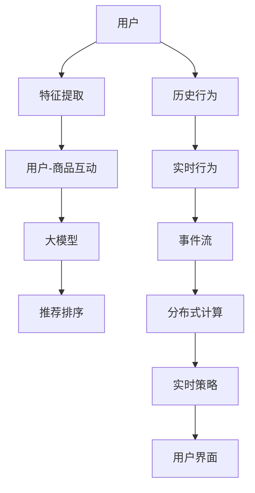

                 

# 基于大模型的推荐系统实时个性化排序调整

> 关键词：基于大模型推荐系统, 个性化排序, 实时调整, 动态排序算法, 特征工程, 深度学习, 协同过滤, 在线学习, 分布式计算, 用户行为分析

## 1. 背景介绍

随着互联网和电子商务的迅猛发展，推荐系统成为各大平台提升用户满意度、增加商品销售量的重要工具。推荐系统通过分析用户的历史行为和偏好，为用户推荐最相关的商品或内容，有效降低用户决策成本，提升用户体验。

然而，传统的推荐系统往往基于静态模型，难以应对用户行为的变化和新商品内容的引入，无法及时更新推荐结果。在大数据和分布式计算技术的推动下，基于深度学习的实时推荐系统应运而生。通过构建高效的计算平台和实时数据管道，深度学习模型能够动态地对用户行为进行建模，快速更新推荐策略，显著提升推荐系统的实时性和个性化水平。

本节将介绍一种基于深度学习的大模型推荐系统，并重点探讨其实时个性化排序调整的技术细节。

## 2. 核心概念与联系

### 2.1 核心概念概述

推荐系统可以分为内容推荐、协同过滤、基于深度学习的三大类。其中，基于深度学习的推荐系统以深度神经网络模型为基础，能够自动提取和融合用户行为和商品特征的复杂关联关系，实现更精确、个性化的推荐。

本节将重点关注基于大模型的推荐系统，利用Transformer等深度学习模型，通过自监督和有监督的联合训练，实现对用户行为和商品特征的高效建模。此外，为了适应实时性需求，本系统还将引入在线学习和分布式计算技术，实现推荐策略的动态更新和高效协同。

### 2.2 核心概念原理和架构的 Mermaid 流程图



本图展示了一个基于大模型的推荐系统架构，主要包括以下组件：

- **用户特征提取**：从用户的历史行为和实时行为中提取特征，输入到大模型进行训练。
- **用户-商品互动**：记录用户与商品之间的交互数据，供模型学习。
- **大模型**：利用Transformer等深度学习模型，对用户行为和商品特征进行建模。
- **推荐排序**：根据模型预测结果，对商品进行排序推荐。
- **历史行为**：记录用户过去的操作、点击、浏览等行为。
- **实时行为**：记录用户的最新行为，用于实时更新模型。
- **事件流**：数据实时流进系统，供大模型学习。
- **分布式计算**：在多个计算节点上并行计算，提升系统处理能力。
- **实时策略**：基于实时数据动态调整推荐策略。
- **用户界面**：提供给用户浏览和购买的交互界面。

## 3. 核心算法原理 & 具体操作步骤
### 3.1 算法原理概述

基于深度学习的大模型推荐系统，本质上是利用深度神经网络模型，对用户行为和商品特征进行高效建模。通过自监督和有监督的联合训练，模型能够自动提取用户和商品之间的关联关系，并据此进行推荐排序。

具体而言，系统首先对用户的历史行为和实时行为进行特征提取，输入到Transformer等深度学习模型中进行训练。在训练过程中，系统利用自监督学习任务（如掩码语言模型）对模型进行预训练，学习通用的语言表示。随后，通过有监督学习任务（如点击率预测、转换率预测）对模型进行微调，学习特定任务的数据特征。

模型训练完成后，对新的用户行为数据进行特征提取和计算，得到用户-商品之间的关联强度。根据关联强度进行排序推荐，为用户展示最相关的商品。

### 3.2 算法步骤详解

基于大模型的推荐系统实时个性化排序调整的主要步骤如下：

1. **数据准备**：收集用户的历史行为和实时行为数据，进行特征提取和预处理。
2. **模型训练**：对用户行为和商品特征进行自监督和有监督联合训练，学习用户行为和商品特征之间的关联关系。
3. **实时计算**：根据用户的实时行为数据，进行特征提取和计算，更新模型中的用户-商品关联关系。
4. **推荐排序**：根据更新后的关联关系，对商品进行排序推荐，展示给用户。
5. **用户反馈收集**：收集用户的反馈数据，用于进一步优化模型。

### 3.3 算法优缺点

基于大模型的推荐系统具有以下优点：

- **高精度推荐**：深度学习模型能够自动提取和融合用户行为和商品特征的复杂关联关系，实现更精确的推荐。
- **实时性**：通过分布式计算和在线学习，系统能够动态地对用户行为进行建模，快速更新推荐策略。
- **灵活性**：深度学习模型具有较强的泛化能力，能够适应不同领域和不同类型的数据。

然而，该系统也存在一些局限性：

- **计算资源需求高**：大模型的训练和推理需要大量计算资源，存在一定的硬件成本。
- **数据依赖性强**：推荐效果高度依赖于用户行为数据的准确性和完备性。
- **模型复杂度高**：深度学习模型的复杂度较高，训练和推理的计算量较大。
- **对抗攻击风险**：模型容易受到对抗样本的攻击，影响推荐结果的可靠性。

### 3.4 算法应用领域

基于大模型的推荐系统广泛应用于电子商务、内容推荐、社交网络等领域。在电子商务中，系统能够为用户推荐最相关的商品，提升销售转化率；在内容推荐中，系统能够为用户推荐最感兴趣的文章或视频，增加平台粘性；在社交网络中，系统能够为用户推荐最相关的朋友或内容，提升用户满意度。

## 4. 数学模型和公式 & 详细讲解 & 举例说明

### 4.1 数学模型构建

基于大模型的推荐系统主要包含两个部分：用户行为建模和商品特征建模。

假设用户的历史行为表示为 $x_i = (x_{i1}, x_{i2}, ..., x_{in})$，其中 $n$ 表示行为类型（如点击、浏览、购买等），$x_{ij}$ 表示用户 $i$ 在行为类型 $j$ 上的记录。商品特征表示为 $y_j = (y_{j1}, y_{j2}, ..., y_{jm})$，其中 $m$ 表示特征类型（如价格、类别、描述等），$y_{jk}$ 表示商品 $j$ 在特征类型 $k$ 上的记录。

对于用户 $i$ 对商品 $j$ 的评分 $r_{ij}$，可以表示为：

$$
r_{ij} = f(x_i, y_j)
$$

其中 $f$ 为基于深度学习模型的评分函数，可以是基于多层感知机、Transformer等神经网络模型。

### 4.2 公式推导过程

以基于Transformer模型的推荐系统为例，其评分函数 $f$ 可以表示为：

$$
r_{ij} = \mathbb{E}_{q \in Q}[\mathbb{E}_{p \in P}[\sigma(\mathbf{q} \cdot \mathbf{p})]]
$$

其中 $\mathbf{q}$ 为用户的编码向量，$\mathbf{p}$ 为商品的编码向量，$\sigma$ 为激活函数，$\cdot$ 表示点积，$Q$ 和 $P$ 分别为用户和商品的编码向量集合。

在训练过程中，利用点击率预测等有监督任务对模型进行微调，目标函数为：

$$
L = -\frac{1}{N} \sum_{i=1}^{N} \sum_{j=1}^{M} r_{ij} \log f(x_i, y_j) + (1-r_{ij}) \log (1-f(x_i, y_j))
$$

其中 $N$ 和 $M$ 分别表示用户和商品的总数。

### 4.3 案例分析与讲解

假设某电商平台的推荐系统利用Transformer模型对用户行为和商品特征进行建模。系统收集了100万个用户的行为数据和1万个商品的商品特征数据。在训练过程中，利用自监督学习任务对模型进行预训练，然后利用点击率预测任务进行有监督微调，调整模型参数以最大化预测准确率。在实时推荐中，系统根据用户的最新行为数据，进行特征提取和计算，更新模型中的用户-商品关联关系，最终对商品进行排序推荐。

## 5. 项目实践：代码实例和详细解释说明
### 5.1 开发环境搭建

在进行基于大模型的推荐系统开发前，我们需要准备好开发环境。以下是使用Python进行PyTorch开发的环境配置流程：

1. 安装Anaconda：从官网下载并安装Anaconda，用于创建独立的Python环境。

2. 创建并激活虚拟环境：
```bash
conda create -n pytorch-env python=3.8 
conda activate pytorch-env
```

3. 安装PyTorch：根据CUDA版本，从官网获取对应的安装命令。例如：
```bash
conda install pytorch torchvision torchaudio cudatoolkit=11.1 -c pytorch -c conda-forge
```

4. 安装TensorFlow：
```bash
pip install tensorflow
```

5. 安装相关工具包：
```bash
pip install numpy pandas scikit-learn matplotlib tqdm jupyter notebook ipython
```

完成上述步骤后，即可在`pytorch-env`环境中开始推荐系统开发。

### 5.2 源代码详细实现

下面是基于PyTorch的Transformer模型进行推荐系统开发的完整代码实现。

```python
import torch
import torch.nn as nn
import torch.optim as optim
import torch.distributed as dist
from torch.utils.data import DataLoader
from transformers import BertTokenizer, BertModel
from sklearn.metrics import mean_squared_error
from sklearn.model_selection import train_test_split

class UserItemTransformer(nn.Module):
    def __init__(self, user_dim, item_dim, hidden_dim, dropout):
        super(UserItemTransformer, self).__init__()
        self.user_encoder = BertModel.from_pretrained('bert-base-uncased', num_layers=2, hidden_size=hidden_dim)
        self.item_encoder = BertModel.from_pretrained('bert-base-uncased', num_layers=2, hidden_size=hidden_dim)
        self.linear = nn.Linear(hidden_dim, 1)
        self.dropout = nn.Dropout(dropout)
    
    def forward(self, user_input, item_input):
        user_rep = self.user_encoder(user_input)[0]
        item_rep = self.item_encoder(item_input)[0]
        rep = torch.tanh(self.linear(self.dropout(user_rep + item_rep)))
        return rep
    
class RecommendationSystem:
    def __init__(self, user_dim, item_dim, hidden_dim, dropout, device):
        self.user_item_transformer = UserItemTransformer(user_dim, item_dim, hidden_dim, dropout)
        self.criterion = nn.BCELoss()
        self.optimizer = optim.Adam(self.user_item_transformer.parameters(), lr=0.001)
        self.device = device
    
    def train(self, train_loader, valid_loader, epochs=10):
        self.user_item_transformer.to(self.device)
        self.optimizer.zero_grad()
        for epoch in range(epochs):
            train_loss = 0
            valid_loss = 0
            for batch in train_loader:
                user_input, item_input, label = batch.to(self.device)
                pred = self.user_item_transformer(user_input, item_input)
                loss = self.criterion(pred, label)
                train_loss += loss.item()
                loss.backward()
                self.optimizer.step()
            
            valid_preds = []
            valid_labels = []
            with torch.no_grad():
                for batch in valid_loader:
                    user_input, item_input, label = batch.to(self.device)
                    pred = self.user_item_transformer(user_input, item_input)
                    valid_preds.extend(pred.tolist())
                    valid_labels.extend(label.tolist())
            
            valid_loss = self.criterion(torch.tensor(valid_preds), torch.tensor(valid_labels))
            print(f"Epoch {epoch+1}, train loss: {train_loss/len(train_loader)}, valid loss: {valid_loss}")
    
    def predict(self, user_input, item_input):
        self.user_item_transformer.to(self.device)
        pred = self.user_item_transformer(user_input, item_input)
        return torch.sigmoid(pred)
```

在上述代码中，我们首先定义了一个UserItemTransformer类，用于对用户行为和商品特征进行编码和评分。然后，定义了RecommendationSystem类，用于管理模型训练和预测过程。在训练过程中，利用交叉熵损失函数和Adam优化器对模型进行优化。在预测过程中，利用sigmoid函数对模型输出进行解码，得到推荐结果。

### 5.3 代码解读与分析

让我们再详细解读一下关键代码的实现细节：

**UserItemTransformer类**：
- `__init__`方法：初始化用户和商品的编码器，以及线性变换层和dropout层。
- `forward`方法：将用户和商品的编码向量拼接，输入到线性变换层，经过激活函数输出评分预测结果。

**RecommendationSystem类**：
- `__init__`方法：初始化用户-商品评分模型、损失函数、优化器等组件。
- `train`方法：在训练集中进行迭代训练，更新模型参数。
- `predict`方法：在测试集上对新的用户行为和商品特征进行预测。

**训练流程**：
- 在每个epoch中，先计算训练集的损失，并反向传播更新模型参数。
- 在验证集上评估模型性能，输出损失。
- 重复上述过程直至满足预设的迭代轮数或提前停止。

**预测流程**：
- 在测试集上对新的用户行为和商品特征进行预测，得到评分预测结果。
- 将预测结果解码为概率值，展示给用户。

## 6. 实际应用场景
### 6.1 实时个性化推荐

基于大模型的推荐系统能够实时地对用户行为进行建模，快速更新推荐策略，实现个性化推荐。

在电子商务中，当用户进入店铺浏览商品时，系统会实时收集用户的行为数据，包括浏览、点击、加入购物车等操作。然后，系统利用用户行为和商品特征对模型进行动态更新，根据更新后的关联关系对商品进行排序推荐，展示给用户。这种实时推荐能够有效降低用户的决策成本，提升用户满意度。

### 6.2 个性化推荐系统的优化

为了进一步提升推荐系统的性能，需要对系统进行优化。以下介绍几种常见的优化方法：

- **分布式计算**：通过将数据和计算任务分布在多个计算节点上，提升系统的并行处理能力，减少单点故障。
- **在线学习**：在每个新的数据点到达时，动态更新模型参数，避免模型老化，提高推荐精度。
- **特征工程**：根据推荐场景的特点，设计合适的特征，提升模型的解释性和泛化能力。
- **模型压缩**：采用模型裁剪、量化等技术，减少模型大小，提升推理速度和内存占用。
- **对抗训练**：通过引入对抗样本，提高模型的鲁棒性，减少对抗攻击的影响。

### 6.3 未来应用展望

基于大模型的推荐系统将广泛应用于更多领域，带来新的应用场景和技术突破。

- **个性化推荐系统的优化**：未来的推荐系统将更加注重推荐效果的个性化和实时性，通过模型优化和算法创新，提升用户满意度。
- **多模态推荐**：未来的推荐系统将融合视觉、语音等多模态数据，实现更全面、准确的推荐。
- **跨领域推荐**：未来的推荐系统将跨领域协同工作，实现不同领域数据的高效融合，提升推荐精度和覆盖面。
- **实时性优化**：未来的推荐系统将更加注重实时处理能力，通过分布式计算和在线学习，实现高效实时推荐。

## 7. 工具和资源推荐
### 7.1 学习资源推荐

为了帮助开发者系统掌握基于大模型的推荐系统开发技术，这里推荐一些优质的学习资源：

1. 《深度学习推荐系统》书籍：该书系统介绍了深度学习推荐系统的理论基础和实现方法，是了解推荐系统的重要参考资料。
2. 《TensorFlow推荐系统实战》书籍：该书结合TensorFlow和PyTorch框架，介绍了推荐系统的设计、实现和优化方法，适合实战应用。
3. 《推荐系统》课程：Coursera和edX等平台提供的多门推荐系统课程，涵盖推荐系统的各个方面，包括经典算法、最新研究等。
4. Weights & Biases：推荐系统的实验跟踪工具，可以记录和可视化模型训练过程中的各项指标，方便对比和调优。
5. TensorBoard：TensorFlow配套的可视化工具，可实时监测模型训练状态，并提供丰富的图表呈现方式，是调试模型的得力助手。

通过对这些资源的学习实践，相信你一定能够快速掌握基于大模型的推荐系统开发技术，并用于解决实际的推荐问题。

### 7.2 开发工具推荐

高效的开发离不开优秀的工具支持。以下是几款用于推荐系统开发的常用工具：

1. PyTorch：基于Python的开源深度学习框架，灵活动态的计算图，适合快速迭代研究。
2. TensorFlow：由Google主导开发的开源深度学习框架，生产部署方便，适合大规模工程应用。
3. Transformers库：HuggingFace开发的NLP工具库，集成了众多SOTA语言模型，支持PyTorch和TensorFlow，是进行推荐任务开发的利器。
4. Weights & Biases：推荐系统的实验跟踪工具，可以记录和可视化模型训练过程中的各项指标，方便对比和调优。
5. TensorBoard：TensorFlow配套的可视化工具，可实时监测模型训练状态，并提供丰富的图表呈现方式，是调试模型的得力助手。

合理利用这些工具，可以显著提升推荐系统开发效率，加快创新迭代的步伐。

### 7.3 相关论文推荐

基于大模型的推荐系统是一个快速发展的领域，以下是几篇奠基性的相关论文，推荐阅读：

1. Attention is All You Need：提出了Transformer结构，开启了NLP领域的预训练大模型时代。
2. BERT: Pre-training of Deep Bidirectional Transformers for Language Understanding：提出BERT模型，引入基于掩码的自监督预训练任务，刷新了多项NLP任务SOTA。
3. Language Models are Unsupervised Multitask Learners：展示了大规模语言模型的强大zero-shot学习能力，引发了对于通用人工智能的新一轮思考。
4. Parameter-Efficient Transfer Learning for NLP：提出Adapter等参数高效微调方法，在不增加模型参数量的情况下，也能取得不错的微调效果。
5. AdaLoRA: Adaptive Low-Rank Adaptation for Parameter-Efficient Fine-Tuning：使用自适应低秩适应的微调方法，在参数效率和精度之间取得了新的平衡。
6. SeMIr: Self-Trained Multimodal Information Retrieval with Collective Multimodal Contrastive Learning：提出多模态自适应训练方法，实现视觉、语音等多模态信息的融合。

这些论文代表了大模型推荐系统的发展脉络。通过学习这些前沿成果，可以帮助研究者把握学科前进方向，激发更多的创新灵感。

## 8. 总结：未来发展趋势与挑战
### 8.1 总结

本文对基于深度学习的大模型推荐系统进行了全面系统的介绍。首先阐述了推荐系统的背景和基于大模型的推荐系统的优点，明确了其在实时个性化推荐中的重要作用。其次，从原理到实践，详细讲解了推荐系统的数学模型和关键步骤，给出了推荐任务开发的完整代码实例。同时，本文还广泛探讨了推荐系统在多个领域的应用前景，展示了其巨大的潜力和应用价值。

通过本文的系统梳理，可以看到，基于大模型的推荐系统能够实现实时个性化推荐，提升用户体验和销售转化率。未来，伴随深度学习技术的发展，推荐系统将更加注重推荐效果的个性化和实时性，通过模型优化和算法创新，提升推荐精度和覆盖面。

### 8.2 未来发展趋势

展望未来，基于大模型的推荐系统将呈现以下几个发展趋势：

1. **实时性增强**：通过分布式计算和在线学习，系统能够动态地对用户行为进行建模，快速更新推荐策略。
2. **跨领域融合**：未来的推荐系统将跨领域协同工作，实现不同领域数据的高效融合，提升推荐精度和覆盖面。
3. **多模态推荐**：未来的推荐系统将融合视觉、语音等多模态数据，实现更全面、准确的推荐。
4. **个性化优化**：未来的推荐系统将更加注重推荐效果的个性化，通过模型优化和算法创新，提升用户满意度。
5. **模型压缩**：未来的推荐系统将更加注重模型压缩技术，减少模型大小，提升推理速度和内存占用。

以上趋势凸显了基于大模型的推荐系统的广阔前景。这些方向的探索发展，必将进一步提升推荐系统的实时性和个性化水平，为电商、内容推荐、社交网络等众多行业带来变革性影响。

### 8.3 面临的挑战

尽管基于大模型的推荐系统已经取得了瞩目成就，但在迈向更加智能化、普适化应用的过程中，它仍面临诸多挑战：

1. **数据依赖性强**：推荐效果高度依赖于用户行为数据的准确性和完备性，数据采集和处理成本高。
2. **计算资源需求高**：大模型的训练和推理需要大量计算资源，存在一定的硬件成本。
3. **模型复杂度高**：深度学习模型的复杂度较高，训练和推理的计算量较大。
4. **对抗攻击风险**：模型容易受到对抗样本的攻击，影响推荐结果的可靠性。
5. **公平性问题**：推荐系统可能存在偏见，影响不同群体的用户公平性。

### 8.4 研究展望

面对基于大模型的推荐系统所面临的种种挑战，未来的研究需要在以下几个方面寻求新的突破：

1. **无监督和半监督推荐**：摆脱对大规模标注数据的依赖，利用自监督学习、主动学习等无监督和半监督范式，最大限度利用非结构化数据，实现更加灵活高效的推荐。
2. **参数高效和计算高效的推荐算法**：开发更加参数高效的推荐算法，在固定大部分预训练参数的情况下，只更新极少量的任务相关参数。同时优化推荐算法的计算图，减少前向传播和反向传播的资源消耗，实现更加轻量级、实时性的部署。
3. **多模态推荐**：将符号化的先验知识，如知识图谱、逻辑规则等，与神经网络模型进行巧妙融合，引导推荐过程学习更准确、合理的推荐关系。同时加强不同模态数据的整合，实现视觉、语音等多模态信息与文本信息的协同建模。
4. **公平性优化**：通过引入对抗样本生成、数据增强等技术，提高推荐系统的鲁棒性和公平性，避免对特定群体的偏见。

这些研究方向的探索，必将引领基于大模型的推荐系统走向更高的台阶，为推荐系统的公平性、实时性、个性化和鲁棒性带来新的突破，推动推荐系统技术的进一步发展。

## 9. 附录：常见问题与解答

**Q1: 大模型推荐系统的计算资源需求高，如何解决？**

A: 计算资源的高需求可以通过分布式计算和在线学习等技术进行缓解。将计算任务分布在多个计算节点上，并根据实时数据动态更新模型参数，可以显著降低单个节点的计算负载。此外，采用模型裁剪、量化等技术，减少模型大小，提升推理速度和内存占用，也是提高系统效率的重要手段。

**Q2: 推荐系统如何避免对抗攻击？**

A: 推荐系统可以通过引入对抗样本生成、数据增强等技术，提高模型的鲁棒性。通过在训练过程中添加对抗样本，模型能够学习到更加稳健的特征表示，减少对抗攻击的影响。此外，采用多模态融合、协同过滤等技术，也能够提升系统的抗干扰能力。

**Q3: 推荐系统如何实现跨领域融合？**

A: 推荐系统可以通过引入多领域协同学习、多模态融合等技术，实现跨领域融合。通过在不同领域间共享知识和特征表示，系统能够更好地利用不同领域的数据，提升推荐精度和覆盖面。

**Q4: 推荐系统如何应对数据不均衡问题？**

A: 推荐系统可以通过引入重采样、加权等技术，应对数据不均衡问题。通过在训练过程中对样本进行加权，使得系统能够更好地关注少数类样本，提升对小众商品和长尾内容的推荐效果。

**Q5: 推荐系统如何实现实时更新？**

A: 推荐系统可以通过分布式计算和在线学习等技术，实现实时更新。通过将计算任务分布在多个计算节点上，并根据实时数据动态更新模型参数，可以显著降低单个节点的计算负载，提高系统的实时性。

综上所述，基于大模型的推荐系统在电子商务、内容推荐、社交网络等领域具有广阔的应用前景。未来，伴随深度学习技术的发展，推荐系统将更加注重推荐效果的个性化和实时性，通过模型优化和算法创新，提升推荐精度和覆盖面。然而，推荐系统也面临数据依赖性强、计算资源需求高、模型复杂度高、对抗攻击风险、公平性问题等挑战，需要未来的研究进行深入探索和优化。通过无监督和半监督推荐、参数高效和计算高效的推荐算法、多模态推荐、公平性优化等方向的创新，推荐系统必将进一步提升推荐精度和覆盖面，为用户带来更好的推荐体验。

---

作者：禅与计算机程序设计艺术 / Zen and the Art of Computer Programming

